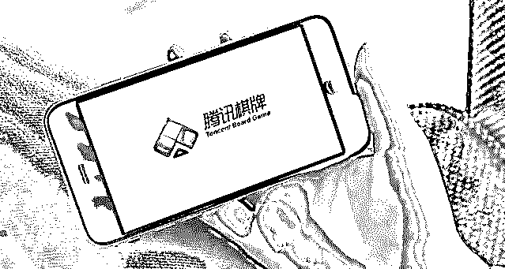
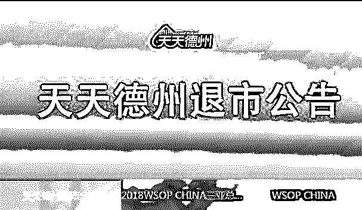
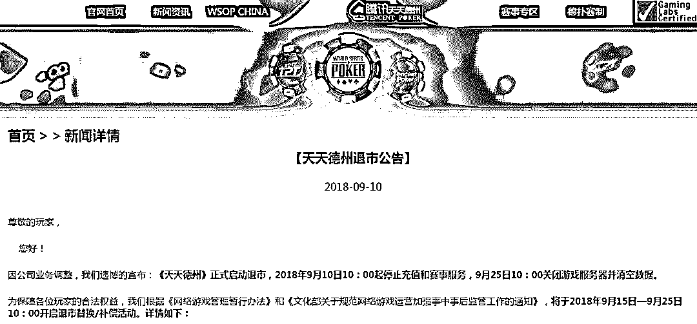
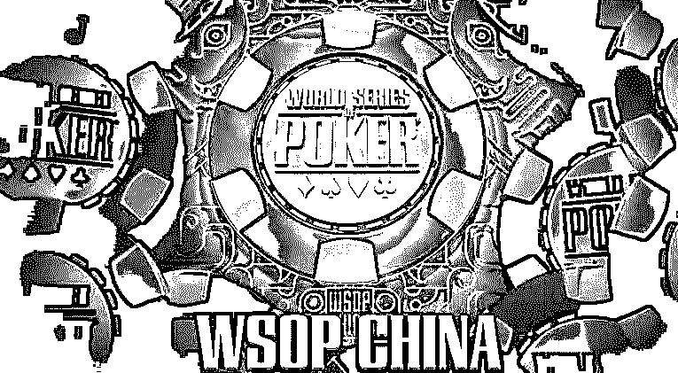
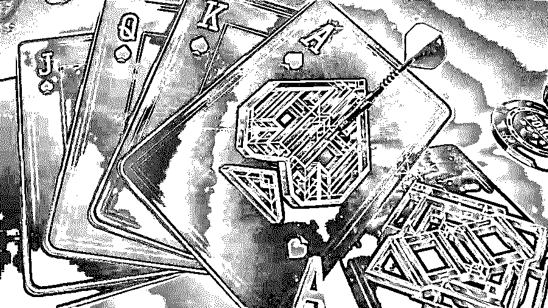
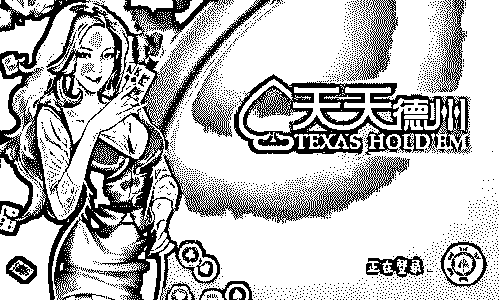

# 别了，《天天德州》| 凉了，德州扑克 ！

> 原文：[`mp.weixin.qq.com/s?__biz=MzIyMDYwMTk0Mw==&mid=2247493274&idx=1&sn=b33ffeac89d4abf7166595882c466606&chksm=97cb2da2a0bca4b4386176ff7af631cc068702091b4137d323d426ba6f96300fd9fb96c32e9a&scene=27#wechat_redirect`](http://mp.weixin.qq.com/s?__biz=MzIyMDYwMTk0Mw==&mid=2247493274&idx=1&sn=b33ffeac89d4abf7166595882c466606&chksm=97cb2da2a0bca4b4386176ff7af631cc068702091b4137d323d426ba6f96300fd9fb96c32e9a&scene=27#wechat_redirect)

**点击上方蓝色字体“灰产圈”关注并置顶本公众号**

导语

2018 年，版号关闭、网游总量调控、游戏专项税让游戏行业“风声鹤唳、草木皆兵”。

一直以来棋牌游戏一直是灰色产业滋长的温床，就连腾讯也没能避嫌。

在五月份的时候灰产圈就发布过联众涉赌事件 ：

[《一首〈凉凉〉送给联众：因涉赌 36 人被捕，涉赌资金 3.35 亿元!》](http://mp.weixin.qq.com/s?__biz=MzIyMDYwMTk0Mw==&mid=2247491646&idx=1&sn=b29e9d409a802564190d865be2ce0ade&chksm=97cb2b06a0bca2101c3fbaa590f0888e586183243d43e34d33d620d811e0c35b0fc93251d42b&scene=21#wechat_redirect)

也许联众的滑铁卢，早就为《天天德州》事件埋下伏笔，棋牌游戏要变天了。

**《天天德州》退市**

2018-9-10，腾讯棋牌类游戏“天天德州”发布公告，称该游戏将正式启动退市，9 月 10 日 10：00 起停止充值和赛事服务，9 月 25 日 10：00 关闭游戏服务器并清空数据。公告称，天天德州根据《网络游戏管理暂行办法》和《文化部关于规范网络游戏运营加强事中事后监管工作的通知》，将于 2018 年 9 月 15 日—9 月 25 日 10：00 开启退市替换/补偿活动。 

目前，这款游戏在微信游戏畅销榜上排名第 30，而在棋牌榜则是位居第二，仅次于《天天斗地主》。 

据公开资料显示，《天天德州》前身为《QQ 德州》，该游戏于 2012 年上线，发展至今一直颇受用户欢迎，收入相当稳定。目前，该游戏在微信游戏畅销榜上排名第 30，在棋牌榜则是位居第二，仅次于《天天斗地主》。

另外，除《天天德州》外，腾讯系棋牌游戏已悄悄下线了房卡模式(即游戏公司售卖房卡，用户购买房卡并自行组人线上开局)。《腾讯欢乐麻将》、《贵州麻将》、《欢乐斗地主》等棋牌均下架好友房模式。

腾讯大规模下架房卡模式是因为腾讯有关人员曾去北京开会，有关部门反映大量用户投诉其棋牌游戏为赌博提供了便利，故对棋牌游戏中最容易触线的房卡模式做了以上调整。

同时，《天天德州》一直是一款备受争议的游戏。“我不杀伯仁，伯仁却因我而死”，虽然腾讯方面一直在保证不涉及赌博，并且也出台了一系列防治措施，但由于《天天德州》天生的竞技性以及庞大的用户数，它依然为赌博提供了滋长的平台，甚至成为了“事实赌场”。

**成于“币商”败于“币商”**

为什么这么火的游戏，说撤就撤？

腾讯官方的回应是“公司业务策略调整”。我认为这款游戏被撤，其直接原因，其实是涉及到赌博的灰色产业。

我们都知道，腾讯是非常认真地希望杜绝赌博的发生的，但是这种竞技类游戏，存在着天然的不确定性，也就是有输赢。如果这种输赢，代价都是没有什么价值的虚拟金币，也就不会形成赌博。

但是恰巧，移动支付和币商的出现，让金钱加入了这场游戏，于是就形成了灰色的赌博产业链。大多数情况是以下两种：

一款游戏为何会让普通玩家的心态从竞技、休闲，异化为实质的赌博行为，且导致了众多玩家倾家荡产，这其中的缘由值得探索。

为此，我们专程采访了某棋牌大佬：**KK**

在灰产圈的采访中，**KK**指出了几个关键要素的存在。

**其一，是币商的存在。**

为配合游戏内大额筹码场的需要，大量币商充斥于游戏内，令德州币与人民币在线下形成极为便利的双向兑换。

期间，天天德州世界排名榜上位居前列的账号均为币商，他们会在头像上写有 XX 在线，并附有微信或 QQ 号，在游戏内散布大量买卖金币的信息，并长期将汇率控制在 7200-7400 之间。

他们身上携带几十亿甚至上百亿金币，并拥有众多小号。玩家通过第三方支付转账给币商后，币商与玩家进入贵族房开局，起身弃牌将金币转移给玩家。

**（由于是玩家先交易人民币给币商，币商再从游戏内转移金币，或玩家先转移金币给币商，币商再付款，仅靠币商的诚信来维系，因而玩家要承受极大风险）**

**其二，是游戏机制本身，大额豪赌让玩家陷入疯狂。**

尤其是 2014 年 10 月，腾讯游戏官方设置了包含 2 万金币到 2000 万金币不等的十多个必下场玩法，极大刺激了玩家的投入。

KK 透露，身上要有 3 亿的金币才能进入 2000 万必下场。在发牌前，玩家会被默认压 1 亿筹码在桌面，系统再会抽出 2000 万筹码放在底池，底池总共有 1 亿 2000 万筹码，这极大刺激了每个人用身上 8000 万筹码去博 1 亿 2000 万筹码的进程。丧失自制力的玩家疯狂跟投，一局 2000 万的必下场有时不到一分钟就能打完，几乎没有任何时间考虑打牌技巧和出牌策略，输掉几十亿游戏币的大有人在。

如果必下场还算是玩家之间的斗智力、动脑筋的竞技，那么在 KK 看来，每局结束的买 AA 压赔率（在桌面以外筹码内扣去，多大场就要买多大额度。

例如，2000 万必下场就要买 2000 万，买中赔 40 亿），斗牛压大小等等游戏无异于真正的赌场模式，强化了游戏的赌博性质。（注：这些游戏模式，在真正的德州扑克里均没有）

**其三，团伙诈骗及双簧的存在。**

多名事先认识并同时参与牌局的玩家，联合给普通玩家下套。使用盗号、外挂、双簧作弊欺诈等方式，并利用同场观牌的托儿干扰普通玩家的情况下，诱骗普通玩家落败，大量盗刷和骗取玩家的德州币。

这三种情况，不管腾讯怎么监管，总是无法杜绝。于是腾讯选择放弃了这个火爆的游戏。

棋牌游戏如何“自保“？

关于如何规避涉赌问题，尤其是房卡类较为触线的棋牌游戏，对于棋牌游戏企业尤其是房卡平台，风控原则是不组织线下游戏，不参与线下游戏，不指导线下游戏。

棋牌游戏企业应建立代理风控体系，具体体现在招募代理、代理合同审核、代理提成规范等方面。

以招募代理为例，平台要注意几点问题：

第一，不建议进群审核。在房卡类棋牌游戏中，招募代理若采用微信群聊方式，一般都有人数的要求。有些棋牌公司会让客服进群审核，甚至要花费几天甚至一周监控该群。从控制风险的角度，不建议客服进群审核。

第二，不指导代理发布群规。群规可以由代理自行组织和发布，棋牌平台只需告知要点即可。另外，在给出要点的过程中，也不能出现赌博字眼。

第三、不组建代理微信群。棋牌公司和代理的联系应该是一对一的沟通，这样能更有效的规避风险。其他诸如代理合同审核、代理提成规范也是风控要点。

另外，棋牌游戏企业还要规范客服沟通内容，市场推广和客服在面对大量的咨询时需要注意言辞，包括对代理的沟通规范，也包括对玩家的沟通规范，保证棋牌平台不涉及线下输赢问题。游戏平台股东、员工不参与线下赌博，并频繁提示玩家禁止赌博。

**结尾**

正所谓,穷则变，变则通。游戏行业发展至今已有多年，从端游、页游再到手游。而今，新一轮的变革似乎也已开始，棋牌游戏企业乃至全品类游戏棋牌应当顺应时势，谋变求生。

当然，我们也知道，灰产是会永远存在的，甚至棋牌游戏的活跃度很大程度上要归功于灰产。

只不过，对于现在的腾讯来说，这类钱估计是没胆挣了。

* * *

**【灰产圈】高端社群小程序开通，2018 最值得加入的社群！** 

<mp-miniprogram class="miniprogram_element" data-miniprogram-appid="wx4f706964b979122a" data-miniprogram-path="pages/topics/topics?group_id=881854415822" data-miniprogram-nickname="知识星球" data-miniprogram-avatar="http://mmbiz.qpic.cn/mmbiz_png/kialtkOXGKS7D9hZrmO2jzDqryXXTAlhxSpnrKnHGV65KXzicibOppaPic4dCRxftvabB8Iqswo3OuQEDSxE7NicXBg/0?wx_fmt=png" data-miniprogram-title="【灰产圈】高端社群" data-miniprogram-imageurl="http://mmbiz.qpic.cn/mmbiz_jpg/WWG78hysZ0brJkWoyG2VDIacqgQjkDfp6mLiaoPBJ2SgWZHtRuTw7ia8kpoxntsn7PiaFOQO2U23FW6Iry0gS1GnA/0?wx_fmt=jpeg"></mp-miniprogram>

**点击加入【灰产圈】高端社群**