# 越同意，越放肆！99.9%的 App 正在窃取你的隐私！中国人隐私不值钱？

> 原文：[`mp.weixin.qq.com/s?__biz=MzIyMDYwMTk0Mw==&mid=2247492844&idx=1&sn=1527f27b182845af79c5d46fc58755b9&chksm=97cb2fd4a0bca6c205dc4c8b6ce28a1570edcec0ace210cc4e542bacf55b2f27e221a97b478e&scene=27#wechat_redirect`](http://mp.weixin.qq.com/s?__biz=MzIyMDYwMTk0Mw==&mid=2247492844&idx=1&sn=1527f27b182845af79c5d46fc58755b9&chksm=97cb2fd4a0bca6c205dc4c8b6ce28a1570edcec0ace210cc4e542bacf55b2f27e221a97b478e&scene=27#wechat_redirect)

**点击上方蓝色字体“灰产圈”关注并置顶本公众号**

**导语**

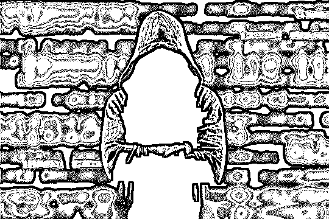

国内隐私泄漏的严重程度，大家都是心知肚明的。隐私泄露早已经成为了互联网时代的日常，什么大数据时代你懂的，就是掌握多数人的数据，包括他们的位置、爱好，买过什么、想要买什么!等等等等等等……。少数人们对此怨气满满，但是大多数人还是麻木不仁漠不关心的!

**国人的隐私是否真的不值钱？**

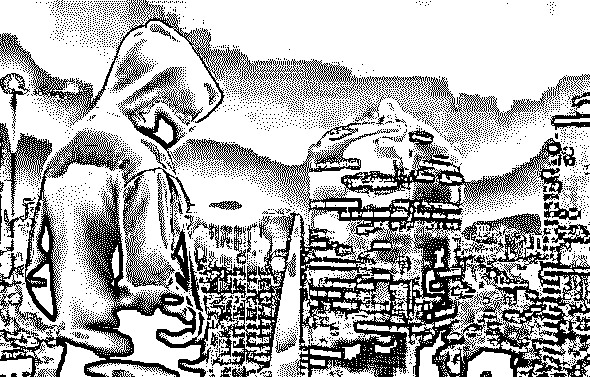

　　的确，国内的隐私泄露问题无比严峻，特别是进入到了移动互联网时代后，各家互联网厂商大显神通，令人惊叹于一个个表面光鲜的正规企业原来竟能有如此吃相。特别是在安卓平台上，App 们对用户隐私的拿取可谓是丧心病狂。这具体表现在哪里？这就来看看吧。

　　**同一个 App，国内版竟要求更多权限**

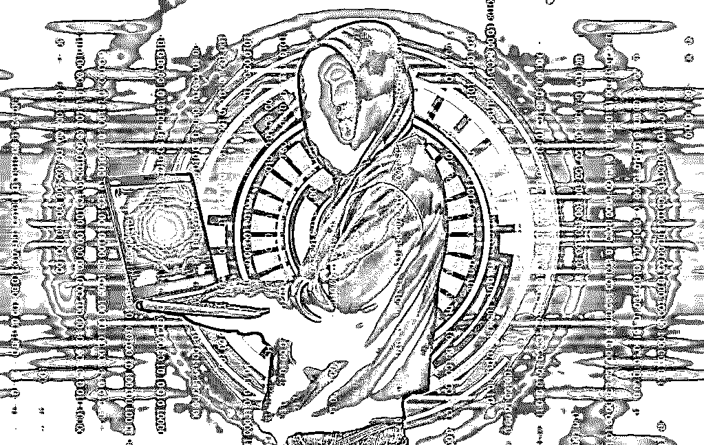

　　在国内随便找一个 App 安装，你往往会碰到长得令人头疼的权限申请列表，这点相信大家在日常使用中早已经深有体会。但是，很多人或许并不知道，这种现象往往是国内版本的 App 特有的。同一个 App，国际版本所申请的权限，很多时候要比国内版的要更加干净！

　　这并非是灰产哥危言耸听。如果你有条件到 Google Play 上逛一逛，会发现某些国内常见的 App 也有上架。

但和国内版本不同，这些在 Google Play 上架的国产 App，对权限的渴求却并没有国内版本那么丧心病狂。

例如，最近全世界人民都喜闻乐见的吃鸡官方手游，腾讯也在 Google Play 上架了《绝地求生：刺激战场》的国际版本《PUBG MOBILE》。

但和国内版本不同，国际版的《PUBG MOBILE》只申请了 14 个权限，而国内版的《绝地求生：刺激战场》却申请了 31 个权限！

这是否真的有必要呢？

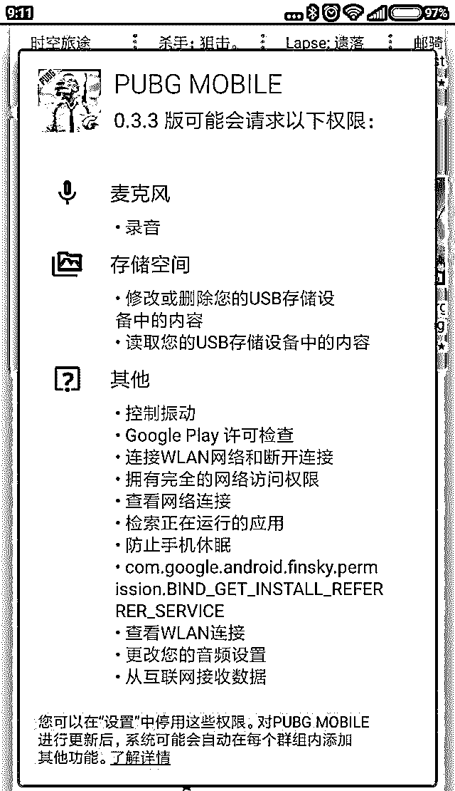

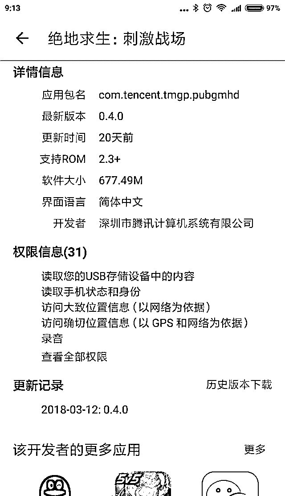

**同样的游戏，国际版（左）所需的权限就是要比国内版的更少**

　对比两个版本的官方吃鸡，可以发现很多涉及隐私的权限申请，在国际版本都没有出现。例如，国内的《绝地求生：刺激战场》会申请 GPS 定位，会申请修改系统配置，会申请开机启动，这些权限在国际的《PUBG MOBILE》都是没有申请的。

　　此种现象是否国产 App 独有？并非如此。一些来自国外的 App，国际版本同样要比中国版所申请的权限要更少。例如亚马逊官方商城的 App，在 Google Play 上架的版本申请了 21 个权限，而在中国发行的版本却足足申请了 41 个权限之多。

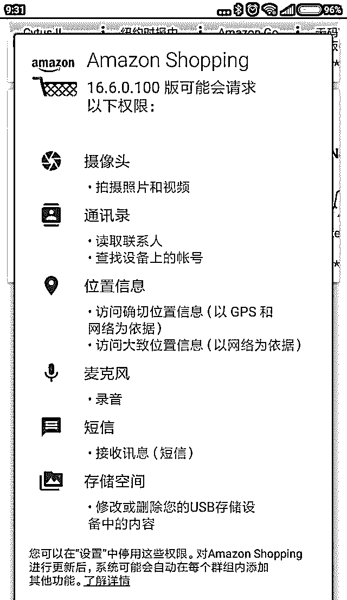

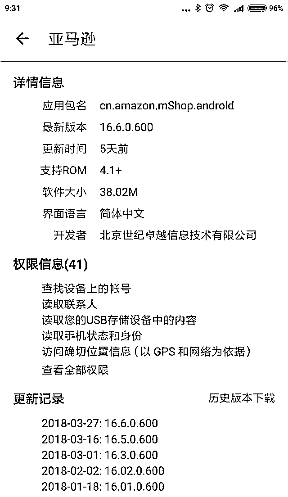

**亚马逊国际版（左）和国内版相比，不仅国产 App 如此，国外的 App 也是如此，国际版的权限更少**

　　为何同一个 App，国内版会要求更多权限呢？原因是多方面的。

例如，国际版本的 App 能够调用 Google 服务框架去实现推送、记录等功能，而国内 App 却没有这个条件——Google Play 服务和国内是绝缘的，为了实现类似功能，国内 App 只能利用一些第三方 API，而这些 API 通常需要 App 申请额外的权限才能接入。

又例如，Google Play 的隐私政策虽然宽松，但还是存在的，而国内基本就没这回事。

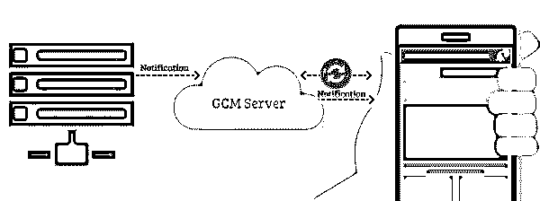

**国内无法使用 Google 服务，很多 App 依赖第三方 API 实现推送等功能，这会申请额外多的权限**

　　种种因素作用下，国内版本 App 会索取更多权限，也就不足为奇了。虽然一些国内版本的 App 索取更多权限是为了实现正常功能，而不是为了偷隐私，但索取更多的权限，在很大程度上就增加了泄漏用户隐私的风险——就拿接入第三方 API 为例，你很难保证这个第三方 API 是否会出卖用户隐私。即使公司不会，那公司员工呢?在 Google Play 无法正常使用、国内统一推送联盟又未成型之际，恐怕用户还得忍受这种现状好一段时间。

**你有权限管理系统？不给权限不许用**

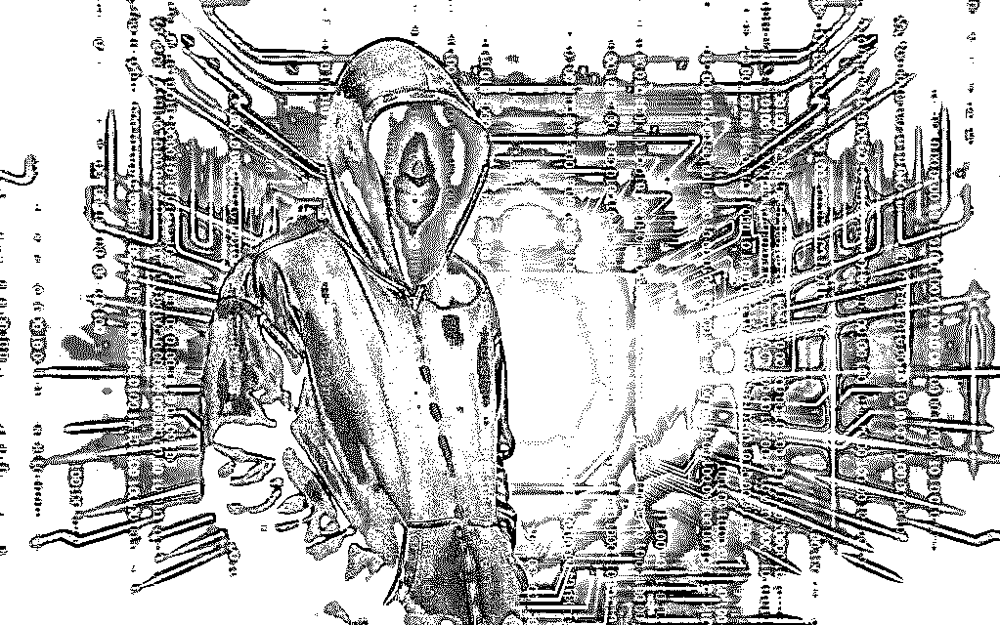

安卓在近年来也是越来越注重隐私和安全的问题，目前就算是原生版本的安卓系统，也已经加入了大家喜闻乐见的权限管理系统。

利用系统的权限管理系统，用户可以控制某个 App 是否能够使用某项权限，而在之前，使用某个 App 必须全盘接受该 App 所申请的所有权限。

权限控制系统普及有，有用户感叹道，这下终于不必被 App 强奸了，但事实是否真的如此？

　　所谓道高一尺魔高一丈，在权限管理方面，国内的 App 们上演了一出典型的“上有政策下有对策”。

你的确可以禁止某些国产 App 申请某项权限，但这样做后，该 App 可能就直接拒绝打开了。没错，就算有权限管理系统，你不接受该 App 的权限申请，就算你装上了这 App 也压根没法用。

App 往往会给出一个看似理直气壮的理由，例如某权限是功能实现必不可少的组成部分，没有了该权限 App 可以拒绝运行等等。然而，这理由是否站得住脚呢？

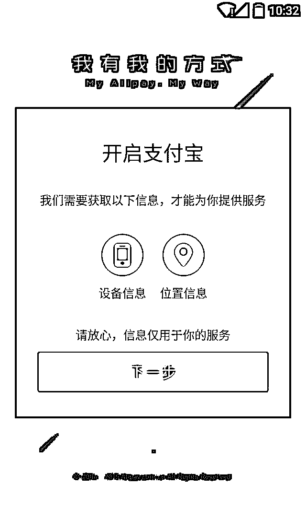

**某些 App 不给权限，就拒绝提供服务**

　　实际上，禁用某个权限，的确可以令 App 无法使用相应部分的功能。例如，如果拒绝赋予 App 摄像权限的话，那么扫描二维码之类的功能就形同虚设了。

但是，无法使用 App 内的某个功能，并不等同于无法使用某个 App，如果一个 App 调用不到摄像头权限，然后拒绝为你提供浏览网页、即时通讯等等功能，怎么看也像是霸王条款。

　　按照常理，App 调用某个权限，应该发生于激活涉及该权限的功能之时。但是，很多国内 App 在开启应用的同时，就会检查权限是否健全。例如，开启了某个 App，还未点开二维码扫描，就已经弹出摄像头权限的申请框了。

正是这种滥用权限的现象，令 App 得以绑架用户必须赋予某某权限，让权限管理系统形同虚设。

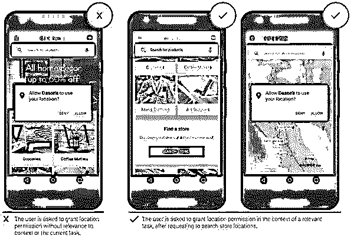

正确的权限调用机制应该是这样，某功能需要用到权限，才弹出申请

　　幸运的是，现在已经越来越少 App 使用此种策略了。如果想要彻底防范这样的情况，恐怕用户必须得折腾一个能够赋予 App 假权限的管理系统，Xposed 框架中就有类似的工具。

不过，这样的折腾方法始终门槛太高，如果一个 App 决心不给权限不许用，恐怕大部分用户还是得咽下权限捆绑的大礼包。

**这些 App 国内很流行，但你可知有多大的隐私风险**

　　国内 App 拿权限已经是家常便饭，无论是什么浏览器 App、天气 App、聊天 App，旅游 APP、外卖 app、不拿你几十个权限都不好意思。但是，某些 App 天然就比其他 App 更加容易泄漏隐私，这类 App 在国内风行，但很多人却没有注意到其中的危险性。

前段时间，官媒点名批评 WiFi 万能钥匙泄露隐私，令很多人对 App 的节操感到忧心忡忡。关于 App 是否会窃取隐私，其实大家都心知肚明，看着国内流行那些 App 们长长的权限请求列表，你要说它们都能老老实实对隐私只手不伸，在座各位也不会相信。而某些种类的 App，天生就比其他 App 更容易接触到用户的隐私，这些 App 甚至还切实爆出过泄漏隐私的丑闻。哪些 App 对隐私威胁尤其大？

> **WiFi 共享类 App**

不少朋友都会使用 WiFi 共享类 App（不一定是 WiFi 万能钥匙）来尝试蹭网，但是此类 App 之所以能让你连上某些加密 WiFi，靠的必然是庞大的 WiFi 密码数据库。而这数据库之中，是否会存在用户不知情下泄漏出去的隐私？这是非常值得担忧的。

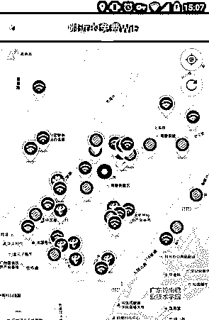

WiFi 共享 App 会将密码这类上传到云端，存在被滥用的风险

WiFi 共享功能长久以来，都伴随着泄露隐私的争议。

例如，著名的国产 ROM MIUI 一度将 WiFi 共享作为卖点，允许用户将 WiFi 密码分享到云端，结果引来了口诛笔伐，现在已经将共享方式修改为不易在公众传播的二维码；

而手机 QQ 也一度内置 WiFi 共享功能，帮助用户连接热点，但在舆论压力下，相关功能已经被打入冷宫。

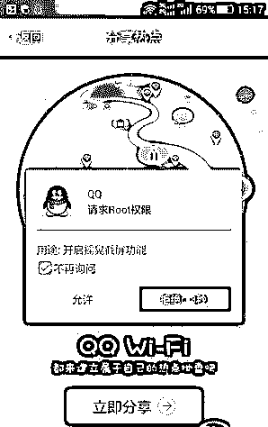

使用一些 WiFi 分享 App，意味着把无线网络的隐私给对方任人鱼肉，但遗憾的是很多国人都没有意识到这点。

> **广告过滤 App**

说起什么功能最受国人欢迎，广告过滤或许能够得到提名。在移动互联网时代，广告犹如黄河泛滥一发不可收拾，为了围堵这些垃圾信息，很多朋友都会选择广告过滤 App，尤其是能够作用于全局的广告过滤 App。

然而，很多人并没有意识到，这类 App 天生就是隐私泄漏的温床。

很多朋友都热衷于使用全局过滤广告的 App，这类 App 不仅能够过滤掉网页广告，甚至还能够过滤掉 App 的广告推送乃至内置广告。

然而，大多数人对这类广告过滤 App 的原理并不知其然，这类 App 会建立本地网关，将用户所有网络连接的流量置之眼皮底下。

一旦流量某些内容和广告过滤规则匹配，那么广告就会从流量中剔除，从原理来看，这类 App 过滤广告是靠谱的，而实际效果也的确有口皆碑。

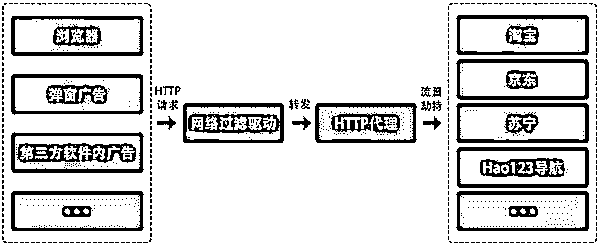

把流量交给广告过滤工具，也意味着把隐私完全交到了别人手里

然而，这类原理的广告过滤 App，却蕴藏这泄漏隐私的风险。利用网关接管你所有的流量，意味着它除了能对广告为所欲为，对其他流量也能够为所欲为。而事实上这类 App 也没有令人失望，爆出了暗藏恶意代码劫持流量的丑闻。

根据著名安全常识火绒的播报，广为流行的去广告软件 AdSafe 存在流量劫持的行为

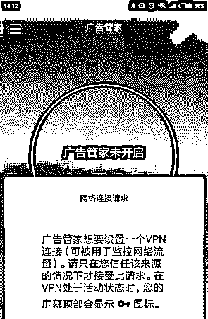

手机上全局去广告 App 会用 VPN 接口掌控全局流量，理论上你上网干了啥都能被看得一清二楚

目前 AdSafe 等去广告软件在安卓上也存在对应的版本，这类 App 会利用 VPN 来建立安卓的本地网关，有能力劫持流量。

> **安全/杀毒 App**

无论在 PC 还是在手机上，安全类软件所获取权限之多，已经能在各类软件中名列前茅。

在手机上，如果系统已经 root 了，那么安全软件更是能够为所欲为，

某个安全 App 甚至爆出过私自修改 Recovery 分区、导致 ROM 无法正常升级的恶劣事件。安全软件的节操是否信得过？起码注重保护隐私的苹果对它们说不。

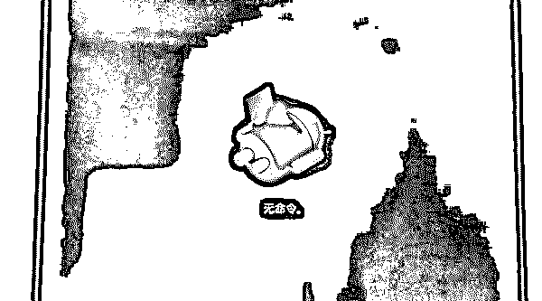

某安全厂商就出品过破坏 Reocvery 的产品，你放心把隐私交给如此节操的厂商么？

> **网盘/云备份类 App**

这类 App 可谓是移动互联网的核心价值之一了，随时随地联网被数据备份到云上，已经成为了很多人的习惯。

这的确能够带来很多便利，例如可以方便地在多平台同步资料，能够无缝更换新设备使用，但是，这从客观上也给隐私带来了风险。

事实上，网盘/云备份数据泄漏的事故，也并非没有发生过。

这些事故一部分源于人们的使用疏忽，例如使用云备份功能时，没有将备份设为私密数据，以至于在搜索引擎中就能够找到大量隐私;

找这些数据的一大经典方法，就是在搜索引擎中输入：来自 iPhone;来自 DCIM;等关键字。

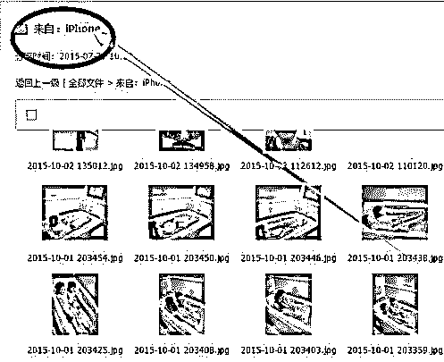

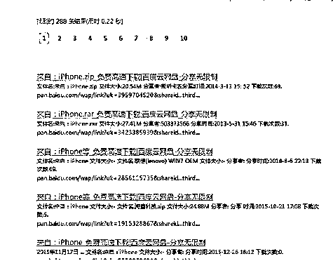

网盘使用不当，太容易泄漏隐私，分分钟变陈老师，使用必须要慎之又慎

除了人们使用不当，云服务商的疏忽也会导致隐私泄漏。

> **智能设备及其 App**

随着移动互联网的发展，物联网渐渐成型，智能设备也越来越多进入到千家万户中。配合 App，智能设备的确可以帮助人们做很多事情，但是不少人都没有意识到，这些智能设备及其 App，其实是天生的隐私扒衣者。

一方面，智能设备们往往拥有出色的隐私数据收集能力，无论是智能手表上的生物感应器、扫地机上的激光探头，还是智能摄像头的红外夜视模式，分分钟就能比天天都赖着你的女朋友更了解你。

其次，配合 App，智能设备是你隐私数据的积极传递者，敢把智能旗号打出来的产品，基本上就敢往网上上传你的隐私数据。

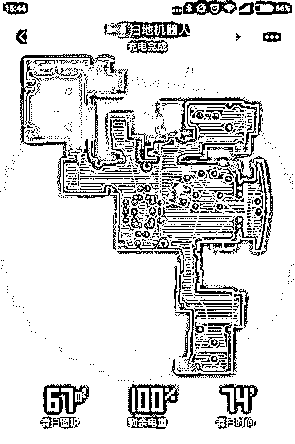

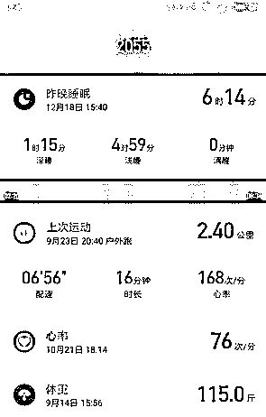

智能设备是天生的隐私收集者，家里什么布局、每天走多少路、睡多久，都能记录得一清二楚

智能设备并非没有爆出过隐私泄漏方面的丑闻。例如前一阵子，多个黄网上都爆出了大量偷拍的性爱视频，这些视频还打着某著名智能摄像头的水印；又例如某智能路由器，不但劫持用户上网流量、对网页内容偷天换日，还会向服务器发送用户访问过的链接以及与之相关的设备信息，这些信息被不少人视为隐私。

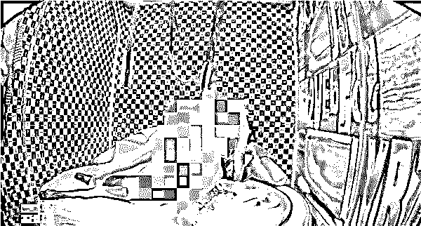

黄网上曾传出大量打着某智能摄像头水印的大尺度视频，由于可能水印是伪造，因此水印打码处理

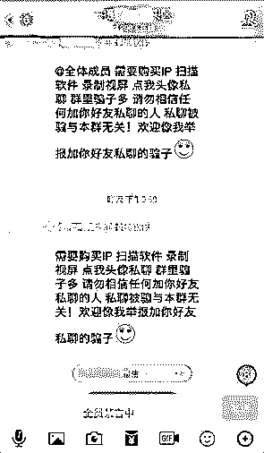

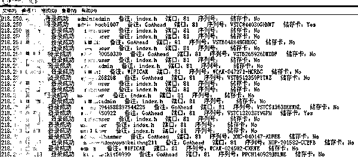
**只要花一点钱，就可以买到网络摄像头的登录信息，隐私荡然无存（图片来自网络）**

> **附： 2018 中国手机 APP 隐私权限测评报告（来自艾媒咨询）**

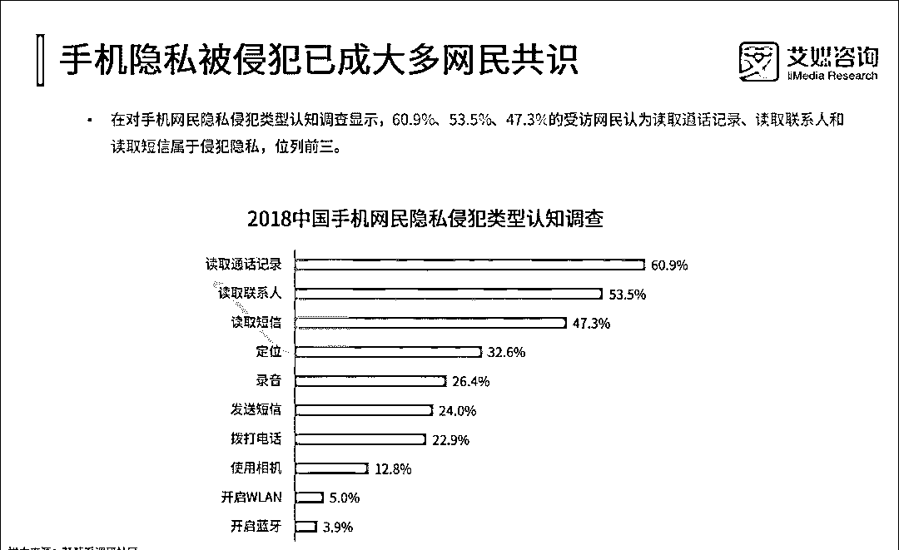

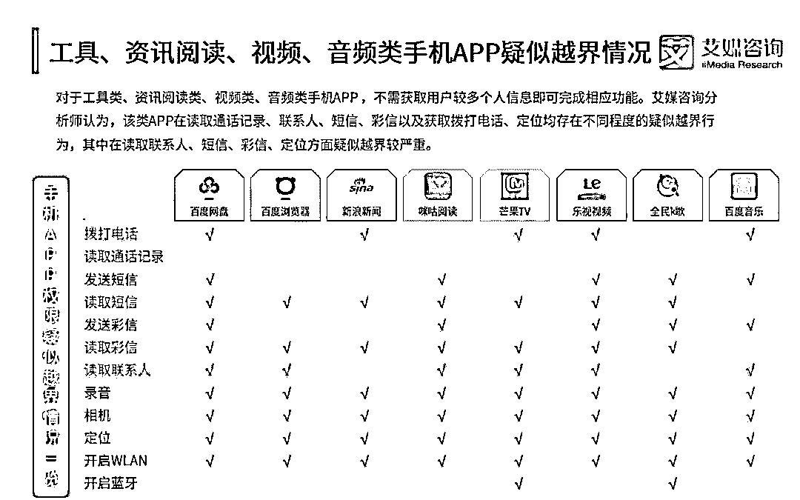

**结尾**

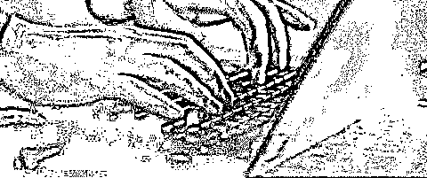

除了上面提到的领域外，其实还有很多应用都对隐私存在威胁，例如我们每天都要接触的带云服务的输入法、云笔记等等。

随着移动互联网的发展，威胁到隐私的应用只会越来越多，人人门前一亩三分地无人来犯的互联网田园时代，早已成为绝唱。

把流量交给广告过滤工具，也意味着把隐私完全交到了别人手里

中国人是否真的对隐私不敏感？种种例子表明，这的确是真的。更多的人并不关心 App 索取了多少个权限，并不关心某个功能是否存在什么风险，只要软件应用能工作就行。

在这个移动互联网时代，还会有越来越多的 App 乃至各种技术，以智能的名义索取更多的隐私。

隐私的泄漏如果没有得到有效控制，“智能”恐怕最终能进化到比你还了解你自己的程度，这是否会是好事？

这个问题还是交给时间来回答吧!

* * *

延伸阅读[个人隐私交易黑市大起底：是谁在盗贩公民信息？](http://mp.weixin.qq.com/s?__biz=MzIyMDYwMTk0Mw==&mid=2247492647&idx=1&sn=07b195ad56c8bb4c466c1ff6f3ee64d9&chksm=97cb2f1fa0bca609fe8344d8f16ed9d7fa417bbcfc3eed420d8d8ed3261c84ca5b227a665ab4&scene=21#wechat_redirect)
[深度：信息买卖黑链：淘宝 25 页和京东 3 年数据仅需 1 元，揭秘你的信息是如何被黑市买卖的。](http://mp.weixin.qq.com/s?__biz=MzIyMDYwMTk0Mw==&mid=2247489263&idx=1&sn=e1baf7a32570e65968fd8ab3bfee5649&chksm=97c8ddd7a0bf54c151b62d46024846d2eb1e6b07c55d69bc46d515284d275c858aefbc128be4&scene=21#wechat_redirect)
[起底 Steam 背后黑色产业链 : 黑市、洗钱和诈骗，年产值十亿美金！](http://mp.weixin.qq.com/s?__biz=MzIyMDYwMTk0Mw==&mid=2247492432&idx=1&sn=8287cae2c3fe28530c4f274bff47523d&chksm=97cb2868a0bca17e129b1a7a177dab6e697b4530cffc47928ce2fdd00d6b8b6c5ec743112b44&scene=21#wechat_redirect)
[灰产哥：揭秘支付宝上亿规模的灰色产业链](http://mp.weixin.qq.com/s?__biz=MzIyMDYwMTk0Mw==&mid=2247488670&idx=2&sn=0b1555b80378f69625905a1e2efcdb32&chksm=97c8dfa6a0bf56b07d3cfb2141e0ef0ea96a4a62fcccb2fd3bf106fae7ebfd5af0ad836a3abb&scene=21#wechat_redirect)
[淘宝开了一家大型网上“赌场”，无数人深陷其中家破人亡，但却合法！](http://mp.weixin.qq.com/s?__biz=MzIyMDYwMTk0Mw==&mid=2247489631&idx=1&sn=90408e3c8eb9c314cc991a22fdb181ce&chksm=97c8d367a0bf5a71575aa731aa1907377f64f1427091d63805cff964e020e5f4af4c0f67bea5&scene=21#wechat_redirect)

* * *

****【灰产圈】高端社群知识星球小程序已开通****

**<mp-miniprogram class="miniprogram_element" data-miniprogram-appid="wx4f706964b979122a" data-miniprogram-path="pages/topics/topics?group_id=881854415822" data-miniprogram-nickname="知识星球" data-miniprogram-avatar="http://mmbiz.qpic.cn/mmbiz_png/kialtkOXGKS7D9hZrmO2jzDqryXXTAlhxSpnrKnHGV65KXzicibOppaPic4dCRxftvabB8Iqswo3OuQEDSxE7NicXBg/0?wx_fmt=png" data-miniprogram-title="【灰产圈】高端社群" data-miniprogram-imageurl="http://mmbiz.qpic.cn/mmbiz_jpg/WWG78hysZ0brJkWoyG2VDIacqgQjkDfp6mLiaoPBJ2SgWZHtRuTw7ia8kpoxntsn7PiaFOQO2U23FW6Iry0gS1GnA/0?wx_fmt=jpeg"></mp-miniprogram>**

****

****点击加入【灰产圈】高端社群****