# 吓 skr 人：一夜清零，一无所有！GSM 劫持？短信嗅探？揭秘银行卡盗刷灰色产业链！

> 原文：[`mp.weixin.qq.com/s?__biz=MzIyMDYwMTk0Mw==&mid=2247492798&idx=1&sn=3de4adf3e559bde60f7b2b8d614a94ed&chksm=97cb2f86a0bca69049d22e974965dbbc09d9850f3abca5fc2aaf51feff4f9a1d173b6c0fd6de&scene=27#wechat_redirect`](http://mp.weixin.qq.com/s?__biz=MzIyMDYwMTk0Mw==&mid=2247492798&idx=1&sn=3de4adf3e559bde60f7b2b8d614a94ed&chksm=97cb2f86a0bca69049d22e974965dbbc09d9850f3abca5fc2aaf51feff4f9a1d173b6c0fd6de&scene=27#wechat_redirect)

**点击上方蓝色字体“灰产圈”关注并置顶本公众号**

**导语**

**“一夜之间，支付宝，京东，银行里面的钱全部没了，真是一无所有，此刻心里特别没有安全感！”**

这是网友：独钓寒江雪 30 号凌晨点左右在豆瓣发帖时所说的一段话，看完的我，除了同情理解此刻心情之外，考虑更多的是，此类事情如果发生在自己身上，我该去找谁？此类情况，又该如何防止呢？

**银行卡余额一夜清零，一无所有！**

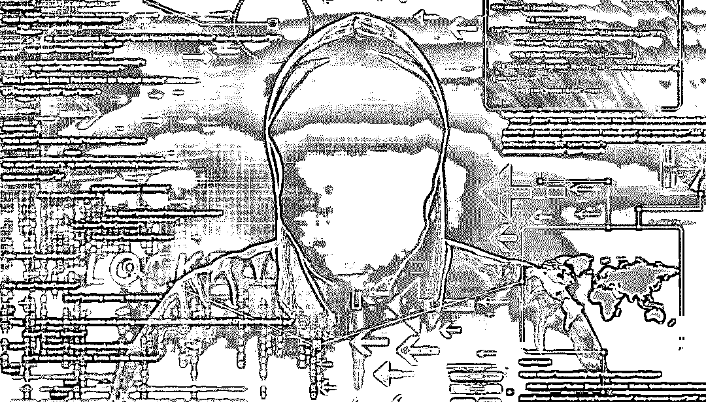

这位网友独钓寒江雪在豆瓣上发了一篇名为《这下一无所有了》的文章，文章中他说道：

”**支付宝，余额宝、余额和关联银行卡的钱都被转走了。京东开了金条、白条功能，借走一万多。**“

并且花了两天时间去了银行，找了保险公司，打了支付宝客服电话，京东客服电话等，均被拒绝受理了，无奈之外，只好发帖诉说自己心中的苦恼。

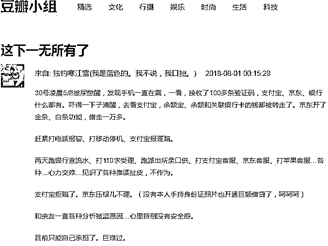

“独钓寒江雪”称，其在 7 月 30 日凌晨 5 点多醒来后，手机便一直收到短信息，总共 100 多条。

这些信息是分别来自支付宝、京东、银行等的短信验证码，然后发现“支付宝、余额宝、余额和关联银行卡的钱都被转走了。京东开了金条、白条功能，借走一万多。

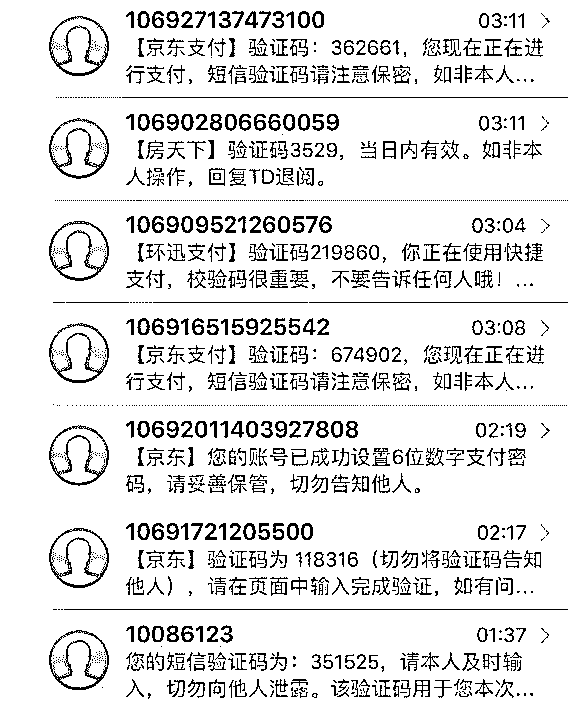

在设备使用记录上，她查到 7 月 30 日凌晨 1 点 38 分，一台名为“Milhouse the Fancy”的手机登陆了她的 icloud 账户。

支付宝消费记录显示，1 点 49 分，她的账户在谋网游数卡专营店消费 932.31 元。3 点 59 分，她的账户在线支付了南宁某酒店一晚的住宿费 723 元。

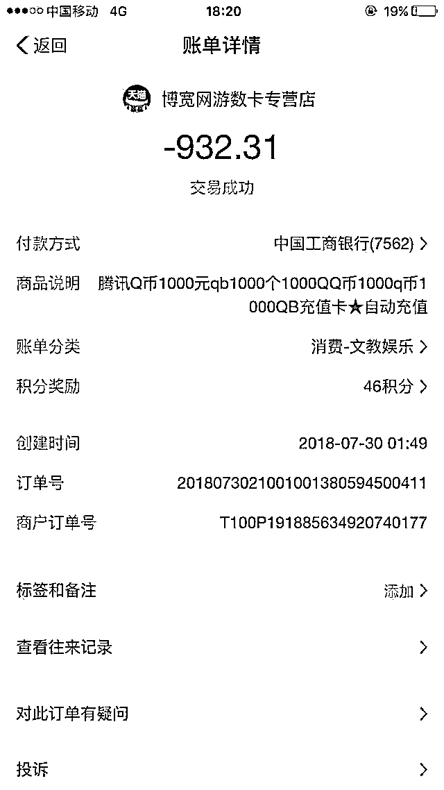

除此以外，短信提示她，京东显示开通了金条、白条功能，借款共计一万多元。

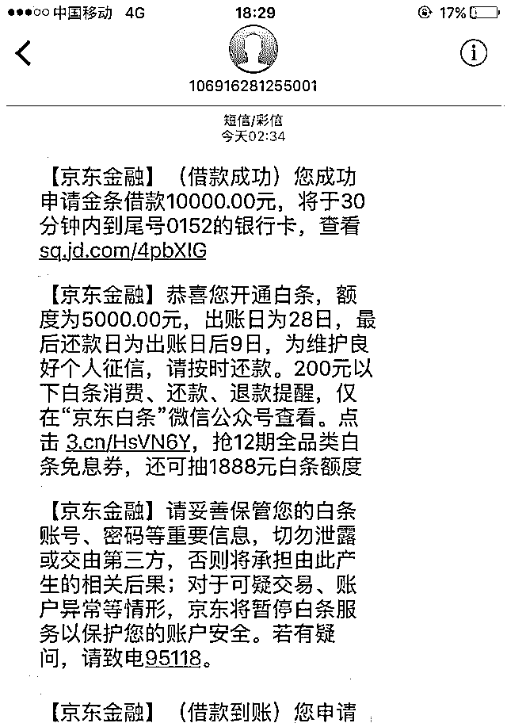

豆瓣这一贴，没想到快速手到了众网友的关心与支持，热度随着时间的推移，逐渐上升，终于迎来了转机，支付宝，京东等官方开始重视此事，并做了相关回复，下面将会为你逐一道来。

在此之前，代表“独钓寒江雪”用户感谢众网友的支持！

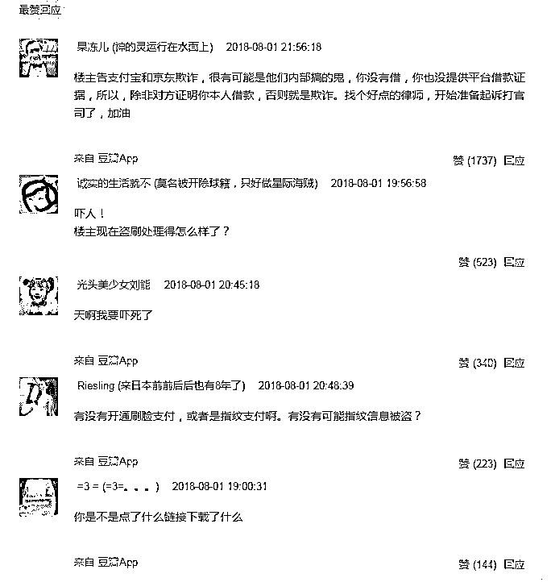

**以上截图为热门评论：**

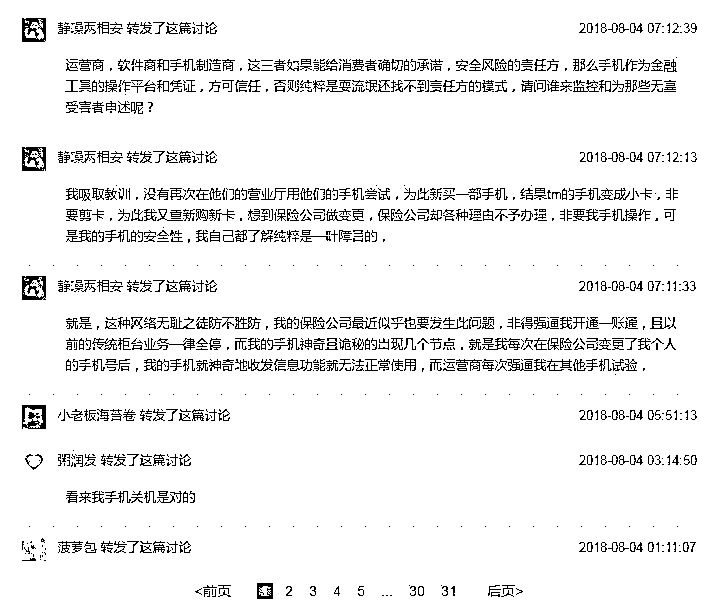

**以上截图为豆瓣网友转发信息（可以看到转发页数 31 页）**

**问责京东和支付宝！**

经查询，在京东官网上开通京东白条功能需要填写姓名、身份证号、联系地址等信息，并且绑定一张银行卡。

而京东金条属于信用借款产品，能否开通是系统综合评估的，目前不支持主动申请开通。

明明是需要进行身份认证的信用产品，却未经本人同意就开通了？

于是她赶紧打电话报警，并且联系京东和支付宝客服。京东客服表示，购买金条需要上传本人手持身份证照片。

她表明自己并没有提供过相关信息，并且要求客服核查，并没有得到有效回应。支付宝方面则回复，该女士的账户的实际操作情况，经保险公司综合判断不在理赔范围内，无法提供理赔服务。

下图为京东客服和“独钓寒江雪”聊天记录：

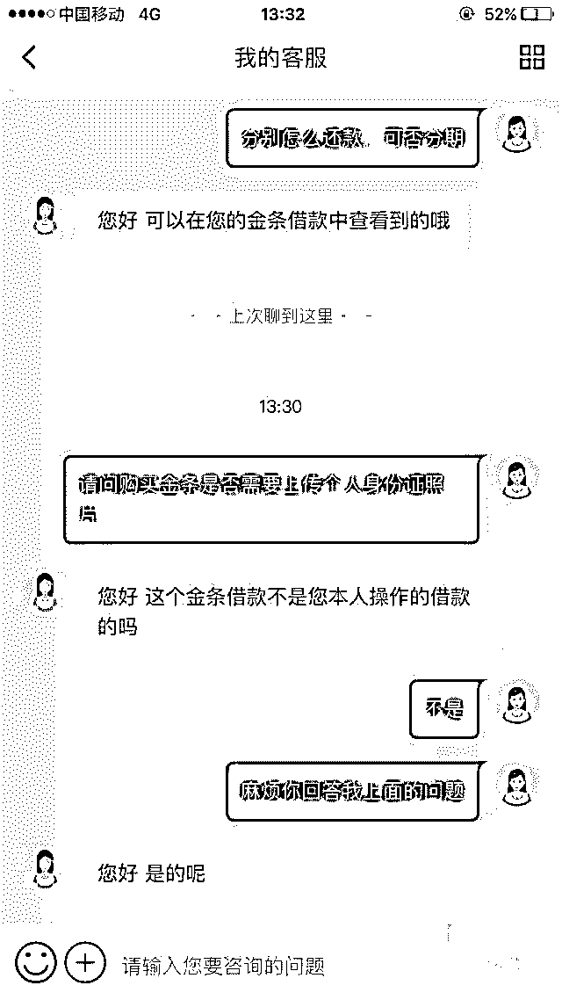

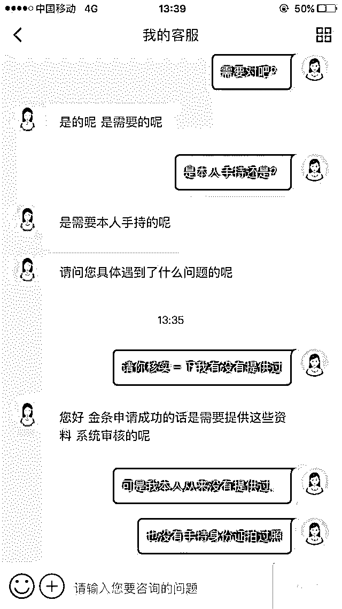

（@独钓寒江雪）随后前往了住地附近派出所，想请求警察介入调查。

但据灰产圈了解，截至今日，该网友的支付信息被盗用的事件没有得到实质性解决。

京东致电表示，贷款还是需要她个人承担。派出所方面，也没有给出明确受理的答复。

得知此事的网友都大吃一惊，纷纷猜测各种可能性。有人说可能是连公共 wifi 时密码泄露，也有人说使用假身份证可以补办手机卡……

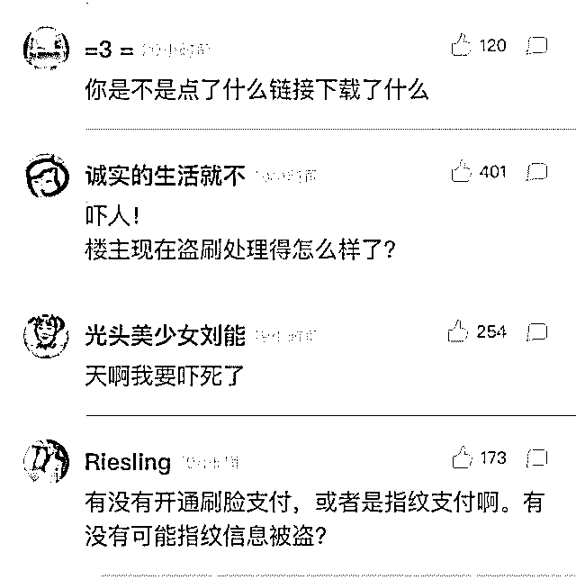

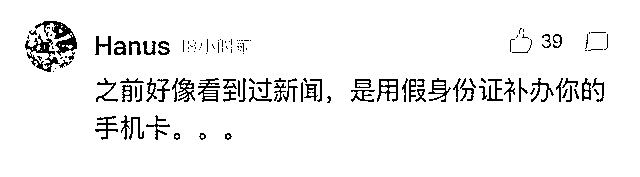

**以上截图为豆瓣网友讨论**

**事件转机：支付宝全额赔付！**

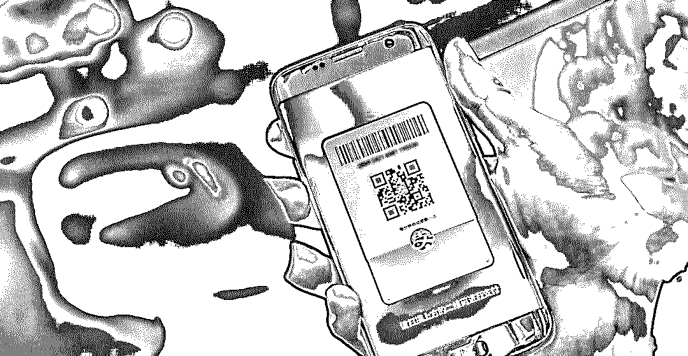

对于此事，在此帖为发布之前，网友收到了之前在支付宝上面的反馈消息，看见消息的网友我想肯定心里，只想说凉凉了，看来都没戏，收到的信息如下：

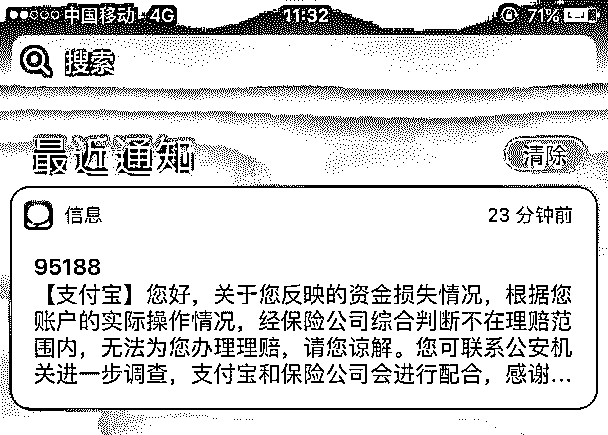

以下是网友帖子里面发出来的支付宝购买的理赔服务：

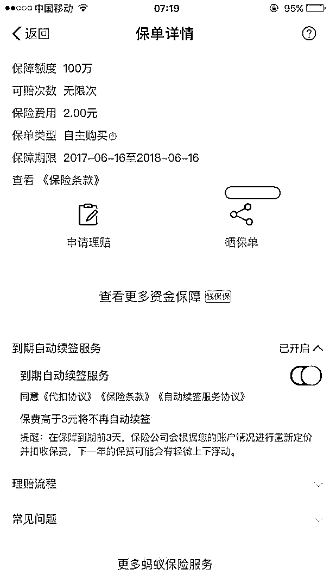

不知道大家有没有注意以上截屏中的“到期自动续费”这个点，用户这边设置是勾选了的，可现实却非如此，不知道是支付宝系统故障还是别的什么了，只能呵呵呵！

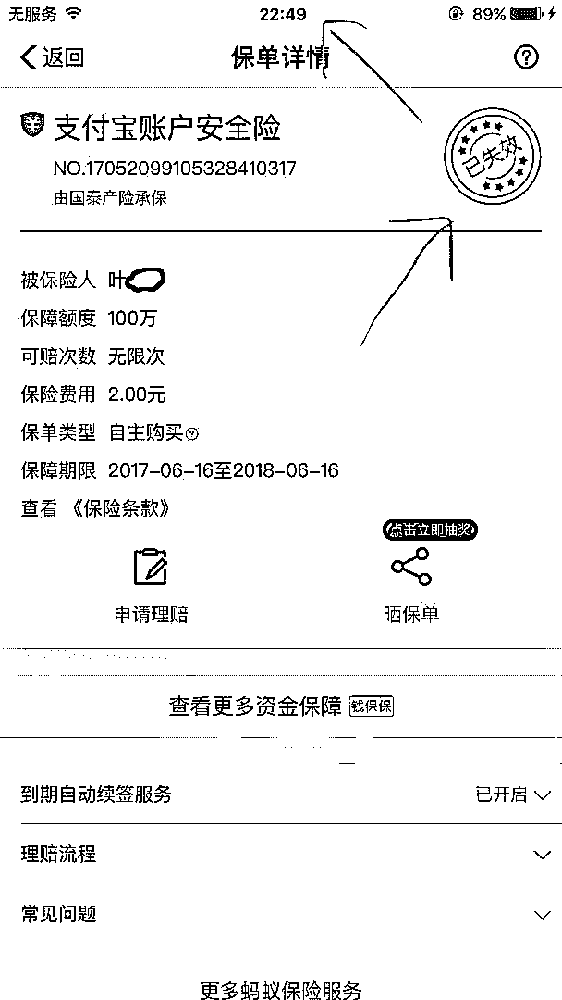

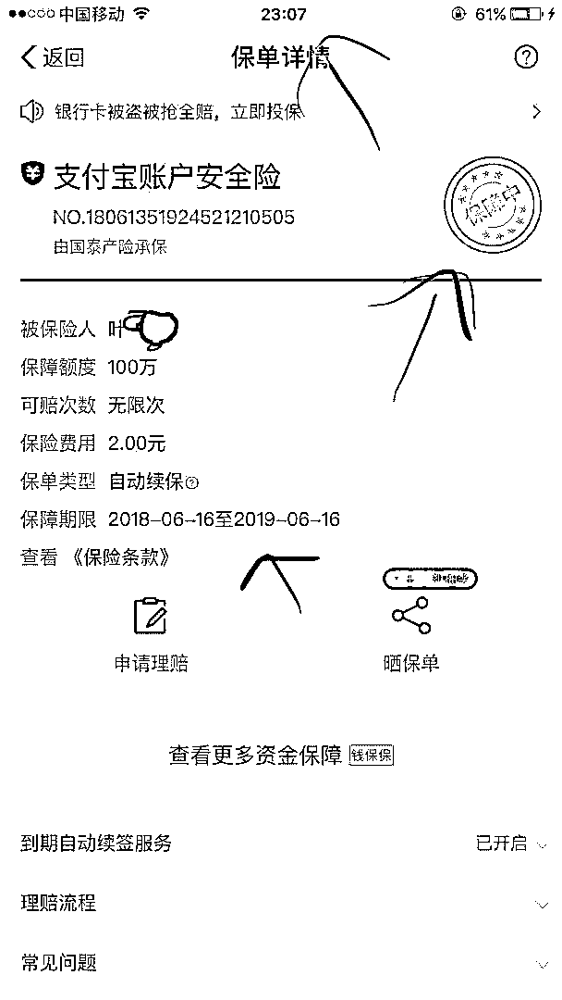

以上两张截图，大家注意看时间，对此，支付宝客服的回复，保险一期跟二期是无缝连接的，没有异常，对此，大家明白这是什么操作吗？

故事到此，终于迎来了转机，我想这结局也是大家都希望看到的，支付宝官方终于在 8.3 号晚上 23 点左右，通过微博做出如下回复，以下为支付宝微博官方截屏

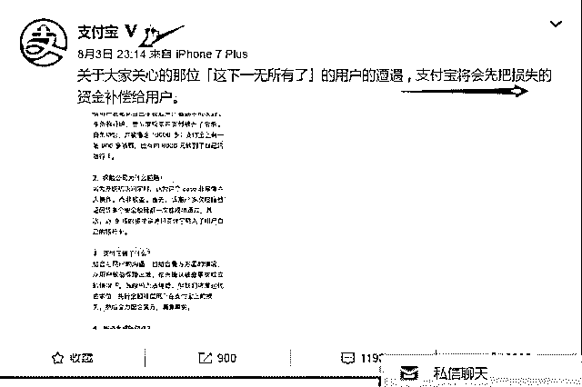

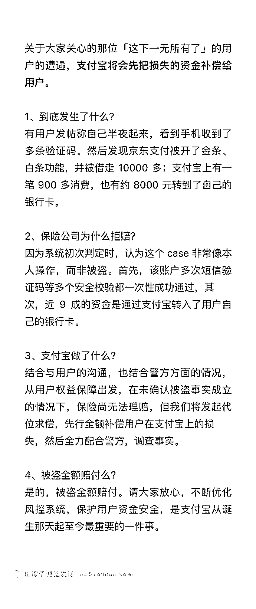

针对此事，我们下面来看京东方面是如何处理的呢？京东一直强调以“用户利益”为先原则。

这是从农村苦日子过来的刘强东，给京东一直树立的品牌观，

# 京东一直秉承“用户利益”为先的原则吗？

对于此事，“独钓寒江雪”首先通过微博与京东金融取得联系，但回复是让人凉凉，也许这就是现实，后续经过相关媒体对案件进行证实之后，秉承“用户利益”的原则，终于对确认盗刷的用户进行“先行垫付”免除用户无力还款的责任。

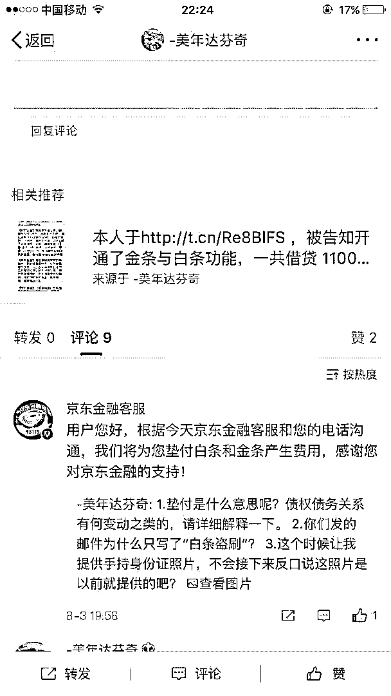

结果是好的，只不过稍有些曲折而已，说白了，就是看事情发展到什么地步，被多少人关注。

这才是真正的现实

**灰产圈还原事件真相**

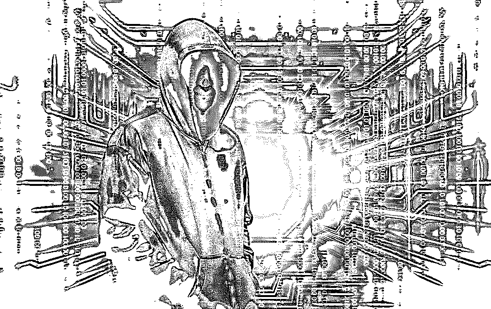

对于该网友“独钓寒江雪”所遭遇的事情，灰产圈认为是被黑客用“GSM 劫持+短信嗅探”的方式窃取到了短信验证码。

什么是“GSM 劫持+短信嗅探”？

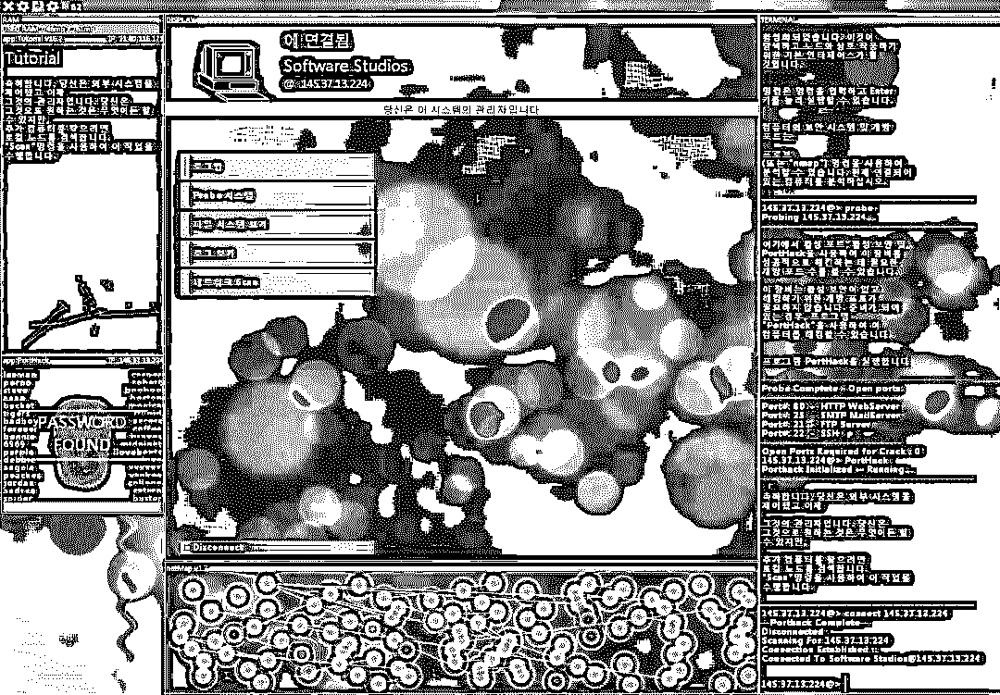

首先我们先要了解一个叫“伪基站”的东东。通常来讲，我们的手机之所以能收到信息或者往外发出信息，是要靠一个叫“基站”的东西，基本为电信运营商所建。

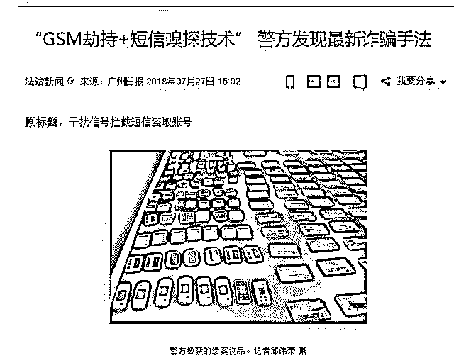

**广州日报报道**

我们在收到某一条短信的时候，是由于运营商的基站发出一组电磁波，而这个短信之所以你的手机能接到而其他手机接不到，是由于手机和基站之间的通讯有一套复杂的编码、加密和身份验证机制，如果这套机制被别人破解了，那对方即使没有你的手机，也能收到你的短信内容。

目前，GSM（2G）、WCDMA 和 CDMA2000（3G）、TD-LTE 和 FDD-LTE（4G）的编码、加密、身份验证方案各有不同，其中 GSM 因为过于老旧，所以可能被破解的几率最高。

也就是说，你的手机和黑客的手机会同时收到这个短信，这是为什么“独钓寒江雪”为何会在凌晨接到短信的原因，如果是在白天，受害人会在接到验证码短信后立刻进行止损。

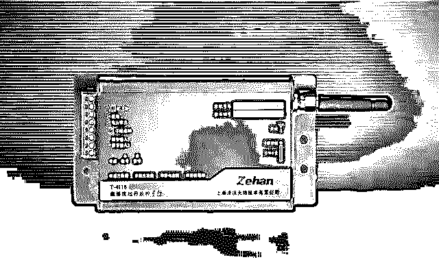

黑客在打开嗅探设备后，寻找附近的 2G 手机，或者干脆去只有 2G 信号的地方来寻找手机机主。在得到你的手机号之后，黑客再根据手中的数据库来继续搜索跟手机号码关联的身份证号、常用密码等 ，接下来转移钱财就会变得很容易了。

据腾讯玄武实验室负责人 TK 分析，虽然“独钓寒江雪”存在被黑客“GSM 劫持+短信嗅探”的可能。但这也只是一种可能。

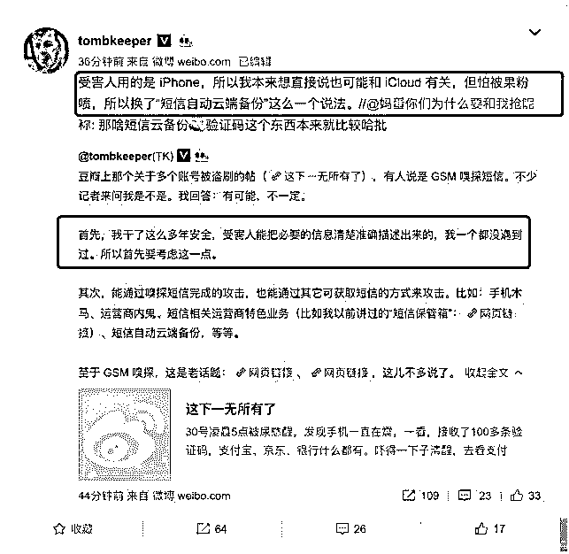

他认为，还可以通过很多方式实现用户手机一夜之间被盗刷，包括运营商里存在内鬼、手机中了木马甚至是“云上贵州”是否有内鬼等多种可能。

而对于的“独钓寒江雪”所说的，“京东方面让其个人承担金条贷款”的情况，在向京东核实时，对方发表了如下声明：

经过调查，这是不法分子通过 GSM+短信嗅探的技术实时获取用户手机短信内容，进而窃取用户信息、盗刷用户账户进行的网络诈骗。短信嗅探的原理是不法分子可以在伪基站范围内获取到用户收到的的所有短信，而与此同时用户却毫无知觉。基于短信嗅探技术的新型黑产网络诈骗已经危及到了部分用户的财产安全，导致用户在各大银行、互联网平台都受到了不同程度的资金损失。

京东金融对此事高度关注，并设立了专门的盗刷案件处理通道，针对用户反馈的情况我们会第一时间对案件进行核实。秉承用户利益为先的原则，我们会对被确认盗刷的用户账户进行先行垫付，免除用户的还款责任。

**结尾**

那么，关键的问题来了，短信嗅探犯罪要如何防范呢？

**要点**

1.平时要做好手机号、身份证号、银行卡号、支付平台账号等敏感的**私人信息保护；**

2.最简单的一招就是**睡觉前关机**。手机关机后就没有了信号，短信嗅探设备就无法获取到你的手机号；

3.如果没有关机，早上起来看到奇怪的验证码短信，一定要想到可能是遇到短信嗅探攻击了，赶紧查看自己的银行卡和支付应用。这时如果发现钱被盗刷了，**火速冻结银行卡，报警。**

最后，其实还有个点，我一直不好意思问：

**就是你“支付宝，京东，银行里面有钱吗？”**

**附豆瓣原文链接：**

**https://www.douban.com/group/topic/121312665/?type=rec#sep**

* * *

延伸阅读[京东开了一家大型网上“赌场”：无数人深陷其中，但却合法!](http://mp.weixin.qq.com/s?__biz=MzIyMDYwMTk0Mw==&mid=2247491391&idx=1&sn=ab1bcb080fb6ac86eb9d57a8e8c32618&chksm=97c8d407a0bf5d11046e35b363e790b55b04af9306c3df8d55c107761bbbe2d58a47ffe7ea72&scene=21#wechat_redirect)
[深度：信息买卖黑链：淘宝 25 页和京东 3 年数据仅需 1 元，揭秘你的信息是如何被黑市买卖的。](http://mp.weixin.qq.com/s?__biz=MzIyMDYwMTk0Mw==&mid=2247489263&idx=1&sn=e1baf7a32570e65968fd8ab3bfee5649&chksm=97c8ddd7a0bf54c151b62d46024846d2eb1e6b07c55d69bc46d515284d275c858aefbc128be4&scene=21#wechat_redirect)
[深度|你的支付宝余额是如何被清空的？揭秘“支付宝秒余额”的黑色产业链，打开一个年产值数千万的黑色大门！](http://mp.weixin.qq.com/s?__biz=MzIyMDYwMTk0Mw==&mid=2247488728&idx=1&sn=905c1d98fbcc6fca409099044d5776a0&chksm=97c8dfe0a0bf56f6c16c5bb1134f928c2f7e0ddf8fef74e0bd0c9a40ca2db37f59260fbc1b66&scene=21#wechat_redirect)
[灰产哥：揭秘支付宝上亿规模的灰色产业链](http://mp.weixin.qq.com/s?__biz=MzIyMDYwMTk0Mw==&mid=2247488670&idx=2&sn=0b1555b80378f69625905a1e2efcdb32&chksm=97c8dfa6a0bf56b07d3cfb2141e0ef0ea96a4a62fcccb2fd3bf106fae7ebfd5af0ad836a3abb&scene=21#wechat_redirect)
[淘宝开了一家大型网上“赌场”，无数人深陷其中家破人亡，但却合法！](http://mp.weixin.qq.com/s?__biz=MzIyMDYwMTk0Mw==&mid=2247489631&idx=1&sn=90408e3c8eb9c314cc991a22fdb181ce&chksm=97c8d367a0bf5a71575aa731aa1907377f64f1427091d63805cff964e020e5f4af4c0f67bea5&scene=21#wechat_redirect)

* * *

****【灰产圈】高端社群知识星球小程序已开通**** 

**<mp-miniprogram class="miniprogram_element" data-miniprogram-appid="wx4f706964b979122a" data-miniprogram-path="pages/topics/topics?group_id=881854415822" data-miniprogram-nickname="知识星球" data-miniprogram-avatar="http://mmbiz.qpic.cn/mmbiz_png/kialtkOXGKS7D9hZrmO2jzDqryXXTAlhxSpnrKnHGV65KXzicibOppaPic4dCRxftvabB8Iqswo3OuQEDSxE7NicXBg/0?wx_fmt=png" data-miniprogram-title="【灰产圈】高端社群" data-miniprogram-imageurl="http://mmbiz.qpic.cn/mmbiz_jpg/WWG78hysZ0brJkWoyG2VDIacqgQjkDfp6mLiaoPBJ2SgWZHtRuTw7ia8kpoxntsn7PiaFOQO2U23FW6Iry0gS1GnA/0?wx_fmt=jpeg"></mp-miniprogram>**

****

****点击加入【灰产圈】高端社群****