# 苹果漏洞：5000 就能买 iPhoneX！

> 原文：[`mp.weixin.qq.com/s?__biz=MzIyMDYwMTk0Mw==&mid=2247492591&idx=1&sn=e483bf1cb11a3acabfd3823dba56404c&chksm=97cb28d7a0bca1c137f8a4e3dcc40a9db3b86a1d6f933b06f816059da6deed8a0ad36fcaf168&scene=27#wechat_redirect`](http://mp.weixin.qq.com/s?__biz=MzIyMDYwMTk0Mw==&mid=2247492591&idx=1&sn=e483bf1cb11a3acabfd3823dba56404c&chksm=97cb28d7a0bca1c137f8a4e3dcc40a9db3b86a1d6f933b06f816059da6deed8a0ad36fcaf168&scene=27#wechat_redirect)

**点击上方蓝色字体“灰产圈”关注并置顶本公众号**

**导语**

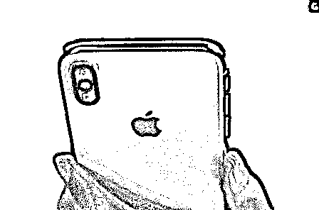

由于各个国家地区的市场环境的不同，不少本地运营商都会提供高额补贴在高端机型上，降低用户手机使用成本的同时，也可以帮助运营商获得优质用户。

但为了保护运营商利益，在非该地区或该运营商使用时，手机会有所限制甚至无法使用的情况，这就是市场上俗称的（合约机）有锁机型，消费者想要使用这类机型只能借助卡贴，但同样存在不少限制。

**5000 块拿下 iPhone X ?**

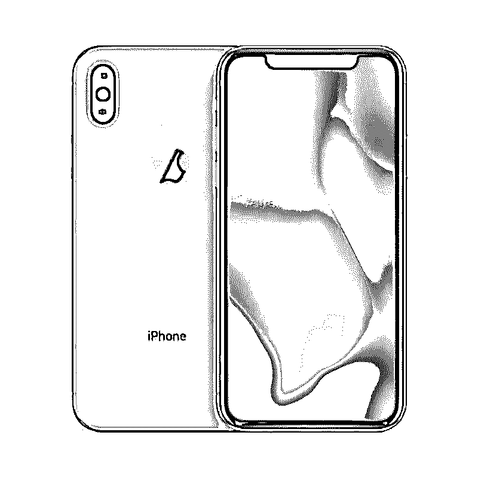

5000 块拿下 iPhone X，现实吗？

答案是可以滴!

美版有锁机 , 了解一下！

现在市面上 64G 版的美版有锁机

价格只要 5K 左右！

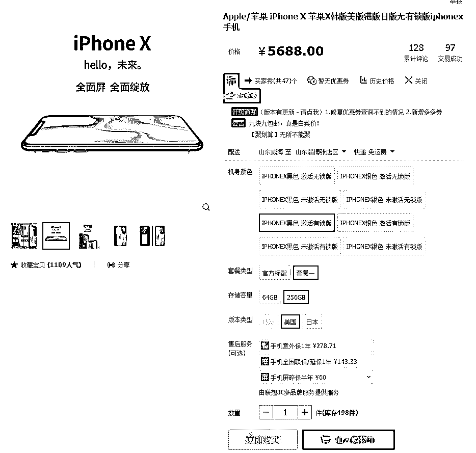

就算是 256G 版本，

美版有锁也只要 5688！

而同存储容量的美版无锁和国行分别为 7409 和 8528！

美版有锁比国行便宜近 3000 元！

到底什么是美版有锁？什么又是美版无锁？

美版有锁这么便宜？那我们为什么不买？

美版有锁

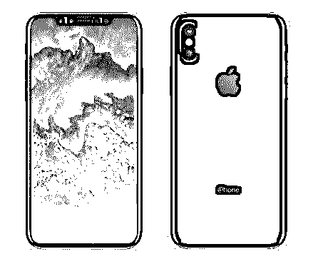

顾名思义，就是说美国运营商对这款手机的网络进行了锁定，只能使用它旗下的 SIM 卡。（就像我们中国的电信锁卡机不能使用移动联通卡是一样的道理）。

虽说售后保修比较麻烦，但是便宜了 3000 块钱啊！所以很多人也是很愿意买美版有锁的！

美版无锁

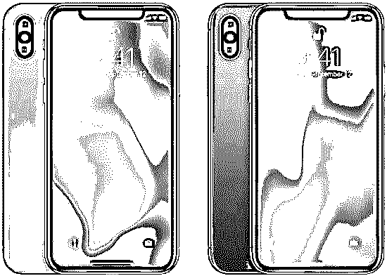

三网通用，比国行便宜 1000 左右，售后保修也比较麻烦。

那美版有锁买回来能用吗？

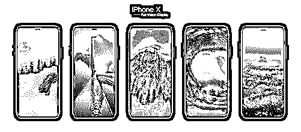

理论上是不能用的，但是我们中国的大神们却用「卡贴」破解了限制，破解过后在使用上和全网通没什么区别。但是不能刷机，不能抹除数据，也不能更换 SIM 卡。

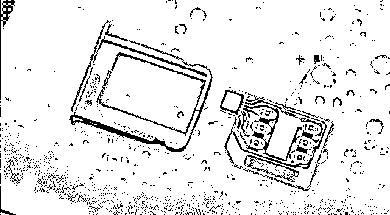

**（就是把上面这货贴在 SIM 卡上插入手机）**

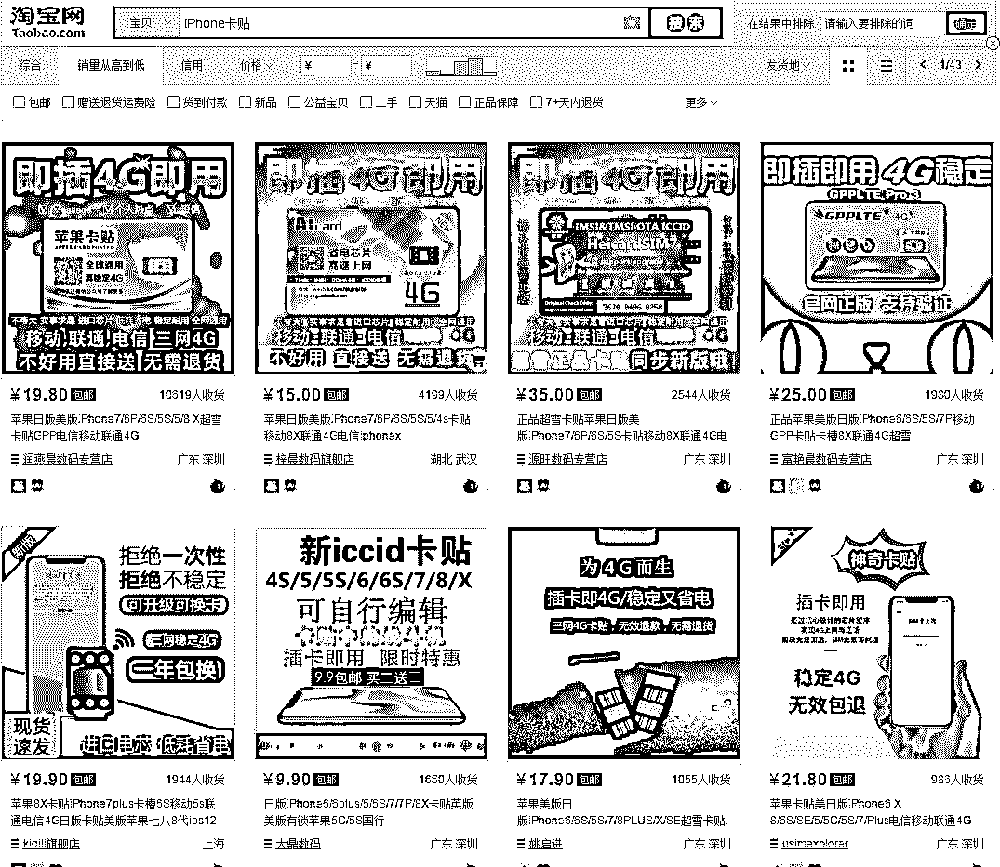

**（淘宝搜索：iPhone 卡贴  20 块钱包邮 超便宜 ）**

有锁免费变“无锁”

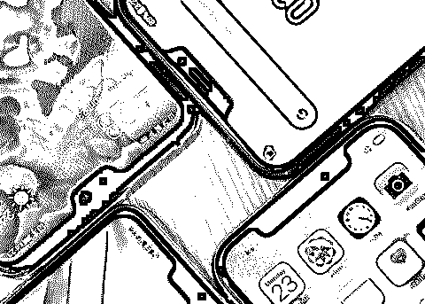

而就在 21 日，著名卡贴大神超雪团队突然爆出苹果漏洞！

所有使用 iccid 激活（基本都是这种激活方式）的有锁卡贴 iPhone 都能直接变成“无锁”了！不需要卡贴，也能换卡,支持 OTA 更新（从手机设置更新）！

不知道是苹果故意为之还是程序猿们没睡醒敲错了代码，反正这对卡贴机来讲是一个喜大普奔的好消息。老司机们，把握时机，赶紧上车！

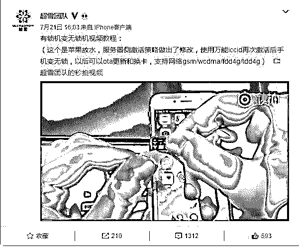

同一时间曝光的还有另外一个卡贴团队：GPPteam

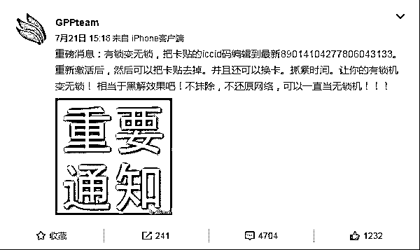

操作方法

来自 GPPteam 团队：

**图片版：**

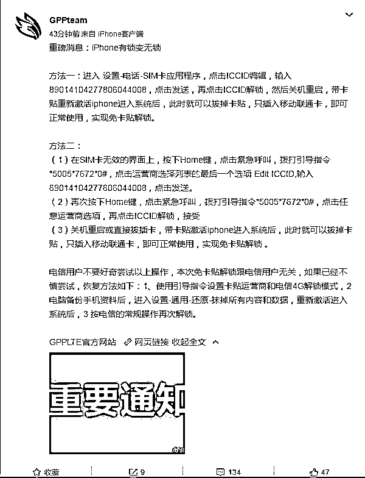

**文字版：**

方法一：

进入设置-电话-SIM 卡应用程序，点击 ICCID 编辑，输入 89014104277806044008，点击发送，再点击 ICCID 解锁，然后关机重启，带卡贴重新激活 iphone 进入系统后，此时就可以拔掉卡贴，只插入移动联通卡，即可正常使用，实现免卡贴解锁。

方法二： 

（1）在 SIM 卡无效的界面上，按下 Home 键，点击紧急呼叫，拨打引导指令*5005*7672*0#，点击运营商选择列表的最后一个选项 Edit ICCID,输入 89014104277806044008，点击发送。

（2）再次按下 Home 键，点击紧急呼叫，拨打引导指令*5005*7672*0#，点击任意运营商选项，再点击 ICCID 解锁，接受

（3）关机重启或直接拔插卡，带卡贴激活 iphone 进入系统后，此时就可以拔掉卡贴，只插入移动联通卡，即可正常使用，实现免卡贴解锁

 。

电信用户不要好奇尝试以上操作，本次免卡贴解锁跟电信用户无关，如果已经不慎尝试，恢复方法如下：1、使用引导指令设置卡贴运营商和电信 4G 解锁模式，2 电脑备份手机资料后，进入设置-通用-还原-抹掉所有内容和数据，重新激活进入系统后，3 按电信的常规操作再次解锁。

**注意：**

1、不支持电信！

2、解锁过后不要刷机！不要使用 iTunes 升级！不要还原网络！

3、可以换卡！可以 OTA 升级（从手机设置升级）！可以不使用卡贴！

4、现在美版的 iPhone 主要的销售渠道是某宝，但是，在某宝购买是有风险的，有些不良商家会将翻新机作为美版出售，大家一定擦亮双眼！

**有锁变无锁原理大揭秘**

    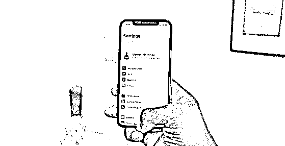

    **原理出自：超雪团队 ，以下为原文整理：**

7 月 21 日苹果服务器修改了 iccid 激活时的下行的激活策略配置，不知是苹果有意为之刺激一下去库存速度，还是里边的技术人员不小心敲错代码了，还有可能是调试下一代 iphone 的 ESIM 激活。总之不管了，卡贴还是之前的 iccid 的卡贴，只不过 7 月 21 日以后激活的手机就成无锁了。很多有锁机折腾的人搞不明白如何处理，到处问。特地写个文章普及一下。

 原理：

特定的 iccid 被允许激活任何手机，激活过程中苹果服务器会针对机型和销售商下载特定的激活文件，包括各种无线电频段许可配置，软件运行环境配置，sim 卡支持配置等信息。

比如香港行货是没有 cdma 频段入网许可的，所以港版的就不能使用电信的 cdma 网络，国外的运营商 sim 卡在合约期只能使用特定的 sim 卡，等等。

之前一卡贴一激活，是因为下行的策略是指定了当前的 sim 卡 imsi 和 iccid，所以不能换卡。但是突然苹果改了，下行了不指定 sim 卡相关信息的策略，所以就出现了现在的轰动场面。

至于什么时候就不行了，那就看库克的心情了。总之 iphone 用户用起来更顺心就是了。

**结尾**

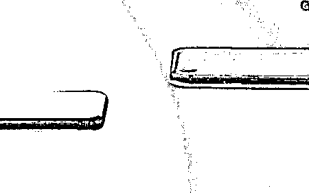

ICCID 翻译成中文就是集成电路卡识别码，这相当于你手机号码的“身份证”，每个运营商都有指定的号码段，而过去的卡贴就是把你的 ICCID 改写成有锁机指定的，本次解锁漏洞正是使用了 ICCID 的部分特性，当然苹果过去也曾出现该方面漏洞并及时修补。

进行此操作后的机型，理论上可以进行 OTA 系统升级、自由换卡（仅限移动、联通卡）等操作，但与真正的无锁机型不同的是，解锁后的 iPhone 不能手机重置还原，同样不能电脑端进行升级操作。

另外此次的激活并不针对 CDMA 制式，如果有锁 iPhone 想正常使用电信手机卡，还是需要依靠卡贴。

由于本次解锁适用于市面大多数有锁 iPhone 机型，因此会对 iPhone 市场造成一定影响，众所周知有锁机型价格比无锁机型便宜不少，在利润的驱使下，不排除有不法商家使用有锁冒充无锁机型的可能，

所以消费者在购买新机时，需要擦亮双眼，必要时可通过当场重置手机的方式验证真伪。

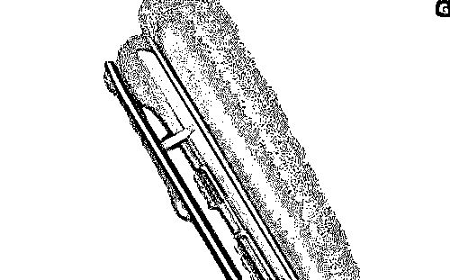

本次苹果手机激活策略的调整原因暂不清楚，据悉是苹果的服务器出现 BUG，目前苹果还暂未封堵漏洞。

当然解锁会直接损害运营商的利益，相信不久之后苹果就会修复该漏洞，灰产圈也将进一步关注此次解锁漏洞的情况。

* * *

**【灰产圈】高端社群小程序开通，2018 最值得加入的社群！**

<mp-miniprogram class="miniprogram_element" data-miniprogram-appid="wx4f706964b979122a" data-miniprogram-path="pages/topics/topics?group_id=881854415822" data-miniprogram-nickname="知识星球" data-miniprogram-avatar="http://mmbiz.qpic.cn/mmbiz_png/kialtkOXGKS7D9hZrmO2jzDqryXXTAlhxSpnrKnHGV65KXzicibOppaPic4dCRxftvabB8Iqswo3OuQEDSxE7NicXBg/0?wx_fmt=png" data-miniprogram-title="【灰产圈】高端社群" data-miniprogram-imageurl="http://mmbiz.qpic.cn/mmbiz_jpg/WWG78hysZ0brJkWoyG2VDIacqgQjkDfp6mLiaoPBJ2SgWZHtRuTw7ia8kpoxntsn7PiaFOQO2U23FW6Iry0gS1GnA/0?wx_fmt=jpeg"></mp-miniprogram>

**点击加入【灰产圈】高端社群**