# 原创|手把手教你发行山寨币：迎娶白富美 ，走上人生巅峰！

> 原文：[`mp.weixin.qq.com/s?__biz=MzIyMDYwMTk0Mw==&mid=2247492540&idx=1&sn=ba71dbb165b028df6b476f606a7f4cd3&chksm=97cb2884a0bca1927a0c7b35cb9975df8445de5d9514afd89c0401a81f3dda806040b9d9fb36&scene=27#wechat_redirect`](http://mp.weixin.qq.com/s?__biz=MzIyMDYwMTk0Mw==&mid=2247492540&idx=1&sn=ba71dbb165b028df6b476f606a7f4cd3&chksm=97cb2884a0bca1927a0c7b35cb9975df8445de5d9514afd89c0401a81f3dda806040b9d9fb36&scene=27#wechat_redirect)

**点击上方蓝色字体“灰产圈”关注并置顶本公众号**

**作者：灰产圈**

**转载需授权**

**导语**

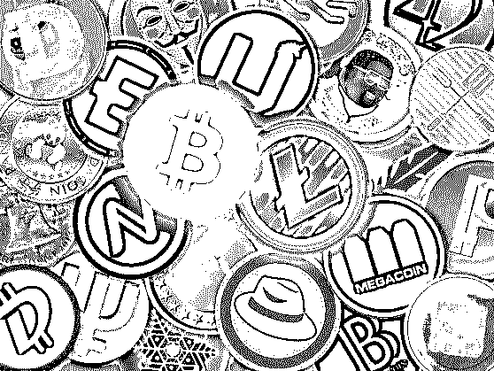

2018 年区块链大火，从传统投资人到跳广场舞的大妈，无不构建着区块链的财富传说。

这场大狂欢中，人们是怎么一步步被区块链山寨币套牢的呢？总结起来，山寨币的完整发行流程，大体都是走这几个步骤。灰产圈一步一步教你们发行山寨币，迎娶白富美，走上人生巅峰！

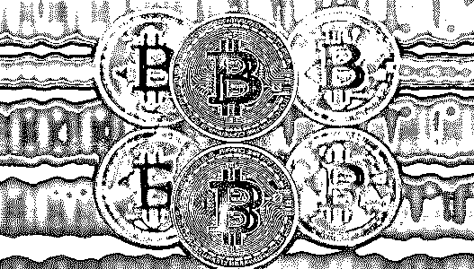

**第一步：做一个数字代币系统**

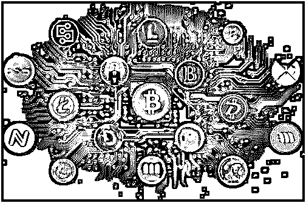

这个很简单，比特币的代码是公开的，简单一改就是一种山寨币；以太坊的技术是开源的，找个程序猿就能在以太坊的公链上发行一款币。现在大部分山寨币都是在以太坊的公链上，代币的分发也直接用以太坊的钱包，很方便。

其实第一步非常简单：如果不懂数字代币系统开发，可以找到专业做代币系统开发的公司付费开发，专业人士做专业事，你只需需要付费即可。

**渠道一：**

万能的淘宝，搜索：数字代币系统   你会看到很多提供这类服务的商家，

如下图：

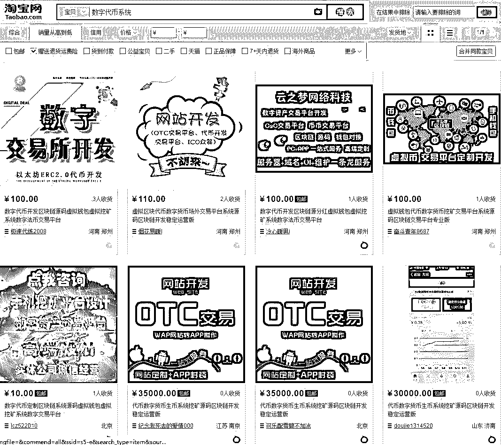

随便点开一个看产品描述还是非常专业的：

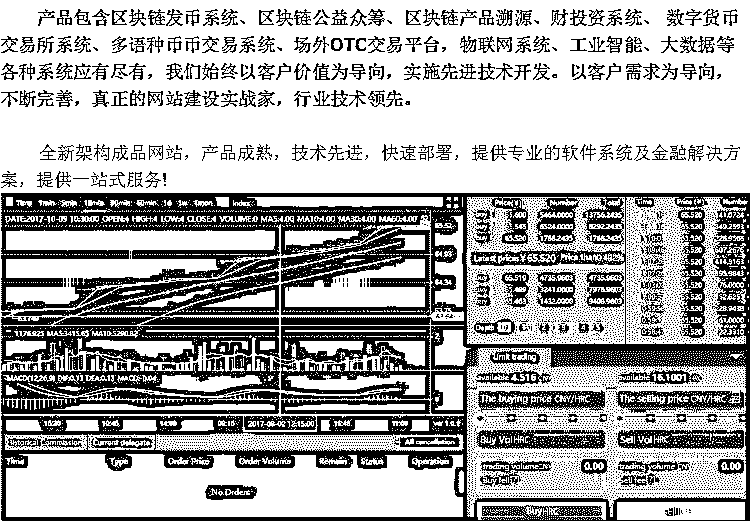

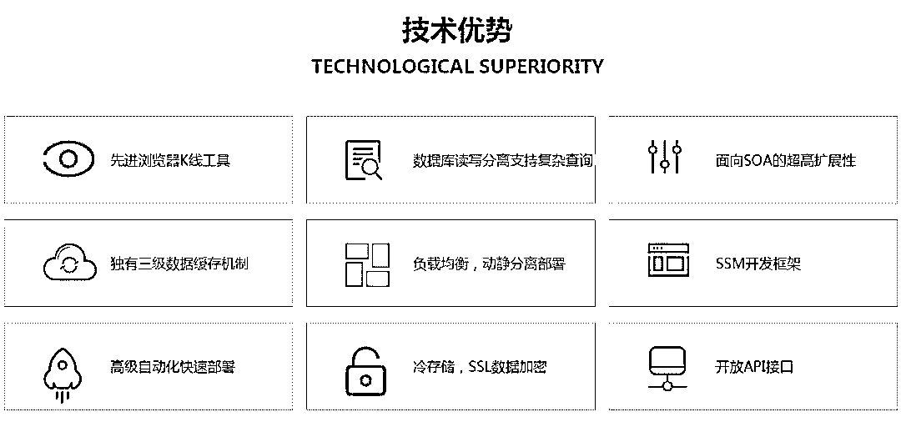

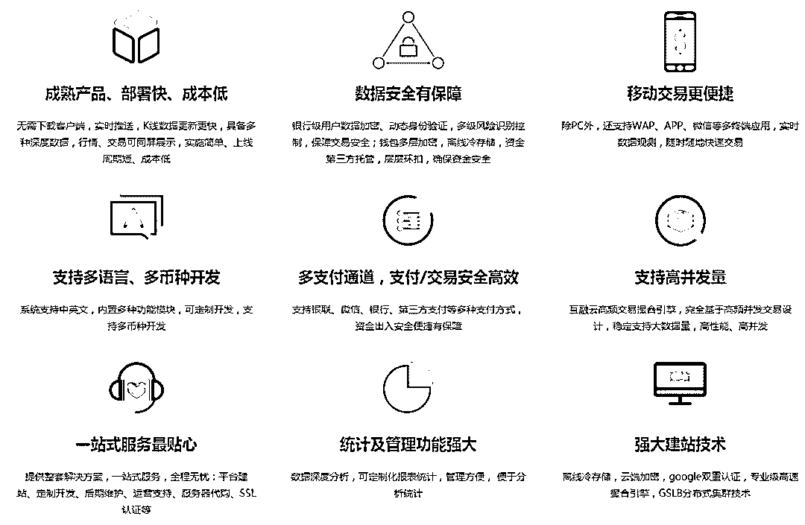

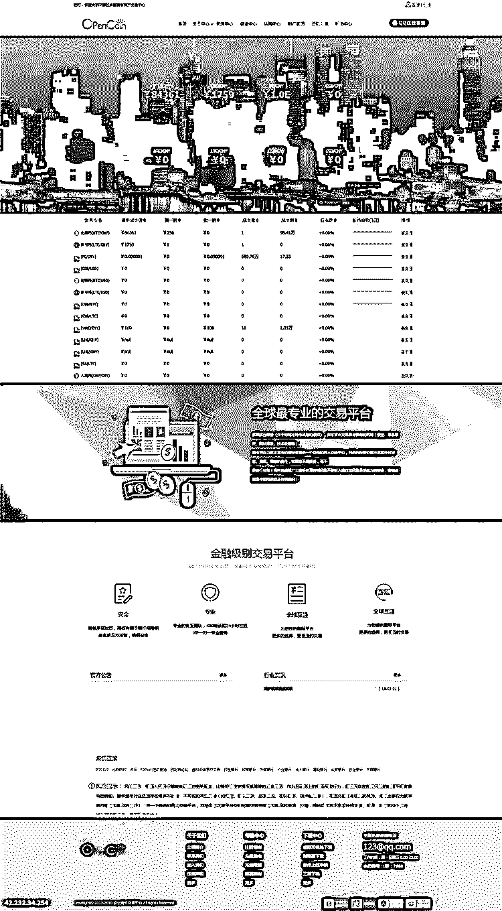

上图为宝贝描述，其实代币系统开发并不是多么复杂的事情，费用大概在 **3W**左右 

**渠道二：**

万能的百度， 百度搜索：代币系统开发    会看到如下界面，很多做此类业务的商家会做百度推广，看到“广告”两个字就是了。

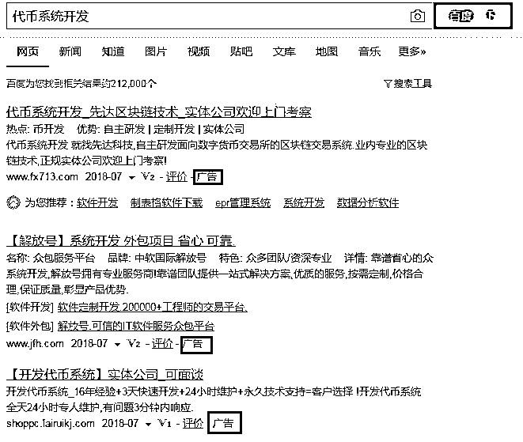

我们点开其中两个网页，如下图所示：

**网站一：**

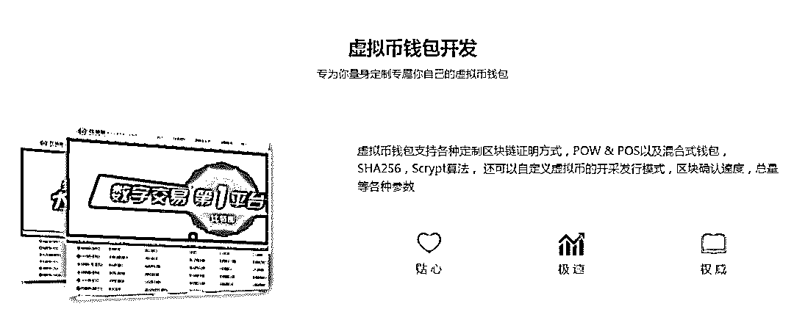

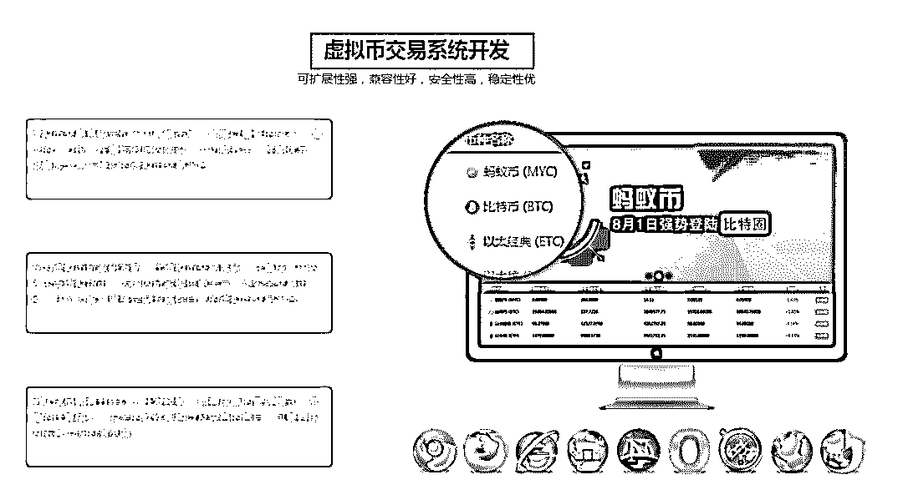

**网站二：**

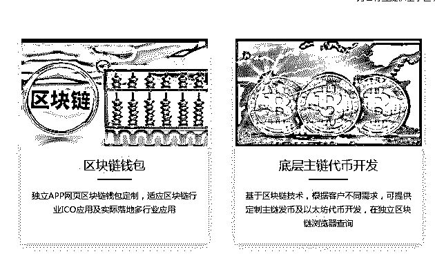

都提供系统的代币系统开发和区块链钱包开发服务。

那么第一步我们完成了。

**第二步：找人做背书**

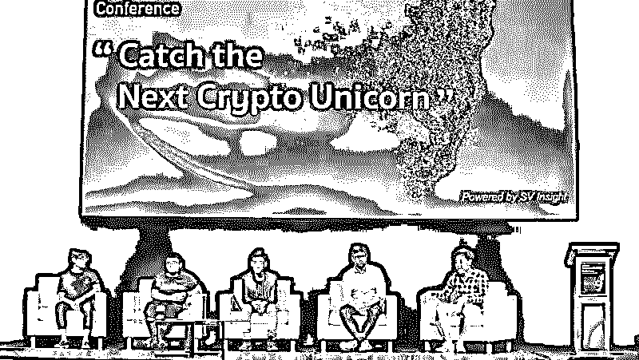

第一步我们完成了，如果项目能落地，可能会找个真正有影响力的大咖，顺便还能拿个天使轮做做营销。

如果项目是空气币，可能就拉个草根大咖，反正现在币圈刚兴起，很多“大咖”其实都是草根出身的。拉不到的话直接用病毒营销套路发糖果也可以。

这些大佬就是以“李笑来”为首的站台团队，当然“李笑来”这种级别的大佬非一般人能请得动的，要么给他丰厚的金钱，要么给他很大一部分代币作为合作条件，前提是他看的上你的背景和资金实力。

“不看项目好坏，只看你团队多牛，只要有个币圈的名人或者投资界的名人，就很容易上线”，一位币圈人士说道，“那些大佬的节操已经碎了一地，搞定他们不是一件十分难的事情。”

那么，怎么能让大佬或基金公司“入瓮”呢？

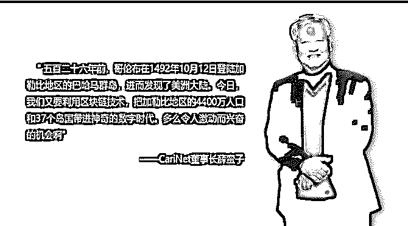

其实这也不算难。那些大佬和基金公司早些时候对区块链也不是十分了解。就算有一些初步的了解，面对能保证如此暴利的投资回报他们能不动心吗？

目前大佬们在币圈获利的模式有三种：

一是为某些项目站台，站台费是“1%到 5%”的代币不等，他再转手在上市的交易所卖出；有些“大佬”会直接开口要比特币，“5 个到 20 个”不等。

二是通过构建自己的小密圈，获得上课费与会费收入；

三是为自己的项目宣传，就像三点钟区块链无眠群。

业内人士透露，前段时间的 ICO 疯狂浪潮，不少站台者赚得盆满钵满，“一个站台达人，给几十个项目站台，代币冲到高点后就抛，现在差不多挣了 1 亿了”。

那么问题来了，我们没有那么强大的”背景“和雄厚的资金支撑怎么办？

很简单，“虚假站台”了解一下，什么是“虚假站台”？

简单讲就是，谎称某“大佬”投资本项目，并附上各种证书，PS 图片等等一系列伪造资料，其实他本人并不知情，

即便虚假站台被发现，最直接的方法是将相关人士的信息从项目资料中取出，但很有可能在此之前团队已经募集到相应的资金而“跑路”了。

不管怎么说，如今名人站台已经成为了区块链项目推广的“标配”，

**第三步：准备一份白皮书**

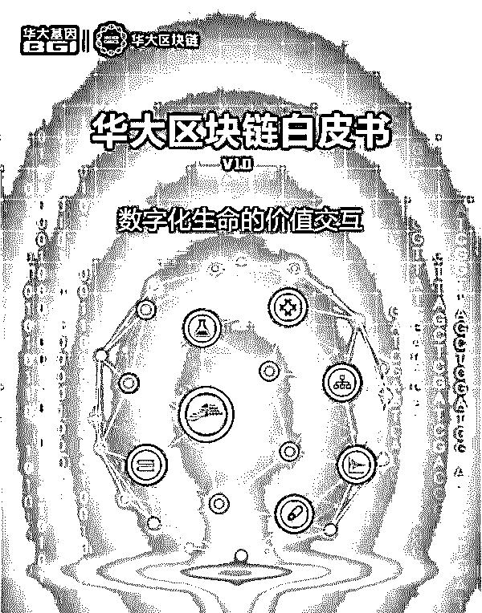

这个得往高大上里了写。对于优质币来说，愿景、代码、规划、团队之类的都得好好写，得花不少时间。

但对空气币来说，直接找个专业代写的就行，一天就能写好。

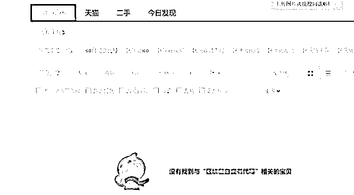

之前淘宝上有大量的白皮书代写商家，收费几千到一万不等，现在被淘宝屏蔽了，下图是之前灰产圈搜索到的白皮书代写服务商家：

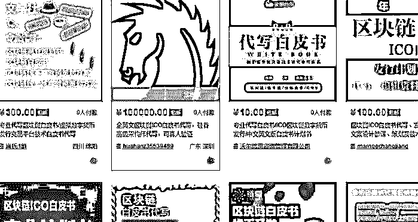

那么如何找到白皮书代写商家呢？

很简单： 万能的百度  ,百度搜索“白皮书代写”会出现一大批做这类业务的官网，如下图所示：

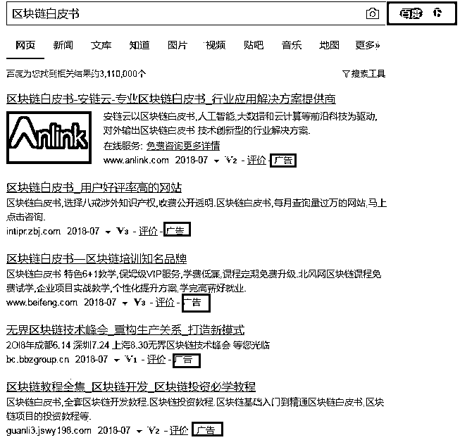

我们随便打开一家网站，就能看到白皮书代写业务详细介绍，如下图：

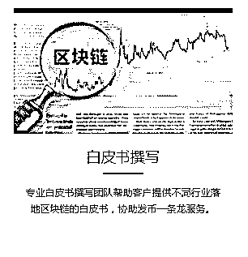

白皮书我们解决了，接下来进行下一步：推广营销。

**第四步：推广营销**

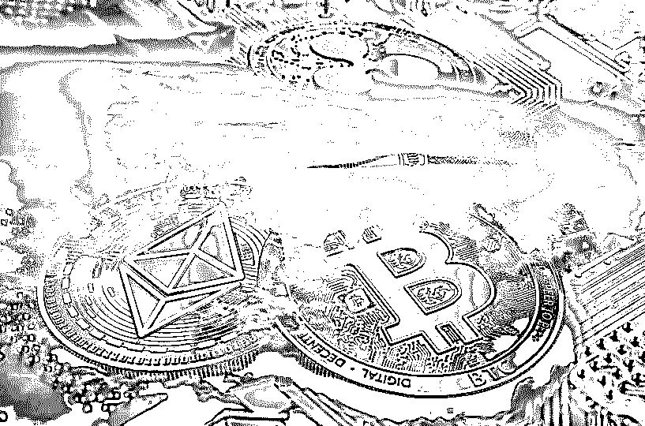

找各类币圈媒体打广告，或者弄个邀请送糖果的病毒活动，刷刷知名度。

币圈媒体列表：

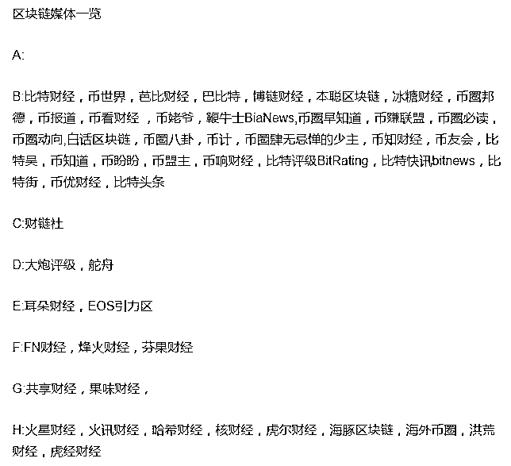

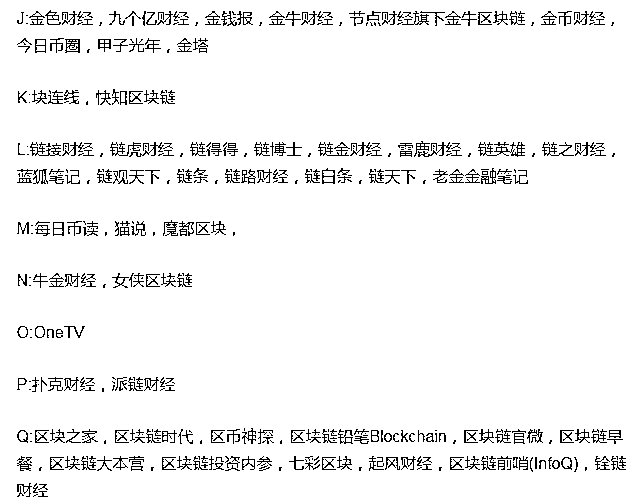

上图只是一小部分币圈的媒体网站，上面活跃着国内大部分的币圈玩家，付费推广，相信哪个网站都不会拒绝，只要给的价格合适。

同时大量的币圈玩家也活跃在微信公众号 ，微博等自媒体平台，直接找到广告主投放广告即可。

我们找到了一个广告投放平台找到了部分币圈公众号，微博广告价格，都是明码标价的。如下图：

公众号：

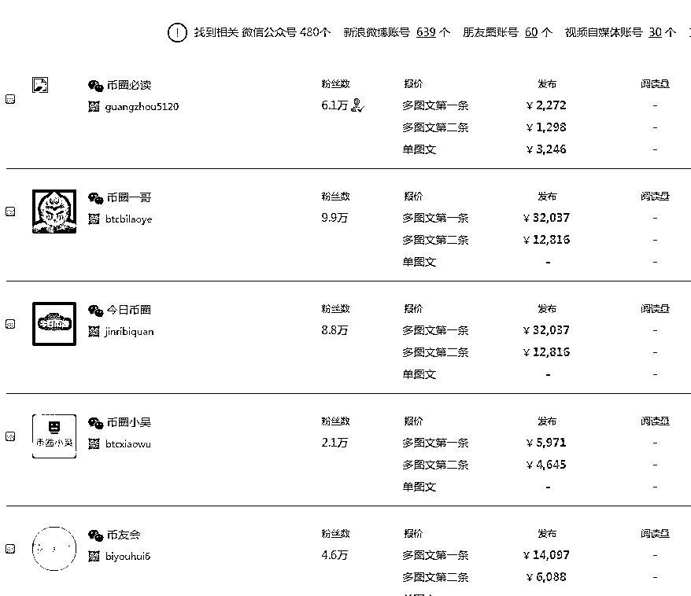

微博：

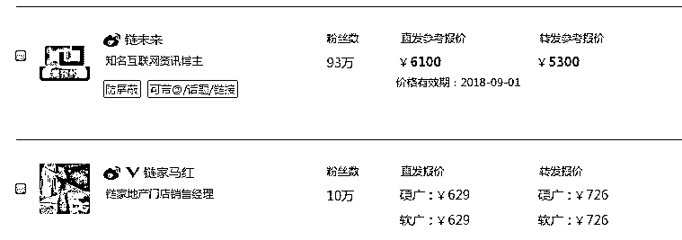

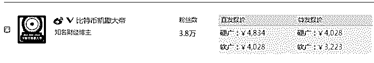

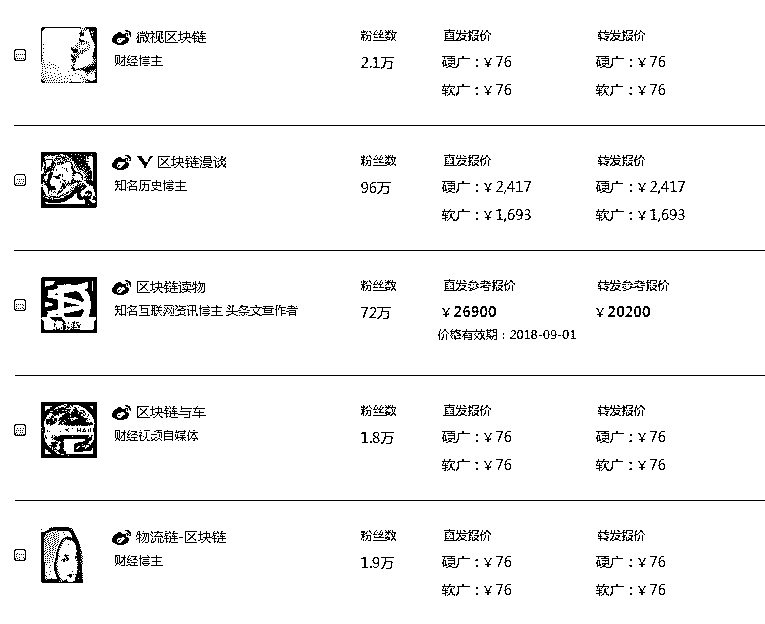

有了这些媒体平台宣传造势，怎么可能不会火起来？

毕竟 币圈的韭（sha）菜( bi ) 取之不尽用之不竭！

李笑来说了：傻逼的共识也是共识 ，我们通过宣传营销造势，目的就是为了让“傻逼”达成“共识”！

**第五步：爱西欧（ICO）**

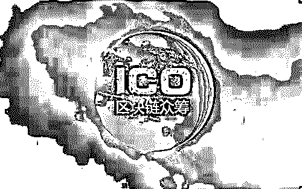

有了一定的知名度，就直接开始爱西欧（ICO）了。好项目很简单，往往小范围就直接被哄抢完了。空气币自己拉不到人也没关系，直接找代投渠道，帮你包装项目，也很容易就被分完的。

渠道一：  区块链融资平台

我们找到了其中一个区块链项目融资平台 ，如下图。

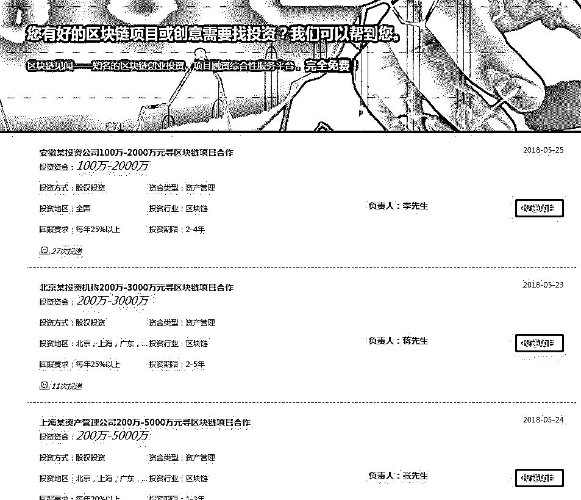

类似渠道很多，我们不一一赘述，下文我们通过揭露代投骗局来让大家了解到代投的几个渠道和套路。

> 所谓代投，类似于黄牛。他们从项目方那里获得私募额度，然后再利用自己的资源将这些额度进一步拆分卖给韭菜。由于韭菜无法联系到项目方，多数人不会科学上网，代投就成了项目方和韭菜之间唯一的沟通桥梁，所以这之间就有了信息差。
> 
> 有很多韭菜深谙互联网传播规则，经常在各大社群或社交平台上做广告，他们往往是掌握大量流量渠道的人，比如微商一类。所以，他们很容易将手里的额度分发出去。
> 
> 但币圈绝大多数的优质项目其实在去年就已经完成了代币融资，区块链的大火让大量团队利用空气币、垃圾币赚钱。而代投往往就是这些空气币的输出渠道，代购都有可能遇到骗子，何况是这种大资金的代投呢。
> 
> 但不论代投多么厉害，其套路无非就是那几样。
> 
> 1.最低级的诈骗
> 比如在 QQ 群或微信群里面自称是区块链达人，进入区块链行业很久，沉浮币圈赚了几百万，吹嘘自己与某某大佬来往密切，可以轻易拿到代投额度。然后扔给你一个地址，让你打 ETH 过去，拿到 ETH 之后便消失了。如果这都能被骗，那也活该一辈子韭菜。
> 
> 2.赚取 ETH 或其他币种差价
> 骗子代投谎称自己有私募额度，募集 ETH。代投收到 ETH 后，会在 ETH 涨价之后卖掉，待 ETH 价格出现回调或下跌之后，在按照卖掉时候的数量，再买回来。最后对韭菜说，项目没投上，不好意思，然后还给韭菜。
> 
> 而这段时间里，代投通过回调或下跌行情赚了个盆满钵满。而韭菜们不但没投上私募，也错过了 ETH 下跌止损的时机。
> 
> 3.见机行事获暴利
> 有些骗子代投确实有项目方的额度，募集到 ETH 之后也确实收到了项目方的币，但是这个币却没有发给投资者。等到这个币上了交易所过后，如果这个币出现了大涨行情，就以最快速度卖掉。在获利之后买回当初募集到的 ETH，并退回给韭菜们，并告知他们，不好意思没投上。
> 
> 如果币破发了，那就把币发给韭菜，反正代投没亏。
> 
> 不只是出现了骗子私募，其实破发的垃圾币也越来越多。但现在很多社群里面却有这样的声音，大家一起在讨论那些严重破发的币种，并对破发币保持关注，期望某个价值被严重低估的破发币可以带他们实现财务自由。这种被低估的币种确实存在，但很难分辨。在众多破发币里面找价值币，其行为无异于垃圾里面找黄金。
> 
> 随着行业发展和国内对 ICO 的不断打压，真正的好项目只会越来越少。好的项目也是一种优质资源，而这样的资源，一般的投资者是不知道的，不然怎么叫“私募”。
> 
> 其次，国内投资者至今为止依旧处于投机状态。在各大社区里面，随处可见的“大佬，推荐个十倍币呗”，“大佬，XX 币怎么样”，“大佬，今年比特币能涨到什么位置”。
> 
> 很多时候，韭菜之所以是韭菜，是因为他们不学习也不提高自己的认知，这样的人不论是在区块链，还是股票，期货领域都会被收割。
> 
> 所以，想要真正在这个领域赚到钱，首先要做的事情是提升自己的认知并不断迭代。

**第六步：接触交易所**

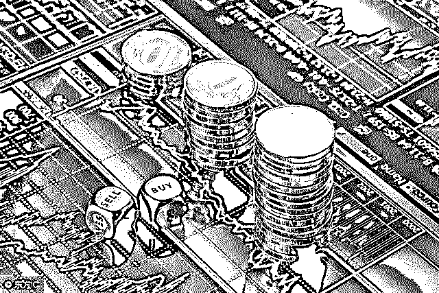

一般都会尽力上一个知名的交易所。如果没有天使轮，就只能拿爱西欧（ICO）的钱出来了，实在不行上个容易上的交易所也行。

目前主流的交易平台有如下这些：

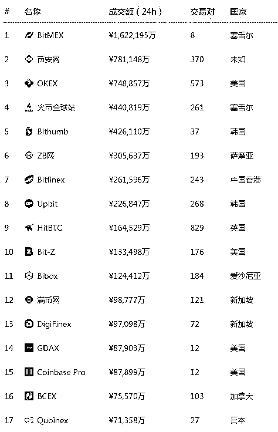

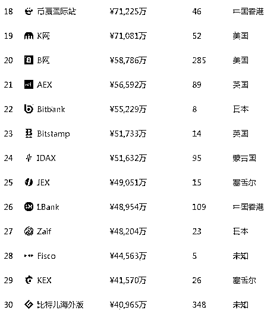

那么如何将代币上交易所呢？ 

很简单：花钱！

实际上，这是虚拟货币行业里的一层猫腻。众多的代币发行方，首先选择上一些小的交易所，这样盘子小，有利于控盘，也有利于探盘。这时候的交易量很小，大的持币方也没法套现清仓。而随着登陆火币这样的大交易所，交易量增大，众多的持币方都选择抛售，只有抛的，而接盘的就那么多，自然价格狂跌。 

此外，这也和代币发行方有莫大关联。要上火币，必须要给火币一大笔银子。

就在上周（2 月 28 日），火币平台完成了一场币投资者投票上币的活动。最终，EGCC、SHE、GSC、CNN、MEX、IIC、UC、AAC、UIP、UUU 作为 TOP 10 成功入围，投票花费合计超过 4 亿人民币。基本上每个币都要花费数千万元，其中优币 UC 就在其中。

羊毛出在羊身上，这么大的一笔费用，自然要从虚拟货币交易者也就是众多的散户割韭菜而来。正如一位投资人老猫所言，作为一个散户，你还敢持有那些为了上平台而不惜代价的项目吗？

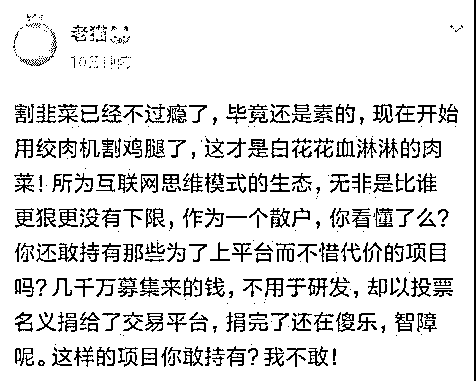

**第七步：公开募集**

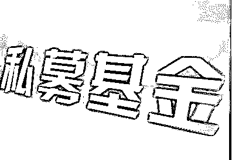

一旦上了交易所，说话的底气就足了。这个时候可以继续再来一波公开募集。反正给出去的都是代币，还能引起市场的更多的关注。

这一步就不详细说了，反正上了交易所，这个代币会更加火爆，依靠前期的宣传和交易所现有的币圈用户足以支撑起整个代币的市场，这其中还是最主要的还是宣传造势，参考**第四步：推广营销**

**第八步：上线多家交易所**

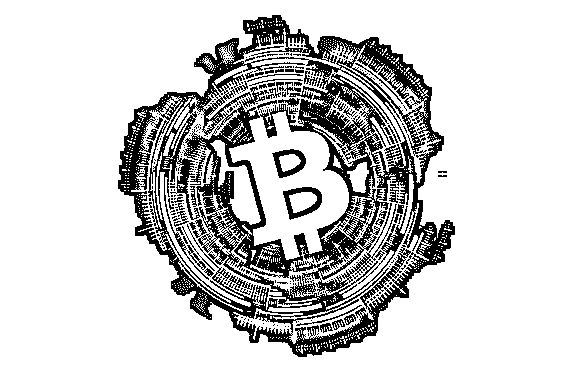

一旦资金足够，项目质量也不错，那就多上几个主流交易所。主流交易所一上完，那这就是一个比较靠谱的项目了。

对于优质的山寨币来说，白皮书的质量一般都会很高，也很容易拉到行业大咖做背书。

那么他们一般会跳过六七步，就算是第五步也只会在小范围进行。

第四步的营销则会偏向于宣传项目，而不是病毒推广发糖果。

对于空气币来说，这一堆的过程就更容易简化了。

大部分都是一二三步凑合着弄，然后在第四和第五步的时候承诺短期上线交易所之类的，从而吸引大量散户。

有的直接到第五步就结束了，这可以说是属于诈骗了；有的在第六步上线个山寨交易所然后在第七步捞一波再结束；有的做到第八步然后破发，也算是给了一个交代。

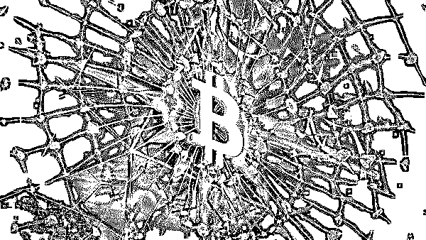

**第九步：迎娶白富美，走上人生巅峰！**

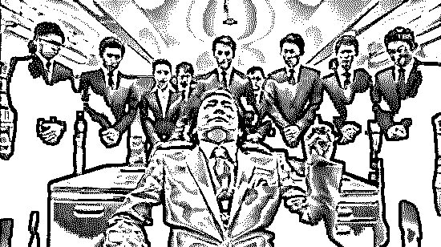

恭喜你，走到这一步，你已经宣告成功，

你已经成为了一个知名的山寨币创始人，

出任 CEO、迎娶白富美、走上人生巅峰，想想还有点小激动呢！

剩下的就是享受躺在家里数钱的美好生活，

希望你不要厌倦这种生活！

**结尾**

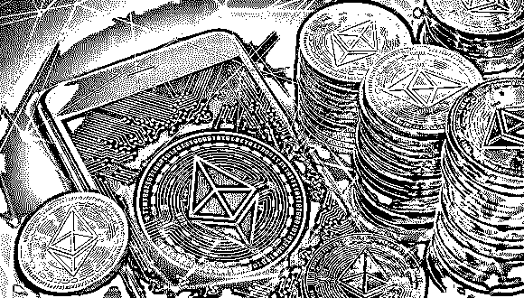

以上内容根据事实编写，如有雷同，纯属意外，

回归主题:

炒币有风险，投资需谨慎。

如果你还未上车，那么恭喜你，请继续谨慎；

如果你已上车，保持理智、策略性操作，保本往往比盈利更重要。

* * *

延伸阅读[深度揭秘币圈超级黑幕：掮客荐币，贷款买币，套路重重，人财两空！](http://mp.weixin.qq.com/s?__biz=MzIyMDYwMTk0Mw==&mid=2247492390&idx=1&sn=81d1122932ea7e87306e2a9f3074b567&chksm=97cb281ea0bca1085010faf7cc3ba6307403051628adef845cae325e97029ffc46259fd4fbc4&scene=21#wechat_redirect)
[区块链狂欢，虚拟币骗局的背后如何不当韭菜？](http://mp.weixin.qq.com/s?__biz=MzIyMDYwMTk0Mw==&mid=2247491136&idx=2&sn=6440c209de25721fac8b3709b505b35a&chksm=97c8d578a0bf5c6eb03eb4e547f7c5240e69af9616c804d234b00669f0622ea0288b307b99c4&scene=21#wechat_redirect)
[深度|币安网与黑客的史诗大战：差点被盗几亿元，场外做空比特币又获利几十亿！](http://mp.weixin.qq.com/s?__biz=MzIyMDYwMTk0Mw==&mid=2247490809&idx=1&sn=ef29c8706a01a98c314bbf528465a328&chksm=97c8d7c1a0bf5ed799e12c8d1f2b18e8e2183cc0d2dc05ff9fc8c36ee8e83602a8f38cd42468&scene=21#wechat_redirect)
["比特币首富"李笑来：一个诈骗者的财富自由之路！](http://mp.weixin.qq.com/s?__biz=MzIyMDYwMTk0Mw==&mid=2247492297&idx=1&sn=e8603af326177886663aed244d7f0a61&chksm=97cb29f1a0bca0e73f5118543cf31d14b8a41b6a43ce0e0683604318420d4401b7a0d72f445d&scene=21#wechat_redirect)
[一篇文章读懂区块链：币圈一天,江湖十年!（深度好文）](http://mp.weixin.qq.com/s?__biz=MzIyMDYwMTk0Mw==&mid=2247490389&idx=1&sn=723efdb12fc9c6cfc2d3e84d51f8f385&chksm=97c8d06da0bf597bfdff32d62578c6c43164c53b32b16413ce89a8d57e2bfc8e22e56614083e&scene=21#wechat_redirect)

* * *

****【灰产圈】高端社群小程序开通，2018 最值得加入的社群！**** 

**<mp-miniprogram class="miniprogram_element" data-miniprogram-appid="wx4f706964b979122a" data-miniprogram-path="pages/topics/topics?group_id=881854415822" data-miniprogram-nickname="知识星球" data-miniprogram-avatar="http://mmbiz.qpic.cn/mmbiz_png/kialtkOXGKS7D9hZrmO2jzDqryXXTAlhxSpnrKnHGV65KXzicibOppaPic4dCRxftvabB8Iqswo3OuQEDSxE7NicXBg/0?wx_fmt=png" data-miniprogram-title="【灰产圈】高端社群" data-miniprogram-imageurl="http://mmbiz.qpic.cn/mmbiz_jpg/WWG78hysZ0brJkWoyG2VDIacqgQjkDfp6mLiaoPBJ2SgWZHtRuTw7ia8kpoxntsn7PiaFOQO2U23FW6Iry0gS1GnA/0?wx_fmt=jpeg"></mp-miniprogram>**

****

****点击加入【灰产圈】高端社群****