# 做巨头生意，也囤洗发水，黑产江湖你不知道的那些事！

> 原文：[`mp.weixin.qq.com/s?__biz=MzIyMDYwMTk0Mw==&mid=2247492368&idx=1&sn=7f95265acd2497cbf321118582ed4e28&chksm=97cb2828a0bca13e494d7318cce1e0dbf4a1c54196eab783cdfb82ae71fe5366eacb1643c359&scene=27#wechat_redirect`](http://mp.weixin.qq.com/s?__biz=MzIyMDYwMTk0Mw==&mid=2247492368&idx=1&sn=7f95265acd2497cbf321118582ed4e28&chksm=97cb2828a0bca13e494d7318cce1e0dbf4a1c54196eab783cdfb82ae71fe5366eacb1643c359&scene=27#wechat_redirect)

**点击上方蓝色字体“灰产圈”关注并置顶本公众号**

**作者： 极验 Magiccc**

**在世界经济论坛发布的《The Global Risks Report 2018》中，网络安全已经成为除自然灾害以外，最大的风险所在。据统计，2017 年黑产从业人员超 150 万，市场规模更是达到了千亿级别……**

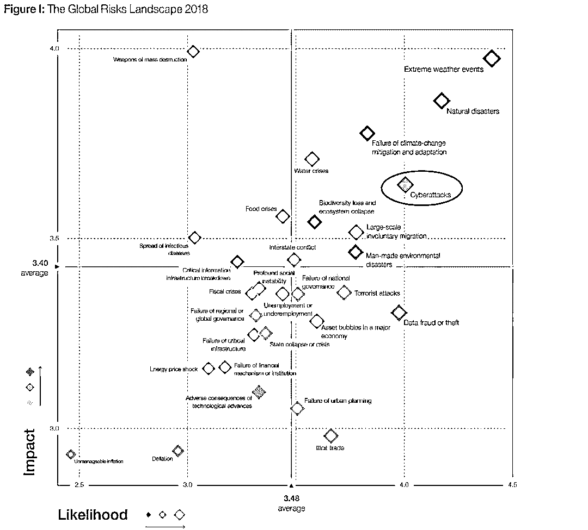

2018 年全球风险报告

网络安全已经成为除自然灾害以外，最大的风险所在

1

**全球互联网的至暗时刻**

早在 2016 年网络安全技术高峰论坛上，全球著名信息安全专家，卡巴斯基创始者尤金•卡巴斯基曾表示，目前网络安全正处于一个黑暗时代……

卡巴斯基公司 CEO 尤金•卡巴斯基先生发表讲话

*   **网络威胁呈现几何式增长**

    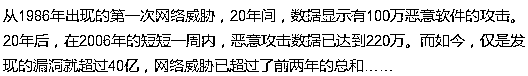

*   **全球资产损失达千亿美元**

    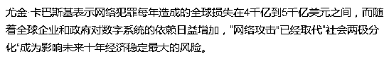

    全球最大的保险公司 Lloyd’s of London 在 2017 年发布报告表示，大型全球性网络攻击可能会使得全球经济平均损失 530 亿美元，而这一数据甚至已超过 2012 年导致美国 113 人死亡，联合国总部受损的飓风“桑迪”（飓风“桑迪”所带来的经济损失，总计 300 亿至 500 亿美元之间）。Lloyd’sof London 向全球发出警告，网络攻击带来的经济损失堪比飓风或其它自然灾难！

*   **网络威胁更加复杂**

    随着物联网的发展，以及人工智能技术的突破，让网络攻击形式与手段变得愈发多样。曾以为办公室系统或手机是最容易被攻击的，事实上很多连接到物联网上的设备都可能受到攻击。包括：智能家居、智能汽车、智能火车、地铁甚至一些电厂电站等，现在它们都变成最容易被攻击的目标。另外一方面，人工智能技术应用逐渐渗透到各个领域，黑产组织已实现高度还原自然人行为的技术突破，骗过传统风控体系，给政府以及企业带来致命打击。

然而讽刺的是，这位全球信息安全的领军人物，至今不用智能手机.....

前卡巴斯基代言人  周杰伦

2

**“网络黑产”，另一个平行的互联网世界**

没错，不经意间，这群人的确将地下产业链玩成了“产业”，而且市场规模更是达到了千亿级别……

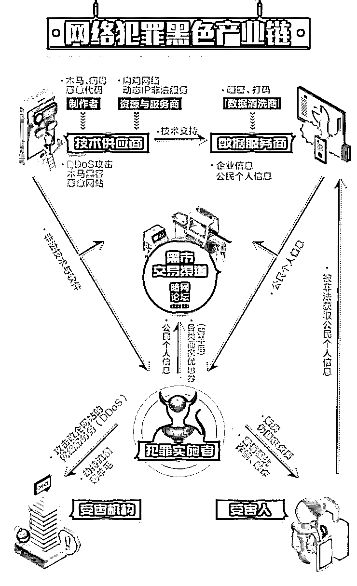

源自《2017 年度网络黑产威胁源研究报告》

黑产是黑色产业的简称，广义上包括贩毒、高利贷、私彩、网络诈骗等行业，狭义上是指利用互联网技术不正当获取利益的一个行业，现在提到黑产一般指狭义上的黑产。黑产一般都有交易链，通常在搜索引擎搜索不到、一般人也难以进入的暗网进行大规模交易，也会在私人网站或者交易论坛进行交易。

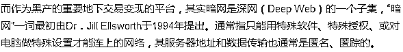

根据美国 Market Watch 调查数据显示，目前全球范围内，存在三大黑网交易市场，分别为：Dream、Wall Street 与 PointMarketplace。

*   Dream 市场

    作为深网最古老的市场，Dream 从 2013 年就屹立不倒，而这对于黑网来说，可以说是历史悠久了。诈骗和萧条通常会在一年内终结一家暗网市场，而 Dream 仍然存在，这证明其稳健强大。它接受比特币核心钱包，比特币现金和门罗币，拥有 50,000 个数字商品和 63,000 个药品目录。在“其他业务”类别中又包括：复古 Air Jordan 运动鞋、500 欧元纸币、信用卡号码和变态色情订阅。还有一个“服务”部分，在这个部分你可以购买假身份证或针对 Youtube 上您特别讨厌的视频订购差评服务。只需 0.8 BTC，你可以完全消失，然后以全新的身份出现。

*   Wall Street

    充满恶意和双重交易的 Wall Street 是一个罪恶与阴谋汇集地。该网站声称拥有将近 3000 个供应商和 400,000 个客户，并接受 BTC 和 XMR。相对于 Dream 而言，WallStreet 的产品较少，但拥有更多的类别包括“安全与托管”，就在“欺诈”一栏边上。并非所有可以在深网上购买的东西都是非法的，比如，曾有媒体表示，在上面看到过有人卖代餐食品。

*   Point MarketplacePoint

    前身为 Tochka，是自 2015 年以来一直运行的俄罗斯 DNM。它具有许多创新特性，包括秘密交收情报点，使供应商可以将产品留在某个位置，买家随后收集。该网站的正常运行时间比 Wall Street 和 Dream 的要少（三者分别为 90%和 97%和 98%），并且在过去几天内一直处于离线状态。不过，Point 的客户服务得到高度评价，并且该网站会储存你期望在深网上找到的所有常用物品。

而我们接触到更多的还是在暗网上售卖的各类互联网巨头的敏感信息，其中就包括

Gmail、Facebook、Uber 以及 Grubhub 等用户信息，售价分别为每份 1 美元、5.2 美元、7 美元、9 美元......

而在上面交易的各方，因为暗网的特殊性，并不为人所知。这里面就包括巨头 Facebook……

2015 年从雅虎跳槽到 Facebook 的阿列克斯·斯塔莫斯(Alex Stamos)表示，曾经为核查用户有没有选择弱口令，公司从黑市购入黑客售卖的口令，与网站所用的加密口令进行交叉参照。

Facebook 首席安全官 AlexStamos

遗憾的是，3 年后东窗事发，Facebook 曝出信息泄露丑闻。多家英美媒体披露一家名为“剑桥分析公司”的数据分析企业，在未经授权的情况下，获取了美国社交媒体脸书多达 5000 万用户的个人信息，用于软件设计以预测并影响选民投票。而在这次数据泄露事件引发 Facebook 内部动荡中，首席安全官 AlexStamos 也宣布将于 8 月离职。

3

**“网络黑产”，一个规模达千亿级的****市场******

作为全球互联网黑色产业的风向标，网络“黑产”在中国的发展史极具代表性：

*   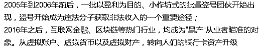

而这个规模达千亿级的市场，更是表现出惊人的细分，其中主流的包括：薅羊毛、电信金融诈骗、养号刷单、木马病毒、网络私彩、知识盗版、搜索引擎“优化”、大流量 DDoS 攻击八大类。在这八大类下，又延伸细分出更多领域。

黑产图谱

**一、木马病毒产业链：**

这一产业链历史悠久，也是伴随着电脑病毒的社会化而逐渐成熟。

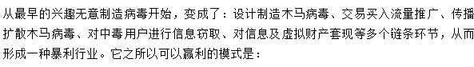

1，最早的制造者开发并制作具有盗号、远程控制、自动传播等功能的木马病毒，并根据时事热点设计这类木马的传播方式、触发环境，并及时针对杀毒软件开发出免杀功能，及时更新并维护；

2，提供流量交易环节的人比较复杂，有网络行业的内鬼、有无良站长，也有黑客，他们会通过各种手段实施“挂马”为木马病毒提供传播与存在的平台及流量；

3，“包马人”是这一产业链的核心，他们对上购买木马病毒，对下采购网络流量，实施网络“挂马”之后，开始从中窃取收获各类有用信息并进行整理，主要是各种实名信息、隐私信息以及各类网络帐号以及帐号内的虚拟财产；

变种与扩展： 

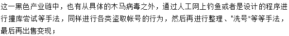

最近由于苹果设备的流行，更有研究利用 Apple ID 的管理规则为被盗 iPhone 进行解锁服务的等等，都大致可以属于这一大类产业链中。

**二、养号刷单产业链：**

这一产业链包括：养号、刷单与利益变现这三个主要环节。

养号这一块有两个来源，一是通过网络招募人来参加，只是这类号的平台非常分散，质量参差不齐，而且也难以统一调度，越来越不被重视。

而眼下真正能够形成市场的是通过定制开发的程序甚至是专门设备，可以批量拥有大批的手机号、指定系统的帐号甚至是能拥有一定权限与层别的帐号。

然后以这些帐号按照指定规则去生成所需要的相关数据与指标，最后拿这一结果来兑换最终的收益；

虽说是流程相似，但是在具体的实施操作中，会根据刷单的目的分为数据刷量服务、奖励补贴盈利以及敲诈勒索等多种方向：

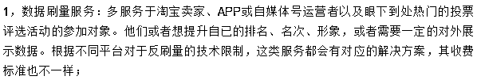

2，奖励补贴盈利：做这一类工作的也称羊毛党。主要是针对电商平台、商家促销、媒体自身有奖推广等活动，研究其规则漏洞或规律，以大量的养号、密集的操作以及快速的技术应对，从中赚取大量的奖品、兑换券、优惠券甚至是直接的返利金额，再将不同收益通过相关渠道进行变现；

变种与扩展：

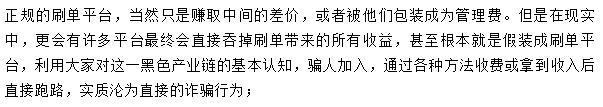

此外，网络上也经常介绍的游戏装备低价代购、低价代充值等等黑产业链，利用的是苹果公司或其它平台公司的退款漏洞，这是属于这一条里的变种；还有一些代收验证码、代注册帐号等，也是这一类里羊毛党里的变种；

**三、流量劫持产业链：**

这是最具互联网特质的黑色产业链。

因为网络企业大多都离不开流量，无论哪个行业、哪个品牌，都需要各种访问量、展示量。依赖于广告营收的行业更是离不到高流量的支撑。

那么，除了常规的广告推广与各种引导之外。通过一些不光彩的技术手段，对正常网民上网的访问流量进行劫持、误导甚至是替换，就有了非常大的应用市场；

1，有直接在不同电信服务商内部的员工与技术人员，私自进行网络协议层面的恶意解析，在确保劫持概率在正常人不易发觉的前提下，将原本是访问 A 的流量故意解析劫持到 B 处去，再向 B 收取高额的流量推广费用；

2，有黑客或木马病毒的制造者，通过攻击用户家里的路由器或者某些小区、单位里的相关网络设备，从而掌握一大批能够被自己所控制的“肉机”设备，然后针对不同用户的需求，直接将这里所能拥有的一定流量进行劫持后出卖；

在这一产业中，也会有一些灰色部分。

比如说某些打着安全监控名义的软件，某些打着网址导航旗号的产品，也有直接做浏览器、搜索引擎的软件方。

会以各种擦边球，诱导用户在指定情况下进入它们的页面。这本质仍然是一种劫持。然后再把劫持下来的流量变卖给出价的一方；

**四、网络私彩产业链：**

由于国内至今为止都未对网络彩票开放牌照申请，因此，凡是在网络上开展彩票业务的，均属于黑色产业。

私彩最大的问题就在于，没有任何授权许可部门以及监管力量。

比如说，某些自称同步于国内体彩与福彩数据的站点。对方根本就没有真实出票，这被叫做“吃票”。

而万一有人中了不大的奖金，私彩站也就自己出了，这与购买费用来比，是小巫见大巫。而万一有人中了大奖金，私彩站也就直接卷钱跑路，大不了改头换脸再来；

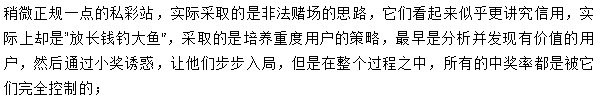

**五、知识盗版产业链：**

这一条黑色产业链的历史更为悠久，衍生发展的也非常之多。

这类站点从最早的互联网上遍地都有，到目前的躲躲藏藏，但其背后的利润率，却随着知识产权的水涨船高而变得越来越丰厚；

**六、电信金融诈骗产业链**

这一类大家更熟悉了，之前主要基于电话手机进行，之后随着 QQ、微信的普及，开始在互联网上漫延。

主要由群发信息撒网、客服接听收线、钓鱼诱导或直接诈骗、钱款到帐后快速转移等多个环节密切配合。

这类产业链的手法不断更新换代，其核心就是利用人的贪念、色欲、胆小及人情弱点。有冒充公检法警、有冒充家人亲友、有冒充领导客户、有冒充名人大腕，虽然花样百出，但均属同一类型；

****七、黑帽 SEO****

黑帽 seo，手法不符合主流搜索引擎发行方针规定。黑帽 SEO 获利主要的特点就是短平快，为了短期内的利益而采用的作弊方法。

目前，白帽 seo 与黑帽 seo 没有一个精准的定义。笼统来说，所有使用作弊手段或一些可疑手段（如博客作弊、网页劫持、挂黑链、垃圾链接，隐藏网页、蜘蛛池页面引流等）的都可称为黑帽 SEO。

**八、大流量 DDoS 攻击**

通俗一点，类似于电影里面经常出现的桥段，黑势力为了获取保护费，组织大量社会闲散人员恶意占座，导致个体商户无法正常经营。而这一手段，对受攻击企业来说，其危害可能是毁灭性的。也是目前最强大、最难防御的攻击之一。

4

**专家意见：技术创新、人才培养和政府合作**

针对上面一系列问题，目前安全圈还未有一个趋近完美的解决方案。Magiccc 这里就搬运尤金·卡巴斯基的意见，因为觉得这个思路是当前看到最为靠谱的论断：

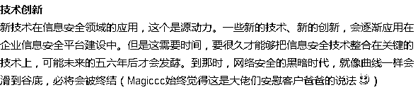

**人才创新**

如果说技术创新是信息安全领域突破的源动力，那么人才创新则是这一切的源动力。世界各国要花很长的时间才能让 IT 人员变成信息安全类的专家。大佬说的很对，目前信息安全这块的人才，可以说已关乎到一个企业未来能走多远。

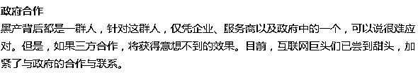

最后，还是想说，信息安全的攻与防将是一场持久战，我们均在其中，唯有重视安全建设，不断技术创新才有可能在黑产组织攻击之前做好防御，抵御潜在威胁。

* * *

**【灰产圈】高端社群小程序开通，2018 最值得加入的社群！**

<mp-miniprogram class="miniprogram_element" data-miniprogram-appid="wx4f706964b979122a" data-miniprogram-path="pages/topics/topics?group_id=881854415822" data-miniprogram-nickname="知识星球" data-miniprogram-avatar="http://mmbiz.qpic.cn/mmbiz_png/kialtkOXGKS7D9hZrmO2jzDqryXXTAlhxSpnrKnHGV65KXzicibOppaPic4dCRxftvabB8Iqswo3OuQEDSxE7NicXBg/0?wx_fmt=png" data-miniprogram-title="【灰产圈】高端社群" data-miniprogram-imageurl="http://mmbiz.qpic.cn/mmbiz_jpg/WWG78hysZ0brJkWoyG2VDIacqgQjkDfp6mLiaoPBJ2SgWZHtRuTw7ia8kpoxntsn7PiaFOQO2U23FW6Iry0gS1GnA/0?wx_fmt=jpeg"></mp-miniprogram>

**点击加入【灰产圈】高端社群**