# 黄牛：618，我是这样被耍的！

> 原文：[`mp.weixin.qq.com/s?__biz=MzIyMDYwMTk0Mw==&mid=2247492225&idx=1&sn=9a5800de197e7c81a9c2fe5896c3fb96&chksm=97cb29b9a0bca0af11eca80bce5446411cab35da057b42591f937726e2dcce4666c6a7416388&scene=27#wechat_redirect`](http://mp.weixin.qq.com/s?__biz=MzIyMDYwMTk0Mw==&mid=2247492225&idx=1&sn=9a5800de197e7c81a9c2fe5896c3fb96&chksm=97cb29b9a0bca0af11eca80bce5446411cab35da057b42591f937726e2dcce4666c6a7416388&scene=27#wechat_redirect)

**点击上方蓝色字体“灰产圈”关注并置顶本公众号**

导语

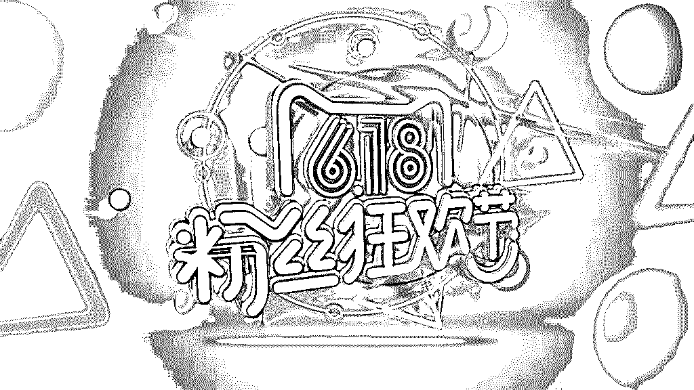

在淘宝京东这个圈子里，刷单和黄牛都已经是行业公开的秘密，前者赚的是「假装购物」的辛苦钱；后者则是「真实购物」，把商品买到手，再转手赚差价。

刷单越来越难，有没有别的办法？

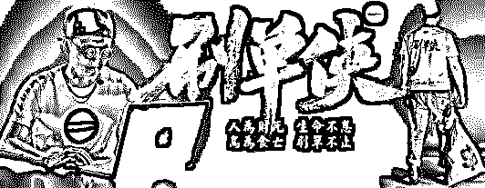

在「刷销量」这个话题上，也许你能想象到最简单的手段就是「刷单」 —— 请人假扮顾客，用以假乱真的购物行为提高销量。

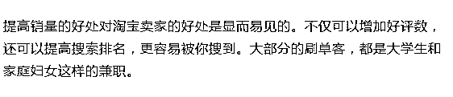

但是对于电商平台来说，刷单和黄牛总是弊大于利的；2014 年之后，京东和淘宝都相继推出了自己的风控系统。

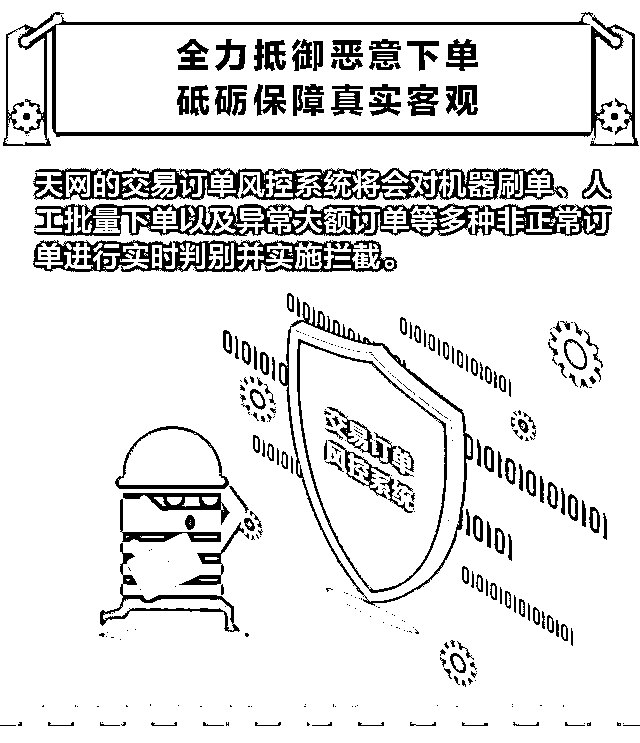

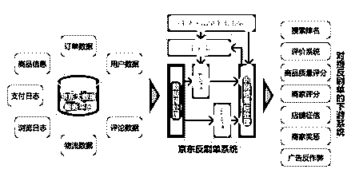

**京东天网运作流程**

2015 年 12 月，京东宣布风控系统「天网」已经拦截恶意订单请求 1.4 亿次，封杀了 1.2 亿个恶意账号，这个数字是什么概念？

京东那一年的活跃用户是 1.53 亿，这样的数字对比还是很夸张的，就像是每一个正常逛京东的普通用户，对面都坐着一个刷单客。

当刷单越来越难的时候，作为厂商该怎么冲销量呢？

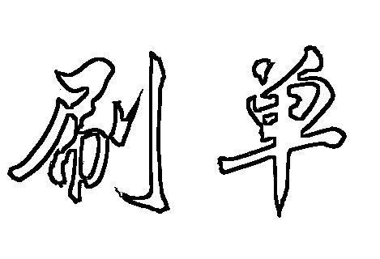

答案是「耍牛」。

大型促销活动里

有一场悄无声息的降价

黄牛和前面所说的刷单客不同，刷单客赚的是「假装购物」的辛苦钱，而黄牛是真实购物，把商品买到手，再转手赚差价。

如果顺利的话，618 将是黄牛们的「春节」。

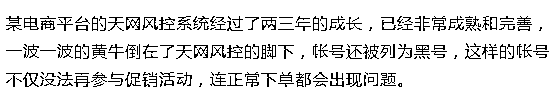

但是在 618 这样的盛大节日，天网仿佛被暂时关闭了。

黄牛们的黑号被临时「特赦」，不仅可以随意参与 618 活动，还可以无所顾忌的「暴露身份」：比如在这期间买它个 10 部手机，发往同一个地址，也不会被封。

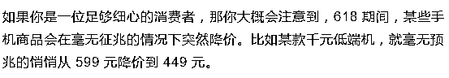

150 元，对于你来说只是一张大额红包或者优惠卷的力度，但是对市场而言，它就是哨声。因为这个价格，已经低于渠道收货价。每买到这样一部手机，一转手就可以进账几十元，一个订单 10 部就是数百元，这是任何一个黄牛都无法拒绝的无风险套利价格。

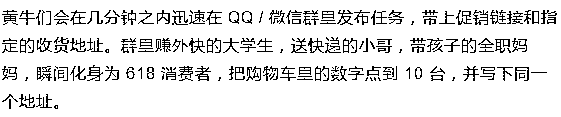

不久之后，订单就显示「已经进入 XX 号仓，准备出库」「预计 6 月 27 日送达」，这让黄牛们放下了心，因为这说明某平台的天网风控并没有拦下它们，这单成了。

618 活动当天中午 11 点，某平台正式发布第一波战报，荣耀、小米、苹果销量名列前三。

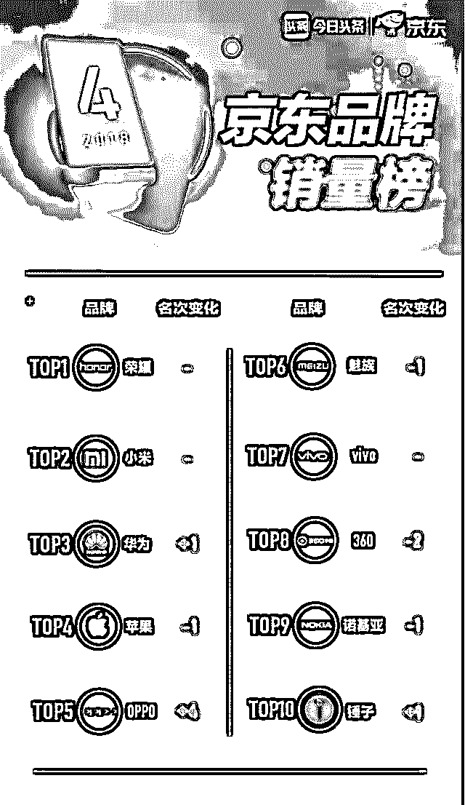

厂家以降价为哨，黄牛以差价为食，平台以销量为榜，而部分幸运的消费者，也真实的享受到了真正的全网最低。哨声牛声欢呼声，声声震耳，描绘一个盛世的狂欢节。 然而游戏结束了么？

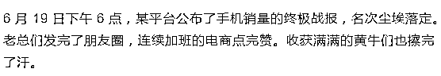

订单取消，黄牛被耍？

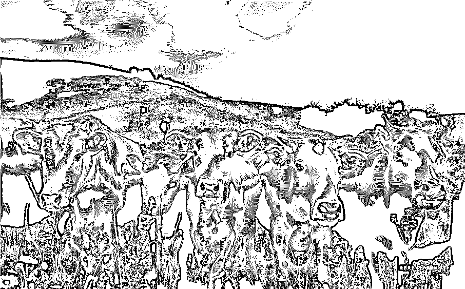

可是从 19 号晚上开始，黄牛们才发现这场促销活动最大的「彩蛋」。

前面提到的那款悄悄降到 449 元的手机，以「检测为异常订单」的理由，一波一波地取消了黄牛们的订单。QQ 群里一片哀鸿遍野，黄牛们感受到了强烈的不满，以及被利用的意味。

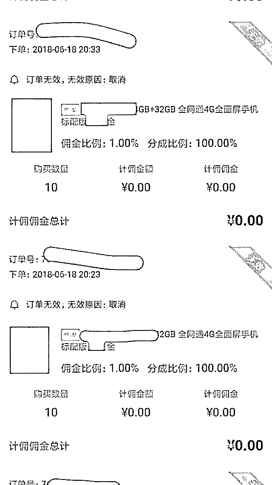

为什么连天网风控都没有拦截的订单，却在 19 号公布终极战报之后，被厂商单方面取消？这不重要，重要的是这些订单最终没发货，却算在了战报的销量里。这让人不得不怀疑，厂商一开始「无声降价」的初衷。

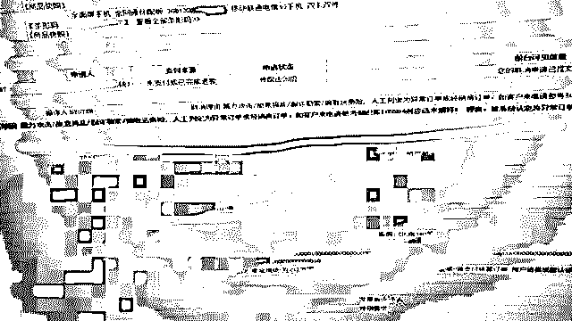

据我们了解，这款 449 的百元机只是冰山一角。当天许多低端机型都参与了这样的「耍牛活动」。

满 10000 减 1000 ？

你用不上的超大额优惠券

当然，在这样盛大的促销活动里，也不全是消极黑暗的一面。

在 618 活动刚开始的时候，小米和荣耀还发了一些你想象不到的「大额优惠券」，有多大呢？大到满 5000 减 500、满 10000 减 1000 这种额度。

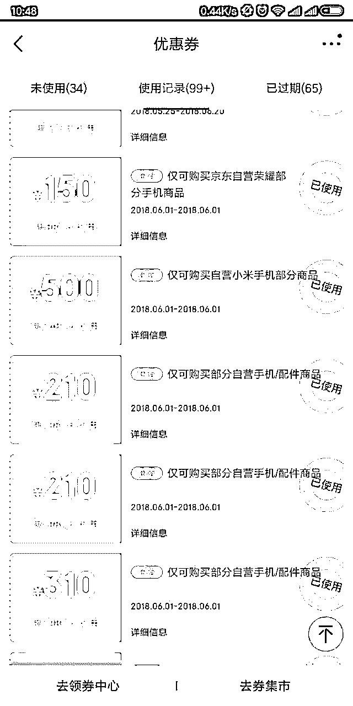

这些优惠券都固定对应着一个机型，并且用券条件（满多少钱）刚好需要一次性买 10 部。比如当时红米 5A 的价格是 548，一单买十部刚好达到用券条件 5480，减 500 到 4980 元。条件之苛刻，意图之明显，就差直接叫「黄牛券」了。

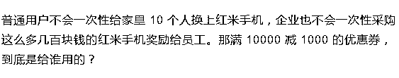

据说这些优惠券是为代理商们准备的。对于这些互联网品牌来说，它们缺乏下沉到三四线城市的渠道和力量，但这些好用便宜的互联网千元机（百元机）在小城市又有非常旺盛的需求。也许是为了减少铺货成本，厂商尝试和小代理商利用这样的默契，实现奇妙的云供货。

当然，代理商们领了这个优惠券买起来固然是爽，但和普通用户一样，他们同样是在跟黄牛们赛跑 ......

也不是没有厂商刷单，厂商提供「保底回购」

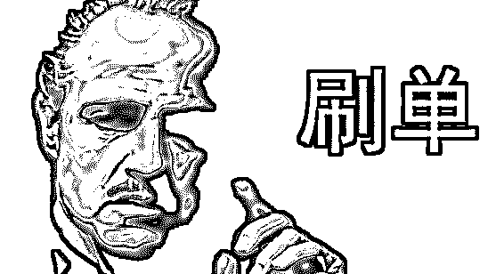

当然，还是有厂商在某电商平台上「刷单」的，但是比起 C2C 的电商平台来说，成本要高一些。

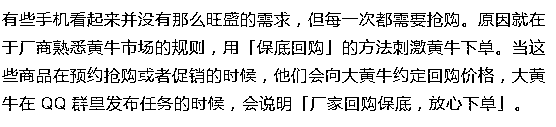

黄牛们下单，转手，赚差价，几经波折，商品最后又回到了厂商的手里。这已经非常接近传统意义上的刷单，只是对象从校大学生和家庭妇女进化成了黄牛。

不过有趣的是，现在只剩一家厂商，并且只针对一款最近新出的机型这样干了。连黄牛也不知道厂商这样做是为了什么。

闹剧的背后，怪谁？

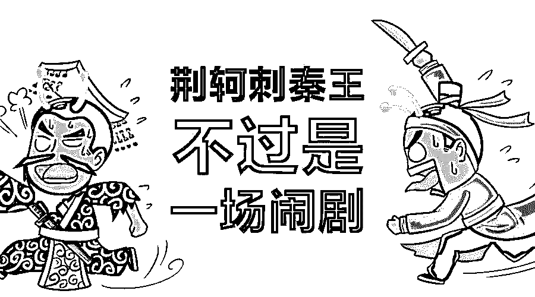

以上就是厂商和黄牛们的故事。现在，刷销量变成了一门越来越难的活儿，厂商奔走无门的情况下，只能试图与黄牛找到一条共存之道。

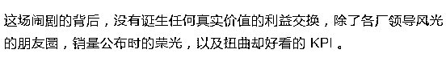

我们该怪谁呢？怪「贪得无厌」的黄牛，还是凌晨熬夜加班的电商员工？还是背负销量压力的领导？

只能怪 618 了。

> 本篇文章含有爆料人和撰稿人的适当推理，因此隐去所有涉及到的具体品牌。感谢理解。

最后，还有一些有趣的交流

这位「传统意义上令人可恨」的黄牛联系到我们，说出了上面的故事。最后，我们还找这位黄牛朋友聊了聊，交流了一些有意思的事情：

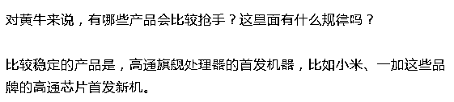

另外就是小米的旗舰机，米家的一些产品也非常抢手，比如，大到手环音箱，小到驱蚊器，都挺热门的。华为这两年的产品在黄牛市场也开始变得很热门。

·在观望厂商刷销量时，发现过什么有意思的事儿？

有个厂商连续两年拿同一款低端机刷销量，这个低端机特别惨。我们怀疑这手机到现在还不停售可能就是最大的意义就是拿来刷销量的。

·是什么产品都刷销量吗？

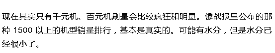

因为 1500 以上价位的手机里，产品足够好，本来就供不应求了，没必要刷销量；而产品不好的，没什么希望排在最前面，也没动力刷销量。

**责编 | Mr 厉害**

**撰文 | 纤尘**

**编辑 | 纤尘**

**封面视觉 | 邓赛**

延伸阅读[深度|2017 天猫双十一成交 1682 亿，刷单 800 亿？ 揭秘真实的刷单世界：有人赚了一辆法拉利！](http://mp.weixin.qq.com/s?__biz=MzIyMDYwMTk0Mw==&mid=2247489054&idx=1&sn=4144474a2229b0fa9c796df43dc45058&chksm=97c8dd26a0bf5430170ebdd82bef40c0ab0165d190daec669f416a6e2eacb13a0d474da267e2&scene=21#wechat_redirect)
[深度|薅羊毛黑产攻防实录：“羊毛党”与“攻城狮”之间的博弈游戏](http://mp.weixin.qq.com/s?__biz=MzIyMDYwMTk0Mw==&mid=2247489704&idx=1&sn=fd723f4a71b42686451bce2641707a67&chksm=97c8d390a0bf5a8659576c4f7fa98f6c43942f61a32de88f9818a6f61f990325ba04964294b9&scene=21#wechat_redirect)
[大揭秘：神秘的 淘宝职业“打假人”  灰色产业链， 年薅“淘宝” 上亿羊毛。](http://mp.weixin.qq.com/s?__biz=MzIyMDYwMTk0Mw==&mid=2247488824&idx=1&sn=87de122c8ffb49dcfd4df5fa1f2872ca&chksm=97c8de00a0bf57168c3c6be6b71fb98b6d0507dc809a04148143cc9044065f1b5bf5c404130c&scene=21#wechat_redirect)
[淘宝开了一家大型网上“赌场”，无数人深陷其中家破人亡，但却合法！](http://mp.weixin.qq.com/s?__biz=MzIyMDYwMTk0Mw==&mid=2247489631&idx=1&sn=90408e3c8eb9c314cc991a22fdb181ce&chksm=97c8d367a0bf5a71575aa731aa1907377f64f1427091d63805cff964e020e5f4af4c0f67bea5&scene=21#wechat_redirect)
[深度|不到 15 小时，淘宝就下架了“淘必中”游乐园板块，却对我们发起了投诉！](http://mp.weixin.qq.com/s?__biz=MzIyMDYwMTk0Mw==&mid=2247489682&idx=2&sn=606ee20b6d87ad206151c95e3977b71d&chksm=97c8d3aaa0bf5abccf332af359559371e5d06cb0ae18002dfe3d238616cf1fe8d63c5817eefe&scene=21#wechat_redirect)

* * *

****

****点击加入【灰产圈】高端社群****