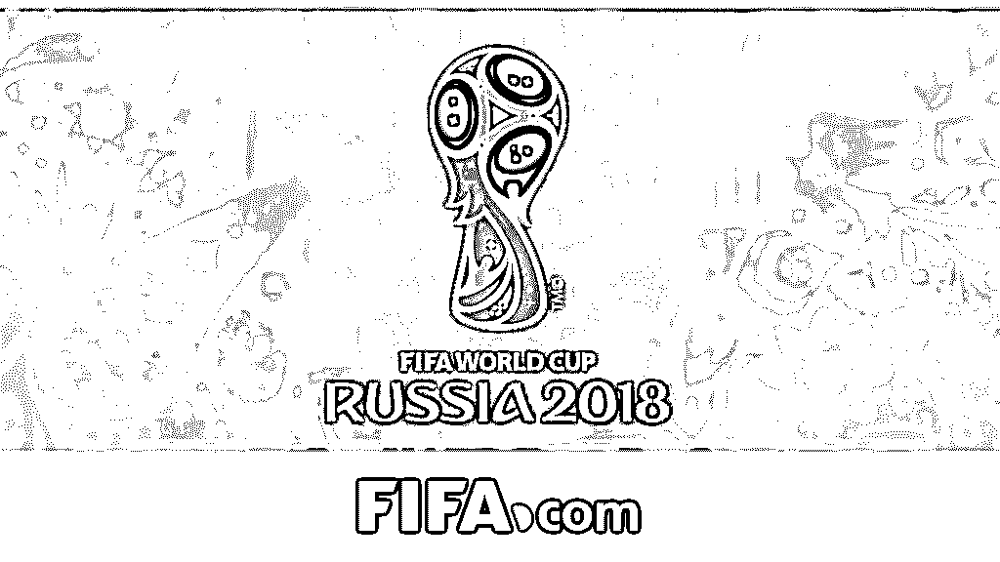

# 揭秘|为什么足彩合法赌球违法？

> 原文：[`mp.weixin.qq.com/s?__biz=MzIyMDYwMTk0Mw==&mid=2247492164&idx=1&sn=a145b2b5efe651aa27bf69365d4c1ba8&chksm=97cb297ca0bca06a2929779b55f7fba760caf3bedbd44050dec423c53085ee8d3fd8becdba88&scene=27#wechat_redirect`](http://mp.weixin.qq.com/s?__biz=MzIyMDYwMTk0Mw==&mid=2247492164&idx=1&sn=a145b2b5efe651aa27bf69365d4c1ba8&chksm=97cb297ca0bca06a2929779b55f7fba760caf3bedbd44050dec423c53085ee8d3fd8becdba88&scene=27#wechat_redirect)

**点击上方蓝色字体“灰产圈”关注并置顶本公众号**

**授权转载：中新经纬**

导语

今天凌晨克罗斯第 95 分钟绝杀，德国队逆转瑞典，最后的惊天大逆转不知让多少买了足彩的人为之大肆欢喜。

**为啥今年不能网络购彩了？足彩和赌球的区别在哪？世界杯是不是有赌球阴谋？**

“有毒”的世界杯

对于很多球迷而言，这届世界杯真的有“毒”。

**阿根廷队长梅西代言的国内某乳企广告被网友们 p 图玩梗**

而如果看球前还买了些足彩的话，心情恐怕就更郁闷了。

“压谁谁爆冷，买谁谁翻车”，无怪乎目前最流行的世界杯笑话是“足球反着买，别墅靠着海”。

如果和往届对比来看，这个数据更是惊人。2014 年，整个巴西世界杯期间竞彩足球的销售额也才 123 亿多元。

**▲上、下表分别为开赛前后一周的彩票销售额来源：中国体彩网**

彩票卖的如此火爆，相关的讨论和热议自然也不少。今天跟大家聊聊其中的三个热门话题：

> **1、为啥今年不能网络购彩了？** 
> 
> **2、足彩和赌球的区别在哪？**
> 
> **3、世界杯是不是有赌球阴谋？**

网络禁彩？是的

相信不少人都注意到了，苹果应用商店近期的下载排行榜中，多款彩票类的 app 曾一度占据了前几名的位置。

不过很快，这些 APP 不约而同地进行了“系统升级”，暂停售彩，又从榜单上掉了下来。

中国福彩中心的工作人员近日在接受媒体采访时也表示，从未授权任何一家网站或机构通过互联网售卖彩票。

**▲6 月 20 日（左）与 6 月 23 日（右）的苹果商店下载排名，彩票类 app 已难觅踪迹**

仔细梳理的话，从 2007 年至 2015 年，国内对于网售彩票有过前后 5 次叫停活动。其中属最后一次力度最大，执行时间也最长（至今）。

而这次治理前，发生了两件大事。

第一是 2014 年，互联网彩票销售迎来了一次井喷式的爆发。

靠着世界杯的热度，以及微信、支付宝即可购买的便利性，人们购买彩票的热情被迅速点燃。

据彩通咨询的分析报告显示，当年中国互联网彩票销售规模达到了创纪录的 850 亿元，比 2013 年销售规模翻番，增长 102．4％，渗透率达 22．2％。

与此同时，市场的乱象也涌现了出来。市场的火爆带来了腐败和回扣的问题，甚至有人假借国家彩票的名义，销售私彩。

第二则是 2014 年 11 月，国家审计署出动特派办对全国 18 个省份开展彩票资金审计工作。这也是建国以来，首次对彩票行业的资金状况进行大规模的审计。

**▲如今通过微信只能参与这样的非现金式娱乐性“博彩”**

在此前新浪网的一项“您希望网络彩票如何发展”的网络调查中，合计超过 7 成的网友希望向部分合规公司授权或只允许彩票机构官方平台销售。

足彩和赌球有区别吗？

我们直接说最核心的部分，国内以足彩为代表的彩票销售，核心目标是募集公益资金，而非盈利。

那这部分钱都用来干嘛了？不说虚的，让我们来看实打实的数据。

据财政部披露的 2016 年彩票公益金分配使用情况（2017 年的还未发布）：

> **315．6 亿元用于补充全国社保** 
> 
> **26．3 亿用于老年人、残疾人、孤儿、有特殊困难等人群福利建设**
> 
> **26．3 亿元用于支持群众体育和竞技体育发展**
> 
> **10．5 亿元用于教育助学和大学生创新创业项目**
> 
> **18 亿元用于困难群众医疗救助**
> 
> **3 亿用于农村贫困母亲“两癌”救助**
> 
> **1 亿元用于出生缺陷干预救助**
> 
> **3000 万元用于禁毒关爱工程……**

具体的使用明细很长，篇幅所限不再一一列举，大家可以去财政部官网查阅。

这就是你购买足彩和去国外赌球的根本差别之处，即使没有中奖，投入的一部分钱财也依然会回到你的生活中，只不过换了一个模样，像这样：

或是这样：

当然这其中也有黑幕，你们懂得，在这里就不便于多说了，后期可能专门就福利彩票行业做一期深度揭秘。

世界杯是不是有赌球阴谋？

  

世界杯是不是有赌球阴谋？

世界杯是不是有赌球阴谋？

这个话题也是近期的热门之一。

知名音乐人高晓松在 2012 年的一期关于“赌球”的脱口秀节目被许多网友再度找了出来，作为理论依据。

**▲高晓松认为，外国赌博公司可以暗中干预球员和球队，“想让你进一个进一个”**

**▲还不忘调侃下中国队……**

这样的说法有着不小的争议，信的人和不信的人都能各种拿出理论和案例来辩上半天。

有个朋友刘磊算个资深球迷，他就对于这种说法不屑一顾。

“世界杯这种级别大赛，被赌球集团操控的可能性为零。

全球各家的博彩公司都盯着，不可能立场如此一致。

而且能参加比赛的球员也都是各自国家的大牌，没人愿意冒险挣这个钱的。”

**当然，这仅代表的刘磊的个人意见，灰产圈还是有自己的见解的，详情看本文末尾的文章。**

结尾

“十赌九输，庄家不会让赌客把钱赚走，任何庄家都会通过盘口和水位调整整体的投注额，令自身处于不败之地，赌客想要成为最后的胜利者实在太难。

**灰产圈友情提示：**

现在天台排队的人已经排到地下停车场了，

请各位球迷理性看球，小赌怡情，大赌伤身。

不要再相信什么“足球反着买，别墅靠大海。偶尔买平局，开上布加迪。冷门下重注，超越拆迁户“之类的赌球秘诀了！

这届世界杯，感觉全在踢假球，只有中国人在认真赌博。

* * *

延伸阅读[写在 2018 世界杯前夜：庄家的狂欢，赌徒的末日！](http://mp.weixin.qq.com/s?__biz=MzIyMDYwMTk0Mw==&mid=2247492007&idx=1&sn=312e2e85168e92a0eb371a9df1721350&chksm=97cb2a9fa0bca389689d73631f94d3cf948004cf006ac29b93ea6f07b22758ed654f201b6bd7&scene=21#wechat_redirect)
[围观世界杯：揭秘不为人知的世界杯黑幕！](http://mp.weixin.qq.com/s?__biz=MzIyMDYwMTk0Mw==&mid=2247492031&idx=1&sn=1a8c2ee93b5fce7ceeaa9a268a05661c&chksm=97cb2a87a0bca391363665f74b40bb1f54eb0c0e349e481e0ed7cc37234d2baf861536f94704&scene=21#wechat_redirect)
[世界杯黑幕！告诉你世界杯究竟有多“脏”！](http://mp.weixin.qq.com/s?__biz=MzIyMDYwMTk0Mw==&mid=2247492031&idx=2&sn=16e4eb4d93b9d1d4455d6507a06e9e5f&chksm=97cb2a87a0bca391004ea1f8b5027a811e8462fa2cd99b89fb8fdf83c3268bea2112c386f93c&scene=21#wechat_redirect)
[世界杯比赛东道主球队得到特殊照顾，是黑幕吗？听听老梁怎么说](http://mp.weixin.qq.com/s?__biz=MzIyMDYwMTk0Mw==&mid=2247492031&idx=3&sn=9b43afba874e9d3c8e855e0b32de6aeb&chksm=97cb2a87a0bca391d7e2944edffa7a0192fcbea2c924437fde2fa7ff5affe056a582dc9cb09a&scene=21#wechat_redirect)
[深度|揭开层层迷雾,带你走进网络博彩的暗黑世界:500 万赌徒，年输上千亿！](http://mp.weixin.qq.com/s?__biz=MzIyMDYwMTk0Mw==&mid=2247489469&idx=1&sn=068689f941b55b11473a6595f2da08f1&chksm=97c8dc85a0bf5593f4f24fb20775b6448d2bd8a21cc0bc78b95a2fbf64a0e64eebe00449ed68&scene=21#wechat_redirect)

**点击加入【灰产圈】高端社群**