# 揭秘|区块链黑幕： 我们不生产“白皮书”，我们只是“白皮书“的搬运工！

> 原文：[`mp.weixin.qq.com/s?__biz=MzIyMDYwMTk0Mw==&mid=2247492086&idx=1&sn=5210a17129a85862242ae34a3cace760&chksm=97cb2acea0bca3d8076b330a1a9f0f397e8b8913f2e743c24b0bdc9ea0e0998872fa3db25447&scene=27#wechat_redirect`](http://mp.weixin.qq.com/s?__biz=MzIyMDYwMTk0Mw==&mid=2247492086&idx=1&sn=5210a17129a85862242ae34a3cace760&chksm=97cb2acea0bca3d8076b330a1a9f0f397e8b8913f2e743c24b0bdc9ea0e0998872fa3db25447&scene=27#wechat_redirect)

**点击上方蓝色字体“灰产圈”关注并置顶本公众号**

**导语**

**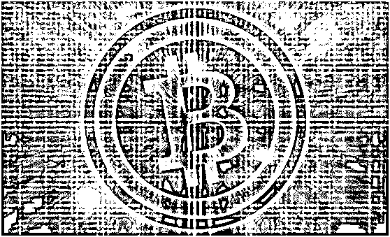**

> **成功的骗子，不必再以说谎为生，** 
> 
> **被骗的人已经成为他的拥护者。**
> 
> **————摘自莎士比亚《哈姆雷特》**

当大家一窝蜂的投身区块链掘金渴望一夜暴富的时候，新的行业又促生了另一批新职业。他们离开风险中心，靠代写 ICO 的白皮书赚的盆满钵满。

币圈生态中，有这样一群人，别人掘金，他们送水。靠服务盈利，不论币价涨跌，他们稳如泰山，只赚取属于自己的一份酬劳。据了解，从事这份职业的人全国不到 20 人。

无论二级市场如何血雨腥风，他们始终稳如磐石。

因为，他们的工作并不是信息的搬运工，而是颇具个人想象力地虚构再创作。

或许称他们“区块链白皮书魔术手”更为合适。

****探秘“白皮书”****

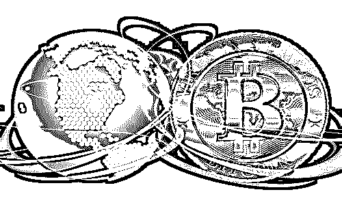

今天，灰产圈在淘宝商城内输入“区块链白皮书代写”，显示无相关宝贝。

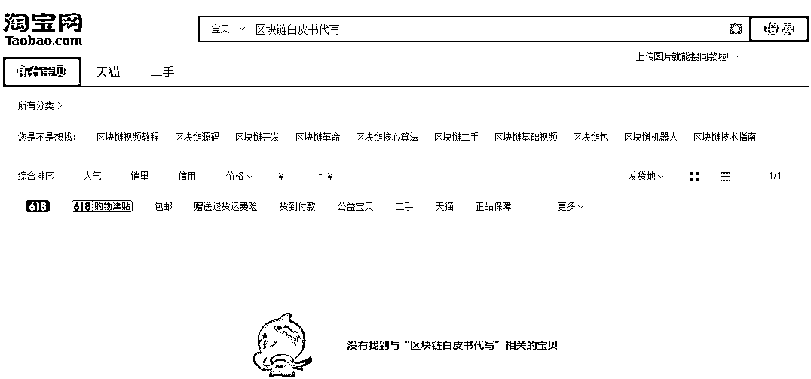

淘宝方面对 灰产圈最新回复称：“目前平台是在做基于中国人民银行等七部委发布的《关于防范代币发行融资风险的公告》的相关商品管理。”

该回复还表示，在法律、法规及相关规定所禁止销售的商品之外，平台也会对违反市场秩序、公序良俗进行主动管控。

事实上，就在一个星期前，该电商平台上还潜伏着众多靠代写区块链白皮书赚取收益的商家。

当时，灰产圈在淘宝商城内输入“区块链白皮书代写”后，密密麻麻出现几十家商铺。部分商家标出 10 元人民币售价，号称代写区块链白皮书。

其中一些商户的月成交量显示高达几千笔。

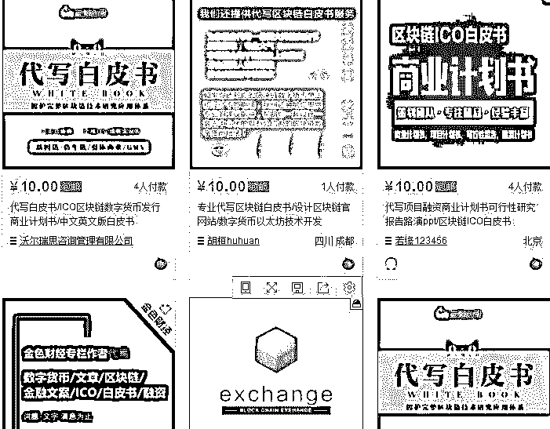

更有“客户”在商品评价区评价称，“报告写得很专业，没有天马行空，很实际地加入了现代经济的元素。”

而 灰产圈从某商家处了解到， 10 元只是明面上的价格，因为该话题较敏感。实际上，一套标准的区块链白皮书需要 3600 元，中英文版的则为 6500 元左右。

客服要求你提供项目的主要思路，主要是项目币交易逻辑、项目币应用场景、盈利模型、公开售卖计划这几块。

客服还称可以帮忙添加团队海外背景，不被网络检索发现。哈佛、耶鲁、斯坦福的专家，或者是苹果、谷歌的程序员身份，都可以伪造，并且保证在网络上找不到。

在代币发行阶段，市场上也有提供专业服务的公司，提供包括代币发行、场内币币交易系统、场外点对点交易系统、区块链钱包等多种业务的服务。

CC 就是某淘宝店专门做白皮书代写生意的老板，2017 年前是做自媒体的。在去年区块链疯狂来袭的风口上，他顺势转型瞅准了白皮书这块蛋糕。

“2017 年很疯狂，很多行内行外的人都想参与到区块链领域来。我是属于上车晚的，白皮书这块刚好和我的老本行沾点边，就入行了。”CC 对 灰产圈说。

CC 称，编写白皮书需要客户提供的素材包括：团队人员介绍、项目特写、以及确定基于何种公有链发行等内容。

据了解，只要是跟区块链技术有关的项目，他们都可以为其代写白皮书，且价格不定。

而除了淘宝上的这种小作坊式的店铺外，一些看起来专业的“代写白皮书网站”也瞄准了这个灰色商机。

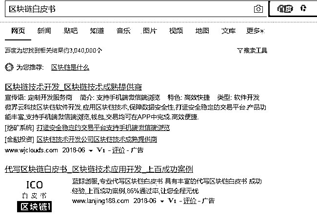

X 帮手 是一家号称全网独家拥有真正区块链技术的公司，并且提供白皮书撰写、境外包装、境外运维等服务。

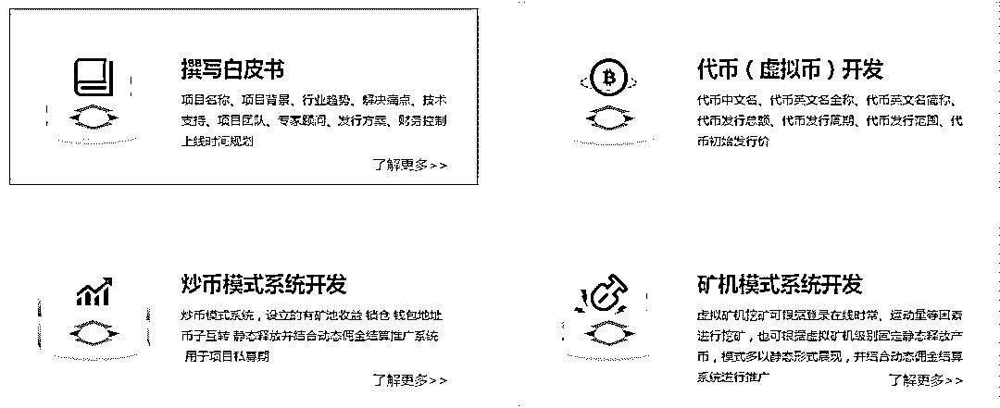

向其负责人咨询完有关白皮书撰写的业务后，对方开出了 15 万元的高价，并表示“我们是正规文献支持，欧盟法律框架，区块链应用逻辑，不是凭空说。

”

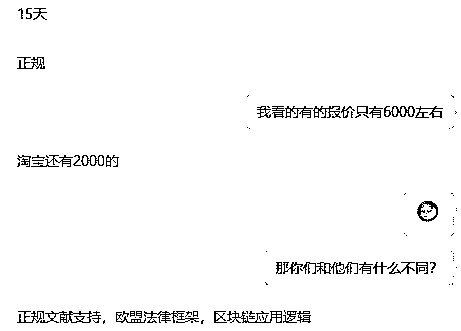

这些白皮书代写者瞄准了如今区块链市场上的一个薄弱点 : 大多数创业者并不懂围绕区块链技术的正规白皮书应该包含哪些内容，成了支撑整个黑产流水线的理由。

**上有政策，下有对策**

不过，淘宝的动作显然只是清理了极小部分，这些“魔术手们”巧妙地避开了监控法眼。

灰产圈在与一位之前交流过的淘宝商家询问为何无法搜索其店铺时，对方称点击其发送的链接就可以进入。

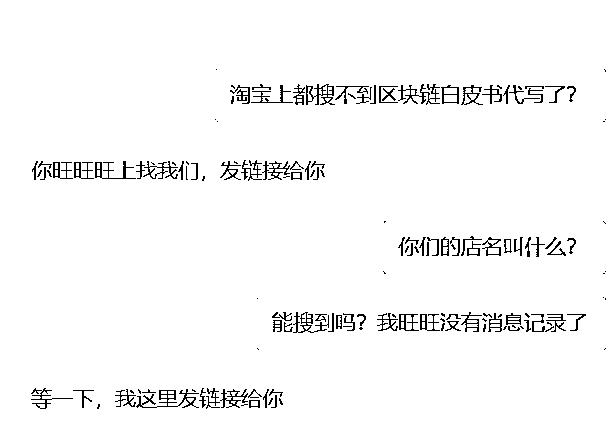

店铺首页赫然标注着“区块链”、“白皮书”等字眼，但进入显示宝贝已下架，无法下单。

该店家继续发送了另一个淘宝链接，点击直接进入了下单支付页面。 奇怪的是，该店铺页面和第一个链接里的店铺一模一样。

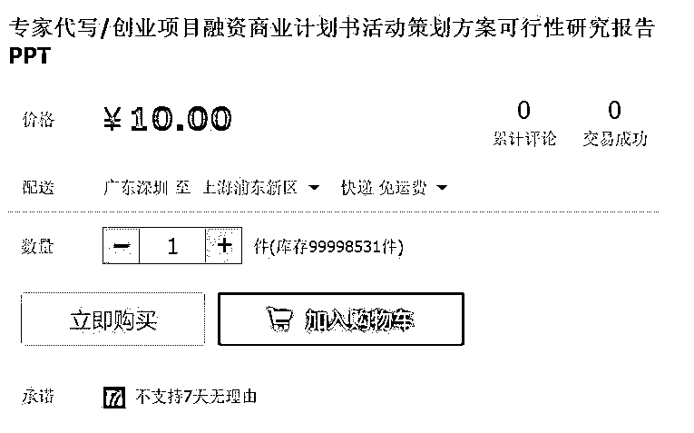

灰产圈尝试进一步了解“真假店铺”后的内幕，对方拒绝回应，并称“你只管下单就行，肯定是真的”。

这些淘宝店铺在严控下俨然成为了一副空壳子的广告牌，表面上相关服务已下架，暗地里仍在交易。

据悉，另外某些商家已将交流渠道转移至微信等私密社交平台。 某家店铺客服对 灰产圈出示的一张微信好友名单显示，备注为“代写白皮书”的客户已达 10 人。

**“水分”堪忧**

讽刺的是，这些和淘宝打起“游击战”的白皮书代写者，纯属骗局。

灰产圈从某位代写者了解到，这些“淘宝白皮书”背后写手绝大多数是一些普通的文案工作者，不仅不懂区块链技术，甚至连写代码也不会，但他们自称他们“也有逻辑”。

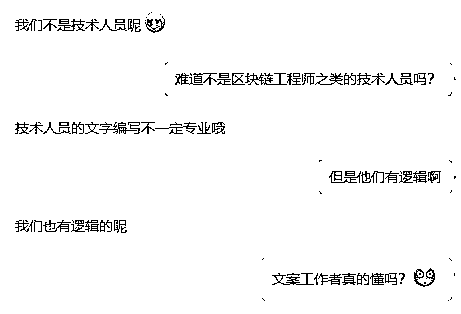

当 灰产圈试图让其为“自己的团队”添加海外以及高管背景时，对方则表示：“可以，完全不会露陷”。

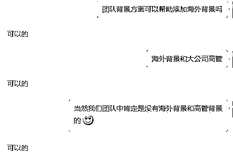

一名代写区块链白皮书的圈内人甚至直接告诉 灰产圈：“如果你有思路你就给一个思路，没有思路你给我一个大纲。大纲也没有你给我一个方向也可以，我们来给你做个符合逻辑的白皮书。”

**专访“白皮书”写手**

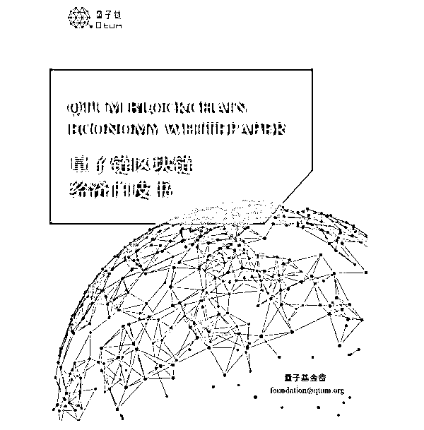

**（注：以下文章所有人名均为化名）**

不久前，知名企业区块链工程师 kk 收到一个白皮书撰写邀请，20 万酬劳，在 kk 犹豫的刹那，对方 5 万定金转账到他的微信。

“这要比做一个外包项目容易多了。”kk2016 年由技术架构转型区块链工程师，当时以太坊 40 一个，到 140 时 kk 全部抛售。他透露，区块链概念大火之后，就有了代写白皮书的生意。比起交易所里的盈亏涨跌，kk 觉得这份钱赚得更实在，“再说现在 7000 一个以太坊，再入手，心理上过不去”。

kk 坦言，由个人直接接触项目的方式并不常见，自己的订单大部分来自圈子里一个代号“TT”的人。

TT，风险投资出身。

采访时，TT 的第一句话就让我的心凉了半截：这些故事很多都不能写，有限的信息中他的名字必须隐去。如同很多国内的地下产业，灰色地带的吸利过程并不适合写成教科书大肆传播。

说起 TT，他在币圈可谓默默无闻，这也与其从事的业务有关。如果从 2014 年开始算起，TT 已经在这个行业里摸爬滚打近 4 年。

让 TT 引以为傲的是“我的货别人没有”，对淘宝上几千块一份的白皮书代写服务，TT 嗤之以鼻。“只有简单商业构思没有技术原理和架构做支撑的白皮书，只能哄哄散户，根本过不了交易所这一关。”

事实上，当前淘宝上出现了专门编写 ICO 白皮书的服务，一份白皮书的标价从 2000 元到 6000 元不等。

在 TT 看来，淘宝上这些白皮书的委托方真正投身区块链领域的可能性微乎其微，初衷往往是借白皮书圈钱跑路。“这也是为什么外界都觉得这个圈子鱼龙混杂的原因，先是骗子横行，然后围绕骗子形成了服务产业链。这些利益相关体再把骗局做大，忽悠更多的人。”

与这些初衷低劣的白皮书委托方不同，TT 服务的委托方多有来头。对外界粗暴得把他的业务描述为“代写白皮书”，TT 不以为然。“白皮书只是项目交付时的体现形式，因而很容易被外界误解为‘代写白皮书’”。

对于服务的详细内容，TT 并没有透露更多，但从 kk 的描述中，可以探知一二，“他更像是区块链项目综合服务商，从招募区块链工程师到介绍基石投资人，TT 都能一应满足委托方。”

这一点也在与 TT 的聊天中得到应证。他表示到，委托方的最终目标都是上交易所，“他们在各自所在的传统领域具备一定实力，如果说有什么共同点，就是急于转型”。

与其他传统企业选择“温水煮蛙”不同，JJ 觉得有“转型”一词过于温和，这位汽车维修服务商已经把华东地区的 7 家门店交给兄弟管理，自己全身心投入区块链创业。

“看好区块链技术并不是一时冲动，2016 年底我就开始参与 ICO 项目。面临一个最新的事物，没有壮士断腕的勇气不可能抓住机会。”这位国内 985 高校计算机专业硕士毕业生毫不掩饰他对区块链底层技术的信心。

“这是一个全新的时代开端，就像 90 年代互联网兴起之初，不少人做了先烈。但阿里巴巴、腾讯、百度就是从那个时候起步。”周围不少朋友觉得 JJ 这样的行为几近疯狂。

不过 JJ 坦言，当初接手家里的汽车维修生意之后也不是没有做过“互联网+”方面的尝试，但受制于传统业务规模，试水失败。

2018 年初，JJ 通过身边的熟人认识了区块链工程师 kk，于是有了文章开头的一幕，他向 kk 转账 5 万定金。“大公司程序员背景加上他对区块链的理解。”

当问及 JJ 何以初次沟通就向 kk 做出白皮书委托决策时，JJ 这么回答。这次 JJ 要做汽车维修领域的公有链。

事实上，JJ 曾多次找过 TT，但 TT 并没有接手这个案子，对此，TT 的回复是 JJ 的项目可操作执行程度不高，没有拿得出手的团队和基石投资人。简而言之，项目很难上交易所。

之后，JJ 通过圈子里的朋友找到 kk，几番沟通下来，发现 kk 和 TT 之间也有合作关系。

这个圈子太小了。

2014 年到 2016 年 TT 就职于某知名投资机构，每天过手的项目商业计划书不下 20 份。2016 年底，国内一个颇有实力的区块链技术团队邀请他帮忙用传统 VC 的视角润色白皮书。从此，区块链项目进入了他的视野。也是从那时候开始 TT 接触到国内外的链圈人士。

凭借在投资创业圈内外的良好人脉关系。2017 年 3 月开始，TT 的白皮书生意走上正轨，一个月能有几十个委托订单。就这样，他积累下了人生第一桶金。

我们注意到，这个圈子向来低调，对于一些商业细节，各方三缄其口。一来，大多参与其中的区块链工程师在各大公司都有显形职业；二来，ICO 之前委托方都不太愿意被外界打扰，如果能登录交易所，保密工作就变得更加重要。

采访 TT 的最后，我们问了 TT 几个简单的问题。以下为访谈内容：

> 问：你们接受客户用代币支付酬劳吗？
> 
> TT：只接受人民币支付，当然，有些客户会送我代币，客户不提，我不主动要。
> 
> 问：您怎么获取客户？
> 
> TT：陌生人的生意我几乎不做，全部都是老客户介绍新客户。
> 
> 问：你们服务的 ICO 项目，成功的有多少？
> 
> TT：目前上交易所的有十多个。
> 
> 问：你觉得做这行最重要的特质是什么？
> 
> TT：不贪。贪心的人做不了这个生意，都去炒币了。
> 
> 问：你有没有想过自己做 ICO 项目？
> 
> 当我们把这个问题抛给 TT 时，他只是微微一笑，“很多事都是水到渠成的。”
> 
> “生态”，这个在各个领域被广为传播的词汇，被 TT 理解的很通透。如今有人找到 TT，要求做地区代理商，他基本上都选择婉拒。

处在这个“白皮书生态”的食物链顶端，他很清楚自己要做什么。

**结尾**

目前 ICO 代币的发行门槛较低，程序员基于以太坊的底层系统，简单修改后就可以分离出一种新的 ICO 币。

代投费普遍 5%-10%，圈钱跑路的现象频发

自从 2017 年 9 月监管层禁止 ICO 后，国内 ICO 活动转向地下，部分 ICO 项目前往海外发币。据一位币圈资深玩家介绍，ICO 整治后，国内 ICO 没有了公开路演，ICO 项目开始在 ICO 微信群、QQ 群中传播。

早期参与虚拟货币炒作的人，一部分成为了 ICO 代投群中最早的一批群主。

这批人会在群里翻译海外 ICO 项目的英文白皮书，并且对一些项目的真实性做出初步评测后，就给群里的投资者直接提供投资建议。

在暴利面前，一些小的代投方会以各种理由，不给投资者发币，自己独吞高额利润，最后退币，解散微信代投群。

ICO 代投群的群主通过向 ICO 项目争取思募份额，继而在微信群或 QQ 群中向投资者兜售，代投者会收取代投金额 5%-10%作为提成。

由于 ICO 项目从募集到发币，通常要 1 到 3 个月的时间，这期间的 BTC、ETF 差价也使得代投者可以有套利空间。一些大群主，行情好的情况下，一个月可以获利上百万。

从“白皮书”到发币，再到上交易所，每个环节都有其灰色产业链的存在，

**灰产圈友情提示：**

**炒币有风险，投资需谨慎！**

**炒币如赌博，不赌才是赢！**

* * *

**延伸阅读：**

**[曾经的“造富神话”，如今的“韭菜基地”：虚拟货币还能走多远？](http://mp.weixin.qq.com/s?__biz=MzIyMDYwMTk0Mw==&mid=2247492065&idx=1&sn=20646e4545566bd667b1a59e2767d4e7&chksm=97cb2ad9a0bca3cf561391b9532c1c82678bd4c4f3886fb5210351d2d68e9fbd65665d2a660e&scene=21#wechat_redirect)** 

**[区块链狂欢，虚拟币骗局的背后如何不当韭菜？](http://mp.weixin.qq.com/s?__biz=MzIyMDYwMTk0Mw==&mid=2247491136&idx=2&sn=6440c209de25721fac8b3709b505b35a&chksm=97c8d578a0bf5c6eb03eb4e547f7c5240e69af9616c804d234b00669f0622ea0288b307b99c4&scene=21#wechat_redirect)** 

**[一篇文章读懂区块链：币圈一天,江湖十年!（深度好文）](http://mp.weixin.qq.com/s?__biz=MzIyMDYwMTk0Mw==&mid=2247490389&idx=1&sn=723efdb12fc9c6cfc2d3e84d51f8f385&chksm=97c8d06da0bf597bfdff32d62578c6c43164c53b32b16413ce89a8d57e2bfc8e22e56614083e&scene=21#wechat_redirect)**

* * *

**【灰产圈】高端社群小程序开通，2018 最值得加入的社群！**

<mp-miniprogram class="miniprogram_element" data-miniprogram-appid="wx4f706964b979122a" data-miniprogram-path="pages/topics/topics?group_id=881854415822" data-miniprogram-nickname="知识星球" data-miniprogram-avatar="http://mmbiz.qpic.cn/mmbiz_png/kialtkOXGKS7D9hZrmO2jzDqryXXTAlhxSpnrKnHGV65KXzicibOppaPic4dCRxftvabB8Iqswo3OuQEDSxE7NicXBg/0?wx_fmt=png" data-miniprogram-title="【灰产圈】高端社群" data-miniprogram-imageurl="http://mmbiz.qpic.cn/mmbiz_jpg/WWG78hysZ0brJkWoyG2VDIacqgQjkDfp6mLiaoPBJ2SgWZHtRuTw7ia8kpoxntsn7PiaFOQO2U23FW6Iry0gS1GnA/0?wx_fmt=jpeg"></mp-miniprogram>

**点击加入【灰产圈】高端社群**