# 曾经的“造富神话”，如今的“韭菜基地”：虚拟货币还能走多远？

> 原文：[`mp.weixin.qq.com/s?__biz=MzIyMDYwMTk0Mw==&mid=2247492065&idx=1&sn=20646e4545566bd667b1a59e2767d4e7&chksm=97cb2ad9a0bca3cf561391b9532c1c82678bd4c4f3886fb5210351d2d68e9fbd65665d2a660e&scene=27#wechat_redirect`](http://mp.weixin.qq.com/s?__biz=MzIyMDYwMTk0Mw==&mid=2247492065&idx=1&sn=20646e4545566bd667b1a59e2767d4e7&chksm=97cb2ad9a0bca3cf561391b9532c1c82678bd4c4f3886fb5210351d2d68e9fbd65665d2a660e&scene=27#wechat_redirect)

**点击上方蓝色字体“灰产圈”关注并置顶本公众号**

导语

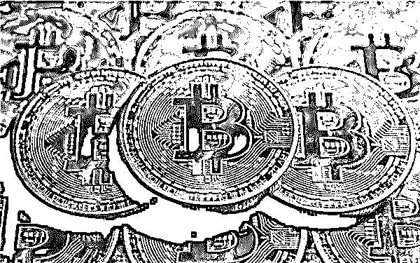

   自比特币诞生以来，特别是近几年，市场上出现了大量的虚拟货币，它们将“去中心化”“开放源代码”“运用区块链技术”等作为吸引消费者投资的“噱头”，利用互联网技术进行广泛传播，严重扰乱了货币市场，对消费者也造成巨大损失。

     据了解，虚拟货币的运作手法表现为以下几种：一是构造虚拟货币，涉众诈骗特征明显；而是通过编造故事、设计模式吸引投资者眼球；三是兼具多种违法犯罪特征；四是虚拟货币犯罪活动与地下钱庄紧密相连。

    各种虚拟货币平台普遍将“比特币”保证其币值不易被操纵的“区块链”“去中心化”等技术宣称为本币种的技术，有的还以国际组织、跨国金融集团命名，有的则直接将中国人民银行正在研究推进的数字货币技术与本币相混淆，用于“背书”，迷惑性极强。

     自比特币诞生以来，特别是近几年，市场上出现了大量的虚拟货币，它们将“去中心化”“开放源代码”“运用区块链技术”等作为吸引消费者投资的“噱头”，利用互联网技术进行广泛传播，严重扰乱了货币市场，对消费者也造成巨大损失。

虚拟货币的运作手法

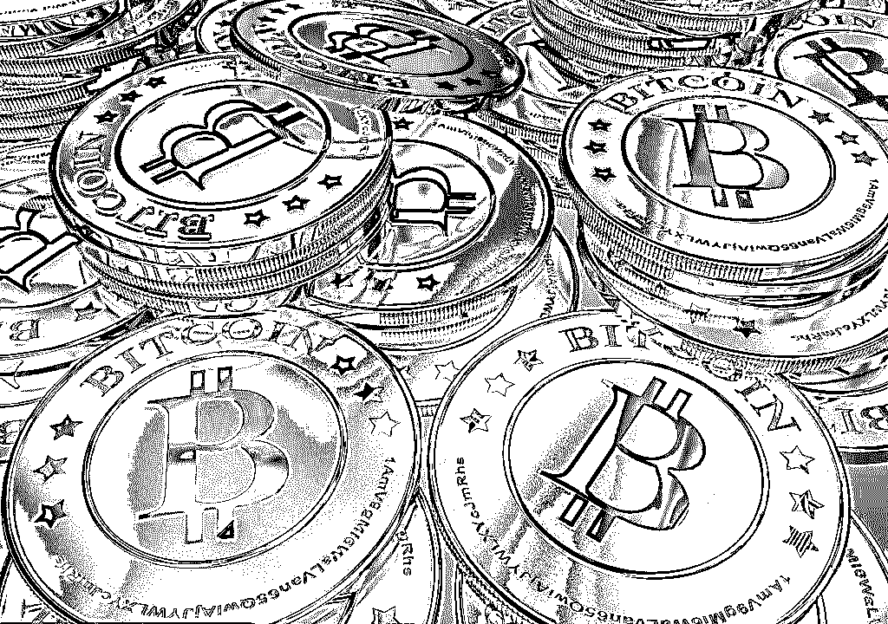

**一是构造虚拟货币，涉众诈骗特征明显。**

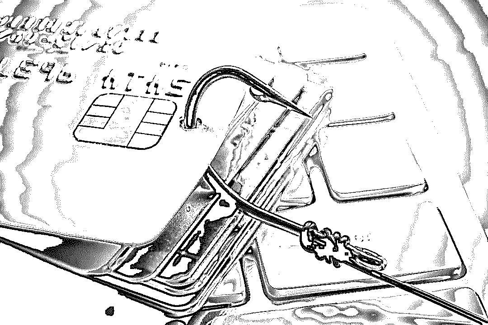

各种虚拟货币平台普遍将“比特币”保证其币值不易被操纵的“区块链”“去中心化”等技术宣称为本币种的技术，有的还以国际组织、跨国金融集团命名，有的则直接将中国人民银行正在研究推进的数字货币技术与本币相混淆，用于“背书”，迷惑性极强。

实际全部不具备其宣称的技术和任何货币功能，所谓的“币值”均由平台自行随意操控，平台吸引投资者加入后，通过操纵“币值”不断向投资者“吸血”，往往波及人数众多，涉案金额巨大。

**二是通过编造故事、设计模式吸引投资者眼球。**

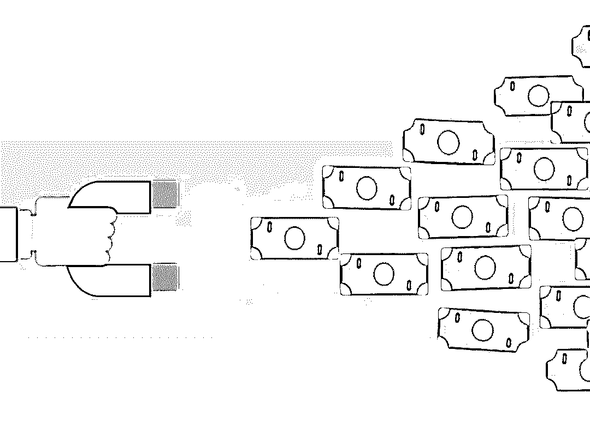

仅 2015 年以来，虚拟货币市场就至少经历了“互助盘”“挖矿机”“拆分盘”等运作模式。

“互助盘”的核心手法是以平台自创的虚拟货币为投资载体，投资买入虚拟货币称为“提供帮助”，卖出虚拟货币称为“得到帮助”。投资者（买方）在确定投资额度的基础上，由系统匹配卖出虚拟货币的投资者（卖方）。

系统匹配时间为 1 至 14 天，在等待匹配期间，卖方可享受每天 1%的投资收益，收益以账户里增加的虚拟货币体现。匹配成功后，买方需要在 72 小时内转款给卖方，并上传付款凭证，卖方也需要在 72 小时内确定收款。

至此，卖方完成投资获利退出，买方身份发生转换成为卖方，并等待系统再次匹配下一位买入虚拟货币的投资人，以此循环。

“挖矿机”的操作手法为投资者通过网站指定的交易平台购买虚拟货币，再用虚拟货币租赁矿机，由宣称位于国外的矿机托管机构代为“挖矿”。

“矿机”分不同等级，租期一年，在租期内按照投资级别不同，投资者账户体现为每天增加不同数量的虚拟货币，其承诺的年化虚拟货币回报高达几倍。

“拆分盘”的主要运作模式为人为构造一套以美元进行计价、价格在一定区间循环往复、数量可以翻倍的运营体系，如虚拟货币价格从 0.2 美元开始，每销售 100 万个虚拟币，涨 0.01 美元，币值涨到 0.4 美元后进行拆分，即投资者手中的虚拟货币数量翻倍,然后价格恢复至 0.2 美元，进入下一轮交易和拆分。

事实上，这些故事和模式都是不法分子吸引投资者精心编制的“卖点”，在旧的谎言无法编圆、旧的模式无以为继的时候，就卷款逃跑，再编造一套新的模式、一个新的虚拟货币继续行骗。

**三是兼具多种违法犯罪特征。**

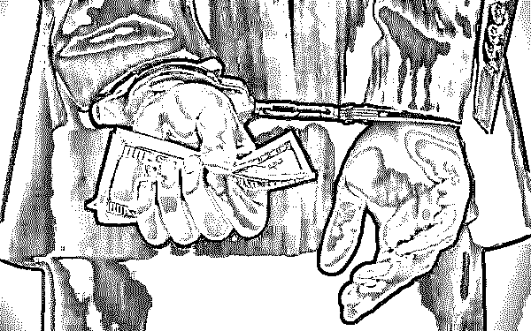

虚拟货币作为一种新兴事物常被用于从事违法犯罪活动，其通常集中控制少数个人或公司账户吸纳、转移资金，又通过互联网媒介建立传销网络扩大集资规模，手法通常同时具备非法吸收公众存款罪，集资诈骗罪，组织、领导传销活动罪，场外非法交易平台等违法违规乃至犯罪活动的特征，但又与每一类违法犯罪活动不尽相同，造成在具体刑事案件侦破过程中难以定罪。

如绝大部分虚拟货币宣传拥有动态收益，即发展下线获得相应比例的分成。而投资者首次投资也必须通过“领导人”上线进行操作。在数据分析中资金流向也呈现典型的“金字塔”结构。这符合组织、领导传销活动罪中“按照一定顺序组成层级，直接或者间接以发展人员的数量作为计酬或者返利依据，引诱、胁迫参加者继续发展他人参加，骗取财物”的描述。

但是，由于虚拟货币是一种虚拟的事物，在实际定罪中，又与“以推销商品或提供服务等经营活动为名，要求参加者以缴纳费用或者购买商品、服务等方式获得加入资格”这一犯罪构成要件不太相符。

**四是虚拟货币犯罪活动与地下钱庄紧密相连。**

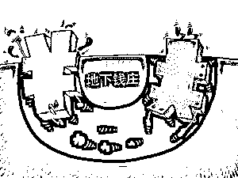

现实生活中，虚拟货币的交易平台服务器往往放置在境外，即境内行骗、境外数钱，为提前跑路做好准备。在利用虚拟货币向社会公众募集大量资金后，幕后实际控制人利用地下钱庄等非法手段将资金转移出境，手法隐蔽，十分不利于监管。即便投资人发现上当受骗后，由于资金已出境，交易数据不能获取，

根本无法追索，最终只能是“人财两空”的结局。

例如，某虚拟货币交易平台在吸纳十余亿元资金后将绝大部分资金转入地下钱庄组织，地下钱庄通过“对敲”（即在境内、境外建立两个资金池，在境内收款后通过境外资金池付款）等方式将募集资金转移至境外。多种犯罪活动交织，形成犯罪上下游利益链，既不利于监管又为后续案件侦破增添了难度。

虚拟货币之矿机江湖

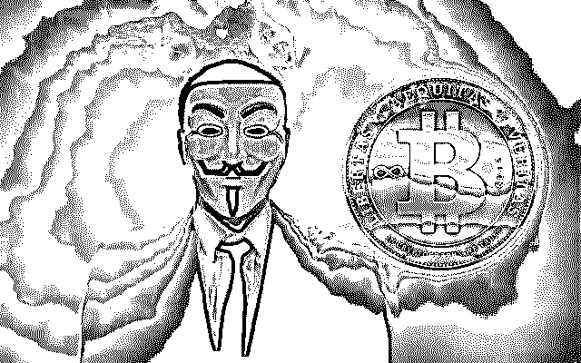

说起虚拟货币，矿机不得不提，因为大部分国际认可的虚拟货币都是通过矿机挖矿产生的，以比特币为例，挖比特币所需要的矿机其中就暗藏很多不为人知的黑幕，请看灰产圈调查：

什么是比特币矿机？简单来说就是一个像电脑主机一样的箱子，插上网线和电源，配置好账户信息就可以自动“挖矿”——产生比特币了。由于比特币的火热，相关的挖矿产业也红火起来。其中，矿机的制造销售是其中的主要产业。

目前国内主流的矿机价格在几千元至几万元不等，一种矿机通常只能用来挖一种数字货币，而且每隔一段时间会因为算力消耗等问题需要更换矿机。

不同于其他机器，一台矿机的主要技术难点在于芯片，而现有的矿机制造/销售商都是小型团队，根本没有能力自主研发算力足够的芯片，于是国内的矿机制造基本都被一两个有能力的公司垄断。

矿机价格由其产生的收益来决定，而这收益又受到虚拟货币的价格行情和挖矿难度的双重影响。例如某种虚拟货币最近行情稳定，那么相应的矿机价格可能就会降低；而这种虚拟货币价值如果上涨，矿机的价格也会随之涨价。

  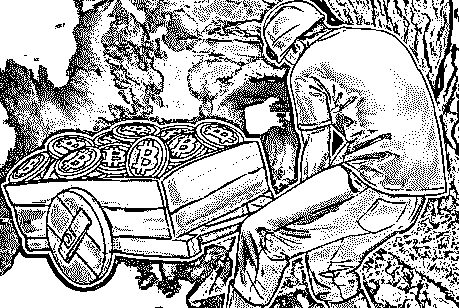

这样的一个新兴产业，虽然很火热，但是却有很多漏洞。目前购买矿机的渠道很多都不算是正规渠道。

如果买到了老旧、二手甚至损坏的矿机，作为一种灰色产业，制造/销售商是不会对其提供售后服务的，而且质量完全没有保障。一位有制造矿机经验的人士透露，很多矿机会进行回收翻新处理，质量非常不可靠，少则一星期，多则一个月就会坏掉；短时间内出现重启或者死机问题可以通过断电重开来解决，而矿工们赚钱心切，都会忽略这些问题。

另外，由于比特币矿机的定价是商家利用矿工盲目心态而定的，让你感觉能够在一两个月内回本，但实际上由于挖矿难度上涨和比特币价格波动的原因，其实是很难回本的。而且就算在三个月左右回本了，此时的矿机由于难度太高已经挖不出什么东西来了，相当于此前的几个月你都是在帮矿机商人打工。

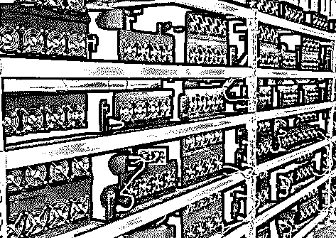

不仅如此，“矿场”也有很大的成本支出。经营一家比特币“矿场”，每个月最大开支是电费，占到经营成本的六七成左右。与之相比，人工成本、宽带费、场地费开支等相对较少。大型矿场 1 个小时可能就会用掉几千度电，24 小时用掉就会用掉十几万度电。但若按照每度电 0.4 元的行业均价计算，该“矿场”一年电费就要百万元。

而最初搭建机房时，还要给机房布置散热系统，光是前期投入都要几十万至百万元不等。矿机和虚拟货币的价格却不能保证，有的矿场挖矿所得可能完全不能抵消投入。只能通过出租矿机来抵消损失。

**虚拟货币之矿机黑幕**

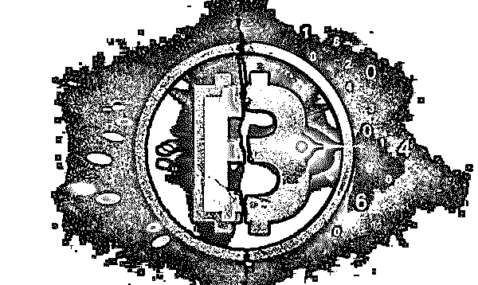

上文说道，全球矿机市场被一两个有能力的公司垄断，这其中就包括比特大陆公司。全球每 10 台比特币矿机，就有 8 台出自这家公司。

全球每挖出 10 个比特币，就有一半以上来自它的矿场。

比特大陆，伴随着比特币价格的飞速上涨的同时也完成了壮举，从籍籍无名到全球知名的芯片公司，它只花了三年时间。

同样在这三年时间，“矿霸”这个词汇频繁出现，挟持算力、分叉比特币、粉尘攻击等声音不绝于耳。

而其最明显的“收割韭菜”的内幕就正显现在其矿机销售的策略里。

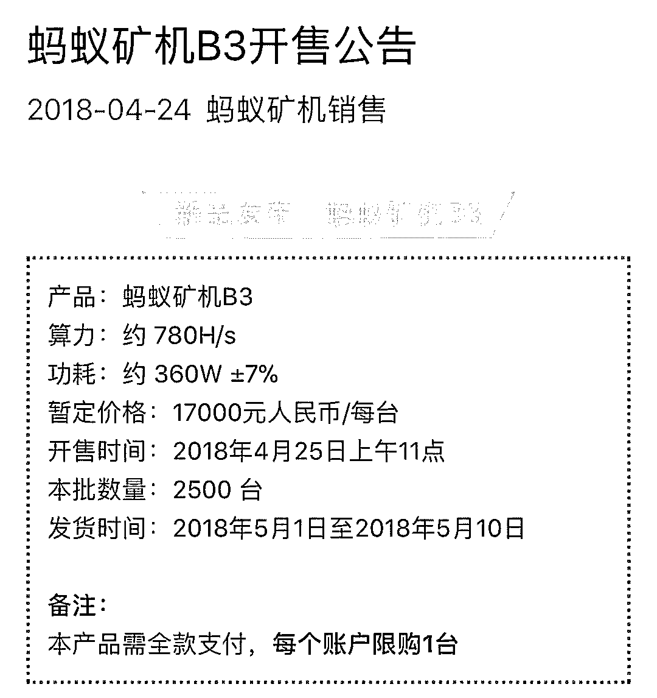

2018 年 4 月 24 日，比特大陆宣告比原链的 ASIC 矿机开发成功，将于 2018 年月 4 月 25 日发售，定价 17000 元，国内外各卖 2500 台，共 5000 台，每人限购 1 台。

通过计算前期矿机收益每天将超过 300 元，这让所有的矿工甚至从未挖过矿的投资者都加入了抢 B3 矿机的大潮中，国内的 2500 台矿机让人抢破了头，几秒之内就被抢购一空，但最终显示绝大部分矿机都流入了黄牛手里，并溢价 1500-3000 元左右出手了。

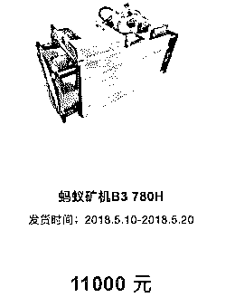

一星期后的 2018 年 5 月 2 日，比特大陆再次开放 B3 矿机的发售，发货时间与上一批机器非常接近，然而这次的定价仅为 11000 元，意味着买了第一批矿机的用户还没收到矿机就被比特大陆收割了 6000 元，如果是从黄牛手上买的那很可能就是亏 1 万腰斩了。

这样的做法总得要给大家一个解释才是，但比特大陆的解释就是将会赠送一张 4000 元的优惠券…

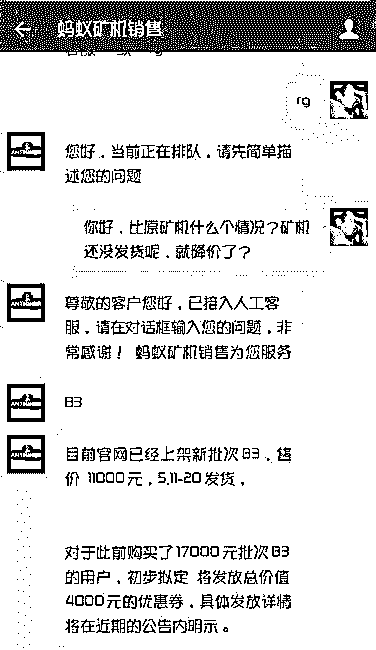

不由让人想起了蚂蚁矿机 L3+的惨案

> **第一次售价为 17500**
> 
> **第一次降价为 15000**
> 
> **第二次降价为 11200**
> 
> **第二次降价为 10000**
> 
> **第三次降价为 9200**
> 
> **第四次降价为 6200**
> 
> **第五次降价为 6000**
> 
> **第六次降价为 3200**

矿机这一路下跌的过程中，比特大陆再一路发优惠券给高价购买矿机的用户，卖完一批矿机就降价然后发优惠券补偿一部分差价，逼着用户继续买矿机，如果不用优惠券再去购卖矿机拉低下成本就会净亏这么多钱，而一旦用了优惠券购买矿机要面对矿机的下一次降价，再给你发优惠券，让用户一路买，一路亏，并且一路送优惠券。

这次许多购买 B3 矿机的投资者都是比原链的持有者，许多是以前完全没有挖过矿的，完全是出于对比特大陆的信任，单纯的认为比特大陆再怎么样也不至于让第一批抢购矿机的用户就血本无归吧。

但现实就是那么残忍，一星期前你可能 20000 买了一台 B3 矿机，一星期之后的今天 11000 的矿机官网随时可以买到，这一切就发生在一星期之内，连矿机都没收到就被割了韭菜，而始作俑者就是花了 3 年时间从籍籍无名到全球知名的芯片公司比特大陆。

**高价抢购—降价—发优惠券—低价卖—再降价—再发优惠券….无限循环**

这样的销售策略伤害了多少用户无法统计，尽管目前比特大陆任然掌握着比特币世界的绝大部分算力，生产着这个世界上最多的矿机，但这家公司还能走多远…

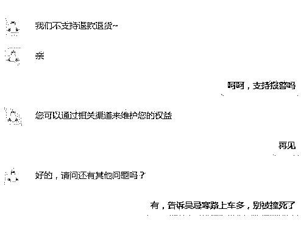

结尾

虚拟货币本身已经是风波诡谲，其衍生行业矿机产业也黑幕重重。

虽然任何投资都有其风险，但是风险也要保证在自己能够承受范围之内。

对于想要投资矿机产业和进军币圈的人来说，预估好自己能承受的风险是重中之重。

**最后借用世界杯的名言来警醒那些在币圈被割过的“韭菜们”**

**买球反着买，别墅靠大海，
买球买冷门，豪车开进门。
买球买强队，天台去排队，
买球买豪强，土豪去流浪。
冷门下重注，超越拆迁户。**

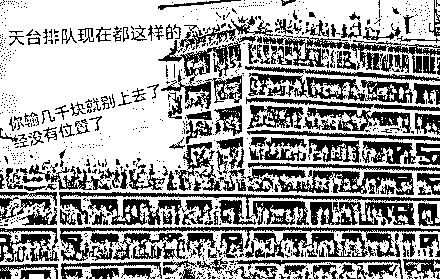

* * *

**【灰产圈】高端社群小程序开通，2018 最值得加入的社群！**

<mp-miniprogram class="miniprogram_element" data-miniprogram-appid="wx4f706964b979122a" data-miniprogram-path="pages/topics/topics?group_id=881854415822" data-miniprogram-nickname="知识星球" data-miniprogram-avatar="http://mmbiz.qpic.cn/mmbiz_png/kialtkOXGKS7D9hZrmO2jzDqryXXTAlhxSpnrKnHGV65KXzicibOppaPic4dCRxftvabB8Iqswo3OuQEDSxE7NicXBg/0?wx_fmt=png" data-miniprogram-title="【灰产圈】高端社群" data-miniprogram-imageurl="http://mmbiz.qpic.cn/mmbiz_jpg/WWG78hysZ0brJkWoyG2VDIacqgQjkDfp6mLiaoPBJ2SgWZHtRuTw7ia8kpoxntsn7PiaFOQO2U23FW6Iry0gS1GnA/0?wx_fmt=jpeg"></mp-miniprogram>

**点击加入【灰产圈】高端社群**