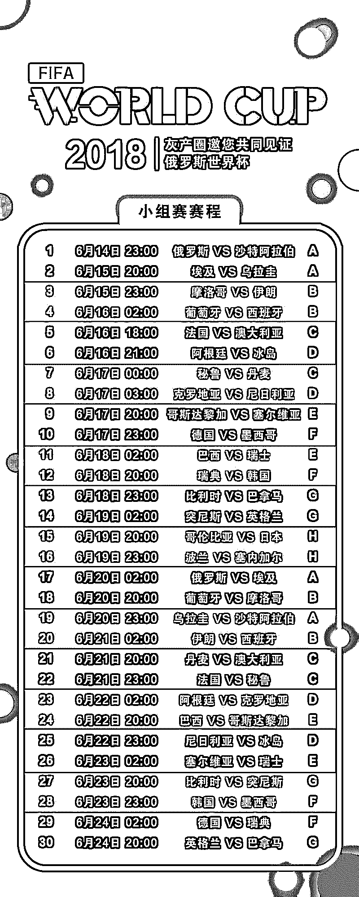

# 2018 世界杯来袭，但你更要小心网络诈骗！

> 原文：[`mp.weixin.qq.com/s?__biz=MzIyMDYwMTk0Mw==&mid=2247492017&idx=1&sn=93151374678f71e79261bd7773015c20&chksm=97cb2a89a0bca39f0e57418942e20f685029f85be042d9615943ba5b6625cb12dd27128da5f5&scene=27#wechat_redirect`](http://mp.weixin.qq.com/s?__biz=MzIyMDYwMTk0Mw==&mid=2247492017&idx=1&sn=93151374678f71e79261bd7773015c20&chksm=97cb2a89a0bca39f0e57418942e20f685029f85be042d9615943ba5b6625cb12dd27128da5f5&scene=27#wechat_redirect)

**点击上方蓝色字体“灰产圈”关注并置顶本公众号**

让全世界球迷们翘首以盼的 2018 年

俄罗斯世界杯即将拉开序幕！

（2018 年 6 月 14 日至 7 月 15 日）

开球、传球、接球、越位、突破、射门，进了。

每一个动作

都令观众肾上腺素飙升！

然而，在全球足球爱好者都即将沉侵在足球带来的乐趣中时，一大批不法份子也早就蠢蠢欲动准备利用世界杯的名头大捞一笔。

每次世界杯前夕，也是不法分子集中行动的时期， 网络上就会冒出大量以世界杯为噱头的非法博彩网站。

根据金山毒霸 AI 云盾系统对此类博彩网站的监控数据显示，从今年 5 月份开始，博彩网站的检出数量开始大幅增加，其中仅仅 6 月 1 日—7 日一个星期，就已经检出了 78323 个博彩网址。

此类博彩网站大都会在视觉上采用世界杯的官方内容，并基本都会自身标榜是世界杯指定投注官网，以此来打消玩家的顾虑。

那么，非法博彩网站是如何被推广，让更多球迷看到？**安全研究员通过对金山毒霸 AI 云盾系统拦截的网站进行抽样分析，发现其主要推广途径有以下几点：**

**1、直接在网赚论坛买广告位**

在各种兼职论坛或兼职平台购买广告位，在广告位上投放轻松赚钱，日赚多少的诱惑性广告，用户点击后就会跳转到博彩网站。

**2、直接搜索引擎做关键字竞价**

用户输入“2018 世界杯”，“世界杯门票”，“世界杯时间”，“世界杯购票”，“世界杯下注”等关键字也会返回大量与博彩网站相关的内容。

金山毒霸 AI 云盾系统监测到，最近大量普通企业网站被黑后偷偷挂了推广关键字或者博彩网站黑链，这也是不法份子一贯的作风。

**3、直接在成人网站投放广告**

不少打着色情内容幌子的成人网站实质上是在为其他网站引导访问，许多非法赌博广告都是通过这种途径来试图吸引网友注意，进而点击访问，成人站点成为赌博广告的聚集地。

**4、通过 qq 群推广**

利用 qq 号晒假图来吸引眼球，不法份子用一个美女 qq 号加大量的人，然后每天发如何通过博彩网站赚了好多好多钱的 ps 照片来诱导部分人相信。

**5、招募代理**

基本所有的博彩平台有代理功能，通过佣金的方式发展层层代理，然后由代理去拉人头参与非法赌博。

大多博彩网站会借用澳门知名赌场的名声为诱饵，冒充“威尼斯人”、“金沙赌城”或境外合法博彩平台“”等活跃于世界杯这样重大的赛事期间。

通过一些宣传活动，如“注册即送 618 元”、“存款 1000 元送 1000 元”等噱头吸引用户访问。

**那么，真的可以赚到钱吗？答案当时是否定的。**

****充值方式存在蹊跷****

在用户注册充值时会发现很多种支付方式，但实际收款方多为个人账户，且要求充值和增送的金额只有完全投注并赢了的情况下才可以提现。

（钓鱼网站存款说明页面，支付方式应有尽有）

（存款充值页面，多为个人账户）

然而当赌赢的球迷试图提现时，则会提示提现故障（如下图），不法份子就会寻找其他理由诱导球迷再次上钩从而实施诈骗。

值得一提的是：博彩类网站大多架设在国外的服务器上，而运营维护和推广人员也大多藏匿在海外，所有追查难度较大，受害者很难通过法律途径进行维权，所以一旦上当受骗很难挽回。 

* * *

**在世界杯期间，除了大肆推广博彩网站以谋取暴利外，不法份子还想到了不少其它利用世界杯进行欺诈的手段：****利用世界杯热点进行相关虚假产品销售。**

金山毒霸 AI 云盾系统监测发现，除博彩网站的数量大幅增加外，各种打着世界杯旗号销售虚假纪念收藏品的网站也开始增多， 其中又以销售各种虚假纪念币纪念钞最多。

在搜索引擎中输入“2018 世界杯纪念币”会发现很多不同域名的小网站在推广销售同类型纪念币，如下图：

而这些看似五花八门的网站，打开后却有着基本一致的画风和内容。多数网站被点击访问后基本都是如下这种模板：

实际上，每遇国际重大事件，这类售卖各种纪念币，纪念钞或纪念邮币的网站都会开始大量冒出。

这些网站往往都是通过吹捧权威机构授权，限量版发行，收藏升值空间巨大等噱头，来诱导不明真相的用户花钱购买 （如下图就是基本的宣传手段）。

通过分析，我们不难发现其中猫腻：

我国发行的纪念币或纪念钞只能由中国人民银行指定国家造币厂设计制造，并由中国人民银行指定各商业银行统一发行。

凡在新的纪念币发行前，都会在中国人民银行官网：http://www.pbc.gov.cn/ 提前发布公告并明确规定各省，自治区，直辖市的发行数量和各地区代为发行的商业银行（明确规定只有指定银行才有权代为发行）以及预约和兑换时间。

而我们从中国人民银行官网查询到的结果中无任何与世界杯有关的纪念币发行通告。

另外，既然是所谓的限量发售且升值空间巨大，光是由银行代销就会分分钟秒杀，根本不可能经由这些不知名的商家销售。

最后，由于 2018 世界杯主办国为俄罗斯，所以只有俄罗斯央行才有资格发行此届世界杯纪念币。据俄罗斯官方信息，25 卢布普通制式的非贵金属硬币将发行 1975 万枚，特殊设计的硬币将发行 25 万枚。

此次发行的硬币是俄罗斯合法货币，可以按面值完成所有类型的支付，不受任何限制。所以，国内任何宣称由权威机构监制发行的任何所谓 2018 世界杯纪念币都是骗人的，根本没有收藏价值，需要广大网友谨慎对待。

* * *

随着赛事日益临近，诈骗分子的行动也愈发频繁，各种诈骗活动即将轮番上场。只有提高安全意识，更谨慎的对待互联网内容和行为才能实现更好的防骗。 为避免被骗，提醒广大用户：

1.普通门票请到 FIFA 官方网站（http://www.fifa.com）购买；

2.不要在陌生发件人的电子邮件中随意打开链接或附件；

3.不要购买垃圾邮件中推广的任何产品；

4.不要参与任何网络博彩活动，切忌因为一时刺激或贪图投机利益而参与；

5.安装安全软件，如金山毒霸，猎豹安全大师等专业安全软件 ，可有效鉴定网站真伪，拦截钓鱼网址，防止被骗。

**文章作者：渔村安全**

**授权转载**

* * *

**灰产圈送你一份观赛指南**

****

**点击加入【灰产圈】高端社群**