# 这条灰色产业链曾让苹果公司损失 10 亿美元！

> 原文：[`mp.weixin.qq.com/s?__biz=MzIyMDYwMTk0Mw==&mid=2247491953&idx=1&sn=f94b7f91f5515a9af3d69826dc1af6a9&chksm=97cb2a49a0bca35f5848133d5018e514054aa9f4b7e05f4fa82e84fb6fb59022cfe91fbe90e1&scene=27#wechat_redirect`](http://mp.weixin.qq.com/s?__biz=MzIyMDYwMTk0Mw==&mid=2247491953&idx=1&sn=f94b7f91f5515a9af3d69826dc1af6a9&chksm=97cb2a49a0bca35f5848133d5018e514054aa9f4b7e05f4fa82e84fb6fb59022cfe91fbe90e1&scene=27#wechat_redirect)

**点击上方蓝色字体“灰产圈”关注并置顶本公众号**

**导语**

　有光的地方就有阴影，手游行业越发繁荣，但同时也伴随着越来越多的灰色技术和灰色玩法。

 在庞大的“苹果帝国”产业下滋生了众多灰色产业链，他们有条不紊 ，分工明确，暗藏在互联网的最深处运转不停

“月入过万很轻松”！苹果这项保护用户政策，竟造就了一条灰色产业链

苹果退费似乎成为了一项技术活，甚至在网上开始出现代理退费业务的公开招聘，苹果退款政策如何被不法商贩利用？

**“苹果退费”起源篇**

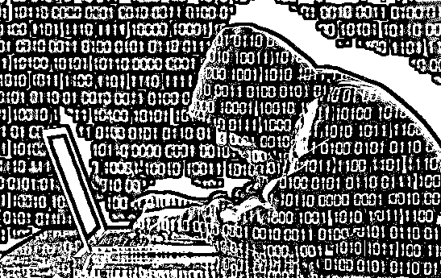

近年来，全球游戏市场规模不断扩大，中国已成为最大的游戏市场。艾瑞咨询数据显示，2017 年中国游戏市场规模超过 2033 亿，同比增长 31.6%。

然而，电竞游戏这块大蛋糕，吸引的不仅仅是投资人和创业者，许多不法分子也妄图借此实现自己的致富梦。

苹果公司于 2014 年开始实施退款政策，以弥补用户因意外充值而造成的损失。本是为了避免用户损失，如今却成为代充、代退等不法商贩的套利手段，同时也极大地增加了个人账户的使用风险。

接受 App 付费应用的用户日益增多，甚至部分游戏玩家动辄付费数千元，在此背景下，原本是苹果公司为防止消费者损失推出的“误充值退费”服务，如今却成为不法分子牟利的途径。

从知情人士处了解到，该人士因误操作手机在某 App 应用上将 68 元充值成了 648 元，后发现网上存在专门帮人充值“退费”的人，但收取高达 55%的手续费，且之前所购服务不会被应用撤回。

灰产圈调查后发现，部分网络平台上已将此项“误充”退费演变成了“恶意”退费，甚至有公司通过在线传授退费教学获利，学费高达 6888 元，形成灰色产业链。

**最早曝光这条灰色产业链的的是触乐网 2015 年发布的一篇文章：**

# **《触乐独家：揭秘愈演愈烈的苹果“做号退款”生态圈》**

**文章精华内容如下：** 

> 每天，苹果客服都会收到来自国内的成千上万笔类似的退款申请，但在这些退款申请中的大部分并不是玩家的正常退款行为，而是一条有组织、能自发循环的交易链条。 在这条环环相扣的交易链条中，有玩家、淘宝代充服务卖家、职业退款人、职业做号人，甚至一些卖苹果设备的店铺也都卷入其中，并出现了成规模的工作室和团队运作。愈演愈烈的交易链维持了一个庞大的利益共同体，他们秘而不宣地运作。一套标准的退款链条要涉及到建号、充值、出单、退款四个环节，每个环节都有专门的细分从业者运作。建号人负责“培养”苹果帐号，出单人销售道具，退款人负责向苹果申请退款。

**IOS 恶意退款灰色产业链分工**

卖家：把控流量客源 负责接单出货 难听点算是销赃者

养号者：大批量创建苹果 App Store 帐号和“养号”工作（通过模仿用户行为管理帐号 提升退款成功几率）

退款人：负责解决和苹果客服沟通 完成退款。

苹果帐号余额回收：顾名思义就是收退款后有余额的帐号 一些小商贩划不着去布局搞很大规模 就直接去收购余额号 算是收赃者吧

**这篇文章一经报道，引发大量媒体转载和关注：**

**山东法制网：**

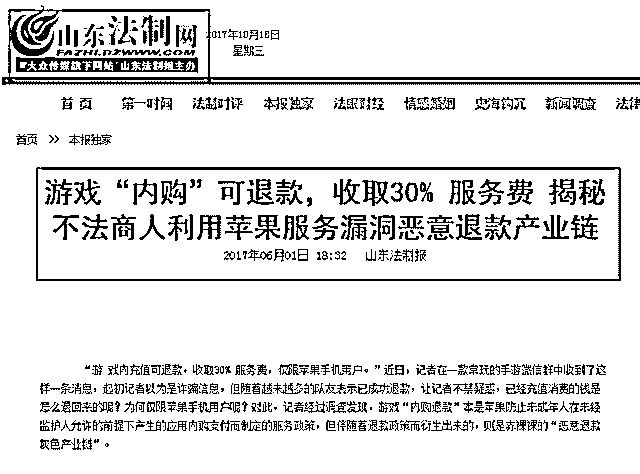

**同一时期，有一种技术在地下流传开来，那就是“苹果 36 技术” ** 

**百度百科对苹果 36 技术的解释如下：**

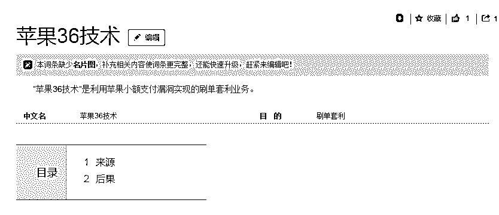

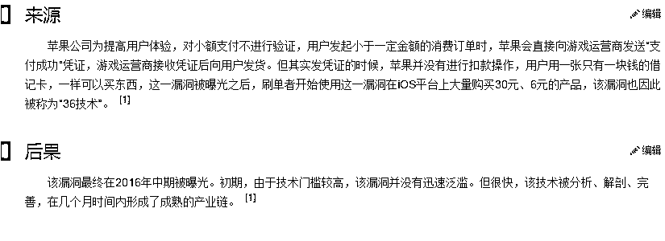

当然 这一漏洞很早之前就被苹果公司封了，

曾经这一漏洞致中国手游 10 亿美元坏账！

**附：21 世纪经济报道**

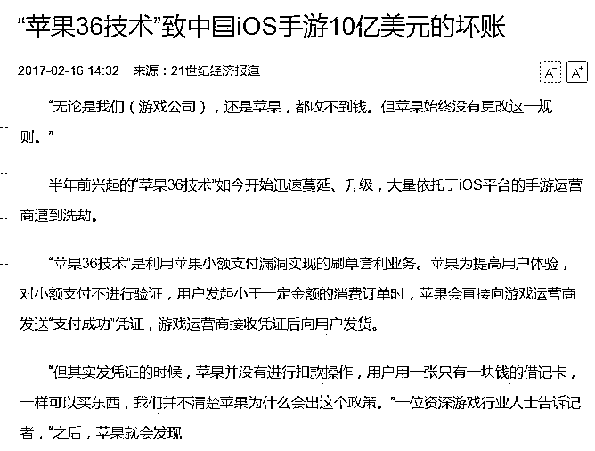

**“苹果退费”发展篇**

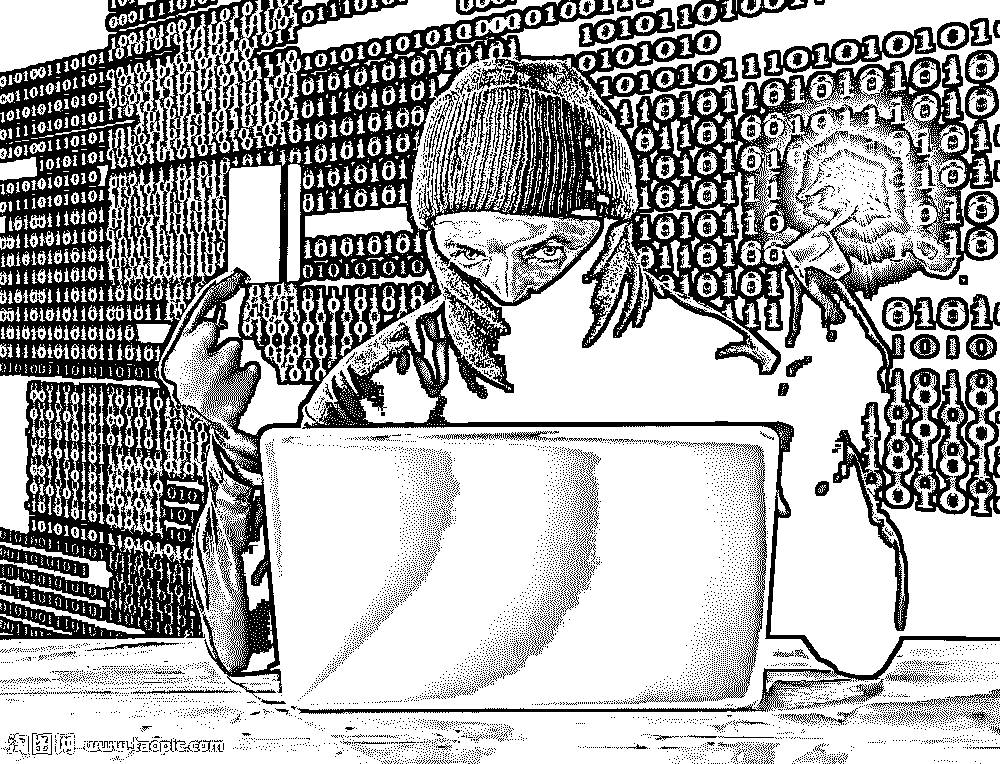

**不影响付费功能使用，“月入过万很轻松”**

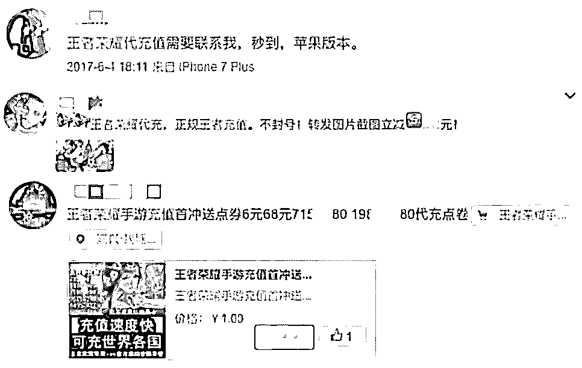

**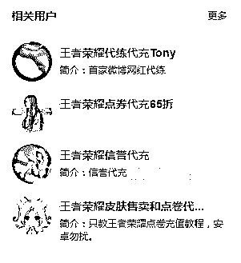**

**淘宝微博的代充、代退**

在淘宝、微博输入“苹果代充”、“苹果退费”等关键词，会弹出许多提供代充、代退服务的广告。

代充值服务人员往往以低于市场价的价位吸引用户，并用提前准备的苹果 ID 对用户的游戏账户进行充值，当充值或购买的游戏道具生效后即申请退款牟利。

代退费服务人员则是通过向用户索要 Apple ID 及密码等信息后，登录并操作退款，待用户支付的退款原路径返回后，向用户收取相应比例的手续费牟利。

**“苹果退款”现状调查**

据此，**灰产圈**添加了一位声称能办理代退款业务的网友微信，经他介绍，办理“代退费”需要提交自己的 Apple ID、密码、联系电话、历史充值金额等个人信息。

此外，通常还会要求充值记录不超过 30-60 天，申请退费的次数越少，相应的手续费越低，成功率越高。很多办理过苹果退费的网友表示，“首次退款的用户，100%成功通过”。

该人员还表示，退款后游戏还能够正常登录，之前购买的充值物品也不会被收回，道具仍能正常使用。其他从事这些业务的人员则表示，“根据苹果条例，开发商无权知道是哪个玩家用户退的款”。

不过，这些退费专职人员也表明，并不能保证每款充值都退费成功。不过据网友称，自己退费的成功率比这些“专业”退费人员的低很多，他们通常能保持 90%以上的成功率。

之前灰产圈曾尝试请代退人员办理过退费，退费成功后会收到一封苹果发来的邮件，邮件中提供了“如何使用您孩子的 iPhone 上的家长控制”的教学链接。可见，该代退人员很可能使用了“儿童误操作”的理由申请的退款。

在用户与代退人员申请退费的成功率对比之下，苹果退费似乎成为了一项技术活，甚至有代退人员在网上公开招起了代理。

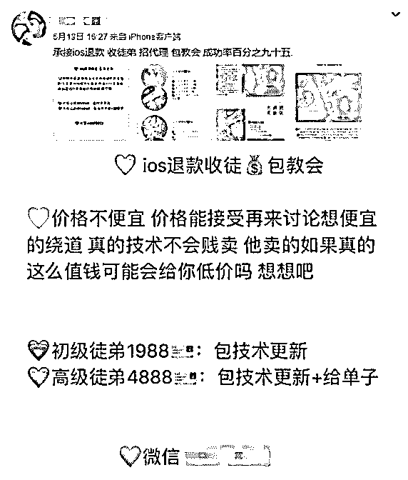

**某代退人员发布于新浪微博的招收代理广告**

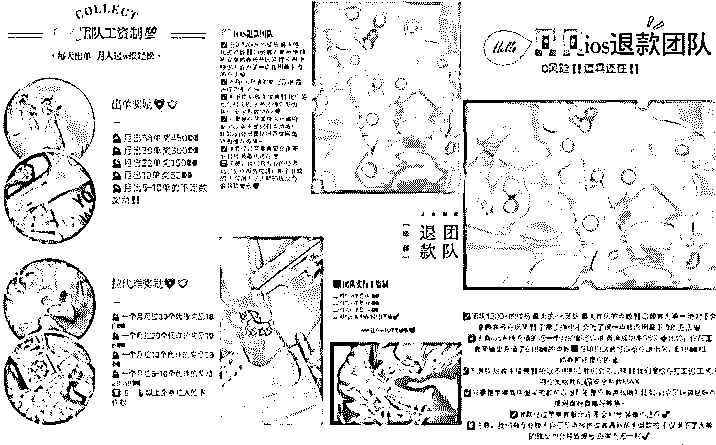

**某 iOS 退款团队的管理细则**

上图中的代退人员声称，自己教授的 iOS 退款技术成功率可达 95%，退款范围包括各类手游及 QQ 会员、黄钻、网盘等各类付费 App。

该团队招收徒弟的最高价位甚至接近五千元，团队成员已超过 1200 人。该退款团队还列出了详细的工资制度和奖励机制，拉代理、出单有每月最高 450 元的奖金，并承诺坚持出单可轻松实现月收入过万。

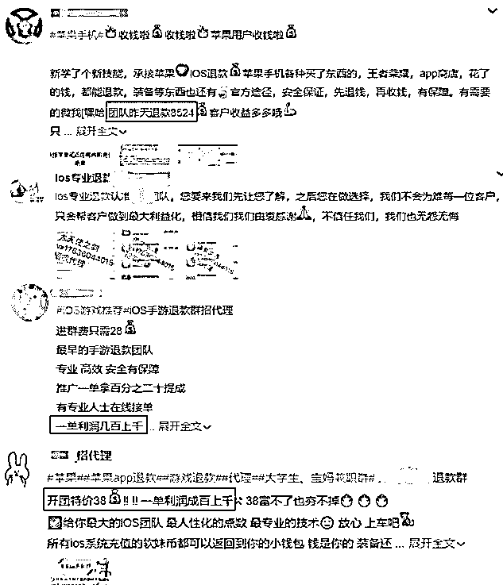

灰产圈发现，与上述退款团队相似的组织不在少数，这些团队在招收代理的同时往往贴以“一单利润成百上千”、“专业退款”、“代理兼职”、“服务用户”等标签，有的团队单日退款额便有近万元。

据相关人士透露，苹果公司对第一次申请退款的 Apple ID 一般都会通过，但多次申请就会被拒绝，所以专门做退款的代充店，每个 Apple ID 基本只能用一次。

有些苹果代充团队为了通过恶意退款套现，会明确“内部分工”，有人专门“养号”，有人专门申请退款，整个过程组织性极强，已经形成了产业链。

**“苹果退款”流派**

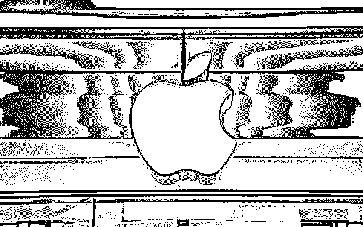

目前利用苹果退款漏洞谋取暴力的团队，经灰产圈调查，主要有以下三种流派：

**1、汇率差流派**

现实中的货币汇率天天都在变， 苹果 App Store 也有一套自己的汇率系统。举个现实发生的栗子，14 年初南飞兰特货币大幅度贬值和俄罗斯卢布暴跌都对苹果商品有所打击。一些商人们从南非、俄罗斯购买虚拟商品和礼品卡，然后低价卖给国内的玩家。标价 648 的点券 只需要 456 元，相当于打了 7 折。

**2、礼品卡流派**

比如美国等国家有一定的优惠卷礼品充值卡，你购买苹果周遍或者参加苹果活动可以拿到。国外黑市上 10 美元的礼品卡 60 元 RMB 就能拿到，甚至还有更优惠的价格。利用国外礼品优惠卷对国内的游戏进行充值 赚取差价。

**3、内购退款流派**

比如你在淘宝购买了 648 元的点券 淘宝卖家会利用他已经有余额的号替你付款或者进你号付款，在你完成交易后 卖家再去联系苹果客服进行退款，如果你的帐号第一次退款的话苹果售后客服百分之 90 是无理由退款给你，不管你在游戏中是否消费，退款后钱直接退到余额（商家会利用这个余额二次帮别人循环充值 直到退款失败）但信用卡付款的话据说是直接原路退款。

**“苹果退款”防范措施和后果**

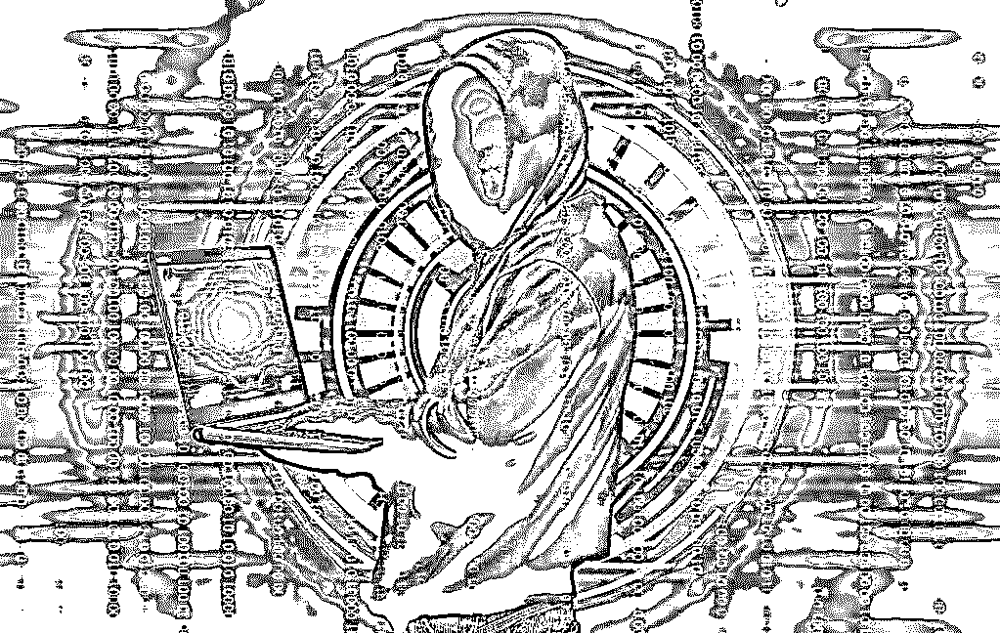

针对恶意退款现象给软件开发商带来的巨额损失，苹果公司有何防范措施？

苹果客服表示，苹果公司对于每一个申请退款的用户都一视同仁，会将他们全部视为有真正退款需求的真实客户，如果符合退款标准便会操作退款。

“在接收到用户的退款申请时，会有特定的退款审批系统进行审核，符合审核标准的申请都会通过批准。至于审核系统的标准，属于苹果公司的商业隐私，是不能透露的，”该客服称，“对于目前的恶意退款现象，目前苹果公司没有上线相应的处理程序或风控系统，至于未来将采取什么样的措施，也属于商业隐私。”

苹果尚未有明确措施，那这项灰色产业就“无人管理”了吗？非也，恶意退款这种行为实际已触犯了刑法。

**案例：**

> 2015 年 11 月，金华一名 90 后利用 App Store 恶意退款案告破，这是国内首起恶意退款案。
> 
> 警方查明，涉案人员在半年内作案数十次，非法获利近万元。浙江省金华江南公安分局网警大队民警介绍，此人有数十个 Apple ID（苹果账户），有的甚至是日文或英文的，不排除是网上购买 Apple ID 用以恶意退款诈骗，该涉案人员已被刑拘。

法网恢恢疏而不漏，利用漏洞牟取暴利的人终将收到法律严惩

有很多以此为生的工作室和淘宝店主，被刑事拘留！

**附：相关报道**

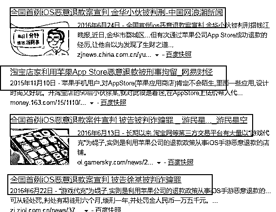

  有些用户因贪求小利，选择委托代退人员进行退款操作。殊不知，代退操作并非万无一失，用户很可能因账户行为异常被封禁，甚至被不法商贩骗取手续费、泄露个人信息。

**结尾**

      对于上文中提到的，部分网友以牟利为目的招引客人、招收代理，形成有组织、有规划的产业链的行为，很可能以诈骗罪或盗窃罪定性。

　　有些用户因贪求小利，选择委托代退人员进行退款操作。殊不知，代退操作并非万无一失，用户很可能因账户行为异常被封禁，甚至被不法商贩骗取手续费、泄露个人信息。

     日月轮回，黑白交替本是自然规律

    在互联网产业链中也是如此，每一个行业都有不为人知的阴暗面

   我们能做到的仅仅是把这些黑暗面调查展示给更多的观众，

   愿天堂没有灰产，感谢关注灰产圈，灰产圈致力于揭秘互联网黑灰产业链。

   让犯罪分子和黑灰产业链无处遁形！

* * *

**【灰产圈】高端社群小程序开通，2018 最值得加入的社群！**

<mp-miniprogram class="miniprogram_element" data-miniprogram-appid="wx4f706964b979122a" data-miniprogram-path="pages/topics/topics?group_id=881854415822" data-miniprogram-nickname="知识星球" data-miniprogram-avatar="http://mmbiz.qpic.cn/mmbiz_png/kialtkOXGKS7D9hZrmO2jzDqryXXTAlhxSpnrKnHGV65KXzicibOppaPic4dCRxftvabB8Iqswo3OuQEDSxE7NicXBg/0?wx_fmt=png" data-miniprogram-title="【灰产圈】高端社群" data-miniprogram-imageurl="http://mmbiz.qpic.cn/mmbiz_jpg/WWG78hysZ0brJkWoyG2VDIacqgQjkDfp6mLiaoPBJ2SgWZHtRuTw7ia8kpoxntsn7PiaFOQO2U23FW6Iry0gS1GnA/0?wx_fmt=jpeg"></mp-miniprogram>

**点击加入【灰产圈】高端社群**