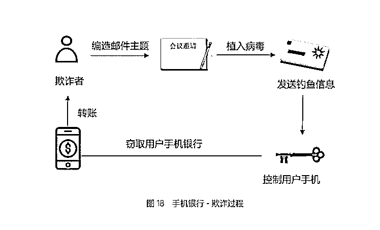
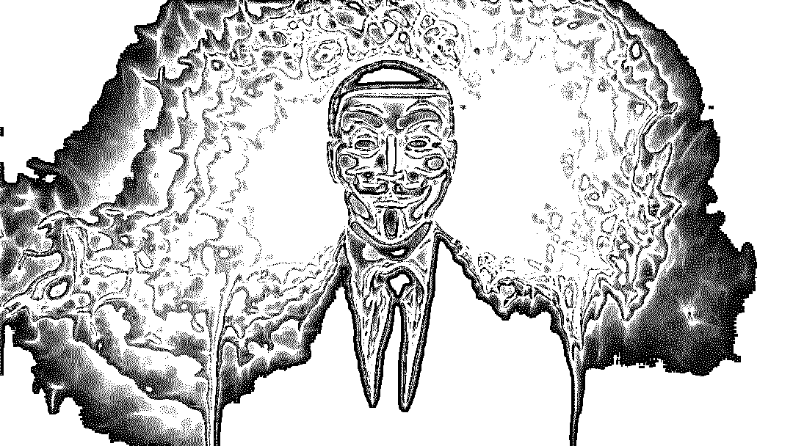

# 解密：创造千亿黑灰产业的 150 万黑产军团

> 原文：[`mp.weixin.qq.com/s?__biz=MzIyMDYwMTk0Mw==&mid=2247491907&idx=1&sn=6fb3c0e6ed381cd0975d2bfd0c49a0d3&chksm=97cb2a7ba0bca36d078821aa4ffbc36e2157f1146dd01bcf1007ae56612a7ca025e93e00554e&scene=27#wechat_redirect`](http://mp.weixin.qq.com/s?__biz=MzIyMDYwMTk0Mw==&mid=2247491907&idx=1&sn=6fb3c0e6ed381cd0975d2bfd0c49a0d3&chksm=97cb2a7ba0bca36d078821aa4ffbc36e2157f1146dd01bcf1007ae56612a7ca025e93e00554e&scene=27#wechat_redirect)

**点击上方蓝色字体“灰产圈”关注并置顶本公众号**

导语

对于小白用户说，

最好的安全是无感知的安全；

但对于反欺诈的“正义联盟”来说，

这场网络攻防战，从未停歇过片刻。

在 0、1 字节组成的比特世界里，来势汹汹的黑产和黑客军团，从未停止过进攻之手。

最大的危险是无意识的未知危险——在网络杀手看来，缺乏安全意识的网络平民们，既无秘密、也无隐私、大门敞开，手无寸铁，毫无反击之力。

但魔高一尺，道高一丈，网络警察和法官们，在大多数时候成功狙击了黑客军团的疯狂进攻，今天，我们的故事，就从一场攻防战开始。

侵犯

黑产军团如同嗅觉灵敏的鬣狗，全网快速扫描安全软肋，然后趁机“下口”。

金融产品的用户，因为离钱近，是黑客们虎视眈眈的最佳猎物——你的手机银行真的安全吗？

**案例 1**

某公司白领莫妮卡，手机银行被盗两万，她一直想不明白，最近并没操作过 APP，怎么会被盗呢？

网络小偷们，奸诈程度远超莫妮卡的想象。

莫妮卡一看演讲嘉宾是仰慕已久行业大牛，立刻扫描了二维码并填写相关信息报名参会。

三天后，莫妮卡发现自己网银账户中的两万元钱被盗。

类似莫妮卡拥有手机银行的个人客户，在中国已经高达 15.02 亿，同比增长 57.52%，骗子们正在用诈骗电话、钓鱼网站、木马病毒、短信劫持等套路，让你的钱包割肉流血。

案例 2

惊慌失措的小王，经过反复排查，发现自己的手机注册了一个电商平台，这个新账号购买了高达 49966 元商品，而上述注册、购买行为，其实并非小王的行为。

这是一场典型的网络攻防战，黑产军团们已经建立了严密的组织体系，进行流水化的批量作业。我们来看看小王的钱如何被盗取的？

**第一步，放马。**

上述黑产团伙通过伪基站发送带有木马病毒链接的伪装短信，小王出于好奇，点击链接后，用户名及密码就已泄露。而莫妮卡在注册过程中，也泄漏了关键信息。

**第二步：操盘。**

由于银行的风控手段比较成熟，因此直接盗刷银行卡难度较高、风险较大，因此，这些黑产群体掌握信息后，就通过注册电商账号，曲线变现。

**第三步：洗料。**

**第四步：变现。**

通过地下黑色产业链销赃网络，将购买来的物品变现、分赃。

黑产军团已经建立了标准化的分工体系，黑产产业链可以拆分为软件开发、硬件制作、网络黑客、钓鱼零售、域名贩子、个信批发、银行卡贩子、电话卡贩子、身份证贩子、电话诈骗、短信群发、在线推广、现金取现、电商平台购物、黄赌毒网站等 15 个具体分工。流程严密，复制性高，而且极为灵活，随机应变。

> 从行业分布来看，目前，黑产军团们已经入侵到互联网的方方面面，而数字金融领域，是主战场。
> 
> 从平台角度看，互金违约欺诈平台占比已超六成。以网贷平台为例，截至 2017 年年末，累计问题平台数量为 4039 家，占网贷平台总数的 67.7% 。
> 
> 

围猎

黑产军团偷窃、诈骗、抢劫网络平民，但他们的天敌则是“警察”和“法官”，以及安全意识崛起的“网络平民”。

在上述小王的案例中，行为序列、生物探针和关系普通等技术，发现了支付环节中多个风险因素，最终成功阻止了诈骗。

首先，行为序列技术发现了购买记录的异常。

其次，生物探针技术发现本次购买行为与往常不同。生物探针技术能够根据小王使用 APP 的按压力度、手指触面、滑屏速度等 120 多个指标，判断用户的使用习惯，因此，检测出本次购物中的异常使用情况。

最后，关系图谱技术，通过分析发现该学生对本商品的需求并不高，因此也触发了预警。而且，关系图谱技术还能顺藤摸瓜，摸查黑产军团的组织体系，帮助警方把黑产军团一网打尽。

网络借贷反欺诈：网络借贷中的欺诈行为层出不穷，据爱钱进网的统计，每 100 个拒贷案件中，大约有 16 起蓄意造假或欺骗，包括中介代办、团伙作案、机器行为、账户盗用、身份冒用和串联交易等，而人脸识别、用户画像等技术，就可以精准打架用户冒用等欺诈行为。

识别生猪保险欺诈：某保险公司勘察员小张在半年时间内，多次串通养猪户投保人虚报保单、并自导自演死猪假现场，骗得保险理赔款 15 万元。而活体（猪脸）识别、区块链技术的应用，就能解决“活体唯一识别问题”，让骗保小张和农户无所遁形。

狙击羊毛党：在互联网上，有利益的地方，就有羊毛党，漫山遍野，无处不在。某电商平台每周六推出满 80 减 20 活动，活动开始后一个月发现大量订单支付失败，其中金额恰为 80 元的订单占比较高，且这些订单绑定的支付卡余额均为 60 元。在识别羊毛党的过程中，主要使用了设备指纹识别技术和神经网络模型等机器学习技术，最终为商家挽回了 100 多万的损失。……

联手

打击黑产的难度在于，攻防符合木桶理论，“系统安全性的整体水位与最脆弱的组件水位相同”。

随着数字金融欺诈趋于专业化、产业化、隐蔽化，与之对抗的正义联盟，其力量也越发多元化，既包括来自公安群体、司法机关的体制内力量，他们专业经验丰富，也包括互联网公司和平台，后者处于一线战场，掌握最新战况，而且技术实力雄厚。

这位斗争经验丰富的刑侦专家说：“数字反欺诈是社会共治的一部分，需要政府监管部门、各种规模的企业乃至公民个人的共同参与。”而京东金融这样的公司，被秦玉海定义为“反欺诈的前沿阵地”。

结尾

上述技术，得到验证后，就可以对外开放、输出、复制、赋能。

比如，打击电商平台骗保行为的机器学习，作为人工智能的核心技术，可广泛应用于保险、反洗钱等金融领域及物流、医疗等非金融领域。

以在反洗钱中的应用为例，反洗钱监控不仅要监测账户的交易行为，还要在相对较长的时间段对个交易行为进行模式分析，应用人工智能技术能不断学习不法分子的洗钱套路并有效识别、精准打击。

积累了丰富斗争经验的京东金融技术专家和网络犯罪侦查专家们，最终达成了共识。

开放、联手、合作的机制是保障。必须构建由监管部门、行业协会、金融机构、科技企业共同参与的反欺诈联盟，建立数据、技术、人才等方面的合作交流机制，合纵联盟，集结正义之师，才能全面包抄，瓮中捉鳖，围猎黑产军团们。

对于小白用户说，最好的安全是无感知的安全，但对于“正义联盟”来说，这场围猎战，从未停歇过片刻。

福利：关注本公众号并回复： **反欺诈 **

免费获取《数字金融反欺诈白皮书（2018）》

* * *

**延伸阅读：**

[**2018 年网络黑色产业链大起底（深度调查）**](http://mp.weixin.qq.com/s?__biz=MzIyMDYwMTk0Mw==&mid=2247490584&idx=1&sn=7759b3a17ae078e290d3767dcc8b38bb&chksm=97c8d720a0bf5e36ca1e4110bb3d6a0ff1fa58eee414146e2da411cb2d18ab247e8940ee8590&scene=21#wechat_redirect)

[**灰产哥|互联网业务安全的黑灰产业链的故事**](http://mp.weixin.qq.com/s?__biz=MzIyMDYwMTk0Mw==&mid=2247486000&idx=1&sn=6f03ae5b2e8794da34f0f6911dab88ae&chksm=97c8c108a0bf481e4019c1468dcfd546a40b6bfbcd6bddb5a5b12df52b5d985467d5ad1ad213&scene=21#wechat_redirect)

[**深度调查 | 微博明星高仿号背后的灰产江湖：数据造假，诱导诈骗，套路重重，暗黑无边！**](http://mp.weixin.qq.com/s?__biz=MzIyMDYwMTk0Mw==&mid=2247489407&idx=1&sn=a0d172b4cffbdb11b1b19c8945f91d8e&chksm=97c8dc47a0bf55517054432bfd2bd994f24f780cadf074b8e00e96390403cc638bd4c0704c2f&scene=21#wechat_redirect)

[**数据黑产大调查：揭秘数据买卖的灰色产业链， 内鬼猖獗，黑产进化!**](http://mp.weixin.qq.com/s?__biz=MzIyMDYwMTk0Mw==&mid=2247488997&idx=1&sn=830b56dc871cf6f299a800e3b1863cc7&chksm=97c8dedda0bf57cbcdd3dbd5794d4269411f674a9739312120f7305252789eb2c9d640ccc00f&scene=21#wechat_redirect)

* * *

**点击加入【灰产圈】高端社群**

# 

> 原文：[`mp.weixin.qq.com/s?__biz=MzIyMDYwMTk0Mw==&mid=2247491864&idx=1&sn=bfcd1a224d4401ba54f9391a1e371d36&chksm=97cb2a20a0bca336fc3e944421548d20036864fda4a92265f879ec5b6a138495025f1f4a4452&scene=27#wechat_redirect`](http://mp.weixin.qq.com/s?__biz=MzIyMDYwMTk0Mw==&mid=2247491864&idx=1&sn=bfcd1a224d4401ba54f9391a1e371d36&chksm=97cb2a20a0bca336fc3e944421548d20036864fda4a92265f879ec5b6a138495025f1f4a4452&scene=27#wechat_redirect)