# “甜蜜定制”援交软件冲上榜首：难掩“援交”与“包养”本质，女孩标价 3 万每月！

> 原文：[`mp.weixin.qq.com/s?__biz=MzIyMDYwMTk0Mw==&mid=2247491797&idx=1&sn=a6d06b303d685d736d59653f6d11988e&chksm=97cb2beda0bca2fbc7695c66332c4407c7d756e09b5af5ff1fc46a5127cbd758ad3e1178b54c&scene=27#wechat_redirect`](http://mp.weixin.qq.com/s?__biz=MzIyMDYwMTk0Mw==&mid=2247491797&idx=1&sn=a6d06b303d685d736d59653f6d11988e&chksm=97cb2beda0bca2fbc7695c66332c4407c7d756e09b5af5ff1fc46a5127cbd758ad3e1178b54c&scene=27#wechat_redirect)

**点击上方蓝色字体“灰产圈”关注并置顶本公众号**

**导语**

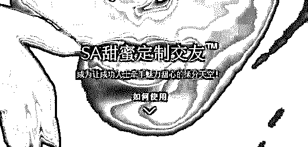

近日，一款名为“甜蜜定制”(SeekingArrangement)的社交软件登上苹果商店免费社交类应用第一，被它甩在后面的是拥有 10 亿用户的微信。

这是一款来自美国的社交软件，自称“北美及全球同类交友产品中最大、最有影响力”的一款应用。然而，多方信息表明，“甜蜜定制”实为一个打着社交旗号的援交平台。

APP 简介中，甜蜜定制的 logo 为红底白字的“SA”，即美国原名 Seeking Arrangement 的缩写，功能第一条写着“发现靠近您的成功人士或魅力甜心”，许多用户评论打上了“高端交友”的标签。但将用户留言的排序改为“最新评价”后，留言的重点字眼多为“骗子软件”“援交”等。

不仅如此，它还挤进了免费总榜第五。

外网搜索“Seeking Arrangement”可以发现，这款 APP 的真身是一家援交网站，曾被多家西方主流媒体曝光。

据英国 BBC 在今年 3 月 30 日的报道，英国威尔士地区有超 200 名学生通过该网站寻求包养，以支付学费和生活花销。报道显示，仅英国地区就有 7.5 万名学生在该平台上寻找合适对象“援交”与“包养”。

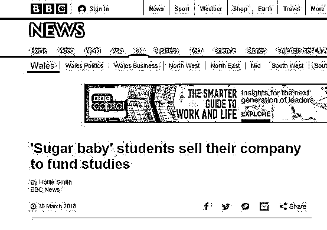

**这款程序绝对不是“物化女性”，而是非常开放、平等地物化全人类，没有歧视。**

**甜蜜定制“初体验”**

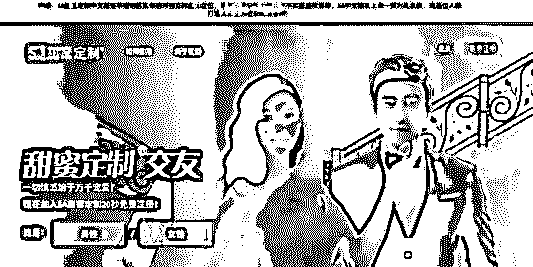

<spanmargin-bottom: normal="" justify="" rgb="" yahei="" border-box="" break-word="">在得知有这样一款应用登陆中国并在 App Store 社交类排名第一时，灰产圈在第一时间决定来一个**体验式报道。**</spanmargin-bottom:>

尽管中文版的“甜蜜定制”在一开始就跟海外版 Seeking Arrangement 划清界限，翻译过来的介绍也变得十分隐晦，但打开这个应用开始注册，你马上就会发现，其意图非常直接，毫不掩饰。

灰产圈决定以女性的角色注册该软件进行体验：

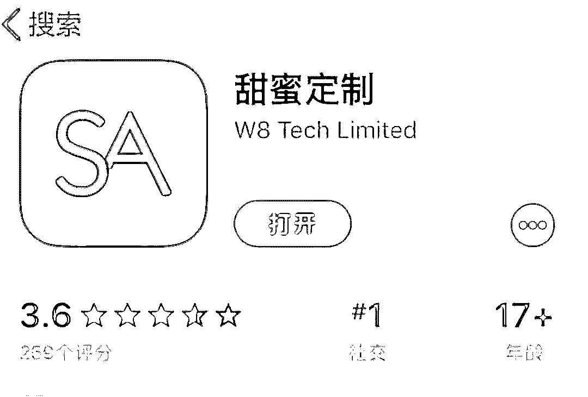

首先需要给这款程序正名的是，**绝对不是“物化女性”。**选择性别后，不论男女都可以选择称为“魅力甜心”或“成功人士”，接下来提供三种性向选择：男性、女性、两者都可。**非常开放、平等地物化全人类，没有歧视。**

不过非常遗憾的是，我所注册的女性魅力甜心，尽管选择了“两者都可”，但截至发稿仍没有一位成功女士找上门来。

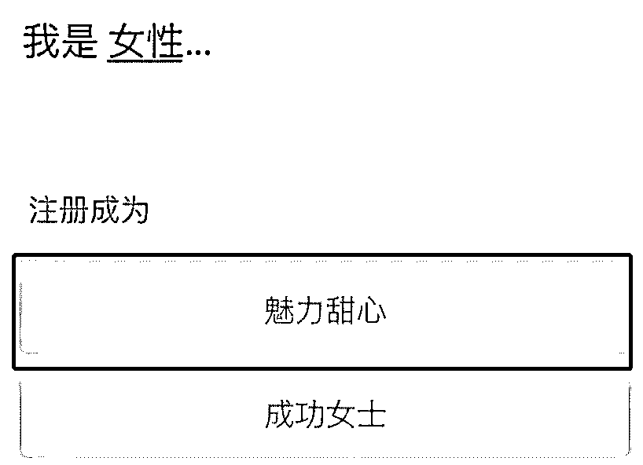

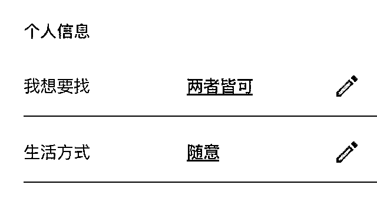

身份选择完成之后，首先需要选择自己的甜蜜定制等级，从基本到超奢，也可以选择随意。如果没理解错，**是要给自己开个价。**

好的，直接“高奢”。

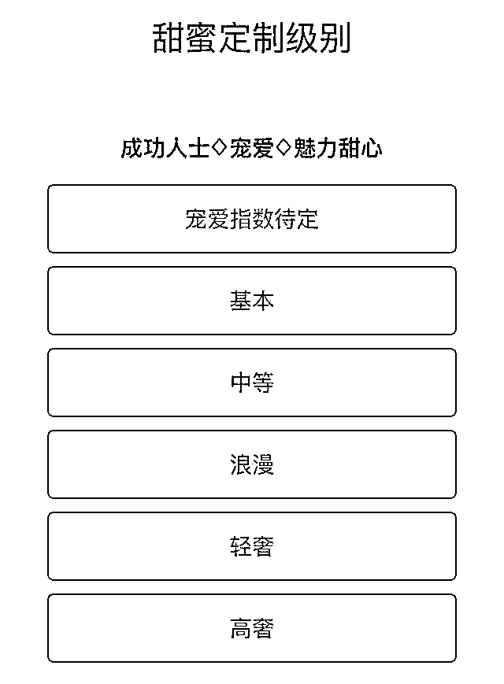

之后需要填写年龄、所在地、身高、体型、是否抽烟喝酒，写一些简单的自我介绍和交友目标。

填写邮箱并验证之后，正式进入“甜蜜定制”。

这款应用的主页面会显示其他符合你设定要求的用户，左划表示不感兴趣，右划表示关注。

**这、这不就是探探吗？**

在填写的信息通过审核之前，我的信息不会被展示出来，能进行的操作只有关注。审核的信息主要包括头像是否过于暴露、个人简介中是否有直接提出性交易的内容等等。

请注意，**在这个过程中，“甜蜜定制”完全没有要求上传证明来验证这些信息的真实性**，随便填！

更让我震惊的是，这款应用连手机号都不需要。**这个年代还有不管用户要手机号的应用软件吗？**

由于暂时无法进行更多操作，在随便关注了几个“成功人士”之后，我退出了这款程序。

早上起来，发现被来自“甜蜜定制”的信息轰炸了。我的信息通过了审核，可以被其他用户看到并关注了。

大约有三十多个设定是“成功人士”的男性联络我，有五十多人关注，此前我随便关注的那几个人，基本都回关了我。

在我收到的信息中，大多是先简单打个招呼，希望加微信进一步详聊，并留下自己的微信号。只有极少数的人会直接发来条件。

比如这位：“稳定关系，车房户口我解决，每月五万。”

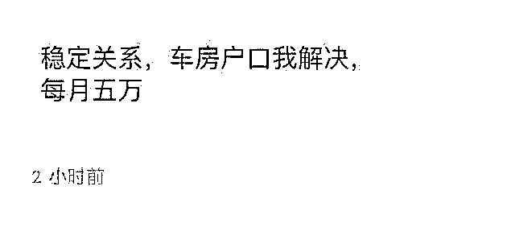

在我反问他北京户口是不是也能解决之后，他再没有回复。

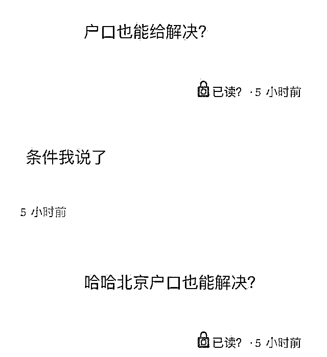

我以“使用本站进行违法性交易”的理由，向系统举报了这位用户，按照官方所说，这种行为是他们绝对禁止的，不过截至发稿，这位用户仍然没有被封禁。

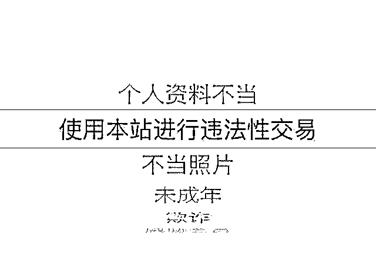

我随便找了一些找上门搭讪的人回复，在回复对方后，大部分都会直接问我有什么需求，有人问如果约一次怎么收费。

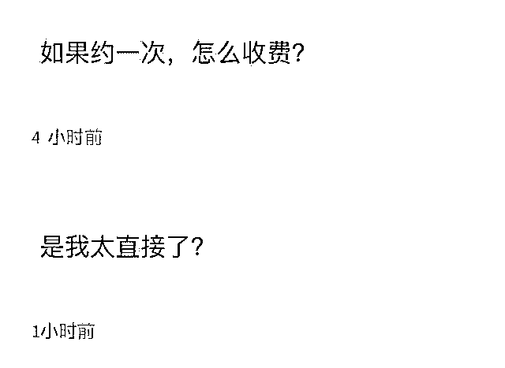

我先假装不太清楚这个应用是干什么的，有一位用户告诉我，“说白了就是援交的”，他还说这款应用是他美国的朋友介绍给他的。

也有人是看了新闻，好奇所以下载看看，我问他是来看看呢，还是真想找一个，他说：**“看看，有合适的找一下也无妨。”**

一位个人资料显示净资产 300 万，年薪 250 万的创业者联系我，直接说想“约”，并问我有什么要求，他称自己年薪 70 万。

我问他有没有什么证明，他回复：“难不成给你看纳税证明？车子房子也能假啊？”之后再发去的信息，他都没有回复。

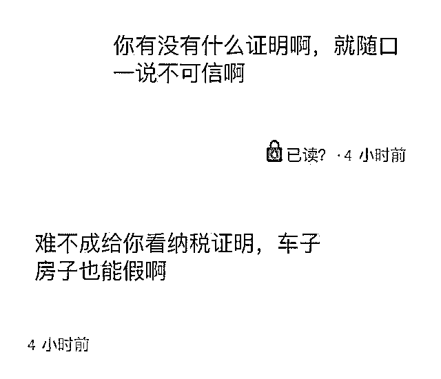

为了进一步了解用户的真实信息，我加了其中几个人的微信。

至少从他们展示的朋友圈中，很难看出是否与其在“甜蜜定制”中所写资料情况一致。

有一位写自己年薪 150 万的小企业主说，他有自己的公司，随便也比这个数多，不会如实写，也没法证明。

“甜蜜定制”说自己是要为高素质、高品位人群打造高质量的社交网络空间，对不起，恕我这个非高端人口没有见识：难道所谓的高质量社交网络空间就是“包养和被包养”，还是说我和我所遇到的这几十位用户都没有正确领会这款应用程序的使用方法？

如果要说“甜蜜定制”是一款提供援交服务的应用，我完全赞同。

这款应用缺乏最基本的审核规范，没有任何一条信息是被真正检验过真实性的。**如果不经过微信等其他社交应用互相验证身份，仅在这个平台上，真正的“魅力甜心”和“成功人士”找到适合的彼此的几率恐怕太低。**

更重要的原因是，用户体验实在太差了！

我真的从来没有用过如此之差的社交应用，平均聊几句就要卡死，无法刷新，必须关闭应用重新打开。

**甜蜜定制“追根溯源”**

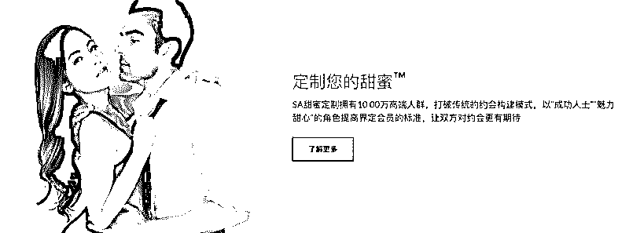

“甜蜜定制”从注册的第一步开始就在表明一个令人咋舌的价值观：情感可被交易，伴侣可被物化，财富是唯一的衡量尺度。

“甜蜜定制”为何能吸引到如此多的用户？灰产圈想要从它的创始人理念、产品逻辑以及与原版“Seeking Arrangement”的对比等角度，去深度解析这款三观不正的交友 APP。

**“定制理念”**

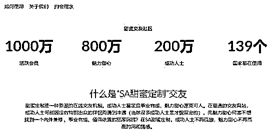

**“甜蜜定制”官网关于其会员规模和业务的介绍**

“甜蜜定制”的官网说道：“甜蜜定制专门为成功人士和魅力甜心所打造”。官网给成功人士的定义是—事业成功或经济基础雄厚的人士。成功人士在情感生活中愿意宠爱对方，并期待获得对方的好感和依恋。而魅力甜心则是“年轻有活力，内外兼修，气质出众，对未来的人生有憧憬，崇尚高端品味生活，想要牵手成功富足有内涵的对方”。

“甜蜜定制”创始人 Brandon Wade 表示：“爱情是不存在的，那只是穷人发明的一个虚无的概念。每一段成功的两性关系都讲求平衡，达到这种平衡，双方才能两厢情愿，关系才能维持。反之，打破了这种平衡，两性关系将走入危机。”

结合官网宣传的理念和创始人的言论，“甜蜜定制”想要帮用户达到的“平衡”更像是财富与身体的置换，本质上是一种“钱色交易”。

“甜蜜”如何定制？它跟其他社交平台的根本区别在哪？

在初始的注册页面内，用户必须在魅力甜心与成功人士之间选择一个角色，且成功人士并不局限于男性。如果用户选择了“魅力甜心”，会出现特别的“甜蜜定制级别”的界面，意思是选择你想要追求的生活层次。接着需要填写年龄、种族、身高、教育程度、职业，还有非常直接的体型（较瘦—健美—匀称—S 型—微胖—偏胖—其他）以及是否抽烟喝酒；

如果选择了“成功人士”，则要额外填写你的净资产和年净收入，起步金额分别为 60 万和 30 万人民币。

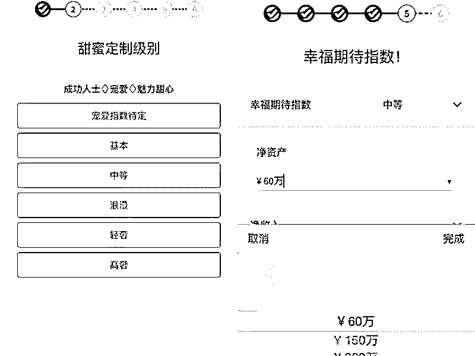

最后，需要设置你的个性签名、自我介绍和交友目标。

在个人主页上，用户除了可以上传公开照片外，还可以上传“私密照片”，其他用户如果想要查看私密照片，需要申请开通 VIP。

与其他社交软件相比，“甜蜜定制”从注册环节开始便具有强导向性，一步步引导用户给自己贴上各种标签。与“探探”类社交软件让用户选择兴趣标签不同，“甜蜜定制”的用户信息板块中，没有任何和兴趣相关的问题，连自我介绍都是“您有什么想要成功男士知道的呢？”这类极具引导性的提示语。

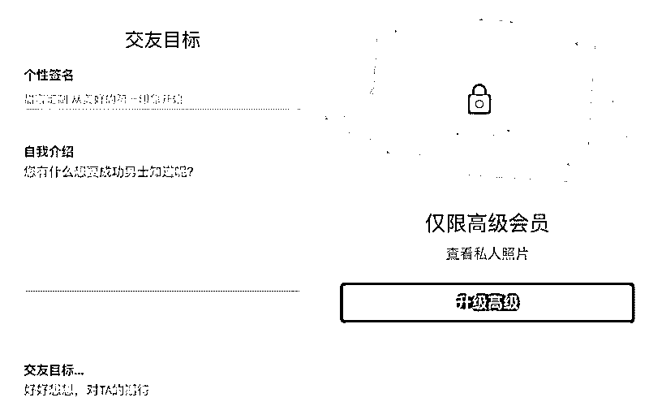

完成注册后，来到主界面，甜蜜定制与“探探”这一类社交软件的界面非常类似，可定位附近的人，向左滑表示讨厌，向右滑表示喜欢，需要对方同样喜欢你才可以匹配成功发消息。不同的是，多了搜索功能，可以快速查看多个对象。

但产品使用体验目前较差，比如定位错误、收不到验证码激活，头像一直无法显示，审核速度慢和界面加载慢等诸多问题。

值得一提的是，在审核提示页面中，有一段红色字体加下划线的提示语：“升级 VIP 即可快速通审开聊”，这可以看作是“甜蜜定制”刺激用户开通 VIP 的一种手段。

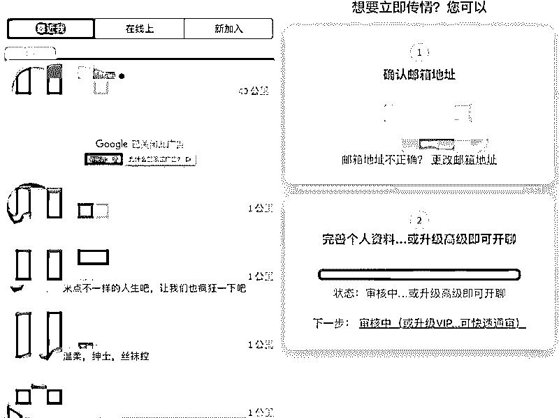

VIP 会员付费是“甜蜜定制”目前主要的变现手段。升级 VIP 后，除了查看私密照片和快速通审外，用户还可以隐藏在线状态、登录地点，无限看信发信，获得优先推荐等。价格是 163 元/7 天、499 元/月，而探探的 VIP 付费价格是 12 元/月、98 元/年。

“甜蜜定制”上用户的交友目标基本都非常直接。成功人士大部分都在寻找年轻的异性并许诺以金钱满足对方需求，而魅力甜心们大多以“目前急需解决高额的学费”、“寻找成熟有实力的 SugarDaddy or Sugar Mommy 长期交往”为目的。

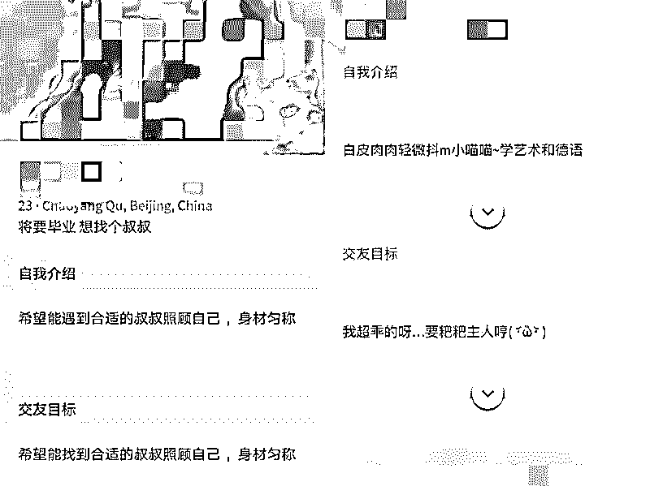

虽然其他社交 APP 也会有许多非正常交友目的的用户，但这并非产品设计者的初衷，并且社交 APP 们都采取了非常严格的监管手段。

但“甜蜜定制”整个产品逻辑，都在明目张胆地引导用户以及高速用户，这就是一个被物化的钱色交易场所，财富则是唯一被认可的入场券。

**追溯“甜蜜定制”**

“甜蜜定制”其实是美国“Seeking Arrangement”（以下简称 SA）交友网站的中国区版本，用户在 SA 上直接被称为“Sugar Daddies”和“Sugar Babies”，言语更为露骨。SA 现在已经被众多外媒打上了“援交”的标签，《纽约时报》曾炮轰它是一个肮脏的市场，有钱的老男人和可爱的年轻女性，在这里进行着坦诚又残酷的交易。

SA 创立于 2006 年，起源于创始人 Brandon Wade 发现传统的交友网站无法满足他的需求。作为 MIT 毕业的高材生，资产达 6 位数，但是因为外貌平平，女孩们很少选择他，所以他想创立一个以资产和金钱为导向的交友网站。

2014 年，Brandon Wade 接受 CNN 采访，当被问到 SA 所违背的道德问题时，他表示：“当道德与社会期望密切相关时，快乐往往被牺牲。我相信，快乐比坚持你“合法”的社会地位更重要，大多数人都被困在了道德的牢笼里。”

目前 SA 已经在全球拥有 1000 万用户，其中包括 800 万的“Sugar Babies”和 200 万的“Sugar Daddies”。据外媒数据显示，女性用户大多数都是在校学生，通过性关系的交易得到包养费用，来支付自己的学费和生活开支。而男性用户大多数都是年过 40 的中年男人，收入较高，且近半数人都有妻子儿女。

在模式上，跟中国版“甜蜜定制”略有不同的是，SA 除了提供线上交友服务外，还为会员提供线下交友聚会。这种聚会通常以鸡尾酒舞会的形式展开，一般坐落在 LA 或者纽约市中心的摩天大楼里，女生需要着礼服高跟鞋，男生则要穿西装打领带。官网宣称，这是个让你一次遇见成百上千个“甜心”的绝佳机会。

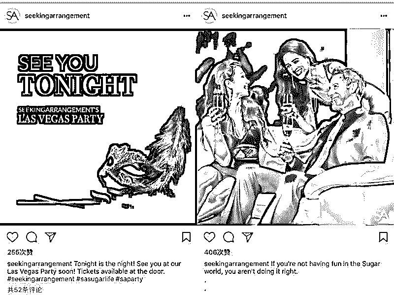

“甜蜜定制”能在中国区上线确实让人意想不到。

早在 2015 年 10 月，“Seeking Arrangement”就在上海自贸区注册了一个名为“娱发信息科技(上海)有限公司”的企业，注册资本 8.1 万美元，法定代表人是 Wey Kim Long。随后开设了中文版的官网，并于今年 3 月开通了微信公众号和 APP。APP 开发栏显示的公司名叫 W8 Tech Limited，中文名叫“网发科技有限公司”，注册地为香港，并且 100%持股“娱发信息科技(上海)有限公司”。

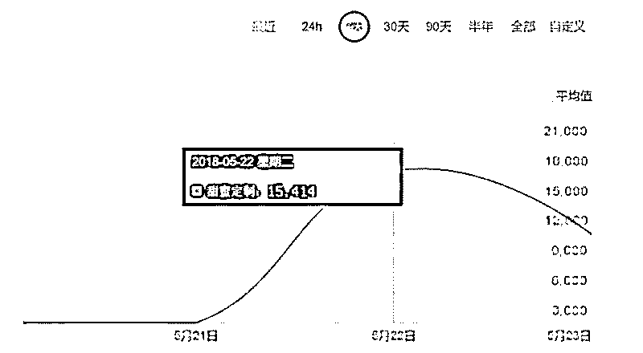

尽管如此，seeking arrangement 于 2015 年 10 月 30 日便已经在我国上海某工商部门处注册了“娱发信息科技（上海）有限公司”的企业。随后便推出了这个“甜蜜定制”的 APP！

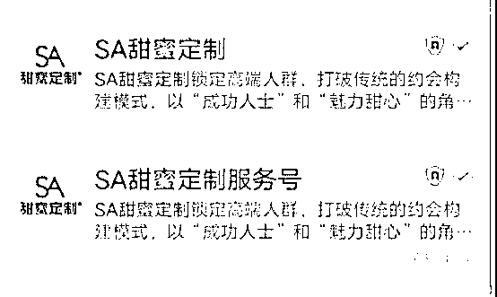

（图片来源于网络）

**甜蜜定制已“凉凉”**

值得庆贺的是，在昨天（5 月 24 日）微博已经曝光了这个网站。

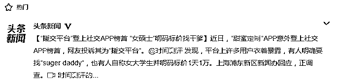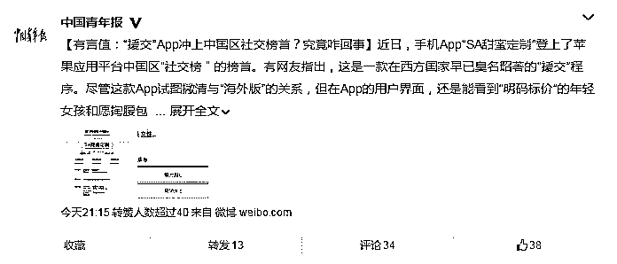

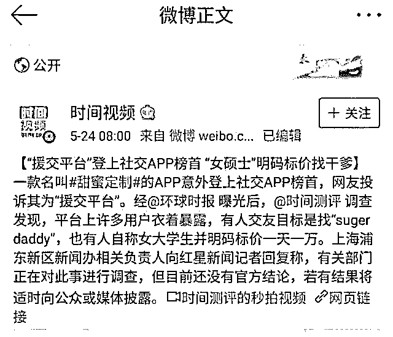

而现在，这家公司已经被列入了企业异常名单。

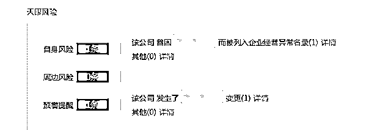

「甜蜜定制」在微信阵地已经阵亡，不得不说微信在这方面把控比较严格，审核机制明显提高。

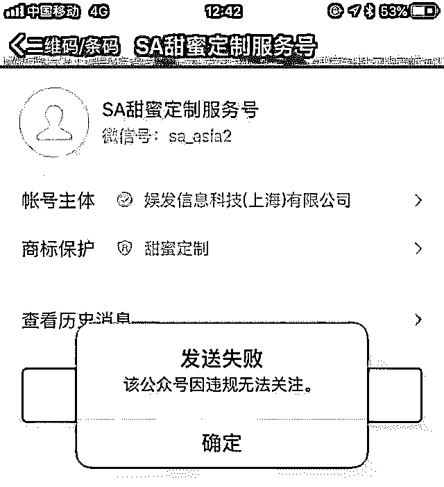

**结尾**

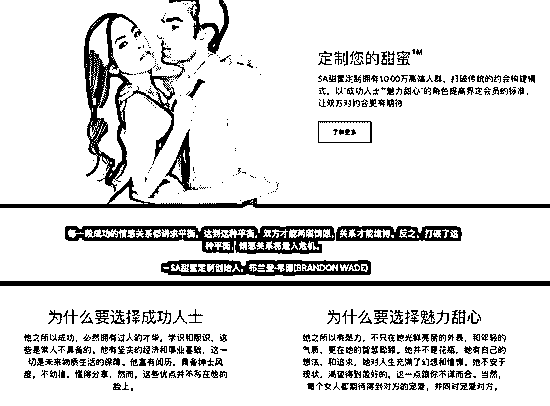

不同于传统约会网站，在 SA 上，大家并不需要写自己的兴趣爱好，金主们只要写出一个月提供的费用，而甜心们则写出自己的目标收入。两人在物质上达成一致后，就可以成交。

那么，这些“存在即是合理”、“公平互换”的畸形观念，最初是如何被市场化，一步一步变成一门生意的呢？说到这儿，就不得不提“甜心有约”网站创始人——布兰登·韦德（Brendon Wade）。

**和这些网站上的用户一样，布兰登·韦德对于爱情，有着扭曲的价值观。**

生于新加坡的韦德，现年 48 岁，父母都是传统的中国人。创办这款包养软件的他，曾经是麻省理工学院物理和电气工程的高材生，后来又取得了麻省理工斯隆商学院的 MBA 学位。

少年时期的韦德，在严苛的家教之下反复被灌输着中国家长最喜欢说的话：“别想着约会，你要努力学习，等有一天你成功了，会有很多女孩反过来追你。”

然而当这位高材生站到了“成功”的位置上，他却因为不善交际，极度害羞，在感情上屡屡受挫。

对他而言，**耗费那么多时间去经营一段感情，实在太浪费时间了，更不符合经济学的规律。**他想：不如创造一个公平交易的平台好了。

2006 年，韦德创办了“甜心有约”平台，在接受 CNN 记者专题调查里，他这样回答：“帮助那些‘穷得只剩下钱’的男士，和那些成功的想体验更美好生活的男士。实现‘美国梦’有什么不好？**只要你有钱，你就能得到年轻的女孩。**”

面对记者 Lisa 发问：“为什么这些姑娘们不能靠自己而是要去靠男人们呢？”韦德摆摆手，一幅理所当然的样子：**“被包养就是她们靠自己的方式啊。”**

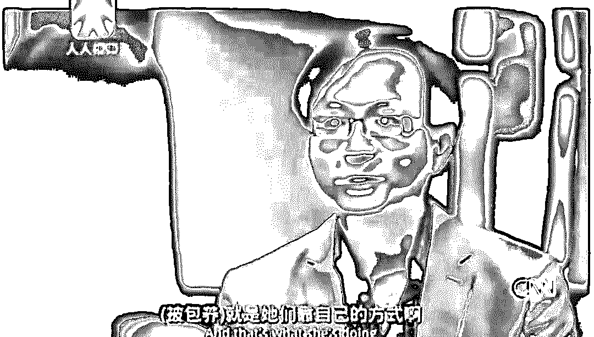

在他看来，他并不认为自己是在搞“网络卖淫”，一切都是各取所需，公平交易。当 Lisa 质疑他这是钱色交易，和援交无本质区别时，韦德竟然把自己妈妈扯来背锅：“如果按照这种逻辑，像我妈妈这样靠丈夫给钱的家庭妇女，就是长期卖淫。”

对于这个情场失意，只能在交易上得到满足的男人来说，**爱，只是穷人的发明。**

多么荒唐!!

然而更荒唐的是，从国内到国外，无数使用着韦德的这款包养软件的人都和他有着一样的理念，并且用实际的“约炮”行为，在支持着韦德的言论和理念。

不信，看这些网友的评论，简直是不以为耻，反以为荣！

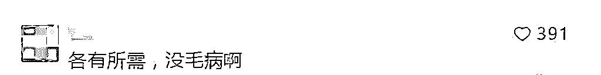

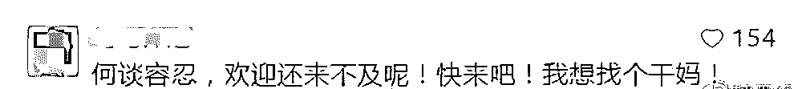

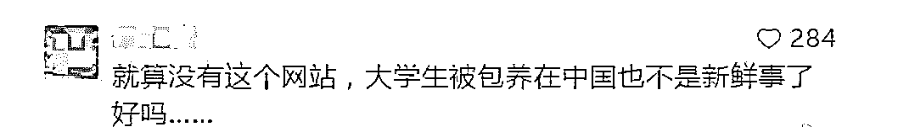

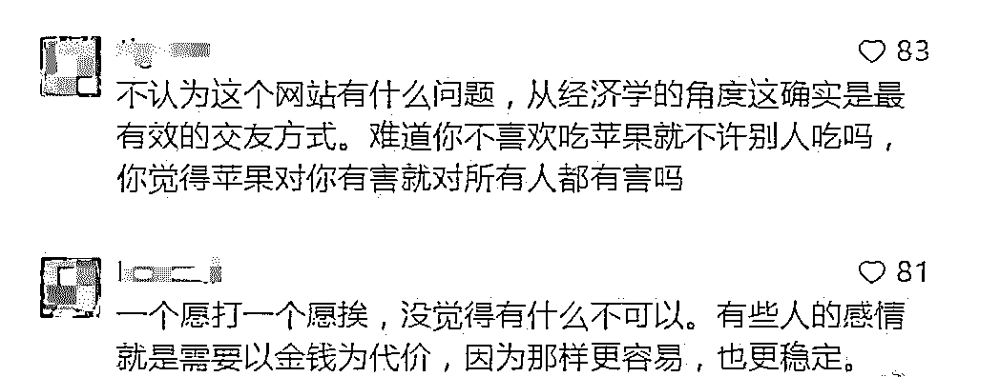

的确，每个人都有自己的逻辑，在坏人的逻辑里，他所做的就是对的。可是这样一个“拉皮条”和“物化女性”的下流软件，它的存在真的是对的吗？这样一个挑战社会秩序和道德底线的软件，它应该在各取所需的呼声和定位高端人群的障眼法下，把援交和包养的本质洗白吗？

“甜蜜定制”与世纪佳缘等传统型社交网站不同，并不以婚姻为导向，由于涉及交易，无论是金钱交易还是其他任何动机不纯的交易，这种网络交往都已经不再属于“社交”范畴，而是一种新型卖淫。“甜蜜定制”以网站为依托，实质性的交易行为发生在线下，因此网站的创立者与运营者都涉嫌组织卖淫。

诚然，年轻人面临着种种压力，也面临着资源的稀缺，甚至是生存的挑战，但**以自己为代价来换取美好生活，本就是不劳而获和虚荣心作祟，更是道德和良知的缺失。**

诚然，成功人士也可能面对情感的不顺和生活的空虚，但靠交易换来的满足，既不是真感情，也违背了伦理，更何况，这在我国法律内是完全不允许的！

孟子说：“无羞恶之心，非人也。”荀子说：“人不知羞耻，乃不能成人。”美国作家马克·吐温也说过：“人是唯一知道羞耻和有必要知道羞耻的动物。”

**如果正确的道德伦理也在所谓的“时代变了”中丢弃，羞耻和良知在“社会进步”中背弃，那么生而为人，还剩下什么？**

**延伸阅读：**

* * *

**[色情网站黑色产业链：女主播年入千万？网站年盈利上亿？](http://mp.weixin.qq.com/s?__biz=MzIyMDYwMTk0Mw==&mid=2247490964&idx=1&sn=d54e3d04d1882dc327d8f115fb5c45af&chksm=97c8d6aca0bf5fbaabc095f5977e6297d5a414c7125e9ec64b73772d6493ffe07890338aa873&scene=21#wechat_redirect)**

**[深度|情色市场里的贵族：女孩逃脱后揭秘“假处女”灰色产业链的黑幕！](http://mp.weixin.qq.com/s?__biz=MzIyMDYwMTk0Mw==&mid=2247489362&idx=1&sn=ea24477314cc86a7d9ec67dd1c7a5622&chksm=97c8dc6aa0bf557c59a78178491679c5e9bc928ff6f9e64ba9d6cd6843610715aeb86862492d&scene=21#wechat_redirect)** 

* * *

**【灰产圈】高端社群小程序开通，2018 最值得加入的社群！**

<mp-miniprogram class="miniprogram_element" data-miniprogram-appid="wx4f706964b979122a" data-miniprogram-path="pages/topics/topics?group_id=881854415822" data-miniprogram-nickname="知识星球" data-miniprogram-avatar="http://mmbiz.qpic.cn/mmbiz_png/kialtkOXGKS7D9hZrmO2jzDqryXXTAlhxSpnrKnHGV65KXzicibOppaPic4dCRxftvabB8Iqswo3OuQEDSxE7NicXBg/0?wx_fmt=png" data-miniprogram-title="【灰产圈】高端社群" data-miniprogram-imageurl="http://mmbiz.qpic.cn/mmbiz_jpg/WWG78hysZ0brJkWoyG2VDIacqgQjkDfp6mLiaoPBJ2SgWZHtRuTw7ia8kpoxntsn7PiaFOQO2U23FW6Iry0gS1GnA/0?wx_fmt=jpeg"></mp-miniprogram>

**点击加入【灰产圈】高端社群**