# 深度揭秘韭菜收割场：币圈、ICO、空气币...币圈一天，金融十年！

> 原文：[`mp.weixin.qq.com/s?__biz=MzIyMDYwMTk0Mw==&mid=2247491793&idx=1&sn=f5f5b116f943aa07ea836b997b7bb320&chksm=97cb2be9a0bca2ff0ea1e2c80f82ca1c06cba04415607d501072a972e8a9b5bc65874fb035b4&scene=27#wechat_redirect`](http://mp.weixin.qq.com/s?__biz=MzIyMDYwMTk0Mw==&mid=2247491793&idx=1&sn=f5f5b116f943aa07ea836b997b7bb320&chksm=97cb2be9a0bca2ff0ea1e2c80f82ca1c06cba04415607d501072a972e8a9b5bc65874fb035b4&scene=27#wechat_redirect)

**点击上方蓝色字体“灰产圈”关注并置顶本公众号**

**导语**

股市有风险，但从没少了一茬又一茬的“韭菜”轮番“谨慎”入场。

币圈、ICO、空气币......都是一个个崭新的韭菜收割场所。

在贪婪的促使下，韭菜们不甘心地完成了从新韭菜到保守型、赌徒型和老韭菜的进化，吃过的亏，砸进去的钱都成了过眼云烟。

去年 9 月 4 日，央行发布的文件明确叫停了代币发行融资——也就是 ICO 禁令。这种融资主体通过代币的违规发售、流通，向投资者筹集比特币、以太币等所谓“虚拟货币”的行为，在国内被明令禁止。

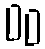

自今年以来，代币一直处于火爆的交易中。它们究竟是未被大众所知的“珍珠”？还是标榜着“区块链技术”的“虚拟货币”？央视财经记者进行了调查。

**火爆依旧 禁不住的炒币人**

**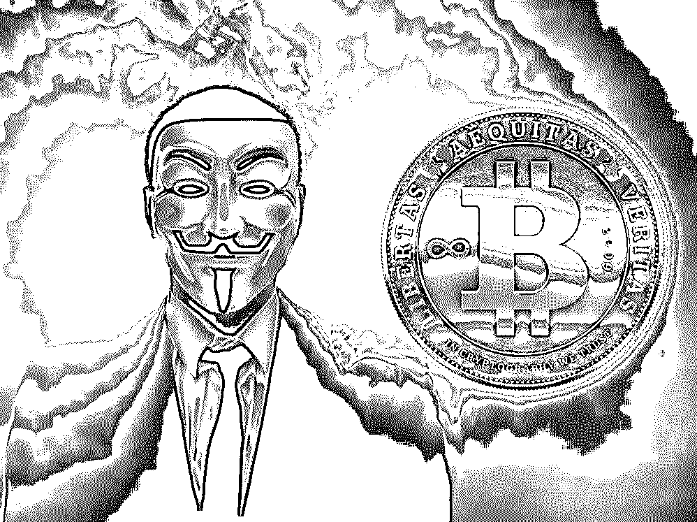**

**以下调查为央视财经发布：**

杨超是一位虚拟货币投资者，今年 1 月，他看到比特币价格大幅上涨，便筹钱进行了投资，但仅仅两个月的时间，就赔掉了上千万。

虚拟货币投资者 杨超说，比特币当时买入的价格在 10 万块钱一个，以这个价格就买入了大概两百多万、三百万的比特币。之后这个比特币的价格就开始下滑、下挫，然后下挫每跌 10%，就又买现货。

实际上，这不是杨超第一次炒币。在代币发行融资和交易平台被禁之前，他的亏损已经超过了 200 万。心有不甘的杨超认为，央行出台的 ICO 禁令对于他这样的投资者并没有任何影响。于是，再次入场的结果更加令人失望。

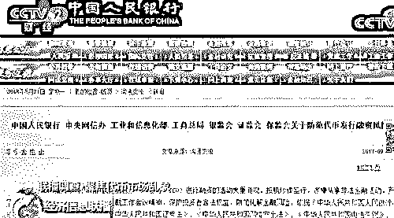

虚拟货币投资者 杨超表示，类似我这样子的这种投资者还不在少数，整个群里面加起来接近七八百人，好几个群。最少的也得亏了十几万吧。 

杨超之所以投资虚拟货币，主要是源于价格的大起大落。像比特币，从 2009 年出现，每个比特币还不到一分钱，不到十年的时间，价格一度突破了 12 万元人民币，在如此疯涨行情下，可以一夜暴富的心态吸引着大量投资者入场。

95 后，1 千个比特币，这是郑皓升在“币圈”中的符号。在一年内将 14 万元本金变成了几个亿的他，目前手上还有超过 50 种不同的代币。但是像郑皓升这样的专业投资者，也不是永远的赢家。

虚拟货币投资者 郑皓升对记者说，前两天直接亏损了 200 个比特币，价值一千万，间接亏损大概有三千万左右。有多少人挣就有多少人亏，更多的人是在亏损的，盲目地入场，80%都在亏。

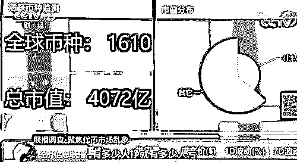

数据显示，目前，全球活跃的虚拟货币约有 1600 种。每天的累计交易额超过了 100 亿美元。其中，仅比特币一天的交易额就在 60 亿美元左右。 而国内投资者是全球“虚拟货币”大买家。

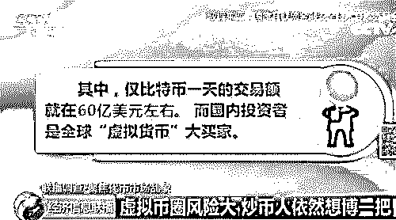

**“空气币”频现 新发行代币增加 30 多倍**

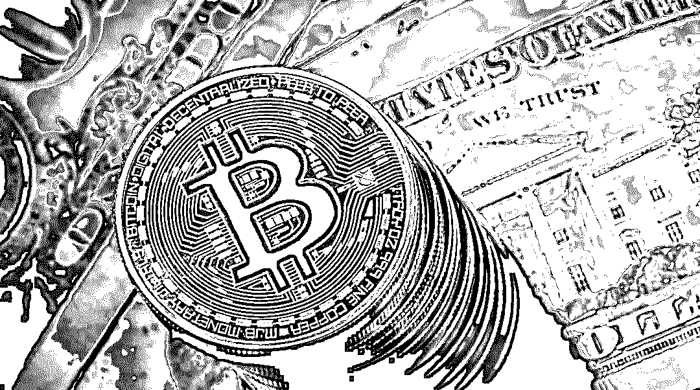

央行把代币发行融资明确为：“本质上是一种未经批准非法公开融资的行为，可是，记者发现，仍有很多企业在发行，代币为什么会这么热呢？

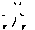国内的交易平台，尤其是主要的交易平台，上线的交易币种相对比较少，目前来看比原来丰富了很多，比如说火币、OKEX，它们上线的币种都已经超过了 100 种。2017 年 9 月份之前基本上就是一般就是 3 个，比特币，莱特币和以太坊。

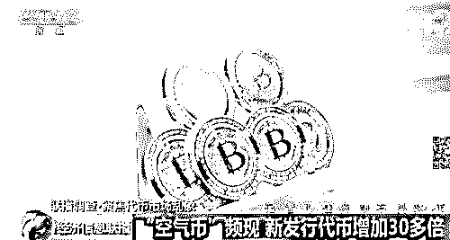

投资者的热情不减，代币发行融资层出不穷的背后，在专业投资者看来，这个市场已经出现明显的泡沫。

虚拟货币投资者李笑来说：

现在很明显有泡沫，且一直有泡沫，但这个泡沫究竟在哪里，究竟有多大谁也不知道。

在泡沫中，最为危险的，是完全没有实体项目支撑的“空气币”。

2018 年 1 月 15 日，号称全球首个支持数字加密货币的博彩游戏平台英雄链，上线即“破发”，由发行价 0.6 元跌至 0.05 元。3 月 14 日，被公安机关以涉嫌诈骗立案调查； 2018 年 1 月，主打“放卫星”和打造太空操作系统概念的太空链进行 ICO，1 月 10 日向私募投资人发行代币 SPC，仅一天便募集近 10 亿元，3 月 28 日，太空链项目及相关代投涉嫌诈骗已被扬州市公安局开发区分局立案。像类似的现象，在虚拟货币行业屡见不鲜。

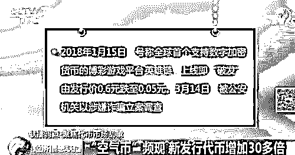

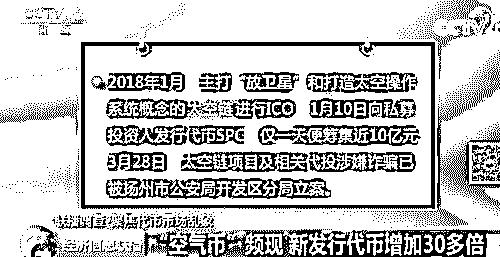

这种可以比较有把握地称之为空气币，占比很难说，但是在泡沫之下，这个比例是不小的，有可能会超过 50%、60%甚至 70%。

“空气币”与其他融资项目不同，发行融资的融资主体并不需要是一个真实的公司，一个临时组成的“团队”就可以成为融资主体。在央行禁止代币发行融资后，国内原有的代币项目，纷纷选择将服务器、融资主体注册地等迁移到境外。

而以“团队”为融资主体的代币融资项目甚至都不需要将注册地外迁，一切照旧，就可以继续融资圈钱。

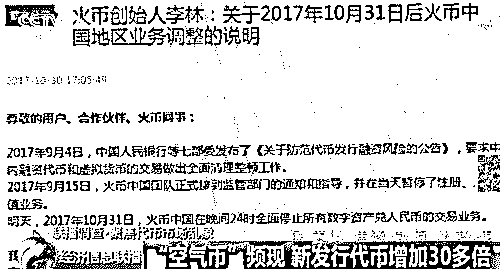

很多 ICO 的主体就仅仅是一个团队，很多没有注册到公司的级别，所以很难说有一个公司主体，或者是企业主体。

**涨跌游戏 忽视价值资本为王**

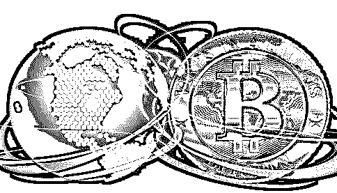

正常来讲，每种代币都是基于某个区块链技术或者应用的“虚拟货币”。看好这种代币，就是看好它背后的区块链技术。但是，在暴涨暴跌的一轮一轮行情中，一些空气币都会被市场接纳。

对于普通投资者，在目前的虚拟货币定价中，即使是真正有实体项目支撑的代币，也难以参照 IPO 项目以实体项目的估值进行定价。在信息完全不透明的情况下，对于一种虚拟货币的价格完全取决于项目的包装，甚至是项目由谁站台。李笑来就经常出现在一些项目的宣传中，成为一个站台人，其中也不乏空气项目。

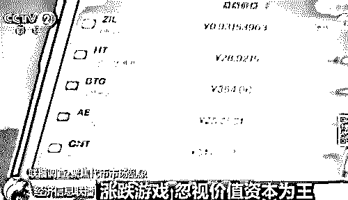

虚拟货币投资者 李笑来说，99.99%的情况下是被“站台”的，急于赚钱的人是害怕错过机会的，又判断不了，所以就看站台的人是谁，也许那个站台人有影响力，那就意味着这个东西被看好，可能将来会有影响力。

只要是资本愿意，即便是背后没有项目的空气币，也有价格大幅上涨得可能。因为各国都缺乏有效的监管，资本通过涨跌游戏，可以轻松圈走小投资人的资金。这样的操作对于目前市场中大量存在的新发行代币、或者融资总金额不大的小币种而言，操作起来并不难。

你就没有价值，但是照样可以炒得很高，为什么呢，就是搏傻，虽然价值是零，但是现在卖十块钱，后面二十块钱还有人愿意买，再找一个更大的傻瓜卖给他。

**如何识别山寨币、空气币和传销币？**

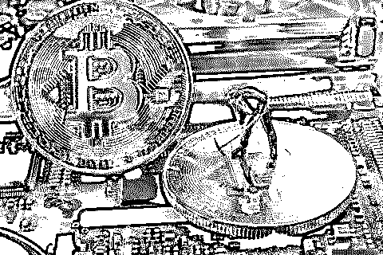

进入区块链领域之后发现币圈和链圈已经从原来的相互鄙视变成了今天的相（hang）互（xie）融（yi）合（qi），严格来讲，不能说这不是一件好事儿，毕竟币圈需要链圈的项目来做投资，链圈不仅需要币圈的钱还需要币圈的所谓“社区”，绝大多数人的投资热情挡是挡不住的，相信这里面一定有好项目，但是各位作为价值投资者的践行者，还是要学会怎么来辨别什么是山寨币、空气币和传销币。

以上案例中的“英雄链”“太空链”即为空气币，如空气般虚无缥缈。 

那么该如何识别这些币种呢？

接下来我来教大家识别

1.山寨币

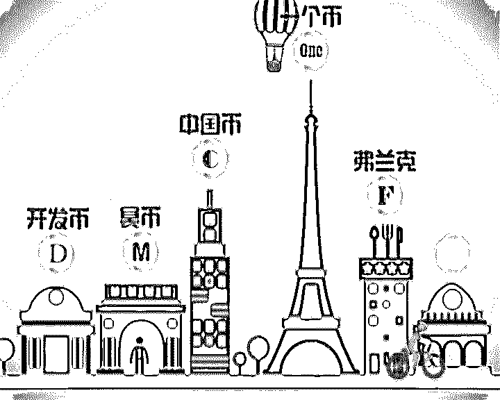

随着比特币被爆炒，带火了中国国产虚拟货币，它们在业内被统一称为“山寨币”，高达 30 余种，比如无限币、夸克币、泽塔币、红币、隐形金条、等。一些币种在面市后，交易价格波动幅度起伏，引来了不少投机客参与交易。寻找一款精品良心山寨币实属不易，国际市场口碑较好的山寨币有莱特币 LTC、未来币 NXT、无限币 IFC、质数币 XPM、美卡币 MEC、分子币 MOL、苹果币 APCCOIN、阳光币 ssc。这些币种挖掘质量高、交易市场上抗跌性能较强。

相对于虚拟货币的火热，其监管或处于空白状态，这也让业内对于行业的发展表示出担忧。对于参与的人来说，最大的风险就是没有人接盘。

从国产“山寨币”来看，真正通过挖矿赚币的人很少，大部分人都是进行交易投机：低价买入、高价卖出。

而如果没有了接盘者，“山寨币”就将很快崩盘。

2.空气币

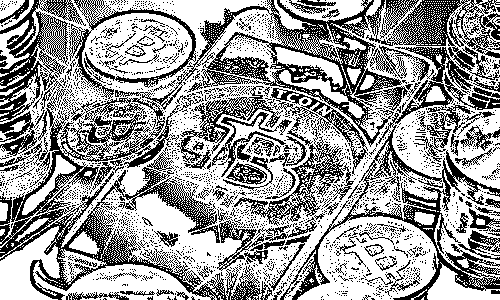

进入 2017 年 6 月份，国内一批投机分子的空气币开始进入市场。这些公司的典型特征是，团队背景看着比较华丽，但是没有任何过往历史成绩，更谈不上在 GitHub 上查询项目代码进度，团队都是 2017 年才接触区块链。

他们甚至没有成立公司，主要靠包装一个区块链无所不能的好概念，来忽悠外行众筹投资。投机色彩特别明显。但是受益于市场红利，这些币都有 5 倍以上的升值。

不过仅仅几个月过后，这些泡沫浓厚的空气币，就漏出了诈骗的马脚，被媒体报道曝光，这些公司成为了监管治理的重灾区。

曾经有一位币圈朋友跟我说他们发币后的心情：现在这钱都是大风刮来的，随便花。

3.传销币

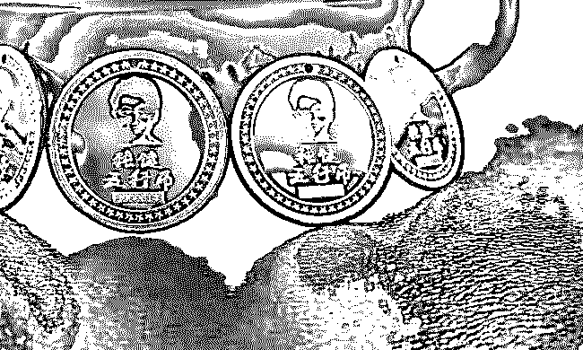

传销币无疑是空气币，但说起传销币，我们还是先来做个对比，比特币是开放源码的，而且有限量，一共 2100 万枚，每产生一个比特币都是透明的，不受任何操纵。

而“传销币”不开放源码，产生币的速度、数量都由企业或平台操纵，只要平台开发者愿意，“传销币”可以无限增发。

你可以把传销币理解为类似 Q 币的各种数字货币，压根儿没有用到任何区块链技术。只要腾讯愿意，它可以无限发放。因此其未来价值几乎为零。

如何避免当韭菜

1、白皮书上没有实质性的内容，高频率使用没有实质意义的关键字眼：透明化、去信任、去中心化！还有白皮书中对于资金的监管方式和项目进度安排都没有明确，一定要当心！

2、把项目说得巨大，天花乱坠，没有明显的盈利模式和商业价值，绕道而行。

3、所有的精力都放到推广上，代码毫无创新，也看不到任何坚实的创新技术，基本上都是破发的。

4、团队信息不透明，过度包装团队，标榜团队都是国外资深程序员，然后找几个币圈大佬，或者明星网红之类的站台，这样的项目要谨慎。

5、看一个项目靠不靠谱，也可以从共识算法的选择中判断，PoW，PoS，PDBFT，DPOS，DAG……，这里是空气币山寨币到了这一步最痛苦最难编写的,基本都是瞎编乱吹。

以上就是如何识别山寨币、空气币和传销币的方法了，对于数字货币投资在此还是提醒大家，购买有风险，投资需谨慎。

**如何发现一个币种的危险信号？**

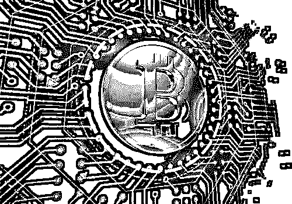

上面教了大家**如何识别山寨币、空气币和传销币，下面我们继续教大家如何看一个币种的危险信号，如果有其一那你应该有所警觉，提早撤出为妙！**

1. 100%收益：一般出现“只涨不跌”，“保证固定收入”，“稳赚不亏”，“0 风险”，“躺着赚钱”，“实现财富自由”这些字眼，我就会立马敲响警钟！没有什么投资时是没有风险的，何况是币圈这种每天波动幅度巨大的投资，记住！所有高回报的项目一定跟随着高风险的。还是那个逻辑，如果没有风险，他们为什么不自己借钱去投？

2. 拉人头，分级分成：所有真正在踏实做事的项目，都不会鼓励用户去拉人头，并给予持续奖金。更不会建立组织结构的分成规则，建立多个等级，进一步扩大自己的影响力。想想看，你见过蚂蚁金服，支付宝，给客户持续的分成奖励吗？好的产品，大家自然会用。拉人头，获得持续收益的，99%都是在传销。

3. 团队信息模糊：骗子当然不希望让别人知道自己的真实身份，因为自己也清楚项目不会长久，暴露自己，等待他们的肯定是仇人的追杀。所以如果你准备投资一个项目，但网站上根本找不到任何创始团队的信息，甚至信息非常模糊，百度一下和 Linkedin 搜索团队成员后，也基本看不到任何有效信息，那你也要注意了，这个项目很可能是要跑路的…

4. 代码不公开：区块链项目的最大特点之一就是代码公开化（开源化），任何人都可以查看项目进度，发现漏洞，提出改进建议。比特币，以太坊能有今天的成绩，也绝对离不开每位社群成员和全世界码农的贡献。但如果一个项目不公开自己的代码，第一，它就自己断了免费获得社群和码农帮助的可能。第二，它可能根本没有任何技术和代码，就像上面 Bitconnect 说的“超级交易机器人”，只是一个幌子罢了。想要查看项目代码和进度，推荐大家使用：http://github.com

5. 提现，提币困难：在这个流通性强的币圈市场，按道理投资者应该可以随时提币，买入卖出。但如果项目故意设置一些锁仓的限制，导致投资者无法随时提现，把代币换成现金或者比特币，那很有可能你就是在补前面投资者的钱了。这种拆东墙补西墙的把戏，项目真的是屡试不爽。

6. 成交量极低：当一个项目市值几亿美金，而每天的交易量却只有 100 万美金的流水，那大家一定要注意了，这个就是市场所谓的空气币，在现实中没有任何应用价值，完全是被庄家拉盘拿来割韭菜的。

**在这里分享一下我的三条投资原则：**

**1. 只用丢了不心疼的钱来参与投资**

**2. 只投资自己能看懂的成长性资产**

**3. 不论市场如何，永远记住前两条**

**已被曝光的虚拟货币有哪些？**

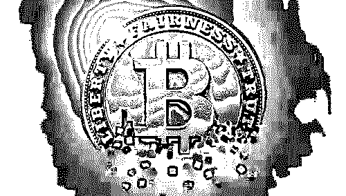

**传销币：**

** 维卡币**、天使币、百川币、珍宝币、**熊猫币**、马克币、赫尔币、**卓越币**、

吉祥币、盛通币、大唐币、通宝币、富豪币、稀量币、五行币、盛源币、

**   ACCH 天使链**、**ECO 生态币**、亚欧币、亚洲币、中华币、米米币、**龙币**、

U 币、善心币、**文娱链**、视界链、**农业链**、富邦商城、天使链、**流量魔石**、

金元币、垠盛、**西游链**、高兴币、世通元、**点点赚**、**美 3 妹**、盛大华天、

缘来一家、**假天师**、**奇妙生物**、电能链、**帮呗**、绿链、山海经、WV 梦幻之旅、

买卖宝、**特色三妹**、**雷达币**、点点赚、无上商城、APP 小懒猪、中国一川、

自由宝、易赚宝、友钱宝、友义宝、**精神传销心灵培训**、**星火草原**、智富宝、

空气币：  

太空链、英雄链、ARTS、MXCC，QBTC、SBTC、BTG、BCD、BCX、BCH、BTF、BTN、BTP、BTV、UBTC、BTH、IOST、SOC、EDU、SEER、ONT

骗子币：

BTC（最大的骗子货币）

**结尾**

投资圈盛传一句话“不要试图挑战人性”，而真正赚钱的项目，恰恰就是利用了人性。 

**这些虚假货币能够泛滥成灾，都是利用了韭菜的人性——贪婪。**菜农在春秋季收割韭菜的时候，至少要割三次，才会让它开花结籽。历经了新韭菜、保守型、赌徒型、老韭菜的进化，被收割多次后，没有资源的食物链低端投资者最终仍逃不了开花结籽，被榨干最后的价值。往事历历在目，仍抵不过浩浩荡荡的韭菜加入进来。都说散户的记忆只有 7 秒，在贪婪面前，绝大多数人只是选择性失忆。

“善恶终有报，天道好轮回；不信抬头看，苍天饶过谁”。对于已经被收割的韭菜们，不过是一句心里安慰。

* * *

**延伸阅读：** 

**[区块链狂欢，虚拟币骗局的背后如何不当韭菜？](http://mp.weixin.qq.com/s?__biz=MzIyMDYwMTk0Mw==&mid=2247491136&idx=2&sn=6440c209de25721fac8b3709b505b35a&chksm=97c8d578a0bf5c6eb03eb4e547f7c5240e69af9616c804d234b00669f0622ea0288b307b99c4&scene=21#wechat_redirect)**

**[区块链乱象：709 个以太币能买下“日本”！](http://mp.weixin.qq.com/s?__biz=MzIyMDYwMTk0Mw==&mid=2247491060&idx=1&sn=4bf5820b09749ccf468eef9383b02357&chksm=97c8d6cca0bf5fdad1a318363818805776c59693d72f96568ab27c9c8393088cf192409c23e8&scene=21#wechat_redirect)**

**[315 特辑|揭秘  "比特币首富"李笑来：一个诈骗者的财富自由之路！](http://mp.weixin.qq.com/s?__biz=MzIyMDYwMTk0Mw==&mid=2247490648&idx=1&sn=3238351054461a4f6b4bb47709ea26ef&chksm=97c8d760a0bf5e7642457c6dd7c7d6ee1d633f52ae9a0403d25aaad9459f20f57539b9a60dfb&scene=21#wechat_redirect)**

* * *

**【灰产圈】高端社群小程序开通，2018 最值得加入的社群！** 

<mp-miniprogram class="miniprogram_element" data-miniprogram-appid="wx4f706964b979122a" data-miniprogram-path="pages/topics/topics?group_id=881854415822" data-miniprogram-nickname="知识星球" data-miniprogram-avatar="http://mmbiz.qpic.cn/mmbiz_png/kialtkOXGKS7D9hZrmO2jzDqryXXTAlhxSpnrKnHGV65KXzicibOppaPic4dCRxftvabB8Iqswo3OuQEDSxE7NicXBg/0?wx_fmt=png" data-miniprogram-title="【灰产圈】高端社群" data-miniprogram-imageurl="http://mmbiz.qpic.cn/mmbiz_jpg/WWG78hysZ0brJkWoyG2VDIacqgQjkDfp6mLiaoPBJ2SgWZHtRuTw7ia8kpoxntsn7PiaFOQO2U23FW6Iry0gS1GnA/0?wx_fmt=jpeg"></mp-miniprogram>

**点击加入【灰产圈】高端社群**