# 海淘惊天黑幕曝光！假货！都是假货！全都是假货！没有一件正品！

> 原文：[`mp.weixin.qq.com/s?__biz=MzIyMDYwMTk0Mw==&mid=2247491763&idx=1&sn=e27c2900545038280e1d595700de1c21&chksm=97cb2b8ba0bca29dd62b028487085fc69895f7c8f7eaa0f008c6e143492fae01b1dde8dd69e7&scene=27#wechat_redirect`](http://mp.weixin.qq.com/s?__biz=MzIyMDYwMTk0Mw==&mid=2247491763&idx=1&sn=e27c2900545038280e1d595700de1c21&chksm=97cb2b8ba0bca29dd62b028487085fc69895f7c8f7eaa0f008c6e143492fae01b1dde8dd69e7&scene=27#wechat_redirect)

**导语**

央视新闻客户端 5 月 19 日消息，《关于跨境电商零售进口税收政策的通知》规定：“跨境电子商务零售进口商品的单次交易限值为人民币 2000 元，个人年度交易限值为人民币 20000 元。” 

在这个额度之内，不仅可以随意在跨境电商上买买买，还能享受相应的进口税收优惠。而超过了限额，就会被电商退单，无法再进行电商海淘。

然而近期，一些粉丝向灰产圈反映：自己上万元的海淘额度，竟然被别人偷走了！先来查查你的额度有没有被盗？

**查询方法：**

**登录网站**：http://ceb2pub.chinaport.gov.cn

①输入本人姓名和身份证号码，可查询今年已用海淘额度和可用海淘额度。

②点击底部蓝色小字，注册后可查询海淘消费明细。

解决办法：如果您确认自己的海淘额度被别人盗用了，可以拨打中国电子口岸客服热线 010-95198 进行处理。

**调查：谁偷了我的海淘额度？**

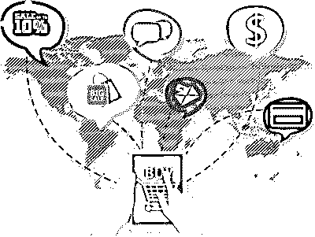

自己名下的海淘额度，却被别人偷走了！是谁偷的？怎么偷的？偷走干什么用呢？

灰产圈对“海淘额度失踪事件”展开了调查。

**调查一：漏洞百出的通关记录**

**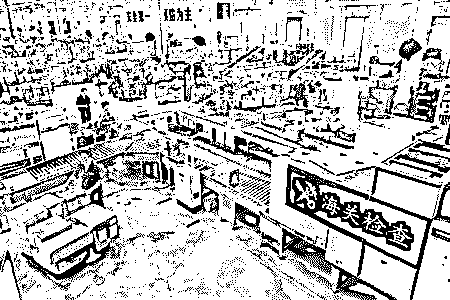**

身份信息被冒用，海淘额度被盗用，问题究竟出在了哪儿？

我们来看一下电商海淘的一般步骤，

首先由消费者在电商上购买产品，购买时需要提交个人的姓名和身份证号；

电商将这些信息提交给海关，做通关申报；

物流公司把货物运输到消费者手里。

而在海关网站查询到的信息里，恰恰就包括了这些环节上的数据。

那么，究竟是谁在盗用这些海淘额度呢？

**调查二：无法登陆的电商 竟在卖“壳”？**

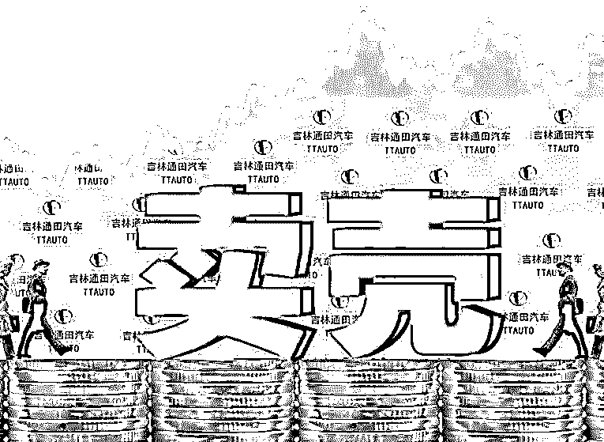

通关记录漏洞百出，各种信息自相矛盾。

怎么看，都不像是真的。

想要伪造某一项信息，还相对容易，但伪造购买人姓名、身份证号、电话号码、快递单号，这么多的信息，就没有那么简单了。

既然所有海淘消费者的个人信息，都是由电商上报给海关的。那么这些虚假信息，跟电商之间的关系究竟是什么呢？

灰产圈联系到了某海淘平台负责人

这位负责人 KK 告诉灰产圈，购物网站难用，网上订单稀少都无所谓，因为他们完全不依靠这个平台赚钱。他们的主营业务其实是帮助一些公司，办理通关，相当于借壳给别人。

KK 讲：境外的货，我们帮他做清关，他会把这个（买家）信息提供我们平台。因为我们才跟海关有对接。

要来借壳的公司，会提供一些现成的买家信息，他们把这些买家，做成自己平台上的买家。

这样一来，对于买家身份信息的真假，他们也无法辨别。那么，向电商提供买家信息的人，究竟是谁呢？在灰产圈的追问下，这位负责人 KK 说出了实情。

灰产圈：你们的客户来自哪儿来呢？

KK：一些（跨境）物流公司。它们没有（电商）平台，对不对？那好，我们是通关（电商）平台，我们就合作了。

**调查三：逃税手段！跨境物流公司倒卖实名信息**

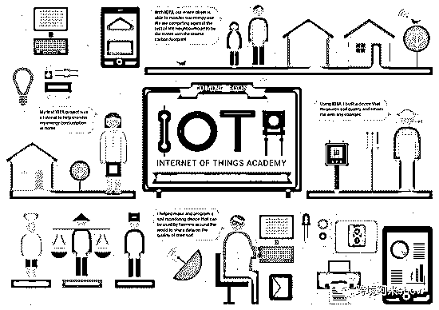

电商公司说，他们只是借出自己的壳，帮人通关。而掌握着这些假身份信息的源头，其实是跨境物流公司。事实真的是这样吗？跨境物流公司为什么要这样做呢？接着的调查。

为了了解更多情况，灰产圈加入了一个“跨境物流”的聊天群，群里经常有物流公司，在发布“电商清关”的服务广告，一些广告直白地写着：清关时“无需提供身份证”。

海关总署规定是这样的：跨境电子商务零售进口商品，必须申报真实的买家身份信息。

那么，这种无需提供买家身份的物流清关服务，会不会就是我们要找的假信息源头呢？

灰产圈：国家不是规定，通关时都需要上报买家实名信息的吗？

KK：我们利用我们目前自己的（电商）平台，利用我们自己提供的身份证信息，帮你刷单，刷出来。

灰产圈：还得填报快递单呢？

KK：快递单也是快递物流公司做上去的。

原来，所谓的清关服务，其实就是帮客户“刷单”，制造假的通关信息，来上报给海关。

为了证实自己公司的实力，他还给灰产圈发来了所谓的“成功案例”。

图片中这些货物已经全部完成了通关，相对应的信息，全是他们“编造”出来的。

串通电商公司做假订单，上报给海关不真实的购物信息，究竟是为了什么呢？

KK：小批量的客户，因为他有一千件、几千件（货物）对吧？要整批想进来的话，那要通过电商平台，做一千个包裹的订单信息。

他告诉灰产圈，整批货物进口，需要全额缴税，但是把这些货物化整为零，伪装成个人用户在电商上的购买，就可以逃避很大部分的税。

他们就负责帮助客户化整为零，而这个过程，电话号码、物流数据都是伪造的，最重要的是他们可以提供假的订购人身份信息。

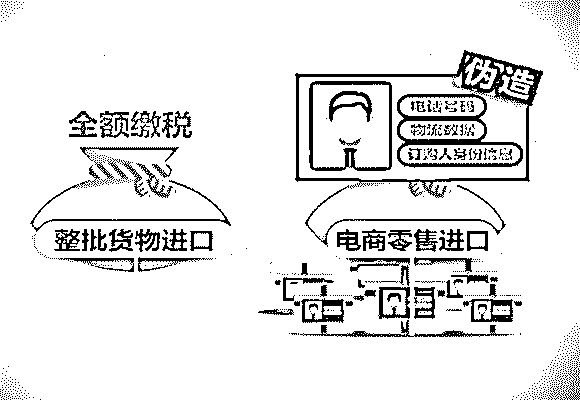

KK：做一千个包裹的订单信息，那必须要具备一千个身份证。

灰产圈：为什么要一千个身份证？

KK：每一个身份证下一个订单，一个包裹（限值）你只能 2000 人民币，知道吗？对，有限制的。所以说的话，如果你高了，那必须要征税的。

这么多的身份信息，究竟从何而来呢？

KK：分支链下来的，然后的话小头下面有很多小头，然后的话每提供一次身份证信息给他们多少钱。

灰产圈：就得几千人的信息？

KK：几千人的信息肯定不多，做这个电商平台的话，那你必须要有所有的服务信息啊。

调查中，灰产圈发现，利用个人信息，帮助进口贸易逃税，这样的操作已经不是个案了。

这些物流公司甚至有专门的人负责搜集个人信息。

灰产圈：你们用的实名信息是从哪来的？

KK：我们都有一个部门专门负责的，这个就不方便透露的。

很多客户的整条柜（集装箱），都是通过这个进来。只是做一个擦边球而已。

**被偷走的不仅是个人信息 还有国家税收**

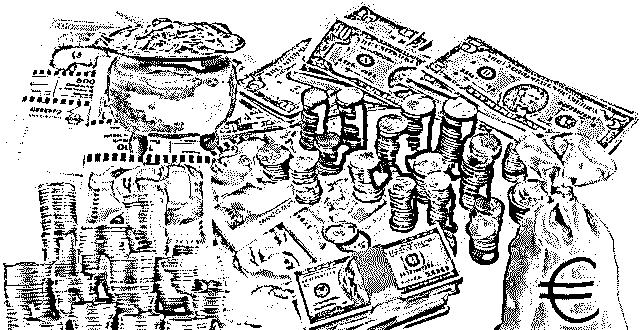

除了名字和身份证号码之外，收货人的电话、地址、物流信息都是伪造的。

然而，就是这样假得不能再假的海淘订单，却能轻而易举通过海关，甚至演变成为大规模的逃税行为。

有这样一组数据，从 2013 年-2017 年间，国家各部门出台的关于跨境电商的政策多达 39 份。

政策鼓励下，仅 2017 年上半年，我国跨境电商交易规模就达到 3.6 万亿元，稳居世界第一，有机构预测，2018 年我国跨境电商交易规模将达到 8.8 万亿元。

制定海淘减税额度的政策，原本是为了鼓励跨境电商的发展，可眼下，海淘额度的相关政策正式实施刚满两年，有人就找到了这样一条渠道，利用他人的海淘额度，让不少本应全额缴税的外贸货物，蒙混过关，享受起了“跨境电商零售进口”的税收优惠。

这样的黑色产业链，一方面，是对我们每个人信息安全的严重威胁，另一方面，也导致了国家税收的大量流失。

**海淘背后假货物流内幕**

请看调查视频：**《假货秒变海淘正品，都是快递干的好事！》**

[`v.qq.com/iframe/preview.html?vid=s05069ybgvv&width=500&height=375&auto=0`](https://v.qq.com/iframe/preview.html?vid=s05069ybgvv&width=500&height=375&auto=0)

一段视频曝光了顺丰以及四通一达的快递代收点，帮助莆田假冒运动鞋厂商伪造快递单，虚构海外发货信息的惊人内幕。

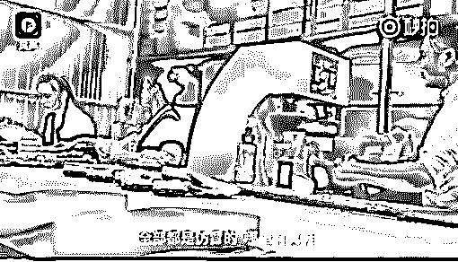

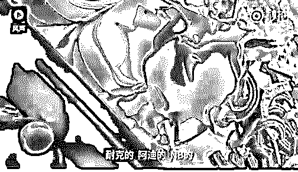

原来，很多用户海淘来的阿迪、耐克、新百伦等名牌运动鞋，都是国内山寨。

据了解，一些快递代收点公开提供异地上线服务，甚至专门建设虚假海外物流查询网站，帮国内厂商虚构香港、美国等地发货信息，使假货摇身一变成海外代购正品。

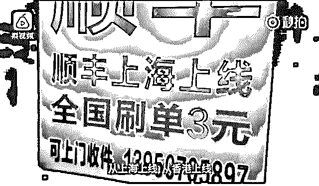

调查者亲自测试所购“假单号”，圆通某快递显示某单号显示：“美国国际公司 已收件，已发出，已经发往北京的转移中心......”

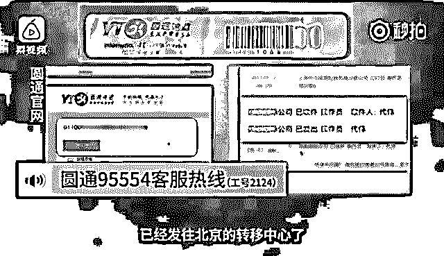

韵达某快递单号在官网也显示为国际件：“到达香港跨境仓公司 已收件，在香港离岸清关......”

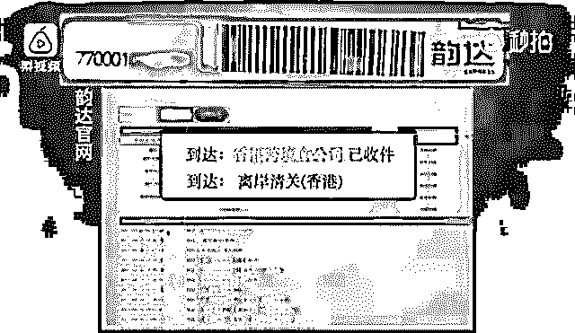

那么像这样的“异地上线”是怎么做到的呢?

“快递单号就像人的身份证号一样，任何一个单号它都有一个归属的快递营业网点，区域之间是一一对应的。

如果国内快递网点能够搞到美国或者香港网点的单号，然后再用美国香港等网点的代码去登陆这个扫描设备，只要同时满足了这两个条件，就等于是美国香港那边的站点做了扫描操作。

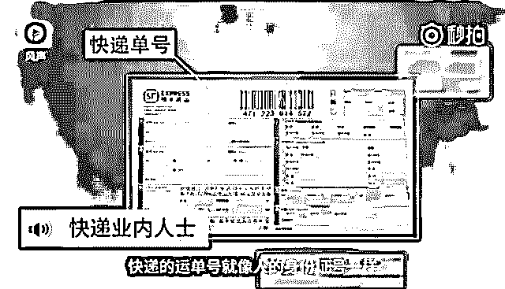

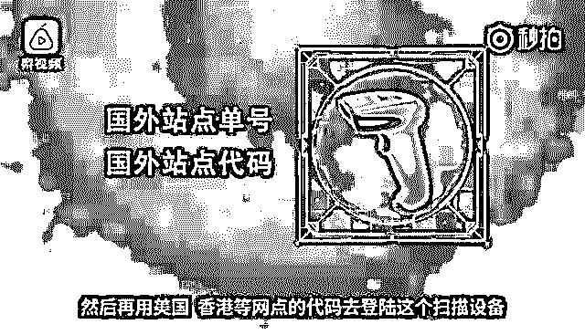

国内的买家就认为货真的是从海外发过来的......

但实际上可能就是在国内的其他网点做的!”

那万一买家稍微有点疑心呢?

这一点造假者也想到了，所以他们还设立了一个海外货运查询网站，可随时查阅所谓的“实时海外运输更新信息”。

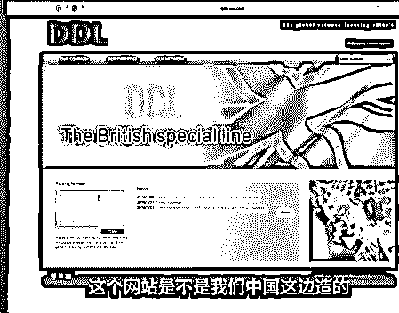

暗访到这里，工作人员自豪地称：

“顾客就是用来忽悠的!”

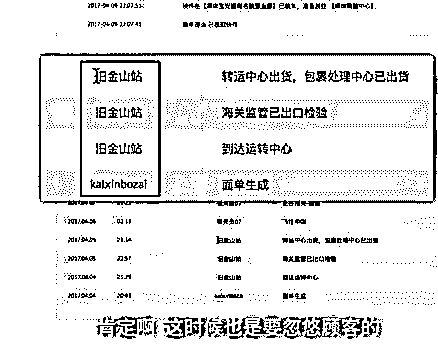

可不可怕?

着完全是从源头造假啊...

**奢侈品代购的套路**

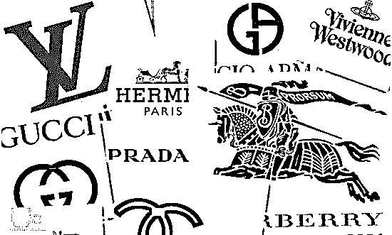

                      （全正品毛鳞凤爪，真假参着比较多，全假货一小部分）

**1、**销量，评论，买家秀，收藏 90%是刷出来的，特别是那些说正品，跟朋友购买的对比一模一样，这些大部分是刷出来的。

**2、**图片齐全的基本假货，一件正品奢侈品随便都几千以上，正常代购赚 10-15%的利润，代购者不会冒险去拿同款几个颜色拍图，个别款可能，因为有人买了，可以拿来拍。

（所以看图片，需要是在专卖店拍的相对靠谱，但不是 100%）

**3、**购买现场直播，有真的，但蛮多假的，购物完到发货这中间，非常多的地方可以实现狸猫换太子，所以你收到的还是假货，然后代购者把正品退货，为啥能退，因为在香港或国外是无质量问题也享受退换货的服务。

（现场直播，相对有保证，但不是 100%）

为啥能瞒过某宝，认证进去，因为购买了一次正品，就可以一直使用，或者狸猫换太子那一步就已经可以拍下证据带留用，所以啊，水深呢。

**4、**直邮问题，港直邮非常简单，东西在国内寄，加钱就可以让物流信息显示从香港寄出；海外的，基本是比较高价值的才这么干，把商品从香港先快递到国外，然后再从那边寄回来，这样你查到的各种信息都是海外直邮。

**5、**代购小票是可以定制的，可以做到 99.99%逼真，除非专门机构鉴定，但是大部分代购不提供，只提供照片，你就无法鉴定，就算提供，鉴定是一笔不小费用，最后不了了之。

**6、**支持专柜验货，这个是骗小白的，目前还没有奢侈品专卖店提供这种服务，就算帮你验，也不会出具任何证明给你，除非到质量检验中心认证，但那需要准备各种资料跟高昂的费用，你将得不偿失，所以这个保证没任何意义；

**7、**不能享受无理由退货问题，代购是比较特殊的行业，都是不支持无理由退货的，也正因为如此漏洞让商家有空子钻，你买到假货，也只能自认倒霉。

**8、**价格，没有官方活动时，价格太低也是不正常，正常代购费 10%（不包含税费和快递费），但是价格高也是可以假的，因为那样利润高，商家都是追求利润的。

所以综合上述，买到假货是正常的，买到正品，那么只能算你运气好，刚好碰上卖家假货准备来不及，只能用正品卖给你。

绝大部分人买的产品压根不知道是不是正品，不做细节对比，就算行家也难看出来，最好办法是有朋友在正规店购买的正品，借来放在一起做详细对比，在内里，细节处理上面还是有细微差别的。回到前面说的，评论出现说跟朋友的对比是真货，这种评论绝大部分是刷出来的。

黑幕的利润是惊人的：

以鞋子为例，因为我是生产鞋子这行的，一对小白鞋，官网价 3500，那么全顶级真皮 1:1 制作批发是 200 多元，帮客户准备资料寄到香港基本是 300 多元，客户再从香港寄到客户手中，成本 400 元以内，卖 3600-3800，那么就直接赚 3000 多元

若价格更高的奢侈品，那赚的更多。衣服，鞋子，宝宝，手表，雨伞，帽子等等都是很多官网同步的，所以随时能坑你。

**海淘拼单（非奢侈品系列）**

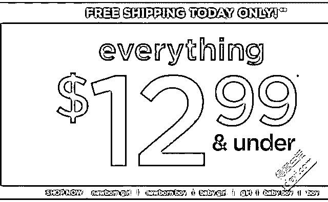

**1、**目前活跃在企鹅群，非常庞大，已经有自建网站，名字就不要暴了，网站是全英文的，服务器也是在国外，东西也是同步官网的，但实际销售是假货。

**2、**拼单，转运，为啥很多人热衷于帮人牵线拼单呢？

以 600 元的耐克运动鞋为例，直邮或单个邮费有点贵，毕竟海淘就是为了安全和划算，所以拼单就可以解决运费问题，拼单人将所有人的单子凑起来，然后就统一”下单”，从莆田进货 100 多元（基本是一模一样），然后透过快递公司一系列操作，最终物流信息显示就是香港寄出。若偶尔组织下拼单的可信，若经常发起那就很大嫌疑。

所以，海淘便宜的非热销品可以随便代购或拼单，贵的，特别是奶粉涉及安全的，最好上亚马逊或者美亚一些正规的网站自己购买。

**总结**，虽然黑幕重重，不过还是有一些人坚持着，即使赚得少，很辛苦，但他们良心不被磨灭，这些人值得我们敬佩。

**结尾**

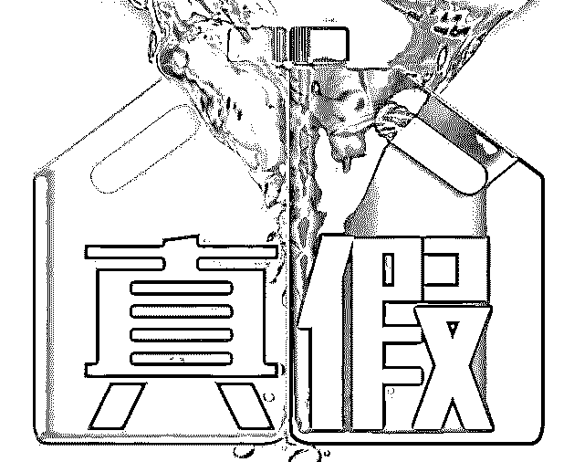

假货商有多么的让人痛恨

我们买了假货、假奶粉

**用了后是生是死，他们就不管了！！**

而快递公司跟造假团伙却

只关心自己获取了多少暴利！！！

最可怕的是我们也弄不清楚我们买了多少假货！

联合造假是多么的猖獗到令人发指

奶粉、葡萄酒、化妆品、食品、服装

和保健品等**你所能想到 99%以上的进口商品**

**都被他们盯上了！！！**

仔细一想要是没有被揭发曝光出来

我们还要吃多少亏上多少当

从前，以为进口产品不会有假

后来出现了假冒伪劣进口货

然后，大家以为海外直邮不会有假

结果出现了物流联合造假

在这样一个时代

**花钱买进口真货竟如此难？**

**可靠和信任竟如何稀少？**

消费者信任大平台

所以就算高价也愿意海淘代购

可是我们最后却只得到一个打脸的黑幕

重建一个安全可信的消费环境

所有人都任重而道远

千言万语！**一定要擦亮眼睛再购物！**

**点击加入【灰产圈】高端社群**