# 独家|互联网黑灰产业链十年风云录（纪实）

> 原文：[`mp.weixin.qq.com/s?__biz=MzIyMDYwMTk0Mw==&mid=2247491758&idx=1&sn=e4510c8ebd99cc631a3153c998f0ada1&chksm=97cb2b96a0bca280ceb46e1229a61fbb5b03f69e5018e1553cafcaef868f22b8019e9598ebf6&scene=27#wechat_redirect`](http://mp.weixin.qq.com/s?__biz=MzIyMDYwMTk0Mw==&mid=2247491758&idx=1&sn=e4510c8ebd99cc631a3153c998f0ada1&chksm=97cb2b96a0bca280ceb46e1229a61fbb5b03f69e5018e1553cafcaef868f22b8019e9598ebf6&scene=27#wechat_redirect)

**点击上方蓝色字体“灰产圈”关注并置顶本公众号**

导语：

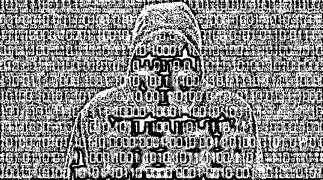

**互联网黑灰产业链十年风云录：**

**互联网高速发展的今天，互联网黑灰产业链也在不断发展，**

**灰产圈作为致力于揭秘黑灰产业链第一媒体，**

**细数那些年我们深度揭秘的互联网黑灰产，**

**带你走进埋藏在互联网最深处的地下产业江湖。**

1.刷单

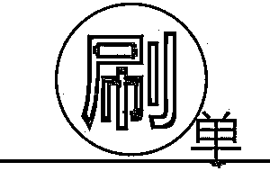

广告公司付款请人假扮顾客，用以假乱真的消费方式提高产品的销量获取好评吸引顾客。分为机器刷、人刷。机器刷指利用群控等设备统一的大量刷单，真人刷单就是广大大学生的兼职工作。

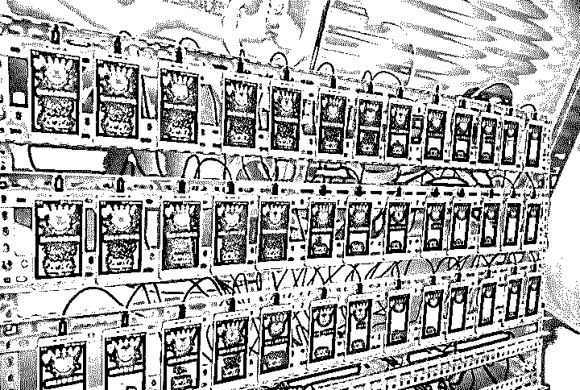

图上为群控设备，群控设备原本是为了企业硬件、营销集中管理为出发点研发的，“器”都是有两面性的。

**灰产圈深度调查：**

[**深度|2017 天猫双十一成交 1682 亿，刷单 800 亿？ 揭秘真实的刷单世界：有人赚了一辆法拉利！**](http://mp.weixin.qq.com/s?__biz=MzIyMDYwMTk0Mw==&mid=2247489054&idx=1&sn=4144474a2229b0fa9c796df43dc45058&chksm=97c8dd26a0bf5430170ebdd82bef40c0ab0165d190daec669f416a6e2eacb13a0d474da267e2&scene=21#wechat_redirect)

2.活动套利

**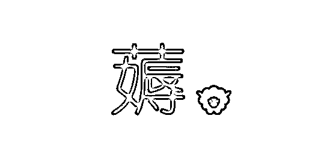**

俗称薅羊毛。2014 年，广州新成立一家互联网金融公司。为了吸引消费者购买自己理财产品，这家公司发行了价值 2 个亿的各类优惠券，被一个 5000 人的“羊毛党”团队抢走。仅仅不到半年的时间，公司宣告倒闭。又例如之前摩拜等共享汽车领红包活动，各种虚拟定位软件多开，摩拜都哭了。PS：虚拟定位软件真是治疗钉钉打卡的神器，不懂得都是良心员工。

**灰产圈深度调查：**

[**深度|薅羊毛黑产攻防实录：“羊毛党”与“攻城狮”之间的博弈游戏**](http://mp.weixin.qq.com/s?__biz=MzIyMDYwMTk0Mw==&mid=2247489704&idx=1&sn=fd723f4a71b42686451bce2641707a67&chksm=97c8d390a0bf5a8659576c4f7fa98f6c43942f61a32de88f9818a6f61f990325ba04964294b9&scene=21#wechat_redirect)

3.推广作弊

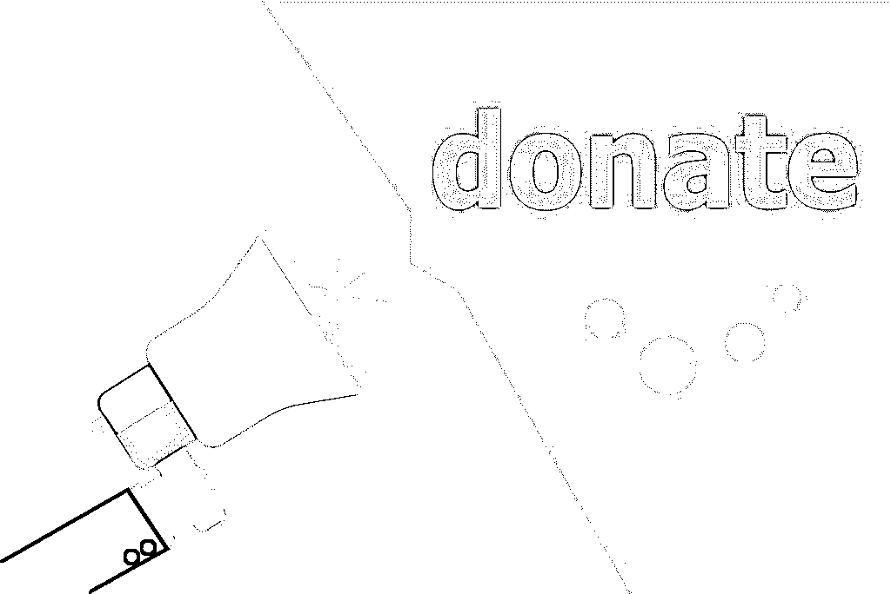

①展示作弊：媒体将多个展示广告置放在同一个广告位，向广告主多收取多个广告的展示费用；

②点击作弊：通过脚本或计算机程序模拟真人用户，又或者雇佣和激励诱导用户进行点击生成大量无用的广告点击，从而吃掉 CPC 广告预算；

③安装/激活作弊：通过测试机或模拟器模拟下载，以及通过移动人工或者技术手段修改设备信息、破解 SDK 方式发送虚拟信息、模拟下载激活等等；

④应用内行为作弊：典型手段是购买欺诈，即用户或玩家在没有付费的情况下得到内容或产品，导致控制面板及报告收入数据过高；

⑤虚假流量作弊：包括非人为流量，大量注入的激励流量，挟持

⑥流量归因作弊：广告平台将广告主的预算根据最后点击模型非陪给重定向广告，而其中很多用户已经几近转化，造成预算浪费。

**灰产圈深度调查：**

[**刷流量买热搜，揭秘演艺圈“流量担当”天价片酬背后的灰色流量产业链（深度长文）**](http://mp.weixin.qq.com/s?__biz=MzIyMDYwMTk0Mw==&mid=2247490371&idx=1&sn=5cbba76c2759433f725610506551feec&chksm=97c8d07ba0bf596d4e944906a7ba1134d1d75a2cf5e5c2c01c7bdf717b2bddb900d4086aaeaa&scene=21#wechat_redirect)

4.伪造激活

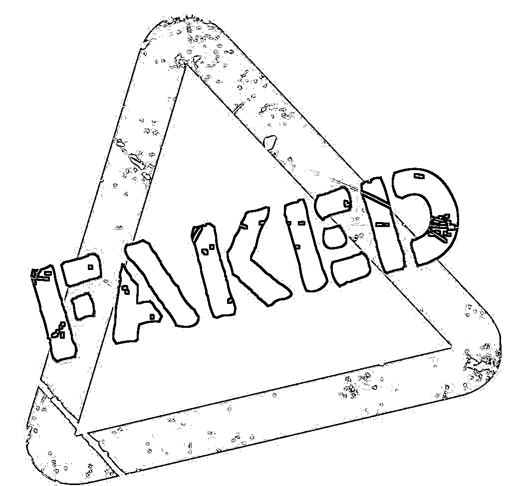

常见手段有与点击一致的测试机或模拟器模拟下载,还有像通过移动人工或者技术手段修改设备信息、破解 SDK 方式发送虚拟信息、模拟下载激活等等。

**灰产圈深度调查：**

[**揭秘网络黑灰产业:比霾可恶不经意间“掠夺”钱财**](http://mp.weixin.qq.com/s?__biz=MzIyMDYwMTk0Mw==&mid=2247483793&idx=1&sn=4732f8e15dc6b462380ec332225a995a&chksm=97c8caa9a0bf43bfd9e4b8db2c97e002f12fb72cd9646dc18a0d2ba31921c96d0dcd96b8a1ea&scene=21#wechat_redirect)

5.账户盗号

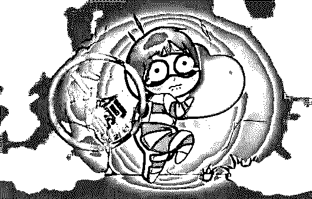

各大企业的服务器网站经常性被黑客攻击，例如去哪儿网，如家酒店等。不仅造成客户信息泄露，而且降低用户体验与忠诚度，给企业带来不可估量的损失。

**灰产圈深度调查：**

[**深度|在黑市里，苹果 iPhone 是这样被解锁的：解密苹果“被盗洗白”的地下产业链，暗无天日，深不见底！**](http://mp.weixin.qq.com/s?__biz=MzIyMDYwMTk0Mw==&mid=2247488772&idx=1&sn=887a6b98e233cb6d5e54677547261f91&chksm=97c8de3ca0bf572a04809ce9511c4993cfabcf768afb8d4889622ead568ebc951055bd49cd00&scene=21#wechat_redirect)

6.恶意注册

注册机器人注册大量账号，网站出现众多“垃圾”账号。导致网站评论区域出现水军、色情、广告，在热门内容中发布非法信息。

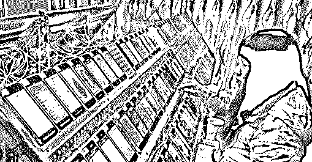

**水军刷榜、灌水**

**灰产圈深度调查：**

[**灰产哥|解密滴滴代注册的灰色产业链**](http://mp.weixin.qq.com/s?__biz=MzIyMDYwMTk0Mw==&mid=2247487540&idx=4&sn=49dfd693242bc1da5731c88237f394b9&chksm=97c8db0ca0bf521a7f3baccf92db675a13d60be7731f4509c128ac36ff317b0efef7bccec951&scene=21#wechat_redirect)

7.撞库攻击

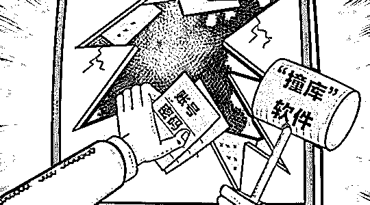

黑客通过筹集互联网已泄露的用户和密码信息，已大量的用户数量为基础。生成对应的字典表,利用用户相同的注册习惯尝试批量登陆其他网站后,得到一系列可以登录的用户。京东、12306 网站的用户信息也曾被通过撞库攻击被不法分子获得。

**灰产圈深度调查：**

[**游戏盗号黑色产业链：黑客掌握千万条账号信息**](http://mp.weixin.qq.com/s?__biz=MzIyMDYwMTk0Mw==&mid=2247483696&idx=4&sn=2284cd278de3f88ecb9d75b5cdb1aea0&chksm=97c8ca08a0bf431e2a63c5dc85e88cac7b1855713e1e2942dce5d9d1404983c6909fc60cd24b&scene=21#wechat_redirect)

8.恶意占座

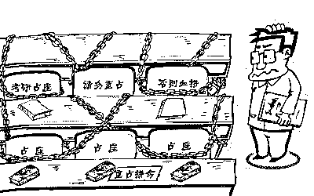

恶意占座是航空公司、票务公司等公司普遍面临的风险问题。自有平台和测试网站、代理公司的第三方接口上以及整个业务流程中存在漏洞，网络黑色产业从业者能瞬间抢走官方的低价票，并他用过加价出售给旅客来谋取暴力。

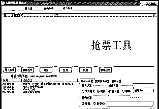

**抢票工具，黄牛也在进步**

**灰产圈深度调查：**

[**深度|揭秘互联网黑灰产业链之"黄牛软件"江湖：20 岁的黑客老枪与代理小江、花姐的故事**](http://mp.weixin.qq.com/s?__biz=MzIyMDYwMTk0Mw==&mid=2247489866&idx=1&sn=83d7d6a0d3e0c121fea83de1d8262b52&chksm=97c8d272a0bf5b649d0410b9b79def031896e942a88d870760c81f0a605f1b27c1990d0a4030&scene=21#wechat_redirect)

9.恶意代码

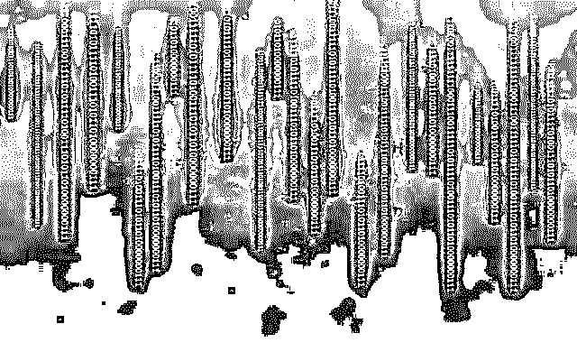

恶意代码是一种程序，它通过把代码在不被察觉的情况下镶嵌到另一段程序中，从而达到破坏被感染电脑数据、运行具有入侵性或破坏性的程序、破坏被感染电脑数据的安全性和完整性的目的。去年比特币币值飙升，有个小老板买了个二手的冷钱包（硬件），被上家植入了恶意代码，所有比特币被无情盗取。

**灰产圈深度调查：**

[**深度|币安网与黑客的史诗大战：差点被盗几亿元，场外做空比特币又获利几十亿！**](http://mp.weixin.qq.com/s?__biz=MzIyMDYwMTk0Mw==&mid=2247490809&idx=1&sn=ef29c8706a01a98c314bbf528465a328&chksm=97c8d7c1a0bf5ed799e12c8d1f2b18e8e2183cc0d2dc05ff9fc8c36ee8e83602a8f38cd42468&scene=21#wechat_redirect)

10.竞品恶意爬虫

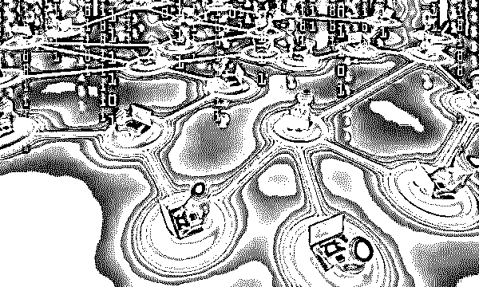

①核心文本被爬：网站的核心文本可能在几小时甚至几分钟内就被恶意爬虫抓取并悄无声息的复制到别的网站。核心内容被复制会极大影响网站和网页本身在搜索引擎上的排名，低排名会导致访问量降低和销量、广告收益降低的恶性循环。

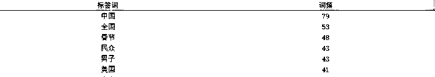

②商品价格被爬：比如某 APP 上线新的租车服务前，会爬取所有竞品 APP 中的车型详情及定价策略，为新服务上线打下价格优势。电商产品上线或者打造爆款时，爬取竞品价格、成交量的信息，针对性的指定价格策略。

③数据泄露：截至 2017 年 6 月,全球发生了 2227 起数据泄露事件,黑客从中窃取了 60 亿条。数据泄露使美国塔吉特公司、日本索尼公司等全球知名企业普遍遭遇损失。企业能否保护好自己的商业信息，决定一个企业的生存与发展。

**灰产圈深度调查：**

[**深度：信息买卖黑链：淘宝 25 页和京东 3 年数据仅需 1 元，揭秘你的信息是如何被黑市买卖的。**](http://mp.weixin.qq.com/s?__biz=MzIyMDYwMTk0Mw==&mid=2247489263&idx=1&sn=e1baf7a32570e65968fd8ab3bfee5649&chksm=97c8ddd7a0bf54c151b62d46024846d2eb1e6b07c55d69bc46d515284d275c858aefbc128be4&scene=21#wechat_redirect)

11.交易欺诈

**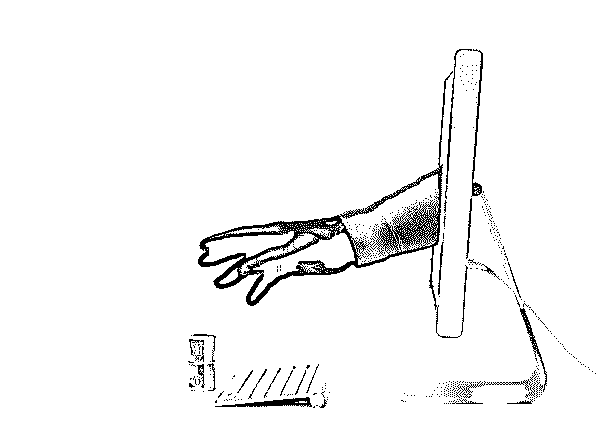**

金融账户持通过利用系统或者账户卡的漏洞空子进行洗钱套现行为等违规行为，来达到经济上的收益。

**灰产圈深度调查：**

[**日赚万元？你玩的微交易实际是金融骗局，速看！**](http://mp.weixin.qq.com/s?__biz=MzIyMDYwMTk0Mw==&mid=2247484574&idx=5&sn=61ee83fa6755b371976904a68c3bc165&chksm=97c8cfa6a0bf46b0bb559135d1a80f1e9420ea8129905a04bb1ad521ca80636226ff903702b0&scene=21#wechat_redirect)

12.盗卡支付

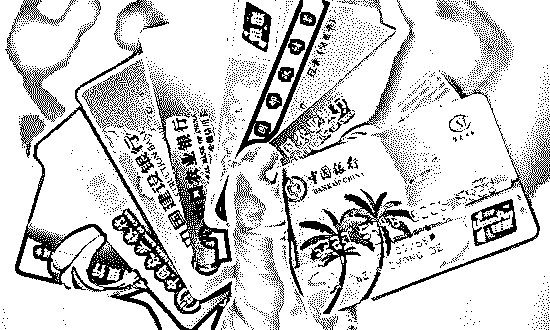

不法分子利用各种渠道窃取信用卡信息，进行伪造卡作案。沉默的支付账户突然发生一笔小额支付，成功后随后若干次等额进行支付操作。此类行为往往具有高风险性，欺诈者在盗卡成功后进行初次激活，在进行小额尝试成功后进而进行批量的资金转移。

**灰产圈深度调查：**

[**银行卡被神秘复制 揭秘背后黑色产业链**](http://mp.weixin.qq.com/s?__biz=MzIyMDYwMTk0Mw==&mid=2247486812&idx=1&sn=693737b68e53bff0ffda665480a64210&chksm=97c8c664a0bf4f7250984a2a434863bf5649bfdefc3d417d0493f7d0478dc866d50a2554d64b&scene=21#wechat_redirect)

13.猫池攻击

商会把一些卡放到猫池（虚拟的手机）的设备上，该设备可以插多张卡。设备连接到电脑可以直接读取短信、发送短信，从而实现薅羊毛的行为

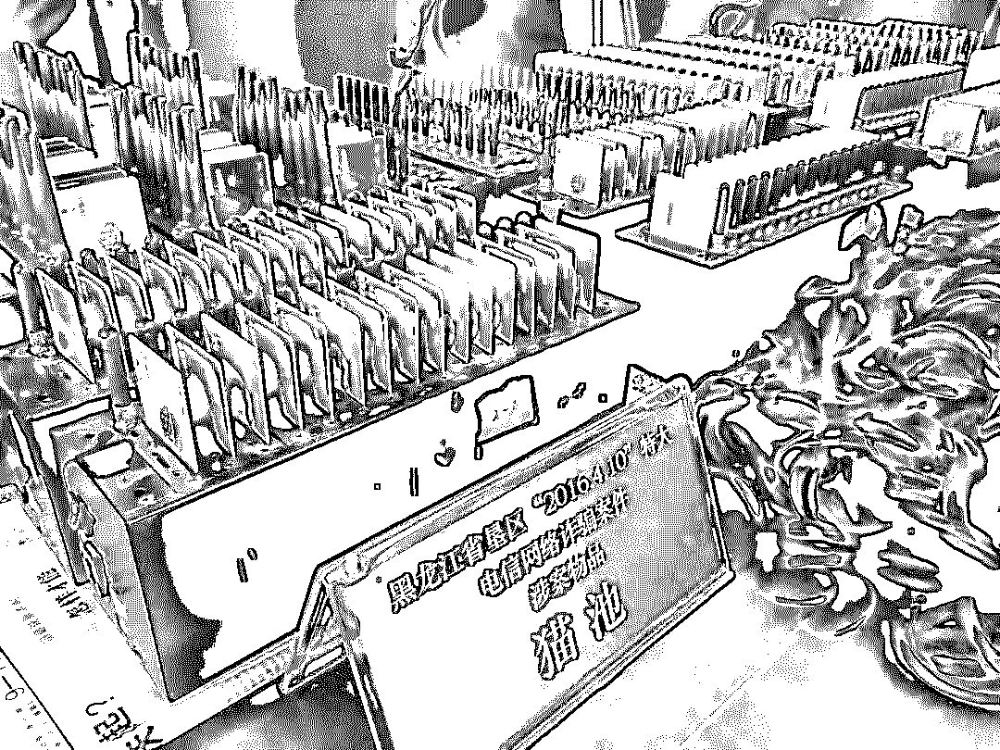

**灰产圈深度调查：**

[**银**](http://mp.weixin.qq.com/s?__biz=MzIyMDYwMTk0Mw==&mid=2247486812&idx=1&sn=693737b68e53bff0ffda665480a64210&chksm=97c8c664a0bf4f7250984a2a434863bf5649bfdefc3d417d0493f7d0478dc866d50a2554d64b&scene=21#wechat_redirect)[**黑产大数据：手机黑卡调查**](http://mp.weixin.qq.com/s?__biz=MzIyMDYwMTk0Mw==&mid=2247486704&idx=1&sn=229ee529ea0a4af176cff633fa7f7926&chksm=97c8c7c8a0bf4ede306c5e82e330f0ea6b4ed228511e7350f7a1ce99bc70e58e678d3cb997b4&scene=21#wechat_redirect)

14.恶意调用

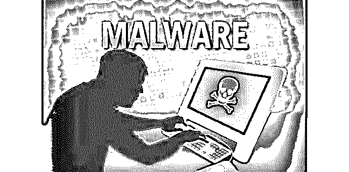

在企业的某些新功能模块上线之后，出现短信接口被恶意访问调用的情况，增加企业短信服务费，影响企业服务器的带宽与正常请求等。

**灰产圈深度调查：**

[**灰产哥|解密 DDoS 黑产全链条**](http://mp.weixin.qq.com/s?__biz=MzIyMDYwMTk0Mw==&mid=2247488171&idx=2&sn=5786fe819f796239a7ddfdb447434209&chksm=97c8d993a0bf50859b7497a05657176fbbd1355f3895a4eed92b32d01668f6445f916b43b78a&scene=21#wechat_redirect)

结尾：

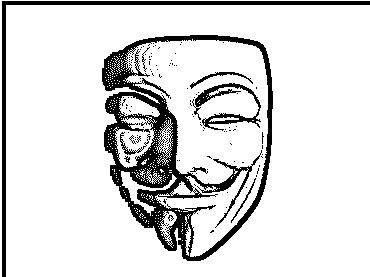

**以上发布的只是灰产圈调查揭秘的其中一小部分，我们的路还有很长，等待我们挖掘探索的还有很多，请跟随我们的步伐，一起去探寻互联网的未知世界！**

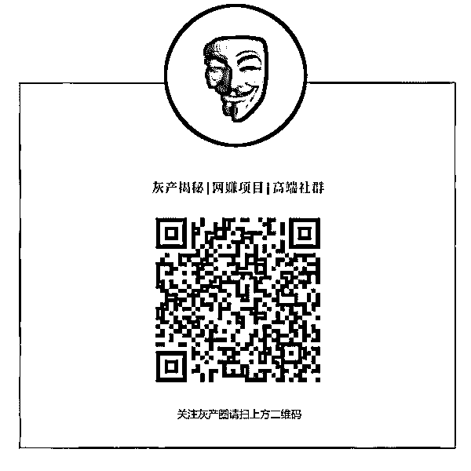

**点击加入【灰产圈】高端社群**