# 滴滴“三宗罪"！

> 原文：[`mp.weixin.qq.com/s?__biz=MzIyMDYwMTk0Mw==&mid=2247491727&idx=1&sn=0a352186e6607544525718b68e6773a1&chksm=97cb2bb7a0bca2a130d942d418f2e9148aafb8c6e15273a742c8c2112e3e117f873a19b274fd&scene=27#wechat_redirect`](http://mp.weixin.qq.com/s?__biz=MzIyMDYwMTk0Mw==&mid=2247491727&idx=1&sn=0a352186e6607544525718b68e6773a1&chksm=97cb2bb7a0bca2a130d942d418f2e9148aafb8c6e15273a742c8c2112e3e117f873a19b274fd&scene=27#wechat_redirect)

**点击上方蓝色字体“灰产圈”关注并置顶本公众号**

导语：

> **关于人性的恶与善，在利益的碰撞中，就会无限放大。**

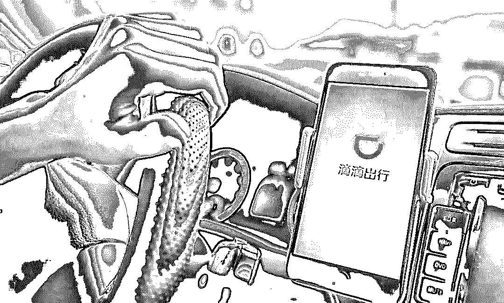

近日，河南郑州发生的空姐乘坐滴滴顺风车遇事一案，让人们对滴滴出行的安全性有了一个新的认识。

虽然这件事情过去一周多时间，而且嫌疑人已经找到并确认身份，下图是平安郑州的官微发布的通告：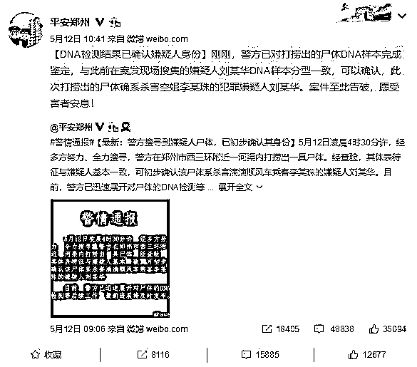

事件主角这位空姐，年仅 21 岁就失去了宝贵的生命。

21 岁正好是人生刚刚开始的青春年华，没想到就这么陨落了，人心究竟恶毒到哪种程度，才会如此残酷的对待一条年轻的生命，希望天堂能够还给她一份迟到的宁静让她忘记这辈子的所有伤痛吧。

就此事件我们通过深入调查深挖滴滴背后不为人知的灰色产业链。

一.滴滴最严实名认证形同虚设

该事件发生后，滴滴顺风车的安全性更是让各界都对此抱有怀疑。

滴滴顺风车司机的认证一直号称“史上最严”，既然是史上最严，为何隔三差五的出现司机打人、猥亵等恶性新闻？

如今更是有乘客因此丧命。

**滴滴官方宣传视频：《中国式安全》共五支，分别对应滴滴五大安全科技。**

[`v.qq.com/iframe/preview.html?vid=n0504tc6bug&width=500&height=375&auto=0`](https://v.qq.com/iframe/preview.html?vid=n0504tc6bug&width=500&height=375&auto=0)

现在看来这个宣传片简直是打脸的节奏，滴滴真的安全嘛？

因此，各界对滴滴顺风车司机认证存的严格程度提出质疑，不然，为什么出事情的总是滴滴，而嘀嗒打车、美团打车出现此类事件却几乎没有？

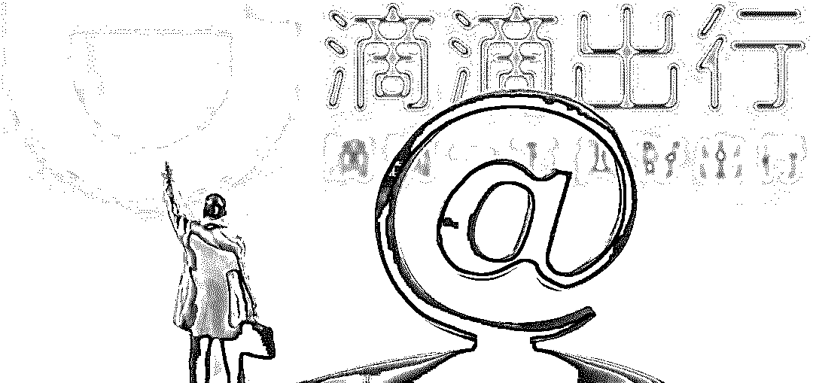

先别急着责怪人们一直把视线集中在滴滴身上。仔细想想，谁让你是出行第一巨头呢，作为出行领域的领头羊，在出风头的同时责任同样随之而来。

社会上当个老大都会被小弟时刻仰望着，如果滴滴不能承担人们的关注，那还是别当什么巨头，趁早让位，美团打车、嘀嗒打车排着队等着上位呢。

因此，灰产圈分析认为滴滴顺风车司机的认证存在问题，于是，经过多方调查以及知情者爆料，灰产圈挖出了一条以滴滴顺风车司机认证为生的黑色产业链。

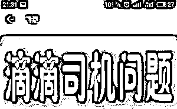

5 月 12 日，灰产圈通过“朋友”介绍，加了微信名为“飞某”的好友，“朋友”表示“飞某”在这个领域很厉害，失败率低，很容易通过认证。

加完好友后，“飞某”主动问是不是顺风车司机认证，随后就抛出几个问题，一看就是常常接到此类订单，问题都是关键点，一句废话也不多说。看来，无论在哪个行业，大神都是有脾气的。

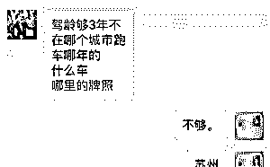

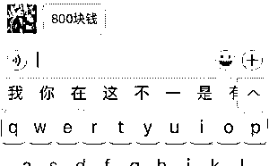

灰产圈随意杜撰几个信息，

> “驾龄不够三年”（滴滴顺风车司机认证驾龄须满三年），
> 
> “苏州”（跑顺风车城市），
> 
> “车龄 5 年”（认证有车龄要求），
> 
> “苏北牌照”。

在得知这些基本信息后，“飞某”没有说任何废话，直接给出价格：“800 块”！意思是，给他转 800 块钱，这件事就算是成了，只需要等消息就好，并表示，认证时间不会很长。

此前，因为滴滴顺风车司机骚扰、猥亵乘客报道越来越频繁，用户对于滴滴顺风车司机的素质颇有怨言。

因此，滴滴对顺风车司机认证规则有所修改，并借此打击掉一批虚假认证的滴滴车司机，

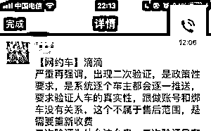

顺风车司机认证难度有所上升。

俗话说，上有政策下有对策，滴滴对顺风车司机认证难度上升后，黑产中对此有相应的解决办法，“飞某”的朋友圈发文表示“自己能够摆平，需要认真的加好友”。

同时，“飞某”在朋友圈发文表示，“二次认证是滴滴政策导致的，审查较为严格，所以费用会贵一些”。

4 月 23 日，“飞某”发朋友圈，“驾龄不满三年，原驾驶证注册”；“超龄车，不做任何改动，原车牌注册”；“以前超龄车改过车牌的都可以改回原车牌”；上述这些操作都可以通过认证。

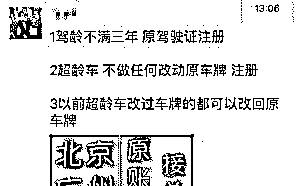

5 月 1 日，“飞某”发朋友圈，一位司机“驾龄不够+外地牌照”竟然成功改成京牌，并且注册成功了。

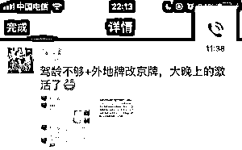

从这两条朋友圈可以发现，滴滴的规则形同虚设，驾龄不够可以注册，车龄超标可以注册，外地牌照可以注册，哪怕是这些条件都不够，同样还是可以注册。

滴滴顺风车司机认证号称“史上最严”，结果，不合格的司机通过黑产一样可以顺利接单。说白了，滴滴的认证只是对老实人有效，而黑产明显不在范围之内。

5 月 8 日，“飞某”发朋友圈，称驾龄未满三年的需要的赶紧注册，滴滴马上要关闭这个口子，以后有钱也弄不了。

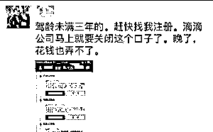

5 月 12 日，“飞某”发朋友圈，受到郑州空姐事件的影响，滴滴开始对平台上的顺风车司机认证再次进行审查，

而黑产同样有着套路：通过不点击收车；将手机号码换成司机实名的；不上传头像；不异地接单；不取消订单等方法，最大程度上避免被滴滴清除。

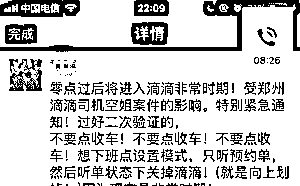

截至到现在为止：部分提供滴滴灰色服务的从业者任然活跃于微信，下图截取了部分提供滴滴灰色服务的供应商朋友圈。

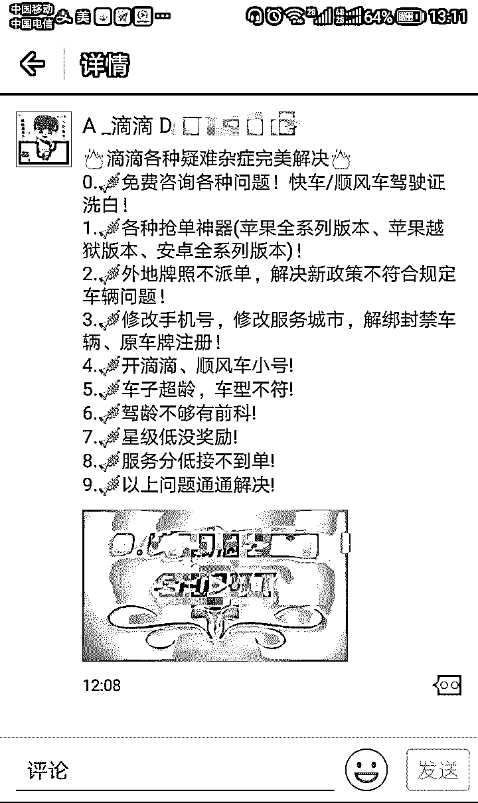

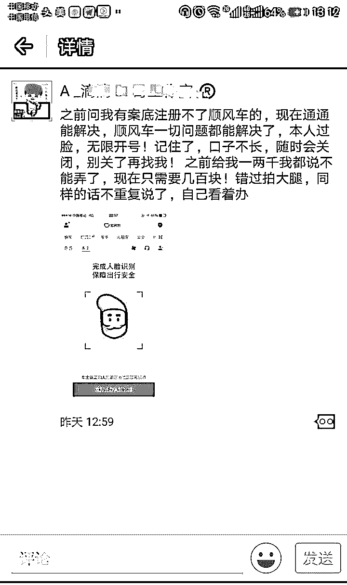

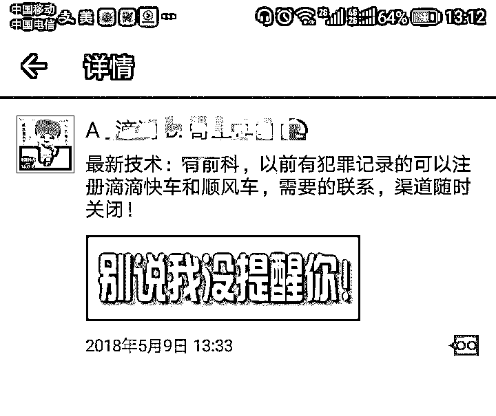

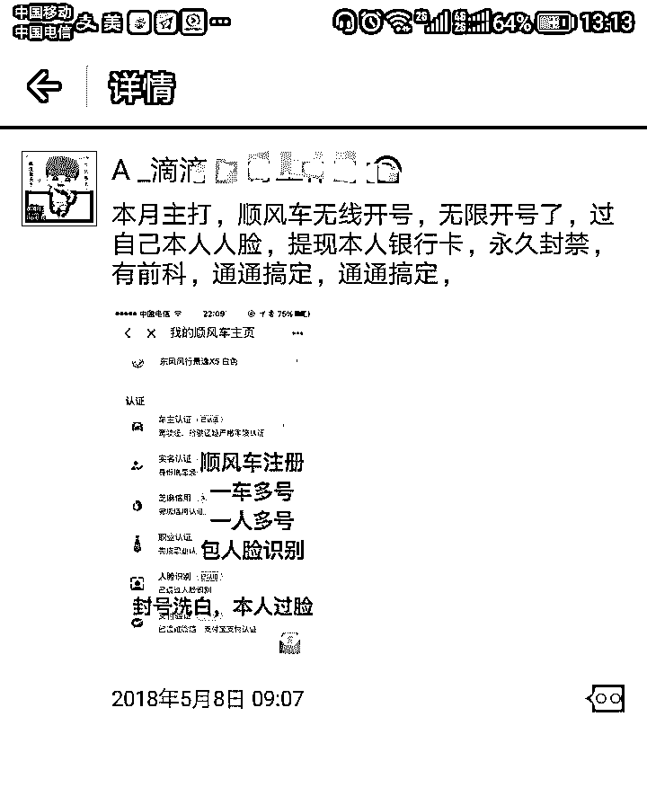

就此我们认定 滴滴的实名认证存在很大漏洞。二.滴滴代叫服务灰色产业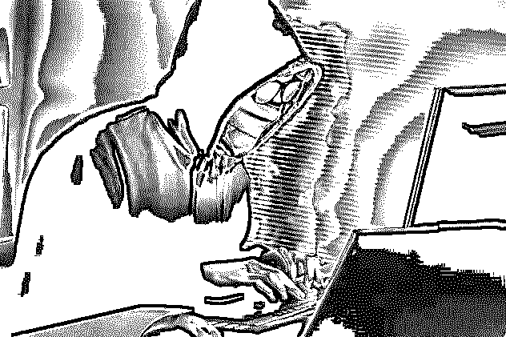

**注：以下内容为真实发生，但并非作者亲身经历**

很多人都不知道滴滴打车行业内有一条灰色产业链——滴滴代叫服务。

与其说是服务，不如说是泯灭人性的卑劣的薅羊毛手段。

之前网络上有人曝光过这个产业链，但并没有引起重视：

> 有这么一群人，打着“滴滴优惠券”的名头，你打完车，先不付款，然后把电话号码发给他，他就能帮你减去一半的价格。
> 
> 其实他们是跑空单，既骗司机的钱，也骗乘客的钱，两边通吃。
> 
> ——镇守海

为了让这个坑害司机的灰产曝光，我们深入这个叫滴滴代叫的行业内“拜师学艺”，并采访了几位司机。

**① 不知其中猫腻的乘客成了帮凶**

我有个朋友，做网赚行业。

偶然间我翻看到微信好友的朋友圈，看到他在朋友圈里发滴滴代叫，说是有优惠券，半折打车，全国接单之类的。

问他：这个怎么赚钱？

他一句敷衍：我赚个差价。

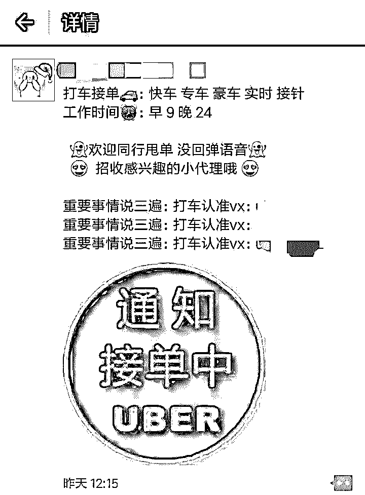

南京的地铁特别挤，尤其是 3 号线属于地狱级别的，有次我从南京站到浦口，天热人多心烦，高铁站又不方便打车，我就想起了那个做滴滴代叫的同学。

谁不爱捡点小便宜呢。

一问比正常叫车便宜十多块钱。代叫用他的手机号帮我下单并且用了呼叫转移，结果，赶来接我的是一出租车。

路远，半个多小时还没到学校，司机提到要下车前付款这件事。

就问代叫什么时候付款，他说是公司晚上六点统一支付，是春雪制药。然后还打电话跟司机解释了一遍。

我瞬间尴尬，这不是假公济私吗？这不是假报销差旅费吗？我作孽。但是，已经在半路。

司机大叔还是有点不放心，就留了我的手机号码，说：我不是不相信你们学生。

那时的我还相信世间有起码的道德基础。

话匣子一开就没个完了。大叔开始说他开了 10 多公里空车接我的单，中午还没吃饭。他最不喜欢当别人鸽子却总是被人跑单… 有个 70 块车费的一个月了都没还…  说他当兵的事…

然后两天过去了。

司机打电话说他没有收到车款！我找那个同学，不知道哪来的优越感，他口口声声说不是坑我：

“全中国的代叫都是这样的啊！你干什么要留电话啊！想要这社会好就不要叫代叫啊！”

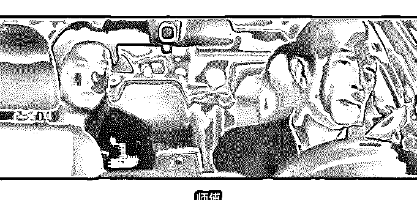

这下我才恍然醒悟，所谓的滴滴代叫就是这种见不得人的套路。

他注册无数个微信号来帮你叫车，逃完一单丢弃一个号，赚着黑心钱，等司机回过神来他早就逃之夭夭了。

无限次叫车却不付款，乘客叫的“便宜车”，全由司机埋单。

所谓的公司统一打款不过是空头支票。

而太多不清楚其中猫腻的人，无意之中在为虎作伥。

**②饱受被坐霸王车支配的恐惧 滴滴司机有债无处讨**

有不少人说外卖小哥工作很艰辛，我想滴滴司机也是一样。

反正我遇到的滴滴司机多数都挺不容易，就拿上面说到的那个司机大叔来说，因为后来给他转车费，加了他的微信。

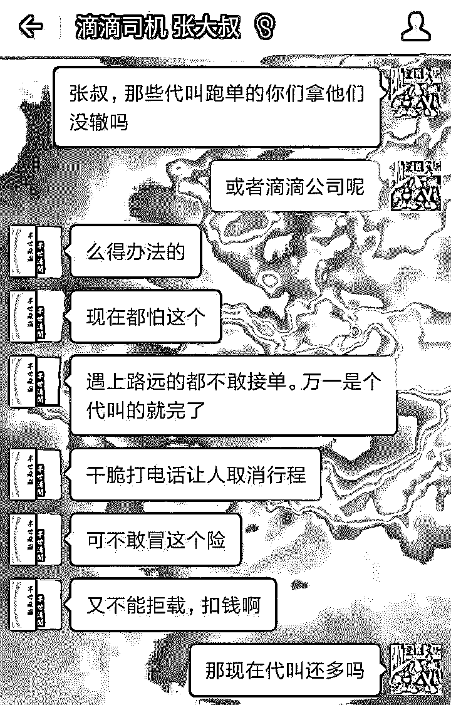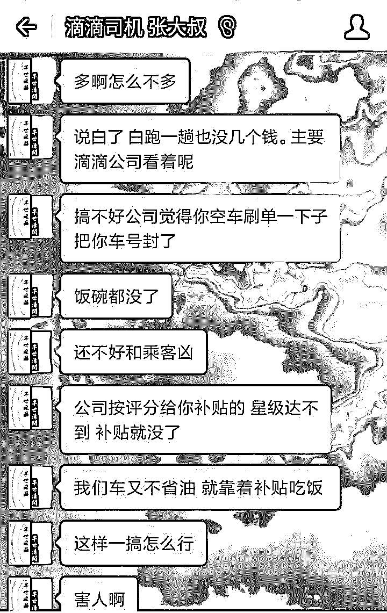

滴滴司机们被骗的多了，难免会矫枉过正，因为互相的信任都被透支了。

但凡接到路程远，甚至是那种一趟要千儿八百的顺风车的单子，都会下意识的条件反射，生怕你是找的代叫。

代叫们很贪婪，先坐一趟霸王车，再投诉你拒载，滴滴公司又会给他一笔赔偿费。

先骗买单的乘客，再骗老实的滴滴司机，最后还不忘耍一把滴滴公司。

最倒霉的是谁？是司机。

司机师傅不但挣不到一分钱，还可能被认为是刷单而被封号。

赔了夫人又折兵，还被赖上了，只能吃哑巴亏。

**③无处不在的滴滴代叫们还在为非作歹**

在淘宝上搜一下，全是这种披着羊皮的狼：

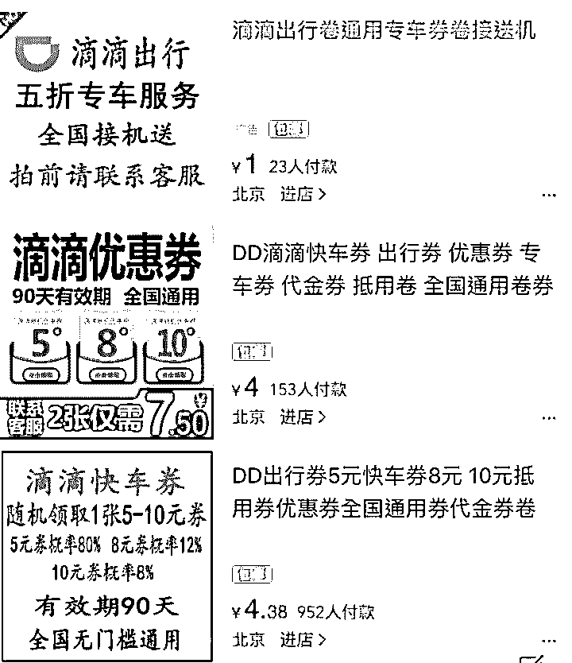

随后，我加了几个“滴滴代叫”的 qq 群，发现做这行的人分工很简单，几人接单，一人操控。

由于在微信绑定的时候，核心障碍在于同一个证件号码填写不得超过五次，他们把这个逃单的方法叫做“技术”。

而那些不懂技术还想赚钱的人，就只能做“代理”。

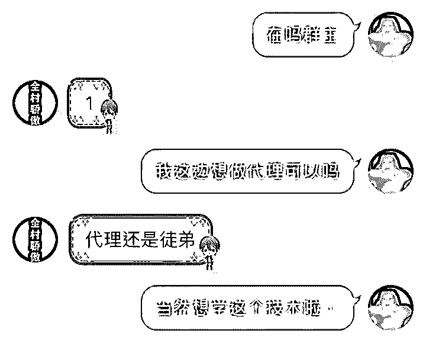

想拜师入伙还得交学费，这样就成功把你拉上船了。

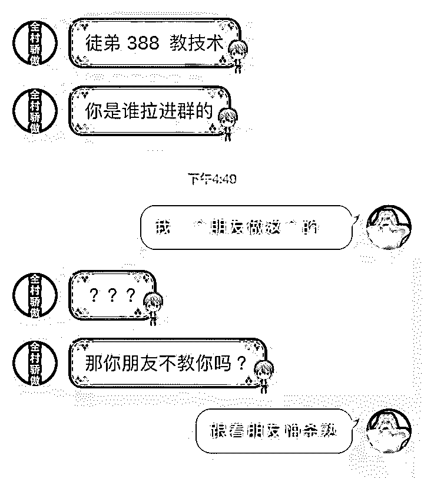

我骗所谓的“师傅”说，我刚入行，想套他的话。

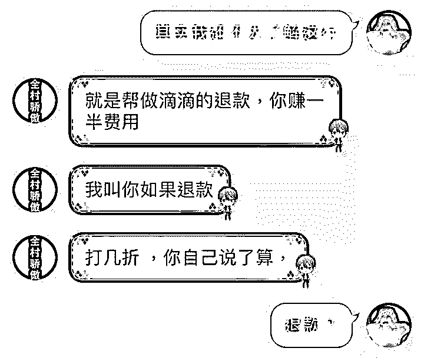

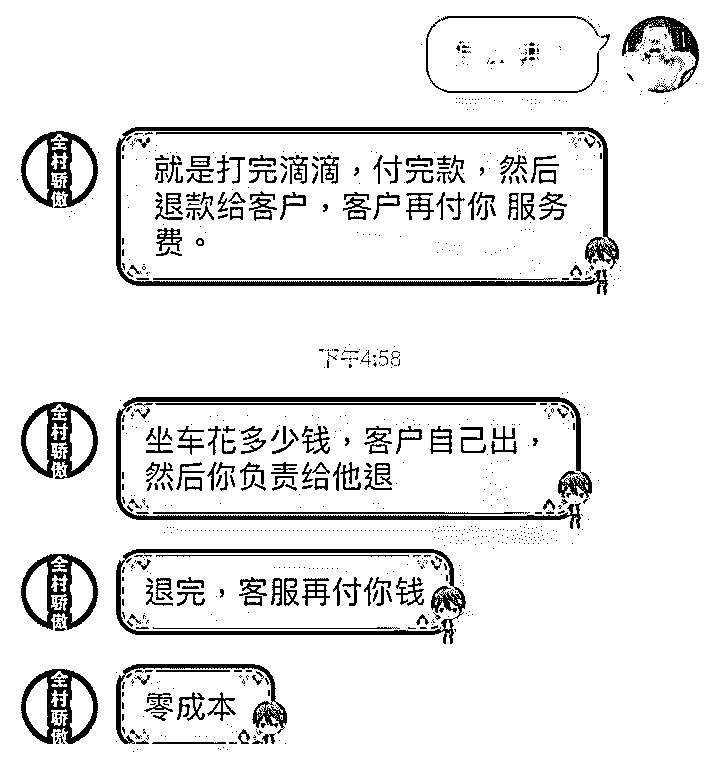

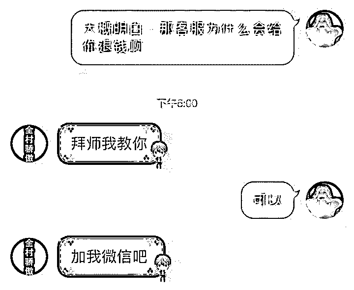

就是这样卑劣的手段，在他们口中成了“高明的技术”，还收徒弟，还冠冕堂皇的说帮滴滴做的退款。

我从来都不认为薅羊毛的投机分子有错。

但没想到他们能损人利己到这个程度。

不劳而获也不是错。

但是如果几粒渣滓而透支了社会的公德，再想补救就回天乏术了。

我看了一眼那个“有技术的师傅”的朋友圈照片，年纪很小，估计就十八九岁。

不知道他会继续做这个多久，但可以肯定的是，只有网约车存在，有这个漏洞，就会有人一直会因此获取暴利。

而像滴滴司机这样的劳苦大众就会继续生活在痛苦之中。

我也不知道这篇文章能不能改变一些东西，可能什么也改变不了，这些人也许仍会吃着滴滴司机的人血馒头，满嘴流出浓浓的黑血，乐此不疲。

但我要说，我看见一处黑暗，就要揭露一处。

那些见不得光的地下的灰产，见到阳光就会像吸血鬼一样，灰飞烟灭。

相信会的。

三.滴滴外挂灰色产业

做过滴滴司机的人可能经历过这样的事情：很长一段时间从来没有抢到过或者被派 到长途单或者两地相隔较远的大单，这并不是系统问题，其实是附近的司机安装了滴滴抢单神器，这个神器可以帮助司机过滤小单专抢大单，这样一天赚到的钱比一些小单子赚的多得多。（下文出租车司机 KK 为化名）

最近，出租车司机 KK 通过朋友的介绍，下载了一款号称“滴滴神器”的抢单插件，安装了该软件之后，系统会帮助王晨抢到实时的订单，并且 kk 还可以随意定位自己的位置，比如把自己的定位调到机场、火车站等用车需求旺盛的交通枢纽，提高自己的接单率。

　　KK 向灰产圈透露，很多出租车司机都在使用“滴滴神器”，在淘宝上就有售卖，三五分钟就能安装上，使用之后基本上不用自己抢单，还可以“挑肥拣瘦”，选择优质单。

　　在灰产圈平日乘坐出租车时了解，大多数的出租车司机都知道 KK 所说的“滴滴神器”的抢单软件，多数司机在尝到抢单软件带来的甜头之后，开始肆无忌惮地抢单。而且，据王晨介绍，这基本成为了“行业内公开的秘密”。

　　被公开售卖的抢单软件

　　根据 KK 提供的信息，灰产圈以“滴滴神器”在淘宝上进行搜索，显示出多达 10 家左右的抢单软件卖家，均号称可以实现“加速抢单”、“抢机场单”、“瞬移到发单地”等功能。

　　灰产圈注意到，这些卖家的销量基本为零，通过与店家聊天发现，实际是店家避开淘宝交易转而通过微信等方式完成交易。

　　灰产圈点开了其中一家店家，根据店小二的提示添加了店主的微信，在店主的朋友圈里新浪科技看到了抢单软件的操作界面与使用办法。

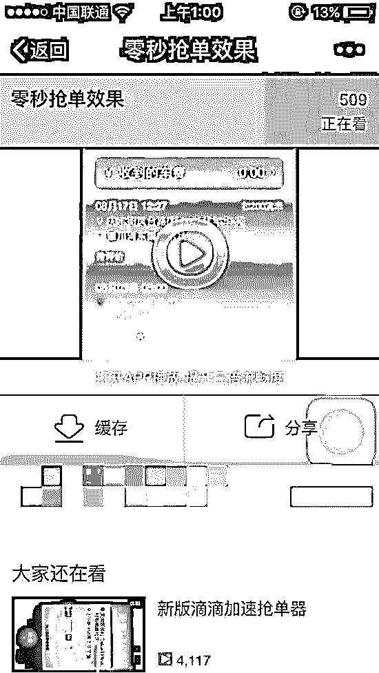

**抢单软件的视频讲解**

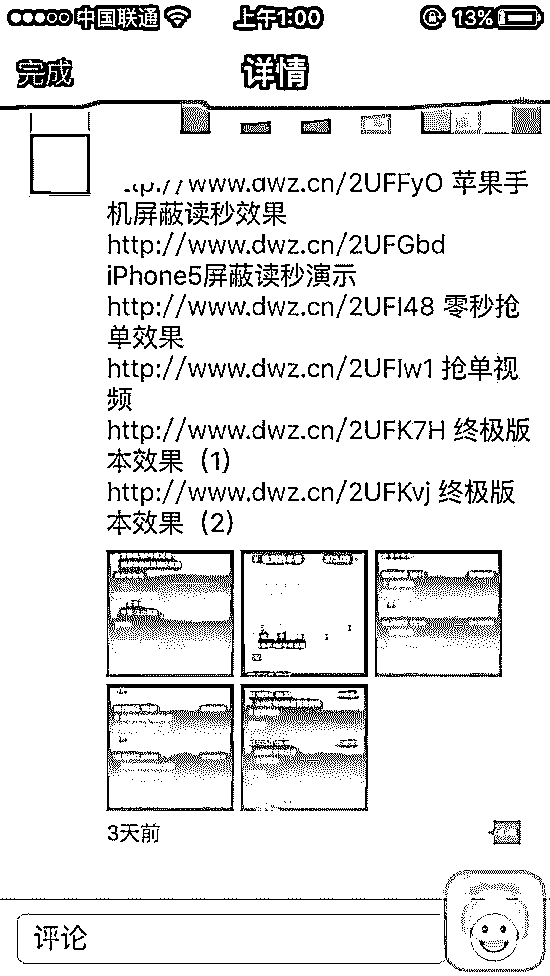**不同版本的抢单软件说明链接**

根据卖家介绍，抢单神器一般包含“屏蔽读秒”、“瞬移抢单”、“自动抢单”、“自定义抢单”等功能，出租车司机只需要在下载抢单软件之后，根据提示选择即可抢单。

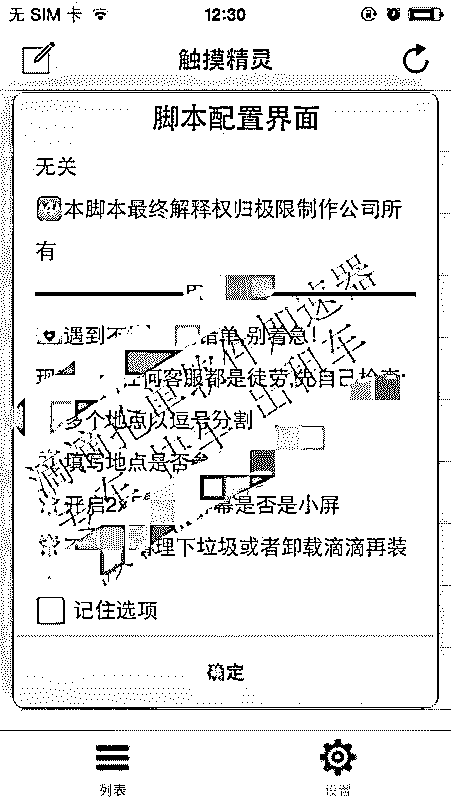

**配置页面**

但是卖家提醒，目前软件仅可以在 ROOT 的安卓机和越狱过的苹果手机上使用。

**定位操作页面**

灰产圈注意到，在朋友圈售卖抢单软件的同时，卖家还同时售卖苹果和酷派大神等手机，以方便买家下载使用软件。

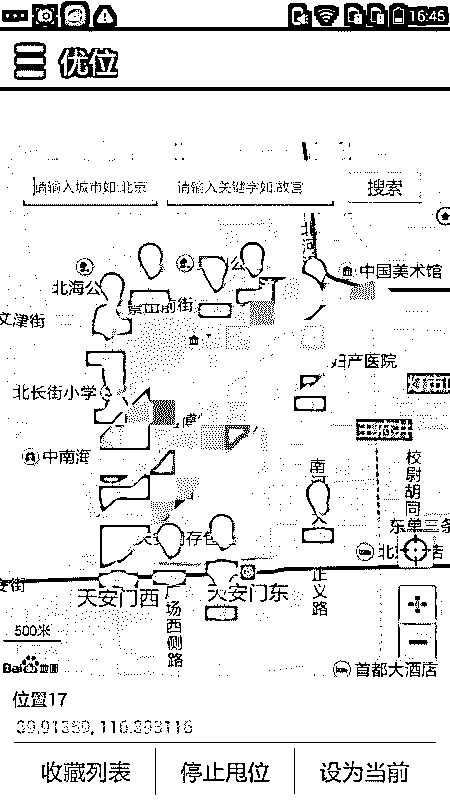**使用界面**

灰产圈以想要购买为理由，要求店家展示其抢单功能，

随后，店家向灰产圈发送了视频展示了其抢单过程。

在视频中，店主以零秒抢单为例，在店主没有任何操作的情况下，插件在订单出现的同时就抢下订单。

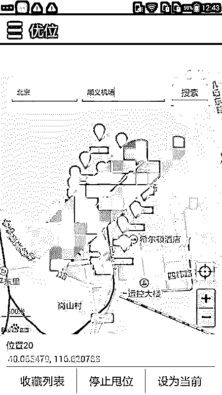**使用界面**

灰产圈了解到，每家店主的日均销量在 20 单左右，以淘宝卖家 10 家计算，每日的订单量大约在 200 单左右。

而淘宝仅以散户为主，更多的批量进货的小商户都是通过电话等方式进行交易。

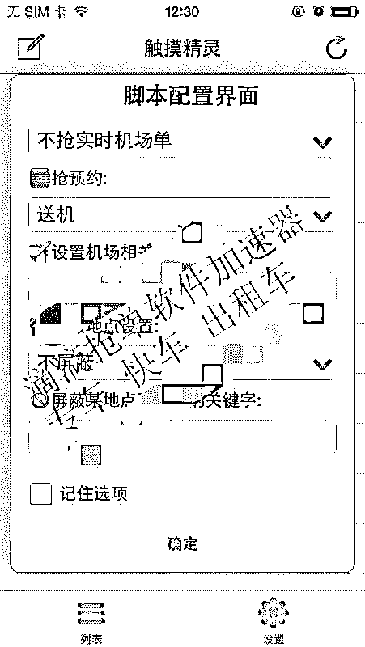

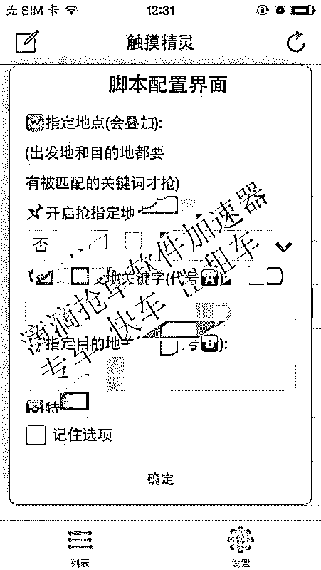

到底“滴滴神器”抢单软件是如何实现的？

一位互联网技术安全人士对灰产圈表示，

抢单神器属于外挂类软件，如同游戏外挂，

它会把程序代码注入到滴滴 App 的进程中，在内存中实时地篡改滴滴 App 的程序逻辑，从而达到绕过客户端限制、自动执行某些操作之类的目的。例如如果滴滴的读秒限制不是在服务端进行限制，而是在客户端进行限制，那么这个外挂就可以屏蔽掉客户端的读秒逻辑。

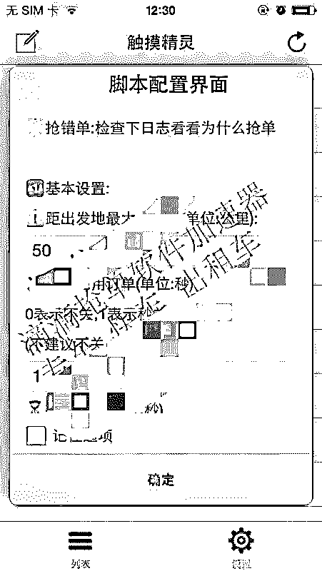

至此我们调查到了这条灰色产业链是如何存在的：

**滴滴外挂制作者——电商平台或者独立网站——购买者**

当滴滴抢单可以开外挂的时候，滴滴司机的不公平竞争就开始了，

这注定是一条不归路！

结尾

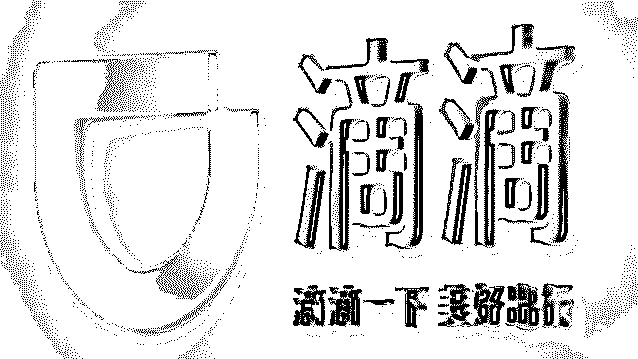

打人、猥亵、性侵、私自扔下乘客、甚至是杀人，滴滴司机的负面新闻从未间断过，滴滴乘客的安全性一直是个大问题。

从黑产“飞某”的朋友圈可以发现，滴滴虽然不断的修改规则，但是黑产却总能找到相关漏洞并以此规避检查。

“飞某”只是链条最外端的执行人员，滴滴司机认证黑产是如何形成的，滴滴司机认证的漏洞是谁发现并加以利用的，这些都还在迷雾之中，灰产圈也将继续深挖滴滴司机黑色产业链，拨开迷雾，将最真实的一面展现给读者。

实际上，滴滴的顺风车平台用户协议里写着**“我们提供的仅是平台注册用户之间的信息交互及匹配服务。”**安全？不存在的。

香烟都起码知道要在盒子上写吸烟有害健康，是因为烟草公司不会为健康做出任何保障。

滴滴如果不打算保障顺风车的乘客安全，那不如在顺风车页面也给个温馨提示**：**

**搭车可能丧命，一切后果自负。**

古语云，吾日三省吾身。

灰产圈也衷心希望滴滴能够加大对系统规则完善检查力度，加大对司机认证的资金投入，不断自我反省，时刻保持警惕。作为出行领域的领头羊，滴滴的功绩不容抹杀；对于领头羊应当担起的责任，滴滴也应一肩承担，当仁不让。

毕竟，出行不是一件小事，人命关天，直达天听！

**延伸阅读：**

[**灰产哥|解密滴滴代注册的灰色产业链**](http://mp.weixin.qq.com/s?__biz=MzIyMDYwMTk0Mw==&mid=2247487540&idx=4&sn=49dfd693242bc1da5731c88237f394b9&chksm=97c8db0ca0bf521a7f3baccf92db675a13d60be7731f4509c128ac36ff317b0efef7bccec951&scene=21#wechat_redirect)

* * *

**【灰产圈】高端社群小程序开通，2018 最值得加入的社群！** 

<mp-miniprogram class="miniprogram_element" data-miniprogram-appid="wx4f706964b979122a" data-miniprogram-path="pages/topics/topics?group_id=881854415822" data-miniprogram-nickname="知识星球" data-miniprogram-avatar="http://mmbiz.qpic.cn/mmbiz_png/kialtkOXGKS7D9hZrmO2jzDqryXXTAlhxSpnrKnHGV65KXzicibOppaPic4dCRxftvabB8Iqswo3OuQEDSxE7NicXBg/0?wx_fmt=png" data-miniprogram-title="【灰产圈】高端社群" data-miniprogram-imageurl="http://mmbiz.qpic.cn/mmbiz_jpg/WWG78hysZ0brJkWoyG2VDIacqgQjkDfp6mLiaoPBJ2SgWZHtRuTw7ia8kpoxntsn7PiaFOQO2U23FW6Iry0gS1GnA/0?wx_fmt=jpeg"></mp-miniprogram>

**点击加入【灰产圈】高端社群**