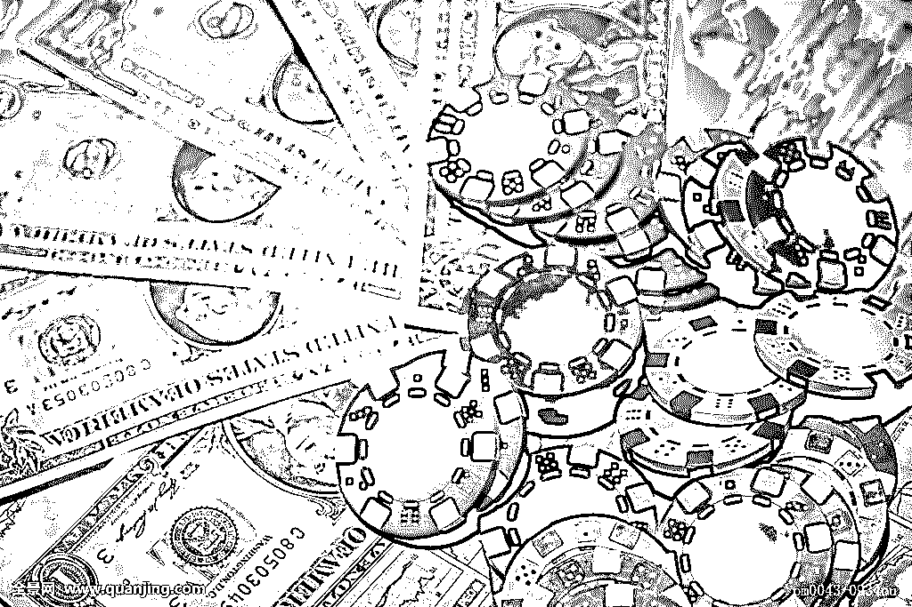

# 一首《凉凉》送给联众：因涉赌 36 人被捕，涉赌资金 3.35 亿元!

> 原文：[`mp.weixin.qq.com/s?__biz=MzIyMDYwMTk0Mw==&mid=2247491646&idx=1&sn=b29e9d409a802564190d865be2ce0ade&chksm=97cb2b06a0bca2101c3fbaa590f0888e586183243d43e34d33d620d811e0c35b0fc93251d42b&scene=27#wechat_redirect`](http://mp.weixin.qq.com/s?__biz=MzIyMDYwMTk0Mw==&mid=2247491646&idx=1&sn=b29e9d409a802564190d865be2ce0ade&chksm=97cb2b06a0bca2101c3fbaa590f0888e586183243d43e34d33d620d811e0c35b0fc93251d42b&scene=27#wechat_redirect)

**点击上方蓝色字体“灰产圈”选择关注并置顶本公众号**


导语：


中国网络游戏玩家超过 5 亿人，网络游戏市场规模全球最大。央视记者经过两个多月的持续追踪调查发现，在网络游戏平台里，一些看上去只是为了娱乐的游戏，却暗藏着一个个看不见赌徒的赌局。赌博参与者利用网络游戏的外衣，通过虚拟货币变现，在游戏中豪赌。


联众涉赌，36 人被抓


“国内棋牌游戏平台老大哥”联众，因利用网游平台开设赌场，再次回到公众视线。

万万没想到，作为“国内棋牌游戏平台老大哥”的联众，会以这样的方式重回公众视线。

> **据公安部日前通报，今年 4 月，公安部指挥河南、北京、广西等地公安机关联合行动，成功侦破北京联众公司棋牌事业部利用网游平台开设赌场案，抓获联众公司执行副总裁秦某、棋牌事业部负责人徐某、大客户部负责人周某及“银商”张某等 36 名犯罪嫌疑人，冻结涉案资金 6500 余万元。**


经初步审查，2010 年以来，联众公司棋牌事业部下属“德州扑克”项目涉赌资金收入累计达 3.35 亿元。


此前央视曝光：平台暗藏赌局


德州扑克类 APP 涉赌并非新鲜事。对部分业内人士来说，联众此次出事不算意外，而是“传闻终于得证”。

上个月，央视曝光了一款名为“扑克圈”的德州扑克 App 经营模式，凭借同时开近 100 个不同级别的房间，它每天可以开 1000 多个房间，形成了近万人共赌的庞大局面。

调查还发现，在这些具有赌博性质的手机应用平台里，存在着各种各样的玩家俱乐部。

这些俱乐部在玩家赌博时，还会收取一定的服务费来盈利，行话叫“抽水”。而一些所谓的玩家俱乐部，仅仅靠着“抽水”就可月入数百万。

而在今年 2 月，央视的另一起调查则以“联众游戏 聚众赌博”八个字为题，矛头直指联众旗下的德州扑克类游戏。报道称：

> **在广西玉林上班的小刘告诉记者，一场游戏一场梦，这就是他自己的亲身经历。不到三年时间，小刘在联众网络游戏里就输掉了 160 万人民币，那是他的全部家产。**
> 
> **小刘：“2014 年至 2017 年 10 月，我在联众平台上一共输了 160 万。主要玩超级星、超级小丑、德州扑克、楚汉德州。”**

**附：央视调查视频：矛头直指联众游戏**

[`v.qq.com/iframe/preview.html?vid=m0546loyx8c&width=500&height=375&auto=0`](https://v.qq.com/iframe/preview.html?vid=m0546loyx8c&width=500&height=375&auto=0)

进入联众大厅游戏页面，可以看到牌类游戏、麻将游戏、棋类游戏等各类专区。

楚汉德州这款游戏，每局时间约 40 秒，但页面上的赌注之大令人惊讶，电脑为楚汉双方发牌，玩家选择一方下注，压中双倍赢回赌注，输赢的道具虚拟游戏币“万能豆”。


当事人小刘说，他玩这些联众游戏目的只有一个就是为了赢钱，但结果是越玩输得越多，越想赢回来输得越惨。


此次涉赌的“德州扑克”，是联众于 2010 年前后推出的一款游戏，但这并非一款简单的线上游戏，联众针对这款平台棋牌游戏还举行了多场线下赛事。

2011 年，联众签约著名扑克牌职业选手邱芳全作为《德州扑克》的代言人；2012 年开始，联众承办了世界扑克巡回赛（WPT）中国站的比赛。


**截自联众游戏官网**


**截图自联众游戏官网**

4 月 19 日，联众游戏曾在官网发布公告称，为积极响应国家号召，净化网络环境，其于近期针对旗下产品展开自查自纠，自觉抵制和清除不良内容。其中，部分德州扑克产品将进行梳理整顿，以维护健康游戏环境。


**截图自联众游戏官网**

5 月 11 日（也就是发文当天），联众游戏随即发表致歉声明：

> **近日，公安机关联合行动中，我司棋牌事业部德州扑克产品线数名员工因涉嫌违法被查。对此，公司深感遗憾和自责。**
> 
> **....**


**截图自联众游戏官网**

灰产圈注意到，目前在联众游戏首页显眼处，游戏的分类里并没有“牌类游戏”。而在子页面更具体的游戏分类中，“牌类游戏”又找不到与“德州扑克”相关的字眼。


**截图自联众游戏官网**


联众涉赌内幕


上文中提到，“联众游戏”吸引玩家聚众赌博，一局赌注可高达万元，并且每局时间 40 秒左右，输赢十几万分分钟的事，多位被采访的玩家，都已负债逾百万，输得倾家荡产。

那联众是如何涉赌的呢？

灰产圈为大家简要概括：

联众牌类游戏中的“筹码”，早年被称作“财富值”，之后更名为“游戏豆”，这东西只能通过现金买产品，产品赠积分获得。

**联众会从玩家赢来的游戏豆中进行抽头，比例为 3%-10%。**

联众虽规定这些“筹码”只能在游戏里流通，不能回兑现金，也禁止玩家私下交易，

但这些棋牌游戏中都存在一个叫“币商”的群体，在游戏中被称为“财神”，玩家可直接在财神那现金购买“筹码”，方便快捷，并且据玩家透露，这些“财神”是被默许的，长期挂在游戏财富榜单前列，很好辨认，也几乎不会被联众封禁。

看来，联众游戏跟现实赌场，只隔一位性感荷官的距离。

而被查的“德州扑克”只是联众 37 款牌类游戏之一。


联众 20 年风云沉浮录


纵观联众 20 年来的风云沉浮，也不免令人唏嘘。

**“年少成名”**

公开资料显示，联众国际成立于 1998 年。这一年，腾讯在深圳成立，次年阿里巴巴在杭州成立，再过一年百度于北京成立。

彼时，马化腾、李彦宏、马云都还是业内不太知名的小辈，而联众创始人鲍岳桥则大名鼎鼎，与求伯君、王江民、简晶、王志东等人同为中国最早成名的一批程序员。

在 2000 年前后，联众世界风靡一时，“北联众、南中游”是当时众多玩家的口头禅。2003 年，联众注册用户达 8000 万，其中会员 100 万，高峰同时在线人数 40 万人。可作比较的是，那一年搜狐的注册用户为 6500 万。


**2001 年，北京地铁内的联众在线游戏灯箱广告（图片来源：视觉中国）**

联众是中国老牌棋牌网站，创始人鲍岳桥是中国互联网最早一批的程序员。

在 2005 年前后，QQ 游戏中心凭借腾讯引流，创造百万同时在线，那时的联众仍然保持 60 万以上的人均在线水平。

这个数字在现在，也能够撑起一个很大互联网公司。

联众早于 BAT 成立，但上市却远远晚于这三家。

2014 年 6 月 30 日，联众终于得以在香港上市。

现在的联众旗下拥有棋牌、麻将、休闲及大型图形游戏，产品线涵盖客户端、网页、移动终端，公司现有员工近 500 人，与最辉煌时，坐拥上亿用户，敢和腾讯叫板的联众，已经逊色不少。

在联众的管理层中，伍国梁职务为副董事长，董事长为“杨庆”。


前文提到的德州扑克，给联众带来了很好的收益，据联众财报显示，2014 年，仅 PC 端的德州扑克贡献收入（1.17 亿元人民币）就占到总收入的 24.6%；2015 年，这一收入增至 1.72 亿元，占到总收入的 22.4%。

2016 年开始，联众国际不再于财报中披露 PC 端德州扑克的收入情况，只公布用户每月活跃用户数（MAU），2015 年至 2017 年，在联众平台上玩德州扑克的活跃玩家从 58.6 万一度增至 82.2 万，却又在去年掉回了 57.8 万。


按照公安部的通报，联众国际自 2010 年起便已涉赌，从时间上看正是其脱离 NHN，重整旗鼓的初期。尽管公司公告将涉赌事件定义为“若干雇员涉嫌从事不合法活动”，

但正如灰产哥所说：

> **“棋牌游戏与赌博之间的界限，薄如片纸，一捅就破。”**


网络赌博“三大坑”




实际上，这样的公司不止联众一家，只是有的还未被查，比如两年前涉赌的闲徕互娱。

2016 年 12 月，A 股公司(300418)称将以 10.2 亿收购闲徕互娱，彼时，闲徕互娱刚成立 8 个月，财报显示营收额就已达到 4.57 亿元，净利润为 2.8 亿元。

闲徕互娱获暴利的模式模式与联众有所不同。平台没有“筹码”，只收取所谓的“房费”，既用户进入游戏房间需交房卡费，3 元一张房卡可玩 8 局，不过其中大多玩家都会私下约好每一分值多少钱，然后再通过微信转账支付。

其中还不乏熟人、陌生人合伙串谋骗赌，外挂作弊软件横生，简直就是完美的赌博工具。

但因其平台不接受投注，也没有现金兑换的筹码，没有实现人民币和虚拟金币的双向兑换，虽有赌博形式，却难以认定其赌博性质，让相关部门无法下手。

而联众也是如此，因为筹码是单向的，难以认定其涉赌，才长存至今，乃至得以上市。但这摊子铺太大，终究会东窗事发。

网络赌博作为违法产业，打着棋牌游戏的称号，编入五花那门的玩法，摇身一变就洗白了，但本质仍是赌博，据大虾了解，网络赌博有三大“坑”。


**第一坑：**

这类游戏后台都设置了暗改功能，无论是彩票类的、棋牌类的，都可以通过后台操控，这跟出老千一个道理，输很正常，就算赢了，也是为了之后让你输得更多。

**第二坑：**

平台虽称游戏中的筹码不能流通，但会找一些“托”，他们手里握有大量筹码，看似常胜将军，专门诱人入大额堵局，有的“托”还身兼现金兑换功能。

**第三坑：**

平台会找理由删除或封禁一些余额数额较大的账号，也就是所谓的被平台“黑”掉。

最后，忍不住透个底，据传，这次相关部门要出重拳了，将出台“棋牌类网络游戏管理”政策，要求各平台立即停止德州类游戏的下载，并于 6 月 1 日前全面终止德州类游戏的运营，联众这波，只是开头……

此外，值得注意的是，4 月 19 日界面曾报道称，文化和旅游部市场司对即将出台的“棋牌类网络游戏管理”政策做出重要提示，要求各平台立即停止德州类游戏的下载，并于 6 月 1 日前全面终止德洲类游戏的运营。与此同时，文化和旅游部也不再受理德州类游戏的备案及变更。

若这一消息最终得到证实，不仅意味着联众及其它以德州为主体收入的游戏平台将受到影响，可能还将波及整个棋牌休闲类游戏的生存和发展。


结尾


```
沧海一声笑 滔滔两岸潮
浮沉随浪只记今朝
苍天笑 纷纷世上潮
谁负谁胜出天知晓
江山笑 烟雨遥
涛浪淘尽 红尘俗世记多娇
清风笑 竟惹寂寥
豪情还剩了 一襟晚照
苍生笑 不再寂寥
豪情仍在痴痴笑笑

一首《沧海一声笑》致敬 即将凉凉的联众游戏！
```


**点击加入【灰产圈】高端社群**