# 真相堪比谍战大片！窃我尖端武器机密间谍落网记！

> 原文：[`mp.weixin.qq.com/s?__biz=MzIyMDYwMTk0Mw==&mid=2247491079&idx=1&sn=6d3bc3f553996e4564030ffef61545fc&chksm=97c8d53fa0bf5c2933d56c2ebd4cfa5c6dd6b6902e73eabe6b54fc7d60290211913f8efba90d&scene=27#wechat_redirect`](http://mp.weixin.qq.com/s?__biz=MzIyMDYwMTk0Mw==&mid=2247491079&idx=1&sn=6d3bc3f553996e4564030ffef61545fc&chksm=97c8d53fa0bf5c2933d56c2ebd4cfa5c6dd6b6902e73eabe6b54fc7d60290211913f8efba90d&scene=27#wechat_redirect)

**点击上方蓝色字体“灰产圈”选择关注并置顶本公众号**

> **导语：**

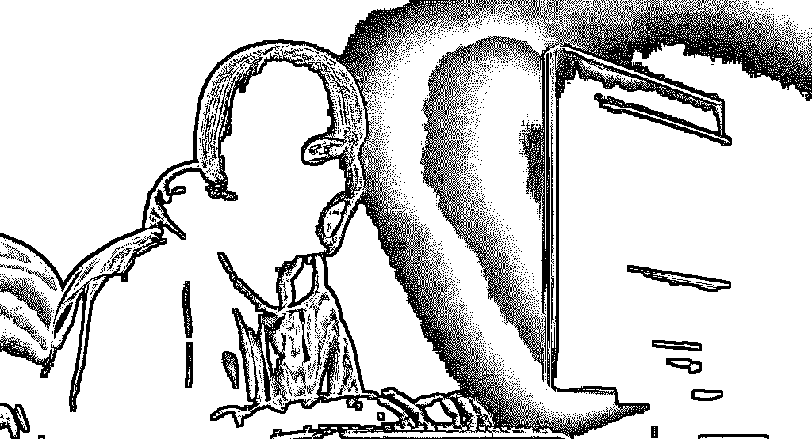

**间谍这个词大家都不陌生，但你也许很难相信，在我们身边就有可能潜伏着窃取国家机密、严重威胁国家安全的间谍人员。**

**在郑州市 ，有这样一个军工专家，出国期间被境外间谍组织策反叛变，长期潜伏在我国军工重要科研领域，把我国尖端武器的核心机密毫无保留地透露给了间谍情报机关！这就意味着，假如发生战争，很有可能会给我国造成极为严重的危害！**

每当夜幕降临，一个神秘的信号就会出现在郑州的上空，自从 2013 年 12 月以来，该信号就从未间断。这个可疑信号的出现，引起了侦察人员的格外关注。

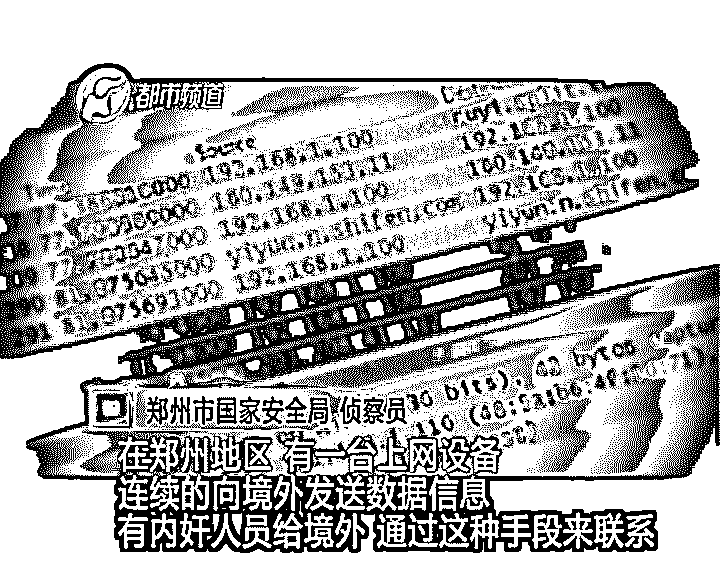

1

**背后的间谍浮出水面，竟是他！**

> 侦察人员立即进行了技术分析，结果令侦察人员十分紧张。这个西方国家的情报机构，实力雄厚，在世界上颇有影响力。那么在郑州，会有谁给该国间谍机构发送数据呢？

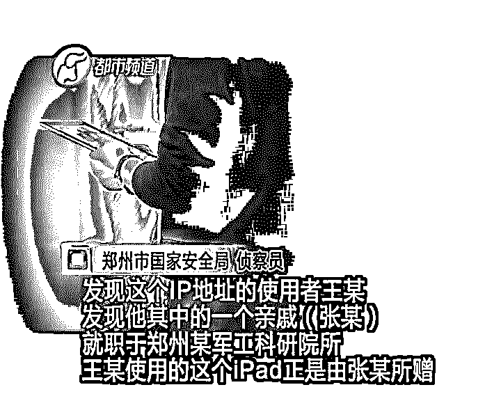

张某的出现令侦察员有些意外，因为无论是张某的工作性质，还是他的职位，都不应该和间谍有所联系。

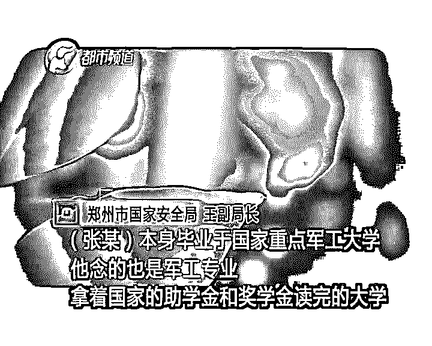

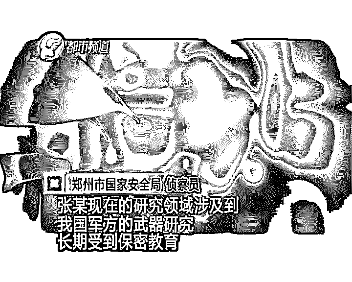

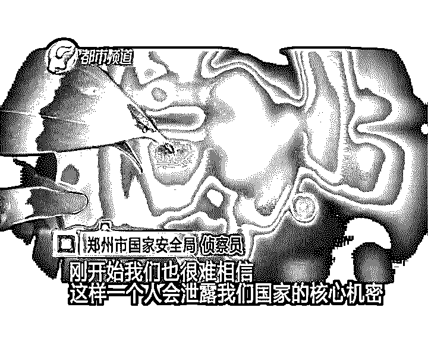

张某手握国家的核心机密，如果他涉嫌间谍犯罪，那么，他的行为给国家造成的损失，将无法估量。郑州市国家安全局立刻行动，对张某展开了更加深入的调查。

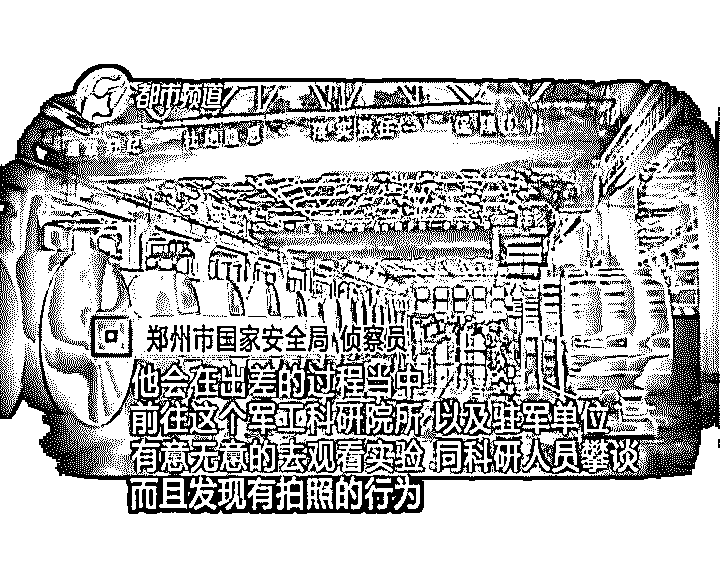

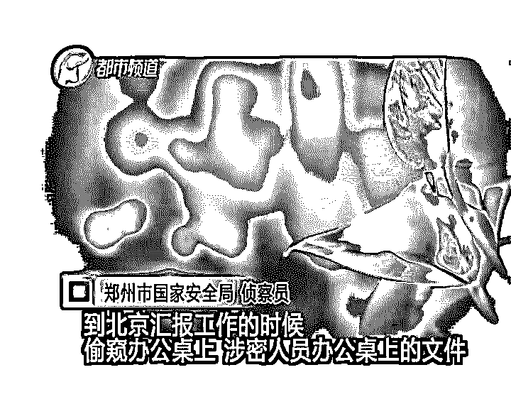

张某除了掌握我国重要武器装备的研究外，还从事着某重点领域的研究，这种技术事关我国尖端武器的研发和装备，也是目前全世界最尖端、最前沿的科研项目之一，更是世界各军事大国争夺的制高点，同时更关乎着我国的重大安全。

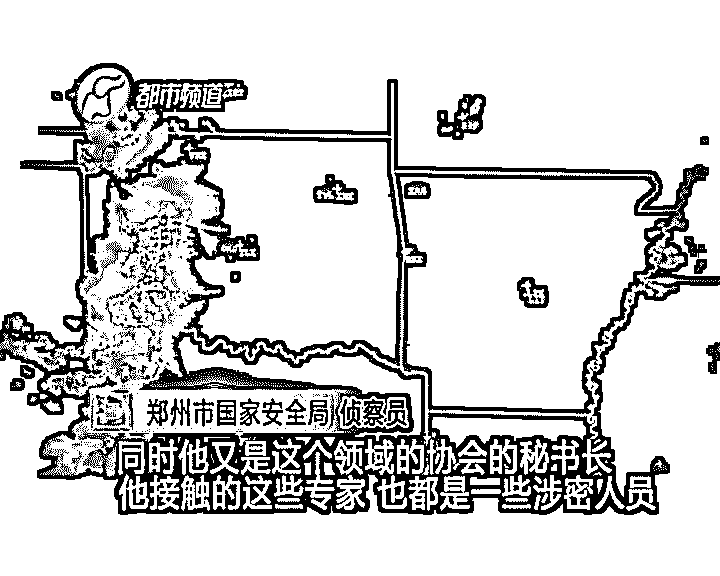

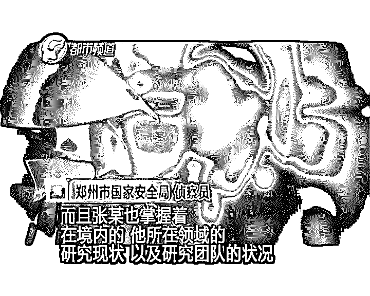

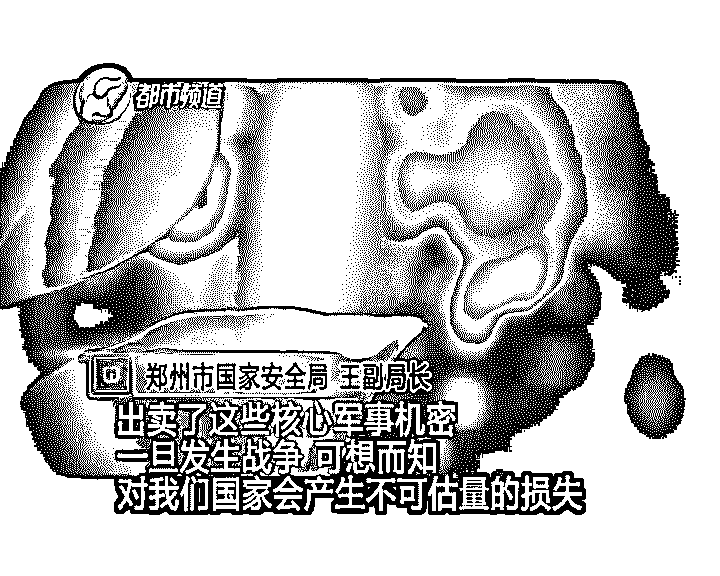

2

**郑州市国家安全局实施抓捕！**

在调查的同时，侦察员却得到一个消息，张某即将再次出国，还很有可能携带了在境内搜集到的涉密材料，一旦流入境外间谍机关手里，后果不堪设想。时间非常紧迫，绝对不能让张某离开国境。经过慎重研究，2014 年 6 月份，郑州市国家安全局决定对张某实施抓捕。

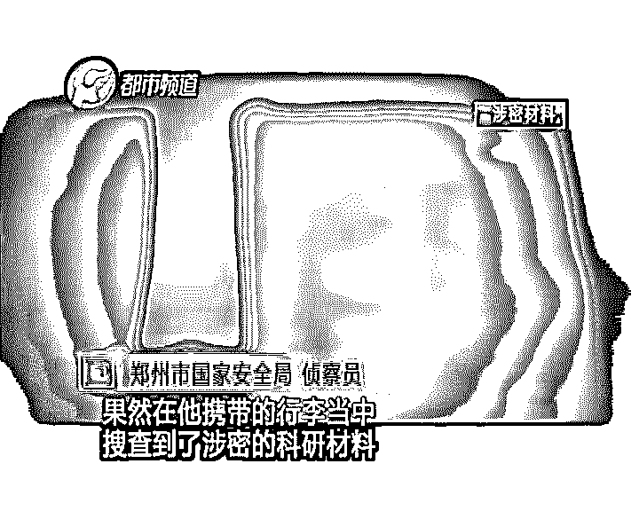

在张某被捕以后，案件转入了正面的审查阶段，面对办案人员的审讯，张某却始终闭口不言。侦察员对他所在单位的办公室以及郑州的家中进行了搜查，发现了更多重要的证据和线索。

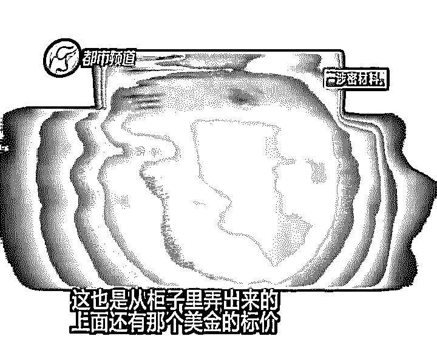

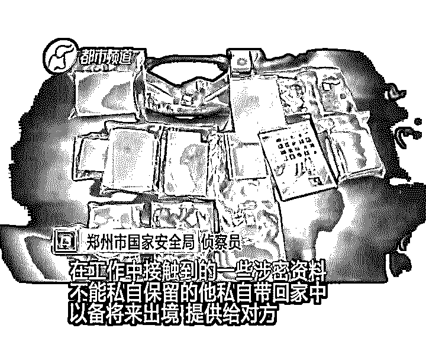

面对大量的证据，张某终于低头认罪，向干警们讲述了他是如何坠入间谍之路的。

3

**一个圈套又一个陷阱，他坠入了间谍之路**

张某虽然被捕了，但是围绕他还有很多的疑团没有解开。他是什么时候成为间谍人员，他在国内又潜伏了多久，更关键的问题是，他是否已经向境外间谍机构泄露我国的军工机密，泄露的数量又是多少，产生的危害又会有多大？

2011 年，张某所在的单位为他争取到了赴西方某大国访学的机会。一直梦想出国深造的张某，这次机会让他喜出望外。但是，张某踏上国外的那一刻就被高度关注了，甚至是在国外的一举一动都受到了西方谍报机构的严密监视。三个月后，张某在参加一次学术研讨会的时候，一名外国男子主动接近了他……

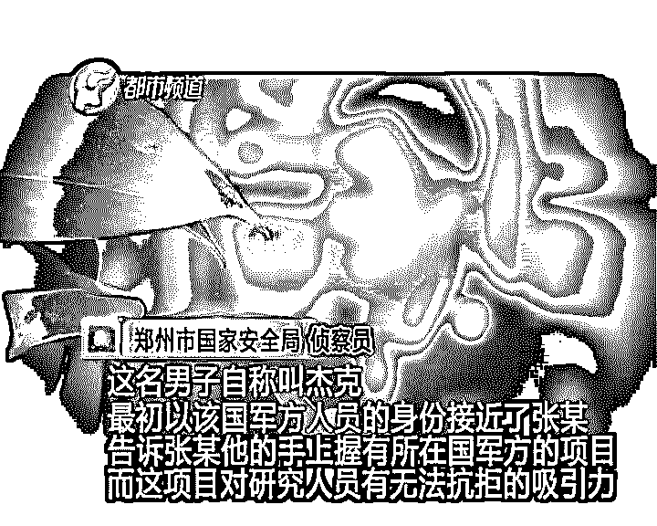

在最初的交往阶段，杰克并没有表现出任何的异常，他只是不断投张某所好，和张某不断地拉近感情。

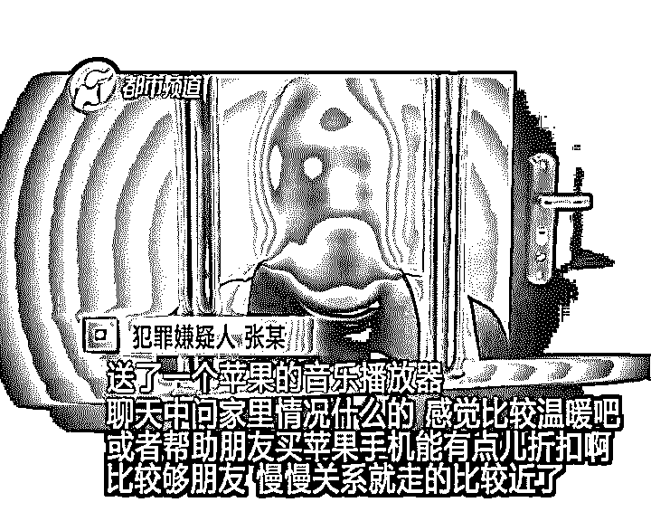

或许张某没有料到的是，杰克帮他购买的这些打折电子产品已经被安装了间谍软件。

这一点一滴的小恩小惠让独处国外的张某感动不已，一看时机成熟，杰克就设下了连环陷阱。杰克利用付费咨询的幌子，千方百计地从张某那里套取他所掌握的核心机密。一旦感觉到张某有所疑虑之后，杰克就会不断加大诱惑的筹码。面对金钱，张某再一次屈服了。

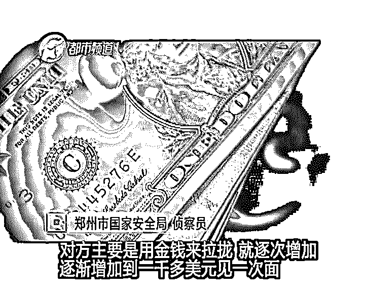

在国外生活学习将近一年的时间里，张某和杰克几乎成了无话不谈的挚友，而张某也向杰克透露出了自己的一个请求，希望有机会把自己的孩子送去国外上学，希望杰克可以帮忙。说者无心，听者有意，在张某即将回国的前夕，杰克突然把张某介绍给他的一个朋友凯文。

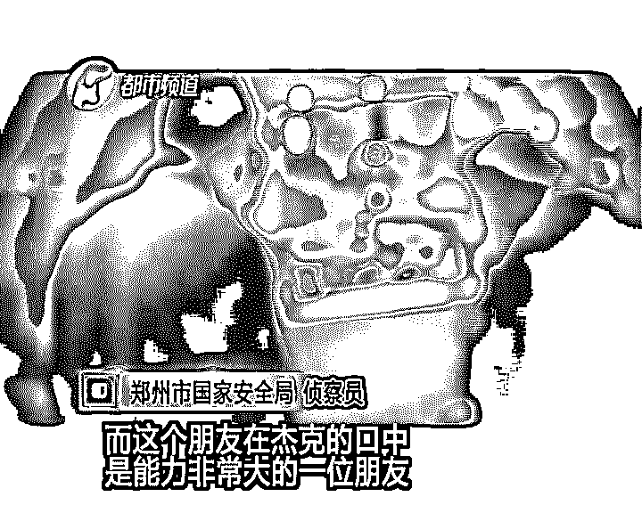

张某幻想着能从凯文的手里得到更大的好处，但是，凯文第一次带给张某的消息，就让他不寒而栗。

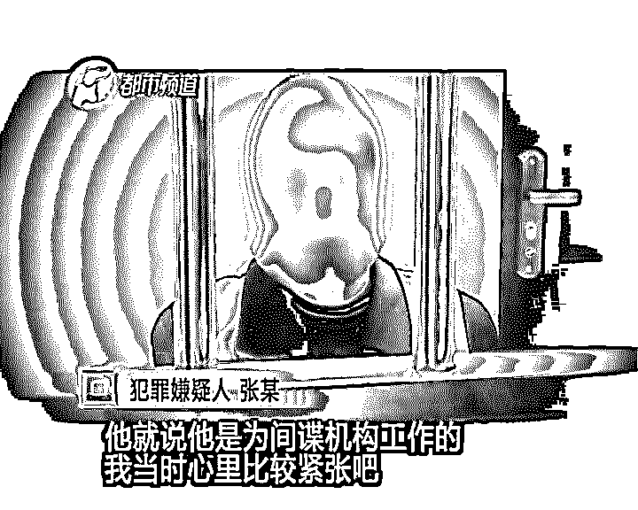

张某回忆说，他并没有立即答应凯文，这毕竟是出卖国家的内奸行为。他回到住处以后辗转反侧，徘徊不定。

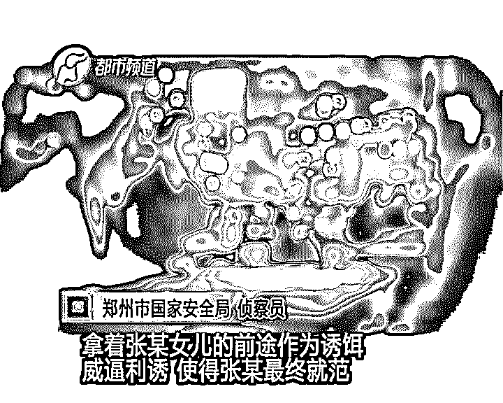

在张某回国前，这两名情报人员，还对张某进行了简单的间谍培训。

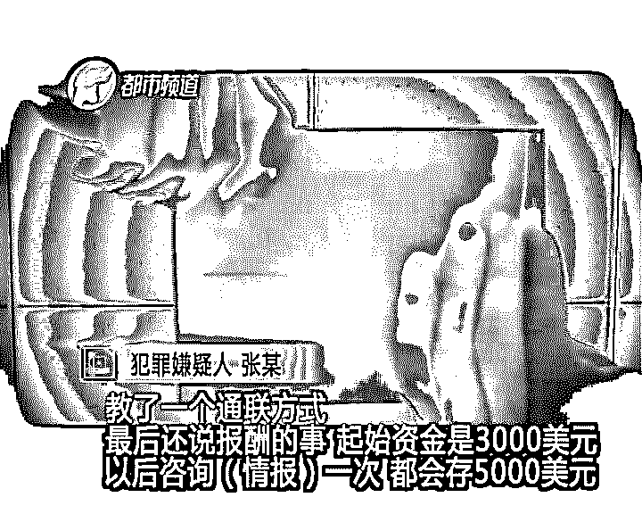

回国以后，上了贼船的张某，不遗余力地搜集我国的军工情报。

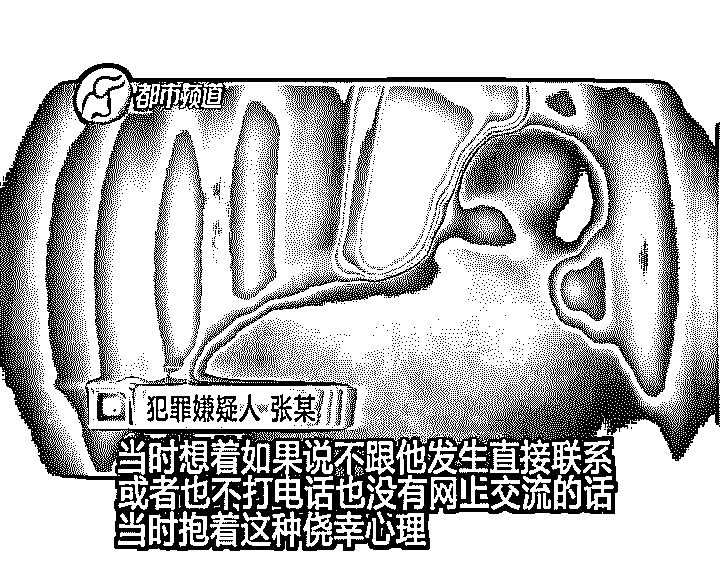

4

**又一个关键人物**

虽然张某交代了完整的间谍犯罪活动，但是仅凭张某的口供还不能落定，一条完整的证据链需要他人的证明。经过调查，杰克之所以能顺利取得张某的信任，是因为西方某国的一位科学家黑尔起到了关键作用，而黑尔正是该国某科研领域泰斗级的人物。

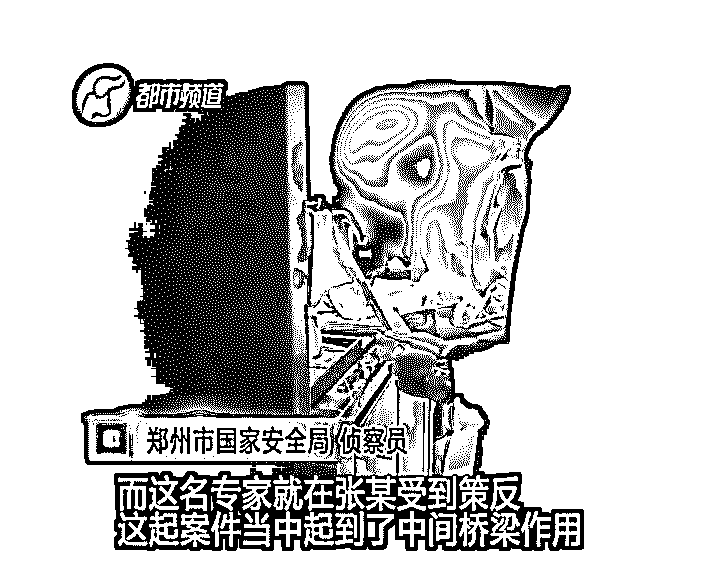

为了能拿到关键的证人证言，郑州市国家安全机关的干警抓住这位专家黑尔来中国开会的机会，依法对他进行了司法取证。

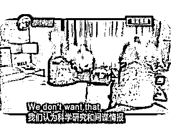

由于和张某接触的人员都是他们领域的高端人才，工作地散布全国多个省份，而且不少涉及军事机密，取证起来难度可想而知。为此，从张某被指定居所监视居住，到取得完整的证据，郑州市国家安全局办案人员前后历时了 167 天。

2017 年经过审判，50 岁的张某因犯间谍罪获刑 15 年。

5

**如履薄冰**

> 张某是怎样成为境外间谍机构的猎物的，而张某前期向他们提供的机密信息对我国的威胁又有多大呢？
> 
> > 张某间谍案的及时侦破，一举拔掉了境外间谍机构安插在我重要军事部门的一颗钉子。但是由于张某之前的严重泄密，导致我军工科研领域某重大国防科研项目提前曝光，对我国家安全造成了极其严重的现实危害。
> > 
> > 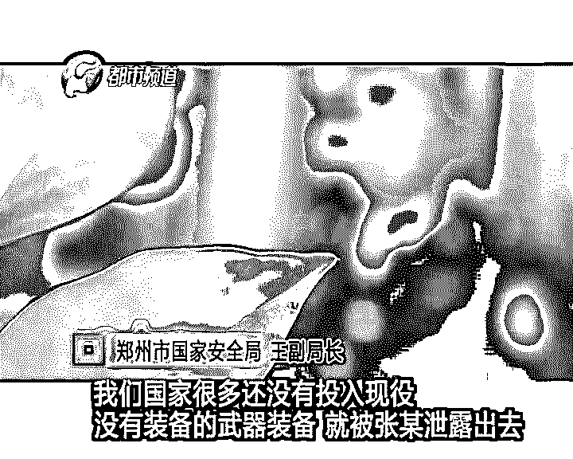
> > 
> > 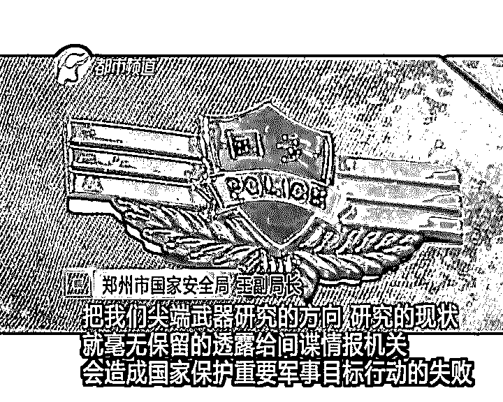
> > 
> > 另外，张某所涉及研究的某重要技术，一旦被国外窃取，这不仅意味着我国在该领域的军事科研人员数十年的努力将付之东流，而且还会危及国家的国防安全。
> > 
> > 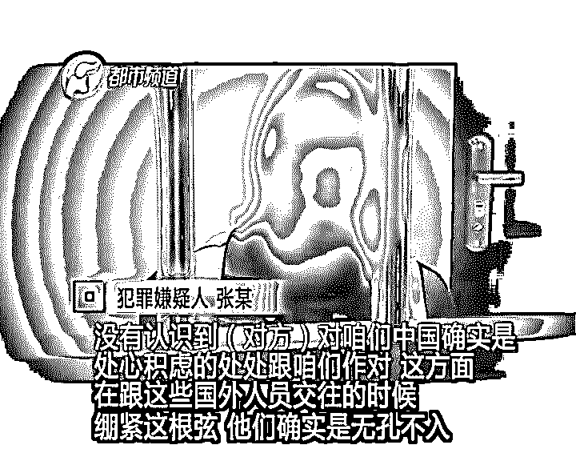
> > 
> > 为什么境外的情报机构会物色上张某，郑州市国家安全局的办案人员经过分析后认为，这是一起早有预谋的策反案件。
> > 
> > 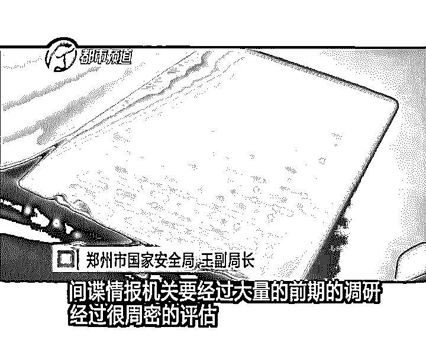
> > 
> > 苍蝇不叮无缝的蛋，而张某暴露出的诸多漏洞，都成为了境外间谍机关的突破口。
> > 
> > 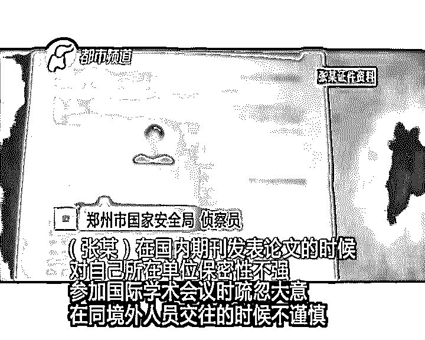
> > 
> > 在被境外间谍机构锁定之后，张某自身的缺点又成了他的致命伤。
> > 
> > 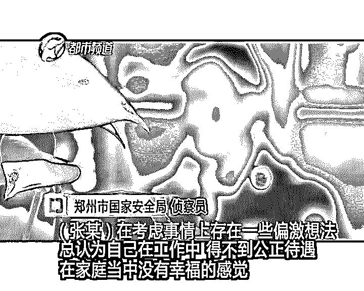
> > 
> > 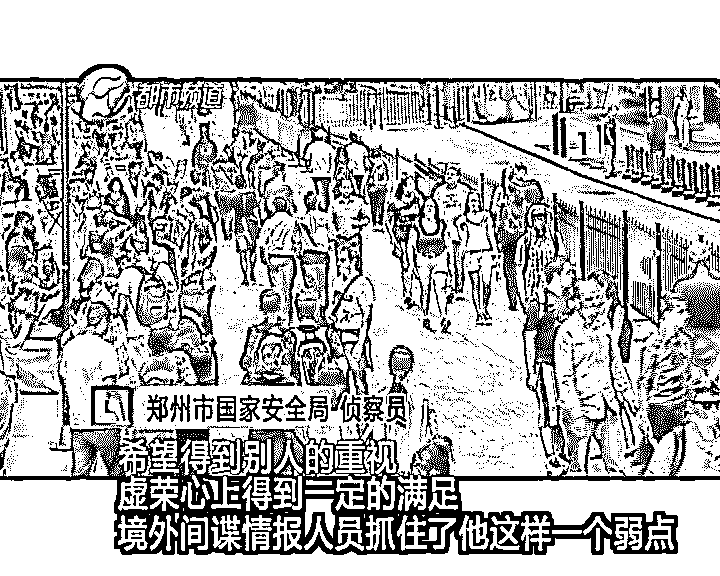
> > 
> > 河南省是一个军工科研大省，随着我们国家综合国力的提升，毫无疑问会受到境外间谍机关的高度重视。
> > 
> > 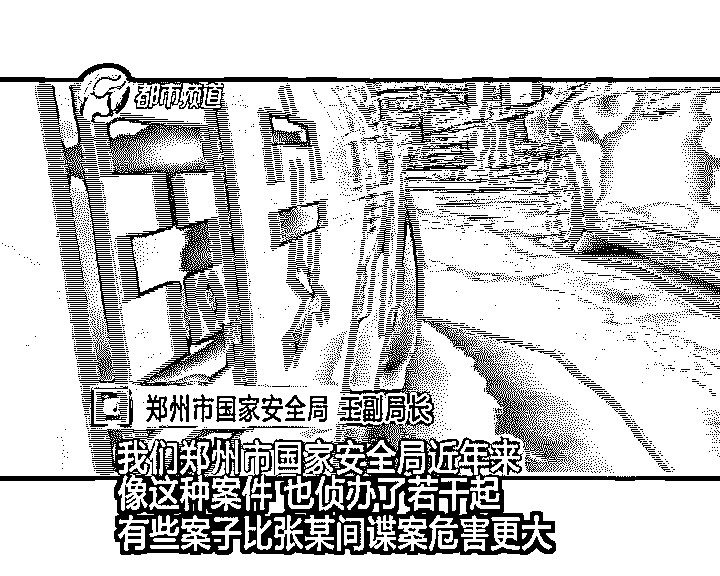
> > 
> > 通过对这些间谍案件的分析，郑州市国家安全局的王副局长揭露了境外间谍机关惯用的手段。
> > 
> > 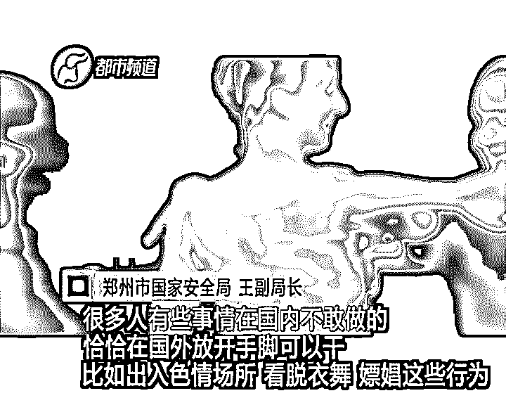
> > 
> > 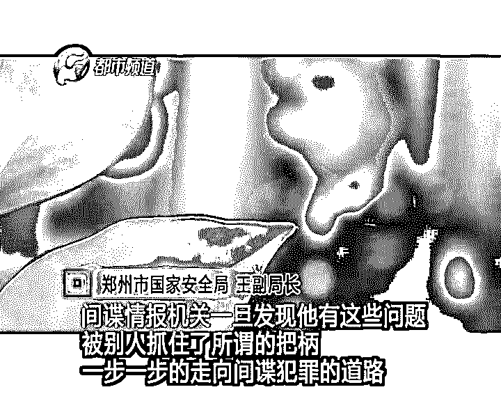
> > 
> > 王副局长告诫，一旦走出国门，时刻要提高警惕。除了桃色陷阱以外，在境外接受和使用电子产品要三思而后行；不要出入色情和赌博等不良场所；不要交流涉密敏感话题。
> > 
> > 如果不幸落入境外间谍机关的圈套当中，和对方签订了秘密协议或是出卖了我们国家的情报，想要摆脱困境的最佳选择就是向相关部门主动交代。
> > 
> > 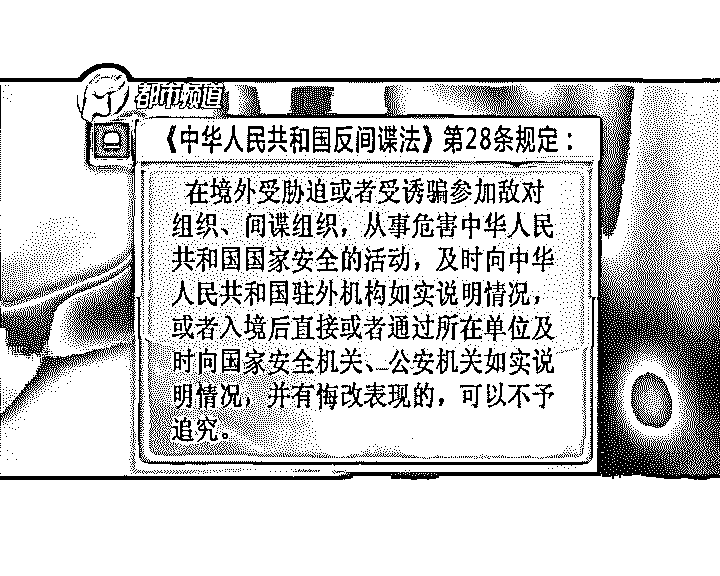
> > 
> > 令人惋惜的是，当国家安全机关办案人员找到张某时，他始终否认他的行为。
> > 
> > 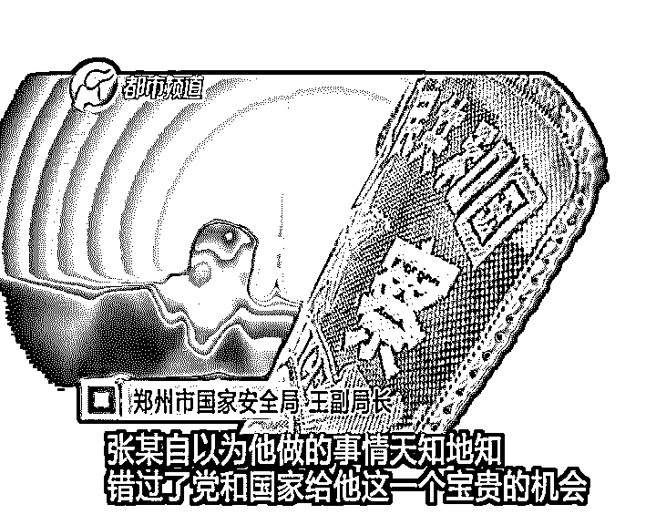
> > 
> > 从 2016 年开始，每年的 4 月 15 号是我国设立的国家安全日，2017 年 11 月 22 日，中华人民共和国国务院公布《中华人民共和国反间谍法》实施细则，详细说明了根据反间谍法需要，严厉对待的行为。
> > 
> > 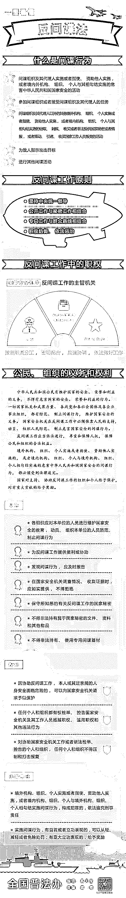
> > 
> > 反间谍斗争是一场看不见的暗战，根据国家安全机关掌握的情况来看，境外的间谍机构总是采用逐步渗透的手段，来对我们进行破坏，危险就潜伏在你我身边。保护国家安全是每一个公民应尽的职责。如果公民和组织向国家机关举报间谍行为或线索，可以拨打国家安全机关全国统一举报受理热线 12339。
> > 
> > 来源：人民日报（rmrbwx）、河南广播电视台都市频道“都市报道”（ID：dushibaodao65732233）
> > 
> > 记者：冉亚阁
> > 
> > * * *
> > 
> > **【灰产圈】高端社群小程序开通，2018 最值得加入的社群！** 
> > 
> > <mp-miniprogram class="miniprogram_element" data-miniprogram-appid="wx4f706964b979122a" data-miniprogram-path="pages/topics/topics?group_id=881854415822" data-miniprogram-nickname="知识星球" data-miniprogram-avatar="http://mmbiz.qpic.cn/mmbiz_png/kialtkOXGKS7D9hZrmO2jzDqryXXTAlhxSpnrKnHGV65KXzicibOppaPic4dCRxftvabB8Iqswo3OuQEDSxE7NicXBg/0?wx_fmt=png" data-miniprogram-title="【灰产圈】高端社群" data-miniprogram-imageurl="http://mmbiz.qpic.cn/mmbiz_jpg/WWG78hysZ0brJkWoyG2VDIacqgQjkDfp6mLiaoPBJ2SgWZHtRuTw7ia8kpoxntsn7PiaFOQO2U23FW6Iry0gS1GnA/0?wx_fmt=jpeg"></mp-miniprogram>
> > 
> > 
> > 
> > **点击加入【灰产圈】高端社群**
> > 
> > # 
> > 
> > > 原文：[`mp.weixin.qq.com/s?__biz=MzIyMDYwMTk0Mw==&mid=2247491073&idx=1&sn=888b6c79bc6f2789405446515afc5bb9&chksm=97c8d539a0bf5c2fb46c12e8e57be03f0e8760928d0112895f484f88a1e15697220c67900bda&scene=27#wechat_redirect`](http://mp.weixin.qq.com/s?__biz=MzIyMDYwMTk0Mw==&mid=2247491073&idx=1&sn=888b6c79bc6f2789405446515afc5bb9&chksm=97c8d539a0bf5c2fb46c12e8e57be03f0e8760928d0112895f484f88a1e15697220c67900bda&scene=27#wechat_redirect)
> > 
> > 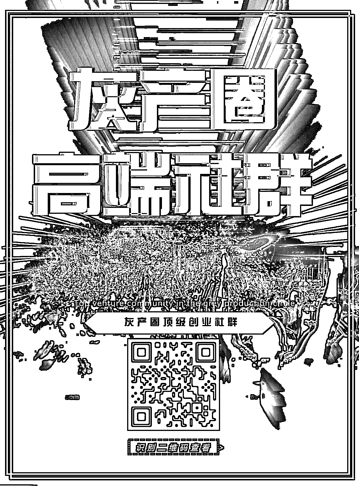
> > 
> > # 
> > 
> > > 原文：[`mp.weixin.qq.com/s?__biz=MzIyMDYwMTk0Mw==&mid=2247491070&idx=1&sn=54de21fa461375936c719e8c084e9670&chksm=97c8d6c6a0bf5fd03badeb8acd1875284e936d037bf1a2bfe1f5db269b34f8406cc566208cde&scene=27#wechat_redirect`](http://mp.weixin.qq.com/s?__biz=MzIyMDYwMTk0Mw==&mid=2247491070&idx=1&sn=54de21fa461375936c719e8c084e9670&chksm=97c8d6c6a0bf5fd03badeb8acd1875284e936d037bf1a2bfe1f5db269b34f8406cc566208cde&scene=27#wechat_redirect)