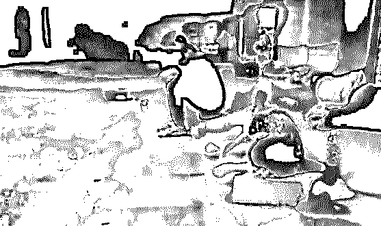

# “三和大神”：打工是不可能打工的，这辈子不可能打工的！——窃格瓦拉

> 原文：[`mp.weixin.qq.com/s?__biz=MzIyMDYwMTk0Mw==&mid=2247491008&idx=1&sn=f9e858b7c3e162b0aae484b7ec6efc71&chksm=97c8d6f8a0bf5fee3061f91cd13ada01d83e0984d273fb803e3e3318342c415fba1876d15831&scene=27#wechat_redirect`](http://mp.weixin.qq.com/s?__biz=MzIyMDYwMTk0Mw==&mid=2247491008&idx=1&sn=f9e858b7c3e162b0aae484b7ec6efc71&chksm=97c8d6f8a0bf5fee3061f91cd13ada01d83e0984d273fb803e3e3318342c415fba1876d15831&scene=27#wechat_redirect)

[**点击上方蓝色字体“灰产圈”选择关注并置顶本公众号**](http://mp.weixin.qq.com/s?__biz=MzIyMDYwMTk0Mw==&mid=2247490790&idx=1&sn=3328e040739f8c8a9008b7819baa6dbf&chksm=97c8d7dea0bf5ec8f847212d77e1443838a34a2ed0fa773a8d2950947428f01e309e87c33727&scene=21#wechat_redirect)

大家好

今天我们要说的

是一群真正的奇男子

2016 年，一个毛贼被抓进看守所

本来就是偷偷车

而令人没想到的是

在记者采访他之后

他竟成为了去年全网最火的网红之一

震惊全中国

他的事迹是这样的——

记者问他：

**你为什么偷车？**

他说：

**没有钱啊，肯定要做啊**

（当时他的表情是：

**这有什么好问的？**）

记者又问：

**你有手有脚，为什么不去打工**

他说：

**打工是不可能打工的**

**这辈子不可能打工的**

“打工是不可能打工的

这辈子不可能打工”

从此成为一句流行语

成为第一批出家的 90 后的

佛系座右铭

**完整视频在此：**

[`v.qq.com/iframe/preview.html?vid=d0612xquq43&width=500&height=375&auto=0`](https://v.qq.com/iframe/preview.html?vid=d0612xquq43&width=500&height=375&auto=0)

接着，这位佛系代言人

又被问到了

“进看守所感觉怎么样”

看到这里

这随遇而安的心态

这知足常乐的人生

我特么还能说什么呢？

打工哥从此得名——

“窃·格瓦拉”

也许在很多人看来

窃格瓦拉只是一个段子

但其实

在我们看不到的地方

无数窃·格瓦拉真实存在着

而且已经存在了很多年

比如，就在中国人的创业圣地

深圳

这个诞生了无数创业先驱的地方

却曾经有过另外一群人

他们和窃格瓦拉有着相同的精神

由于曾聚集在三和人才市场区域

江湖人称“三和大神”

没有人知道

三和大神们最初是怎么来到这里的

在我看过的所有传闻里

最靠谱的说法是

三和大神们原本只是背井离乡

想到深圳打拼的打工者

他们原以为到了深圳遍地都是机会

结果钱带得不多

又找不到工作

或者有的是不想做

但身上的钱又花光了

没办法，就来到了

“三和人才市场”找工作

但是不要误会

三和这个区域

虽然有“三和”和“海信”两个人才市场

但是这些“人才市场”

和一般的不同

在当年，基本上是黑中介聚集的地方

除了黑中介以外

主要是骗子和传销人员

再加上，因为可能明天就会饿死

所以三和大神

根本不敢做按月结钱的工作

他们嗷嗷等待的

只是一份日结的零工

“日结一天，阔以玩三天”

是三和最响当当的标语

而三和之所以能够形成聚居区

还因为这周围丰富的“配套设施”

包括黑网吧、游戏机厅、赌场

以及最低 10 元一晚的小旅馆

渐渐地

这些原本生活在最底层的

凄惨的三和人

竟然在日结的生活中

找出了一种全新的精神状态

于是，“三和大神”这个群体

真正站上了历史舞台

在这里，只有几种社会身份

小偷、骗子、小姐、摊贩、大神

这里可以为大神们提供全套生活场所

吃、住、玩一条龙解决

三和大神开始重新定义工作

虽然他们也会工作

但是工作对他们来说

绝不是为了吃饱穿暖这样的低端要求

也不是为了买房买车这样的装逼理由

工作的原因只有一个——

**上网**

在三和，随便一个小小的地方

就可能藏匿着三四十家网吧

而上网

最便宜的只要 1 块 5 一个小时

包夜也就是 8 快钱

但还是有大把大把的人

掏不出这 8 块钱

不得不垂头丧气地去做日结

而那些拿到日结工资的人

便立即焕然一新

整天整夜在网吧打游戏

假如他们连续干了几天

有了几百块钱，就会去炸金花

赢了钱，那就壕一点

吃上顿好的

或者去买瓶农夫山泉炫一下富

输了也没事

就回去和以前一样睡大街

反正花完了钱

迟早也是要回去睡大街的

在三和，人们把活不下去

称为挂逼

但是真正的三和大神

是绝不会挂逼的！

因为三和有他们需要的一切

三和大神也是人

也是要吃饭的

但是

三和大神重新定义了吃饭

三和大神每天可以只吃一顿饭

那就是一碗 4 块钱的清汤面条

俗称“挂逼面”

三和大神指定菜单

三和大神也是人

也是要喝水的

但是，三和大神重新定义了喝水

他们喝的

是 2 块钱一大瓶的矿泉水

容量多达 2 升

几乎只在三和买得到

三和大神指定饮用水

三和大神重新定义了抽烟

烟瘾犯了，抽五毛一根的红双喜

再配上挂逼面、清蓝水

这就是“挂逼三件套”

至于睡觉

更加不是问题

三和大神重新定义了睡觉

可能是因为大神们不喜欢吃饭

营养摄入不足导致感官失调

无论是天寒地冻还是风雨交加

他们就睡在“海信国际大酒店”

不冻不热稳如狗

票子充裕的

可以选择 15 元一晚的床铺

想奢侈一下的

还可以住 30 一晚的单间

当然更划算的选择

是去网吧包夜

一晚上只要 8 块钱

困了就睡

醒了就玩

只要口袋里但凡还有一点点银子

就像窃格瓦拉所说的一样

打工是不可能打工的

这辈子不可能打工的

在三和

你总能遇到走着走着

轰然倒地的年轻人

他们可能在网吧奋战了几个通宵

猝死了

或者是几天没吃饭

饿晕了

除了上网以外

唯一能引起三和大神兴趣的

就是去挂逼女那里

挂逼女，就是在三和的女人

曾经的三和大神“红姐”

就以人美活好价格低闻名

红姐从前也是三和之外的人

听说丈夫因为车祸去世了

带着孩子却没有收入

只能跟着亲戚来深圳打工

辗转来到了龙华

在一家电子厂流水线上班

后来因为红姐的疏忽

流水线整个一批次的产品

都少接了一个元件

造成了厂子不小的损失

就这么丢了工作

从此开始专职站街

日子一久，慢慢火遍三和的小街小巷

所有三和“挂逼”都以有红姐的手机号为荣

而另一个让三和大神

最引以为傲的能力

就是分辨“黑厂”

三和大神喜欢日结

而他们最恨的

就是黑厂

什么是黑厂呢？

就是活儿累钱少没有福利的厂子

三和大神别的想法不多

就是对工作有着极其挑剔的眼光

一个受人尊敬的三和大神

会在第一时间分辨出黑厂

然后平静地对新人说：

“兄弟别去这是黑厂，

我们去上网。”

三和大神只做轻松的工作

比如，保安和快递员相比

不管哪个赚钱多

三和大神一定选保安

因为快递比起来要累得多

而一份打扫卫生的日结工作

13 元一小时

做完立马就能拿到 130 元

晚上就进了网吧

拿着工资就是三和的宠儿

任凭你怎么挥霍就是个舒坦

而即使是这样

三和人仍然觉得累

他们还有来钱

更快更轻松的手段

是的

三和大神重新定义了赚钱

最快的就是，卖掉自己的身份证

无论是偷来的骗来的

身份证统统可以在三和变卖

按照出生年龄的不同

价格分为不同档次

1980 年以前的 40 元

1980 年到 1990 年的 40-80 元

1990 年以后 80-100 元

真正的三和大神

没有身份证

还有一种，就是手机分期

三和有一种假手机店

专门帮人骗取分期贷款平台的钱

在三和这就叫“手机分期”

整个过程和手机毫无关系

比如门店的人帮你申请 4000 元的贷款

门店拿 3000，你拿 1000

而代价就是

你要背上 4000 元的债务

然而这点代价这对于三和人来说

并不算什么代价

三和人，谁没有一屁股债

三和流传着一个传说

有人通过中介公司的包装

贷到了 100 万元

光中介费就付了 20 万

而最危险的，是做法人

有很多人来三和招募法人代表

出于什么目的不得而知

但是他们会先支付中介 5 万

中间重重抽成

最后“法人代表”会得到 1000-3000 的酬劳

而代价就是

你要承担企业的所有法律责任

但是饭都吃不上的时候

没有人在意未来可能的风险

唯一令人感到可惜的是

法人只能做一次

而所有三和人的最高理想

就是那个可遇而不可求的工作——

网管

可以说，在这里的人

全都放弃了自己的社会身份

像鸵鸟一样

逃避了现代社会的一切义务和责任

相应的，他们也放弃了

现代社会的一切福利

而三和是他们脚下的沙漠

却也是他们的庇护所

三和大神是如何变成这样的呢？

没有人知道

但是在为人熟知的几个故事里

他们却都有着可怜的过去

他们大多没有受过很好的教育

只能做着机械的体力工作

有人翻山越岭想在厂子找份工作

却在三和被骗走了身份证

补办就要回家

回家又要花上五六百

五六百

对他们来说实在是太多了

而在深圳的时间越长

他们就越发明白

即使是去富士康的流水线上

秒复一秒的重复工作

也永远不够他们在深圳

过上体面的日子

他们连活着都已经竭尽全力

根本无力去考虑其他的东西

教育、梦想、阶级突破

这些东西

对于明天就要饿死的人来说

没有任何意义

而没有知识、也没有梦想

他们就永远也无法摆脱

吃了上顿没下顿的生活

于是，突然有一天

他们决定了

不如放弃吧

与其离开三和，去死

不如留在三和，活着

哪怕像狗一样

对于普通人来说

体面的工作、和睦的家庭、

美好的物质生活

也许就意味着理想的人生

但对三和大神来说

这些反而成了多余

因为他们一无所有

就算辛辛苦苦打一辈子工

可能都过不上这样的日子

倒不如浑浑噩噩做日结

反而可以做 1 天、快活 3 天

尽管毫无阶级突破的希望

但却有实实在在的开心

不过，前几年

三和在网上出了名

深圳已经对三和区域进行了整顿

违规出租屋和网吧被查封

三和众神也就纷纷打包离开了

而在那之后

三和大神们都去了哪里呢？

没有人知道

我只知道

三和大神虽然离开了

但是他们并不会消失

而且一个无法忽略的事实是

在可预见的未来里

三和大神只会越来越多

因为

这个社会日渐板结的土壤

正像一块巨大无比的岩石

死死地揉搓碾碎了

三和大神那点卯足劲破土而出的绿芽

40 年前

你只要有勇气有魄力

就可以创出一片天地

那时候

农民企业家屡见不鲜

20 年前

除了勇气和魄力

你至少还需要读个大学

看看今天

40 岁左右的企业家里

有几个不是名校

就更别提没读过大学

而在 2018 年的今天

有多少没背景、

没资本、没人脉的

标准“三无”人员

正背井离乡

在城市的出租屋里

疯狂加班赶项目

苦苦地做那颗螺丝钉

而即使拼上全部

我们也未必就能

进入更高的阶级

但我们也丝毫不敢停下脚步

因为我们害怕

当上升通道关闭的那一天

我们便不得不

放弃仅有的那点尊严

成为下一个三和大神

因为抛开所有

我们离三和大神

不过就是

一个希望的距离啊

**附：2018 传奇大片《窃格瓦拉：偷车成就伟业背后的故事》**

[`v.qq.com/iframe/preview.html?vid=r0606ru3rp7&width=500&height=375&auto=0`](https://v.qq.com/iframe/preview.html?vid=r0606ru3rp7&width=500&height=375&auto=0)

* * *

**点击加入【灰产圈】高端社群**