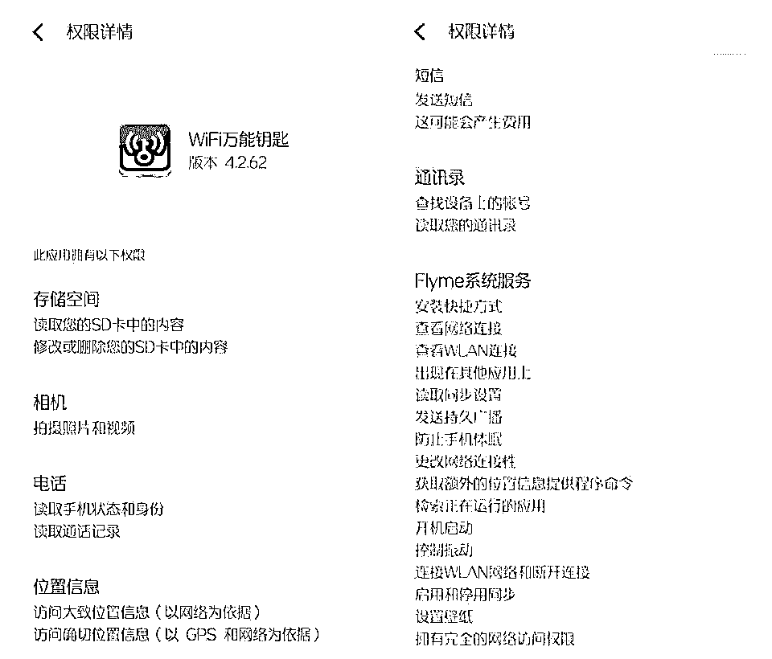

# 央视曝光偷密码的“万能钥匙”：9 亿人的个人信息在裸奔！

> 原文：[`mp.weixin.qq.com/s?__biz=MzIyMDYwMTk0Mw==&mid=2247490927&idx=1&sn=197815349d549aa8e3eeb8c1b35da926&chksm=97c8d657a0bf5f41e984862af226455cbe911ce2ded3bd4d4dff0f4cbffec7feb31a0ca78d64&scene=27#wechat_redirect`](http://mp.weixin.qq.com/s?__biz=MzIyMDYwMTk0Mw==&mid=2247490927&idx=1&sn=197815349d549aa8e3eeb8c1b35da926&chksm=97c8d657a0bf5f41e984862af226455cbe911ce2ded3bd4d4dff0f4cbffec7feb31a0ca78d64&scene=27#wechat_redirect)

**点击上方蓝色字体“灰产圈”选择关注并置顶本公众号**

> **导语：**

> 在 3 月 28 日晚，央视财经频道《经济半小时》节目主题为偷密码的“万能钥匙”，曝光了 WIFI 万能钥匙和 WIFI 钥匙两款 WIFI 共享类软件，涉嫌窃取用户隐私及 WIFI 密码。
> 
> 

**附：央视财经发布的微博**

**央视财经频道《经济半小时》节目报道：时长 24 分钟**

 [`v.qq.com/iframe/preview.html?vid=p0616xav3ka&width=500&height=375&auto=0`](https://v.qq.com/iframe/preview.html?vid=p0616xav3ka&width=500&height=375&auto=0) 

> **一.**央视财经频道《经济半小时》记者暗访调查****

想必大部分人在刚接触智能手机的时候都了解或者使用过一款甚至多款 WIFI 共享类软件，就是利用别人共享出来的 WIFi 密码连接上某些 WIFI，无需知道密码，其中 WIFI 万能钥匙是这类软件中用户量较大的一款，号称全球 9 亿+用户使用。

根据举报，《经济半小时》打开手机软件商店，无论是安卓手机系统还是苹果手机系统，软件商店里都有一款叫做 Wi-Fi 万能钥匙和 Wi-Fi 钥匙的免费软件。它的下载排名非常靠前，销售业绩非常火爆，它的图标如同一个电波发射信号，寓意着无论你身在何处，Wi-Fi 都可以一键链接。

举报称，这两款软件会将所有的 Wi-Fi 信息放进它编织的后台程序里，只要消费者下载并使用，这个消费者的手机就自动成为了这个软件的一个流动间谍。

这两款软件借用消费者的手机，会窥探这部手机周边和经过地点所有的 Wi-Fi 信息，悄悄偷取各类 Wi-Fi 的密码信息，在消费者丝毫不知情的情况下，将这些信息传软件的后台，一切都神不知鬼不觉地完成。

**来源：央视财经《经济半小时》视频截图**

2018 年 3 月，首先在北京开始了测试。位于朝阳门外大街的吉庆里小区西南角的 11 号楼楼下，记者打开了已经下载到手机里的 Wi-Fi 万能钥匙软件，并关闭了手机的 4G 信号。

瞬间，吉庆里小区 11 号楼以及周边所有的 Wi-Fi 信号全部显示出来。短短的几秒钟时间，就连接上了一个 tenda 的加密网络。而这个 Wi-Fi 究竟是谁的？承担什么功能？在一无所知的情况下，软件就帮助手机顺利进行了登陆。随即，这个 Wi-Fi 网络背后的一切，都展示在了记者的面前。

随行的技术人员告诉央视财经《经济半小时》栏目，这个路由器没有更名，可以看到它是腾达的路由器，一些人员可以通过腾达进入它的后台登录地址。

**来源：央视财经《经济半小时》视频截图**

如果用户的后台原始密码没有修改的话，输入 admin 是可以直接进入路由器的后台，看到一些连接人的信息，包括一些黑客可以对银行卡密码这些信息进行盗取，但是这家已经修改了原始密码。

那么这户人家的 Wi-Fi 密码是多少呢？记者打开 Wi-Fi 钥匙软件，通过 360root 工具，获取到 root 权限后，在 Wi-Fi 钥匙里就能查看到这家无线 Wi-Fi 的密码。在手机屏幕上直接显示出，该密码是一个尾号为 9835 的手机号码。

**来源：央视财经《经济半小时》视频截图**

这样的测试对于一个普通消费者来说，无疑是震惊的。通过 Wi-Fi 钥匙这款软件，不仅仅窃取了这户人家的 Wi-Fi 密码，而且，还能通过这个软件看到这个 Wi-Fi 网络后面所有的隐私。比如：个人的微信。从刚才得到的手机号码我们搜索出一个微信号，就可以进行添加。一个密码查到了一个微信，但是偷取的东西还远不止这些。

用同样的方法，又通过 Wi-Fi 万能钥匙查找到另一个名为 ziroom505 的密码为 400 开头的一串数字。

更让人震惊的是，不光个人的 Wi-Fi 能够随意的窃取，商业机构的 Wi-Fi 密码也能被这款 Wi-Fi 万能钥匙软件窃取。

**来源：央视财经《经济半小时》视频截图**

在餐饮和休闲场所，Wi-Fi 万能钥匙和 Wi-Fi 钥匙都展示出非常强大的蹭网功能，窃取他人的 Wi-Fi 密码，如同囊中探物一般的轻松。

**来源：央视财经《经济半小时》视频截图**

举报还提到，除了能轻松攻破小区住户和普通商户的 Wi-Fi 用户名和密码，Wi-Fi 万能钥匙软件对于国家重要机关、金融机构的 Wi-Fi 网络密码，也同样能实现轻松窃取。一款普通的软件，是否能胆大妄为到这样的地步吗？继续展开测试。

**来源：央视财经《经济半小时》视频截图**

在北京市朝阳区的中华人民共和国外交部办公大楼门口，打开了手机上的 Wi-Fi 万能钥匙软件，开始测试能上网的信号强弱。手机显示了有四个可以连接的加密网络信号，随意通过软件连上了信号最强的 BJST－1 标示的网络并能轻松上网浏览网页。无任何的阻拦、无任何的密码检查，就这样在 Wi-Fi 万能钥匙软件的帮助下，进入了外交部大楼里的网络系统。

**来源：央视财经《经济半小时》视频截图**

在北京展开了一系列的测试，无论是普通居民小区、商业机构，还是政府机关、金融机构，Wi-Fi 万能钥匙和 Wi-Fi 钥匙两个软件都能顺利的窃取到这些个人和单位的 Wi-Fi 密码，并顺利连接。而且通过后台，可以清楚地查阅 Wi-Fi 的后台数据信息，在这两个软件面前，很多公共机构如同裸奔一般，毫无任何秘密可言。

并发现在 Wi-Fi 万能钥匙在这个用户协议当中，有一项隐私政策的声明，里面描述了“它会如何收集和使用消费者的个人信息及其他信息”这些信息包括最基本的用户使用手机的设备信息； 使用服务器的 IP 地址；GPS 定位等等。而最为关键的一点是 Wi-Fi 万能钥匙需要共享、转让、公开披露用户的个人信息，只有这样才能实现这个产品所谓的“核心服务功能”。

**来源：央视财经《经济半小时》视频截图**

在用户使用时很少有人会关注到这一点，除非你进入设置中，申请取消 Wi-Fi 万能钥匙的热点分享。但如果消费者要这样保护的自己权益的话，必须要填写热点 ssid 的名称；热点的密码；路由器 mac 的地址。并要拍摄路由器的背面外观，最终这一切繁碎的内容都填写完后，还要提交申请等待 Wi-Fi 万能钥匙的审核。它同意了，你才能取消分享。

直到这时，才明白，这个看似点对点的服务，实际上是通过 Wi-Fi 万能钥匙变成点对 N，由此掌握更多的 IP 地址，GPS 定位，通过信息分享吸引客流量，发布各类广告达到赚钱的目的。

**来源：央视财经《经济半小时》视频截图**

这些窃取用户 Wi-Fi 密码，利用广告盈利的网络软件，消费者究竟该怎样来看清楚他们的面目，维护自己的权益呢？

> **二.万能钥匙是怎样帮你随时连上 wifi 的？**

使用过 wifi 万能钥匙的人知道这款 APP 有多强大，只要手机上有这款应用，基本可以随时随地连接 wifi。央视财经《经济半小时》记者做了个测试，发现从个人到商场、从外交大楼到金融重地，“万能钥匙”都可以轻松窃取密码，让手机连接上 wifi。这是怎么做到的呢？

央视据举报称，这两款软件借用消费者的手机，会窥探这部手机周边和经过地点所有的 wifi 信息，悄悄偷取各类 wifi 的密码信息，在消费者丝毫不知情的情况下，将这些信息传软件的后台。

网友评论道：这是个大 BUG，wifi 首次登陆后，密码自动保存在手机，无论多长时间后该手机回到该环境就能自动连接，每个下该 APP 的用户都将自己的密码表贡献出去，后台就掌握海量的共享 wifi 密码，于是每个用户都能利用这些密码自动登陆大部分 wifi 网络，密码形同虚设。

Wifi 万能钥匙代理商称 2016 年 6 月该 APP 全球用户总量就已突破 9 亿，用户活跃数突破 5.2 亿。根据以上说法，这意味着这 9 亿人的手机曾连接过的 wifi 账户密码都已上传到软件后台，形成了一个庞大的数据库。因此不管你走到哪里，万能钥匙都可以为你连接上 wifi。

> **三.这两款 APP 会带来什么样的风险？**

可能有人会觉得，就算 wifi 被连，也没有什么大不了的，最多网络卡一点而已。其实远不止这么简单。

央视财经《经济半小时》随行技术人员称，wif 被通过万能钥匙连接后，这个 wifi 背后的一切都暴露无疑。通过万能钥匙除了能查看连接的 wifi 的账户密码之外，还能查看到 wifi 网络后面的一些隐私信息。如有的人用手机号码做 wifi 密码的，那么手机号码就曝光了，相应的该手机号码背后的微信等信息也会曝光。

部分技术人员还能通过进入 wifi 的后台登陆地址，查阅 wifi 的后台数据信息，黑客甚至可以盗取银行卡密码等信息。

不要以为你家的 wifi 密码设置复杂，万能钥匙就没法轻易连上。经央视财经《经济半小时》测试发现，由两组 21 个数字和字母编写而成的 wifi 密码，如此复杂在万能钥匙面前都几秒就被破解。

不管是普通人、商业机构还是金融机构的 wifi 及 wifi 背后的隐私信息在这两个软件面前都几乎是裸奔的状态，掌握如此庞大的隐私信息，让人细思恐极。

> **四.这两个 APP 掌握这些数据背后有什么目的？**

央视财经《经济半小时》调查发现，这两款 APP 表面上看起来也就是把 wifi 的账号密码收集在一起，然后给大家免费共享，实际上是通过此方法吸引庞大的人群，掌握这些人的 IP 地址、GPS 定位，并利用这庞大的客流量来发布广告以达到赚钱的目的。

调查还发现，在 wifi 万能钥匙上的广告，没有 ICP 备案和许可证的手机游戏等等都被允许推广。若是被吸引且将这些不合格的 APP 装到手机上，后果不得而知。

有了这些“WiFi 钥匙”，我们出门确实方便了很多，能省下许多流量。然而这里有个前提：我们是否愿意自己的 WiFi 被别人访问？

估计大部分人都不愿意，这很正常。也因此，早期的 WiFi 共享软件，基本都活得很艰难，因为没人愿意分享自己的 WiFi 密码，导致难以普及。

到后来，它们变聪明了，悄悄做出改变：在用户不知情的前提下，软件后台默认可以获取你连接的所有 WiFi 密码。

你需要到设置界面才能关闭

更严重的是，现在我下载最新版本的“WiFi 万能钥匙”，设置界面已经取消掉这个按钮，改成“强制性默认分享你的 WiFi 密码”：

简洁明了的设置界面

这会造成什么样的后果？假设你在家里上网，网速突然变慢，一查发现，原来隔壁老王一直在蹭你家的网络。

你很生气，将 WiFi 密码换掉后，隔壁老王照样能蹭网，你无论换多少次密码，都无济于事。

这一切的罪魁祸首，就是你手机里的“WiFi 共享软件”在作怪。

它在后台一直默默运行，只要你连接上自家的 WiFi，它就将新密码上传到网络，让隔壁老王获得最新密码。

你即使卸载了软件，也要时刻防备好友的手机是否有这类流氓软件，否则一不小心又“共享”你的 WiFi。

这个简单的原理，其实很多人都不知道，他们只觉得这是良心软件，是神器，能省下许多流量费。

当越来越多人使用这类 WiFi 软件时，世界上将没有一个绝对安全的 WiFi，每个人的手机都是特洛伊木马，都能轻松地攻陷 WiFi。

有些人觉得小题大做，自己可以蹭网，给别人蹭一下网也无可厚非。

但我劝你最好不要那么大方，甚至不要随便链接那些不明来历的公共 WiFi。

“WiFi 万能钥匙”的官方声明有这样一句话：只是为用户提供更为便捷的上网方式，本身不会增加用户上网的安全风险。

到底有没有增加用户的上网风险？可不是一家之言说了算。

如今我们所有的重要信息都储存在手机上，一旦连接别人的 WiFi，个人隐私直接裸奔，毫无遮掩。

在 2016 年的 315 晚会上，专家进行了现场测试：

只要你连上一个免费 WiFi，打开消费类软件，订单和消费记录统统被提取！包括电话号码、家庭住址、身份证号码、银行卡号、甚至精确到哪天几时你看了一场什么电影，访问了什么网页。

甚至有一些穷凶极恶的黑客，他们通过 WiFi 成功入侵你的电脑后，当成肉鸡（傀儡）去做违法的事情，最终你只能等着警察上门来查水表。

不要说只蹭别人网，别人永远永远蹭不了自己，天上永远不会掉馅饼，只有特别黑的陷阱。

和 360 免费杀毒一样，“WiFi 万能钥匙”同样打着免费的旗号，全球收获 9 亿用户，周活跃率超过淘宝和百度，稳居前三。

一个很简单的道理，“WiFi 万能钥匙”需要养活整个公司，它只能将“免费”的成本平摊给所有用户。

当你愿意用隐私来换取免费服务时，它就有可能分析你的生活和消费习惯，并精准的投放广告。

一个工具类软件，竟然拥有“完全的网络访问权限”，更别说要读取通讯录、照片和短信等敏感隐私了。

为了公司盈利，收点广告费无可厚非，但是让我恼火的一件事是，“WiFi 万能钥匙”内置的新闻资讯，简直是辣眼睛。

我今天第一次登陆，在没有刻意筛选视频的情况下，首页给我推送下面这些内容：

我再想起“WiFi 万能钥匙”竟然有 9 亿用户，就无法想象，这些低俗内容的传播幅度到底有多广。

事实上，并不是所有人都能看到这些内容，如“WiFi 万能钥匙国际版”就没有任何广告，界面十分清爽：

**谷歌应用商店下载的国际版**

前不久，百度李彦宏先生曾发表过一番高论：“中国人对隐私问题的态度更开放，也相对来说没那么敏感。”

看来的确如此，在没有隐私的选择下，国人更容易受到欺负，也不懂得维权，像待宰的猪一样，这正是时代悲哀。

我写这篇文章出来，是为了让你们知道这类“WiFi 软件”的运作原理，至于是否卸载，留待各位决定。

虽然我无法保护你们的隐私，但你们应该享有基本的知情权利，并让身边更多的人知道。

前两天李彦宏又被网友骂了，原因是他在某高层论坛上表示，中国的用户是愿意用隐私换取便利的。此话一出犹如平地惊雷，不少网友纷纷质问道“谁说的？”于是昨天央视手一指，就是 WiFi 万能钥匙说的呗。

**【虽然说是“万能钥匙”，但其实不是破解工具】**

> **五.“钥匙”其实是共享？ 蹭人 WiFi 者恒被蹭之**

有网友发现了，这个应用里提供的能让人随便上的 WiFi 账号，很多都不是公共 WiFi。既然 WiFi 万能钥匙并不是破解密码的应用，那这些个账号难道是谁来提供的吗？

答案是，还真是那些想蹭网的用户自己提供的。

这话听起来有点奇怪，然而网友公布的一张截图泄露了玄机：在用户【点击开启 WiFi 之旅】之前，会有这种默认勾选的要求，诸如【自动分享热点】【自动备份】【我同意《用户协议》】，甚至在 App 的应用设置里面，是可以选择【自动分享已连接热点，而用户上传分享的热点之后，你曾经连接过的 WiFi 的大门就对 WiFi 万能钥匙里的所有用户敞开了，这就好似“蹭人网者恒被蹭之”。

考虑到现在许多互联网用户有一个“不看选项狂点确定”的坏习惯，可能存在有部分用户在没有仔细查看相关条例就默认确定的情况，不过需要注意的是，上述登陆页面乃是 2015 年的旧版界面了，现在用户如果想在 WiFi 万能钥匙上分享 WiFi，需要填写相关账号密码并手动勾选【分享为公共 WiFi】。但是，在此之前那些被默认自动分享的 WiFi 账号是否还需要重新获得用户确认，是否依然是开空门，这我们就不得而知了。

看到这里，那些以前使用过 WiFi 万能钥匙的用户是不是在想，那我现在就把分享热点关掉不就好了吗？可惜，按照央视财经报道所说的，如果想要取消 WiFi 万能钥匙的热点分享，用户“必须要填写热点 ssid 的名称；热点的密码；路由器 mac 的地址。并要拍摄路由器的背面外观，最终这一切繁碎的内容都填写完后，还要提交申请等待 Wi-Fi 万能钥匙的审核。它同意了，你才能取消分享”。

**只是想蹭个网，但什么都让它知道了**

说实话，要取消分享需要提交热点 ssid 的名称和密码，小编还勉强能够理解，但路由器的 mac 地址、路由器背面外观（也就是相关参数数据图的所在）这些也要上传，就让人费解了。实际上，当点开 WiFi 万能钥匙的《用户服务协议》最下方的《WiFi 万能钥匙隐私权政策》文件（这是一个套在文件里的文件）连接时发现，用户在登录使用 WiFi 万能钥匙时，所需要上交的数据远不止 WiFi 账号密码等。

相关隐私协议里写道，“为了提供更好的产品和/或服务并改善用户体验，我们会收集设备属性信息（例如您的硬件型号、操作系统版本、设备配置、唯一设备标识符、国际移动设备身份码 IMEI、网络设备硬件地址 MAC、广告标识符 IDFA 等），设备位置信息（如通过 GPS 或 WIFI 信号获得的位置信息）、设备连接信息（浏览器的类型、电信运营商、使用的语言）以及设备状态信息（例如设备传感器数据，设备应用安装列表）”。

“当您使用 WiFi 万能钥匙的产品和/或服务时包括但不限于热点安全检查、WiFi 安全险等服务，我们的服务器会自动记录一些信息，例如您对我们的产品和/或服务的使用情况、IP 地址、所访问服务的 URL、浏览器的类型和使用的语言、下载、安装或使用移动应用和软件的信息以及访问服务的日期、时间、时长、引用的网站统一资源定址器（URL）等”。

这份《WiFi 万能钥匙隐私政策》于 2017 年 9 月 30 日颁布并生效，也就是说在此之后注册或登陆过 WiFi 万能钥匙的用户，虽然你只是想用它来蹭个网，但当你的手机后台开始运行这个应用时，你的手机或平板型号、配备、IMEI、MAC、设备位置，甚至在你手机后台运营 WiFi 万能钥匙时，上网的 IP 地址，用的什么浏览器、下载、安装甚至使用了什么应用等一系列的信息数据，你都全部上交给了 WiFi 万能钥匙的后台。

这就让人细思恐极了，WiFi 万能钥匙今天回应央视财经的声明中也说自己“只是为用户提供了更为便捷的上网方式”，那为何要搜集用户的这么多数据？难道是想炫耀自己服务器的容量足够大么？

> 六.针对此事件，WiFi 万能钥匙发布了官方声明：

> 
> 
> 

> **附：央视记者后续调查视频**

[`v.qq.com/iframe/preview.html?vid=i061948s3j7&width=500&height=375&auto=0`](https://v.qq.com/iframe/preview.html?vid=i061948s3j7&width=500&height=375&auto=0)

> **七.央视财经报道后，工信部发话！WiFi 万能钥匙将何去何从？**

安卓手机在 ROOT 的情况下是可以通过某些手段直接读取到已连接的 WIFI 密码的，也就意味着配合这类 WIFI 共享软件，黑客可以掌握大量 WIFI 网络的密码，而 WIFI 万能钥匙号称全球 9 亿用户，而 WIFI 钥匙也拥有“亿级密码库”，这些相当于帮黑客直接省去了破解路由器的第一步。

有了 WIFI 密码，黑客则可以破解路由器获取管理员权限，紧接着便能够监控接入该 WIFI 网络下所有设备的上网记录，窃取个人信息。想像一下，这种手段被用在金融机构、国家重要机关，后果不堪设想。

> **八.结尾：**

这一类 WIFI 共享软件，看起来是免费使用，但其实仔细想来，用户所付出的代价却不是用金钱来衡量的。用自己的个人信息和 WIFI 信息去交换其他的 WIFI 密码，这笔交易并不见得划算。而在平台服务器保存大量的用户或者机构的 WIFI 密码之后，却将大量的公司、单位置于潜在风险当中，而用户个人信息也面临泄漏的风险。

灰产圈再次想起前段时间，百度李彦宏说的那句话“如果用隐私可以换取便捷性或者效率，很多情况下他们是愿意这样做的”。

* * *

**【灰产圈】高端社群小程序开通，2018 最值得加入的社群！** 

<mp-miniprogram class="miniprogram_element" data-miniprogram-appid="wx4f706964b979122a" data-miniprogram-path="pages/topics/topics?group_id=881854415822" data-miniprogram-nickname="知识星球" data-miniprogram-avatar="http://mmbiz.qpic.cn/mmbiz_png/kialtkOXGKS7D9hZrmO2jzDqryXXTAlhxSpnrKnHGV65KXzicibOppaPic4dCRxftvabB8Iqswo3OuQEDSxE7NicXBg/0?wx_fmt=png" data-miniprogram-title="【灰产圈】高端社群" data-miniprogram-imageurl="http://mmbiz.qpic.cn/mmbiz_jpg/WWG78hysZ0brJkWoyG2VDIacqgQjkDfp6mLiaoPBJ2SgWZHtRuTw7ia8kpoxntsn7PiaFOQO2U23FW6Iry0gS1GnA/0?wx_fmt=jpeg"></mp-miniprogram>

**点击加入【灰产圈】高端社群**