# 三亿人都在拼的拼（pian）多多，到底在拼（pian）什么？

> 原文：[`mp.weixin.qq.com/s?__biz=MzIyMDYwMTk0Mw==&mid=2247490889&idx=1&sn=42aef8097d68c7cdb85754f90586ea2a&chksm=97c8d671a0bf5f678297e0bb66181b5820ad03caa49a10ff3de3443f4b434ef64d10aeaacb86&scene=27#wechat_redirect`](http://mp.weixin.qq.com/s?__biz=MzIyMDYwMTk0Mw==&mid=2247490889&idx=1&sn=42aef8097d68c7cdb85754f90586ea2a&chksm=97c8d671a0bf5f678297e0bb66181b5820ad03caa49a10ff3de3443f4b434ef64d10aeaacb86&scene=27#wechat_redirect)

****欢迎关注“灰产圈”  置顶本公众号！****

****

> ****导语：****

**3 月 19 日，周一，一大早，趁着微信员工还没到岗，新世相营销课的海报在朋友圈迅速裂变式暴力刷屏。知识焦虑的人们扫码“囤购”了课程，然后又生成自己的海报二维码分享出去。**

**因为推荐机制是，如果你分享拉来新人头购买课程，你就可以获利，这样就能摊薄自己的听课成本，甚至还可以小赚一笔。**

**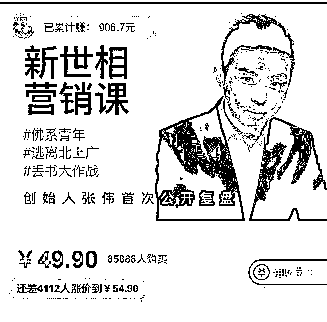**

**所以，很多人为了几块钱不惜出卖自己的朋友圈，为一堂自己都尚未来得及听的新世相营销课作信用背书，甚至不惜绞尽脑汁为其编织美丽诱人的转发文案。**

**结局肯定在意料之中，这场社交式营销没有活到当天中午就被微信官方封杀并严重警告了，但是新世相的课程在短短几个小时内就卖了好几百万。**

**类似这样的拉人头给奖励的刷屏营销，网易前不久也在微信干过一票。另外，趣头条看个新闻居然也搞起了“收徒弟”模式，拉个人头下载注册趣头条就给你红包奖励，只不过，趣头条玩这一套的阵地是在自己的 APP 里。**

**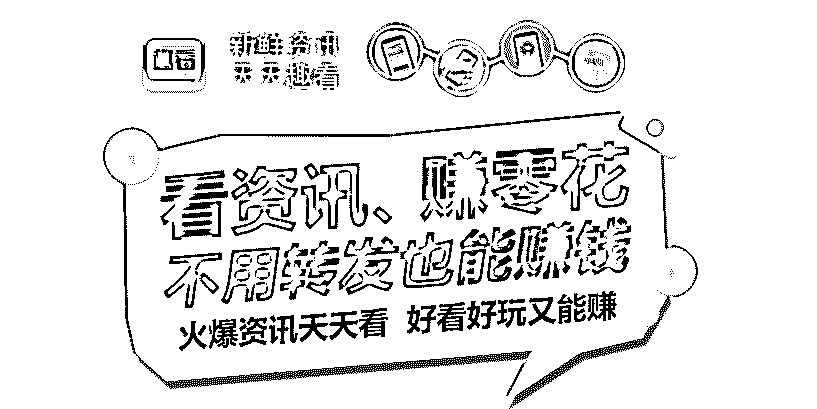**

**这一波又一波 666 的神操作里，人们似乎看到了一个熟悉的“祖师爷”影子——拼多多。业内公认，在当前，把社交电商玩得最出神入化，最持久的非拼多多莫属，顶礼膜拜借鉴拼多多模式营销者众。**

> ****一. 起底拼多多：进击的巨人****

**11 岁的小男孩巴里，被加速器产生的闪电击中，昏迷了 9 个月。** 

**醒来后获得了神速力，速度之快可以超越光速、穿透物体，甚至能逆转时空、穿越平行宇宙，从此以后，人们叫他闪电侠。** 

**谁也没有想到，曾经让京东和淘宝都不屑一顾的拼多多，竟然成功逆袭。**

**2015 年 9 月，拼多多公众号正式上线，是一家专注 C2B 拼团的第三方社交电商平台，其主营业务包含海淘、服饰箱包、数码电器、食品饮料、家居生活、美妆护肤、家纺家具、母婴玩具、水果生鲜九大类目。上线两周其粉丝数破百万。**

**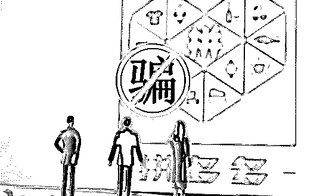**

**2015 年 10 月，拼多多问鼎微信支付笔数前三名。*   2015 年 11 月，拼多多在未有任何广告投放的前提下，用户突破 1200 万。

    *   2016 年 1 月，单日流水突破 1000 万。

    *   2016 年 6 月，拼多多宣布完成 1.1 亿美元的 B 轮融资，资方包括高榕资本、新天域资本、腾讯等。

    *   2016 年 9 月，电商平台“拼多多”、“拼好货”宣布合并。注册用户超 1 亿，单月流水破 1 亿。

    *   2017 年初，月成交额 20 亿，年底 100 亿，4 个月后，400 亿，数字捅出来真是不知道得吓死多少人。** 

**这，是一个成立仅仅两年的 APP，能做出来的业绩？**

**简直令人震惊！**

**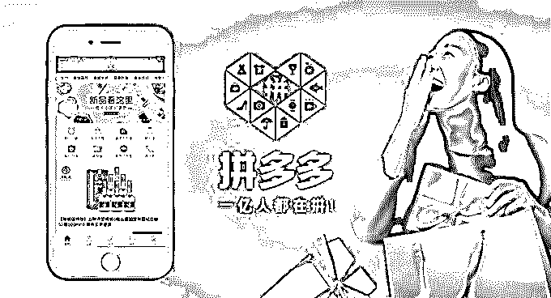**

> ****二，拼多多是如何用两年时间成为“巨头”？****

**闪电侠表现出了碾压行业老大的势头。但是，闪电侠在高速运动时，无视了一切物理定律。**

**拼多多也是这样，有时横冲直撞，有时无视规则。** 

**在 315 之前有这样一个问题：你眼中最应该在 2018 年 315 晚会被曝光的公司和产品是什么？** 

**结果，拼多多在众多商家里，一直呼声很高，几近狂热。** 

**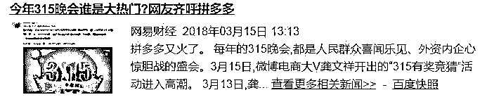**

**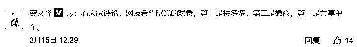**

**用户的眼里，拼多多成了恶意诱导裂变，文字欺诈，虚假广告，哄抬物价，品质恶劣的平台。**

**商家也觉得委屈，拼多多以违规导流为借口，强制商家增加 10 万保证金。** 

**在同行眼里，拼多多也不招人待见，闪电侠变成了老鼠屎，坏了整个拼购市场的招牌。** 

**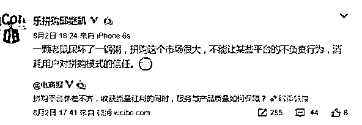**

**在商业上，拼多多是真正的人性高手。**

**但今天，也想特别纯粹的聊一聊，把控人性的限度究竟在哪里？**

**▎第 1 步：红包的诱惑**

**女神节的前一天，我收到一条来自拼多多的短信，显示我“被抽中 iPhone X 手机，0 元幸运得”。**

**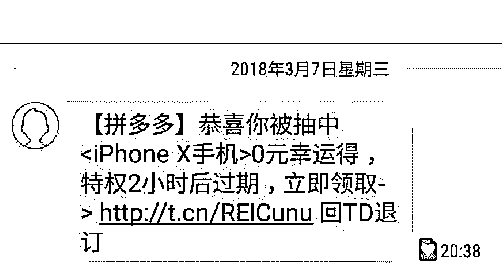**

**不过，当点开短信中的领取链接后，却发现这是拼多多 APP 的下载地址。**

**这是拼多多的惯用伎俩，诱导用户裂变的第一步，当然就是想尽办法让人来下载。**

**对于这点，拼多多的客服毫不避讳的承认，哪有什么抽奖活动，不过就是推文活动而已。**

**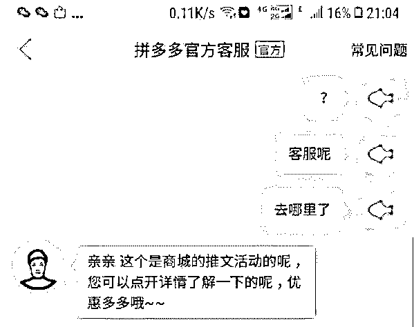**

**除了短信，只要你关注了拼多多这个公众号，每天的推送基本上都是一个诱人的红包，点进去一个套路——下载我们的 APP 吧。**

**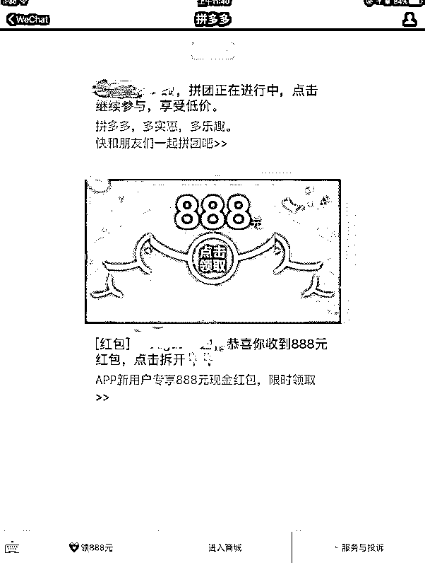**

**想要获得这个红包，要签到、砍价、发送给微信好友请他们接力，跟微信的诱导分享、诱导关注的政策进行比对，看上去好像一条都没触犯。**

**但是，让没用这个软件的人，可是受够了折磨。**

**闲着没事干七大姑八大姨总是会莫名其妙的发一条让帮忙砍价的链接过来，或者被拉近莫名其妙的砍价群。**

**只要你点了砍价链接，就会发现你的个人资料已经被拼多多平台获取，时不时的就会给你发几条中奖了或中现金红包了的消息。**

**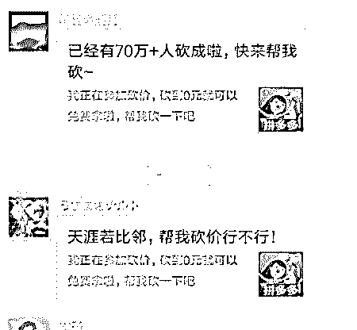**

**这种病毒一样的传播模式很快就蔓延了整个朋友圈，也让更多的人参与了进来。**

**最可气的是，微信官方对待这种新型的诱导分享，就是无动于衷。**

**就这样，拼多多撕开了流量的口子。**

**也许，它最引以为豪的也只有——自己能够背靠微信，讨来源源不断的流量。**

**▎第 2 步：虚假的广告和被哄抬的物价**

**让用户下载软件，只是万里长征的第一步。**

**真正让用户下手拼团，就要让用户坚信：拼到的东西，一定比市面价便宜，而且不是一般的便宜。**

**一款 279 的榨汁机，如果不断要求朋友来砍价，一个人能砍五六块，10 个人就能便宜 50 啊，心不心动？**

**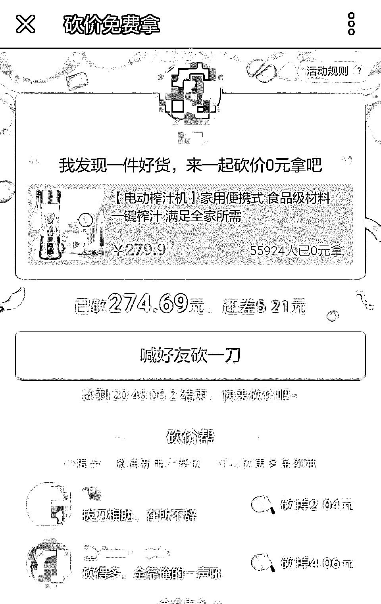**

**但实际上，这款榨汁机本身就卖 29.9，往上直接加了 250 块钱，恐怕是把用户当成了 250 吧。**

**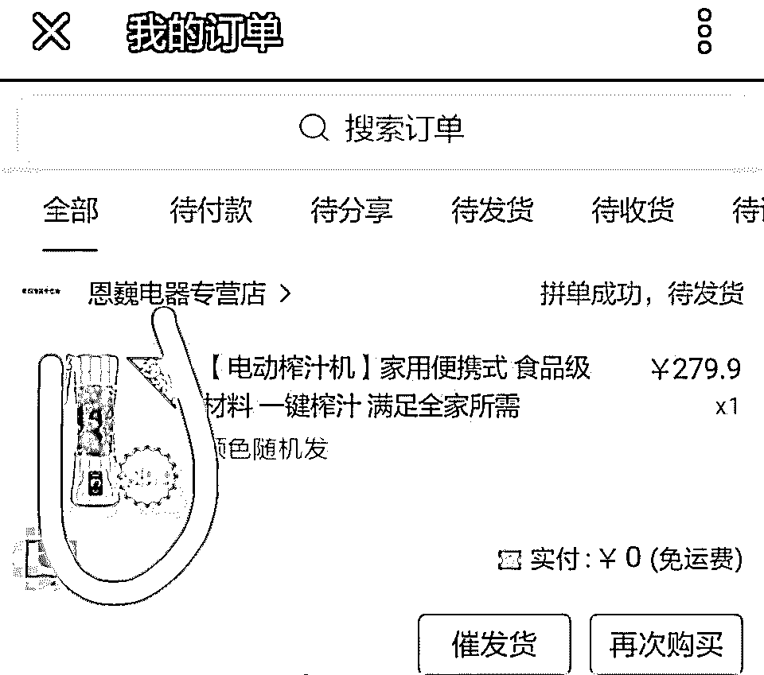**

**当然，也有幸运的用户，通过孜孜不倦的努力，无数次的分享终于 0 元拼到了榨汁机。**

**收到快递的时候却一脸懵逼：一根数据线，一根不能再短的数据线。**

**但是无所谓啊，你的邮费，已经完全能喂饱商家。**

**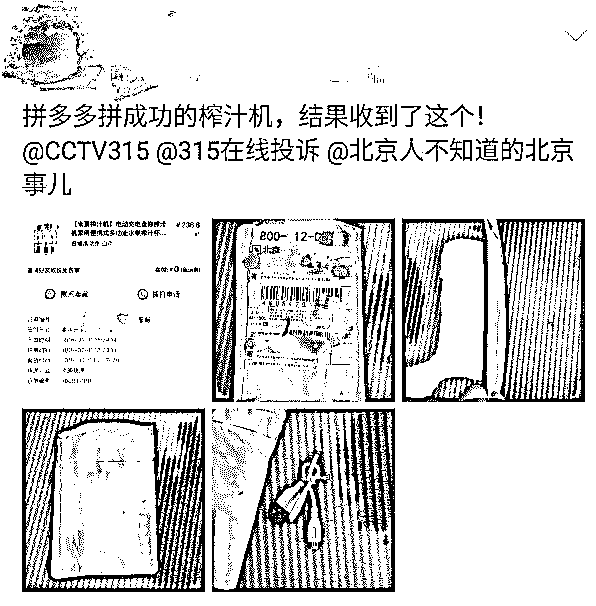**

**▎第 3 步：售后质量奇差**

**虚假宣传的倒是卖出去了，但是从质量到售后，拼多多做的更绝。**

**其实，很多人被拼多多吸引过来，都是以为那些曾经一脸贵气的水果。**

**海南木瓜，智利车厘子，泰国进口大榴莲，在拼多多变得特别亲民。**

**而当你发了一圈朋友圈，费劲凑够团友后，可能会收到这样的回复：**

**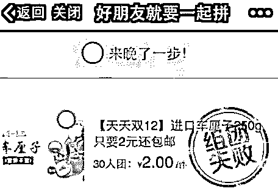**

**就算“运气好”人也凑够了，钱也交齐了，团购也成功了，水果也到手了。**

**开箱一看，外表也烂了，大小也变了。**

**售后的回复更气人：亲，烂水果切掉一点点就能吃了哦。**

**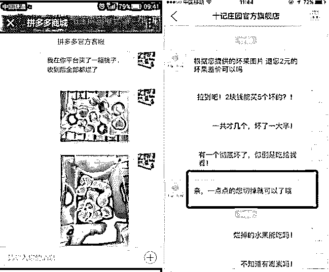**

**拼多多有条很难理解的规定，消费者若收到腐烂水果，腐烂面积少于一半，平台会退还一半的差价；如果有超过一半的大面积腐烂，则向用户进行全额退款。**

**腐烂面积少于一半，还能吃吗，不能吃，凭什么只退一半？**

**拼多多还会用一句话解决所有问题：亲，给您带来不便了，敬请谅解。**

**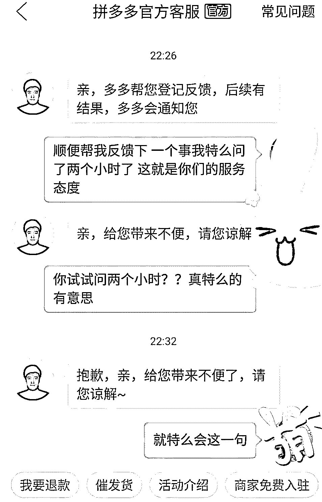**

**投诉水果是烂的，回复说烂的部分切了就可以吃；投诉鞋子坏了，回复说能穿半个月已经很不错了。**

**实在谈不拢怎么办？都用 2、3 块的赔偿费打发了。**

**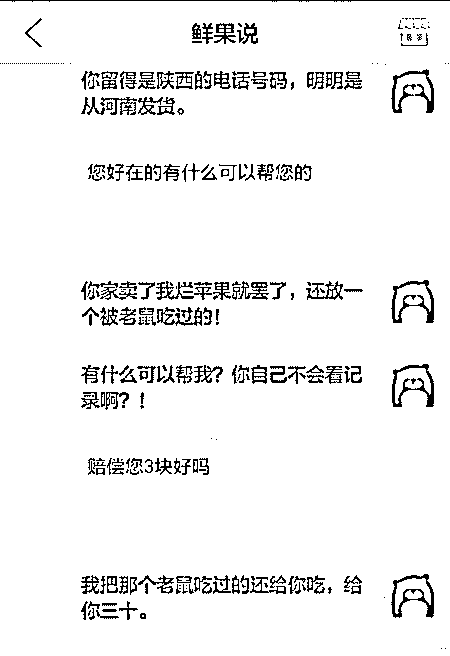**

**质量问题连央视都看不下去，担心早晚有一天会出了人命。**

**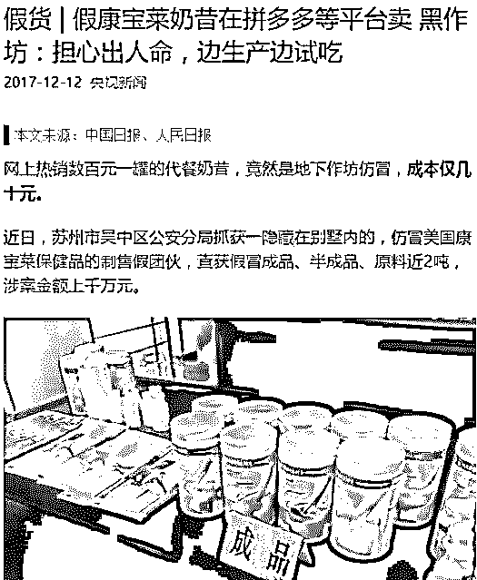**

**毫无悬念，2016 年拼多多投诉量跃居行业第一，高达 13.12%。**

**▎第 4 步：坑完用户坑商家，商家也过的千疮百孔**

**用过拼多多之后，叫苦连天的不只有用户还有商家。**

**在商家的圈子里，拼多多有一个外号叫罚多多。**

**罚款条目众多，为的就是让你拿出比某东某猫还有低的价格，却要提供比它们还要好的服务。**

**比如利用霸王条款强制进行处罚，不考虑实际情况。商家找客服一问三不知，也不给明细和凭证，更无法申诉。**

**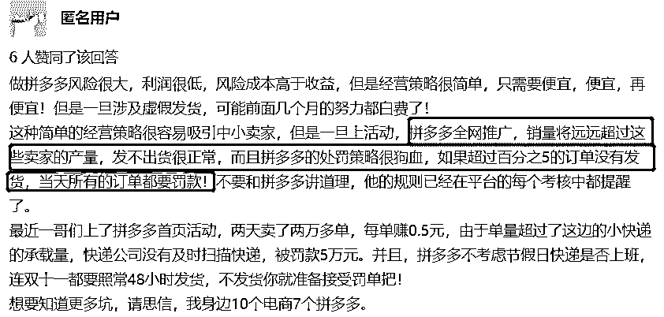**

**对小商家的处罚力度几乎和利润持平，挣的没有罚的多。**

****

**擅自冻结卖家货款也不在话下。**

**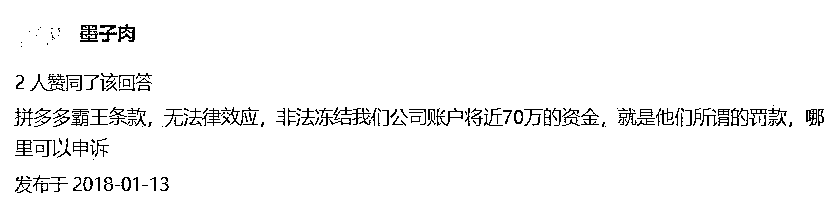**

**不仅如此，还有不少商家爆料平台刷单是常事，但是刷少了就亏钱，刷多了发不了货也要罚钱，进退两难。**

**甚至还有威胁索贿的问题…**

**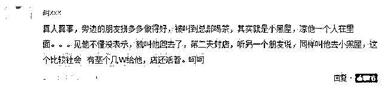**

**这样严厉又无理的罚款机制，势必会引起商家的反水。**

**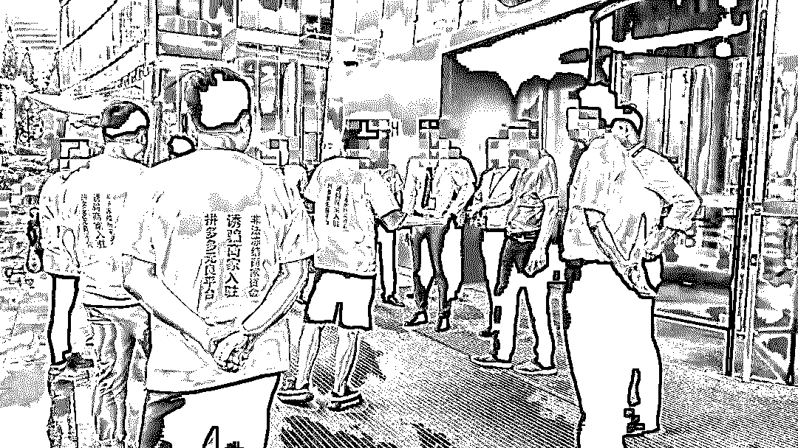**

****拼多多商家到拼多多总部维权****

**搞得大家都在吐槽，拼多多是业界首创靠商家罚款作为盈利模式。**

**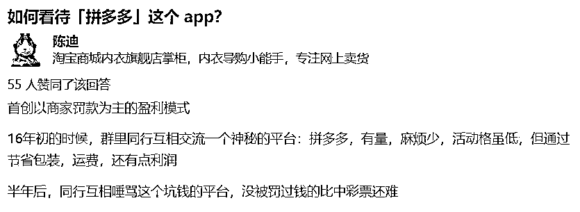**

**经过两年半的野蛮生长，手握微信海量流量，拼多多却也是虱子缠身。**

**▎负面新闻这么多还这么火？它比你还懂你妈想要什么**

**就算负面一抓一大把，但不可否认的是，大家依旧会在拼多多上抢的不亦乐乎，热火朝天。**

**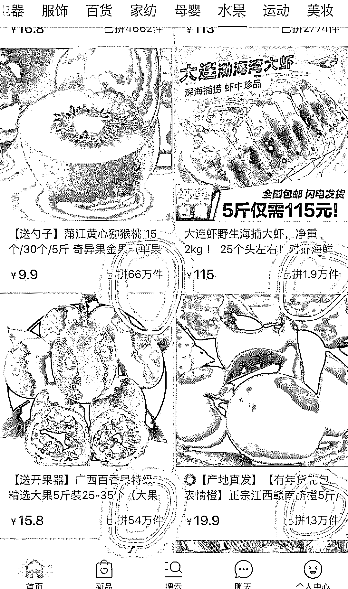**

**因为它真的太懂人性，太抓人心了！**

**比如，它懂得每个人都有点贪婪心，爱占小便宜。**

**拼多多勾住的就是那部分想贪贪小便宜的用户，比如咱爸妈，比如学生党。**

**一看 20 块包邮、Nike 才 100 块就不管好坏，更不会去细想这些商品其实拿走了更值钱的私人信息：收货地址、人名、手机号等。**

**这些信息每条能在黑网上卖 0.5~3 元，一不小心就赚的盆满钵满。**

**其次，天猫京东上不去的地摊货总归需要处理，所以商家们即使被罚钱也前赴后继，你好我好，唯独用户不好。**

**再比如，用熟人社交做最简单粗暴的 “拉客”。**

**微信上都是熟人，拼团都是一个拉一个，朋友买啥你就买啥。**

**有的东西你明明不想买，碍于面子你只能帮忙，既然开了团你就会让别的朋友再帮你点，病毒式传播就是这么来的。**

**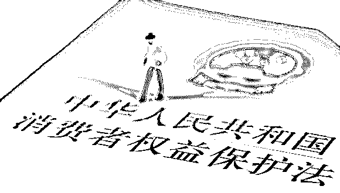**

> ****三. 拼多多是如何盈利的？****

**拼多多的链接一直不断刷屏在我的朋友圈，堪比微商刷屏大法。**

**大多都是以**“低价”“组团”**等字眼吸引消费群体的关注**

**直到今天，我在微信群里收到这么一张图片：**

**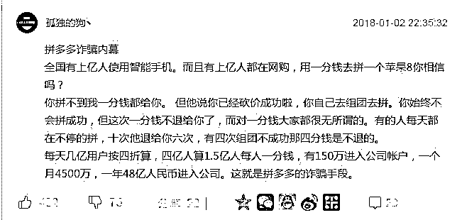**

****（情况未知属实，建议大家三思）****

****接下来我就来扒一扒拼多多是如何盈利的****

****1\. 消费降级 用户倍增****

**app 成立到现在仅用了不到两年半的时间，其日销售订单已超过京东。如此惊人的数据，绝对是电商界的后起之秀。**

**用户达到 2 亿，月活用户半年翻番，销量不断破纪录。**

**可它还有另一面——网友直言不讳地在各种社交平台吐槽拼多多**「垃圾」****

****「诈骗」**。**

**中国电子商务研究中心发布的数据显示，2016 年拼多多投诉量跃居行业第一，高达 13.12%。**

**是电商的新模式还是垃圾骗子网站？在还没被推上风尖浪口的平静时刻，拼多多正在黑白对立式的争议中继续前进。**

****2.用户追求低价****

**在拼多多里很容易看到这样的东西：**

**3 元的抹胸内衣、7.7 元 10 条的内裤、8.8 元的加绒打底裤，还有“9.9 特卖”、“品牌清仓，一折起”......**

**我在网上了解到，这类超低价商品利润空间只有一两块钱，甚至完全没有利润，但可以做引流款——用户被超低价吸引过来，未必真买，但却有极大可能性购买页面中推荐店铺相关商品。**

**商家还在引流款上动手脚。同一件帽衫，正常价格是 28.6 元，商家把引流款的价格压低到 19.7 元。**

**正常情况下，商家会把一单的利润维持在 5~7 元左右，引流款的定价介于微赚和微亏之间。但服装类引流款的猫腻在于尺码，这件帽衫 19.7 元的只有一个 2XL 的尺码，大部分人穿都不合适，而正常售价的尺码齐全。**

**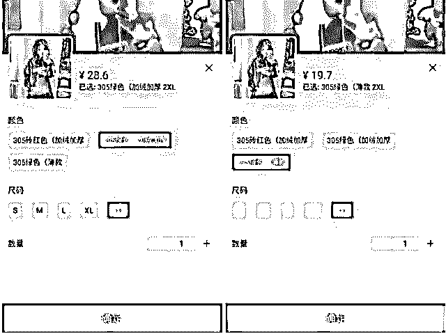**

**在某宝和镜头的双巨头竞争格局下，如何能在短时间内突出重危？拼多多能够迅速抓住用户的关键在于社交和低价——让价格低得有些不合理的商品通过用户分享、拼团在微信里自发传播，那些愿意为找低价商品付出时间的用户“中招”了。**

**根据极光大数据显示，这些用户里女性占其 70%，65%来自三四线城市，与京东形成了鲜明的对比。**

****3.低价商品从哪里来****

**有从事服装行业的朋友告诉我，服装的生产加工环节是没法省钱的，能够降低价格的方式只有压缩流通成本。**

**比如一条成本 70 元的牛仔裤，在某宝定价 140 元，就有了利润的空**

**间。**

**但在拼多多上，一条牛仔裤仅需 20-30 元不等，这比制造牛仔裤的成本还要低？**

**所以这些货源是来自哪里的？**

**这样如此低价的货源，一般来自以下几个渠道：**

**第一，商家压了很多年的库存。商家开始以微利或者成本价清库存，但清了很多年都清不掉，急需资金回笼，已经是卖 10 块钱就回来 10 块钱的心态。**

**第二、工厂生产贴牌服装剩下的面料，加工成服装。这部分面料没有成本，成本只有工人的工钱。但这样加工出来的服装，同一款式的不会特别多。**

**第三、面料生产商生产出来的面料不合格（存在甲醛超标等情况），采购客户不要了，低价处理给工厂。这类面料一般都按斤卖，核算到一件衣服的成本，只有几毛钱，也相当于没有面料成本。而且，这样的面料很多。**

**但是消费者对平台的信任，就是这样一步一步崩塌的。**

> ****四.拼多多“0 元购”真的是 0 元购嘛？****

**从我们耳熟能详的“拼多多，拼的多，省的多...”广告语，到朋友圈“砍价 0 元购”的狂热活动，拼多多就这样“入驻”了我们的生活。**

**尽管拼多多热度已有略减的趋势，朋友圈的“砍价 0 元购”热度却丝毫不减。**

**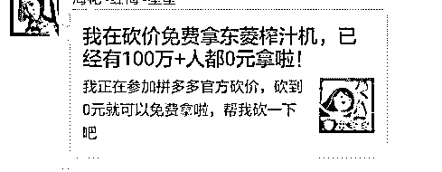**

**从活动刚开始的半信半疑到乐此不疲，朋友圈“砍价免费拿”的链接消息一条接一条。网友不禁感叹：“拼多多还能赚钱吗？”答案是肯定的，只是营销模式在我们眼中不太相同而已。**

**“砍价免费拿”究竟能拿到东西吗？**

**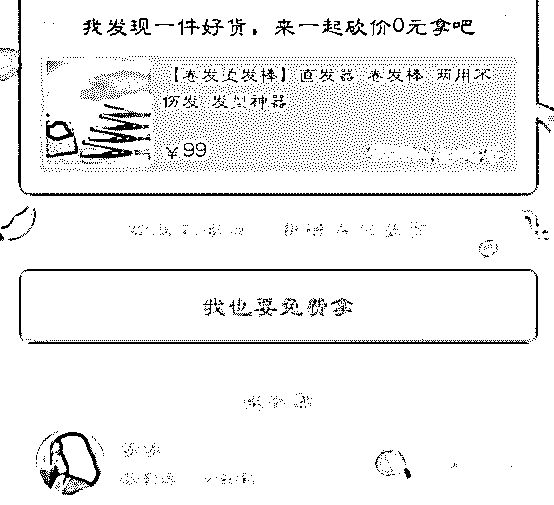**

**确确实实已经有很多人收到了东西，也没有付邮费的坑，不过过程是十分痛苦的呀~**

**刚开始砍价的时候，朋友帮忙一刀能砍十几元，甚至几十元，心中暗暗笑出声，没几刀就能成功了。**

**但朋友帮忙砍价越多，越看不下去，就在还剩不多的时候，每一刀都是几毛钱，甚至几分钱。**

**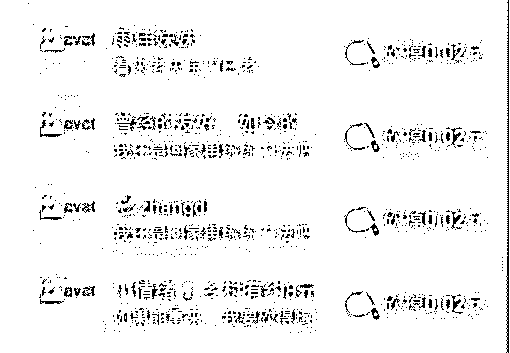**

**本来一刀能砍完的价，却分了几十次！**

**当然，这么简单让你拿到东西的话，拼多多不是“很亏”吗？ 这就是拼多多的策略了，知名度当然是越高越好~**

**调皮的网友放话：“没帮我砍价的都在黑名单了！！”**

**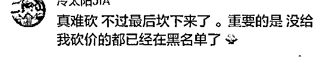**

**拼多多葫芦里卖的什么“药”？**

**拼多多的免费还包邮政策吸引了大量的用户，在人们看来“赔钱”的买卖，在拼多多的眼里却未必。**

**相信大家都经历过支付宝“集五福”活动，支付宝用几个亿的价钱换来无数个用户，而拼多多的策略也大同小异。**

**拼多多是通过“0 元购”来吸引用户。**

**再依托于微信这个大平台，微信用户涵盖范围广，各个年龄层的人都会为“0 元购”前仆后继，一传十十传百，朋友圈里的拼多多可谓是炸开了锅。**

**据统计，拼多多至今 2 年半的时间里，已经吸引了 3 亿的用户。**

**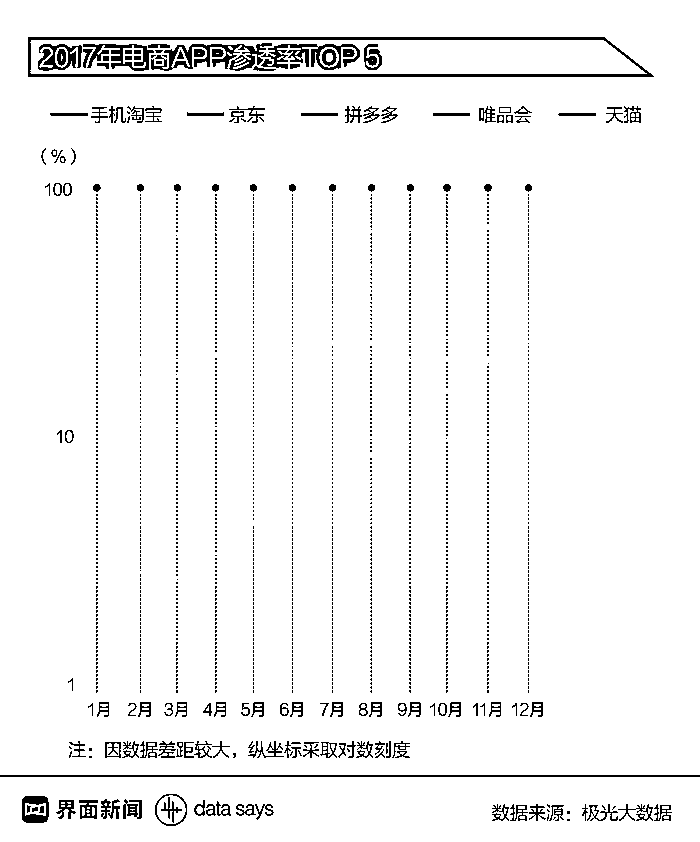**

****附：拼多多在 2017 年的电商渗透率****

**在“砍价免费购”的强大吸引下，拼多多的用户骤增。**

**而在拼多多看来，用几个亿的产品投入换来几个亿的用户，无疑是划算的。**

**“0 元购”背后的故事**

**“0 元购”的商品多种多样，基本每种产品都有 0 元购的机会，价格当然也是层次不齐的。**

**从便宜一些的饰品、用具，到价格昂贵的电饭煲、榨汁机甚至手机都有“0 元购”的机会， 但价格越贵需要砍价的人也越多。**

**根据经验保守估计 500 元左右商品需上千人砍一刀，200 元左右的商品需要 200~300 人砍一刀，100 元以下的商品则需要 100~200 人左右砍一刀，这是考验人脉的时刻到了啊！**

**但“0 元购”的商品究竟值多少钱？**

**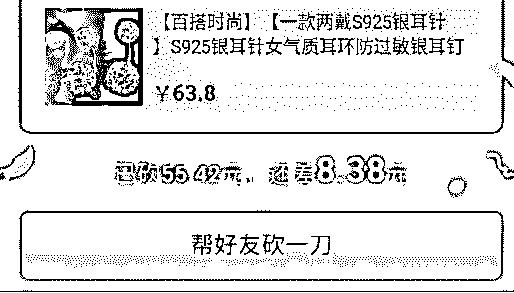**

**可以看到这款耳钉在“0 元购”的标价是 63.8 元，那么同款到淘宝里看的话，呃...**

**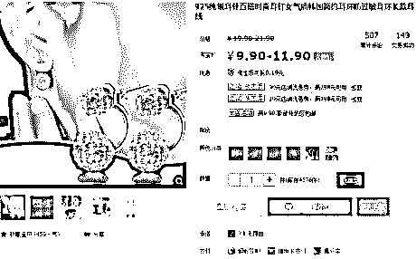**

**其实也就是 10 元左右的价格。如果砍价成功了，拼多多用 10 元的成本换来上百的用户；如果砍价失败，拼多多则免费换来数十个用户，毫无疑问这场买卖是很值得的。**

**这是一场调集朋友圈人脉的战役**

**拼多多的策略不能说高明，但确实是有效的。从拼多多的用户数据增长来看，已经达到了最初始的目的，拼多多也已经大张旗鼓的进入了消费者的生活中。**

**对于消费者而言，这场调集朋友圈人脉的战役，要顶着被好友们嫌弃的压力，要么成功拿到战利品，要么可就是“功败垂成”啦~**

> ****五.问题凸显：拼多多投诉量高居保守****

**成也萧何败萧何，低价、低门槛成为拼多多吸引用户和商家的神器，同样也带来“硬伤”。**

**据中国电子商务研究中心发布的数据显示，2017 年拼多多投诉量位居行业第一，高达 13.12%。**

**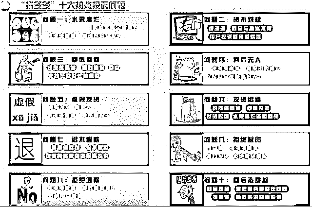**

****图片来源：中国电子商务研究中心****

**被用户投诉的问题则主要有两大类：其一是商品类，如水果腐烂、疑似售假、货不对版等问题；另一方面是商家服务类，如商家虚假发货、售后无人、发货迟缓、售后态度差等问题。**

**用户投诉矛头直指商家运营不力，但其背后原因却没这么简单。**

**打开拼多多 APP 可以看到，多有商品直接标明售价“全网最低”，以吸引用户购买。手机销售页面商品甚至打出了“比 JD 低 600”的醒目 logo。**

**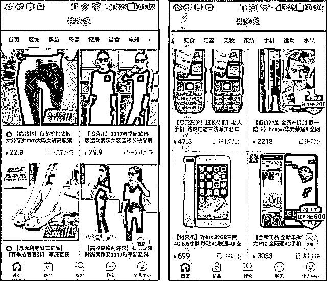**

****拼多多 APP 截图****

**拼多多已经实现了日订单量超 300 万、月销售额 30 亿的销售数字，但其客单价却还不到 30 元。**

**打着低价标签的拼多多，似乎掌握了这样的规则：依靠低价短时间内抓住的大量用户，同时也具有低忠诚度，一旦更低的价格出现，用户将再次迅速转移。**

**亏本的生意没人做，更何况每样商品动辄十几万的订单量。一面需要配合平台的低价策略，一面要吸引直奔“低价”而来的消费者，商家也不得不选择以降低商品品质、降低服务质量的方式，压低商品成本，以微薄客单利润实现“低价量大”的标准。**

**所以就导致了拼多多的产品注定是低质量服务差无保证的产品。**

> ****六.结尾：****

**曾经，拼多多把自己定位成电商界的 Facebook，比淘宝京东多了不少人情味，让大家在买买买的时候互相在群里交流经验。**

**结果社交的属性渐渐变成了拉人一起入团买东西。**

**人情味淡了，钱味就浓了。**

**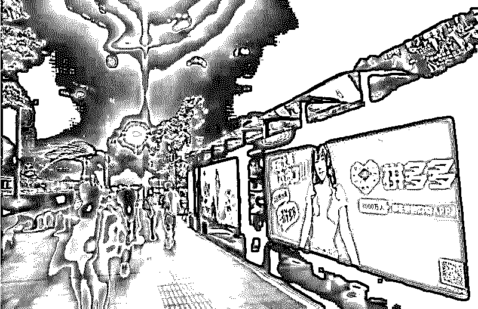**

**其实我们都想在拼团群里多和大家互相安利好产品，都想在微信上叮嘱长辈多加衣服多吃水果时，直接把一个芒果红枣的链接发过去。**

**即使贵一点也没关系，你为什么不再多完善一把呢?**

**马云曾说：“为什么我有运气走到今天？我觉得我可能是看懂了人性。”**

**拼多多，看懂的人性，可能真的跟马云不是一面。**

**世上的聪明人太多，却不断在犯错，挑战人性、忽略规则，那口碑，咱还要不要了？**

**看了这篇的文章**

** 我最后再问你一遍：**

****“9.9 元还包邮的东西，你敢用吗？”****

* * *

********

******点击加入【灰产圈】高端社群******