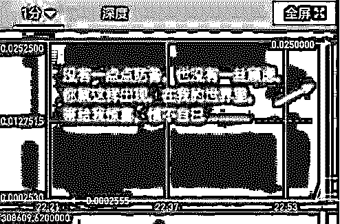
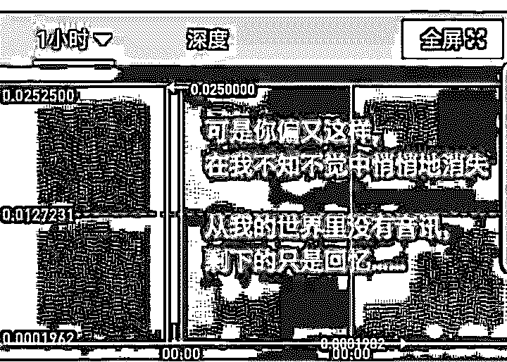
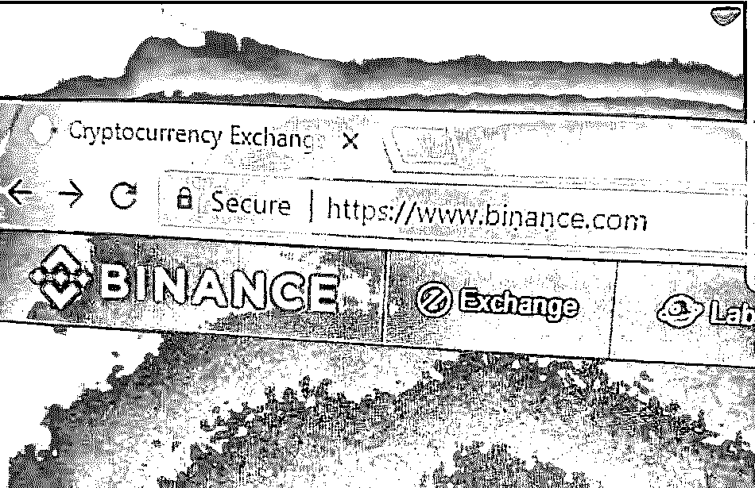
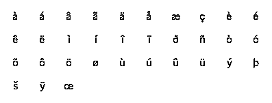
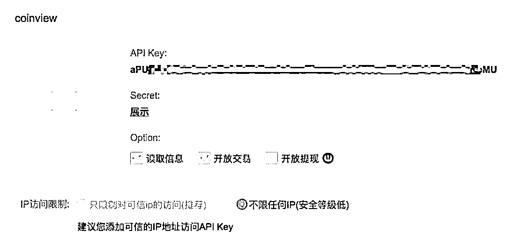
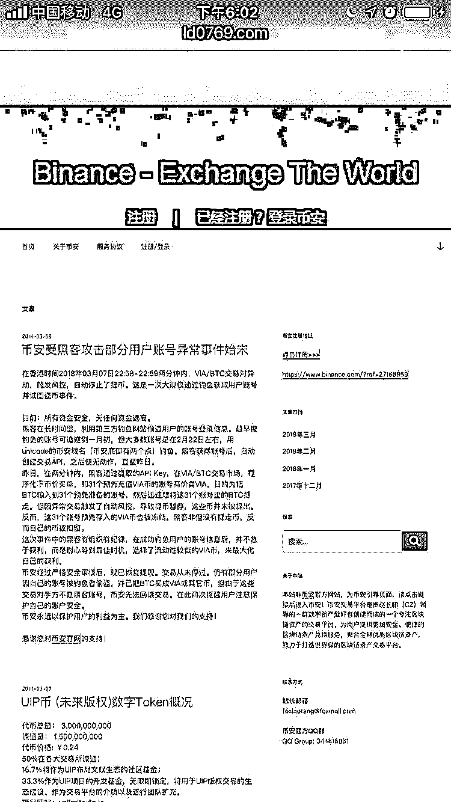
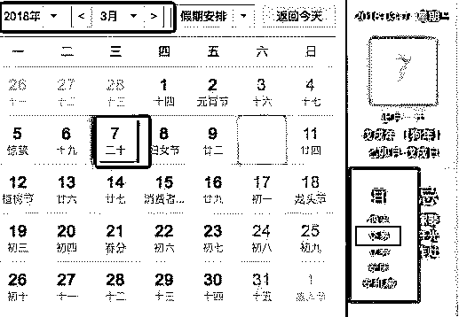
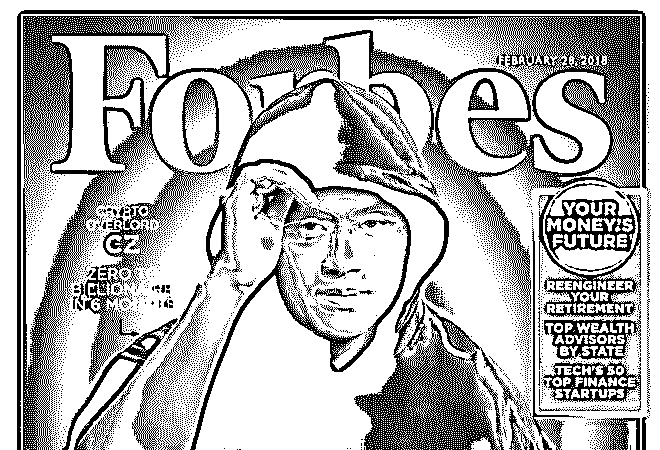
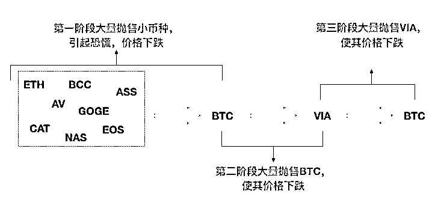

# 深度|币安网与黑客的史诗大战：差点被盗几亿元，场外做空比特币又获利几十亿！

> 原文：[`mp.weixin.qq.com/s?__biz=MzIyMDYwMTk0Mw==&mid=2247490809&idx=1&sn=ef29c8706a01a98c314bbf528465a328&chksm=97c8d7c1a0bf5ed799e12c8d1f2b18e8e2183cc0d2dc05ff9fc8c36ee8e83602a8f38cd42468&scene=27#wechat_redirect`](http://mp.weixin.qq.com/s?__biz=MzIyMDYwMTk0Mw==&mid=2247490809&idx=1&sn=ef29c8706a01a98c314bbf528465a328&chksm=97c8d7c1a0bf5ed799e12c8d1f2b18e8e2183cc0d2dc05ff9fc8c36ee8e83602a8f38cd42468&scene=27#wechat_redirect)

********

> **导语：**

3 月 7 日那晚的币安网黑客事件，或许能够载入史册：涉案资产价值高达十几亿元，黑客精心策划数月，还运用了金融领域的专业知识。

事情发生后各大媒体争相报道，然而大部分充斥着“拉盘”、“做空”、“场外”等金融领域的专有名词，不少人看完后却表示不明觉厉，实际上是一脸的懵逼。

作为一个网络安全科普媒体，我决定用简单语言把这个故事再再再讲一遍！

在这篇文章里，我不关心币圈的那些事和币价的涨跌，只想让大家讲明白，**幕后****黑客在这个过程中到底是做了哪些事。**

**前情回顾：[深度| 3 月 7 日，黑客奇袭币安网：比特币大跌 10%.市值下跌 170 亿美元，黑客获利 10 亿美元！](http://mp.weixin.qq.com/s?__biz=MzIyMDYwMTk0Mw==&mid=2247490548&idx=1&sn=92808001fb168587f3144fd306266e89&chksm=97c8d0cca0bf59da4a0abb444a7714621e34c813f6f38435733c41493f32c4b3701da414c350&scene=21#wechat_redirect)**

**简单叙述：**

3 月 7 日上午，有媒体发表了《庄家杜均》一文，文章指出金色财经创始人杜均是区块链加密数字货币交易市场的庄家，利用承销商、证券媒体以及坐市商三位一体的身份加持，操纵币价，收割韭菜， 并揭秘了其背后的产业链。对此，当时下午，杜均回应称：希望今后能在接受采访后再上头条，而不是被“缺席审判”。

随后，火币网创始人李林在朋友圈回应称，火币网是杜均成立的节点资本股东，但是节点资本投资的 ICO 项目大部分没有在火币 Pro 上市，杜均本人没有参加火币 Pro 的任何业务。

这家全球排名前五的交易所，一时间被推到了风口浪尖，在公众将目光聚焦在火币 pro 的 3 月 7 日深夜，全球第二大交易所币安遭遇黑客袭击，大量用户的账号被盗，用户手上的加密货币被抛售，提现一度遭到终止。

在社交媒体上，币安的惊魂一夜似乎让很多人都没办法入睡，大量的讨论围绕着币安遭遇黑客攻击事件。3 月 7 日晚，部分币安用户发现自己账户中的代币被抛售，即时交易为 BTC。这导致一些不明就里的散户投资者加入到抛售大军中，数字货币价格大面积下跌。随后，黑客操纵盗取账户中的 BTC 大量购买一个名叫 viocoin(VIA)的数字货币，致使该货币价格大涨。此后币安方面中止了一切交易币种提现，表示在调查“未经授权的市场抛售。”

> **一，老王深夜发现小币种“VIA”2 分钟价格翻了 100 倍**

3 月 7 日晚 11 点，老王伸着个脖子，直勾勾的盯着电脑屏幕，垂涎了三尺有余。

他不是在看成人小电影，而是盯着虚拟币的行情。**半分钟之前，他发现了一个****异样情况****。**

名不见经传的小小币种 “VIA” 忽然的“**诈尸**”，价格走势**从原本近乎水平线突然变成了垂直线**，短短的 2 分钟价格翻了近 100 倍！

老王的账户里恰好有价值一万多元的 “VIA”币，随着这轮的暴涨，**一万元价值瞬间就变成一百万元**，单车变宝马，幸福来得太突然了，没有一点点防备。

正当老王打算卖出这些币的时候，犹豫之间，半分钟时间不到，价格又像跳水一样掉回原来价格。宝马瞬间又变回了单车。

老王突然懵逼了，谁能够想到，这场激动人心的高潮是来得快去得快，**从开始到结束就两分钟**，开始了么？已经结束了！脱裤子都不太够。

除了老王之外，不少的网友还发现更诡异的现象：他们的账户就像**闹鬼一样**，里面的所有币种统统变成了“VIA”币！！而他们却是压根没有动过。

有人还以为是币安交易所的网络出现故障了，他们根本没有想到的是其实是黑客在暗中作祟。

> **二. 真相水落石：出黑客获利几十亿！**

第二天主流媒体炸开了锅，真相慢慢浮出了水面。

早在一两个月前黑客就盗走许多币安网用户的账号密码，他们蛰伏了几十天，目的为的就是 3 月 7 日那晚的突然爆发。

那晚上，黑客交易了总体量超过 10000 个比特币！按照当时的币价，相当于 10 亿元人民币！

**有币圈的资深人士大胆猜测，在这场精心策划的比特币大案中，黑客可能的获利多达几十亿！**

> **三. 黑客做了什么？精心策划的一场游戏！**

**我们来一步步的分析。**

**第一步：Unicode 伪装钓鱼攻击**

时间往前拉了一个多月时间。

有不少网友反映他们发现了币安网的一个钓鱼网站，这些网站和真实的网站几乎的一模一样的。如不是网络安全意识很强的网友，几乎是看不出有任何异样。

我们把上图放大仔细的看看，细心的观众都会看到，其中两个 字母  n 下面**多了一个小小的黑点**，就一个像素点那么大。

。。。。。。

。。。。。。

。。。。。。

**这个看起来像是英文字母 n 的图形，并不是真正的字母 n，而是一个小语种文字里的特殊字符。**

翻开输入法符号大全，会看到一堆这样类似字母的玩意儿：

**总而言之，虽然这些字符看起来是那么的相似，但其实和原本字符是木有一毛钱的关系。**

如果你非要说是有什么关系，大概就像卡巴斯基和巴基斯坦的微妙关系 —— 基巴关系。

利用这种类似字符去构建钓鱼网站域名的方法，我们通常称为“ unicode 编码攻击”。

假币安网里也有类似的账号登录框，一旦有小白用户把账号密码输进去，会直接传送到黑客的邮箱里面。做个简单的钓鱼网站，这仅仅是第一步。

但是，黑客即便是拿到账号密码也没用。

因为用户通常给账号加个**二次验证**。像是手机短信验证码、Google 二次验证那样的，**每次的登录都需要输入六位数动态码，以保证账户安全。**

**第二步：绕过二次验证**

**黑客利用币安交易所的一个 API 接口漏洞，成功的绕过了二次验证。**

他们怎么做到的呢？首先说说这个 API 是一个什么东东。

2017 年 7 月，币安发公告，为方便用户，开放自动交易的 API 接口，用来对接自动交易机器人（程序）。

这个接口为每一个币安网用户提供了一个 API Key 和 Secret ，有点像普通用户登录认证用账号和密码。

不同的是，API 的接口就类似于一个电插头，一旦交易机器人填上 了 API Key 和 Secret 成功完成对接，成功验证一次，**之后的交易就都不再需要账号密码和二次验证，就会一直连着。**

原本，用户已经设置了二次验证，淡每次登录以及进行重要操作都需要输入这么个动态验证码，**即便是账号密码不慎被泄露，但也不用不担心账号被黑客所盗用。**因为黑客不可能每次都能拿的到那串 6 位数字密钥。

**但是恰恰是这个接口的出现，让黑客有了可乘之机！**

然而，登录和设置 API 接口都需要使用动态验证码，黑客就需要连续得两次拿到，才能拿到所有接口设置。

**但是黑客是可以这样做的：**

当小白用户在钓鱼网站上输入了账号密码，钓鱼页面再次弹出一个六位数验证码让他输入框。此时的用户并未察觉异常，继续输入自己的动态验证码。

**窗口会友情提示：验证码输入错误，请用户重新获取验证码并输入！**

**到这时请注意，这一步的操作很关键。因第一次获取用于对接自动交易机器人 API Key 和 Secret ，也是需要二次验证的。**

虽然钓鱼网站是提示用户的验证码错误，但这串验证码其实是对的！黑客已利用这串验证码和密码登录账号，进入了 API 对接的界面！

此时用户很可能会误以为自己真的输错了，于是重新获取并输入了一次。

这样的话，黑客就能拿到两次的动态验证码，并顺利的**把自己的交易机器人对接上去。**

在整个过程之中，在用户那端是毫无征兆的，除非他是发现字母 n 下面有多出来的小黑点。

**第三步：广撒网屯账号，集中爆发**

黑客盗取了账号后并没有立马提币，也是提不出来的，因为提币还需要额外的一道“交易密码”和一次动态验证码才可以提现。

于是乎，**黑客就开始想尽办法的囤积大量账号，就是为了攒一次大爆发**。

在 12 月以后，大量网友反馈遭遇钓鱼网站的情况是越来越多。

甚至是，这些钓鱼网站还在 google 百度等搜索引擎购买了广告位，只要是人们搜索了相关关键词，这些钓鱼网站就会出现在醒目位置，勾引他们入坑被盗号，这波操作也很 6！

由于黑客的钓鱼网站撒网大行动太过于密集和嚣张，在 2 月初币安 CEO 赵长鹏就忍不住了，在社交媒体：推特上向谷歌不断喊话，**指责它允许钓鱼网站购买顶部的广告位，并连续警告投资者要对搜索结果多多的留意。**

但是这似乎没起到鸟用，仍然是有不少币安网的用户被黑客网络钓鱼。

钓鱼网站能嚣张到什么样程度呢？——直到今年的 3 月 7 日，币安用户账号遭受黑客的攻击事件之后，不少钓鱼网站却是依然的存在，甚至把币安关于这件事公告也同步了上去：

就是这样的手段，黑客利用了广撒网的钓鱼网站，一时间囤积了不少的账号。

这些账号里面的虚拟币总价值，价值竟然高达十多亿元！

**第四步：交易，提币，离场**

**3 月 7 日，宜交易。**

黑客蛰伏了几十个日日夜夜，终于是在那天晚上接近 11 点的时候突然行动了！

虽然偷来的账户里价值十多亿价值的虚拟币不能直接提走，但却能交易呀！

于是乎黑客就自己准备了多达 31 个账号，花了自己的钱大量买入单价很低的小币种 “ VIA ”，再用 100 倍的价格挂单出售。

**不能直接拿走你账户的钱，那就卖一个天价的商品给你，把钱“赚”到自己的账户上，可见黑客真的是精明！**

在当天 22 点 58 分时，黑客用盗来的大量账号在自动交易机器人控制下同时行动起来，先按照市场价把他们账户的小币种全部的兑成比特币，再用这些比特币以很高价格从那 31 个账号里买入原本不怎么值钱的 VIA 币 。

值得注意的是：在这个过程之中，BTC 是起到**中间币的作用**，因 VIA 不能直接跟别的小币种来兑换。

这就出现了文章开头那一幕……短时间大量的买入，供不应求，导致 VIA 的价格蹭蹭的往上涨！

按照正常剧情发展，VIA 币达到最高点时，黑客将手里的 VIA 币全部卖出，就可以拿到比特币，提币离场就行，因为卖 VIA 的这 31 个账号是黑客们自己控制的。

> **四. 币安网 CEO 赵长鹏亲自出马平息战场**

然而，这一系列疯狂炫酷吊炸天的操作引起价格的波动触发了币安的风控系统，提币操作被系统拦截住了。

币安网 CEO 赵长鹏也是技术大牛出身，安全风控也不是盖的。

**币安 CEO 赵长鹏 ，曾任彭博社技术总监。**

或许是为防止黑客把这笔钱交易到其他账户上，没过多久，币安交易所就停止了所有币种的提币得操作。**到此为止，无论是黑客盗取来的账号里面的钱，还是黑客自己那 31 个账号里面的钱，全部都被币安控制起来。**

深夜 2 点半，赵长鹏在 Twitter 上发言称，**“所有资金一切安全，黑客并未劫走资金。”**

他还说，**“黑客在此次攻击中损失了不少货币。充值、交易和提现都已经恢复。我们会将把这些币捐给币安慈善。”**

**以下为币安的后续回应全文：**

黑客行动宣告失败，难道偷鸡不成蚀把米？或许是，但或许也不是。

真实情况只有赵长鹏和黑客知道吧..

> **五. 后续调查 ：黑客的局中局，碟中谍！**

有人就很快指出，**黑客很可能用这一失败得操作做幌子，真实目的其实是场外操作获利！**场外操作是什么意思？这里用刘德华主演一部香港电影解释一下。

在片中，刘德华对战上一届的赌神，大获全胜之后就扭头而去，深藏功与名。正当所有人以为赌神输了，一个配角凑到赌神耳边被曝出真相：

原来赌神早早就在赌局之外下重注**赌自己输**。虽然那场赌局他是输了，却在外面赢了一场更大赌局。这就是“场外操作”。

**黑客交易操作都在币安，获利却是在了别处。**

除了币安网，还有 9 个交易所也上线了 VIA。币安上面的币价涨跌会影响到其他交易所价格，当黑客大量买入 VIA 币时，实际上拉高了所有交易所中 VIA 币 的价格。

有人就大胆的猜测，黑客很可能提前在其他交易所大量买入 VIA 币 ，等到 VIA 价格被拉高 100 倍时大量的卖出，这样他们资产就能变成原来的 100 倍。

甚至是，

他们很可能用更的复杂“做空”手法。

所谓“做空”手法，最简单解释是，**如果你能预测一个东西即将要降价，就提前去借来这个东西，卖掉它，等它的价格降了再买回来，赚取价差。**

简言之，**能准确预测某种币价是要下跌的，就有办法从中获取暴利。**

黑客在那天晚上人为制造出了下跌的行情。

刚开始，黑客先把盗来账号里大量小币种全部的抛售，兑换成了比特币，短时间内大量的抛售引起其他用户恐慌，不少的人也跟着抛售那些小币种虚拟币，大家争先恐后的卖出，引发币价的进一步下跌行情。

然后就是，黑客把大量 的 BTC 兑换成了 VIA，同样的引起 BTC 对 VIA 价格下跌，这是第二次做空机会。

最后就是，黑客再次把自己 31 个账号里买入以及借来的 VIA 币（注：交易所提供的“杠杆”交易可以简单理解为借）大量的卖出，让 VIA 币价格从 100 倍跌回之前水准。

总而言之，在这整个操作过程中，黑客的多次人为影响了各种虚拟币价格涨跌，从中获利，把“黑客技术 + 庄家割韭菜” 玩法被发挥的淋漓尽致。

而这种局外的操作，很难会被风控系统发现有异常。

黑客影响币价所有行为都是在币安进行得，真正赚钱操作在其他交易所那边看来，都是正常交易的行为！

但是！！

**目前这种“黑客+做空”的手法只是吃瓜群众们的大胆猜测，并无实锤表明黑客真的是这么干了。**

**另外一种说法：不少吃瓜群众也认为会不会是币安平台“监守自盗、嫁祸给黑客”，或是币安对自己平台的一次“炒作营销”。**

**对此，有媒体第一时间采访到币安联合创始人何一。**

她表示，首先，在整个（币安）交易平台出现的历史上，还是第一次出现平台受到大规模攻击，因为币安的安全壁垒高，所以一个币都没有丢。

其次，尽管一个币都没有丢，币安在短时间内还是被“黑出翔”。

币安没必要以摧毁自己的信誉去做营销，更不会动用平台账号去坐庄，发布和传播这种言论的网友都没有经过深思熟虑。

再次，国内声讨之声空前壮大，一则之前（币安）拒绝上很多国内的币，得罪人太多，二则某些自媒体为了红而编撰故事；三则（虚拟）币价跌总要有人来背锅。

最后，涉及账号没有一个在亚洲地区，和钓鱼网站投放渠道在海外有关。

即便这样，潘多拉魔盒都已经被打开了，即便这次的“黑客割韭菜”只是吃瓜群众大胆意淫出来的，未来也一定会被别的黑客变成为现实！想想都觉得恐怖！

> **六. 前车之鉴：有没有办法能防止这种攻击?**

其实之前也有，比如大型交易所之间的共享威胁情报，当某个交易所发现了特大型的安全威胁，直接通知到其他的几个交易所，暂停提币并且调查可疑得账号，能大幅降的低这类威胁。

或者是，其他交易所同时配合调查，也可能顺藤摸瓜找到黑客。比如是当币安的 VIA 价格涨到最高点时，挂大单卖出 VIA 币账户里，黑客一定就在里面。

不过是从实际的情况看来，**各大交易所之间是相互竞争的关系，共享威胁情报是很难做到的，配合调查也是不太可能的。**

所以作为普通的用户，我们能做到的，也最有效的是，多关注一些网络安全知识（比如关注灰产圈），同时也是提高自己安全意识吧！

起码是，看完这篇文章，以后你从搜索引擎进入网站时，要更加的留意 URL 网址了。

实在不行就凑近点，其实没关系的。

**。。。。。**

**。。。。。**

**。。。。。**

****

* * *

**【灰产圈】高端社群小程序开通，2018 最值得加入的社群！** 

<mp-miniprogram class="miniprogram_element" data-miniprogram-appid="wx4f706964b979122a" data-miniprogram-path="pages/topics/topics?group_id=881854415822" data-miniprogram-nickname="知识星球" data-miniprogram-avatar="http://mmbiz.qpic.cn/mmbiz_png/kialtkOXGKS7D9hZrmO2jzDqryXXTAlhxSpnrKnHGV65KXzicibOppaPic4dCRxftvabB8Iqswo3OuQEDSxE7NicXBg/0?wx_fmt=png" data-miniprogram-title="【灰产圈】高端社群" data-miniprogram-imageurl="http://mmbiz.qpic.cn/mmbiz_jpg/WWG78hysZ0brJkWoyG2VDIacqgQjkDfp6mLiaoPBJ2SgWZHtRuTw7ia8kpoxntsn7PiaFOQO2U23FW6Iry0gS1GnA/0?wx_fmt=jpeg"></mp-miniprogram>

**点击加入【灰产圈】高端社群**