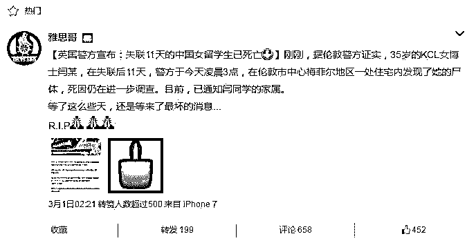
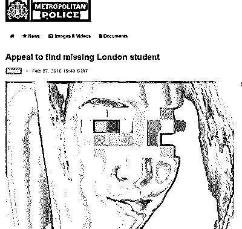
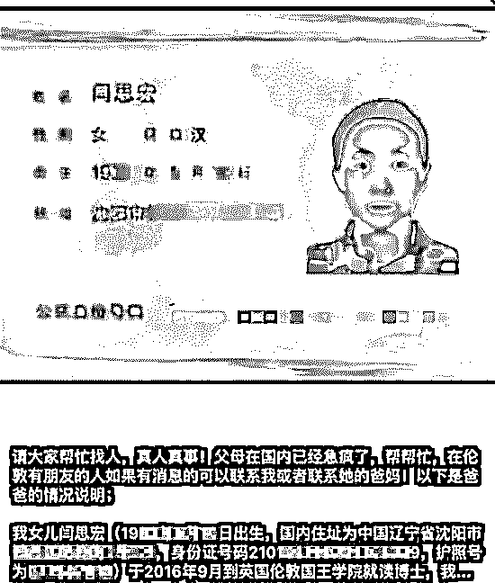
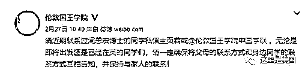
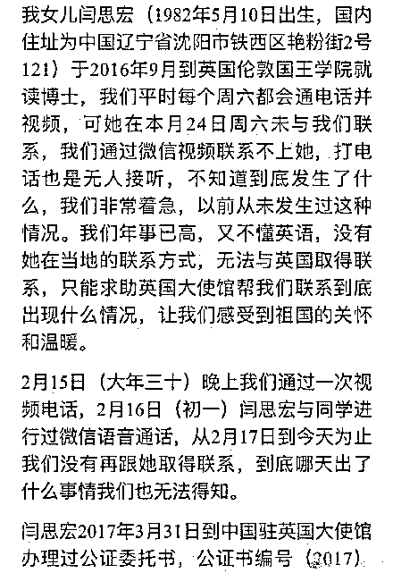
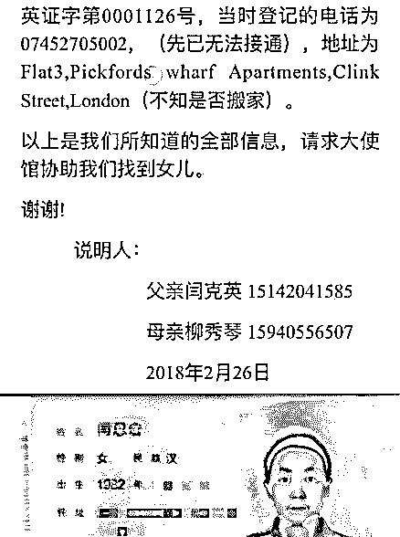
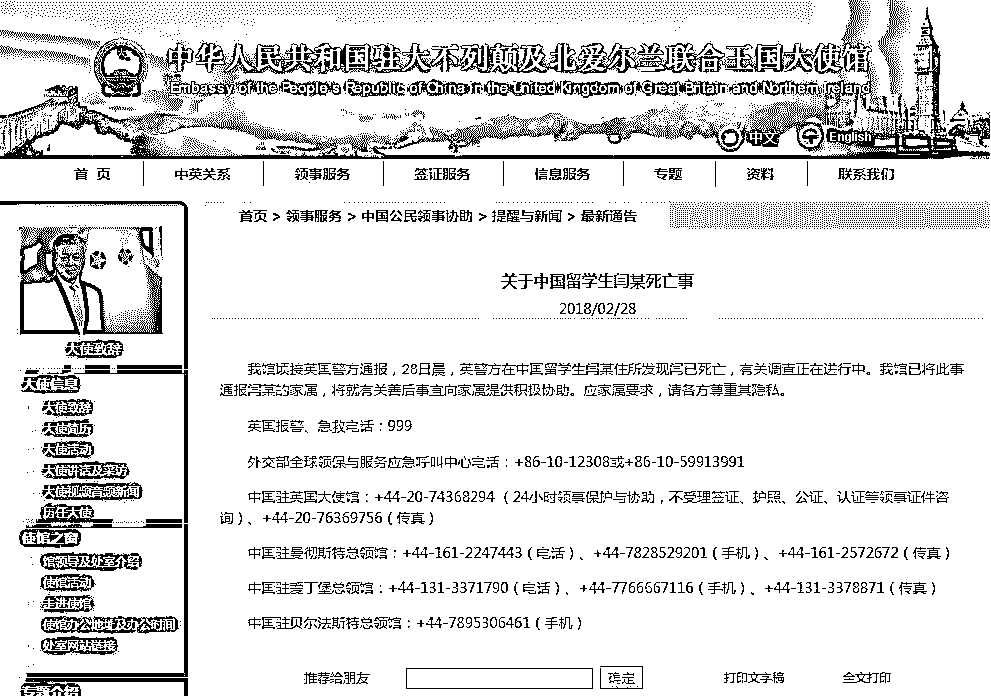

# 深度|伦敦失联女博士死亡，这个世界还有一些你看不到的黑暗！

> 原文：[`mp.weixin.qq.com/s?__biz=MzIyMDYwMTk0Mw==&mid=2247490726&idx=1&sn=fb4d3b08252261e0c1fc3fc7d64b2f86&chksm=97c8d79ea0bf5e88030154b37fe90229e5d2b42a5871b614fe31b7f7d9b60d04ebaddf72e580&scene=27#wechat_redirect`](http://mp.weixin.qq.com/s?__biz=MzIyMDYwMTk0Mw==&mid=2247490726&idx=1&sn=fb4d3b08252261e0c1fc3fc7d64b2f86&chksm=97c8d79ea0bf5e88030154b37fe90229e5d2b42a5871b614fe31b7f7d9b60d04ebaddf72e580&scene=27#wechat_redirect)

> **导语：**

近日，中国女留学生闫某在英国失联的消息备受关注。2 月 28 日，中国驻英国大使馆发布消息称，接获英国警方通报，当日早晨在闫某住所发现其已死亡。

**微博大 V 雅思哥第一时间发布通知**

使馆已将此事通报闫某家属，将就有关善后事宜提供积极协助。此案目前仍有待验尸官正式确认死者身份，并对死因做出判断。

**伦敦警方曾公开发布闫某的寻人启事。**

> **一.事件回顾： 女博士无故失踪，家属向使馆求助**

据中国驻英使馆当地时间 27 日消息，伦敦国王学院一位闫姓中国女留学生从 2 月 17 日至今，已与家属失联十天。使馆密切关注，并呼吁有消息者请联络英国警方或使馆**。**中国驻英使馆当地时间 27 日在官方网站发布了关于伦敦国王学院学生闫某失联事，全文如下： 

**关于伦敦国王学院学生闫某失联事** 

2018/02/27

2 月 26 日，伦敦国王学院学生闫某家属向我馆求助，称闫某近日失联，希使馆协助寻人。在我馆建议下，家属已向英警方报案。我馆已向英警方表达关切并希警方加紧办案，同时协调有关学联协助寻找闫某。我馆将继续密切关注此案，与英警方及当事人家属保持联系。

**从 27 日晚上开始，不少英国童鞋的朋友圈和微博都开始被一条信息刷屏：** 

图片来自微博@伦敦国王学院中国学联 

伦敦国王学院也在微博上发消息，请近期联系过闫思宏博士的同学尽快跟学校联系： 

该名失联女留学生身份确认，为伦敦国王学院女博士闫思宏（英文名： Sihong Yan），辽宁沈阳人，1982 年 5 月 10 日出生，于 2016 年 9 月到英国伦敦国王学院就读博士研究生。身高 158cm，身材中等 55KG，长发棕色/黑色眼睛，近视眼，白天带隐形，晚上带眼镜，本人精通中文、法涪、俄语、英语。

2 月 16 日（初—）闫思宏与亲人，多位国内同学朋友，进行过微信语音通话，视频聊天，但从 2 月 17 日至今，她的三个电话号码均无人接听，家属、朋友、同学，无人能联系上她。

**闫思宏父亲发布寻人求助信息**

现年 35 岁的闫某出生于 1982 年 5 月，辽宁人，于 2016 年 9 月到英国伦敦国王学院就读博士研究生。2 月 26 日，闫某家属向使馆求助，称闫某近日失联。 

　　英国警方通报称，当地时间 28 日凌晨 3 点左右，警方搜查伦敦威斯敏斯特区域的一处住址时发现一具女性遗体，目前对遗体的身份确认正在进行中，不过警方有充分理由相信该死者就是此前失联的闫某。

　　《欧洲时报》记者向伦敦警察厅新闻联络处致电求证得知，目前此案相关情况已经由警方整理并交给验尸官，等待验尸官正式确认死者身份，并对死因做出判断。

　　此外，关于案情，警方据现场情况认为，死亡“没有可疑之处”(non-suspicious)。“可疑死亡”包含自杀、他杀、医疗事故等情况，因此目前暂时排除了这些可能。

　　此前伦敦警察厅官网发布寻找失踪女生的通告已在 28 日上午被撤下。同时这份已经撤下的通告中还提到，已知闫某长期以来存在背部的健康状况，有时候会影响她的行动。

**截图自中国驻英国大使馆网站**

　　就闫某失联一事，中国驻英国大使馆多次发布公告协助寻人。

　　2 月 27 日，中使馆发布公告称，闫某家属于 26 日向使馆求助，称闫某近日失联，希使馆协助寻人。在使馆建议下，家属已向英警方报案。使馆已向英警方表达关切并希望警方加紧办案，同时协调有关学联协助寻找闫某。

　　当地时间 2 月 27 日，伦敦警方在官网上也公开呼吁寻找失踪的中国留学生。警方称，2 月 14 日，该同学在伦敦国王学院的朋友最后一次看到她。

　　2 月 28 日，中国驻英国大使馆再次发布消息称，使馆接到英国警方通报，28 日，英警方在中国留学生闫某住所发现闫已死亡，有关调查正在进行中。使馆已将此事通报闫某的家属，将就有关善后事宜向家属提供积极协助。应家属要求，请各方尊重其隐私。

> **二.  贩卖人口：你所不知道的黑暗世界**

曾经看过一篇文章

或许对在外国的同胞有所帮助

毕竟在这个世界的另一边，还有一些你不知道的黑暗。

文章如下，请仔细阅读：

> **结尾：**

**都以为外国的月亮比较圆，**

**实际上外国的月亮没比较圆！**

**世界上有很多黑暗和残暴的事件每时每刻都在发生！**

**在此呼吁各位出国游玩或者留学的国人同胞！**

**时刻保持警惕，保障自身安全！**

**延伸阅读：**

[全世界最大的暗网被封了，创始人自杀，但章莹颖们仍下落不明](http://mp.weixin.qq.com/s?__biz=MzIyMDYwMTk0Mw==&mid=2247488301&idx=3&sn=248be26e9efb2cbf7f8c43f3c158ef2d&chksm=97c8d815a0bf5103948a3c8b36c0b5535d1be09da5506bf8b0d36586e7d1c690f9e70a338a2e&scene=21#wechat_redirect)

[深度|揭秘隐藏在黑产中的“地下黑市”：深不可测的“暗网”江湖](http://mp.weixin.qq.com/s?__biz=MzIyMDYwMTk0Mw==&mid=2247489454&idx=1&sn=ee4fc633eaecc20e315f874c8e08df6e&chksm=97c8dc96a0bf5580998f159cd576c2aeb0d87ac1721329e1225ab8bffe0ad64fec786fe30add&scene=21#wechat_redirect)

* * *

**【灰产圈】高端社群小程序开通，2018 最值得加入的社群！** 

<mp-miniprogram class="miniprogram_element" data-miniprogram-appid="wx4f706964b979122a" data-miniprogram-path="pages/topics/topics?group_id=881854415822" data-miniprogram-nickname="知识星球" data-miniprogram-avatar="http://mmbiz.qpic.cn/mmbiz_png/kialtkOXGKS7D9hZrmO2jzDqryXXTAlhxSpnrKnHGV65KXzicibOppaPic4dCRxftvabB8Iqswo3OuQEDSxE7NicXBg/0?wx_fmt=png" data-miniprogram-title="【灰产圈】高端社群" data-miniprogram-imageurl="http://mmbiz.qpic.cn/mmbiz_jpg/WWG78hysZ0brJkWoyG2VDIacqgQjkDfp6mLiaoPBJ2SgWZHtRuTw7ia8kpoxntsn7PiaFOQO2U23FW6Iry0gS1GnA/0?wx_fmt=jpeg"></mp-miniprogram>

**点击加入【灰产圈】高端社群**