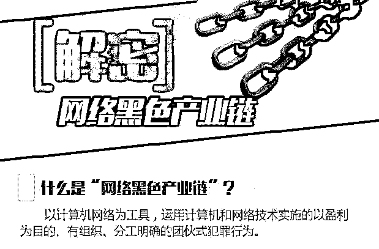
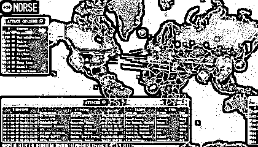
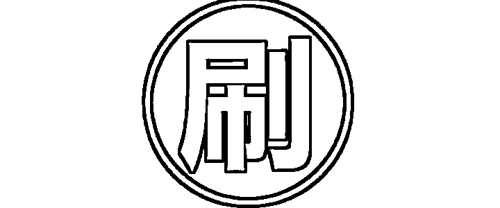
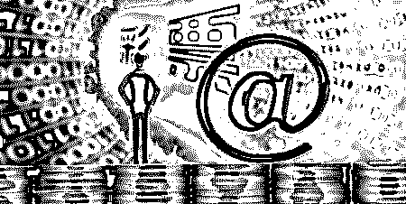
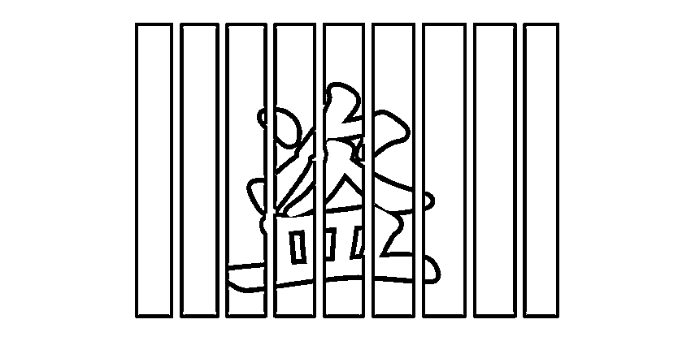
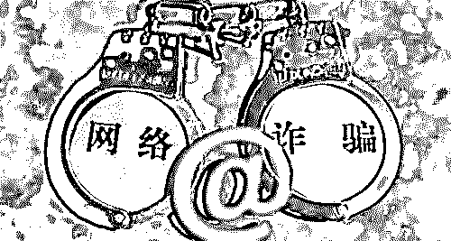
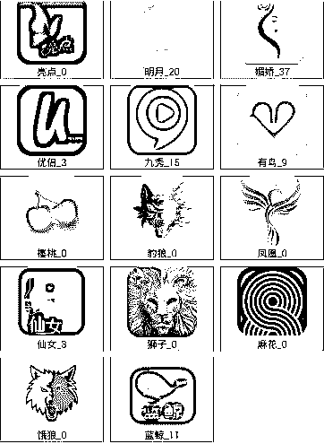
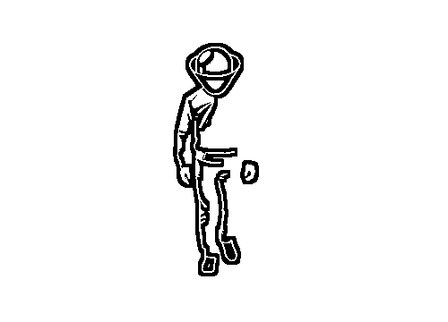

# 2018 年网络黑色产业链大起底（深度调查）

> 原文：[`mp.weixin.qq.com/s?__biz=MzIyMDYwMTk0Mw==&mid=2247490584&idx=1&sn=7759b3a17ae078e290d3767dcc8b38bb&chksm=97c8d720a0bf5e36ca1e4110bb3d6a0ff1fa58eee414146e2da411cb2d18ab247e8940ee8590&scene=27#wechat_redirect`](http://mp.weixin.qq.com/s?__biz=MzIyMDYwMTk0Mw==&mid=2247490584&idx=1&sn=7759b3a17ae078e290d3767dcc8b38bb&chksm=97c8d720a0bf5e36ca1e4110bb3d6a0ff1fa58eee414146e2da411cb2d18ab247e8940ee8590&scene=27#wechat_redirect)

> **导语：**

黑色产业链，归根到底，既然被称为“黑色”，

那么它们所做的、所搞的，就绝非“擦边球”，就是肯定无疑的违法犯罪勾当！

常听说某种网上黑色产业链的说法，只是这些说法多不系统，一直也没有人去对它们进行归类总结。

让人总感觉互联网上多是各种不靠谱的经营行为。实际，这些黑色产业链多有相似关联，真正归纳，也不过几类而已；

“产业链”说法是经济学中一个概念，它的形成，需涉及到价值形成、企业生产、供需关系与时空布局多种因素共同作用。简单说，至少有多家企业，在相应的技术经济关联下所形成链条式关联关系。

而所谓“黑色产业链”，表示这种经济关联是建立在违法甚至犯罪基础上。

> **一、木马病毒产业链：**

这一产业链历史悠久，也伴随着电脑病毒的社会化逐渐成熟。

从最早的兴趣驱使无意制造病毒开始，变成：设计制造木马病毒、交易买入流量推广、传播扩散木马病毒、对中毒用户进行信息窃取、对信息虚拟财产套现多个链条环节，形成一种“暴利行业”。它的赢利模式是：

1，最早制造者开发并制作具有盗号、远程控制、自动传播等功能木马病毒，并根据时事热点设计这类木马传播方式、触发环境，及时针对杀毒软件开发出免杀功能，及时更新维护；

2，提供流量交易环节的人比较复杂，有网络行业内鬼、有无良的站长，同时也有黑客，他们会通过各种手段实施“挂马”为木马病毒提供传播与存在平台及流量；

3，“包马人”是这一产业的核心，他们对上购买木马病毒，对下采购网络流量，实施网络“挂马”之后，开始窃取收获各类有用信息并进行整理，主要是实名信息、隐私信息和各类网络帐号还有帐号内的虚拟财产；

4，最后的环节就是变现，实际许多正规企业 和互联网品牌都有可能涉及这一块。他们会以“大数据分析”为由，采购各类来自于这里个人隐私信息。有更多的会是些诈骗团队甚至是犯罪团伙，采购此类信息，然后进行各种诈骗活动或者是欺骗式营销；

**变种与扩展：**

这一黑色产业中，也有从具体的木马病毒之外，通过人工网上钓鱼或是设计的程序进行撞库尝试手法，同样进行各类盗取帐号行为，再进行整理、“洗号”等手法，最后的环节是出售变现；

近期由于苹果设备流行，更有利用 Apple ID 管理规则为被盗 iPhone 进行解锁服务等等，都可以属于这一大类产业链。

* * *

**详细解读：**[深度|“挖矿木马”大行其道：下载植入数千万部手机，挖矿年产值数亿美金！](http://mp.weixin.qq.com/s?__biz=MzIyMDYwMTk0Mw==&mid=2247490146&idx=1&sn=bd7c4cecc918958660c15e5370913278&chksm=97c8d15aa0bf584c9681beda6f1c17db98defa6ec3f7cac5de8f50680417cda4d585ff905b6a&scene=21#wechat_redirect)

> **二、养号刷单产业链：**

> 

这一产业链包括：养号、刷单和利益变现这三个最主要的环节。

养号这方面有两个来源，一是通过网络招募人来参与，只是这类号的平台非常分散，质量参差不齐，也难以统一调度，越来越不被重视。

眼下真正能够形成市场的是通过定制开发程序和专门的设备，可批量拥有大批的手机号、指定系统的帐号甚至是能拥有很大权限和层别的帐号。

然后这些帐号按照指定规则去生成所需要相关数据和指标，最后拿这一结果来兑换最终收益；

虽说是流程相似，但是在具体实施操作中，会根据刷单目的分为数据刷量服务、奖励补贴盈利和敲诈勒索多种方向：

1，数据刷量服务：服务于淘宝卖家、APP 和自媒体号运营者还有眼下热门的投票评选活动的参加对象。他们的需求是想提升自已的排名、名次、形象，或需要一定的对外展示数据的需求。根据不同平台对于反刷量技术限制，这类的服务都会有对应解决方案，收费标准也不一样；

[**详细解读：**原创|揭秘网络刷单背后不为人知的内幕](http://mp.weixin.qq.com/s?__biz=MzIyMDYwMTk0Mw==&mid=2247485311&idx=3&sn=f627fa1a025b2658ec11a34c91334455&chksm=97c8cc47a0bf45514f88760ea2dad940cef685aec76fae82d615477f479ea5f0e6a0e04f4a0d&scene=21#wechat_redirect)

2，奖励补贴盈利：做这类工作的也称羊毛党。主要针对电商平台、商家促销、媒体自身有奖推广活动，研究规则漏洞和律，以大量养号、密集操作以及快速技术应对，从中赚取大量奖品、兑换券、优惠券或者是直接的返利金额，再将不同收益通过相应道进行变现；

[**详细解读：**深度|薅羊毛黑产攻防实录：“羊毛党”与“攻城狮”之间的博弈游戏](http://mp.weixin.qq.com/s?__biz=MzIyMDYwMTk0Mw==&mid=2247489704&idx=1&sn=fd723f4a71b42686451bce2641707a67&chksm=97c8d390a0bf5a8659576c4f7fa98f6c43942f61a32de88f9818a6f61f990325ba04964294b9&scene=21#wechat_redirect)

3，敲诈勒索：最早是电商平台上的职业差评师。它们会把手中账号养成非常具有说服力的用户正常账号，然后再研究各个大型平台管理规则，有针对性地利用这些平台惩罚机制，大规模的发起各种差评、投诉和恶意的评价行为，借此逼迫被差评对象支付相应赔偿或费用，并从中获取暴利；

[**详细解读：**大揭秘：神秘的 淘宝职业“打假人”  灰色产业链， 年薅“淘宝” 上亿羊毛。](http://mp.weixin.qq.com/s?__biz=MzIyMDYwMTk0Mw==&mid=2247488824&idx=1&sn=87de122c8ffb49dcfd4df5fa1f2872ca&chksm=97c8de00a0bf57168c3c6be6b71fb98b6d0507dc809a04148143cc9044065f1b5bf5c404130c&scene=21#wechat_redirect)

**变种与扩展：**

正规刷单平台，当然只是赚取中间差价，或被他们包装成为管理费。但在现实中，会有许多平台最终会直接吞掉刷单带来所有收益，或者就是假装成刷单平台，利用大家对这一黑色产业链的基本的认知，骗人加入，通过各种方法收费或拿到收入后直接跑路，实质沦为直接诈骗行为；

网络上也经常介绍的游戏装备的低价代购、低价代充值黑色产业链，利用苹果公司或其它平台公司的退款漏洞，这是属于这一条里的变种；还有一些代收验证码、代注册帐号等，也是这一类里羊毛党里的变种；

* * *

**详细解读：**[深度|2017 天猫双十一成交 1682 亿，刷单 800 亿？ 揭秘真实的刷单世界：有人赚了一辆法拉利！](http://mp.weixin.qq.com/s?__biz=MzIyMDYwMTk0Mw==&mid=2247489054&idx=1&sn=4144474a2229b0fa9c796df43dc45058&chksm=97c8dd26a0bf5430170ebdd82bef40c0ab0165d190daec669f416a6e2eacb13a0d474da267e2&scene=21#wechat_redirect)

> **三、流量劫持产业链：**

这是最具有互联网特质的黑色产业链。

因网络企业大多都离不开流量，无论是哪个行业、哪个品牌，都需各种访问量、展示量。依赖于广告营收行业更是离不到高流量的强力支撑。

除了常规的广告推广与各种引导之外。通过一些不光彩技术手段，对正常网民上网访问流量进行劫持、误导甚至是替换，就有了非常大应用市场；

1，有直接在不同电信服务商内部员工与技术人员，私自进行网络协议层面恶意解析，在确保劫持概率在正常人不易发觉前提下，将原本是访问 A 的流量故意解析劫持到 B 处去，再向 B 收取高额流量推广费用；

2，有黑客或木马病毒制造者，通过攻击用户家里路由器或者某些小区、单位里相关网络设备，从而掌握一大批能够被自己所控制“肉机”设备，然后针对不同用户需求，直接将这里所能拥有的一定流量进行劫持后出卖；

3，更有一些小品牌路由器厂家，也有各类杂牌电脑、山寨手机，都会在它们硬件设备内部,留有后门；又或者会在产品内加入一些软件层面误导与诱导，从而可以根据市场上的业务需求，可以随时开关、启动流量的劫持功能；

在这一黑色产业中，也会有一些灰色的部分。

如说某些打着安全监控名义软件，某些打着网址导航旗号产品，有直接做浏览器、搜索引擎的软件方。

会以各种擦边球，诱导用户在指定情况下进入它们页面。这本质仍是一种劫持。然后再把劫持下来的流量变卖给出价的一方；

* * *

**详细解读：**[技术篇|解密灰色产业流量的秘密之黑帽 SEO](http://mp.weixin.qq.com/s?__biz=MzIyMDYwMTk0Mw==&mid=2247488530&idx=1&sn=c5fced9bd27e38e6825e35f96320f8bb&chksm=97c8df2aa0bf563c4345498f943f96a46273ac18de50770a11e26c063f262427d0bc7382447a&scene=21#wechat_redirect)

> **四、网络私彩产业链：**

由于国内至今为止都未对网络彩票开放牌照申请，因此，凡在网络上开展彩票业务的，都属黑色产业。

简单讲，网络私彩其开彩数据，无论是声称来源于国内福彩体彩，还是说同步于国外知名彩票网站，这些都不具备任何技术监控和公平保证。当然更多就是开设私彩方自己所提供盘口；

私彩最大问题就在于，没有任何授权许可部门以及监管力量。

比如，某些自称同步于国内体彩与福彩数据站点。对方根本就没有真实出票，这被叫做“吃票”。

万一有人中了不大奖金，私彩站也就自己出，这与购买费用来比，是小巫见大巫。而万一有人中大奖金，私彩站就直接卷钱跑路，然后改头换脸再来；

稍微正规一点私彩站，实际采取是非法赌场思路，它们看起来似乎更讲究信用，实际上是“放长钱钓大鱼”，采取培养重度用户策略，最早是分析并发现有价值用户，然后通过小奖诱惑，让他们步步入局，但是在整个过程之中，所有中奖率都是被它们完全控制；

* * *

**详细解读：**[深度解读|深挖互联网彩票灰色产业链！当彩票遇上互联网：无数人倾家荡产，颠沛流离！](http://mp.weixin.qq.com/s?__biz=MzIyMDYwMTk0Mw==&mid=2247490233&idx=1&sn=766482b6e18d16f6565bb593a69ae5b5&chksm=97c8d181a0bf5897e78dee2fbd0f9b7973452b7aee184b79c126d2bc9706aa87dcce7df5402c&scene=21#wechat_redirect)

> **五、知识盗版产业链：**

这一条黑色产业链历史更悠久，衍生发展也非常之多。

包括有盗版影视网站、盗版书籍阅读、盗版论文检索服务、还有大家更熟悉游戏私服（盗版游戏）。其主要参与环节包括源数据窃取（非法翻录、盗窃、复制、破解）、非法站点建立和维护、收费或流量变现。

这类站点从最早互联网上遍地都有，到目前躲躲藏藏，但其背后利润率，却随着知识产权水涨船高而变得越来越丰厚；

* * *

**详细解读：**[知识付费兼职来实现月赚五千+，适合新手操作](http://mp.weixin.qq.com/s?__biz=MzIyMDYwMTk0Mw==&mid=2247486801&idx=4&sn=eba511fd6d59f2d7df9d10022f0dcc7e&chksm=97c8c669a0bf4f7fedb6b2bbcc6bad1ed0d1c6b299c1d51f2e815449cbc7aeb122c8f1557981&scene=21#wechat_redirect)

> **六、电信金融诈骗产业链：**

这一类大家更熟悉了，之前主要基于电话手机进行，之后随着 QQ、微信普及，开始在互联网上漫延。

主要由群发信息撒网、客服接听收线、钓鱼诱导或直接诈骗、钱款到帐后快速转移等多个环节密切配合。

这类产业链手法不断更新换代，其核心就是利用人的贪念、色欲、胆小及人情弱点。有冒充公检法警、有冒充家人亲友、有冒充领导客户、有冒充名人大腕，虽然花样百出，但均属同一类型；

* * *

[**详细解读：**深度调查 | 微博明星高仿号背后的灰产江湖：数据造假，诱导诈骗，套路重重，暗黑无边！](http://mp.weixin.qq.com/s?__biz=MzIyMDYwMTk0Mw==&mid=2247489407&idx=1&sn=a0d172b4cffbdb11b1b19c8945f91d8e&chksm=97c8dc47a0bf55517054432bfd2bd994f24f780cadf074b8e00e96390403cc638bd4c0704c2f&scene=21#wechat_redirect)

> **七. 色情直播黑色产业链**
> 
> 
> 
> 随着相关部门厉行打击，一些涉黄直播平台纷纷关门。然而，不少涉黄直播平台改头换脸，仍深藏在 QQ 群等网络平台上。它们以所谓“破解版”“盒子”的形式下载安装后，买家可自行观看。同时，一条利润巨大的利益链条也由此衍生出来。
> 
> 随着网络直播行业的发展，演艺类直播、户外直播、甚至黄色直播等形态逐渐兴起，整个行业的用户数量和市场规模大幅增长。目前网络直播平台用户数量已经达到 2 亿，大型直播平台每日高峰时间大约有三四千个直播“房间”同时在线，用户数可达二三百万人次。如果通过“黄播”等关键词搜索，会发现大量黄色直播 QQ 群。这类 QQ 群多以露骨图片为头像，群员少则数百、多则上千，群介绍一般为“最新黄播平台发布”、“免费黄播”等，部分需支付 10 元以内入群费。网民入群后发现，群里充斥着“黄播”截图等低俗内容。
> 
> 网络直播方兴未艾，乱象也如影随形，为了推高流量、吸引粉丝，有些网络主播花样百出，不惜突破法律底线和道德底线。部分直播平台为了赚取流量和佣金，不但放纵这种行为，甚至为争抢粉丝量高的当红主播而爆发“挖角大战”，引发行业的不正当竞争和整体混乱。目前来看，网络直播平台主要存在两类违规情形：一是秀场直播提供含有宣扬淫秽、色情、危害社会公德内容的网络表演;二是游戏直播平台提供含有赌博、暴力、教唆犯罪内容的游戏内容展示。除此之外，还滋生出刷单、刷榜等行业乱象。性挑逗、裸露身体，传播色情、暴力等无任何营养的黄播内容，给整个网络直播产业的健康发展带来重大的影响和冲击，违背了社会主义核心价值观，给青少年身心健康带来不良影响。
> 
> * * *
> 
> **[**详细解读：**](http://mp.weixin.qq.com/s?__biz=MzIyMDYwMTk0Mw==&mid=2247489407&idx=1&sn=a0d172b4cffbdb11b1b19c8945f91d8e&chksm=97c8dc47a0bf55517054432bfd2bd994f24f780cadf074b8e00e96390403cc638bd4c0704c2f&scene=21#wechat_redirect)[深度|“快手”涉黄事件：揭开直播背后色情产业链的神秘面纱！](http://mp.weixin.qq.com/s?__biz=MzIyMDYwMTk0Mw==&mid=2247490527&idx=1&sn=0f23322d0aaa56fc17aaa403e6949ea6&chksm=97c8d0e7a0bf59f1b5cff84af639e146ab0d13edc065a0759ade1511ad04bc919c27f7a1184b&scene=21#wechat_redirect)**

**八. 新兴黑色产业链-ICO**

花式圈钱套路：

一开始是卖币赚钱

后来加个环节，拉盘再赚一波。

被国家禁了以后

搞起了代购赚钱。

代购不让玩了，干脆发糖果骗钱。

“如果有 10%的利润,它就保证到处被使用；有 20%的利润,它就活跃起来；有 50%的利润,它就铤而走险；为了 100%的利润,它就敢践踏一切人间法律；有 300%的利润,它就敢犯任何罪行,甚至绞首的危险。”

马克思如果看到了 ICO ，肯定说不出这样的话。300%的利润，根本看不上。可能也就是几个小时的事情。

so easy。

说到花式圈钱，不得不谈 首富李笑来。

自己建交易所，自己发币，自己拉盘，自己割自己种的韭菜

一条龙服务。

可以说，比特币的泡沫是历史的必然，而 ICO 就是被李笑来这么一群人给玩坏的。

* * *

**[**详细解读：**](http://mp.weixin.qq.com/s?__biz=MzIyMDYwMTk0Mw==&mid=2247489407&idx=1&sn=a0d172b4cffbdb11b1b19c8945f91d8e&chksm=97c8dc47a0bf55517054432bfd2bd994f24f780cadf074b8e00e96390403cc638bd4c0704c2f&scene=21#wechat_redirect)**[一篇文章读懂区块链：币圈一天,江湖十年!（深度好文）](http://mp.weixin.qq.com/s?__biz=MzIyMDYwMTk0Mw==&mid=2247490389&idx=1&sn=723efdb12fc9c6cfc2d3e84d51f8f385&chksm=97c8d06da0bf597bfdff32d62578c6c43164c53b32b16413ce89a8d57e2bfc8e22e56614083e&scene=21#wechat_redirect)

**结尾：**

互联网黑色产业链，虽然衍生变化出来会很多，但大体都会在被包括在以上六类中。

当然，最近也会出现一些新的事物，比如说裸条贷款，它是整合了网络贷款、非法催收与色情传播及推动在内一种新型复合式黑色产业链；黄色直播，在直播兴起的近两年也是潜藏在地下，默默地牟取暴利。

但归根到底，既然被称为“黑色产业链”，那么它们所做的，就绝非“擦边球”，就是肯定无疑违法犯罪勾当，理应受到法律的严惩！

* * *

* * *

**点击加入【灰产圈】高端社群**