# 深度| 3 月 7 日，黑客奇袭币安网：比特币大跌 10%.市值下跌 170 亿美元，黑客获利 10 亿美元！

> 原文：[`mp.weixin.qq.com/s?__biz=MzIyMDYwMTk0Mw==&mid=2247490548&idx=1&sn=92808001fb168587f3144fd306266e89&chksm=97c8d0cca0bf59da4a0abb444a7714621e34c813f6f38435733c41493f32c4b3701da414c350&scene=27#wechat_redirect`](http://mp.weixin.qq.com/s?__biz=MzIyMDYwMTk0Mw==&mid=2247490548&idx=1&sn=92808001fb168587f3144fd306266e89&chksm=97c8d0cca0bf59da4a0abb444a7714621e34c813f6f38435733c41493f32c4b3701da414c350&scene=27#wechat_redirect)

> **导语：**

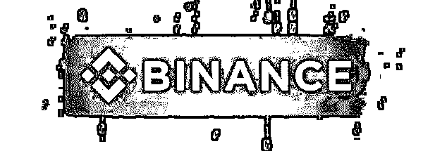

 数字货币投资者都会记住这个日子，2018 年 3 月 7 日，福布斯数字货币富豪榜 Top10 中唯一的中国人赵长鹏，度过了难熬的一夜。

他是全球第二大虚拟货币交易所——币安的创始人，3 月 7 日，币安发生了一场刷新所有人认知的黑客攻击。币安上大量用户账户被黑。

正当大家都认为会和过往以前那些交易所被黑案例一样，黑客提币走人时。

黑客却耍了所有人。

黑客并没有选择立即提出这些账户中的数字货币，而是进行了一系列「精妙绝伦」的操作：

一场早有预谋的攻击

> **一. 事件回顾： 用户账号被盗，被黑客操控。**

在 3 月 7 日深夜（北京时间），有不少用户发现自己币安账户中持有的各种各样的代币、数字货币被市价即时币币交易成了 BTC。据反馈，被盗的账号不在少数，不少人还以为是币安系统错误导致的，还试图从币安客服那里得到解释。当他们还没有反应过来的时候，黑客已经开始了他们有组织、有预谋的行动。

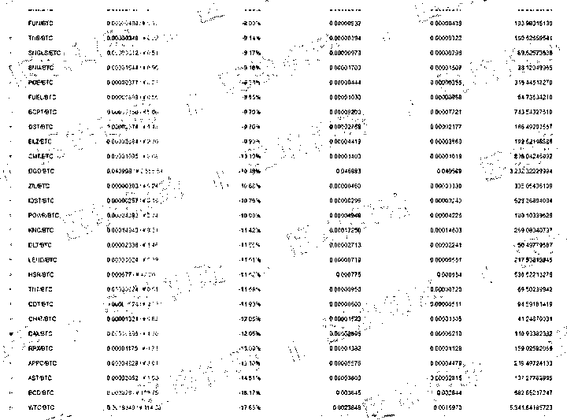

因为大量代币被市价抛售，导致绝大部分币种开始下跌，市场中不明真相的散户也加入了恐慌性抛售。在币安 BTC 交易对中，只有 10 余币种处于正常状态，其他币种均在下跌。

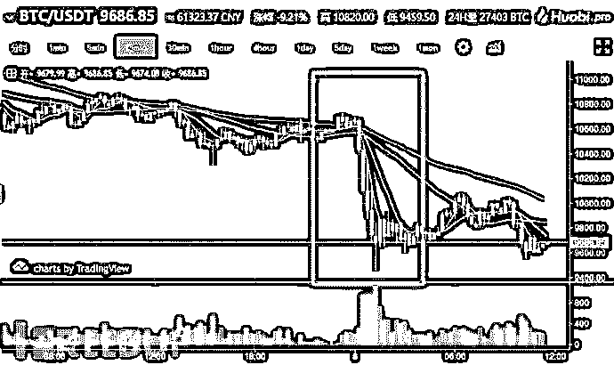

在上涨的币种里，BlockBeats 区块律动发现了这么一个币 VIA（维尔币），它成为了黑客影响市场的新目标，也是下文的关键。黑客操纵的账号在 1 小时内用 1 万个比特币拉爆了 VIA。

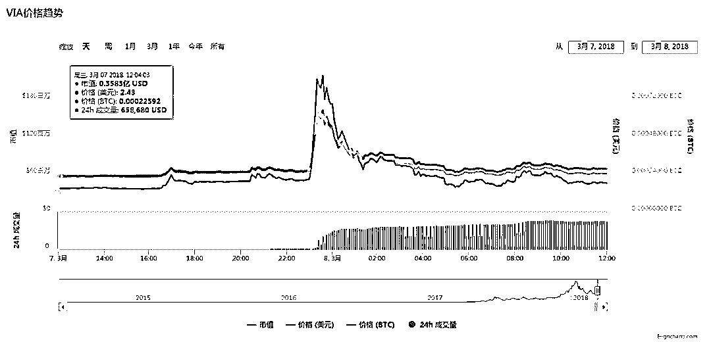

在引发恐慌性抛售之后，黑客将被盗账户中持有的比特币全部高价买入 VIA，导致 VIA 突然被拉爆（BlockBeats 区块律动注：币值在极短的时间内升高，甚至数倍）。从 22 点 50 分的 0.000225 美元直接拉升 100 倍到 0.025 美元，拉爆 110 倍！整个过程中，黑客一共消耗了约 10000 个比特币。

按照正常逻辑，此时黑客手中的其他帐号就可以把自己手中持有的 VIA 高价卖出，换成 BTC 分散到安全的账号，然后提现离场。这一过程类似于庄家恶意拉盘又砸盘，但是黑客并没有这样操作。

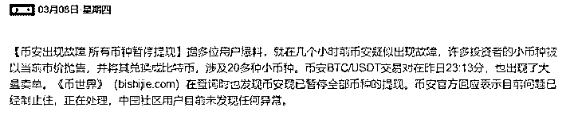

此时，币安已经注意到了异常情况，为了防止黑客提币，暂停了币安平台上所有的提币行为，这样一来黑客即便是想通过 100 倍拉升套现，也无法提币。

当你看到这里的时候，是不是觉得币安的安全防护已经到位，黑客没有办法提币离场？

所有人都想错了，因为在这场攻击中黑客压根就没想提币离场，一场宏大的收割计划其实早就结束了。

> **二. 黑客攻击的“去中心化”逆天操作**

早有预谋的黑客当然会想到交易所会立即停止所有账户提现来挽回损失，所以他们来了一出「声东击西」，攻击币安，但最大的利润并不从币安上获取。

**而是来自于：**

> 之前在全世界各个交易所上早就挂出的「数字货币和代币做空单」

币安是全球交易量第二大的虚拟货币交易所，这个市场中的任何波动都将快速地影响到其他的交易所，大的包括 OKEx、火币、Bitfinex、Upbit 等，小的包括各种二三流交易所。

币安交易所中突然出现绝大多数币种的下跌，一定会影响到其他交易所的投资者的投资行为，进而影响虚拟货币价值的涨跌。

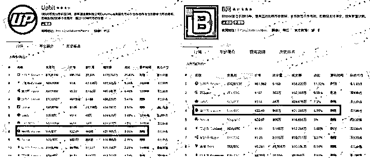

        **  （截至发稿，黑客可能已经在 U 网和 B 网出掉了至少 4.2 亿元的 VIA）**

目前已经有不少交易所上线了做空交易。黑客的真正目的是通过在开通做空交易的市场上挂空单，等到币值下降的时候，直接收割一波离场。这样操作，根本不需要冒着风险从币安提币，在市场下跌的那一刻，就直接完成了利益收割。

在涨跌之间，黑客又通过在其他平台做空单方式，轻易完成了收割。受此事件影响，比特币大跌 10%。以全球总计 1700 万个比特币计算，比特币一夜丢了 170 亿美元。

如果黑客一味地在币安上交易，是存在无法提币成功的可能性的，这会导致整场攻击功亏一篑。但是黑客选择的是将利用币安这个大的中心化交易所的信息背书，通过币安来影响其他交易所。大量空单分散在成百上千家交易所，根本无从查起。而黑客本质上也并没有「盗取」任何人的数字货币，只是帮大家「换了换种类」而已。

黑客的攻击，已经去中心化了。

一切的一切，看起来都像是黑客在嘲笑全球最大比特币交易所的防御，“我不指着赚钱，就图个开心”。 

但事实当然不是这样。这一场看似游戏，实则蓄谋已久的诡计，并没有那么简单。正如李笑来所说：

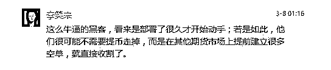

**李笑来朋友圈截图**

**黑客怎么赢利？**

第一，在其他平台上提前买入大量 VIA，在币安大幅度拉盘之后，利用时间差，在其他平台大量抛售 VIA，大量获利。

第二，在其他平台利用杠杆做空比特币等，因为黑客知道这一轮攻击会打击人们对比特币和交易所的信心，造成恐慌抛售，所以做空必定大量盈利。

这一轮攻击，黑客的收益以十亿计。虽然比特币的确是去中心化并且系统很难攻击，但是交易所是中心化并且经常被攻击的。这些年以来，比特币最大交易所被攻击已经屡见不鲜，毕竟对于黑客来说，比特币交易所就是一座巨大的金矿。 

**币安很快对此次攻击做出了回应：**

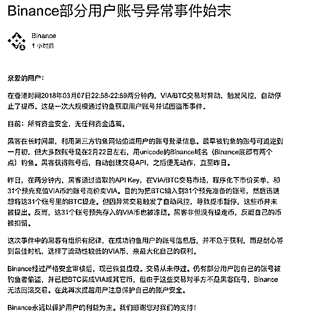

**同时 币安联合创始人——何一  也回应道。**

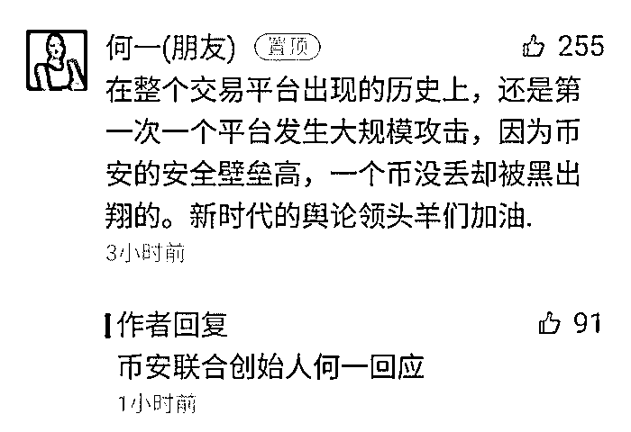

**三.  因此次事件大火的“VIA 币”  到底什么来头？**

从币安网的声明中，有一个关键词“VIA 币”，也成为了这件事情的焦点之一，官方叙述事件详情为：

> 昨日，在两分钟内，黑客通过盗取的 API Key，在 VIA/BTC 交易市场，程序化下市价买单，和 31 个预先充值 VIA 币的账号高价卖 VIA。目的为把 BTC 输入到 31 个预先准备的账号，然后迅速想将这 31 个账号里的 BTC 提走。但因异常交易触发了自动风控，导致提币暂停，这些币并未被提出。反而，这 31 个账号预先存入的 VIA 币也被冻结。黑客非但没有提走币，反而自己的币被扣留。

同时，很多用户注意到一个比较重要的内容，那就是包括比特币、以太币、莱特币在内的多种主流货币都出现了不同程度的下跌，而这个 VIA 币，却在昨天夜里，出现了数倍的增长。

正如币安网公告中所称，黑客将被盗账户中所持有的比特币全部高价买入 VIA 币，以此来将所有的比特币分散到 31 个账号中，期间大约消耗了 10000 个比特币。

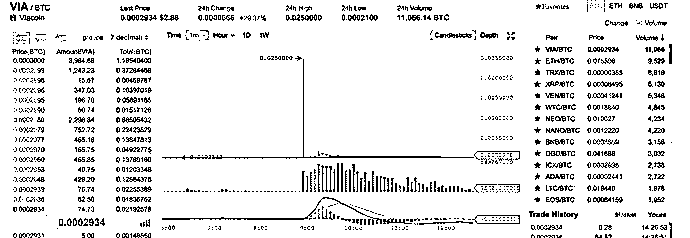

甚至有一个时间点，VIA 币价格从 0.0002532 BTC 的价格一路暴涨到 0.025 BTC，涨幅高达惊人的 100 倍。这不得不让人怀疑，整件事情并没有币安网声明中所描述地如此“轻描淡写”。

> 而 VIA 币究竟是何来历，全称 Viacoin，中文译为维尔币，所谓的第三代数字货币，Viacoin 于 2015 年 10 月 11 日正式创建，2016 年 3 月 31 日正式推出，Viacoin 采用的算法是 Scrypt （POW 工作量证明机制）。Viacoin 发行总量是 9200 万，区块速度为 24 秒/块个。

由于 VIA 币长期以来流通量低、价格低，与其他少数的加密货币沦为玩家口中的垃圾币、山寨币。若不是这次币安网的事故发生，相信很多人都不会听说过这个币种。也正因如此，显得这件事充满了阴谋。

将这种山寨币全部换成比特币之后，正常来说，黑客就可以直接提现走人了，然而却没有。因为在这短时间发生大量交易的异常情况，也引起了币安网的注意，并立即暂停了全部币种的提现。我想这就是官方公告中所称“触发自动风控，导致提币暂停”吧。

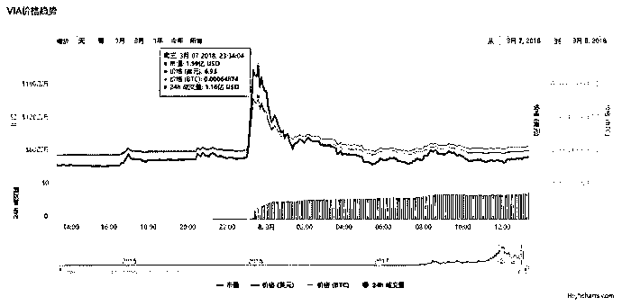

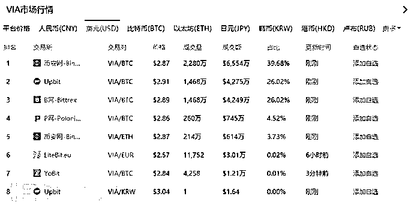

币安网处于此次事件的漩涡中心，吸引了绝大多数人的注意力，而只有少部分人注意到在漩涡之外的 Bitfinex、Upbit 等稍微小一些的交易所中，出现了大量的 VIA 币交易，单是 Bitfinex、Upbit 两个平台的交易量就已经超过了币安网，而且在上图中可以看到，绝大部分交易都是发生在 VIA 价格暴涨的阶段，也就是这次事故的关键时间点。

这让人联想到股票、期货交易市场的做空手法。黑客如此大规模的交易，将大量用户账户中的比特币换成垃圾币，作为全球第二大交易平台，不可能会注意不到，因此，黑客可能会想到币安网的应对措施从而导致无法提币的后果，这样一来便是功亏一篑。

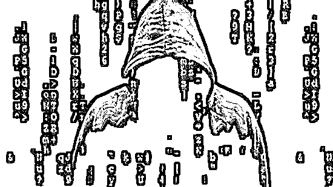

> # ** 四.  为什么黑客攻击的是交易所？**

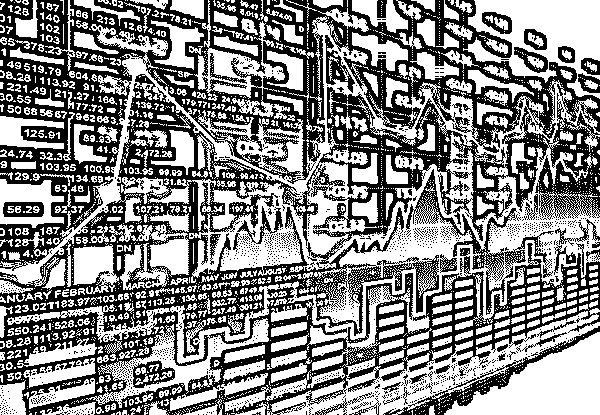

大量黑客攻击都发生在虚拟货币交易所里。

今年 1 月 25 日，日本最大的比特币交易所 Coincheck 遭到黑客攻击，丢失了市值多达 5.3 亿美元的数字货币。黑客的作案手法是将交易所里属于客户的数字货币转移至另一个账户。

去年 12 月，韩国的交易所 Youbit 被黑客攻击，这是它在一年内遭受的第二次攻击，导致近 17%的资产被盗。在上一次攻击中，它已丢失 4000 个比特币。12 月的这次攻击让这家交易所直接关门大吉。

而早在 2014 年，日本的 Mt. Gox 交易所也曾有 85 万个比特币被盗，其中交易所自有 10 万个，其余 75 万个是客户所有，最终这家交易所也被迫申请破产。

> **五.为什么交易所如此容易受到攻击？**

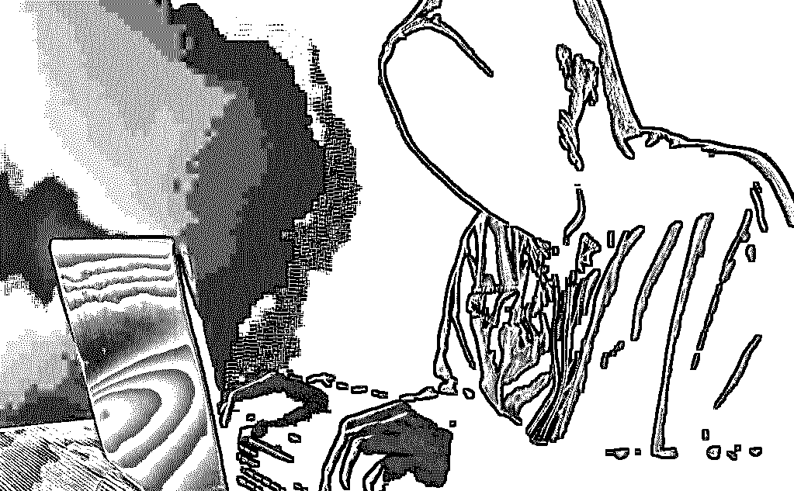

交易所集中了大量的账号和数字资产 ，自然是黑客攻击的首选。

“攻击手法就跟网站被攻击是一样的。”区块链从业者告诉灰产圈，“交易所是中心化的，有服务器有账号。这些服务器上各种软件，都有可能存在被利用的漏洞。”

黑客攻击这些交易所还有现成的工具。“黑客可以直接撞库，获得大量用户账号密码。”一位安全界人士对灰产圈介绍，“如果掌握一些底层漏洞，也可以拿下各种服务器，掌握大量的用户账号密码。这些库在黑产界到处都有，是现成的。以前很多大公司都被爆过大规模数据泄漏。”

现在也有交易所在探索去中心化之路，但一切还在初期建设中。“还没有看到成熟的去中心化交易所，需要解决高频交易问题。”从业者对灰产圈说。这是底层区块链技术一直面临的性能挑战。

> # **六. 事件突破口：千疮百孔的钱包**

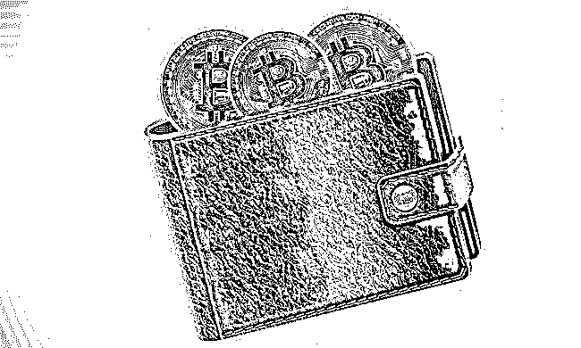

在日本最大的比特币交易所 Coincheck 被攻击的事件中，Coincheck 方面表示，所有被偷的数字货币都被放在了联网的钱包里。

无独有偶，去年 12 月被攻击的韩国 Youbit 交易所，也是把数字货币都存放在了联网的热钱包中。而此前有媒体报道，美国主要数字货币交易所 Coinbase 表示，其网站上 98%的数字货币都放在线下，称之为“冷”储存钱包。

冷热钱包最大的区分在于是否联网。冷钱包是不连网的钱包，也叫离线钱包；热钱包是保持联网上线的钱包，也称在线钱包。一般而言，冷钱包不联网会比热钱包更安全。

由于之前的教训，如今发币平台和交易所都对专业、安全的离线钱包有更迫切的需求。不过，即使是冷钱包也依然有风险，数字资产最好能分散存储。但分散存储的问题在于效率降低、成本提升。而一些交易所出于流通和成本考虑，经常会集中存放，这自然会带来风险。

“交易所的资产交易记录都是可查的，很容易找到这些大额资产地址。”，“更为严峻的是，这种交易所，在安全意识上就是有问题的。”币圈导师李笑来也认同这一点。

李笑来甚至表示过对比特币私钥的担心。他认为除了交易所的问题，比特币私钥本身也有被破解的可能性。

“很多人不知道，比特币私钥其实是相当于公开的，虽然很低很低的概率才可能被破解。但你稍微有点数学常识就知道，万分之一的概率，并不意味着非要试过一万次才可能出现……那么多的价值，放在一个地址里，我是不敢的。别说现在不敢，2011 年就不敢。后来 2013 年给赵东投资的时候，我是用三个 2011 年的老钱包拼起来，构成对他的投资额的。”

> # **七. 防不胜防的割韭菜手法**

在币安被攻击之后，黑客的套利方式让人对虚货币产生了更多质疑。

目前，虚拟货币交易所是 7*24 小时运营，传统金融的杠杆、做空、套利等玩法都会平移过来。“而且，现有交易所没有监管，全看交易所自己的能力。币丢了也没有法律保障。”行业内人士表示。

做多做空金融交易工具的出现，让币价大幅度波动成了一些做庄做局者乐见的局面。这可能会让币圈出现一批不论涨跌都能收割的人，也让普通参与者面临更大的被宰割风险。

“数字货币容易被操纵是个明显的事实，在传统对冲基金中都被玩烂了的手法，可能会在这里一一上演。”币圈一位不愿具名的人说。

此次黑客的操纵可能也会引发效仿。新的收割手段不再需要盗取、转移数字货币，只需要拉动币价产生高位震荡，在多个平台下注做空单、做多单即可。

在虚拟货币交易尚未迎来去中心化的时刻，收割套利者已经完成了去中心化之路。

**七. 币安黑客事件真相调查**

据调查此次币安黑客事件的调查人员表示，黑客大概两周之前就开始准备，他们精心制作了几个模仿币安的钓鱼网站，其中一个网站甚至还同步了币安上的黑客事件声明，诱导用户去网站上登录用户名和密码。

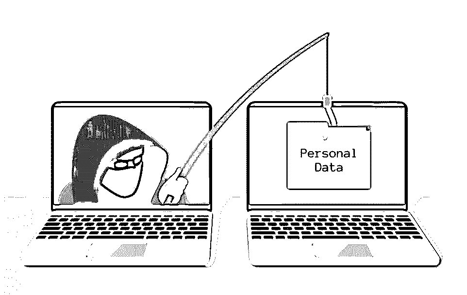

### **币安漏洞与“API”功能**

黑客最终通过钓鱼网站，掌握了 31 个账户。然而，获得用户名和密码也没有什么作用，因为还需要手机验证码等二次验证，才能将用户的币提走。但黑客却发现币安的一个漏洞：知道了用户名和密码，就可以直接开通“API”功能。

这个 API，是一个量化投资的机器人，可以帮助交易量巨大、需要随时面对市场变动的“大客户”批量做账户的买入卖出操作。通常，交易所在开通 API 的时候，还会进行二次验证，但据调查人员表示，币安并没有这个步骤，这就让黑客有了可乘之机。

### **“内鬼”风险**

黑客缘何能够对币安交易平台如此熟悉，能够在极短的时间内完成割韭菜？或许他们真的是技术牛掰，但会不会也有可能存在“内鬼”呢？我们都知道，在安全领域的安全防护方面，人的因素能够严重影响安全防护的能力。很多安全事件的发生归根结底都是人的问题。除了技术问题之外，还应在安全领域尽量规避所谓的“内鬼风险”。如果“人”没有问题，那将会大大降低安全领域所面临的风险和威胁。

此次事件让黑客们尝到了甜头，同时充满了刺激与“胜利”的多巴胺，今后针对虚拟货币交易所及韭菜们的攻击也不会因此停歇，或许真如此前安全专家的预言，当好几波儿黑客都想从同一交易平台获取资金进行地盘争夺时，或将导致交易平台崩溃甚至更多重创行业及用户的事件发生。

> **八.结尾：**

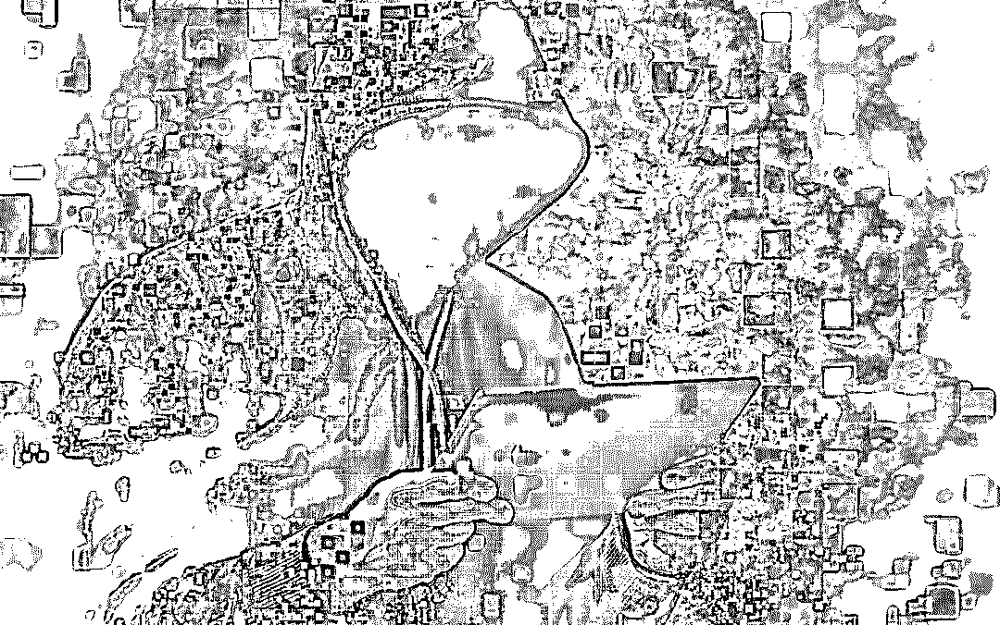

虽然我们依然不能确定黑客是否直接入侵了币安网，操控了整个交易过程。但显然这是一场蓄谋已久，而且计划周密，堪称万无一失的计划。算上通过钓鱼手段获取用户账户的时间，整个时间线延长至几个月也不是不可能。如果在有一些前戏剧情，简直可以拍成一部黑客系列烧脑大片，而涉事黑客是这部大片的导演兼主演。

同时，从已知的多次加密货币损失事故基本可以认清一个事实，加密货币本身系统安全性是比较可靠的，而一般出问题的都与交易平台，也因此成为黑客的重要目标。能长久混在炒币圈里的人应该有超强的心里承受能力吧，如比特币这种大起大落，不是一般人能够承受的来，更何况还有黑客虎视眈眈的盯着。对于这种玩心跳的活儿，还是那句话，炒币需谨慎。

目前全球数字货币价格正在持续下跌中，此刻，在地球上的一个角落，一瓶庆祝的香槟已经开启了......

* * *

**【灰产圈】高端社群小程序开通，社群成员突破 1000＋** 

<mp-miniprogram class="miniprogram_element" data-miniprogram-appid="wx4f706964b979122a" data-miniprogram-path="pages/topics/topics?group_id=881854415822" data-miniprogram-nickname="知识星球" data-miniprogram-avatar="http://mmbiz.qpic.cn/mmbiz_png/kialtkOXGKS7D9hZrmO2jzDqryXXTAlhxSpnrKnHGV65KXzicibOppaPic4dCRxftvabB8Iqswo3OuQEDSxE7NicXBg/0?wx_fmt=png" data-miniprogram-title="【灰产圈】高端社群" data-miniprogram-imageurl="http://mmbiz.qpic.cn/mmbiz_jpg/WWG78hysZ0brJkWoyG2VDIacqgQjkDfp6mLiaoPBJ2SgWZHtRuTw7ia8kpoxntsn7PiaFOQO2U23FW6Iry0gS1GnA/0?wx_fmt=jpeg"></mp-miniprogram>

**点击加入【灰产圈】高端社群**