# 深度|“快手”涉黄事件：揭开直播背后色情产业链的神秘面纱！

> 原文：[`mp.weixin.qq.com/s?__biz=MzIyMDYwMTk0Mw==&mid=2247490527&idx=1&sn=0f23322d0aaa56fc17aaa403e6949ea6&chksm=97c8d0e7a0bf59f1b5cff84af639e146ab0d13edc065a0759ade1511ad04bc919c27f7a1184b&scene=27#wechat_redirect`](http://mp.weixin.qq.com/s?__biz=MzIyMDYwMTk0Mw==&mid=2247490527&idx=1&sn=0f23322d0aaa56fc17aaa403e6949ea6&chksm=97c8d0e7a0bf59f1b5cff84af639e146ab0d13edc065a0759ade1511ad04bc919c27f7a1184b&scene=27#wechat_redirect)

**深度|“快手”涉黄事件：揭开直播背后色情产业链的神秘面纱！**

> **导语：**

被央视焦点访谈点名批评，天佑、卢本伟等知名低俗主播被封禁的消息余音尚存，“快手”直播平台又因为“涉黄”出现在公众的视野。

附央视视频：“净网 2017”查处涉黄直播平台 73 家。

[`v.qq.com/iframe/preview.html?vid=b0024g91qd9&width=500&height=375&auto=0`](https://v.qq.com/iframe/preview.html?vid=b0024g91qd9&width=500&height=375&auto=0)

> **一. 序幕：快手涉黄遭人举报，引发媒体关注**

近日，一位微博名为@小太爷-XTY 的用户在 2 月 27 日对快手涉黄进行了举报：“快手直播平台每天晚上有主播涉黄直播，快手平台巡查不及时，封号不及时，举报多次才停播。希望能引起重视，净化一下直播平台，营造良好的直播环境和氛围。”同时，还@了苏州公安、锦阳教育等机构，以及人民网、央视新闻等媒体。

值得注意的是该网友还在后续的评论中指出，涉黄主播已被封号两次，使用第三个账号进行色情直播。

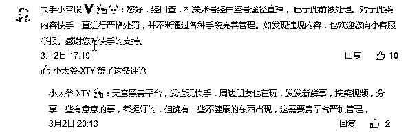

**附当时直播截图，以下截图，友情提示：请未成年人回避：**

**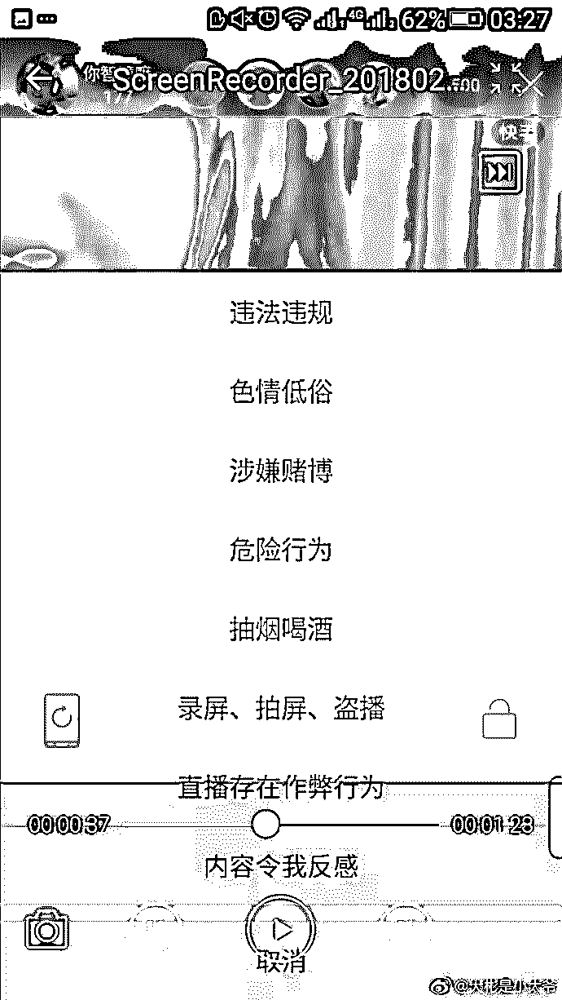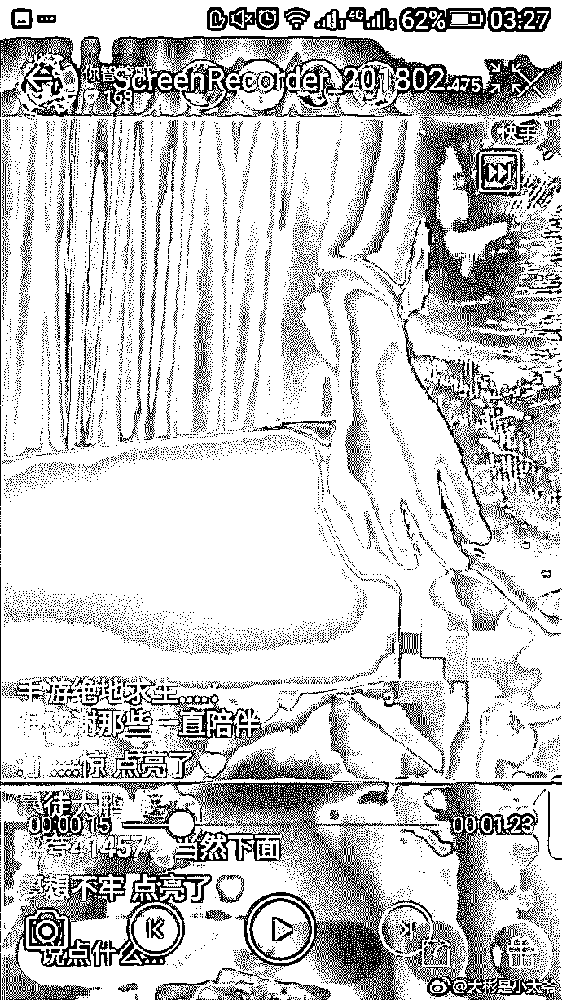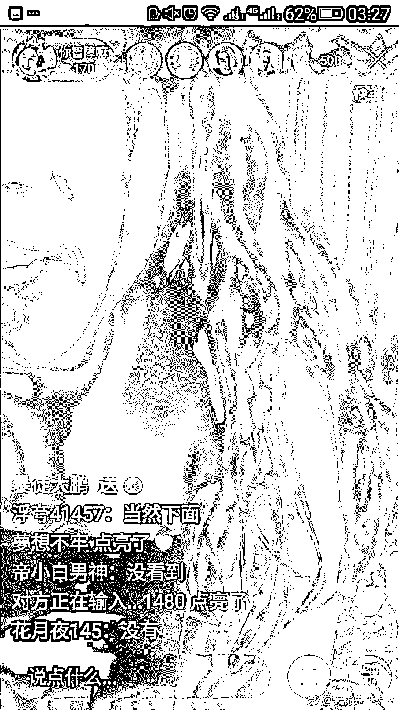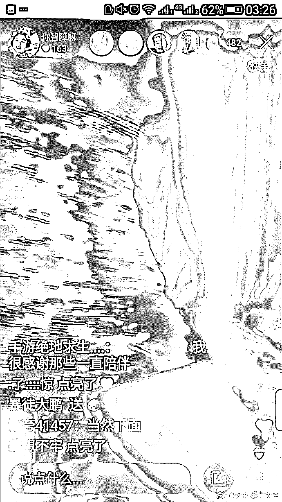**

经过检索发现，快手已多次被网络举报“涉黄”。不过这次应该是最辣眼睛的。

附检索图片，以下图片均来自@用户 6441265322 微博

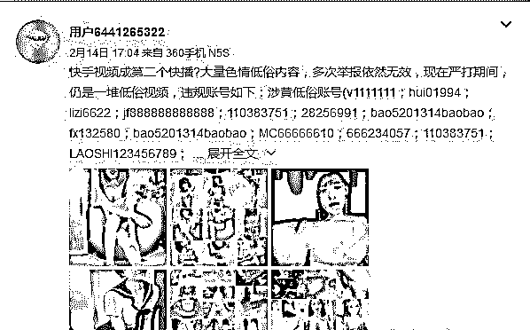

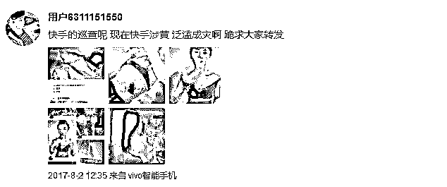

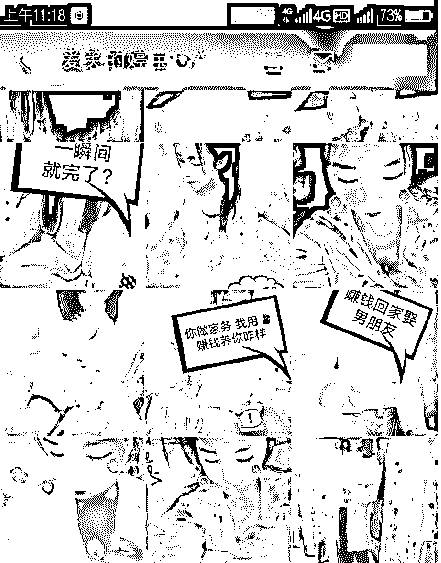

对于网友的举报，3 月 2 日快手回复称，“经回查，相关账号经由盗号途径直播， 已于此前被处理。对于此类内容快手一直进行严格处罚，并不断通过各种手段完善管理。”尽管快手方面在接受媒体采访时表示，平台对主播的审核非常严格，一旦发现涉黄，超过 1 秒将封号。但这样的解释似乎难以服众，此次事件还反映出的，是直播行业”灰色“地带。

> **二.回顾：《焦点访谈》提及天佑等主播直播内容涉黄涉毒。**

虽然快手方面一直强调自己在严格处理该类事件，但是涉黄、涉毒直播几乎是从未停歇。

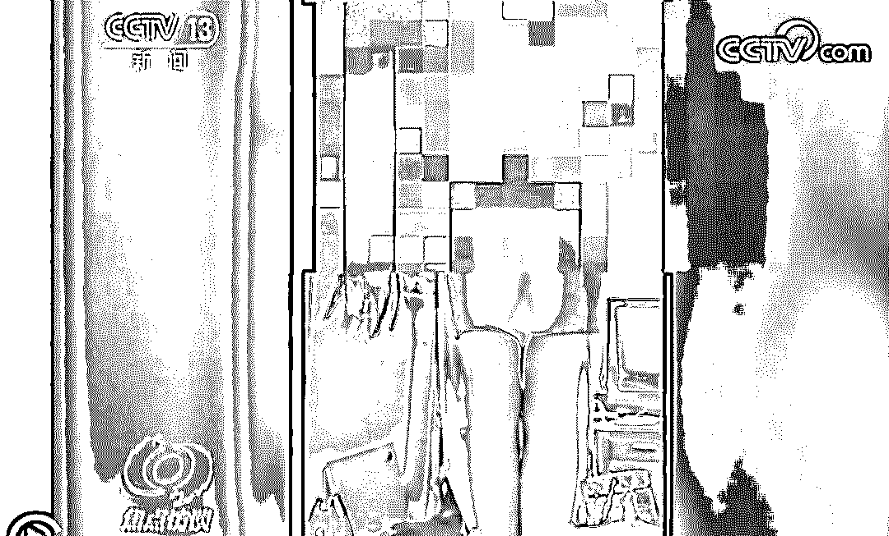

去年 2 月 12 日，《焦点访谈》播出一期“重拳打击网络乱象”，其中就有一段提到主播天佑的直播内容涉黄、涉毒。但是天佑的直播内容并非一两次，而是在长期的传播，但并未得到快手直播平台的快速处理。最终是在监管部门的网络整治中，被全网禁播。

为什么快手等平台不能第一时间禁播这类直播内容、封杀这些打擦边球的主播呢？ 这就要谈谈网络直播的潜规则了。 有业内人士及法律界人士认为，快手借助黄色内容有增加用户粘性的嫌疑。这一点很容易理解，涉黄内容对男人尤其是未成年人的吸引力不用多言。几乎每一次涉黄直播都会吸引大量用户围观，这对直播平台而言，本身就是一种广告宣传手段。

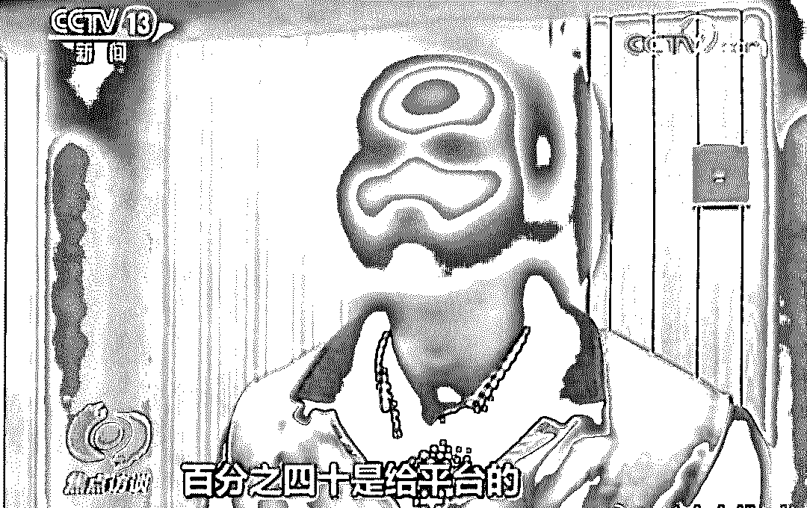

同时，也存在一个问题，那就是快手等直播平台需要这些人来活跃用户群体，进而通过色情直播的内容运营方式，形成了规模化、组织化，最终实现对利益的获取。而这一点是快手等直播平台不愿意禁止的，一旦禁止意味着最大的广告推广途径被堵死了，是很难实现导流和会员充值的，对于直播平台而言，这意味着营收的直接损失。

> **三.直播平台“涉黄”为何屡禁不止？****背后有一条灰色产业链**

虽然监管部门曾集中打击整顿，大量账号被关停，但直播平台涉黄问题似乎积重难返。截止发稿，在微信中搜索关键词“直播平台”，仍然会出现大量用词暧昧，配图露骨的直播平台推荐。

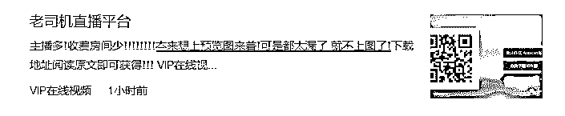

梳理此前的消息不难发现，直播平台涉黄问题存在一条“灰色产业链”。

去年 2 月，《焦点访谈》曾在节目中采访了因涉嫌色情传播而被抓获的“泛果直播”相关人员，犯罪嫌疑人黄某称：他会通过 QQ 群，介绍某直播平台很赚钱，让主播在直播平台进行表演。最终的收入，主播提成 50%，中介提成 10%，平台提成 40%。

在直播过程中主播会不断要求粉丝“打赏”“刷礼物”，当金额达到一定数目，主播会将粉丝拉进一个单独的直播间或者是微信群，进行色情表演。

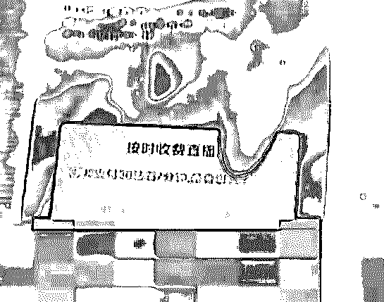

涉黄的主播不仅通过微信，还有微博、贴吧社交平台等进行广告推广，通过直播平台进行导流，再将“直播粉丝”从直播平台引入微信群、QQ 群等。

现如今，还有一些直播平台通过网页弹窗广告进行推广。很多网友都有类似经历，如果浏览器拦截不到位，在浏览网页的时候经常会弹出一些窗口广告，而这些广告风格基本都是这样的↓↓↓

不小心点入，就会进入需要付费观看的直播网站或微信群，这些网站的风格基本上是这样的↓↓↓

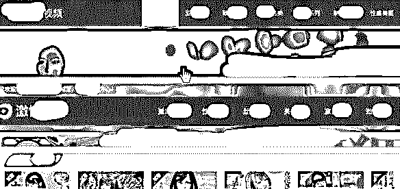

根据以上信息，灰产圈将整个“涉黄灰色产业链”的基本情况绘制成一张图：

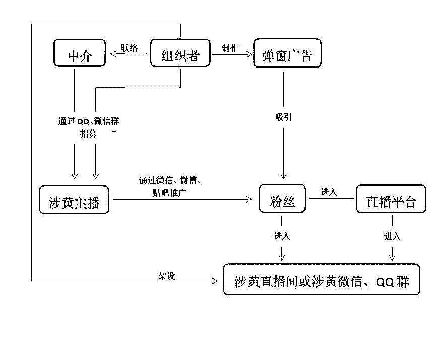

> **四. 快手直播内容涉黄，灰产圈怎么看？**

实际上不单单快手如此，直播平台涉黄一事一直屡禁不止，灰产哥做为快手重度用户，看法有三：

第一，快手上的“寄生虫”：色情直播实则暗藏猫腻

关于快手涉黄一事，网上有不少探讨，灰产哥都看了，大概可以分为两种，一是说快手不作为，二是说快手应该加强监管，总之意思都一样，没有说快手好话的。

此前，灰产哥也曾经在快手上发现色情直播情况，且大多是在午夜，有老司机将午夜看成直播平台的“监管盲区”。具体如下图：

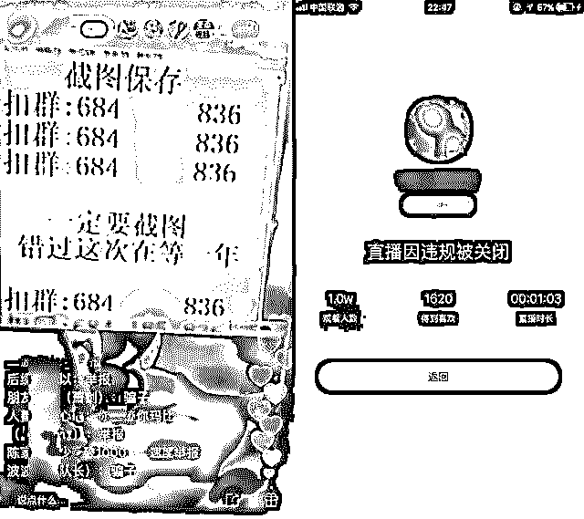

**图：快手主播“色情直播”一分钟后被封**

根据上图可以看出，快手在 1 分钟内封禁了此次直播，速度不快，且观看人数也达到了一万人。

而在这短短一分钟之内，实则是存在了很多猫腻。

通常情况下，色情直播需要三台手机两名主播，一名主播操纵两台手机，一部手机充值快币（快手里的游戏币，用于打赏），在一些头部主播直播间刷去礼物，并采用比较敏感的名字吸引粉丝关注。

另一部手机用来直播色情内容，并在直播间打出文字，为 QQ 群倒流。至于剩下的那名主播，则利用 QQ 群直播来诱导用户充值，购买色情内容。

注：快手同一账号可同时在两台手机上登陆

第二，直播涉黄形式多，应视情况“定罪”。

常见的直播平台涉黄分两种，一是平台鼓励；一是主播个人行为，这两种情况，有着本质上的区别。

其中，平台放任甚至鼓励主播色情直播又分为两种，一类是初期为了吸引用户，尺度会适当放开，一旦掌握了更多的流量，便严加监管，逐渐转型。曾经斗鱼上有主播直播“造娃”；归属于李学凌旗下，和 YY 是亲兄弟的比邻也曾在午夜出现主播打擦边球现象。

还有一类直播平台自身就拥有“色情标签”，经济诱惑大加上违法成本低，平台和主播都能得到巨大利益，比如曾经的天使社区、陌秀等，

上述问题，均可以归罪于平台不作为。在平台之外，还有一种情况是主播无视平台监管，抱着能播一秒是一秒的心态来开播，比如上述文章中提到的快手，此类直播大多是诱导用户刷钱加主播微信，或者主播利用直播平台导流到 QQ 群等。

坦白讲，此类情况完全是在给直播平台找麻烦，直播平台也一直在封禁违规主播，只是苦于没有未卜先知的能力，只能在色情直播开始后才能封禁。

第三：快手应该积极改正，并起到表率作用

快手上出现淫秽色情等信息，平台是要承担主要责任的，但如果是帐号被盗、或者直播间被恶意攻击，那就要视情况而定，如今直播平台众多，企业应该承担应有的责任，拒绝擦边球行为。 

快手有错是肯定的，但也不至于一杆子打死。快手上出现色情直播的事件一直都有，虽然不是平台主管意愿，可也必然要承担一部分责任，目前，用户在快手直播，需要身份证认证，但这还不能完全杜绝此类事情发生，快手还应该在技术和人力上加大投入，以防止此类现象过多发生。

另外，快手做为直播行业的领军者之一，不单单是为了完善自身平台，更应该起到表率作用，带领直播行业健康成长。

> **五. 案例：付费私密观看打掩护****三月涉案超千万元**
> 
> “再给你们换一件性感的睡衣，小礼物走起来。或者给我刷一个“跑车”，刷“跑车”我就换。”夜深人静，某直播平台一女主播在直播时说道。而这还只是冰山一角，在花椒、麻椒等多如牛毛的直播平台上，一到了夜间，这些充满着诱惑和荷尔蒙的主播便会上线，一时间便会涌入成千上万的用户。
> 
> 据央视新闻报道，湖南岳阳监管部门查获了一个叫“狼友”的色情直播平台，这个直播平台利用所谓的“网红主播”进行色情表演牟利，在短短 3 个月的运营时间内，就吸引了 17 万余人注册，平台浏览量达数百万余次，涉案金额超千万元。
> 
> 根据该平台运营人员表述，他们只是负责运营这个直播平台，而直播系统是花费了 4 万元从一家叫“浙江杭州的金麒麟有限公司”购买的。经警方查明，在“狼友”直播平台前期测试阶段、实际运营期间，该公司不仅提供全程的技术支持，而且还提供了完整的配套服务。
> 
> 在事后的审问中，该技术公司相关负责人表示，你想要的功能都可以开发出来，只要是理论上能达到的。比说免费功能，飙车功能，私密功能，还有连麦功能，功能非常多。而为了打掩护，他们往往会开发出只有付费之后才能观看的大尺度内容。有些主播为了吸引用户，会主动要求用户送礼物，送的礼物越多，表演尺度会越大。 
> 
> 值得注意的是，在警方的调查中还发现，这样的一个涉黄直播平台已经形成了一个产业链，有人负责运营，有人负责技术系统开发维护，有人负责在主播和平台中间搭线，也就是中介，从中抽取分成。
> 
> 其实，类似这种直播平台的目的性很强，就是通过大尺度露骨的内容来吸引用户付费观看，从中牟取巨额利益。不仅如此，这样的平台流动性也很强，一旦被查封，可以换个名字继续运营。毕竟，相比较获取的利益来说，购买系统的成本可以说是微乎其微。
> 
> 除此之外，包括花椒直播、麻椒直播以及逗趣直播等多家直播平台也都被发现有违规直播内容，部分女主播穿着暴露，同时言语里无不透露着挑逗色情的信息。在去年，花椒直播便被多次爆出涉黄，更有网友截图将其发布在微博等社交平台。同时，在去年六月份，相关执法单位封禁了花椒、六间房、映客等九家平台的 40 名违规主播。
> 
> 除了上文说到的色情直播之外，有些直播平台更是涉嫌赌博，骗取用户的钱财，甚至有的主播自己都深陷其中，输得倾家荡产。据此前相关媒体报道，星球直播平台上有 5 类竞猜游戏玩家可下注，通过下注赢得游戏币，再用游戏币购买专属礼物送主播，获得一定返现。有的玩家表示在几个月内已经输掉了上百万元。
> 
> 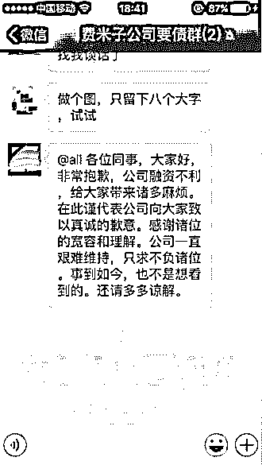
> 
> **六. 揭秘网络直播暴利灰产，50 人团队一年创收几个亿**

互联网的内容领域中，黄赌毒基本上变现能力最强的三种方式。而其中“黄”则是最天然的引流方式，没有之一。基本上东南亚的大型网络博彩行业都是通过这种引流方式来实现用户的高持续流入，这种引流方式流量大，转化率高，变现强，所以现在还有很多人在互联网打着擦边球。

2015 年以前，国内的互联网擦边球多数都是以网络聊天室的方式来进行的，但到了 2018 年已经发生了巨大变化，其暴利到什么程度呢？一支五十人的团队一年创收几个亿，就问你们怕不怕？

现在网上除了几个大型的直播平台，其实还有大量的小型且仅限于在部分老司机之间流传的直播平台，它们为了用户和收入都选择了灯下黑的做法，对一些女主播的尺度睁一只眼闭一只眼；这就给一些不法之徒有机可趁，衍生出了暴利空间，如何操作？

请看分析。

1\. 每天晚上 10 点以后，在这些直播平台里，很容易的找到目的主播，即撩人的音乐、暧昧的灯光、搔头弄耳的女主播，整个直播间弥漫着“成人”的气息，而这个直播间的用户也会慢慢涨到数千，这些女主播和直播平台早已达成默契，礼物收入归平台，而她们可以自我发掘用户价值。

2\. 比如这些女主播一开始把犹抱枇杷半遮面的情绪表现得淋漓尽致，等到直播间里的好色之徒们都已经个个摩拳擦掌、跃跃欲试，手都快离开键盘的时候，女主播开始诱导加 QQ 群，1234******免费看秀！

3\. 等到一个 500 人的群快被加满的时候，女主播开始同时在 QQ 群里直播，注意一开始尺度要比在直播间里的小；这样一来换成群里的任何一名免费会员，会不会觉得很失望？这时女主播说只要缴费 18 元就可以看激情舞蹈，这些已经精虫上脑的会员会不会马上交 18 元解放双手？

4\. 显而易见的是，18 元是远远不够的；后续女主播会告诉接下来刺激更大，这次只需 38 元，要不要继续交？排除掉部分屌丝和流失用户，剩下交钱的用户还会有不少；

5\. 第二步之后还有第三步，接下去的 88 元会是一个分水岭，愿意继续交 88 元的用户不多，但这都是核心用户，都是愿意花钱，又不在乎钱，而且还闲的无聊的金主，这个时候就要对这批剩下的核心金主给一个名义上的刺激，比如多找一个女主播双凤啊，1v1 随用户指挥等等，再收最后一笔 188 元的费用，这又是一笔巨大收入。

6\. 但是真的会收了钱提供服务吗？那你就错了，女主播是来赚钱的，不是来做服务员的！收了钱，删好友，换个直播平台，再来一次，一晚上来回操作几次，收入翻番！

7\. 如果你想问，这能赚多少钱？那么我们就来算一算，以一个 500 人群来计算好了，第一次收费是 18 元，我们保守估计只有 300 人愿意交，那么第一笔收入为：5,400；

8\. 第二次费用是 38 元，假设一半人（150 人）交费，那么第二笔收入为：5,700；

9\. 第三次费用是 88 元，假设又只有一半人（75 人）交费，那么第三笔收入为：6,600；

10\. 注意，在连续交费三次之后的用户已经是核心用户，这个时候最后一笔的流失率会较低，预计能有 80%的用户（60 人）交费，那么最后一笔收入为：11,280 元。

11\. 最后我们来算一下总数：5,400+5,700+6,600+11,280=28,980 元！一个直播平台，一个 500 人的群，两个钟头收入 28,980 元，同时操作 2 个 500 人多群，那么就是 57,960 元！

这个项目为什么能带来暴利？因为他集合了移动互联网的三个特点，1\. 互联网支付快捷方便，2\. 直播行业让监管更加困难而刺激无处不在，3\. 色情行业变现能力极强！ 一个项目集合了这三点，可想多暴利。

但是需要警示的是，这种方式一是打得“黄”的擦边球，二来只适合女性用户或者有女主播的团队；随着互联网的正规化、阳光化、产业化，请各位看官不要当作操作手册。

> **七. 直播平台整改风暴正在来临**

直播平台传播低俗、色情、暴力等违法有害信息一直备受关注，任何直播平台不应该有侥幸心理。

针对网络直播平台传播低俗、色情、暴力等违法有害信息和儿童邪典动漫游戏视频，中央宣传部、中央网信办、文化部、国家新闻出版广电总局、全国扫黄打非工作小组办公室近日做出部署，2 月上旬至 4 月下旬进一步开展集中整治行动。

或许受李天佑事件的影响，相关的短视频直播平台原本规划好的春节商业活动也受到牵连。

据媒体报道，从 1 月 18 日早晨开始，包括浙江、江苏、东方在内的多个卫视春晚的网络版都出现了不同程度的马赛克状况，而遮盖的正是此前一举拿下冠名权的火山小视频、抖音等短视频企业 LOGO，替换它们的是自拍 APP 激萌。

媒体分析认为，这意味着卫视春晚临时换冠名商了，此前备受关注的火山小视频、抖音等短视频在毫无准备的情况下就被封杀了。

从这些信号可以看到，所有直播行业参与者、投资者都应该警惕，过去靠低俗、惊悚、色情等内容来吸引流量做大平台影响力的路子已经行不通了，应该尽快进行自我强加管，以避免更严格的监管大棒落在自己身上，得不偿失。

> **结尾：**

无论当初如何火爆，最后都将归于平静。

对于直播来说，内容是核心，大尺度内容只是一时的捷径，谁能够最贴近用户的需求，谁才能分享行业的红利。 

靠打“擦边球”来盈利的平台是走不长远的！

* * *

**【灰产圈】高端社群小程序开通，社群成员突破 1000＋** 

<mp-miniprogram class="miniprogram_element" data-miniprogram-appid="wx4f706964b979122a" data-miniprogram-path="pages/topics/topics?group_id=881854415822" data-miniprogram-nickname="知识星球" data-miniprogram-avatar="http://mmbiz.qpic.cn/mmbiz_png/kialtkOXGKS7D9hZrmO2jzDqryXXTAlhxSpnrKnHGV65KXzicibOppaPic4dCRxftvabB8Iqswo3OuQEDSxE7NicXBg/0?wx_fmt=png" data-miniprogram-title="【灰产圈】高端社群" data-miniprogram-imageurl="http://mmbiz.qpic.cn/mmbiz_jpg/WWG78hysZ0brJkWoyG2VDIacqgQjkDfp6mLiaoPBJ2SgWZHtRuTw7ia8kpoxntsn7PiaFOQO2U23FW6Iry0gS1GnA/0?wx_fmt=jpeg"></mp-miniprogram>

**点击加入【灰产圈】高端社群**