# 一篇文章读懂区块链：币圈一天,江湖十年!（深度好文）

> 原文：[`mp.weixin.qq.com/s?__biz=MzIyMDYwMTk0Mw==&mid=2247490389&idx=1&sn=723efdb12fc9c6cfc2d3e84d51f8f385&chksm=97c8d06da0bf597bfdff32d62578c6c43164c53b32b16413ce89a8d57e2bfc8e22e56614083e&scene=27#wechat_redirect`](http://mp.weixin.qq.com/s?__biz=MzIyMDYwMTk0Mw==&mid=2247490389&idx=1&sn=723efdb12fc9c6cfc2d3e84d51f8f385&chksm=97c8d06da0bf597bfdff32d62578c6c43164c53b32b16413ce89a8d57e2bfc8e22e56614083e&scene=27#wechat_redirect)

**导语：  **

最近一张图刷爆了朋友圈：

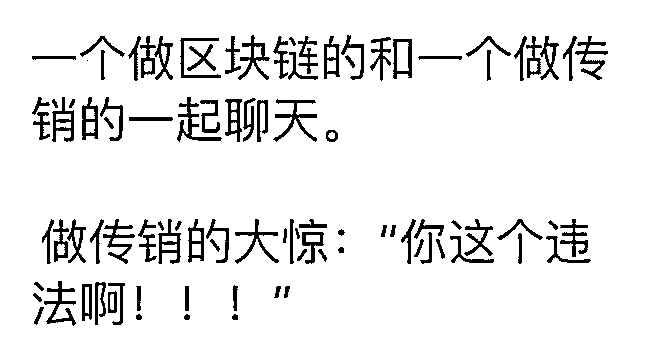

技术在创新，骗子也在创新。区块链技术还没找到成熟的落地应用方式，已经被各位投资大佬当作割韭菜的工具运用的十分娴熟。

> ## 一.“3 点钟无眠区块链”万亿市值社群

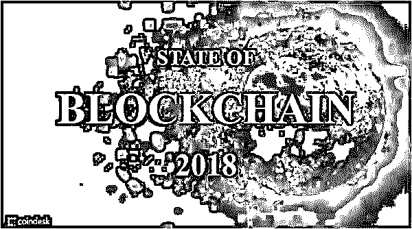

春节期间，众多投资大佬汇集在一个“3 点钟无眠区块链”的微信群中，这个群里有真格基金创始人徐小平、知名天使投资人薛蛮子、隆领资本创始人蔡文胜等赫赫有名的投资人，甚至吸引了演艺圈的一众明星比如佟丽娅、汪峰、高晓松、于正、秦岚、胡可、海泉、韩庚等人，号称“万亿市值社群”。

那么，到底是什么力量把这一群人聚在一起？真的是区块链技术的发展让他们内心激动的难以入眠吗？我看未必，应该是圈钱之简单、金额之庞大让他们按捺不住了。

> ## 老生常谈：区块链是什么？

从技术角度来说，区块链是一种由多方共同维护，以块链结构存储数据，使用密码学保证传输和访问安全，能够实现数据一致存储、无法篡改、无法抵赖的技术体系。

区块链的意义在于让人们选择用最佳的方式登记拆分传递价值，以便于处理客户、股东、劳动者、创造者之间的关系，更加公平公正以及具有激励能力。区块链是用来创造信用的技术，不是创造实际财富的工具。

区块链技术是伴随着比特币诞生的，而现在发行的各种数字货币也是基于区块链技术，很多人并不能把区块链技术与比特币、ICO 区别开来。本质上，区块链是一项新技术，数字货币只是它的一种应用方式。

**通俗一点讲吧！**

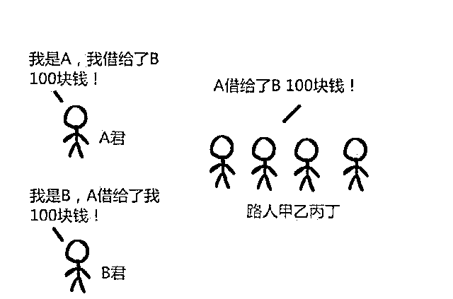

上图是一个“去中心化”的简易借贷模式，区块链相当于一个账本；

如果我是 A，借给了 B 100 块钱，这个时候我在人群中大喊“我是 A，借给 B 100 块钱”，B 也在人群中大喊 A 借给我 100 块，这个时候甲乙丙丁路人就开始拿起小账本记账了；

有了这个操作，就不怕 B 赖账了，一旦 B 说“我没管 A 借钱”，那么这帮路人就会喊“我都记在小本本上了哦！”

区块链是不可伪造，不需要特地去维护的分布式账本；

再举个通俗的例子，帮助大家更好的理解；

如果你在蚂蚁借呗借钱了，突然有一天蚂蚁的服务器终端突然被炸了，你借钱的数据还有余额宝里的钱都不见了，那你肯定很窝火，因为蚂蚁的终端就是那个中心化的东西；

而区块链的最大意义就是“去中心化”，这样能确保所有的数据都是分散的，不会出现缺了哪个，数据都不全的，会造成整个系统的瘫痪。

而比特币就是区块链的第一个应用，但之前比特币经历暴涨之后，泡沫化太严重，充斥着投机者的身影；

等啥时候泡沫破裂就是行业真正的良心出品问世的时候。

> ## 以区块链的名义 ICO 割韭菜

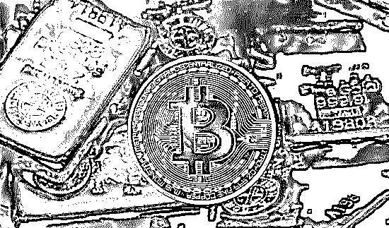

事实上，无论是投资界的大佬还是凑热闹的演艺界明星，真正了解区块链技术的人寥寥无几。连马云的参谋曾鸣都大方承认，他对区块链的理解很有限，“区块链的春天还没到来” 。难道这些投资人和一众明星们真的比曾鸣懂的更多吗？非也，他们只是知道比特币升值百万倍让人一夜暴富的故事，想要趁早收割一波韭菜而已。

去年以来，不断疯狂上演的各类 ICO（ Initial Coin Offering，首次代币发行）项目，用“疯狂”、“可怕”这样的词汇来形容当时的场景一点都不为过，投资人自己都调侃道“韭菜太多，项目不够用了” 。

“这是我们的项目白皮书，众筹 4000 万，马上开始 ICO，”一个 ICO 投资群里的群主表示。

“怎么抢?”一个投资者问道。

“有多少份额?”另一个投资者问。

开始 ICO 五分钟后。

“什么?ICO 结束了?”还没“上车”的投资者懊恼道。

2017 年 7 月，李笑来的 ICO 项目 PressOne 上线，募集资金 2 亿美元，这个项目连白皮书都没有。“白皮书是提供了也没多少人看得懂，甚至就没几个人看的东西，”李笑来这么表示。

最终 PressOne 累计募集资金价值约 1.25 亿美元。对比之下，同样是新东方教师出身的罗永浩，去年 8 月锤子手机融资 10 亿元人民币，耗时 4 年多，只与李笑来的一个项目打成平手。

> ## 一个真实 ICO 的例子：马勒戈币

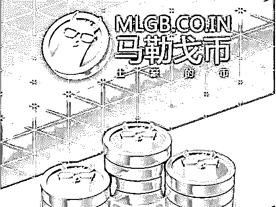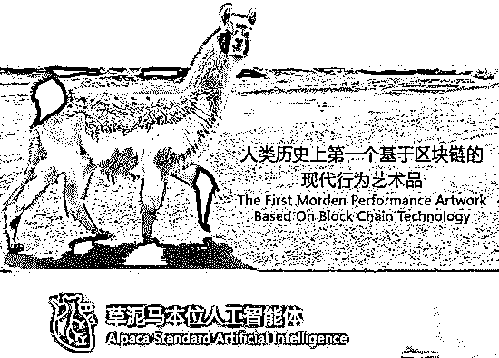

也许是 ICO 太火爆了，随便是谁取个名字都可以发币。在李笑来连白皮书都不写就圈钱被骂怒而发声“为什么挨骂的总是我？马勒戈壁！”后，薛蛮子投了一个马勒戈币项目，在马勒戈壁中云中养起了草泥马。

项目介绍是这样的：“我们将开发一个全新的 AI 云系统，每产生一个马勒戈币都将绑定一个云端的人工智能草泥马，草泥马在马勒戈壁云中，每个人可以通过互联网访问到每一匹草泥马，每匹草泥马都是一个基于 DNN 的具有自我学习能力的语义机器人，有自己的性格和特性，它可以学习用户输入的语言，并改变自己的沟通方式，随着技术的发展和进步以及交易和交流的活跃，最终可能每个 MLGB 都能具有自我意识而在马勒戈壁云系统中觉醒，因此每一个 MLGB 都是唯一的值得收藏和有增值空间的人工智能体”。

很快最终这个项目筹得 5000 个 ETH，按照 2800 元人民币一枚的价格算，折合人民币 1400 万。类似这些包装成“XX 区块链”、虚拟币叫做“XX 链”、“XX 币”的 ICO 项目，其实好多都跟区块链关系不大，或者披着区块链的皮做着与区块链无关的事，类似“马勒戈币”这样的项目真让人不得不感叹一句：马勒戈壁！

> ## 理直气壮地割韭菜

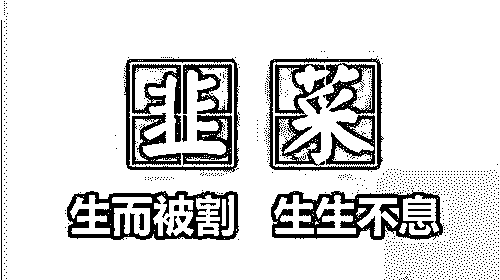

金沙江创投合伙人朱啸虎号称怼遍风投圈难见敌手，因为说了一句“不要拉我各种进 3 点钟群。有些风口宁愿错过，有些钱宁愿不赚，大家晚节保重”，惹怒了 3 点钟群的“耿直 boy”快的创始人陈伟星，两人隔空互怼对方“割韭菜”。

朱啸虎认为“大多数 ICO 是割韭菜无疑”。陈伟星则回应说“朱啸虎拼命吹项目，然后让别的 VC 接盘，通过名人效应割普通 VC 和小股民的韭菜，道理与 ICO 一样”。

创办了 http://265.com 的蔡文胜则表示“A 股、港股 70%的公司也是 IPO‘割韭菜’，ICO 大部分也是‘割韭菜’，但更加透明，‘韭菜’更能成长。而且 ICO 的韭菜成本和知名投资人和机构一样成本。”

在资本大佬们看来，ICO 只是换了一种割韭菜的方式而已，与股市中收割散户是一样的。他们认为这是一种更加仁慈的方式，是公开的、理直气壮的、P 民自愿的一种割韭菜方式——甚至还是有利于韭菜成长的。

一些 ICO 项目的套路是发行“空气币”，韭菜们用比特币、以太坊（或其它数字货币甚至人民币）按比率购买空气币。空气币没有成本，总量有限，以后越来越少，买的越早越便宜，买的越晚越贵。项目方暗示韭菜打新成功后就可以坐等空气币升值，韭菜们生怕错过一夜暴富的机会，蜂拥而入。

比起股市、传销、庞氏骗局等手段来，ICO 已经简单到 COPY 一本白皮书从 github 上下载个项目修改一下“Hello world”，如此快捷而低成本的方式怎么能让各位割韭菜大佬们不趋之若鹜？

韭菜生生不息，总要有人来收割。

> **真实案例：代币 **ARTS 空手套白狼诈骗 2.6 亿元！****

谁都明白币圈泡沫迟早会破，但不知道是什么时候、导火索又是怎样的事件。但可以肯定的是，2018 年 2 月 4 日一定是可以记载在虚拟货币圈历史上的一天。

2 月 4 日晚，央行所属《金融时报》旗下中国金融新闻网头条报道，称「针对境内外 ICO 和虚拟货币交易，将采取一系列监管措施，包括取缔相关商业存在，取缔、处置境内外虚拟货币交易平台网站等」，言辞严厉，不容置喙；

几乎在同一时间，行业垂直媒体有币网报道，此前已在境外交易所 ICO 的项目 ARTS 被投资人联合举报涉嫌诈骗，数位投资人已将项目联合创始人蒋杰扭送至北京金融局信访办公室；

再往前几天，2 月 1 日，中国最大的币币交易所之一币安突然宣布，即日起不再为中国大陆地区用户提供服务。

内忧和外患交杂。监管部门态度坚决，使用了「取缔」、「处置」这样的措辞，等于向在中国境内发起的 ICO 项目和虚拟货币交易所直接亮出红牌警告，而且很快就会有所行动。而 ARTS 被投资人举报到金融局，相当于给监管部门送上了一个绝佳的切入点。

******ARTS 发操盘者：********蒋杰目前已被警方控制，北京金融局内部已经将此事件定性为「金融诈骗」，接下来将会顺藤摸瓜，彻查国内 ICO 链条。根据统计，按照目前的汇率，ARTS 事件共涉及金额约 2.6 亿人民币——这只是个粗略统计，根据我们了解，在 ARTS 的私募过程中存在大量杠杆和期权交易，因此实际数额并没有如此巨大。**

ARTS 事件可谓中国空气币项目的一个典型代表。整个 ICO 过程中，它几乎用尽这个行业中所有见不得光的手法：

## **1\. 虚设项目**

币圈普遍认为，ICO 给了散户投资者一个从种子期就参与到某个项目中的机会，可以绕开目前企业从融资到上市的各种资金和法律门槛。但这样一来弊端也很明显：项目 ICO 时往往只有一个团队和一份白皮书（相当于商业计划书），项目的质量，甚至项目本身会不会启动、如何进展全都是未知数。

于是就有了「空气币」一说：没有任何实际产品作为支撑，单纯 ICO 的代币，被称为「空气币」。

而 ARTS 在 ICO 前期宣传中故意使用了「艺库网」的名义进行募资，在群发私募信息中也借用了艺库网的域名和名义，这一点被真正的艺库网发表辟谣声明，称 ARTS 与其无关，指责 ARTS 项目是「李鬼」。

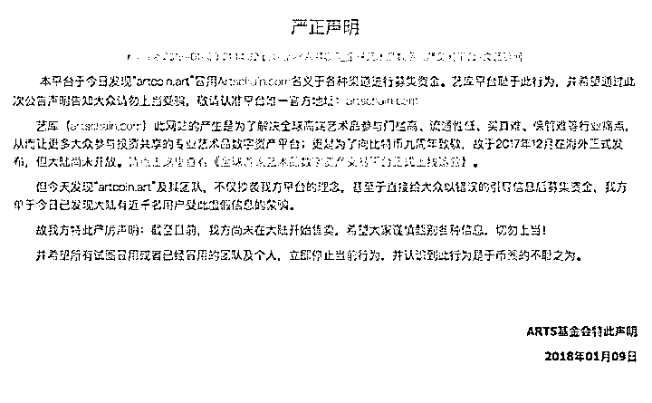

也就是说，此次由蒋杰团队发行的 ARTS 代币，跟其声称的艺术品交易项目没有任何关系，是典型的「空气币」项目，完全是一场空手套白狼的诈骗。

## **2\. 利用名人为项目背书，夸大可信度**

因为项目进行 ICO 时还没有具体产品落地，投资人判断项目是否靠谱、有无投资价值的唯一依据，就是团队背景、有没有机构和名人为其「站台」，以及项目招募基石投资者和私募时期的认购情况。

在网上曝光的一段视频里，蒋杰称自己也是受害者，ARTS 的实际控制人是洪鹤庭，包括蒋杰本人在内的其他人，都是被洪欺骗被写到白皮书上的，其中黑石区块链创始人贺焕跟 ARTS 的 ICO 完全无关。

币圈 ICO 的潜规则中有一条，就是在白皮书中拉上知名投资人和知名投资机构站台，无论这些机构和个人有没有投资这些项目。

团队会在 ICO 前以极低的价格甚至免费赠送给站台人代币，站台的名人有时会默许团队在 ICO 使用自己的名号做背书。很明显，这些大佬并非因为项目本身的质量而支持它们，而是他们知道，手上被赠送的代币，其价格将会在 ICO 之后成倍增长。

当然，最严重的，莫过于像 ARTS 这样伪造项目支持者和顾问人员。

## **3\. 从****私募到上（交易）所，完全黑箱操作**

代币在正式登陆交易所公开交易之前，会在私募阶段募集一轮资金。这个阶段，越早认购的投资人可以享受越大的折扣，这是其一；

其二，在私募阶段，代币的份额销售模式跟微商销售几乎没有区别，很多时候都是通过圈子之间的口口相传，形成各级分销商，一层一层向下销售，售价由上到下依次提高。

其三，新的代币认购通常以 ETH 为一般等价货币，但因为各级销售情况复杂，实际认购过程中往往存在 ETH、法币、其它代币，甚至期货交易。

ARTS 的前期私募过程中，分销渠道众多，这种法币代币、现金期货齐飞的现象非常严重。

有意思的是，虽然团队将代币交给了分销商，但由于分销商在向下级飞单的过程中有大量渠道手中的代币没有完全卖掉，这使得团队的 ETH 账户无法全部解锁，实际上几个创始人和背后的操盘者并没有真的从中得到巨额收入。

除以上几点之外，更值得让人细细体味的问题是：为什么代币上市交易后破发，会引起私募投资者如此激烈的反应？

是不是因为 ICO 私募阶段投资者根本没有想到代币在公开交易后会破发？

**这里又暴露了币圈的另一条潜规则：任何代币公开交易之后都会涨，在私募阶段，买到即赚到。**至于为什么一定会涨……你猜呢？

以上提到的种种乱象，普遍存在于各种空气币项目当中，在币圈投机者里几乎人尽皆知。甚至于连一些「靠谱」项目，在 ICO 中也有大量灰色甚至黑色操作。

没有比这更讽刺的了。区块链的诞生，正是出于让信息更加透明，让人人更加平等的意愿。但如今 ICO 中的这些盘根错节的黑色链条，已然与这一初衷背道而驰。ARTS 不是个例，它是币圈众多空气币的缩影，是玩砸了的那一个。

对于此次事件的进展，以及接下来国内虚拟货币市场的动向，我们将会保持关注。

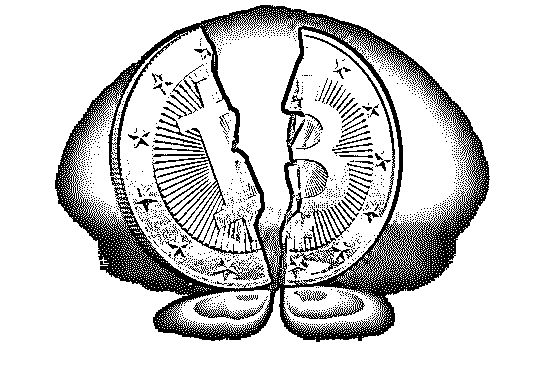

> 韭菜的想法：每一个收割者都曾经被当做过韭菜

多年前，雷军认为马云是骗子、搞传销的，多年后他坦言后悔不已。世事难料，如今的区块链虽然不免也沾上了“投机”、“骗局”的帽子，但也许多年以后，也有可能会像现在我们看马云一样，传奇万分。

而且事实是，区块链现在与 90 年代初互联网萌芽时期何其相似？它所创造的商业价值甚至比当初的电商、即时通讯和搜索，更加清晰。

1995 年，CFido 汇集了我国最早的一批互联网人，丁磊、马化腾、求伯君、雷军等等商业大佬的思想启蒙或许都是由此开始，这群人相互交流与碰撞，然后分别向不同的直线延展进而交织，构成了当今互联网格局的雏形。站在当年改革开放的变革洪流中，恐怕很少有人会关注这样一个小群体，甚至还将其视为异类，但他们多年以后却成了全球瞩目的商界明星。

现在这样的传奇，也许正在被区块链承袭。

2011 年，前科幻作家刘志鹏的写作生涯遇到瓶颈，他化名为长铗，建立了国内最早的比特币论坛和资讯网站“巴比特”，从此转变了整个人生轨迹。同样是在这年，吴忌寒翻译了中文世界里第一份比特币白皮书，和长铗、烤猫相识于此，甚至日后叱咤币圈的大佬多多少少都曾在巴比特活跃过。

如果说当初互联网这个理想国所孕育的一批人，从白手起家的普通人到成为叱咤风云的富豪，中间还要经历多年的摸索和妥协，那区块链俨然缩短了这个时间，因为它的回报率拔高到一种绝无仅有的高度，这使得区块链的市场空间被不断扩大。

比如吴忌寒和其 2013 年成立的比特大陆，据投行伯恩斯坦的分析估测，比特大陆去年经营利润约为 30-40 亿美元，也就是说，仅用 4 年时间，该公司就在年经营利润方面追平了英伟达公司。站在芯片行业的角度，这是实现了我国多年来追赶美国芯片巨头的愿景，而且吴忌寒拥有的三个矿池占据全球算力约 30%，身价可谓是水涨船高。

如果没有区块链，吴忌寒或许依然在风投公司度日，而刘志鹏可能重新复出、继续他的写作生涯。这些比比皆是的例子，说明两个问题，对个人来讲，这是绝佳的暴富机会，对行业来讲，这是冲击行业层级固化的一条崭新捷径。

当然，这其中不乏鱼目混珠，众多囿于现状、急于脱困的公司也从中看到了可能是希望、也可能是错觉的一种市场信号。

不论是个体还是企业，他们都笃信一个真理：哪一个收割者不都曾经被当做过韭菜吗？

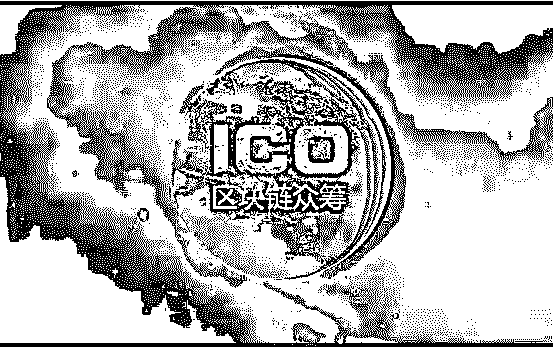

> 风口这么多，为何区块链被当做最适合逆袭的突破点？

“币圈一天，互联网十年”、“当年你对人家爱搭不理，现在人家让你高攀不起”，用这两句话就可以简单地概括出，为什么屌丝、精英、创业者、明星等群体，明知有当“韭菜”风险，还都涌入区块链之中，人性使然、唯逐利也。

不过直观的金钱刺激，令大部分人的眼光只局限在造富神话上，或许他们并未意识到，区块链实际上正在成为失意者逆袭的契机。

屌丝逆袭精英、创业者逆袭大佬、甚至是危局中公司重新获得一个逆袭的机遇，这些事情正在泡沫之中成形，估计接下来一段时间只增不减。所以，这场全民沸腾的风口，与直播、共享经济或者是再早之前的 O2O 相比，都有所不同。

以直播为例，虽然有很多主播借助资本追捧的风潮，一跃成为身价百万、千万的明星级人物，但其实能够成为头部主播的这部分人，很难被称之为屌丝。而且直播平台之间的博弈一开始就属于几个行业巨头的斗争，背后站的是 360、微博及 YY 等互联网老兵。从这点来看，直播的风口也不是属于屌丝的，更何况直播平台做得再大，也很难和 BAT 这样的互联网巨头相提并论。

而区块链在被各种偶然性和刺激性影响之下，其门槛似乎不断降低，看看你周围有多少平日其貌不扬，现在却对各种虚拟货币高谈阔论的人就可以知道。况且，即使不懂区块链也参与进来的人比比皆是，低买高卖的道理总是懂的。

再比如共享经济，从共享单车、共享 KTV 到共享汽车、共享雨伞、共享健身房，曾有很长一段时间，总是有各种奇葩的共享形式，刷新我们对共享经济的认知。

可是回头再看当时共享经济的泡沫，跟如今的区块链相比，简直是小巫见大巫。观察去年蹭共享热点的参与者，看似人满为患，其实说到底，大部分都是创业者在谋求关注度，即使处于疯狂期，能引得资本竞投的也只有屈指可数的几个。

而区块链从年初炒热至今，除了创业者，币圈和链圈所容纳者流派纷杂、自成江湖。仅目前冒出头的就有各个行业处境困难、亟待拯救的互联网老兵，以及曾经在域名圈、站长圈的活跃分子，或是互联网圈的连续创业者，他们虽野心勃勃，但在前几次风口浪潮中未曾得志，所以区块链成了摆在他们面前的最好契机。比如，人人网、美图、天涯、迅雷等公司和蔡文胜、陈伟星等人。

不过，这也说明区块链存在着很大的泡沫，但即使如此，也没人想错过。因为区块链对所有想在互联网成就经天纬地事业的人来讲，一定程度上也意味着存在跳出 BAT 包围圈、未来能和巨头并驾齐驱的可能性。按照过往资本主导的互联网风口，BAT 基本上决定了创业者的生死，可区块链或许能改变这种根深蒂固的发展走向。

在王峰十问薛蛮子的对话中，薛蛮子对区块链区块链精神的认识非常精准： 首先是信任的规模化；其次是代码即共识；第三个是赋能到个体。同时，区块链的应用，让众多互联网企业不再需要依赖 BAT 的流量和资源，也能自行解决资金问题，而不论是实体还是虚拟，仅从投资角度来看，古今往来，如此完美的适合用炒作的标准，还有吗？

当然，机会越大，往往泡沫越大，但谁都不会觉得自己会是吹破泡沫的那个人。

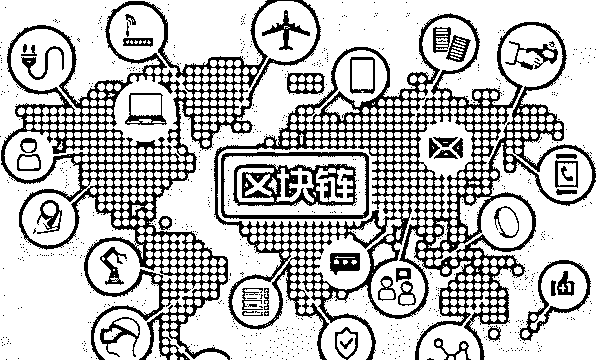

> 区块链竟让一家拥有百年历史的公司起死回生

过年期间，很多人的年假可能过得并不安稳，因为一个 500 人的微信群为区块链添上了一把火，烧得他们更为焦虑。可实际上，微信群里的人可能要比他们焦虑得多，一开始也许是仅供交流偶然所建，但现在群内人百种面孔、各有目的，多多少少有着功利和炒作的意味。

比如蔡文胜，很早之前美图就发布了白皮书，现在更是和美链不清不楚，他站台区块链无非也是为股价大跌的美图找一个突破口，如果美图不做区块链，可能今年的股价和财报更难看。而陈伟星对区块链的推崇更加直观，据他所述，自己投资了大概几十个区块链公司，很多间接投的、盲投的，根本不看白皮书。

所以说，区块链越热，他们越能从中获利，如果区块链不需要炒就能闷声发大财，那谁还愿意大张旗鼓地“普惠”大众呢？早就像吴忌寒一样先赚它几个亿了。若是仅靠这种言论就 all in，未免有些天真。

区块链所带来的财富的零和游戏，对推崇这一技术的一群人来讲，也许比较浅薄，他希望的是用区块链解决现有问题，甚至是应用到各行各业。这不是没有可能，只是在区块链泡沫中，当研究人工智能、VR/AR 等前沿技术的资源，都跑去做区块链了，这真的是件好事吗？所谓的技术信仰能抵得过金钱效应吗？

更何况，这么多年来，从来没有一个风口能够离钱如此之近，互联网企业说不心动才不现实。

到现在，区块链的热潮很可能还只是一个前奏，在监管都保持中立的情况下，更疯狂的也许在后面。

韭菜们将会等来收割的镰刀还是自己挥起镰刀，只能拼运气了。

要说最近的大势是什么？很多人说虚拟货币，no no no,应该是区块链咯！

是个互联网企业都在往里冲，只要跟区块链搭上边的公司股价都咔咔往上涨；

咱们中国之前入局的那几家就不多说了，迅雷的玩客币之前也是玩的乌烟瘴气，就最近的人人网也发行了人人币（被约谈，最终翻车），网易弄了个网易招财猫；

连美国存在百年的胶卷公司柯达也跟相关区块链技术企业合作上线了柯达币，柯达股价暴涨 119%。

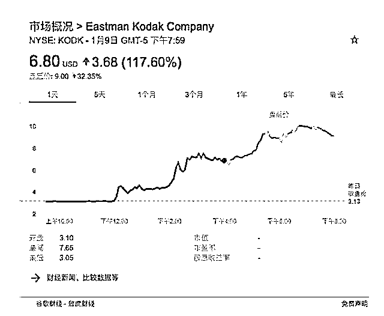

是个人都在谈论比特币、区块链，搞的我现在都蠢蠢欲动了；

但是，“币圈”跟“链圈”已经是两个世界了，币圈充斥着一波迎着泡沫狂舞的投机者，懂不懂区块链啥的都无所谓，最重要的是赶上这班高速列车，因为这是一场 20 年不遇的暴富机会。

都说何以解忧？唯有暴富，但任何不费力的暴富都不存在的，想要去好好抓住这个可能一夜暴富的机会，你有必要好好学习下下面的内容。

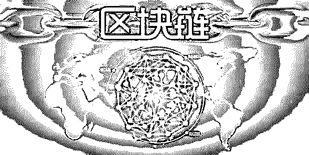

> **区块链行业如何“投机倒把”？**

为什么是“投机倒把” 而不是暴富指南？

**我所理解的区块链**

**1、区块链是庞氏骗局吗？**

**不，区块链是一种技术。技术在没有产生自我意识之前，本身是不能犯罪的。**

**众所周知，金融的核心是“信用”体系。**

**谁能解决信用问题，谁就占据了金融的高地。**

在传统金融领域，光在信用问题上，就产生了大量的担保、增信机构。比如银行、担保、信托、支付等。再比如，马爸爸为了大家在淘宝买东西更放心为初心开发的余额宝。

所以，区块链的最大想象力在于颠覆现有的金融体系。并且端倪明显。

**这是一场革命，大势所趋。**

**2、区块链不等于虚拟币**

目前市场几乎所有火爆的虚拟币底层技术，几乎都来自区块链。

但区块链不等于虚拟币。

这里的逻辑，好比苹果是水果，但不能说水果就是苹果。

**比特币是世界上第一个用区块链技术做的虚拟币，它的目标是要世界银行，其整体币值对标是整个世界的财富估值。**

这个世界的金融体系是不完美的，特别是纸币的滥发，而完美的情况是这个世界有一种整体保值的货币保护我们的私有财产。比特币的初心于此，人们的渴望于此，这种力量建立起来比特币的中心信仰。

而中心信仰者类似宗教般的狂热，持币不抛，再加上新鲜的投机或者信仰者大量的热钱涌入，不断推高比特币的市值和单价。让其从一文不值，涨到了近 10 万人民币一枚。

**虚拟币大致可以分为两类：**

**一类是带有货币定位的虚拟币**。比较有代表性的就是比特币、莱特币。货币来源是用自己的电脑（或者有算力的终端）参与记账“挖”出来的。

**一类是中心化机构发行的带有“股票”性质或者“奖励”性质的“代币”。**

前者就是“臭名昭著”的 ICO。初心是一群有能力的人投入一个区块链“idea”，然后对外发行代币募集资金来推动该项目的发展。类似发股票、众筹。

但因为发行的代币可以拿到交易所爆炒，所以目前市场中已经大量出现买一个代币系统，找人写一个募资白皮书，就开始发币“炒币”。

后者比较典型就是迅雷玩客云发行的“链克”（原名玩客币）。获得方式是你去买个玩客云终端，然后参与贡献“算力”，贡献多的迅雷官方会派发链克。目前一个玩客云一天能挖 2-3 枚，单枚的黑市价是 4.5 元左右。一天收入 10 块钱左右。

感兴趣的童鞋可以去玩客云官网抢个机器，499 元。挖几个月就能回本。

**3、一万个 e 租宝**

同为互联网金融，区块链的能量远大于 P2P 借贷。

P2P 做了那么多年，在早年只解决了一个问题：融资的互联网化。到最近两年，才进步到在线上能完成一定的信用审核。而造成其发展的核心瓶颈就是信用。

**而区块链则直接从信用切入，潜在能变革现在金融的所有环节。**所以，它的正面能量，足以创造 100、1000 个蚂蚁金服。

**但也很显然，它是目前世界上最好的非法集资工具。**

1-10000 倍的暴富想象力，勾的人心欲望横流。

虚拟币，形象，生动。具有足够的传播力量。

**去中心化、全球化的网络，政府的监管显得“心有余、力不足”**。就拿 2017 年的 ICO 监管来讲，都已经关到了“中国公民不能参加任何 ICO 项目”，在国内几乎砍光了所有交易所。但依然然并卵，该涨的继续涨，该疯的依然疯。

**区块链吸引链大量有识之士。但同样也吸引力大量投机分子，想借虚拟币大发横财，不惜违法犯罪的人。**

区块链市场，10%是真正在踏实做事，90%是投机瞎参合。另外，还有 1000%是来明目张胆骗钱的。

2013 年，虚拟币第一次狂热之时，就出现了类似暗黑币、欧亚币这种规模达到几十亿、几百亿的传销币。而当时，比特币的故事还只是在极客圈和金融圈流传。

**而 2018 年的今天，虚拟币的冲击波已经蔓延到了社会中产。**

市场已经狂热到，随便写个白皮书、买套代币系统发币，都能募集几千万甚至上亿。看到原先做 P2P 系统的开始大规模出售代币系统，就知道下面的市场就要开始“大屠杀”链。

**未来，以区块链名义发行的虚拟币，99%将一文不值。**会蒸发掉大部分投机者的钱，会让成千上万的人站上天台，绝望，痛不欲生。

**4.区块链“投机倒把”指南**

关于区块链投资（或者炒币），国内目前的舆论主要有两种：一种是疯狂叫好。一种是一味否定。

**一.从赔率看，可以参加**

区块链的风险，是买的时候千金。亏的时候归零。

区块链的收益，年化百分之十几到几百上千倍。

比特币就是从上线之处不名一文到现在近 10 万人民币。**可以说，9 年时间翻了 1 万倍。**

从风险跟收益比来讲，是有参与价值的。

因为赔率足够高。

从实际情况讲，这个市场也不乏存在投几十万，然后在几年时间翻到几千万的故事。

区块链之所以这么狂热，背后跟其制造了大量的百万、千万、亿万富翁有很大的关系。技术是理性的，但理性的区块链技术跟暴利相结合。就变成了一个非常巨大的非理性漩涡。不断地席卷社会各个阶段。

**所以，区块链掀起的投机狂潮，是近几十年来对于普通屌丝来讲，难道的一夜暴富的机会。**

**二、10%以内的资产**

很显然，区块链是一个赌场。

**赌场就要愿赌服输，输的起。那么，什么样的钱会让你愿赌服输？**

就是这笔钱突然某一天失踪了，对你的生活、工作、心情都影响不大。

而其他人，除非不在乎自己生死的“超级投机者”。不管保守还是激进，网叔的观点都是 10%以内。

记住，只有保住本金，才有可能在任何时候东山再起，把握这个时代层出不穷的机会。

**三、纪律**

只有纪律，才能保护你。

投区块链的纪律，就是：

1、亏光了，就结束。不再继续充钱要赢回来。

2、赢了几十倍，也不再补充，要赚更多。

市场扑朔迷离。

**控制自己的欲望，就是最大的爱护自己。**

**四、“价值投资”**

进入这个浮躁的市场。第一个感官是，这个币涨了几十倍，那个币又涨了几十倍，好像遍地是黄金。

但很快你也会发现，很多币其实就是上交易所后拉一波，然后就一路阴跌。

这个市场，大部分人都是来割韭菜的。

如果只是比拼谁跑的快，心态和情绪就很难控制不好，就难免折腾半天，依然赚不了钱或者大亏概率大增。

2017 年初，据说再比特币大涨前提，很多人就已经有预感。其中很多人用 20 倍杠杆炒币。结果实际操作下面，是亏的。

为什么？区块链或者虚拟币，波动太大的。

**过去这些年，在这个市场真正赚钱的，几乎都是长线持有者。也只有长线持有，才能真正抓住一波波狂涨。**

而长线持有最大的挑战就是如何判断一个区块链什么时候是顶……

说实在的，这个顶的问题：在这个充满泡沫的市场是一门很大的技术，或者是一个很大的勇气和坚持。

这个时候，对于区块链本身的了解、理解就开始显得尤为关键。

只有你了解、理解下来未来大有可能的区块链，才能做长线持有的勇气和决心。更才有机会翻几百上千倍，直接财富自由。

了解、理解靠什么？

疯狂学习。一方面，区块链的底层逻辑，知识。另一方面，各个区块链本身的设计、应用前景、推进情况。

**赚钱，本质赚的还是认知。**

**五、活的久**

作为去中心化、全球化的事物。区块链是未来货币也好，阶段性世界大投机也好。靠一个国家掐断起疯狂是蛮难的。

其未来的结局必然是三种情况：

**1、90%的死掉，10%成就其价值，最终兑现其价格。**

**2、全球政府联合起来，掐灭。**

**3、自生自灭，全军覆没。**

不管哪种情况，都需要时间。而这个时间里，就充满着“成功”的机会窗口期。但一定要牢记一个前提：不要中途 game over 了。

**相信，未来 90%的参与者都会 game over，很多人会站到窗台失控活着的意义。也有很多人直接感受高空坠落的快感。**

**六.怎么活的久？**

**1、合理的区块链资产配置。**一般建议主流现金配置头部、有巨大想象力的币。次要现金可以短期打新、参加一些币的发行。纯投机。

**2、牢记纪律和 10%以内的资产两条。**任何时候，在这个狂热的时候，都不要盲目随着风吹起来而忘了自己的安危。

**最后，关于区块链对于大家的投资建议：**

**1、90%的人不合适参加区块链投资。包括经济状况不好的、缺钱、赌徒心态过重的、自律比较差的。**

**2、只是一个游戏。**

> **结尾：**

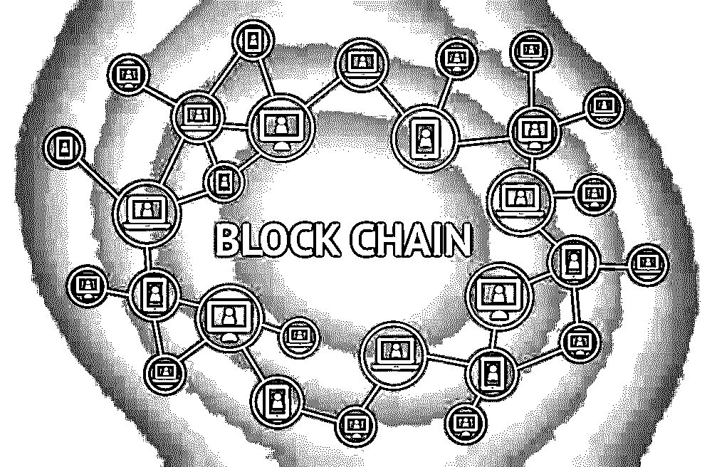

毋庸置疑，区块链是一项新技术，目前能真正将其融入实际业务操作的主要是大型企业与金融机构。随着区块链的火热和各大公司持续的研发投入和业务摸索，很快我们将迎来它的真正落地场景。

ICO 与数字货币并不是区块链的全部。

区块链未来已来，资本狂欢已然开启，场景落地近在咫尺。

最后再多说一句话：区块链有风险，投资需谨慎

**点击加入【灰产圈】高端社群**