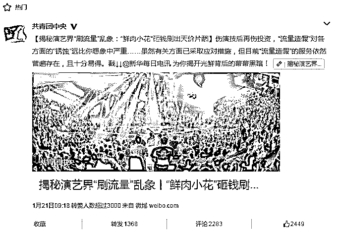
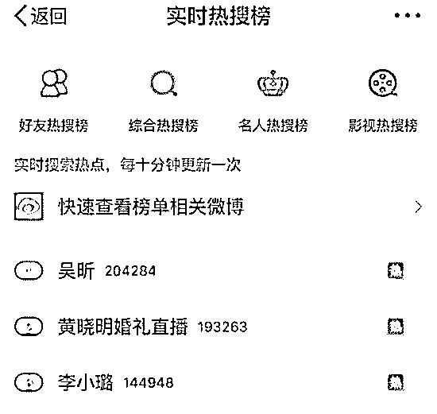
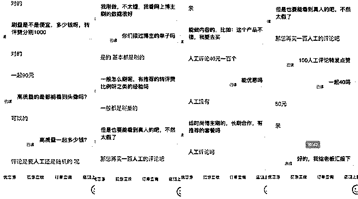

# 刷流量买热搜，揭秘演艺圈“流量担当”天价片酬背后的灰色流量产业链（深度长文）

> 原文：[`mp.weixin.qq.com/s?__biz=MzIyMDYwMTk0Mw==&mid=2247490371&idx=1&sn=5cbba76c2759433f725610506551feec&chksm=97c8d07ba0bf596d4e944906a7ba1134d1d75a2cf5e5c2c01c7bdf717b2bddb900d4086aaeaa&scene=27#wechat_redirect`](http://mp.weixin.qq.com/s?__biz=MzIyMDYwMTk0Mw==&mid=2247490371&idx=1&sn=5cbba76c2759433f725610506551feec&chksm=97c8d07ba0bf596d4e944906a7ba1134d1d75a2cf5e5c2c01c7bdf717b2bddb900d4086aaeaa&scene=27#wechat_redirect)

**导语：**

近日，共青团中央转发了新华每日电讯等权威媒体的文章，揭秘演艺界“刷流量”乱象：**砸钱刷出天价片酬，**黑客盗号刷量视频****

**附：揭秘演艺界“刷流量”乱象丨砸钱刷出天价片酬，黑客盗号刷量视频**

[`v.qq.com/iframe/preview.html?vid=v0535chj684&width=500&height=375&auto=0`](https://v.qq.com/iframe/preview.html?vid=v0535chj684&width=500&height=375&auto=0)

当前演艺圈，不少明星都被誉为“流量担当”。流量关乎人气，更决定身价。然而，近日被公认为重要“流量标签”“引流神器”的某社交网络平台，**被曝花钱即可登上“热搜话题榜”，**引发网络关注。

在影视领域，通过互联网手段雇佣“水军”“刷流量”等方式进行“流量造假”，已经对诚信声誉、评价标准等行业基础因素构成严重破坏和干扰。

虽然有关方面已采取应对措施，但是**目前“流量造假”的服务依然普遍存在，且十分易得。**这使得影视制作方、播出平台、艺人、广告商等方面实施或默许“流量假造”的动机，非但没有消除，反而更趋强烈。

这是一个粉丝经济的时代，粉丝的关注可以带来超高的身价、丰厚的回报，这也就成了整个演艺界不惜通过“刷流量”等手段博取眼球的内在动因。 

> **一.  一掷百万“刷流量”，真人“水军”成主流**

2017 年上半年，有媒体报道，热播剧《三生三世十里桃花》创下全网 309 亿播放量纪录，且最多时一天内播放量增加 14 亿。随后**，电视剧《孤芳不自赏》被指“买水军刷好评，做完后赖账”，大量“水军”在论坛****、豆瓣刷屏“讨薪”。**“刷流量”产业链由此曝光在公众视野当中。

在淘宝平台分别搜索“流量”“点击量”“微信”等关键词及其组合后发现，大量“刷流量”店铺依然存在。简单浏览，这些网店主要以“推广”为名，从事统称为“刷流量”的业务。据网页介绍显示，这些店铺的成交量由几单到数千单不等。

据介绍，**所谓“刷流量”，就是通过人工干预的手段（俗称“水军”）有偿增加对网站、网页、视频、社交媒体信息等各种对象的访问量、浏览量、点击量、回复量等。**比如，通过“水军”刷高某网络播出平台上影视作品的观看量、某条微博的转评和点赞量、某场网络直播的观看人数等。

**“当前，‘水军’分成技术型和人工型两种。”**曾从事“水军”业务，现在一家大型网络公司从事技术工作的 KK 说：“技术型水军”通过写代码、开发软件等方法寻找网络平台漏洞，或通过自动化程序同时操控大量手机端、电脑端注册账号来实现“刷流量”的目的。

一家名为“深度网站流量 ip 关键词搜索 pv 点击率排名优化 SEO 推广浏览访问量 uv”的商户，展示了他们办公场所的照片。

图片来源：网络，图文无关

目测照片展示的一层办公区中，至少有近千部手机。**商户说，工作人员会通过特制软件，操控这些手机完成各类“刷务”。**

有些极端的情况下，还会通过**“黑客”**手段，批量盗取他人闲置或使用率较低的账号进行远程操作。在账号主人完全不知情的情况下，使用他们的账号观看视频、点击网页或与某些社交媒体账号互动。

除此之外，某知名艺人工作室负责新媒体推广的 TT 透露：**“除了从外部刷，也有一些平台的内部技术人员收了钱，可以直接操作数据”。**

据调查，近年来，随着各类平台对自身技术系统与员工管理等多面实施“堵漏”，**“技术型水军”由于操作难度上升、效果下降，已渐渐成为支流。**“现在用软件程序刷出来的东西很快就会被平台检测出来并且过滤，而且也缺少个性化的内容”，KK 说，**现在业界主流是打出“真人刷流量”招牌的“人工型水军”。**

“找我们不是帮您刷流量，而是几十万会员在帮您做推广。”这是一家自称“每一个网络流量都来自真实人工访问”的网店在业务介绍中加粗标黑的内容。这个网店另一个同样显著标识出内容是“八年老店”。

自己经营一家文化传播推广公司的 cc 讲，这家自称“不是刷流量”的网店正是典型的**“人工型水军”**。

据 cc 介绍，**与“技术型水军”相比，其特点是“劳动力密集”——人多。**一个“水军”公司通常能够调动成百上千甚至数万的真人“水军”。他们成分复杂，但通常以两大类为主：一类是大学生，另一类是以此为业的“职业水军”。他们的工作是每天不断地亲手用不同的手机号、不同邮箱注册各类平台账号，然后根据自己“上线”的要求完成点击、观看、评论、回复等操作。

**因为是真人操作，这类“水军”较难被技术手段识别。**特别受雇主青睐的，还有他们可以完成各种“定制版”的互动任务。而比起纯技术操作出来的点赞或评论，被称为“精品评论”的“手工制作”，价格要贵出五到十倍：**一个普通点赞的平均价格是 5 毛，而一条“精品评论”目前至少是 5 元。**

> **二.平台卖榜标高价，明星买榜撑片酬**

之前的媒体曝光对“刷流量”业务起到的作用不大。类似行为在影视剧作、艺人推广和广告代言等领域当中依然广泛存在，甚至愈演愈烈。究其原因，各方均陷在分食“刷流量”所形成的利益圈中，难以抽身。

**“那些没有作品还总活跃在各种社交媒体上的‘流量担当’艺人，基本都是‘刷’出来的。” cc**十分肯定地透露了这个“业界规律”。

为了帮一些缺少作品的“流量”艺人维持“一线明星”的地位，其经纪公司或其本人只有靠不断增加在主流社交媒体平台的曝光率。

某社交网络平台的“热搜榜”“实时榜”等，因其平台用户规模大而受到各方青睐。以“热搜榜”为例，业内惯例是向该网站缴纳数万元费用，平台即可将指定的内容上榜到 5 到 10 名的位置，并停留一段时间。

“停留的时间非常短，能不能保住榜位，得靠自己买‘水军’来刷榜撑住。”多位操作过相关业务的业内人士介绍，如果不买到足够的“水军”来“刷榜”，“掉出去了就得重新买榜”。

而这笔买“水军”的费用是多少，要视当天榜单竞争热度而不同。一位艺人经纪说，**一次买榜刷榜投入十几万到几十万非常正常。而这不过是维持一名“流量担当”最基础的日常工作。**

然而，巨大的投入对于经纪公司和艺人来说，也意味着巨大的收入。以某作品不多但人气“火爆”的“流量小花”为例，多名影视界资深从业人员透露，她以“刷流量”为生是业内公开的秘密。但是该艺人一部电影的片酬是 5000 万元起步，一集电视剧的起步片酬则是 500 万元。

“当前，我国演员片酬档位的主要标准是演技水平和流量号召力，其中流量号召力对投资人的影响力越来越大，有时甚至是决定性的。”

而现实中大量出现“流量里有黄金屋，流量里有千钟粟”等“流量封神”的实例，也越来越刺激各方面对“粉丝经济”的迷信和盲从。**那些拥有“一线”“超一线”名号，却没有“流量”支撑的艺人，同比薪酬只有“流量担当”的 1/3，甚至 1/10。**

许多网络影视投资人的投资直接与某些“流量担当”绑定，要想获得投资，只能花天价去请这些艺人。

不仅影视投资，广告主对于广告代言人及作品的“流量”往往也有要求。这成为他们选择广告代言人的核心指标。

在一家著名日资广告公司工作多年的 P 先生以他正在操作的一场知名国际化妆品品牌广告活动为例，说明**“刷”流量是如何左右广告界的**。“艺人或者网红能够带来多少真实的流量，其实谁也说不清。比起数据怎么来的，从哪里来的，大家更需要屏幕上、报告上那些漂亮的数据。重要的是，我们工作完成了，他们工钱拿到了。”

> **三.伤了演技伤投资，涉嫌违法应整治**

2017 年，媒体报道了视频播放平台爱奇艺状告“刷流量”公司破坏市场公平并索赔 500 万的新闻，“刷流量”的行为似乎再也无法维持一种“你好我好大家好”的假象。事实上，**“流量造假”对各方面的“锈蚀”远比想象中严重。**

这不是爱奇艺与“水军”的第一次“交火”。此前，一些视频制作方利用爱奇艺的收入分账规则漏洞与技术不足，雇佣“水军”来“刷流量”，使爱奇艺蒙受巨大的经济损失。此后，爱奇艺一方面堵塞技术漏洞，一方面修改完善了与分账方法直接相关的“有效点击”规则，包括规定了“6 分钟有效观看”等内容，防止“水军”趁机“薅羊毛”。

目前，爱奇艺的技术手段已能够做到通过对账号活跃异常度、观看时间长度等多因素的筛选，基本剔除“水军”的影响。“现在刷视频点击的也少了，刷出来顶多是忽悠广告商，在平台分不到钱。”

**靠“流量造假”堆积起来的繁荣也使许多影视投资人跌落陷阱。**网络大电影《炒金男勇夺真爱》的投资人因为被“刷”出来的美丽数据所误导，投资后出现巨亏，如今陷入借贷度日窘境的他“发誓再也不投电影了”。**“演员没有演技，投资没有活力，长此以往，行业怎么能真正繁荣？”。**

> **四.微博大 V：阿尚叔 灰色数据产业链调查**

**请看视频：阿尚叔为你讲述品牌血泪史**

 [`v.qq.com/iframe/preview.html?vid=o05124o3d1b&width=500&height=375&auto=0`](https://v.qq.com/iframe/preview.html?vid=o05124o3d1b&width=500&height=375&auto=0) 

**1.流量是如何刷出来的？**

他们作假的成本是什么呢？

为什么可以刷转评赞呢？

如果转评赞都是机械粉，那为何会有真人出来辟谣呢？

是不是真人出来，就证明没有造假呢？

于是，问了下某宝，有了以下报价：90 元 1000 转、赞数据，40 元 100 真人评论。

阿尚叔（黄）与某宝小二沟通截图

那这些店主是如何刷流量的呢？我们来看官方权威媒体《第一财经周刊》的报道：

> 几个月前，高铎曾经伪装成客户，经人介绍在上海郊区的某个民房里“实地考察”过一家流量造假工厂。刚一进门他就被眼前的景象震惊了——老板购置了 5000 部 iPhone 6 和 iPhone 7 手机，“每一个小女孩负责一片，就像工作室一样，冲榜的、刷单的、刷量的，她们都会做。”高铎回忆。“无论是腾讯广点通、今日头条，还是 Google、百度或者微博等，这些大的平台都还可以。”

> 如果只看微信公众号、微博大 V、直播红人的造假行为，只能看到简单的操作，比如公众号刷阅读量，刷点赞，直播则通过机器或者水军制造假观众。

**2.刷流量的技术逻辑是什么？**

虎嗅网作者“超对称”的专业分析文章《数据造假黑产技术帖：如何给微信公众号、微博大 V、直播网红刷量》分析更透彻：

> a 公司是一个典型的数据造假公司，他们开发的技术在市面上属于最强之一。它的作业流程包含技术系统、核心资源和业务系统。
> 
> 不仅是用手机，在开放的安卓系统中，更为巧妙的方法是改造 Android 操作系统，将 Android 操作系统的数据接口截断，把自己生成的数据接口接入系统，做到 IMEI 号，SIM 卡号，电话号码三码合一。
> 
> 然后，通过一台手机模拟上几十万到上百万台手机。
> 
> 据 a 公司介绍，利用华为荣耀的一款手机，他们可以模拟出 50 万台看起来是真人在用的手机。他们在办公室放几百台手机，一百兆光纤，就能模拟出海量的手机协同工作。
> 
> 操作脚本，指挥上百万台模拟的手机在目标应用上进行操作不同行为，包括登陆、点赞、阅读、打赏。
> 
> 为了对抗大平台的反欺诈系统，模拟手机的操作必需看起来和真实用户的使用行为接近。因此在操作的时间点——几百万台手机在什么时候开机，什么时候登陆，切换到什么应用——需要由调度模块执行。程序员只需要模拟真人使用行为画时间曲线，调度模块即可自动执行……

这么说来，微博、微信上刷个转评赞确实是轻而易举。

那为什么会有疑似水军的微博账号，内容既有发布位置，有会发布原创内容，点击进去，发现半真半假。

他们是真的粉丝吗？

很多都是微博达人，难道也不是真人吗？

如果不是，他们是如何产生的呢？

其实达人不达人，与真人无关。原则上，只要人能够通过鼠标解决的问题，程序都是可以解决的。

有的通过非法手段类解决的，比如写程序把你的手机搞成肉鸡。

什么是肉鸡呢？按照百科的说法，肉鸡也称傀儡机，是指可以被黑客远程控制的机器。比如用"灰鸽子"等诱导客户点击或者电脑被黑客攻破或用户电脑有漏洞被种植了木马，黑客可以随意操纵它并利用它做任何事情。

**3.有些是真人评论，有发布位置，有自己的生活照，难道这也是僵尸粉吗？**

除了被操纵之外，就是真人愿意被操纵，这就成了一项业务。

你搜索下，“在家轻松赚钱”“动动手指就能挣钱”等话题，就会找到类似的业务。真的能够做到一呼百应，真人点击、评论、刷投票等都可以。

费用呢，就回到了市场上的价格。成本 40 元，100 位真人评论，至于他们是否是目标受众，是否是奢侈品的目标消费者，可想而知。

> **灰产圈观点：“刷流量”“刷单”等行为是互联网发展必然产生的乱象**

互联网的刷单行为属于一种传统。从 alex 网站流量开始，真实数据就是一个互联网公司的秘密，谁都不知道，只有知道水深水浅的投资人才不会被忽悠。因为绝大多数互联网公司在能够盈利之前，基本上都是靠投资活着的，那么数据表现就成为投资人投资的重要依据，如果你不做假，怎么拿到下一轮融资？在一个行业，一般都会有几个直接竞争对手，如果对手刷单，你不刷单，那对手的数据就比你好看，你怎么办？你拿不到投资，很快就会死了，不刷单就没有活路。

举例：淘宝店铺，流量就是一切，假设现在所有店铺都很诚实，都不刷单。现在在同一产品的销量排名上甲是真实的第一名，乙是第二名，那么这个第一名的排名就可能给甲带来 3 倍于乙的流量，甲大概每个月可以比乙多出 1000 万净利润。现在突然乙想明白了，我要刷单，我一个月支付给第三方 100 万费用去刷单，结果我的店铺排名第一，每个月可以多赚 800 万净利润，那我为什么不破坏这个规则？但是，当大家发现乙在刷单的时候，甲也会去刷，丙也会刷，结果甲也花了 100 万，排在了第一名，但是这个时候大家发现自己的营销费用都上升了，但是净利润却没有上升。然而你再也没法不刷单了，因为你不刷了，你的店铺直接掉出搜索结果前三页，根本就没有流量了。

> **结尾：**

“流量造假”,看上去人畜无害,实则却将互联网社会中的各方面、你我他都裹挟进来:在文艺领域,一个演员的成败变成了不看“才气”而看“财力”的“撒币”游戏；在文化经济领域,“品质与品位”的“身价”在“流量与流行”面前开始越来越“抬不起头来”；在“大众审美”领域,越来越多的观众变成在神剧和烂片的温水中被煮熟的青蛙；更严重的是,当数据造假的病态成为日常运营中的常态,不断被污染的数据流还能否支撑起数据产业兴旺发展、升级超车的美好梦想呢?

**对于一个社会而言,我们不能接受我们的审美取决于价格；对于一个产业而言,它的繁荣不可能建立于虚假之上。**

文章部分节选自：共青团中央 阿尚叔

* * *

**【灰产圈】高端社群 小程序 已开通，社群成员突破 1000＋，2018 年社群项目正在开发中**

<mp-miniprogram class="miniprogram_element" data-miniprogram-appid="wx4f706964b979122a" data-miniprogram-path="pages/topics/topics?group_id=881854415822" data-miniprogram-nickname="知识星球" data-miniprogram-avatar="http://mmbiz.qpic.cn/mmbiz_png/kialtkOXGKS7D9hZrmO2jzDqryXXTAlhxSpnrKnHGV65KXzicibOppaPic4dCRxftvabB8Iqswo3OuQEDSxE7NicXBg/0?wx_fmt=png" data-miniprogram-title="【灰产圈】高端社群" data-miniprogram-imageurl="http://mmbiz.qpic.cn/mmbiz_jpg/WWG78hysZ0brJkWoyG2VDIacqgQjkDfp6mLiaoPBJ2SgWZHtRuTw7ia8kpoxntsn7PiaFOQO2U23FW6Iry0gS1GnA/0?wx_fmt=jpeg"></mp-miniprogram>

**点击加入【灰产圈】高端社群**

# 

> 原文：[`mp.weixin.qq.com/s?__biz=MzIyMDYwMTk0Mw==&mid=2247490356&idx=1&sn=1cea4883a6a53ddb63e7873c67d5d8e0&chksm=97c8d00ca0bf591a8eb728660d0a83380722b18113dd5d8dd2b1662fc766e6917b3080bba0a3&scene=27#wechat_redirect`](http://mp.weixin.qq.com/s?__biz=MzIyMDYwMTk0Mw==&mid=2247490356&idx=1&sn=1cea4883a6a53ddb63e7873c67d5d8e0&chksm=97c8d00ca0bf591a8eb728660d0a83380722b18113dd5d8dd2b1662fc766e6917b3080bba0a3&scene=27#wechat_redirect)