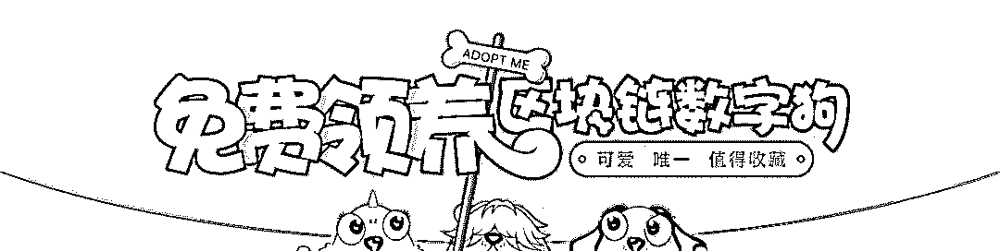
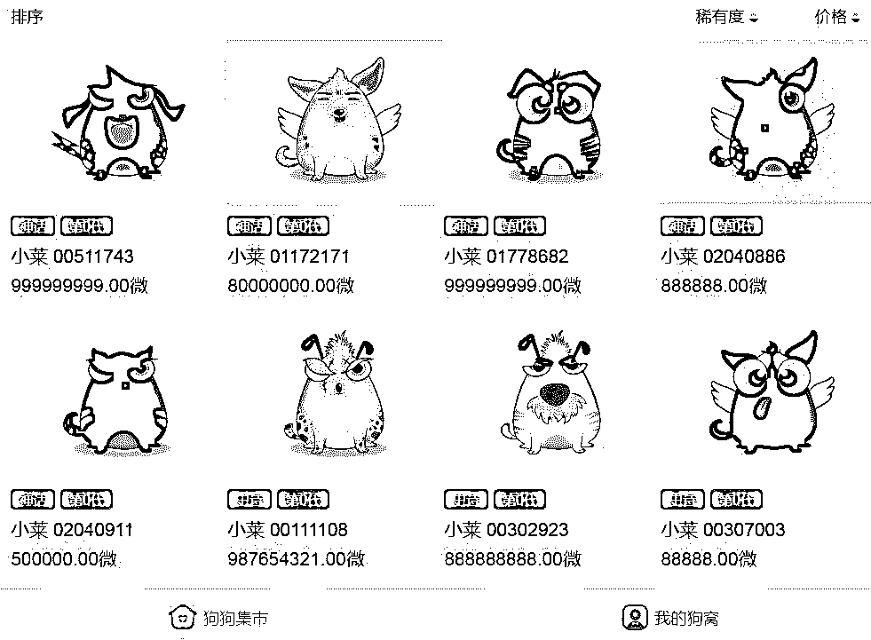
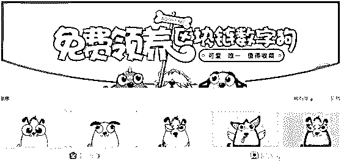
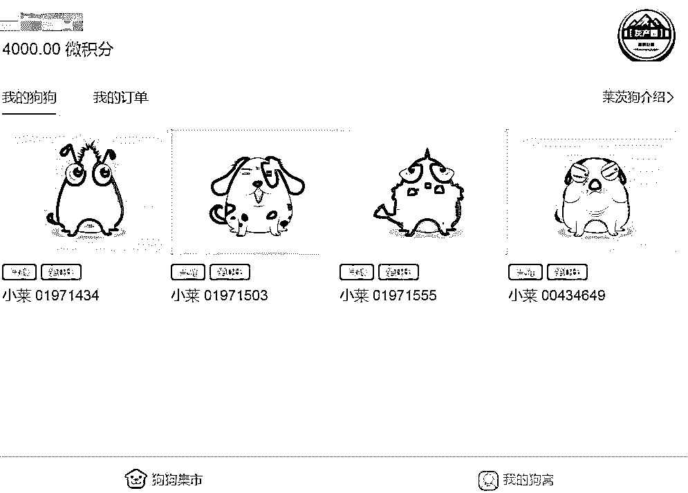
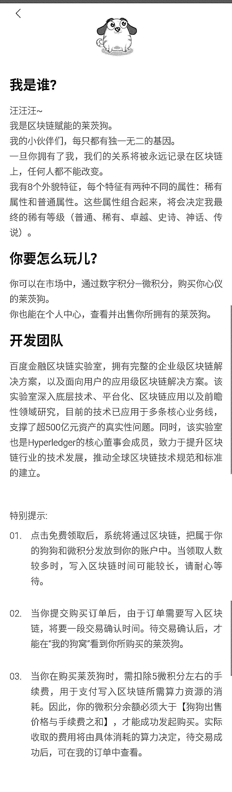
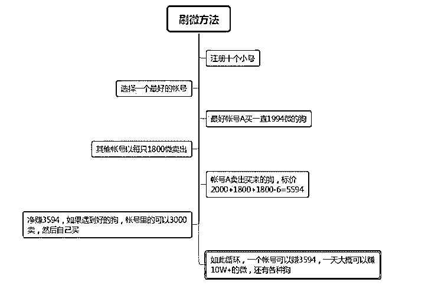
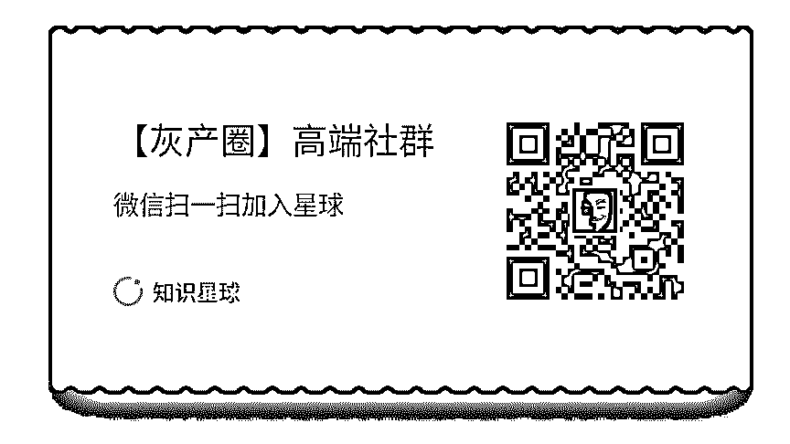

# 网易养"猫"，百度养"狗"：深度揭秘百度区块链宠物"莱茨狗"

> 原文：[`mp.weixin.qq.com/s?__biz=MzIyMDYwMTk0Mw==&mid=2247490159&idx=1&sn=65a33e94f2d53d1d2fa1242656cdfc28&chksm=97c8d157a0bf5841961e7c188483ce81a2418c7169e504d18abbf4256bbeb93056c0d368d0ee&scene=27#wechat_redirect`](http://mp.weixin.qq.com/s?__biz=MzIyMDYwMTk0Mw==&mid=2247490159&idx=1&sn=65a33e94f2d53d1d2fa1242656cdfc28&chksm=97c8d157a0bf5841961e7c188483ce81a2418c7169e504d18abbf4256bbeb93056c0d368d0ee&scene=27#wechat_redirect)

**网易养"猫"，百度养"狗"：深度揭秘百度区块链宠物"莱茨狗"**

* * *

****

**导语：**

**百度金融的莱茨狗项目，真是对区块链技术在商业应用（金融+游戏）上的探索，这步棋走得不错，值得肯定。**

**还记得之前风靡国外的区块链技术的养猫游戏 CryptoKitties 吗？一只虚拟的电子猫在市场上最高标价达 340 万美元！百度莱茨狗就是一款类似 CryptoKitties 的游戏。**

**什么是“莱茨狗"?**

日前，百度上线了一款基于区块链技术的养狗游戏,名叫 “莱茨狗”。

基于区块链技术的狗狗都具有唯一性，每一只数字宠物狗都不可复制，并且不可被修改和销毁。在官方首页，**“可爱、唯一、值得收藏”**的 banner 十分醒目。显然，在官方的眼中，莱茨狗是值得收藏的，有升值空间的虚拟货币。

**从大方向说**，“莱茨狗”是百度刚刚推出的一个区块链游戏项目（官方地址：pet-chain.baidu.com），由百度金融区块链实验室开发。该实验室主管企业级区块链解决方案，以及面向用户的应用级区块链解决方案。

**从小的方面来说**，也就是对于普通的大众用户而言，我们通过以上链接所免费领取到的，就是一个“区块链数字狗”。基于区块链技术，每一只“莱茨狗”都有其独一无二的基因且不可被复制、修改和销毁，是独一无二的。它们都具有唯一、值得收藏的特性。

可以说，**“莱茨狗”就是一个虚拟宠物**。但与我们之前所遇见的虚拟宠物不同的是，每只“莱茨狗”都有其升值潜力，是有价值的，也就是说，我们手里的每一只“莱茨狗”都是可以明码标价的。随着交易的进行，我们可以从买卖中获得利益。

目前，莱茨狗有 8 个外貌特征，每个特征有两种不同的属性：稀有属性和普通属性。这些属性组合起来，决定了狗狗的最终的稀有等级（普通、稀有、卓越、史诗、神话、传说）。

**是时候看看“莱茨狗”的长相了：**

（每只“狗”长相都不用，下面的“微”是指的标价）

**“莱茨狗”是如何运行的？**

**莱茨狗游戏的玩法很简单**，用户使用百度账号登录即可以领养 2 只狗狗，领养狗狗的同时还能获得微积分，每领养一只获得 1000 微积分。未来，用户可通过使用百度内部产品获得微积分，微积分可以用来购买莱茨狗游戏市场中的狗狗。

目前，领养狗狗之前用户需要下载百度钱包。

当宠物狗价格上升到一定程度的时候，全球的玩家都可以自由交易自己的数字狗。

**如何获得“莱茨狗”？**

很简单，你只需要拥有一个百度账号和下载“百度钱包”。

在“莱茨狗”领取页面中（https://pet-chain.baidu.com/），我们可以看到，每个人可以同时拥有两只“莱茨狗”，百度会免费送你一只以及 1000 微积分，而你可以利用这 1000 微积分去买第二只“莱茨狗”。所有的“莱茨狗”都是以微积分的形式进行交易的

未来，用户还可以通过在百度钱包中的其他交易获得微积分。从目前来块，区块链是一个公认的“杀手级”应用。百度通过领养“莱茨狗”这一娱乐性的方式将赚钱、区块链、百度钱包等社区产品连接起来，增强各应用和用户的粘性，可谓明智。

**   附：灰产哥领取到的四只“莱茨狗”（如何领取四只“莱茨狗”文末有攻略）**

**需要注意的两点：**

1、早期用户可以免费得到 2 只莱茨狗。

2、通过微积分（莱茨狗官方货币）购买。目前狗狗价格从 1 微积分到 100000000 积分，跨度很大。此外，当你在购买莱茨狗时，需扣除 5 微积分左右的手续费，用于支付写入区块链所需算力资源的消耗。

因此，你的微积分余额必须大于【狗狗出售价格与手续费之和】，才能成功发起购买。

**附：百度官方对莱茨狗的解释**

**百度为什么要推出“莱茨狗”？**

百度金融区块链实验室数字狗仅在内部测试阶段，是区块链技术应用领域的一次尝试。

众所周知，基于以太坊的养猫游戏 CryptoKitties 推出一天后便如病毒版扩散，火热得造成了以太坊网络长时间、大范围的拥堵，当然随之收获了一大批用户。

**同样，如果“莱茨狗”能够借用人们对宠物的热情，也获得上述的市场效果，那么直接受益的就不是每次交易的 5 微分手续费，而是百度钱包的用户数，以及交易关联**。

不仅如此，由于“领取时可获得微积分，未来用户可通过使用百度内部产品获得微积分”，这个方式也一定程度上推动百度各产品的社区运营。四两拨千斤。

也许这只是一次传播行为，也许，这背后的影响也较为深远。

区块链代表新的时空。我们不期待这就是所谓“杀手级”应用，抛开交易的投机问题，作为一个现象级的去中心化游戏，“莱茨狗”另一个重要意义应该是，可以连接起区块链与更广泛的人群，让玩家以游戏的方式接触到区块链，为区块链新经济奠下基础。

因为，钱包产生的是交易连接，基于区块链，我们可以畅想物联网、共享经济等潜力巨大的场景，但前提是用户账户的普及。

**要知道，蚂蚁金服的前身，是支付宝。**

**如何理解“莱茨狗”？**

**“莱茨狗”是百度对区块链的首次探索**

在上面我有提到，当前想要领养莱茨狗，用户需要先下载百度钱包。从这里可以看出，莱茨狗已经和百度金融做了绑定。或者我们可以说，莱茨狗是百度金融用区块链技术在金融和游戏领域的一次大胆尝试。

从金融角度来说，区块链技术对金融的改变是当前最热门的应用探索方向。

**区块链行业展望**

**1、区块链+支付**

支付是金融市场最重要的基础设施，区块链技术最先革新领域就是支付清算。区块链低成本，低风险的交易特性正在被越来越多的人所认可。它在革新全球的支付清算格局。

**2、区块链+征信**

征信市场是当前的一个蓝海市场，但传统征信市场信息孤岛问题凸显，如何共享数据成分发掘数据蕴藏的价值，传统技术架构很难难解决。区块链的共识机制，既能提高征信的公信力，还能显著降低征信成本，提供多维度的精准大数据。区块链对征信市场的革新是必然的。

**3、区块链+交易所**

区块链或成为未来主要的交易系统。区块链的去中心化、开放性、共享性、匿名性、不可篡改性等特征，可以显著提升登记、发行、交易、转让、交割清算效率，也可以保障信息安全与个人隐私。目前，区块链技术已被一些国际交易所应用到了证券发行和资金清算环节。

**4、区块链＋数字货币**

比特币的火热让人们认识到了数字货币的巨大能量。区块链技术最早应用于比特币，尽管比特币天然不是法定货币，但却为法币由纸币进入数字货币时代奠定了技术基础和应用示范，目前各国央行都在加紧研究法定数字货币。

**毋庸置疑，区块链技术在重塑金融商业规则**。

具体到莱茨狗游戏，由于绑定了百度金融，这对百度钱包来说肯定是利好，但莱茨狗带来的好处不止于此，由于微积分的获得是依靠使用百度内部应用来获得，这必将激活用户使用百度的各线产品的热情。虽然这种热情不见得持久，但如果其中有 1 到 2 款产品能够借机崛起的话，也就不错了。

区块链赋能产品，百度金融这个思路是不错的。通过区块链游戏探索区块链应用，或是事半功倍的做法，是很有价值的探索。

如何领取 4 只“莱茨狗”？

**官网地址：**

**https://pet-chain.baidu.com/**

**领取地址：**

**第一只：****https://pet-chain.baidu.com/chain/splash**
**第二只：****https://pet-chain.baidu.com/chain/splash?appId=2&tpl=wallet**
**第三只：****https://pet-chain.baidu.com/chain/splash?appId=3&tpl=wallet**
**第四只：****https://pet-chain.baidu.com/chain/splash?appId=4&tpl=wallet**

**（这只是一个百度账号可以领取到的“莱茨狗”，如果批量操作，你懂得！）**

**福利： 购买“莱茨狗”的需要货币“微” ，下图为刷“微”方法 **

**延伸阅读**：[深度|丁磊养了七年"猪"，如今又准备养"猫"？揭秘“网易招财猫”：全新区块链宠物](http://mp.weixin.qq.com/s?__biz=MzIyMDYwMTk0Mw==&mid=2247489806&idx=1&sn=734bb55c84d2d7802065221a063b7ff7&chksm=97c8d236a0bf5b20912630f12cf06c28aa4ee744b99e829e497f46cec3e3b63d36c823bf8fe8&scene=21#wechat_redirect)

* * *

**【灰产圈】高端社群 知识星球  欢迎加入 学习 区块链项目**

**【灰产圈】高端社群 小程序 已开通，社群成员突破 1000＋**

<mp-miniprogram class="miniprogram_element" data-miniprogram-appid="wx4f706964b979122a" data-miniprogram-path="pages/topics/topics?group_id=881854415822" data-miniprogram-nickname="知识星球" data-miniprogram-avatar="http://mmbiz.qpic.cn/mmbiz_png/kialtkOXGKS7D9hZrmO2jzDqryXXTAlhxSpnrKnHGV65KXzicibOppaPic4dCRxftvabB8Iqswo3OuQEDSxE7NicXBg/0?wx_fmt=png" data-miniprogram-title="【灰产圈】高端社群" data-miniprogram-imageurl="http://mmbiz.qpic.cn/mmbiz_jpg/WWG78hysZ0brJkWoyG2VDIacqgQjkDfp6mLiaoPBJ2SgWZHtRuTw7ia8kpoxntsn7PiaFOQO2U23FW6Iry0gS1GnA/0?wx_fmt=jpeg"></mp-miniprogram>

点击“阅读原文”加入高端社群。