# 深度|“挖矿木马”大行其道：下载植入数千万部手机，挖矿年产值数亿美金！

> 原文：[`mp.weixin.qq.com/s?__biz=MzIyMDYwMTk0Mw==&mid=2247490146&idx=1&sn=bd7c4cecc918958660c15e5370913278&chksm=97c8d15aa0bf584c9681beda6f1c17db98defa6ec3f7cac5de8f50680417cda4d585ff905b6a&scene=27#wechat_redirect`](http://mp.weixin.qq.com/s?__biz=MzIyMDYwMTk0Mw==&mid=2247490146&idx=1&sn=bd7c4cecc918958660c15e5370913278&chksm=97c8d15aa0bf584c9681beda6f1c17db98defa6ec3f7cac5de8f50680417cda4d585ff905b6a&scene=27#wechat_redirect)


## 

## **授权作者****：360 安全卫士**

## 导语：

手机挖矿木马就是在用户不知情的情况下利用其手机的计算能力来为攻击者获取电子加密货币的应用程序。

电子加密货币是一种匿名性的虚拟货币，由于不受政府控制、相对匿名、难以追踪的特性，电子加密货币常被用来进行非法交易，也成为犯罪工具、或隐匿犯罪所得的工具。

**2014 年 3 月首个 Android 平台挖矿木马被曝光。权威调查显示 2018 年 1 月 Android 平台挖矿木马接近 400 个。**

从 Android 平台挖矿木马伪装应用类型看，**工具类（20%）、下载器类（17%）、壁纸类（14%）**是最常伪装的应用类型。

从样本来源来看，除了被曝光的在 Google play 中发现的十多个挖矿木马外，我们在第三方下载站点捕获了 300 多个挖矿木马，总下载次数高达 260 万余次。

从网站来看，据 Adguard 数据显示，2017 年近 1 个月时间内在 Alexa 排行前十万的网站上，约有 220 多个网站在用户打开主页时无告知的利用用户计算机进行挖矿，影响人数多达 5 亿。大多是以视频门户网站，文件分享站，色情网站和新闻媒体站等这类相对访问时间较长的站点。

Android 平台发现的挖矿木马选择的币种主要有

**（BitCoin）、莱特币(Litecoin)、狗币(Dogecoin)、卡斯币(Casinocoin) 以及门罗币（Monero）**这五种。

挖矿方式有单独挖矿和矿池挖矿两种，Android 平台挖矿木马主要采用矿池挖矿。

Android 平台挖矿木马技术原理从代码上看，主要分为使用**开源的矿池代码库进行挖矿和使用浏览器 JavaScript 脚本挖矿**。

 挖矿木马的技术手段包括**检测设备电量、唤醒状态、充电状态、设置不可见页面以及仿冒应用下载器**。

应用盈利模式由广告转向挖矿，**门罗币**成为挖矿币种首选以及攻击目标向电子货币钱包转移成为 Android 平台挖矿木马的趋势。

目前挖矿木马的防御措施，PC 平台已经具备防御能力，移动平台由于权限控制不能彻底防御。

移动平台挖矿受限于电池容量和处理器能力，但电子加密货币正在快速增长，现有货币增值并出现新的货币币种，挖矿最终会变得更有利可图。

## 一  Android 平台挖矿木马介绍

### 一、   什么是手机挖矿木马

挖矿，是获取比特币等电子加密货币的勘探方式的昵称。由于其工作原理与开采矿物十分相似，因而得名。

手机挖矿木马就是在用户不知情的情况下利用其手机的计算能力来为攻击者获取电子加密货币的应用程序。

### 二、   电子加密货币

电子加密货币是一种匿名性的虚拟货币。它不依靠任何法定货币机构发行，更不受央行管控。交易在全球网络中运行，有特殊的隐秘性，加上不必经过第三方金融机构，因此得到越来越广泛的应用。

由于不受政府控制、相对匿名、难以追踪的特性，电子加密货币常被用来进行非法交易，也成为犯罪工具、或隐匿犯罪所得的工具。

2009 年，比特币成为第一个去中心化的电子加密货币，也是目前知名度与市场总值最高的加密货币

2017 年比特币的价格上涨了 1500%，最高时单个比特币价格逼近 2 万美元。且随着比特币价格的疯狂上涨，挖矿木马的攻击事件也越来越频繁。

### 三、   手机挖矿木马历史演变

挖矿木马最早是 2013 年在 PC 平台上被发现。手机挖矿木马经过一阵沉寂后，随着电子加密货币价格的一路走高，恶意软件作者又重新将目标转向了挖矿。手机挖矿木马的攻击事件也重回视野，且势必是未来恶意软件的趋势之一。

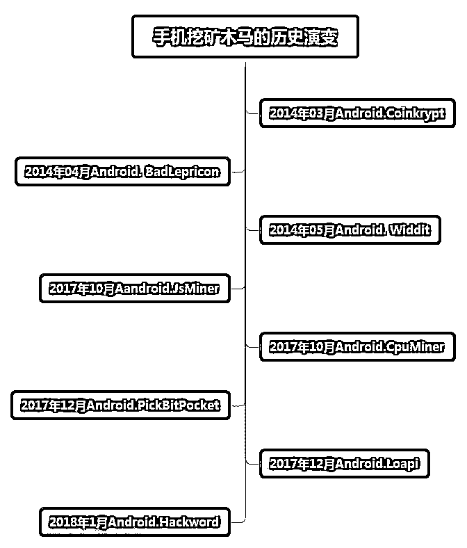 

## 二  Android 平台挖矿木马现状

### 一、规模和影响

仅 2018 年 1 月 Android 平台挖矿木马接近 400 个，占全部 Android 平台挖矿类木马近三分之一。

2014 年 Android 挖矿木马经过短暂的爆发后，于 2015，2016 年逐渐归于平静。主要原因是受到当时移动平台技术等限制，以及电子货币价格影响，木马作者的投入和产出比不高。但随着 2017 年年底电子货币价格的一路高涨，挖矿技术的成熟，再次得到木马作者的目标，手机挖矿木马在也呈爆发式增长。

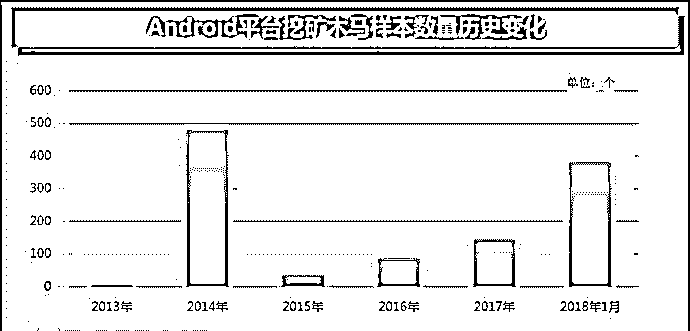 

Android 平台挖矿木马伪装成各类应用软件，统计发现其中**工具类（20%）、下载器类（17%）、壁纸类（14%）**是最常伪装的应用类型。

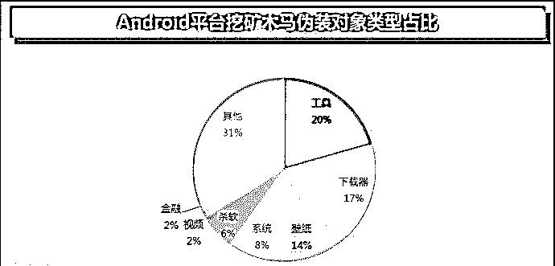 

从样本来源来看，除了被曝光的在 Google play 中发现的十多个挖矿木马外，我们在第三方下载站点捕获了 300 多个挖矿木马，根据其网页上的标识，估算出这个网站上的 APP 总下载次数高达 260 万余次。

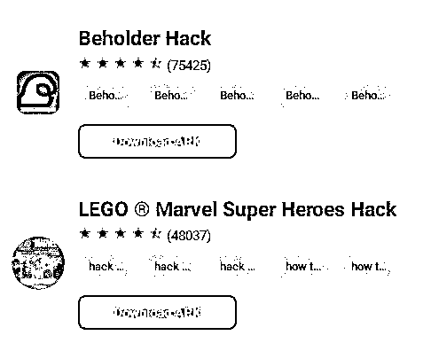 
图 5 第三方下载站点下的挖矿木马

### 二、   目标币种

挖矿木马在币种选择上是随着币种的挖掘难度和币种相对价格等因素而变化。

目前在 Android 平台发现的挖矿木马选择的币种主要有**（BitCoin）、莱特币(Litecoin)、狗币(Dogecoin)、卡斯币(Casinocoin) 以及门罗币（Monero）**这五种。

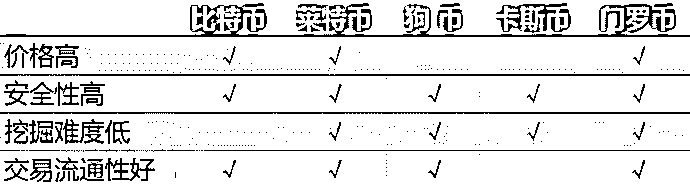 
图 9 币种优劣势对比

### 三、挖矿方式及收益分配

挖矿方式有单独挖矿和矿池挖矿两种。下面以比特币为例来说明两种挖矿方式的区别。

（一）独立挖矿

独立挖矿是指使用自己计算机当前拥有的计算能力去参与比特币的挖掘，获取到的新区块的收益全归个人所有。

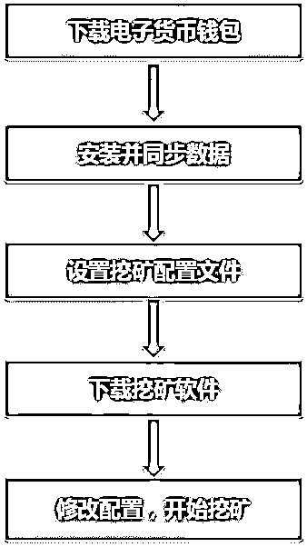

图 10 独立挖矿流程

比特币平均每十分钟产生一个区块，而参与比特币挖掘的用户数量非常庞大，独立挖矿可能一整年也无法抢到一个区块。且手机的计算能力相比于其他挖矿设备更是有限，当前 Android 平台还未发现使用独立挖矿手段来获取电子货币的挖矿木马。

（二）矿池挖矿

矿工是参与比特币勘探竞争的网络成员的昵称。而矿池是一个通过特定算法而设计的服务器，所有连接到矿池服务器的用户，会组队进行挖矿。

个人设备的性能虽然渺小，但是成千上万的人进行组队挖矿，总体性能就会变得十分强大，在这种情况，挖矿的成功率会大大提升，一旦矿池中的队伍成功制造了一个区块，那么所有队伍中的人会根据每个人贡献的计算能力进行分红。矿池的开发者一般会对每个用户收取一定手续费，但由于这种方法让大家更稳定得获得比特币，大部分矿工都会选择矿池挖矿，而不是单独挖矿。

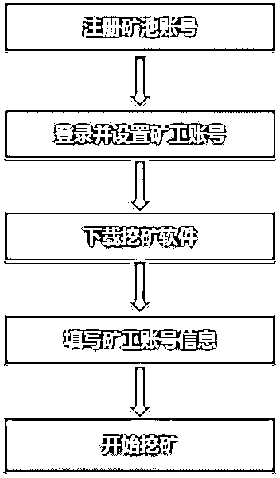

**图 11 矿池挖矿流程**

矿池挖矿也分为一般矿池挖矿和前端矿池挖矿：

> 1\. 一般矿池挖矿：一般矿池挖矿直接利用 CPU 或 GPU 本身的高速浮点计算能力进行挖矿工作。由使用 C 或者其他语言构造的挖矿程序进行 CPU 或 GPU 计算得到算力价值。矿池根据产生的算力价值进行分红，并收取 10%以下的矿池手续费。
> 
> 2\. 前端矿池挖矿：前端挖矿利用 asm.js 或 webAssembly 前端解析器中介在浏览器端被动使用用户的 CPU 完成挖矿或者利用 Html5 新规范 WebGL 利用浏览器完成 GPU 挖矿操作。由浏览者产生的 CPU 或 GPU 计算得到算力价值。前端矿池（如 Coinhive[11]）会收取 30%的矿池手续费。

由于使用方便，跨平台且隐藏性较好等特点，前端矿池挖矿逐渐得到挖矿木马作者的青睐。

## 三  Android 平台挖矿木马技术原理

### 一、挖矿技术原理

在 Android 平台上攻击者为追求稳定的收益，挖矿方式通常都选择使用矿池来进行挖矿。攻击者通过挖矿木马远程控制用户手机，在用户不知情的情况下，使手机持续在后台挖掘电子货币来为其牟利。

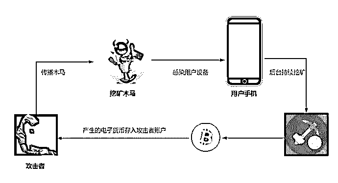

**攻击者通过挖矿木马赚取收益的攻击流程**

而在代码层上的表现形式为，嵌入开源的矿池代码库进行挖矿和使用矿池提供的浏览器 JavaScript 脚本进行挖矿。

### 二、挖矿木马的技术手段

挖矿的过程运行会占用 CPU 或 GPU 资源，造成手机卡顿、发热或电量骤降等现象，容易被用户感知。为了隐匿自身挖矿的行为，挖矿木马会通过一些技术手段来隐藏或控制挖矿行为。

（一）检测设备电量

挖矿木马运行会导致电池电量明显下降，为保证手机在多数情况下正常运行而不被用户察觉，会选择在电池电量高于 50%时才运行挖矿的代码。

（二）检测设备充电状态

设备在充电时会有足够的电量和发热的想象。在充电时运行挖矿木马避免用户察觉挖矿带来的电量下降和发热等现象。

（三）设置不可见的页面进行挖矿

挖矿木马通过设置 android:visibility 为 invisible 属性，达到不可见的 Webview 页面加载效果从而使用 JavaScript 脚本进行挖矿，隐藏自身的恶行挖矿行为。

（四）仿冒应用下载器

挖矿木马通过仿冒热门应用骗取用户下载，实际只是应用的下载器，软件启动后就开始执行挖矿，仅仅是提供了一个应用的下载链接。

## 四  Android 平台挖矿木马趋势

Android 平台挖矿木马的演变很大程度上受到 PC 上的挖矿木马影响，通过持续关注挖矿木马的攻击事件，我们发现 Android 平台挖矿木马正朝着三个方向发展。

### 一、应用盈利模式由广告转向挖矿

通过分析来自某个 APP 下载网站的样本发现，在其早期的应用中内嵌了广告插件，软件运行时会联网来控制样本请求访问的广告，而在近期当软件访问同一个请求时，返回的内容加入 Coinhive 挖取门罗币的 JS 脚本。

### 二、门罗币成为挖矿币种首选

对于攻击者而言，选择现阶段币种价格相对较高且运算力要求适中的数字货币是其短期内获得较大收益的保障。

早期挖矿木马以**比特币（BitCoin）、莱特币(Litecoin)、狗币(Dogecoin)、以及卡斯币(Casinocoin)**为主。

而随着比特币挖矿难度的提高，新型币种不断出现，比特币已经不在是挖矿木马唯一的选择。门罗币（Monero）首发于 2014 年 4 月，发行时间相对较短，现阶段的挖矿木马主要以门罗币作为挖掘目标，主要在于门罗币相对其他电子加密货币拥有多种明显的优势：

> 1）门罗币具有更好的匿名性。门罗币在交易中，不涉及提供钱包地址。对方通过钱包地址来查看你的钱包资产情况。
> 
> 2）门罗币有更好的挖矿算法。它并不依赖于 ASIC，使用任何 CPU 或 GPU 都可以完成，这就意味着即使普通的计算机用户也能够参与到门罗币挖矿中来。甚至可以利用剩余的计算机能力来挖矿
> 
> 3）门罗币拥有“自适应区块大小限制”。门罗币从一开始就设置了自适应的区块大小，这意味着，它可以自动的根据交易量的多少来计算需要多大的区块。因此门罗币从设计上就不存在像比特币的扩容等问题。
> 
> 4）门罗币背后的研发团队的设计质量发展目标都很优越。互联网上有许多优秀的开源门罗币挖矿项目，拥有众多贡献者。

### 三、   黑客攻击目标向电子货币钱包转移

由于攻击电子货币钱包能直接获取大量的收益，PC 上已出现多起攻击电子货币钱包的木马，通过盗取电子货币私钥或者在付款时更改账户地址等手段实现盗取他人账户下的电子货币。

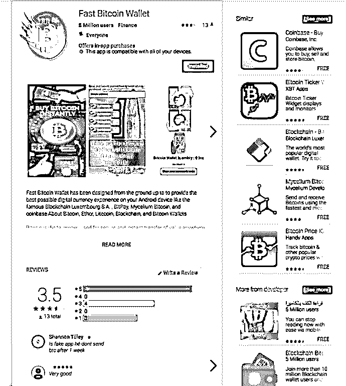

** 伪装成比特币钱包的 PickBitPocket 木马**

而在 Android 平台也发现了类似的攻击事件，PickBitPocket 木马伪装成比特币钱包应用，且成功上架在 Google Play。其在用户付款时将付款地址替换成攻击者的比特币地址，以此来盗取用户账户下的比特币。

对于电子货币钱包应用本身存在的漏洞和风险，并没有引起足够的重视程度。比特币地址相当于银行帐号，私钥相当于开启这个帐号的密码。且通过私钥可以得知其比特币地址，并能对该地址下的比特币进行转账，也就是说获得比特币私钥就拥有了该私钥和地址下的比特币的完全控制权。我们在调查分析中发现部分电子货币钱包甚至将私钥未加密的备份在 SD 卡，对于私钥的备份、存储安全，还需要进一步的增强。

## 五  挖矿木马案例解析

**一，“太极挂机”软件：披着网赚外衣的“挖矿木马”**  

近期，网上兴起一种“太极挂机”软件，声称只需下载运行该软件无需任何操作就能轻松挂机赚钱。所谓的挂机网赚只是木马病毒的幌子。包括“太极挂机软件”在内的多款类似恶意程序一旦被用户下载并安装，不但会大量占用 CPU 资源进行挖矿操作，还会在用户机器上传播 Ramnit 感染型木马，更有甚者，直接给电脑添加上 MBR 密码使用户无法正常登录系统！

下面就以“太极挂机”程序进行简单分析：

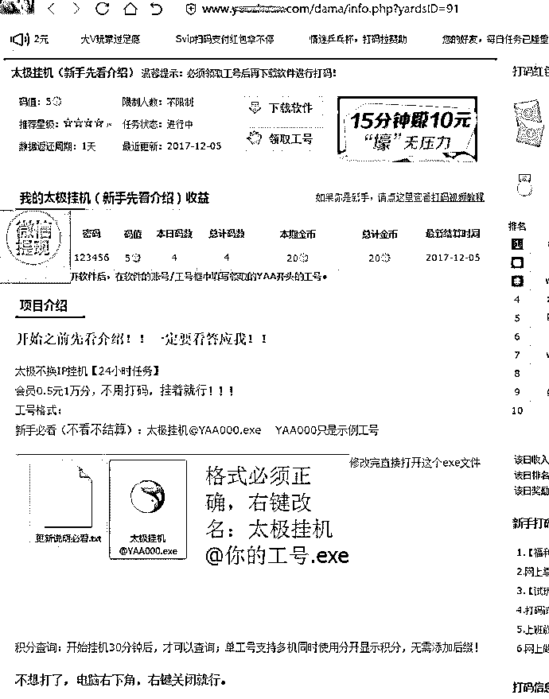

## **挖矿行为：**

程序运行后检测没有被调试后便开始挖门罗币，挖门罗币的矿池、钱包等信息：

挖矿时 CPU 几乎被 100%占用：

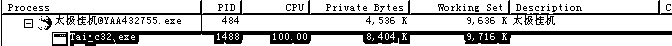

上述分析得到门罗币钱包地址：

```
48W67urumqALX6UDRyqpSG8ENHLj9mbswgLSEVTHR3JMc6WqrRw8CRrTvDk2yL2eC2PCH5j5urG2fgtnnuAnzGRbTaNvhgv
```

这个钱包共有 20 个门罗币，以当前的门罗币兑人民币单价计算，总值达到约 3.7 万元人民币。

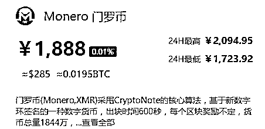

**二.挖矿木马横扫网吧：怒赚百万！**

发现多款网吧视频播放软件存在挖矿行为，这些软件占用网吧计算机资源挖取数字货币，不仅严重影响计算机的正常工作，造成机器性能下降，耗电增加，而且长时间挖矿还会缩短硬件使用寿命，极大增加网吧运营成本。以目前 PC 的性能与耗电量来算，用 PC 挖矿在很大程度是亏损的！

表 1 展示了其中几款存在挖矿行为的视频播放软件的文件信息。

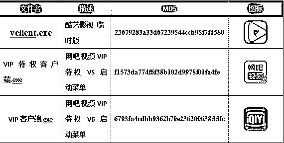

这些视频播放软件都包含一个名为 flashapp.dll 的组件，该组件会从服务器下拉挖矿程序并执行。

挖矿程序使用多个不同的虚拟货币钱包地址。以门罗币为例，黑客就使用了数十个不同的门罗币钱包地址，这些钱包中的门罗币数量为 1 个到 200 个不等，总价值超过百万人民币。图 6 展示其中一个门罗币钱包概况。

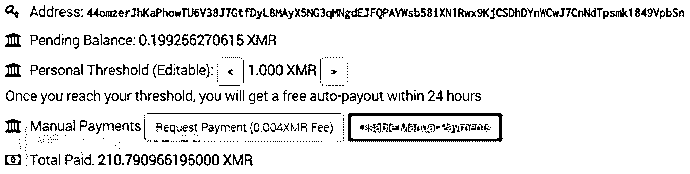

下图是一台中配机器挖门罗币的收益情况（引用自什么值得挖），可以看出挖矿收益连电费支出都收不回来。网吧成了血汗矿工，而好处都被矿主赚到了。

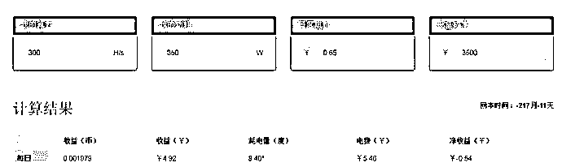

**三.《绝地求生》辅助暗藏挖矿木马  **

近日捕获的 HSR 币挖矿木马，隐藏在“绝地求生”辅助程序中，而由于“绝地求生”对电脑性能要求较高，不法分子瞄准”绝地求生”玩家电脑，相当于找到了“绝佳”的挖矿机器。经分析，已确定该挖矿木马名为 tlMiner，由一游戏辅助团队投放，目前已影响了数十万台用户机器。

绝地求生小辅助启动流程：


（HSR 币，网上戏称为“红烧肉”币，是一种新的去中心化、开源、跨系统的数字加密货币，具有双重侧链，同时兼容区块链和 DAG 两种分布式系统，HSR 于今年 6 月完成 ICO，8 月 20 日上线中国比特币交易平台，目前交易价格接近 200 人民币，且仍在上涨；与比特币类似，HSR 币数量也是固定的，总量大约为 8400 万）

下载站在疯狂传播该辅助程序。经分析，网上搜索“吃鸡”、“绝地求生”等关键词，在搜索页面置顶的下载站辅助程序同样携带挖矿木马。从图可知，仅通过该下载器下载辅助的人次就已高达 10 万。

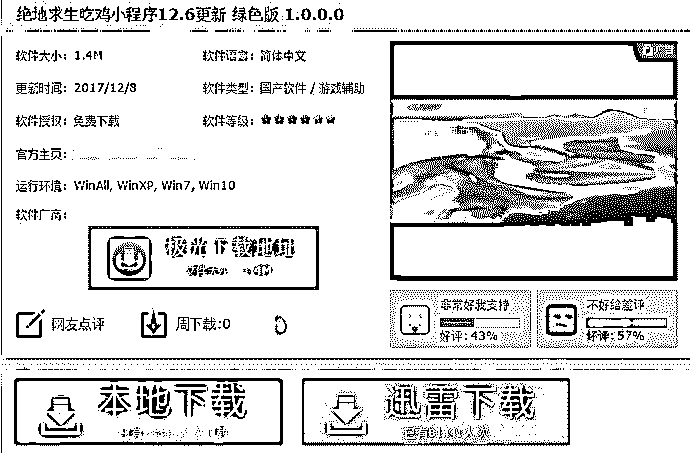

 **   辅助主界面：**

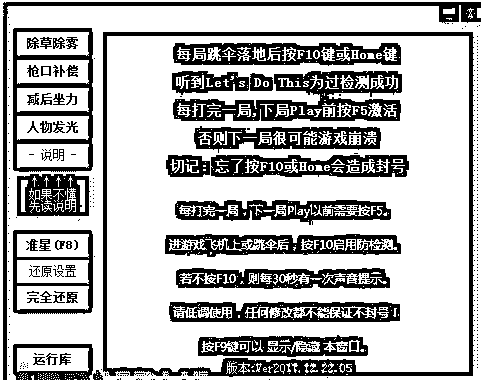

## 

目前该挖矿木马专门挖取 HSR 币，以目前的交易价格，1 算力每天可获得人民币 2.014 元。

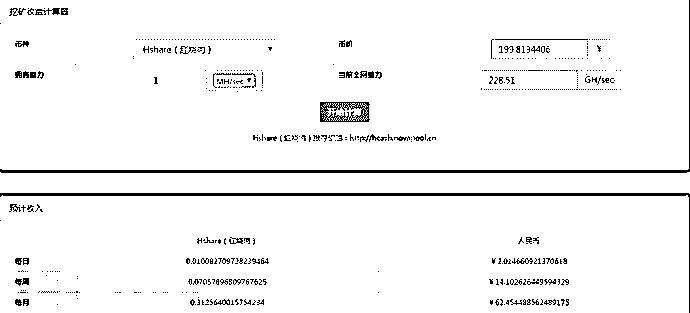

由于个体挖矿产出能力有限，很可能颗粒无收，该木马会借助矿池挖矿，已连接矿池地址：

> hcash.uupool.cn： 双优矿池，用户名为 tlwg.TCCS3
> 
> hcash-shanghai.globalpool.cc： 新星上海矿池，tlwg.PUBG

矿池作为一个平台，所有有计算能力的机器都可以参与挖矿，若获得奖励，则按其机器的算力高低分配。目前 HSR 币的产量大概每天 624.93 个。


HSR 币从 12 月 15 号价格开始上涨，目前交易价格为人民币 174 元，且还在上涨。

**四，“挖矿木马”2 天挖爆你的手机！**

近日发现一款功能强大的 Android 木马“Loapi”，它几乎具备了现今已知的所有攻击手段，可利用被感染的设备挖掘加密货币、发起 DDos 攻击，甚至短期内对手机造成不可逆的物理损坏：2 天内即导致电池膨胀。Loapi 伪装成 20 多款不同的杀毒和色情 App 诱骗用户，并根据 App 特性伪装使用界面以欺骗用户。同时，其具备强大的自我保护机制，消耗巨量设备资源挖掘 Monero（门罗币）。目前尚不明确 Loapi 具体感染的用户设备数量。

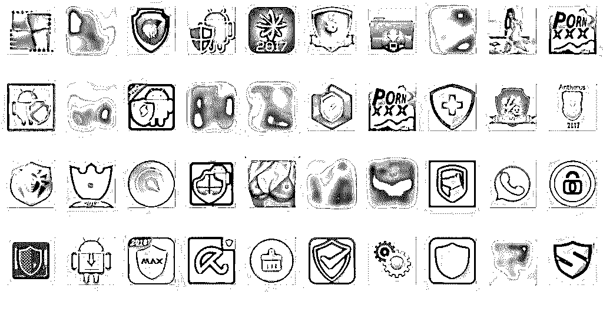

内含 Loapi 的 App 应用

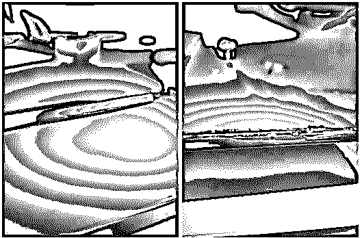

**受感染 2 天即因疯狂“挖矿”而膨胀损坏的电池**

## 六  结尾 

挖矿、勒索成为 2017 年两大全球性的安全话题，不仅仅由于影响广泛，后果恶劣，更是由于这两者都出现了从 PC 向移动平台蔓延的趋势。相比 PC 端，移动终端设备普及率高，携带方便，更替性强，因而安全问题的影响速度更快，传播更广。然而，移动平台在挖矿能力上受限于电池容量和处理器能力，并且在挖矿过程中会导致设备卡顿、发热、电池寿命骤降，甚至出现手机物理损坏问题，就目前来看移动平台还不是一个可持续性生产电子货币的平台。

随着虚拟币的兴起，巨大利益催生了挖矿黑色产业链，不法分子开始尝试“不同寻常”的挖矿之路，让人防不胜防。用户应注意提高防范意识，切勿轻信所谓的网赚挂机程序的误导提示（如杀毒软件误报－添加信任运行等）。注意保证安全软件的常开以进行防御，

软件开发者和网站站主一直在寻找能够替代广告、付费、捐赠的新盈利模式。以比特币、门罗币为代表的电子加密货币正在快速增长，现有货币增值并出现新的货币币种，挖矿最终会变得更有利可图。以当前价格来计算，在网站相同访问量的情况下挖矿带来的收益是几乎等价于甚至高于广告的收益。

* * *

**【灰产圈】高端社群 知识星球 已开通，社群成员突破 1000＋**

<mp-miniprogram class="miniprogram_element" data-miniprogram-appid="wx4f706964b979122a" data-miniprogram-path="pages/topics/topics?group_id=881854415822" data-miniprogram-nickname="知识星球" data-miniprogram-avatar="http://mmbiz.qpic.cn/mmbiz_png/kialtkOXGKS7D9hZrmO2jzDqryXXTAlhxSpnrKnHGV65KXzicibOppaPic4dCRxftvabB8Iqswo3OuQEDSxE7NicXBg/0?wx_fmt=png" data-miniprogram-title="【灰产圈】高端社群" data-miniprogram-imageurl="http://mmbiz.qpic.cn/mmbiz_jpg/WWG78hysZ0brJkWoyG2VDIacqgQjkDfp6mLiaoPBJ2SgWZHtRuTw7ia8kpoxntsn7PiaFOQO2U23FW6Iry0gS1GnA/0?wx_fmt=jpeg"></mp-miniprogram>


点击“阅读原文”加入高端社群。