# 深度|2017 年数字加密货币区块链行业安全报告

> 原文：[`mp.weixin.qq.com/s?__biz=MzIyMDYwMTk0Mw==&mid=2247489852&idx=1&sn=2dae0020c256642c47ab41ae0cdf655a&chksm=97c8d204a0bf5b12a811c503b81894ca374996a535cf6d53c6cc817b8a2232cb4a38dcf37d36&scene=27#wechat_redirect`](http://mp.weixin.qq.com/s?__biz=MzIyMDYwMTk0Mw==&mid=2247489852&idx=1&sn=2dae0020c256642c47ab41ae0cdf655a&chksm=97c8d204a0bf5b12a811c503b81894ca374996a535cf6d53c6cc817b8a2232cb4a38dcf37d36&scene=27#wechat_redirect)

## 作者：腾讯电脑管家  授权  灰产圈 发布 

> ## 一.数字加密货币及其基本获取方式

数字加密货币（Digital Cryptocurrency）又称为加密货币，其特点在于利用密码学原理来确保交易安全及控制交易单位的创造，是数字货币（或称虚拟货币）中的一种，比如大家较为熟悉的比特币、莱特币和门罗币等等，自 2009 年世界上第一个比特币区块链诞生以来，各种数字加密货币层出不穷，目前已多达 1500 多种。2017 年“炒币”风暴来袭，也将比特币、以太坊、比特币现金的价格推至历史最高点。

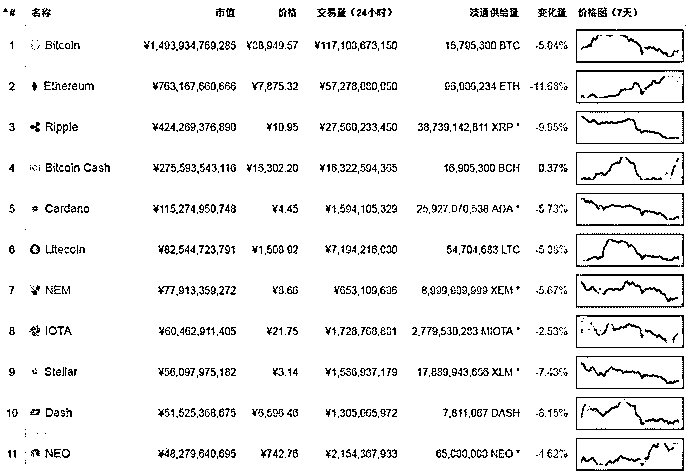 
（图 1：数字加密货币市值排行）

近年来升值最疯狂的莫过于比特币。比特币诞生之初，按当时的价格 1 美元可以买到大约 1300 个比特币，而今天比特币价格已经接近 1.5 万美元，最高时甚至接近 2 万美元。如果 2009 年花 1.5 万美元买比特币，大约可以买到 2000 万个，基本相当于比特币总量。目前比特币已被开采 1670 万个，约占总量的 79.90%。不断攀升的价格和日益减少的加密货币数量吸引越来越多人通过各种方式获取加密货币。

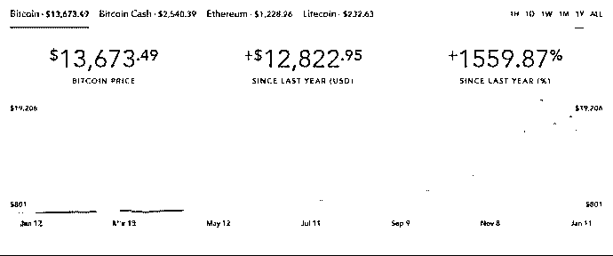 
（图 2：2017 比特币交易价格走势图）

挖矿是获取数字加密货币的最基本方式。挖矿，通俗讲就是猜数字求解，猜对即可获得数字加密货币奖励。在数字加密货币的网络里，每隔一段时间会产生一个区块，该区块包含若干个被加密的数字货币，想要获得这些数字加密货币就要解密，也就是猜密码，猜对密码就可以获取相应的数字货币，这就是 “挖矿”。理解挖矿，我们还需要明白以下概念。

> ### 1. 算力

算力，通俗讲就是每秒钟猜密码次数，以此评估挖矿的速度。由于单位时间内产生的加密货币总量基本固定，密码破解难度会随着全网算力而改变——全网算力越大，密码就会设置得越复杂，破解难度也越大。以比特币为例，平均每 10 分钟产生一个比特币区块，每个区块包含 12.5 个比特币（每 4 年减半，2009 年初每个区块 50 比特币，2013 年是 25 比特币，2016 年是 12.5 比特币），大约每小时会产生 81 比特币，兑换人民币约为 810 万。由于每小时产生的比特币总量相对固定，更多的算力投入必然增加密码的破解难度，目前挖掘难度已达到 2 万亿。

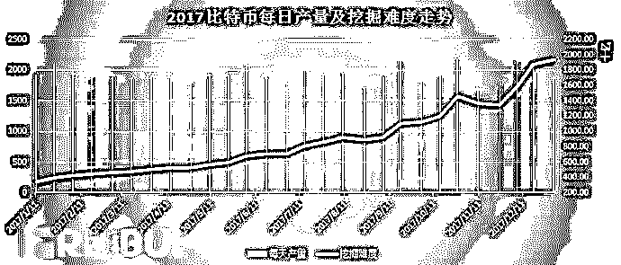 
（图 3：2017 比特币每日产量及挖掘难度走势-数据来源：比特范）

> ### 2. 矿机

早期挖矿依靠 CPU、GPU 效率缓慢，为了增大算力，硬件厂商制造了一种专门用来挖矿的机器，针对特定挖矿算法做优化，这种机器就叫矿机，价格从几百元至几十万元不等。按目前中国大部分地区的电费是 0.7 元，一个普通矿机每天电费是 21.84 人民币。

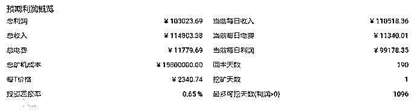 
（图 4：500 台矿机每日利润概览-图片来源于网络）

> ### 3. 矿场

矿机的投入使挖矿效率提高了至少几万倍，这些矿机聚集地就是矿场。与金属矿场一样的是这些数字加密货币矿场也会分布在山区，不同的是数字加密货币矿场不需要开山凿石，之所以选择这些地区，一个重要原因是由于挖矿太耗电，目前仅比特币挖矿消耗的电量已经达到 10 亿千瓦时，预估到 2020 年将消耗全球所有的电量，所以大部分矿场选址在深山及水电站附近以节省成本。

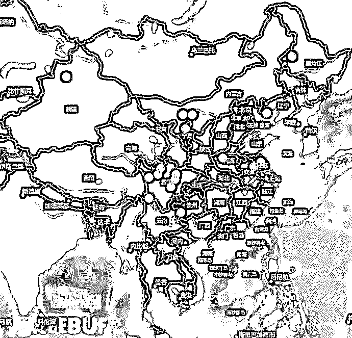 
（图 5：中国主要数字加密货币矿场分布-数据来源：巴比特）

> ### 4. 矿池

由于挖掘难度一再增加，一般规模的矿场及个体挖矿者猜对密码的几率并不大，于是他们联合创建了一个平台，所有有算力的人都可以参与挖矿，按其算力高低分配奖金，这种挖矿平台叫矿池。

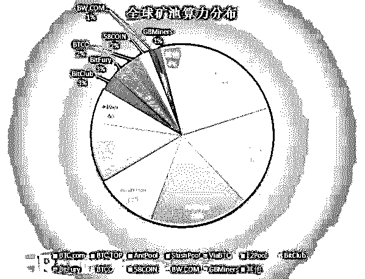 
（图 6：全球矿池算力分布）

> ## 二.数字加密货币面对哪些安全威胁

“挖矿”是最基本的获取数字加密货币的方式，想要通过“挖矿”获取更多的币，唯一的途径是提升算力，但前期的资金投入是非常巨大的。以一个中型矿场（1 万台矿机）为例，一台普通的矿机约 2.5 万人民币，仅前期机器采购费用就高达 2.5 亿人民币，而后期持续的电费、维护费也是数额巨大。那有没有一种方式：不需要自己租用场地、不耗自家电费也不用买矿机就可以获得数字加密币？黑客会非常确定地说：有！

进入 2017 年，由数字加密货币引发的互联网安全问题频频爆发，不法分子看中数字加密货币的匿名性，使用勒索、盗窃、非法挖矿等手段获取了大量不义之财。

> ### 1. 勒索

1） WannaCry 勒索病毒

2017 年 5 月，WannaCry 勒索病毒借助“永恒之蓝”漏洞肆虐全球，影响超过 150 个国家，一些政府机关、高校、医院的电脑屏幕都被“染”成了红色，而中毒用户被要求在 72 小时内支付价值 300 美元的比特币，并且 3 天后勒索赎金就会翻番。如果 7 天后拒付赎金，计算机文件将被永久加密。据相关报道，WannaCry 勒索病毒给全球造成的损失超过 80 亿美元。

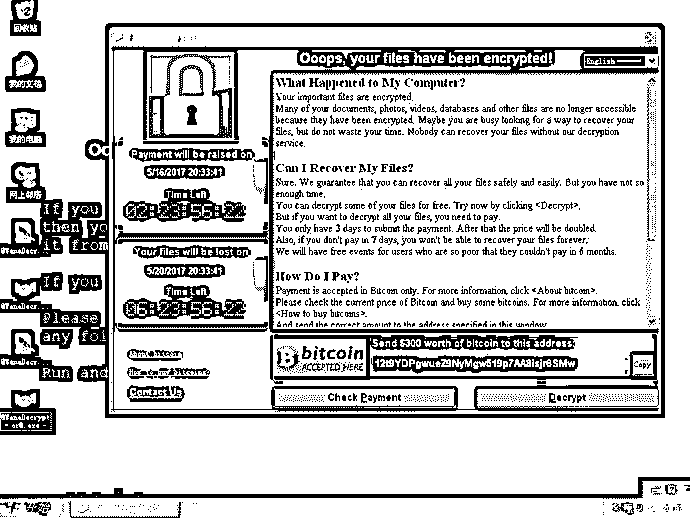 
（图 7：WannaCry 勒索界面）

> 2） NotPetya 勒索病毒

无独有偶，在 2017 年 6 月爆发的 NotPetya 勒索病毒同样采用“永恒之蓝”漏洞传播，病毒会修改系统的 MBR 引导代码，这将使病毒在电脑重启时得到执行。该病毒会在开机时提示用户电脑正在进行磁盘扫描，然而实际上病毒正在执行文件加密等操作。

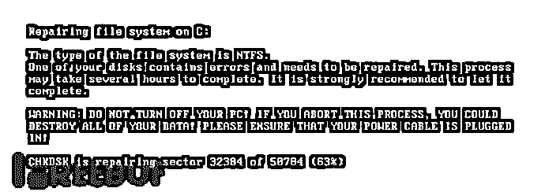 
（图 8：NotPetya 伪造的磁盘扫描界面）

当所有加密操作完成后，病毒才弹出勒索信息，要求受害者支付价值 300 美元的比特币。

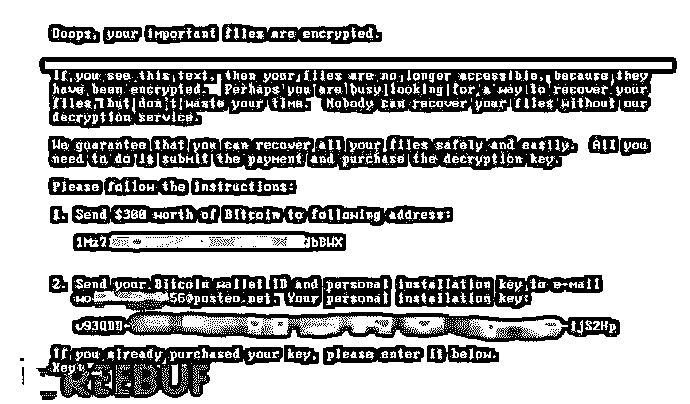 
（图 9：NotPetya 勒索界面）

而在 2017 年 7 月，病毒作者已经公布了 Petya 系列勒索软件的所有密匙。

> 3） Bad Rabbit 勒索病毒

随着“永恒之蓝”漏洞逐渐修复，勒索病毒也开始寻找其它新的传播手段，例如 2017 年 10 月爆发的 Bad Rabbit（坏兔子）勒索病毒就使用了挂马的方式：攻击者首先入侵新闻媒体类网站，随后利用这些新闻类网站发起水坑攻击。当用户浏览这些网站时，用户浏览器就会弹出伪装的 Adobe flash player 升级对话框，一旦用户点击 install 按钮，电脑就会下载 Bad Rabbit 勒索病毒。

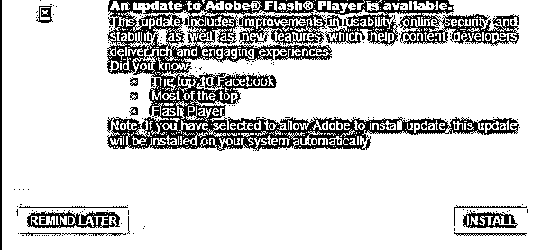 
（图 10：Bad Rabbit 伪造的 Adobe Flash Player 升级界面）

Bad Rabbit 同样会感染系统 MBR 代码，中招用户电脑会在第二次重启时弹出勒索界面，要求受害者在 40 小时内支付 0.05 比特币（当时约合 300 美元）。

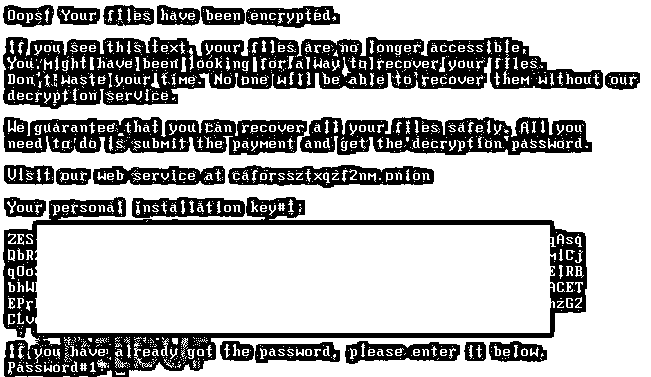 
（图 11：Bad Rabbit 勒索界面）

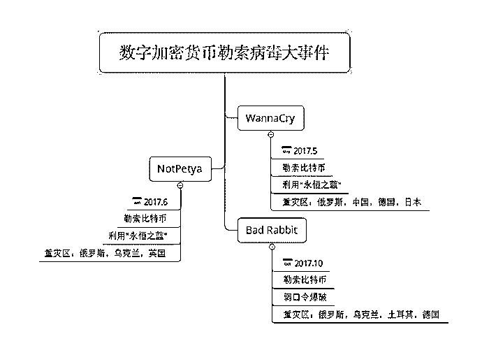 
（图 12：2017 数字加密货币勒索病毒时间轴）

回顾 2017 年数字加密货币勒索病毒大事件，俄罗斯无疑是勒索病毒最爱“光顾”的国家之一。有安全专家称，俄罗斯之所以在勒索病毒面前格外脆弱，与其电脑基础设施薄弱、网络安全管理松懈，国内存在大量盗版软件等因素密切相关。

> 4） 现实中的数字加密货币勒索

数字加密货币热潮下带来的犯罪不仅仅存在于互联网上，也发生在真实生活中。根据乌克兰媒体的报导，40 岁的俄罗斯公民 Lerner，在乌克兰拥有多家与加密挖矿和区块链有关的初创企业，是当时全球最大的数字加密货币交易平台之一。Lerner 在乌克兰出差时，就曾在办公室附近被歹徒掳走，并被要求支付价值 100 万美元的比特币。

> ### 2. 盗窃

除了勒索病毒造成的损失，盗窃行为也同样可对数字加密货币持有者造成大量损失，从数字加密货币诞生初期，数字加密货币被盗的新闻就层出不穷。

> 1） 交易平台被黑

世界上比特币被盗最严重的事件之一发生在 2014 年。据报道，当时世界最大规模的比特币交易所运营商 Mt.Gox，承担着当时超过 80%的比特币交易，2014 年 2 月 28 日 Mt.Gox 宣布，因其交易平台的 85 万个比特币被盗一空，已向东京法院申请破产。进入 2017 年，数字加密货币交易平台被攻击的新闻更是屡见不鲜，个别交易平台一年内还发生了多起入侵事件，比如韩国 YouBit 数字加密货币交易平台今年就曾遭到两次攻击：2017 年 4 月的第一次入侵造成 YouBit 近 4000 比特币的损失，按当时的价格，总损失价值约为 360 万美元；第二次入侵发生在 2017 年 12 月，该次事件导致 YouBit 交易平台破产倒闭。

> 2） 个人钱包被黑

2017 年伴随着数字加密货币的价格飙涨，不法分子无孔不入，试图利用各种黑客技术盗取个人及交易平台钱包密码，转走加密货币。

网站钓鱼：钓鱼网址 bitcoinqod.org，和官网域名 bitcoin god 仅有一个字母：“q”和“g”的区别。该钓鱼页面要求用户输入钱包密码进行“爱心捐助”，而一旦用户在该钓鱼界面输入钱包密码，钱包内的比特币就会被全部转走。

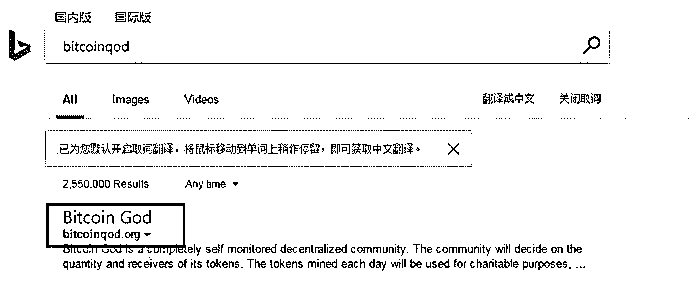 
（图 13：仿冒官网 bitcoin god）

加密货币盗窃木马：2017 年 6 月活跃的秘密洗牌者病毒（CryptoShuffler），可监视用户的剪切板，并对剪切板的数据进行实时匹配替换（匹配算法采用正则匹配），当中毒者进行转赠或交易时，剪切板中存放的乙方钱包地址将被替换为攻击者设置的钱包地址，该木马支持盗取比特币、达世币、狗狗币等 9 种数字加密货币：

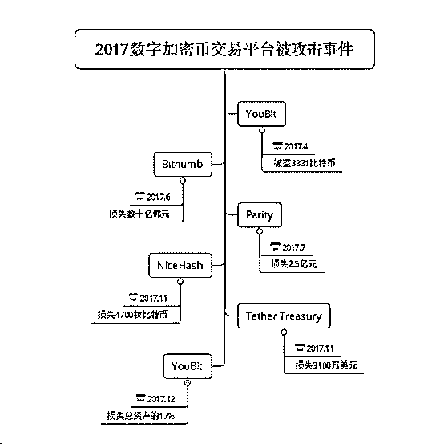 
（图 17：2017 数字加密币交易平台被攻击时间轴）

> ### 3. 挖矿木马

整个 2017 年行业内频频爆出各种挖矿木马，且木马隐藏手段也越来越高明，实现了从“裸奔”到“隐身”的升级。

> 1） “裸奔期”：僵尸网络挖矿

上半年“裸奔期”，挖矿木马没有隐藏在普通软件中，而是成为僵尸网络的一个新拓展“业务”，做到了挖矿、DDoS 两不误。

2017 年 5 月发现的 Adylkuzz 僵尸网络，甚至比 WannaCry 出现的时间要早，影响了全球几十万台机器。有意思的是，Adylkuzz 入侵成功后会利用“永恒之蓝”漏洞阻止其他病毒也利用此类漏洞，这在一定程度上限制了 WannaCry 的传播。木马入侵成功后，就会链接 C&C 服务器，接受挖矿指令，已知该木马目前专门挖取门罗币。

> 2） “遮掩期”：植入普通软件挖矿

下半年“遮掩期”，挖矿木马开始隐藏到浏览器、插件、外挂辅助等普通软件进行传播。

（a）浏览器插件挖矿

2017 年年底，一个名为 Archive Poster 的浏览器插件被爆植入挖矿木马，影响数十万台用户机器。Archive Poster 的功能是协助用户在社交平台“汤不热”上进行多账号协作，其开发商表示说，经过调查发现起因是一名团队前成员的邮箱被入侵，导致产品被植入挖矿木马。

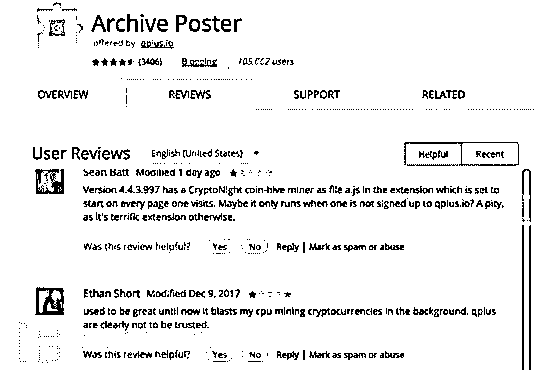 
（图 19：Archive Poster 插件截图）

> **（b）外挂辅助挖矿**

在 2017 年年底腾讯电脑管家发现一款名为“tlMiner”的挖矿木马，隐藏在《绝地求生》辅助程序中进行传播。由于《绝地求生》游戏对电脑性能要求较高，不法分子瞄准《绝地求生》玩家电脑，相当于找到了“绝佳”的挖矿机器。该木马由一游戏辅助团队投放，单日影响用户高达 20 万。

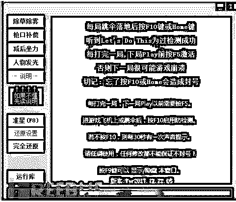 
（图 20：携带“tlMiner”挖矿木马的辅助界面）

> 3） “隐身期”：网页挖矿

下半年还是挖矿木马的“隐身期”，挖矿木马不再有可执行文件落地，而是直接嵌入在网页中，在用户上网看小说、看视频的同时“隐身”后台偷偷干活。

2017 年 9 月，数百个色情、小说、游戏网站在其网页内嵌了挖矿 JavaScript 脚本，用户一旦进入此类网站，JS 脚本就会自动执行，占用大量的机器资源挖取数字加密货币，导致电脑异常卡顿。

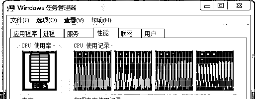 
（图 21：JS 挖矿木马使 CPU 使用率迅速飙升）

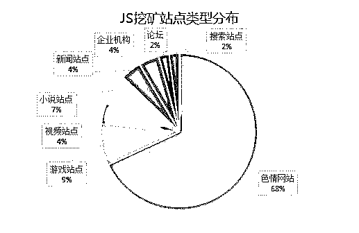 
（图 22：JS 挖矿站点类型分布图）

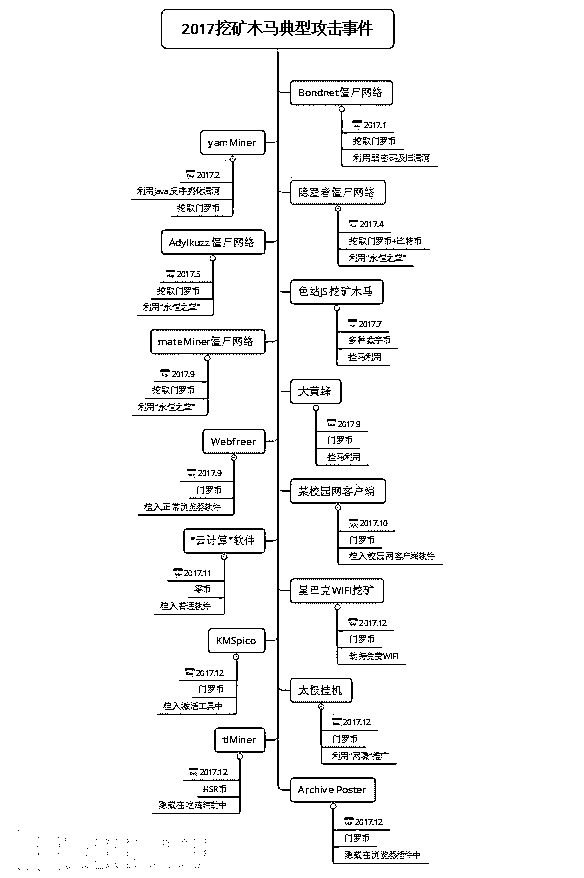 
（图 23：2017 挖矿木马典型攻击时间轴）

通过观察 2017 挖矿木马攻击事件也可以发现，不法分子最喜爱挖的数字加密货币不是比特币，而是门罗币，目前单枚门罗币的交易价格在 2500 人民币以上。

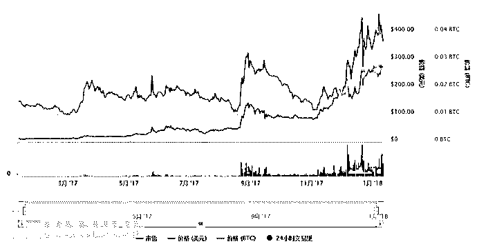 
（图 24：门罗币走势）

相比于比特币，门罗币有如下优势：

a) 交易匿名性

比特币可查询到每笔交易的金额、交易时间、发送方和接收方等信息，而门罗币使用 RingCT（环形加密）匿名技术，无法追溯到交易双方。另外，比特币对交易金额并不隐藏，所以，只要知道某人地址，既可以计算出他的比特币资产余额以及资金流动状态。

b) 先进的挖矿算法

比特币挖矿主要依赖于大量专业化的专用集成电路（ASIC），它的算法几乎完全扼杀了普通计算机用户参与比特币挖矿的可能性。相比之下，门罗币的挖矿算法基于 CryptoNight，它并不依赖于 ASIC 硬件，使用任何 CPU 或 GPU 资源都可以进行挖矿，即使普通计算机用户也能够参与到门罗比挖矿中来。

> ## 三. 数字加密货币未来安全态势

自 2017 年 4 月“永恒之蓝”漏洞成为挖矿木马的暖床以来，WannaCry、NotPetya 等勒索病毒接踵而来，每一个病毒爆发都是全球性的灾难。

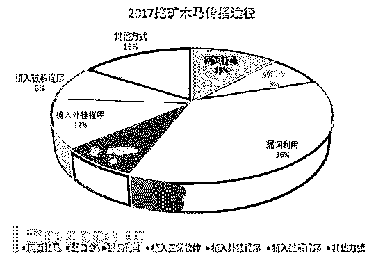 
（图 25：2017 年挖矿木马主要传播途径）

随着数字加密货币价格持续上涨、挖取难度不断增大、数字加密货币数量越来越少，可以预见 2018 年由数字货币而起的犯罪活动或将呈现高发态势。

> 1\. 传播手段

漏洞利用因其传播速度快、影响面广，预计在 2018 年仍然会是不法分子获取数字加密货币的重要手段。

> 2. 获利手段

数字加密货币持有量少的用户，将可能不再是黑客主要攻击对象。2018 年或将出现大量针对团体以及持大量数字加密货币用户的 APT 攻击。针对普通网民，黑客更倾向在其电脑植入挖矿木马。

> 3. 隐藏手段

隐藏在网页中的挖矿脚本，由于没有可执行文件落地，隐秘性极高，2018 年或将会有越来越多的挖矿脚本隐藏在各类网站进行挖矿。此外，部分玩家对游戏辅助的“青睐”，或将促使不法分子将更多恶意程序植入到游戏辅助等常规软件中。

> ## 四. 安全建议

> 1. 开启系统自动更新，及时打补丁，防止恶意木马利用
> 
> 2. 服务器避免使用弱口令，不给不法分子可乘之机
> 
> 3. 机器卡慢时应立即查看 CPU 使用情况，若发现可疑进程可及时关闭
> 
> 4. 不浏览色情、辅助等被标记为不可信的网站
> 
> 5. 不使用辅助及来路不明的软件，使用未知软件前先用腾讯电脑管家等安全软件进行安全扫描

**  附：**

**【区块链小白学习视频】：①从物物交换到比特币**

[`v.qq.com/iframe/preview.html?vid=s0559gm1mzm&width=500&height=375&auto=0`](https://v.qq.com/iframe/preview.html?vid=s0559gm1mzm&width=500&height=375&auto=0)

**【区块链小白学习视频】：②什么是比特币？**

[`v.qq.com/iframe/preview.html?vid=s0559mfcrkr&width=500&height=375&auto=0`](https://v.qq.com/iframe/preview.html?vid=s0559mfcrkr&width=500&height=375&auto=0)

**【区块链小白学习视频】：③比特币白皮书的诞生**

[`v.qq.com/iframe/preview.html?vid=n05608ee5fz&width=500&height=375&auto=0`](https://v.qq.com/iframe/preview.html?vid=n05608ee5fz&width=500&height=375&auto=0)

**【区块链小白学习视频 100 课】地址：**

**http://v.qq.com/vplus/194c3da4848c28b267d5bd9617482a49（复制到浏览器打开）**

* * *

**【灰产圈】高端社群 小程序已开通，欢迎点击加入**

<mp-miniprogram class="miniprogram_element" data-miniprogram-appid="wx4f706964b979122a" data-miniprogram-path="pages/topics/topics?group_id=881854415822" data-miniprogram-nickname="知识星球" data-miniprogram-avatar="http://mmbiz.qpic.cn/mmbiz_png/kialtkOXGKS7D9hZrmO2jzDqryXXTAlhxSpnrKnHGV65KXzicibOppaPic4dCRxftvabB8Iqswo3OuQEDSxE7NicXBg/0?wx_fmt=png" data-miniprogram-title="【灰产圈】高端社群" data-miniprogram-imageurl="http://mmbiz.qpic.cn/mmbiz_jpg/WWG78hysZ0brJkWoyG2VDIacqgQjkDfp6mLiaoPBJ2SgWZHtRuTw7ia8kpoxntsn7PiaFOQO2U23FW6Iry0gS1GnA/0?wx_fmt=jpeg"></mp-miniprogram>

点击“阅读原文”加入高端社群。