# 深度|记一次诈骗反制行动 ：电信诈骗犯偶遇白帽子，一顿操作惨遭反杀！

> 原文：[`mp.weixin.qq.com/s?__biz=MzIyMDYwMTk0Mw==&mid=2247489828&idx=1&sn=203e687d47894396102fa3ebd302e8df&chksm=97c8d21ca0bf5b0a9b55651af68f279fa087a55402e491942882179da8da81354edcf7c7bcd5&scene=27#wechat_redirect`](http://mp.weixin.qq.com/s?__biz=MzIyMDYwMTk0Mw==&mid=2247489828&idx=1&sn=203e687d47894396102fa3ebd302e8df&chksm=97c8d21ca0bf5b0a9b55651af68f279fa087a55402e491942882179da8da81354edcf7c7bcd5&scene=27#wechat_redirect)

导语：

临近年底，随着买物置衣购票等年终消费在网上的提升，电信网络诈骗也趁机出现“抬头”趋势。

序言：

> 在 2017 年，每 131 封电子邮件中就有一封是恶意邮件，而这也是近五年来频率最高的了。
> 
> 近日，互联网资讯博主@中国元 微博分享了自己和电信诈骗犯斗智斗勇的全过程，一波精妙操作反让不法分子乖乖安装远控木马，成功反杀（该博主已经报警处理）。灰产圈也第一时间联系了机智的博主，下面就来看看他是如何一步步下套成功反制诈骗犯的吧！

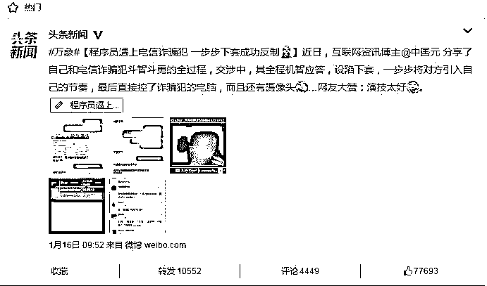

上图为头条新闻报道

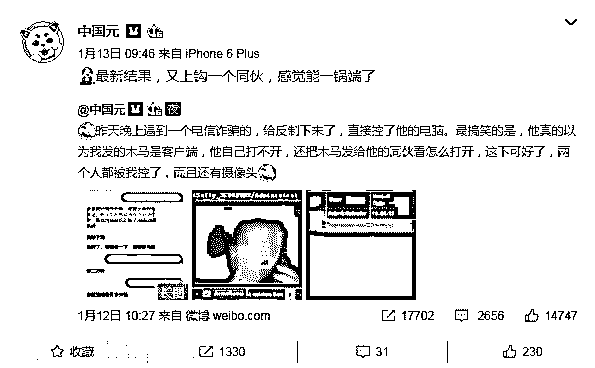 

## ①

* * *

今天收到一个冒充前公司的法人的诈骗短信，短信内容如下：

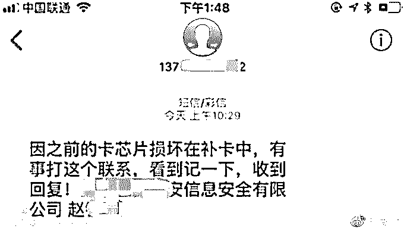

这种的一看就是从某些企业信息网站上找的信息，然后进行诈骗的，大致的套路就是需要钱了，让你给他打钱。但是这骗子的智商有点问题啊，没看见公司的名字叫 xxxx 信息安全有限公司么，信息安全啊，大哥！  

那作为一个正义的白帽子，我不搞你一下，能对得起我头上顶的这顶小白帽？  

## ②

* * *

那就开始套路呗~一开始我回第二条的时候，居然没回我信息，应该是同时诈骗的太多，没看到我回的，于是我先拨了一下他的号码（果不其然的挂了），然后发了如图的第三条短信，果然马上回我了。

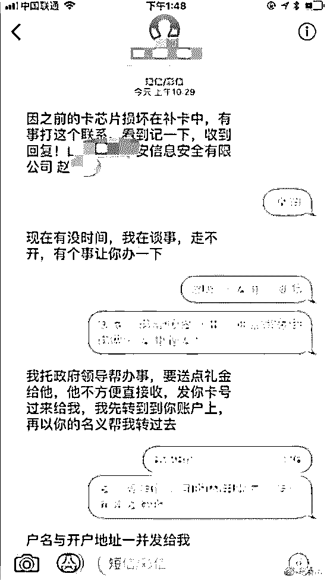

## ③

* * *

那就开始我的表演吧！

在套路他的时候，我就是一个目的：要到他的邮箱，然后发送木马程序。以下是对话记录，可以看出，一开始骗子是不想给的，后来我说卡里有 600 多万，我也装傻，他就心动了。

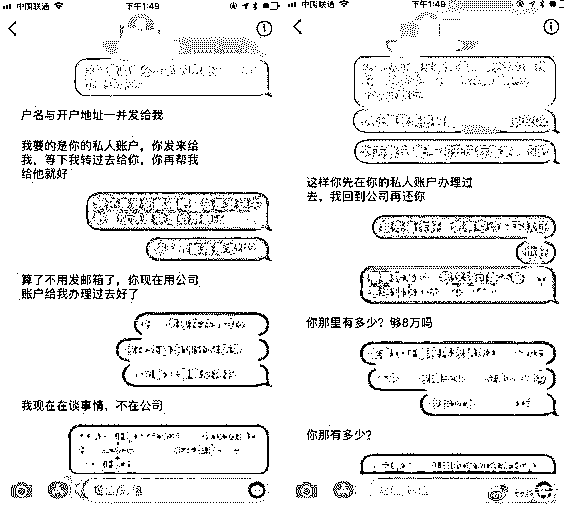

其实他一开始就是想让我用我自己的银行卡给他打钱，那我用了自己的银行卡，还怎么套路你，让你去点开伪装网银的木马呢？我就说自己刚毕业，没钱，诱导他用公司的银行卡，再顺便说一下公司卡上钱多，勾引一下，果然就上钩，把邮箱给我了。

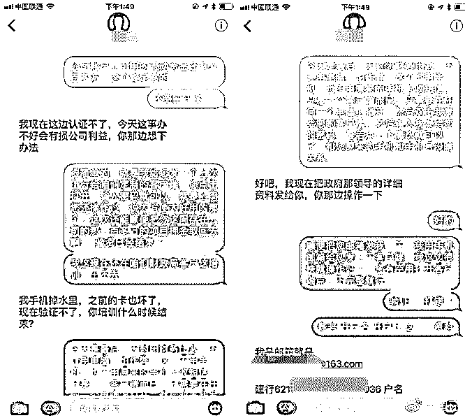

④

* * *

然后我就做了一个伪装工行的木马，压缩成压缩包（大部分邮箱附件上传 exe 可能要进行杀毒引擎查杀）给他发了过去。

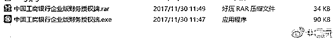

可能是 163 把邮件认为是垃圾邮件了，就给放到垃圾箱了，他也没收到。于是，我就直接给他发送百度云下载链接了……

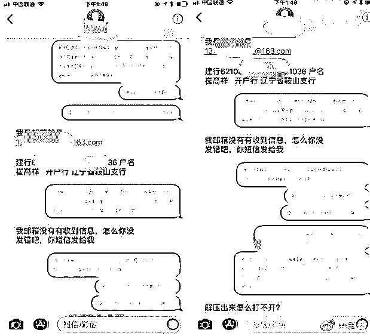

去百度云的分享页面看看他下载了没有，如图，还下载了两次。

然后，这时候木马控制端提示我有新主机上线了……

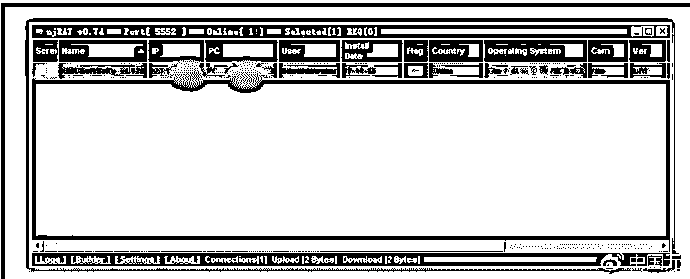

啧啧，这货还问我为什么打不开，能打开才怪了，而且他对我还深信不疑，我在监视他的屏幕操作的时候，居然还在不停的打开，还去百度搜这个软件怎么用……我是服了……

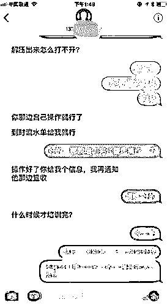

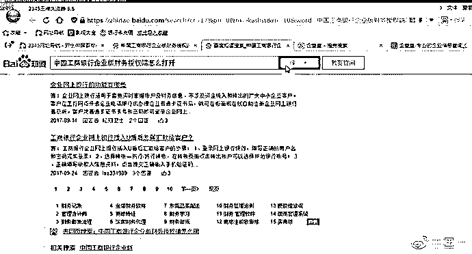

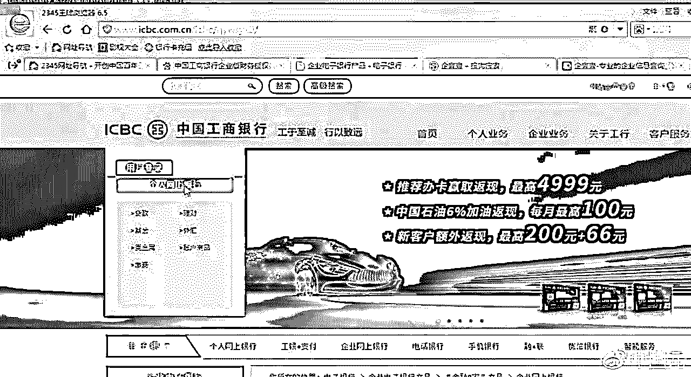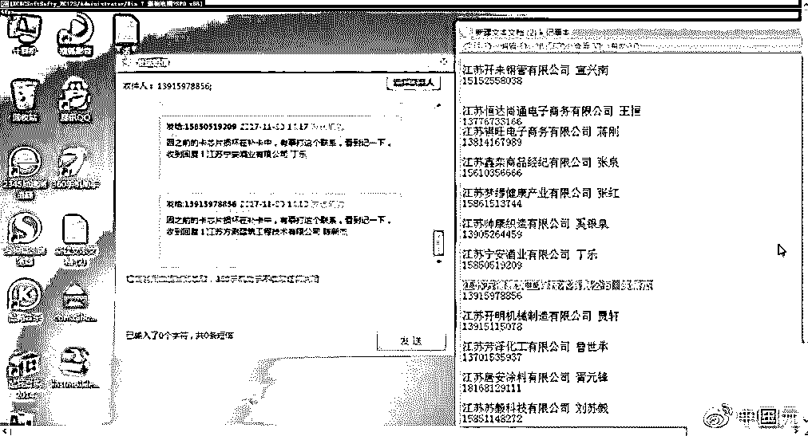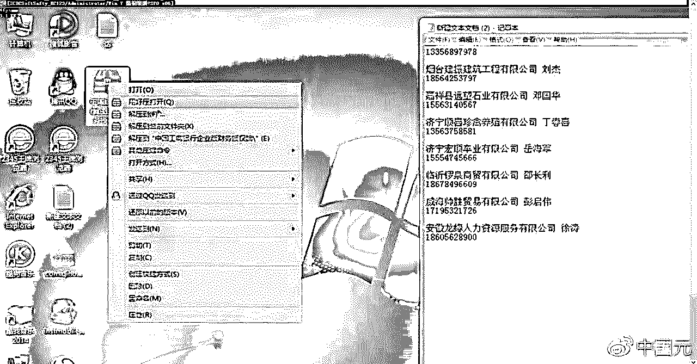

看了看，受骗人还不少。

打开他摄像头看看，哦哟，卧槽……

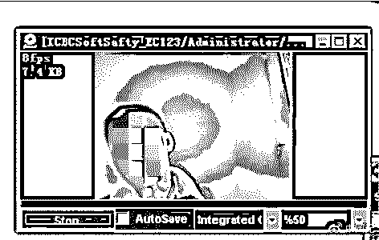

发到网络犯罪调查的群里问了一下……

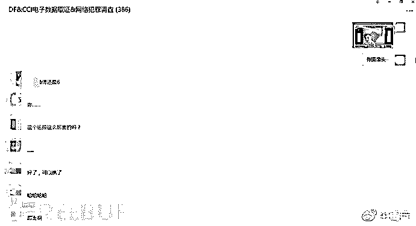

## 防范建议

* * *

犯罪分子非常狡猾，常常花样翻新，新形式、新手段层出不穷。防范电信诈骗，本质上来说还是提升个人安全意识，做到无招胜有招。

> 1、遇事要沉着冷静，对来历不明的电话和手机短信息加以核实（特别是涉及钱的）；
> 
> 2、不要贪图小利；
> 
> 3、注意个人隐私，信息不外露；
> 
> 4、发现被骗要及时报警。

另外，博主@中国元的行为有法律风险，据悉他已咨询公安及法律专家，并第一时间向警方报案，好孩子不要学哦！

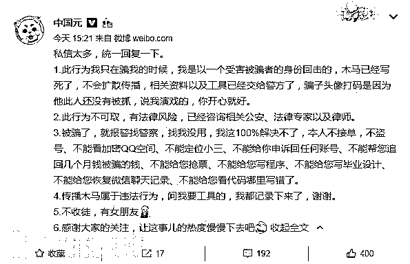

后来据说因为这件事他老婆差点让他跪搓衣板：**请看评论**

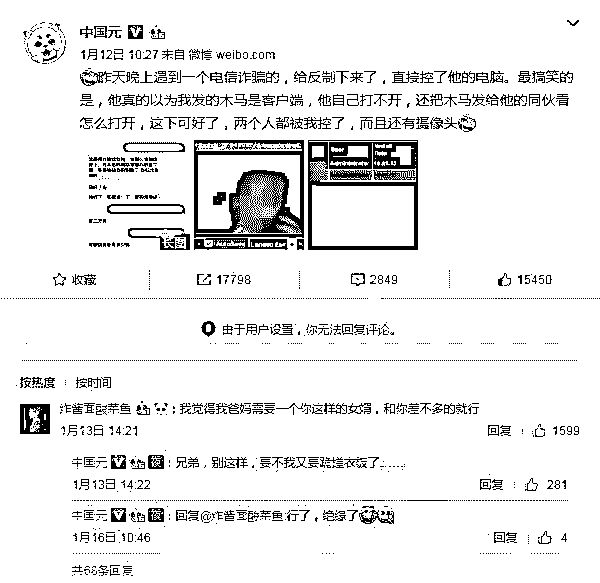

**结尾：**

**网络诈骗日益猖獗，请保管好自己的支付宝和微信钱包。**

**          免得被骗后还要被媳妇罚跪搓衣板！**

* * *

**【灰产圈】高端社群 小程序已开通，欢迎点击加入**

<mp-miniprogram class="miniprogram_element" data-miniprogram-appid="wx4f706964b979122a" data-miniprogram-path="pages/topics/topics?group_id=881854415822" data-miniprogram-nickname="知识星球" data-miniprogram-avatar="http://mmbiz.qpic.cn/mmbiz_png/kialtkOXGKS7D9hZrmO2jzDqryXXTAlhxSpnrKnHGV65KXzicibOppaPic4dCRxftvabB8Iqswo3OuQEDSxE7NicXBg/0?wx_fmt=png" data-miniprogram-title="【灰产圈】高端社群" data-miniprogram-imageurl="http://mmbiz.qpic.cn/mmbiz_jpg/WWG78hysZ0brJkWoyG2VDIacqgQjkDfp6mLiaoPBJ2SgWZHtRuTw7ia8kpoxntsn7PiaFOQO2U23FW6Iry0gS1GnA/0?wx_fmt=jpeg"></mp-miniprogram>

点击“阅读原文”加入高端社群。