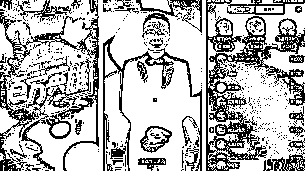
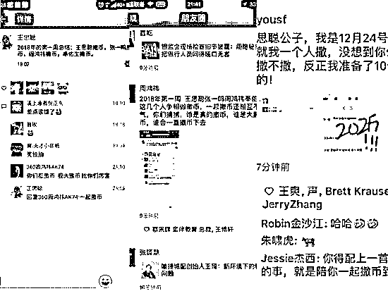
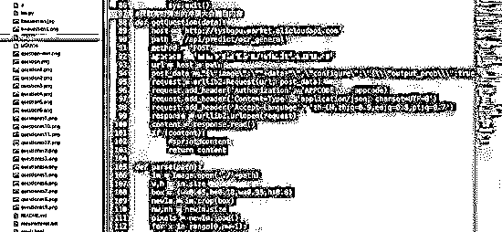
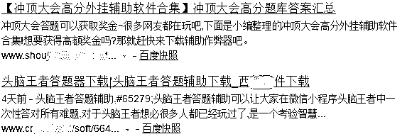
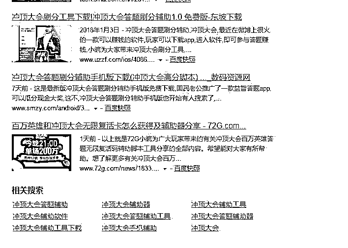
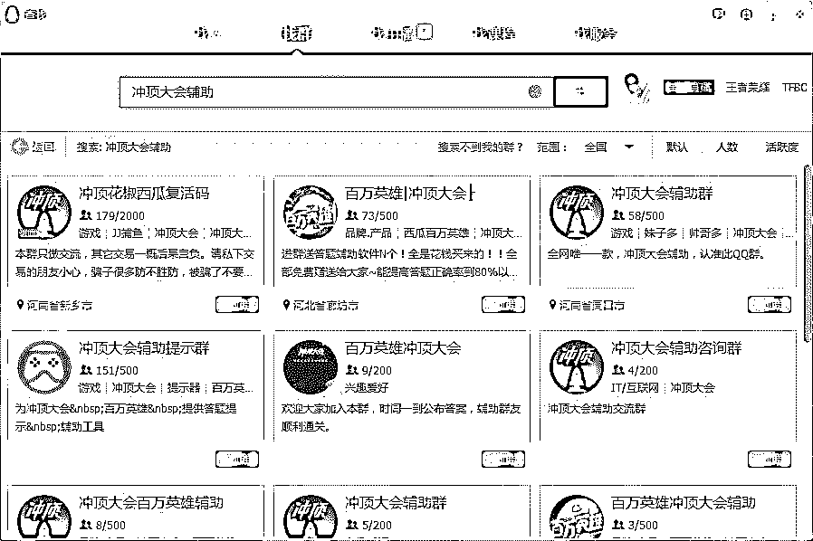
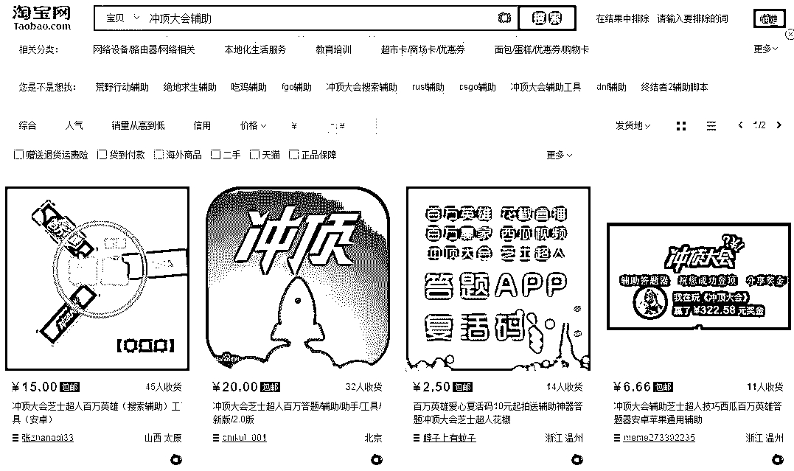
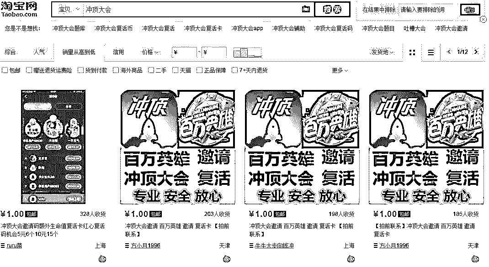
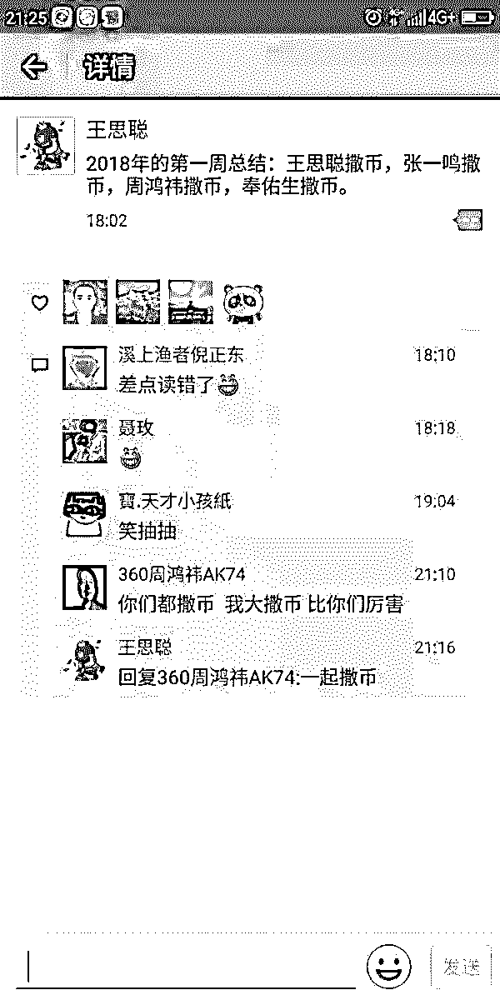

# 深度|王思聪、张一鸣、周鸿祎的“撒币”混战，:直播平台的“劫后重生”？

> 原文：[`mp.weixin.qq.com/s?__biz=MzIyMDYwMTk0Mw==&mid=2247489682&idx=1&sn=ba957b0550b571f8832f353c5b418c52&chksm=97c8d3aaa0bf5abcf396fe6c690d58ccd97bab178df878f7d87bc0cd22177deffe3fe01742d4&scene=27#wechat_redirect`](http://mp.weixin.qq.com/s?__biz=MzIyMDYwMTk0Mw==&mid=2247489682&idx=1&sn=ba957b0550b571f8832f353c5b418c52&chksm=97c8d3aaa0bf5abcf396fe6c690d58ccd97bab178df878f7d87bc0cd22177deffe3fe01742d4&scene=27#wechat_redirect)

** 导语：**

2018 年新年伊始，竞答直播突然全民爆红，第一个被吹上了风口。

　　短短 4 天内，独立 App《冲顶大会》、今日头条旗下的西瓜视频、360 直投的花椒、映客，四家平台怀揣各自的商业诉求，短兵相接，比照对手不断追加资金和物力，投入共计已超过 1 亿元，打响了一场争夺流量与眼球的“闪电战”。

> **撒币之战烧掉四个亿只是开始？**

　这场新年的战火来势汹汹，目前来看，各家 1 亿元的投入只是先头部队。

　　1 月 8 日晚，作为《冲顶大会》的合作参与者，王思聪在朋友圈里发出：“2018 年第一周总结，王思聪撒币，张一鸣撒币，周鸿祎撒币，奉佑生撒币。”

　　周鸿祎在王思聪的朋友圈下回复：“你们都撒币，我大撒币，比你们厉害。”

　　映客创始人奉佑生不甘示弱，在朋友圈做出反击：“思聪公子，我是 12 月 24 号开始撒的，我以为就我一个人撒，每想到你们都撒，不管你们撒不撒，反正我准备了 10 个亿，我会一直撒的！”

　　几位“话事人”在台上展示肌肉，投资圈的后方弹药也已蠢蠢欲动。这两条朋友圈下，金沙江创投创始人朱啸虎都点了赞。

　　风口之下，金主也已经纷至沓来。1 月 9 日，美团为花椒 13 点场的直播提供了 100 万元奖金，答题过程中，美团植入了 4 道问题，覆盖了美团的外卖、旅行等业务。随后，映客宣布：趣店旗下的大白汽车分期成为了《芝士超人》的首位广告主，广告费为 1 亿元。

         从出现到引爆仅半个月时间，能赢奖金的直播答题火了。有平台单场在线人数和奖金额度均突破一百万，最多的一次，23 人瓜分 100 万，人均 4 万多，真可谓是薪资最好的工作了。

**▲视频截图**

> **新瓶装旧酒：有奖竞猜节目复活**

　“竞答+直播”这种讨巧的创意，并非中国互联网人的突发奇想。2017 年 8 月， HQ Trivia(简称 HQ)在美国的 App Store 上线。HQ 由著名短视频应用 Vine 的联合创始人 Rus Yusupov 和 Colin Kroll 共同开发，不到 4 个月，就吸引了超过 40 万人在线。到 2017 年底，HQ 名列 App Store 总榜第 27 名、游戏类第 7 名。

　　HQ 的玩法十分简单，每天分时段开设几场有奖问答，主播在 App 上以直播的形式，给用户出 12 道百科问答题。用户要在 10 秒内选对答案，答错则出局，最后胜者平分池内所有奖金。

　　智力问答天然就是符合人性趣味的经典游戏。无须任何教育用户的成本，获取用户的渠道低廉而便捷。这样一眼可见的好生意，很快就被中国互联网以“像素级别”的模仿程度移植了过来。

　　12 月 24 日，映客率先推出了名为《黄金手指》的竞答游戏。12 月 25 日，《冲顶大会》在 App Store 独立上线，奖金为 5000 元。不过上线的前几天里，两家平台的参与人数都不温不火，最多不过几万人。

　　与今日头条、360、映客几家财力雄厚、直播经验丰富的公司相比，《冲顶大会》的平台背景最为简单。这款 App 由陈桦带领的团队创建，陈桦生于 1988 年，2010 年开始创业。做《冲顶大会》之前，她手下有只 20 多人的团队，运营着一款名为《节操精选》的新生代娱乐社区 App，公司曾得到真格基金和九合创投的投资，盈利状况良好。

　　HQ 上线后，陈桦敏锐地发现了其中的商机。2017 年 10 月，她从公司里正式抽调出一只团队，全心投入到《冲顶大会》的开发。12 月初，团队拿出了第一版 Demo，陈桦通过朋友，把 Demo 拿给了王思聪看，王思聪马上表达出了对这款产品的兴趣。

　　王思聪与《冲顶大会》的资本合作模式具体如何，团队成员表示不便说得太多。但肯定了他非常认真，“出钱又出力”，曾与团队一起加班到半夜 3 点，并在产品的设计改良上，提出过不少建议。

　　《冲顶大会》的财务顾问公司负责人说：“按照王思聪的性格，他参与的项目，当然会为之‘打 call’。”

　　1 月 3 日周三，是王思聪 30 岁的生日。他在微博上宣布：当晚 9 点，他将在《冲顶大会》里“撒币”10 万。在王思聪头部流量的带动下，《冲顶大会》的 9 点场直播间里涌入了 28 万用户。最后，2000 多人杀出重围，每人从 10 万的奖金池中分得了 51 元。

　　一场竞答混战，就这样被王思聪轻巧地挑起了。虽然接下来的巨头杀入，让他的“头条热度”只维持了一天。

> **撒币之战：96 小时混战**

　王思聪引爆《冲顶大会》的同天，今日头条旗下的西瓜视频，也加班加点地赶出了玩法相似的《百万英雄》。

　　归根到底，不管是 HQ 还是《冲顶大会》，核心都是想法的创新，技术门槛有限，主播参与时间短，设计环节不多，因此模式极易被抄袭复制。几家团队成员接受采访时，都表示竞答直播的关键点不在技术，“交互十分简单”，更多是运营层面的竞争。

　　1 月 4 日，《冲顶大会》将直播场次增加到了四场，最高场次奖金 20 万元。当天，《好奇心日报》从投资方了解到，《冲顶大会》准备未来每天投入“20 万奖金+100 万推广费”，目标是 2018 年春节前做到 100 万人同时在线。

　　一天后，《冲顶大会》的“小目标”就被证明过于简单了。1 月 4 日，《百万英雄》对标《冲顶大会》，同样推出了四场直播。1 月 5 日周五，当人们开始享受夜晚的闲暇时，四家平台展开了第一轮“争夺用户周末时间”的竞逐。

　　当天，花椒跟入战局，上线了玩法相似的《百万赢家》，并增加了直播场次。这一天，各家平台的直播奖金还不过 10 到 20 万元，用户分得奖金也在几元到最多百元左右不等。

　　1 月 6 日周六中午，西瓜视频率先抛出了新噱头，宣布当晚 23 点半将增加一场奖金高达 100 万元的直播。《芝士超人》马上做出响应：在 23 点半同样增设直播，奖金推高到 101 万元。花椒也做出回应：《百万作战》奖金增至 102 万元，且定于 23 点 25 分开始，截流《百万英雄》和《芝士超人》、并登顶单场奖金之冠的用意明显。

　　当晚 23 点半前后，三家直播平台里，都分别涌入了超过 100 万答友。但这场噱头之争，最终的胜出者应该归属于《百万英雄》。

　　此前，《百万英雄》的题目一直比较简单。在当晚的百万奖金场中，题目的 3 个选项被增加到了 4 个，难度也大大提高。其中问题包括：“世界的第二大高峰是什么？”“GPS 全球定位系统基于哪种理论？”“‘全球渐冻人日’是哪天？”

　　在不断筛选掉大量答友后，最后一题弹出：“‘西瓜视频’四个字共有多少笔画？”这道题在 10 秒钟内，显然只能靠运气作答。最后，只有 22 人“蒙对答案”，每人分得了 4 万多元奖金。

　　接下来的两天里，战火不断升级，百万奖金成为标配。1 月 7 日周日，花椒上线了两场百万场，其中包括一场题目较为简单的“全民场”，一场题目难度大、且不得使用复活卡的“战神场”。在“战神场”中，最后每位答友分得了 5494 元奖金。

　　1 月 8 日周一，几家平台的竞争势态更令人眼花缭乱。花椒宣布将百万场进一步增至四场。西瓜视频做出反击，将 21 点的单场奖金提升至 200 万元。花椒马上跟进，同样追加了一场 200 万奖金的“阳光普照场”。

> **大佬们争着比谁最撒币**

        引领这股全民答题热潮的是王思聪。1 月 3 日，王思聪在微博上宣布每天都发奖金，10 万元给一款名叫《冲顶大会》的手机答题赢钱游戏当作奖金。《冲顶大会》的主要模式是：每天在指定时间进行答题直播，一共 12 道题，每道限时 10 秒钟，全部答对者可平分每期奖金。

这场 10 万元的撒币活动，让此前悄没声的冲顶大会 APP 迅速蹿红，而几大直播巨头也纷纷开动马力。其中，《冲顶大会》和《芝士超人》均是在 2017 年年底上线，《百万英雄》是在 1 月 3 日上线，花椒直播的《百万作战》1 月 5 日开启。

随后各老大们也亲自为牵产品推广助威，在朋友圈广发英雄帖。王思聪在朋友圈点出了谁在撒币，映客的奉佑生则强调了自己是撒币第一人，并喊话要撒 10 个亿!而周鸿祎则直接高调回应称，你们都撒币，我大撒币，比你们厉害。

> **撒币背后的流量生意**

为何大佬们都热衷于这种撒币方式?或许能用最少的价格获取最大的流量是主因。

移动互联网的下半场，什么最贵?答案正是流量。以地推为例，目前获客成本已经飙升到几十块钱，对于诸如互联网金融这样的领域，获客成本更是上百。与之相比，直播答题可谓是流量的救星。

以王思聪生日晚 9 点场为例，10 万元带来 28 万的在线流量，平摊下来，吸引一位用户的成本仅为 0。35 元。此外加上邀请好友或转发朋友圈获得复活;机会的机制也会自发形成传播效应，也使得活动无需推广费用，可快速获取用户。这在线上流量入口几乎接近天花板的今天，简直是笔巨划算的生意。这实际上正是直播答题之于平台的最显著价值所在。

“这是场简单粗暴的砸钱比赛。谁能砸到最后，谁就可能真正占据了流量源头。”直播行业资深人士张婉表示，“其背后目的，还是抢夺用户资源。”业内人士向记者表示，这些行为看似平台疯狂般大手笔砸钱，但归根到底还是为了以低廉的成本获取庞大的用户流量。

有媒体报道，1 月 3 日，王思聪生日晚 9 点场，10 万元奖金为平台带来了 28 万的在线流量。平摊下来，吸引一位用户的成本仅为 0.35 元。

而记者在 1 月 9 日所参与的 2 场答题活动，分摊在每位用户身上的成本同样低廉。《芝士超人》于 12 点 30 分所进行的总奖金为 20 万元的答题场次，吸引到 83 万在线用户，每位用户成本为 0.24 元。而在花椒一场单轮金额为 10 万元的答题场次里，吸引到了 170 万用户流量，吸引用户的成本价仅为 0.05 元。

“用 10 万奖金就能换取几十万的活跃流量，对于平台而言相当诱人。如果是动辄上百万元的单轮场次，势必会吸引到更多的用户，也是笔稳赚的投入。”张婉分析称，“一旦粉丝流量上来了，让广告商看到了巨大的粉丝流量，也会让平台在现阶段获得一定广告收益。”

事实上，直播平台最大的问题，正是如何打开流量入口。此前不少直播平台为了吸引粉丝流量，不惜砸重金邀请签约知名艺人入驻，以期望能为平台带来流量，而千万级别的签约费，也让直播平台为了渠道引流付出巨大的利益。

有了流量，干什么都可以。尤其是在常规的直播、短视频等触及天花板之下，无论是平台还是用户，都继续更刺激、更新颖的玩法。直播答题恰切题而来，应运而生。

> **撒币大战开启，未来靠什么盈利?**

        机会在哪，巨头就在哪，虽然盈利模式还不清晰，但一次烧钱争夺流量与用户的战争已经吹响号角。毫无疑问，直播答题 APP 在极短时间内获得了大波流量。不过目前仍在探索期。出售复活道具和广告植入被外界认为是直播答题比较容易实现的流量变现方式，而这取决于谁家的能力更强。以及如何保持用户粘性，打造有价值的超级用户才是关键。

盈利模式尚有待探究，但网络上目前就已经出现各种包括服务器被挤爆、宕机等吐槽。

据悉，冲顶大会在 3 日之内曾出现 2 次服务器崩溃的情况，也被用户喷成了筛子。当部分产品的用户体验并不好，用户可能会转而投向其他产品，而官微底下的留言可以佐证这一点，你们道歉的次数都快赶上国足了，留给你们的时候不多了......

此外，直播答题游戏的火热，还催生了一批抱团答题的线上社团，通关技巧;等，QQ 群、已经出现组团答题群;微信群微博上已经出现搜集题库分享了;知乎上有用户爆料用人工智能+视频信息采集+人脸识别技术。这也产生了不公平。

> **撒币大战带动了什么灰色产业？**

**一.外挂产业**  

百度搜索：冲顶大会外挂  会出现很多辅助和脚本下载页面，当然这些辅助都是要收费的，或者直接捆绑病毒。

**百度搜索到的辅助页面（一）**

**百度搜索到的辅助页面（二）**

**QQ 群搜索：冲顶大会辅助，依然可以搜索大批销售辅助和外挂的群**

**淘宝搜索：冲顶大会辅助  （一般以销售外挂和题库为主） **

**二. 复活卡销售产业：**

淘宝搜索冲顶大会，销量最高的是复活卡，因为答题错误需要用复活卡复活，所以催生了很多销售复活卡的卖家。

> **撒币的钱从哪里来？“撒币”混战背后的资本版图**

       “知识付费”终于迎来风口了吗？此次“知识付费”可能不仅说的是普通网友凭借知识变现，更是平台通过这种方式获客后，通过流量变现。

　　目前，主要有王思聪“撒币”的 APP“冲顶大会”，映客推出“芝士超人”，今日头条旗下产品西瓜视频推出“百万英雄”，周鸿祎投资的花椒视频的“百万赢家”四家平台，另外还有 KK 直播，派派等纷纷跟进，前后不过 10 天。

　　1 月 9 日，映客旗下“芝士超人”和花椒直播推出的“百万赢家”分别获 1 亿和 100 万元广告投放，其它平台尚无合作消息传出。“撒币”大战背后的金主，都有谁？

　　“芝士超人”和“百万赢家”获广告投放

　　1 月 9 日，趣店集团(NYSE：QD)宣布，集团旗下子品牌“大白汽车分期”与映客旗下子品牌“芝士超人”达成商业合作，双方涉及合作 1 亿元。

　　“芝士超人”表示，趣店成为“芝士超人”首个广告主。

　　“撒币”终于从往外撒钱，变成收钱了吗？目前有花椒直播的“百万赢家”获得美团百万赞助；映客旗下的“芝士超人”获得趣店 1 亿合作，其它“直播答题”平台尚无资本进入的消息传出。

　　“直播答题”模式并非中国首创。2017 年，HQ Trivia 就开始渐渐火爆北美。其被认为是国内“直播答题”的雏形。

　　“直播答题”进入中国有两种说法，一种是说，进入 2018 年 1 月 3 日，“国民老公”王思聪通过微博卖力推广全民答题直播行业，该行业进入公众视野。

　　另外一种说法是映客创始人奉佑生，其在朋友圈做出反击称：“思聪公子，我是 12 月 24 号开始撒的，我以为就我一个人撒，没想到你们都撒，不管你们撒不撒，反正我准备了 10 个亿，我会一直撒的！”

　　**王思聪与“冲顶大会”**

　　王思聪朋友圈截图称，“2018 年的第一周总结：王思聪撒币，张一鸣撒币，周鸿祎撒币，奉佑生撒币。”周鸿祎在评论中回复：“你们都撒币 我大撒币 比你们厉害”，王思聪回复周鸿祎：一起撒币。

**王思聪朋友圈截图**

> **撒币大战的未来       **

        全民答题它这种模式本身很可能只是平台方前期的一个噱头，一种利用奖金的幻象刺激来制造人气效应的手段，未来这种单靠把奖金越提越高的模式肯定不可持续的，如何在内容知识方面产生价值，这才是关键。

    “用答题游戏的流量来换取广告收入，再用赚得的收入来补贴用户，无疑实现了自我造血的良性循环。”直播资深行业人士分析称，“庞大的流量，以及品牌的露出、主持人口播，以及问题中的广告植入，让广告主甘心埋单。”

      如此一来，直播平台在有了广告商的输血后，砸钱的底气更足。“平台通过花费第三方广告客户的钱，来维持用户的驻留，获取大量的线上流量；用户则能从不断增加的奖金中获得越来越高的报酬，而广告客户也以这一形式完成品牌的输出，能实现三赢局面。”

     但让人感到担忧的是，尽管《芝士超人》邀请了谢娜、陈赫等明星为其站台进行宣传，《百万赢家》也邀请到知名主持人李好进行现场主播，但如今各个直播平台的答题模式同质化严重，很可能会造成用户逐渐反感，最终流失的局面。

**结尾：**

           这场撒币盛宴;它或许是在线直播继秀场和游戏直播后的第二春，对于投资人、创业者来讲新的风口已悍然出现。此外直播答题则有望乘着知识共享的东风，有孵化出超级 IP 的能力。这种超级 IP，既可能是主持人，也可能是平台本身。而对于普通的用户来讲，能接受这样的一个知识参与，再加上一些奖金的刺激，也是不错的。

* * *

**【灰产圈】高端社群 小程序已开通，欢迎点击加入**

<mp-miniprogram class="miniprogram_element" data-miniprogram-appid="wx4f706964b979122a" data-miniprogram-path="pages/topics/topics?group_id=881854415822" data-miniprogram-nickname="知识星球" data-miniprogram-avatar="http://mmbiz.qpic.cn/mmbiz_png/kialtkOXGKS7D9hZrmO2jzDqryXXTAlhxSpnrKnHGV65KXzicibOppaPic4dCRxftvabB8Iqswo3OuQEDSxE7NicXBg/0?wx_fmt=png" data-miniprogram-title="【灰产圈】高端社群" data-miniprogram-imageurl="http://mmbiz.qpic.cn/mmbiz_jpg/WWG78hysZ0brJkWoyG2VDIacqgQjkDfp6mLiaoPBJ2SgWZHtRuTw7ia8kpoxntsn7PiaFOQO2U23FW6Iry0gS1GnA/0?wx_fmt=jpeg"></mp-miniprogram>

点击“阅读原文”加入高端社群。