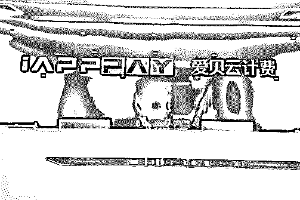

# “走账”生意经：网络“黑产”资金“地下通道”大调查

> 原文：[`mp.weixin.qq.com/s?__biz=MzIyMDYwMTk0Mw==&mid=2247497013&idx=1&sn=35ac0fb93c885e8b178563aabaa69737&chksm=97cb3e0da0bcb71b47e5bcb87c9567e475ca943def54a0a5a062488eec49fbadf79338c7f332&scene=27#wechat_redirect`](http://mp.weixin.qq.com/s?__biz=MzIyMDYwMTk0Mw==&mid=2247497013&idx=1&sn=35ac0fb93c885e8b178563aabaa69737&chksm=97cb3e0da0bcb71b47e5bcb87c9567e475ca943def54a0a5a062488eec49fbadf79338c7f332&scene=27#wechat_redirect)

**点击上方蓝色字体免费订阅“灰产圈”**

**烟台人张佩（化名）没有意识到，每天在家操作手机 App 就能赚钱的她，通过上传个人收款码收来、抽成后又转走的钱，其实就是赌客们在赌博网站充值的赌资。**

**像张佩这样的还有上万人，他们通过注册会员，聚集在罗某某团队的 App 平台上，为三十余家境外赌博网站走账。**

**与罗某某团队的“人海战术”不同，另一边，有着技术背景的丘某某，创立了深圳爱贝信息技术有限公司（下称爱贝公司），他的团队通过注册空壳公司申请支付账户，并开发将微信、支付宝、银联等多个支付通道聚合一起的软件工具，为近两千家商户提供资金代收、结算，涉案金额 92 亿元。这使得这些商户既可免于行业合规监管的审查，又能绕过支付平台的开户审查，完成营收。这些商户中，近 8 成开发运营的是非法棋牌类游戏。**

**据澎湃新闻报道，山东烟台、辽宁大连两地警方相继破获上述两起提供非法支付结算服务的非法经营案。在支付行业监测监管加强的情况下，上述虚构交易背景、虚设支付场景的支付结算方式，受到诸如网络赌博，网络色情等一众网络灰黑产业青睐。伴随着公安机关的高压打击，网络支付生态也将得到净化。**

**“一站式”支付结算**

对爱贝公司的侦查线索，源于对一家名为“趣网”公司的查处。大连市公安局沙河口分局经侦大队副大队长范延群介绍，该公司开发了一个色情视频 App， App 通过截取上传色情视频引诱用户，充值成为会员可以观看全片。

一个色情 App 是无法通过审查开通接入诸如微信、支付宝、云闪付此类合法第三方支付通道的，范延群说，公安机关在办案时发现，是爱贝公司在其中扮演了代收而后进行资金结算的角色。

爱贝公司多名高管在接受警方讯问时讲述了爱贝公司的运营模式：**注册数个空壳公司，然后用壳体公司向微信支付宝等平台申请开通支付通道。****技术部门把多种支付方式加工包装成一个软件工具包，这个工具包的作用就是，安装之后，在用户选择支付的时候能跳转含有多种支付方式的通道。**这样用户支付的资金实际就进入了爱贝公司囊中。爱贝公司与商户签订合同，约定在规定的时间内将资金结算给商户。而爱贝公司的盈利，就是从中收取一定比例的服务费，这一比例一般在 1%左右。

范延群介绍，爱贝公司的做大，以至后来号称中国最大的“聚合支付”平台，游戏行业市场的开发是一个契机。

在深圳拥有一家游戏开发运营公司的柏先生说，一款游戏，通过玩家充值获利，要申请一个支付通道，首先公司的资质必须要全，同时游戏本身也要通过审查获得版号。市场上一款游戏大多寿命只有一两年时间，而一个公司往往同时开发多款游戏去抢占市场。柏先生称，如果每款游戏都资质齐全再去申请支付通道，很不划算。

“一站式”便利的支付结算通道，最初良好的信用，以及更重要的，爱贝公司的这些客户，不再需要一个完备的资质来保证这是一个“健康”的客户，甚至可以完全“裸奔”。凭借这些“特质”，爱贝公司迅速占领市场。在柏先生看来，爱贝的知名度已经到了“行业里面的人都知道。”

爱贝公司的商务经理蒋某某坦陈，后来，爱贝公司承接了一些灰色地带的棋牌类游戏业务，也有一些网络赌博和网络色情的业务。

深圳爱贝公司 本文图片均由警方供图

**失控的资金**

按照相关法律法规规定，从事资金结算业务必须取得由中国人民银行颁发的支付牌照。

中国银联股份有限公司风险控制部高级主管王宇介绍说，支付牌照不仅仅是一张牌照，它意味着接受监管、提供备付金、核查下游商户等全方位的风险防控制度。在没有支付牌照的情况下从事资金结算业务，行为本身已经违法，也将会导致一系列资金安全风险。

王宇介绍，案例中的这种支付结算方式，**实际上虚构了一种商户交易的场景，进入监测视线的不再是玩家或者用户与商户之间的交易。**这违反国家反洗钱相关管理制度的基本要求，影响对交易的真实性以及合法性的判断。

**与此同时，资金的实际路径也被隐匿了，客观上帮助非法资金转移，给追缴非法资金带来障碍。**

**再有，商户结算资金面临被平台非法截留、挪用的风险。**爱贝公司与下游商户进行结算都设定的有一个周期，短则一周，长则一个月。这就意味着，在爱贝公司这里，形成了一个资金池。当交易量巨大的时候，这个资金池就更加庞大。案件信息显示，高峰时期，爱贝公司一天的代收资金多达四五千万。而这些资金，全凭爱贝公司自己支配，游离在监管之外。

事实证明这种挪用的风险并不仅仅是潜在的。大连市公安局沙河口分局常务副局长刘汉存介绍，在今年 8 月份办理案件时，已有超过 3000 万元资金被丘某某挪用，并且被投入的爱贝公司境外业务再度出现亏损。“如果没及时查处，后果可能会更加严重。”

中国人民银行大连市中心支行会计财务处处长朱焱认为，由于这种网络平台具有涉众广、信息传播速度快等特点，如果不能及时有效打击这些非法网络平台，一旦出现风险，不仅是人民的财产会受到损失，更会对社会金融稳定产生不利影响。

“抓蛋”非法经营案缴获的作案工具

**万名“收款员”**

相比爱贝的空壳公司支付账户通道走账，罗某某团队的走账模式更加隐秘。

2018 年，罗某某经一位朋友介绍了解到，可以开发一款 App，通过发展大量一般正常用户利用支付宝、微信账号成为“收款员”，为赌博类网站提供结算服务抽成获利，而这名朋友负责介绍业务。

随后罗某某找自己同学开发了一款名为“抓蛋”的 App。烟台市公安局经侦支队副大队长梁洪超介绍，“抓蛋”App 通过技术手段，一端实现与赌博网站连接，另一端连接“收款员”，当赌客在赌博网站点击充值或者购买筹码时，这一支付指令就会跳转至“抓蛋”App。另一端的“收款员”们在线排队等到接单。接到派单之后，App 就会显示该单的应收款金额，同时在金额的下面会生成一个黑框，收款员根据收款金额用自己手头的微信账号生成一个收款码，并把收款码截图发送到黑框上。最后这一收款码会显示在赌博网站的支付页面上，需要充值的赌客会扫描这个收款码付款。

这样，钱就由赌客到了“收款员”的手中，“收款员”扣除每笔 1%的佣金后，将钱提到自己的银行卡中，而后转到发展自己的“团长”卡中。“团长”可以从每个手下“收款员”收款金额中抽成 0.5%，然后根据平台的指令再将相应数额钱转到包括罗某某等核心成员以及赌博网站自己的银行账户中。每个账户应该转去多少钱，平台会根据既定的利益分配计算好，“团长”只需要按指令操作就好。

为了防止“收款员”、“团长”等人把钱卷走，他们往往会被要求交纳万元左右的保证金。而保证金的数额，也决定着他们每天的接单数额大小。

因为只需要躺在家里操作手机就能赚钱，并且发展“收款员”意味着更多的抽成，“收款员”的数量发展迅速，起步的时候发展自己的亲戚朋友，然后一传十传百。最后经警方查明，“抓蛋” App 自 2018 年底上线运营，发展“收款员”超过万人，涉及全国十余省市，非法结算资金数额超过 15 亿元。

随着业务的增长，罗某某团队又相继开发了“打字练习”、“趣跑”两个平台，除了名字不同，功能等方面与“抓蛋”完全相同。

**借用亲朋账号**

在家带孩子的全职太太张佩，就是在亲戚的介绍下，2018 年底下载了 “抓蛋”App，并注册成为一名“收款员”。

腾讯安全专家衷意说，事实上，**“抓蛋”平台就是将赌资交易隐藏在正常的用户收付款行为中，也隐匿在海量数据之中，这增加了风控模型识别的难度，更易逃避监管机构和第三方支付机构监测。**

当然，“收款员”手中的微信号不时还是会被风控监测到，因涉嫌赌博而被封号。一方面接单越多，提成越大，另一方面也为了使得交易更像用户日常的收付款行为，每个“收款员”手中往往掌握着数个包括自己和家人名义注册的微信号，然后同时操作几部手机排队接单。算上被封的账号，张佩前后 4 个月时间里，用了十几个账号，包括以自己丈夫、母亲等人名义注册的，她每天在家里操作着三四部手机排队接单，张佩平均每月可赚取佣金在一万元左右。作为高层，罗某某在不到半年的时间里获利高达三四百万元。

今年 4 月，在公安部经侦局和山东省公安厅经侦总队指挥下，烟台市公安局出动 200 余名警力，对涉及全国 10 余个省市的重要涉案犯罪嫌疑人收网。截至目前，对主要犯罪嫌疑人采取强制措施，其中 24 人已被检察机关批准逮捕。目前案件已经移送检察机关审查起诉。

公安部有关负责人表示，非法网络支付社会危害巨大，是支付领域“毒瘤”，造成大量资金脱离监管视线，危害金融安全。非法网络支付还成为资金型犯罪赖以生存的“血脉”，极大助长电信诈骗、网络赌博、传销等犯罪活动发展蔓延，危害社会安全稳定。同时，非法网络支付催生公民信息买卖、银行卡买卖、虚假商户注册等黑灰产业链，扰乱经济市场秩序。公安机关将持续严厉打击此类犯罪活动，切实维护金融市场秩序，维护百姓资金安全，净化支付市场环境。同时，也提醒广大群众：

**不要出租、出借、出售个人账号，防止他人以你的名义从事非法活动。否则，轻则会影响到公民个人征信，重则可能涉及违法犯罪。**

文章来源

**END**

澎湃新闻

澎湃新闻记者 邵克

( 文章内容稍有改动 )

← 向右滑动与灰产圈互动交流 →

**阅读原文加入灰产圈高端社群**