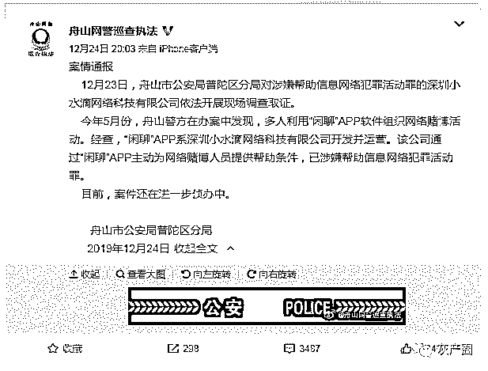
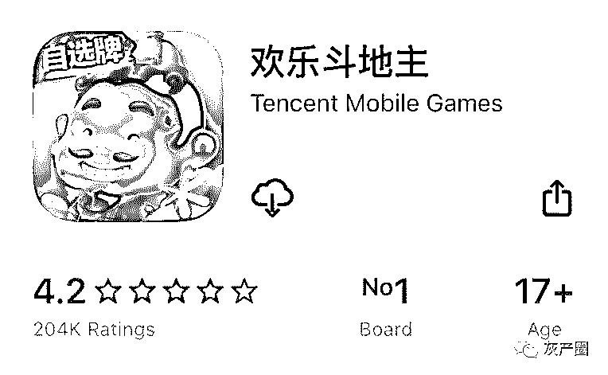
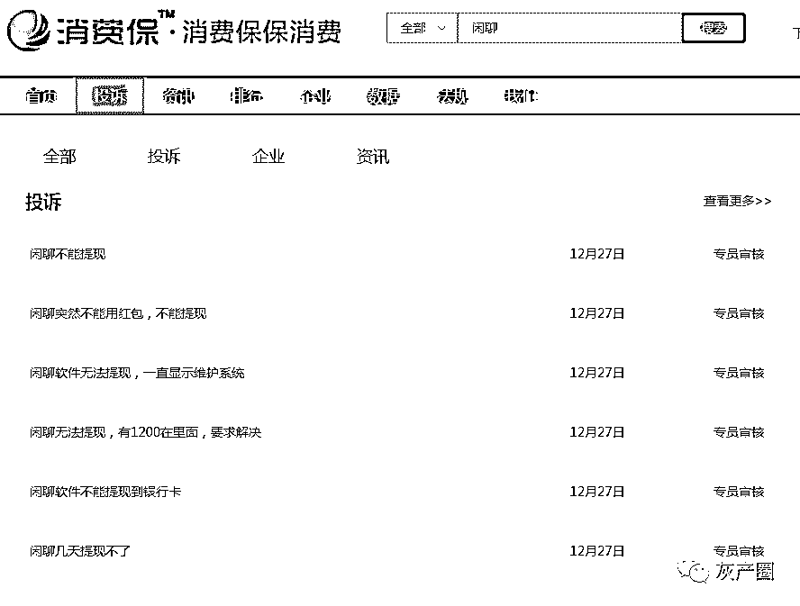
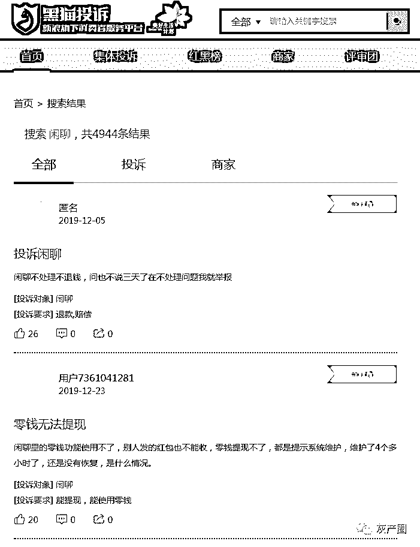
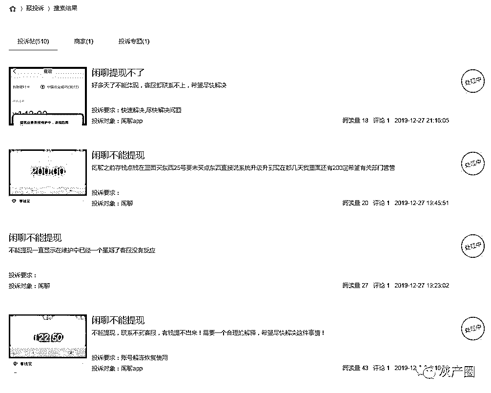
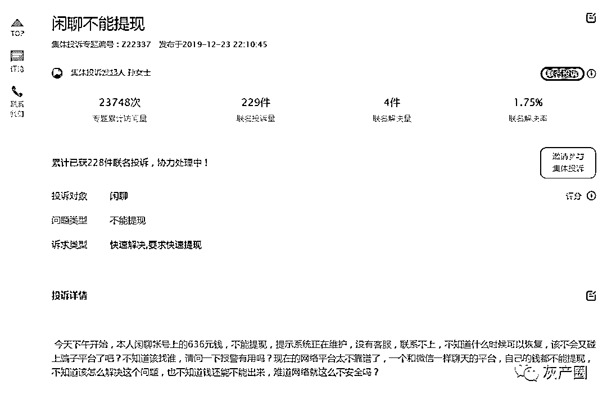
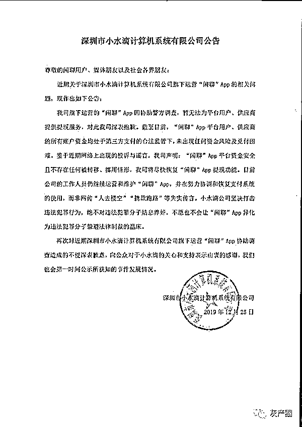
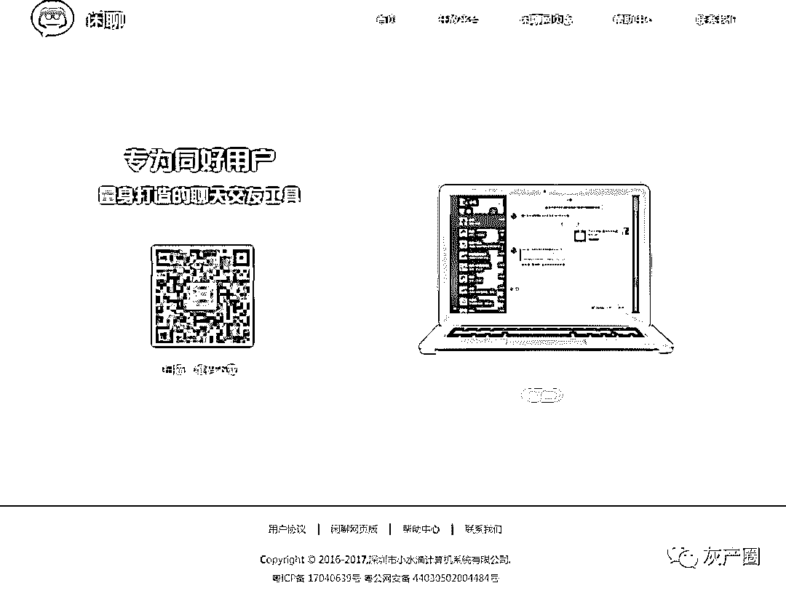
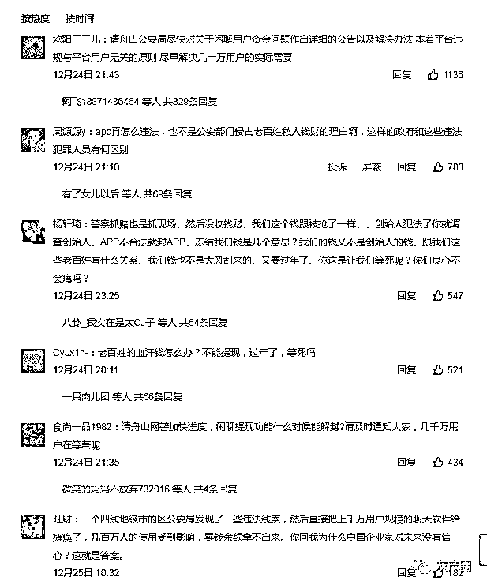

# 闲聊 App“涉赌大案”黑幕调查

> 原文：[`mp.weixin.qq.com/s?__biz=MzIyMDYwMTk0Mw==&mid=2247496955&idx=1&sn=f36a17c1e61b645333c958d4bd55df0f&chksm=97cb3fc3a0bcb6d5ce89688e27f27de8b56385c82686e02e0b168789a88fa624f53c1d3ad7e3&scene=27#wechat_redirect`](http://mp.weixin.qq.com/s?__biz=MzIyMDYwMTk0Mw==&mid=2247496955&idx=1&sn=f36a17c1e61b645333c958d4bd55df0f&chksm=97cb3fc3a0bcb6d5ce89688e27f27de8b56385c82686e02e0b168789a88fa624f53c1d3ad7e3&scene=27#wechat_redirect)

**点击上方蓝色字体免费订阅“灰产圈”**

导语

“今天可以提现了吗？”一个几百人的“闲聊”微信群里，每隔几个小时就有用户在其中问道。

三天前，浙江舟山警方发布微博称，社交软件“闲聊”运营方涉涉嫌帮助网络赌博活动，被公安机关现场取证调查。

而在上述公告发布的前一天，就有用户发现自己在闲聊账户中的零钱已经无法提现。截至目前，在安卓和 iOS 平台，闲聊 App 均已无法下载。

东窗事发

**12 月 24 日**，舟山网警巡查执法在微博上发布案情通报称，今年 5 月份，舟山警方在办案中发现，多人利用“闲聊”APP 软件组织网络赌博活动。

经查，“闲聊”APP 系深圳小水滴网络科技有限公司开发并运营。该公司通过“闲聊”APP 主动为网络赌博人员提供帮助条件，已涉嫌帮助信息网络犯罪活动罪。

**12 月 23 日**，舟山市公安局普陀区分局于对涉嫌帮助信息网络犯罪活动罪的深圳小水滴网络科技有限公司依法开展现场调查取证。目前，案件还在进一步侦办中。

棋牌赌博群

# 隐藏在闲聊平台里一条灰色产业链是棋牌游戏赌博。

根据澎湃新闻报道，今年 11 月安徽省肥西县公安局在查处一起赌博案件时发现，网名“X”的嫌疑人王某某利用“闲聊 App”在线上组织赌博活动，通过在 App 内建立赌博闲聊群，由其担任群主。随后，王某某邀集人员入群，以打麻将形式进行赌博。

警方深入侦查发现，该赌博群参赌者均要在手机下载打麻将软件，并在软件内创建虚拟房间。在将该虚拟房间链接发送到赌博群后，参赌人员在群内便可开赌，不受时间和地点限制。开一间虚拟房间能玩八局，八局结束系统根据自摸次数、接炮次数、点炮次数、暗杠次数、明杠次数自动弹出输赢情况。赢家将收款二维码发至群内后，输家扫码支付赌资，八局时长 12 分钟至 15 分钟。

参赌者必须先购买“开房钻石”才能在软件内创建房间，该“钻石”由王某某出售。原来，王某某不仅建立赌博群供他人赌博，同时注册了该打麻将软件后台的代理。以“代理”身份低价购买虚拟钻石，后翻倍高价出售，从中赚取差价。

这条产业链上有 5 个角色：游戏公司、社交软件、群主、玩家和银商，大家各司其职，以不同的方式赚取收益。

首先，游戏公司开发一款棋牌游戏，可以是下象棋、打麻将、炸金花，玩家们打完每一局会有积分计算输赢。游戏本身只能充值不能提现，玩家想要赌博就涉及资金结算的问题，周武告诉记者，目前主要有两种模式，业内人士称之为“房卡制”和“金币制”。

上文中王某某组织的赌博群就是典型的“房卡制”，目前通过社交软件组织赌博活动的模式主要就是房卡制。这种游戏每局启动都需要特定的房卡，由群主通过社交软件组织赌博群，游戏公司和群主之间通过房卡收益分成盈利。

“二者就像是批发和零售的关系，比如一张房卡原价 1 块钱，游戏公司以批发价格 5 毛一张卖给群主，再由群主加价出售给玩家们”，。

“群主”要负责的不只代售房卡，还要监督管理赌博群的运营，包括制订“游戏分数和现金的兑换比例”、“房卡钱由赢家出还是 AA”，以及保证群里不会有人输了耍赖。

第二种是金币制。“金币”指的是玩家在游戏中充值的货币，比如腾讯的欢乐豆或者联众的万能豆，每一局游戏结束时依据房间的倍数和输赢结果结算金币。

“金币型的棋牌游戏在法律上有一条明确界定的红线，只能充钱不能提现，否则就是违法。以欢乐斗地主为例，玩家们在游戏中可以用银行卡充值，但不能存在任何把金币兑换成现金的渠道，否则就是违法。”

金币制赌资结算的关键在于一群私人金币倒卖者，业内称之为“银商”。

平台通过银商回收金币的做法触犯红线，抓到就是违法，做这种的往往是一些铤而走险的小厂商。

同是金币制的游戏，上述两种模式游戏公司盈利方式也会有所不同。“大平台比如腾讯的游戏，充值后就不会返还。每局游戏都会收取一定的台费、茶水费，不管私下如何交易，平台上的金币总量是维持在一定规模的，这些金币消耗掉就需要通过官方渠道充值补充进来。自己回收金币小平台也会收台费，此外在充值和回收间会有一定的价差，这些也是游戏平台的收益。“

投诉爆发

“闲聊”APP 因不能提现，遭用户集体投诉。仅在消费保网站中，关于“闲聊”APP 无法提现的投诉就有 400 余条，其中仅有 3 条显示已经处理完成，其他投诉都还在审核处理中。

另外，在黑猫投诉平台上，针对“闲聊 APP 零钱无法提现”的相关投诉已经多达 4944 余条。

与此同时，在聚投诉的网站上涉及闲聊无法提现的投诉帖共有 441 条，其中“闲聊”APP 的投诉量为 305 起，解决率仅为 4％。从投诉贴的内容来看，大量用户对在消费保网站上针对“闲聊 APP 零钱无法提现”进行了集体投诉，诉涉及的金额在几百元至几万元不等。目前，“闲聊”APP 提示系统正在维护，人工客服也无法取得联系，提现功能失效。

发布公告

官网关闭，APP 悉数下架：

12 月 25 日，深圳市小水滴计算机系统有限公司针对近期旗下运营“闲聊”APP 的相关问题发布公告，称“闲聊”APP 平台坚决打击违法犯罪行为，资金安全且不存在任何被转移、挪用情形，该公司将尽快恢复“闲聊”APP 的提现功能。

深圳市小水滴计算机系统有限公司发表的公告中提到：

“我司旗下运营的‘闲聊’ App 因协助警方调查，暂无法为平台用户、供应商提供提现服务，对此我司深表抱歉。截至目前，‘闲聊’App 平台用户、供应商的所有账户资金均处于第三方支付的合法监管下，未出现任何资金风险及兑付困难。”

鉴于近期网络上出现的投诉与传言，公告中还表示，“闲聊”APP 平台资金安全且不存在任何被转移、挪用情形，公司将尽快恢复“闲聊”APP 提现功能。目前小水滴公司的工作人员仍继续运营和维护“闲聊”APP，并在努力协调和恢复支付系统的使用，而非网传“人去楼空”“携款跑路”等失实传言。小水滴公司坚决打击违法犯罪行为，绝不对违法犯罪分子姑息养奸，不愿也不会让“闲聊”APP 异化为违法犯罪分子躲避法律制裁的温床。

目前，经基金君测试后发现，“闲聊”的官方页面已无法打开，且“闲聊”App 已在多个应用市场悉数下架。

有部分用户仍可通过 IOS 系统的 App Store 下载“闲聊”App，但因获取注册验证码的界面显示“参数不合法”，无法正常注册。

案件回顾

“闲聊”App 涉赌似乎早有迹象，虽然其软件主打聊天社交功能，但用户在 App 内添加好友前需先绑定银行卡，这一操作让人匪夷所思。

据界面新闻报道，今年 6 月份，孝感网警执法就在微博上通报了一起赌场案。经查，犯罪嫌疑人鲁某伙同周某就是利用下载的赌博 APP，在网上开设赌场，通过微信群、闲聊群拉人进入软件中赌博，并根据参赌人员的输赢情况抽头渔利，共获利 5 万余元。

今年 8 月，浙江省杭州桐庐警方捣毁了 8 个涉赌犯罪团伙，参赌人员正是利用“闲聊”App 联系。杭州桐庐县局网警大队表示，参赌人员在赌博 APP 上的游戏结束后，利用软件的计分功能，再通过第三方支付方式进行资金结算。

交友软件变成吸钱骗局的又一温床，这种涉赌性第三方交易在微信群中同样存在。据澎湃新闻报道，江西此前就曾有多名群主因涉赌被抓，比如江西女子何某通过微信邀集 50 余人加入其创建的微信群，并利用手机 APP 邀集群内成员进行赌博，事后被判处有期徒刑四年九个月，并处罚金人民币十万元。

结尾

截至目前，舟山网警发布的微博下方已经累积了 3000 多条留言，不少用户在里面“喊冤”，称自己的钱并非赌资，充值零钱是为了“到闲聊商城里买东西、充话费、或者朋友间发发红包”。 但在闲聊用户群中却有另一种说法，有用户称：“闲聊不能玩了，标准的非法涉嫌赌博套利的行为，大家心理都有数。”

根据官网，闲聊是一款同好聊天交友工具，专为有共同兴趣爱好的用户打造。在闲聊中，用户可以找到有共同兴趣的好友，组成兴趣部落，加入高质量的社群，此外闲聊还有基于兴趣社群打造的社交电商“兴趣好货”。

那这个兴趣部落，是否是“闲聊 app"有意为赌徒提供线上赌博平台，相信各位看官心知肚明。

最后说一句，“闲聊”倒了，可能会有千千万万个平台出来，我们要做到的一点就是：

**不要赌博！不赌为赢！**

← 向右滑动与灰产圈互动交流 →

**阅读原文加入灰产圈高端社群**