# 翟鸿燊与陈安之，这些“成功学”大师，为何消失了？

> 原文：[`mp.weixin.qq.com/s?__biz=MzIyMDYwMTk0Mw==&mid=2247496940&idx=1&sn=8252272b609d344b6ec6e18b53af36ec&chksm=97cb3fd4a0bcb6c23c81a65ae242e1a50221c27eeeb2609bb906419ee8977c11fde491a8ce0e&scene=27#wechat_redirect`](http://mp.weixin.qq.com/s?__biz=MzIyMDYwMTk0Mw==&mid=2247496940&idx=1&sn=8252272b609d344b6ec6e18b53af36ec&chksm=97cb3fd4a0bcb6c23c81a65ae242e1a50221c27eeeb2609bb906419ee8977c11fde491a8ce0e&scene=27#wechat_redirect)

**点击上方蓝色字体免费订阅“灰产圈”**

导语

近年来，很少在大街小巷、酒桌饭局上听见人们像谈起一门阔亲戚那样，大谈翟鸿燊和陈安之这两位“大师”了。

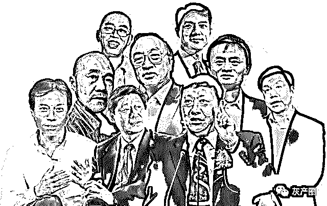

**新时代偶像“封神榜”——财富是成功的唯一标配**

翟鸿燊与陈安之，过去都曾是炙手可热的明星人物，在成功学界可谓南北双雄，振臂一呼地动山摇。

想当初，他们那些资本包装下的海报、视频、书籍，像开了闸的洪水一样疯狂涌漫在中国大地金山之上时，如今在头条叱咤风云自号“营销教父”的杜子建先生，都还不知道在哪个县城嘎啦灰头土脸吆喝着卖酒水。

“江湖术士”

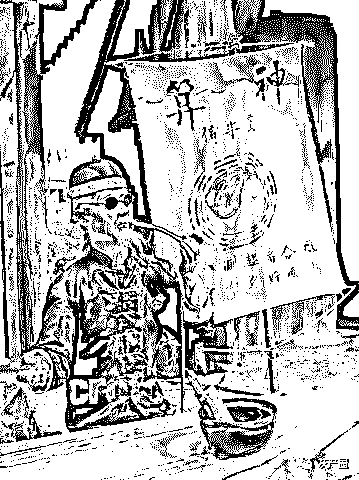

但是近几年，中国经济如火如荼，创业大潮愈演愈烈，本是这两位爷更加大显身手的时候，可奇怪的是，他们近乎销声匿迹了。为什么会如此反常呢？

不客气地讲，翟鸿燊也好，陈安之也罢，在我看来，哪里有“大师”，直白一点就是两位披着光鲜衣着架子的“江湖术士”罢了。

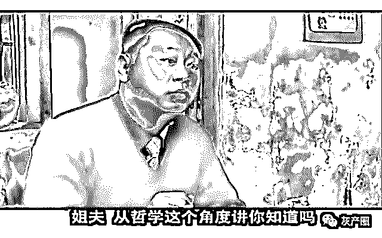**东北著名狠人范德彪，其实也是个梦想家**

表面上，翟鸿燊和陈安之是两类人，虽都是“大师”，可一个鼓吹“国学”，一个专注在“营销”，行业风马牛不相及。

但就我的观感，这两位其实是一体两面，都是“战略忽悠家”，搞的都是“精神传销”。唯一的区别可能在于：前者从“内里”的、“文化”的幌子突破，陈安之则更干脆直白一些，从“外在”的、“市场”的层面迷幻大众。

但是，我来从来不认为“成功学”就该被批判，就该被“剿灭”。

其实，任何时地、只要还有人这个物种，不分中国美洲，不管你是黄皮肤还是黑种人，一定都会有“成功学”的市场。

因为，“成功学”所面对的核心对象，不是孔夫子王阳明，更不是赚大钱赢房车那么表面，而是永恒的“人性”：**贪婪，梦想成功，只求走捷径，渴望自我实现**。

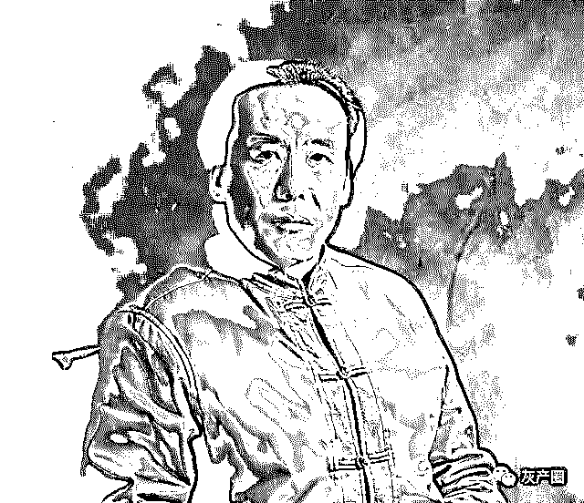**专给企业家上课和卖视频为生的“国学大师”翟鸿燊**

所以，这类成功营销学，不论是翟鸿燊无根游谈的“做人”的大道理，还是陈安之坐而论道闲扯的“赚钱”法门，他们所以当初盛行天下，被无数拥趸奉为“大师”，吃准看透的就是这一套。

这是古往今来“江湖术士”们的看家本领与啃饭功夫。

“时势造英雄”

翟鸿燊、陈安之们，比长春观门口摆摊算命“大师”们更高明的，只是背后有雄厚的资本包装，还是一句公道话就是他们自己可能也确实对现代企业管理等知识有过涉猎，三教九流、似新亦旧的残缺知识一混杂，在厚脸皮与妙口才的衬托下，仙风道骨的“大师”模样就出来了。他们可称现代版的、升级版的江湖“大师”。

时势造英雄，时势也造忽悠家。翟鸿燊与陈安之，当初会如此风光，如此走俏，主要是赶上了千载难逢的好时机。

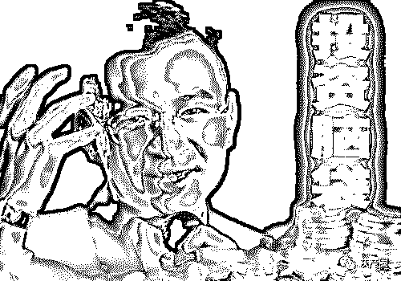

**永远鸡血喷张的“成功学大师”陈安之先生**

那时，市场经济在开发成长阶段，创业潮浩汗而起；同时，高级一点的教育还不普及，新媒体更还只是蓄势待发之中，信息封闭。这就导致这样一种民情：**普通大众下海为荣、都削尖脑袋想一夜发财，而已经挣到大钱的土豪老板们则迫切地需要提升自己的文化品位，最好能像他们卖的快餐一样，什么孔孟鬼谷子王阳明，通俗易懂，打包拎走，不求最好但求最贵，速战速成**。

于是，翟鸿燊与陈安之这两位绝顶聪明的人精，各瞧准一方下手，揭竿而起，在资本的包装营销下，迅速成为文化与营销兼具的“大师”。虽然他们之前到底什么来路，比如哪个大学毕业，又师承渊源何人，有过什么靠谱的著作，并没有人说得清楚，中国人是最从众的，一张不断叠加的“资历”名片就足以打遍天下，吃透五湖四海的屌丝与土豪。

说起来，我们所有人，这一生所有努力都将受到两种力量的支配：

一种是价值观，一种是经验。翟鸿燊和陈安之一流的“成功学" ，渗透入来的就是这一套思维，但又是以没有根据、缺乏实践 、无法应用的方式呈现出来的。我过去为了研究这样一些“奇人” ，还真无聊翻阅过他们那些破书，那些鬼扯视频，总结起来，他们的技法，其实是反反复复给人灌输类似“别对自己说不可能”的“箴言”。

以此为核心，什么“要成功，先发疯，头脑简单往前冲！”，什么“道法自然是人类解决方案“之类普世皆准的浮夸之言，络绎不绝，满嘴跑火车。可他们讲的这些，对于那些人生理想就是一夜暴富、或者文化水准不高缺乏辨别力的群体而言，简直甘之如饴，不要太好！

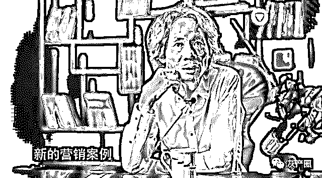**有接班翟、陈之势的“营销教父”杜子建先生**

“周瑜打黄盖”

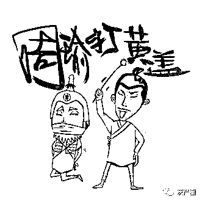  

话说回来，成功学这东西危害大么，老实说不至于。翟鸿燊和陈安之的“成功学"，翟是主打给卖土豪高价“鸡汤”，陈是矜矜业业为我等屌丝大众充值“鸡血”，可能使人犬儒，使人破财，使人浮躁、浅薄、狭隘，但都是暂时的小问题，真实人世、人事及商场的矫正教训机制这么残酷，还不至于让人终生不愈。

况且，您真的以为所有看翟鸿燊和陈安之的朋友是傻逼么，其实他们何尝不知道本分踏实的重要性，内心何尝不明白不骂这些人的鬼扯，但是他们需要这些，不信，但读起来心里图个安逸，权当像买杯咖啡激励振作下日益麻木的神经，也不希望连个盼头都没有。

“销声匿迹”

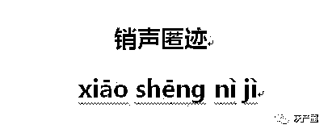  

闲扯到这里，有心的朋友大概已经明白我要说的了：

翟鸿燊和陈安之的近乎“销声匿迹”，主要还是被日益开放、进步的时代所打败、所淘汰。

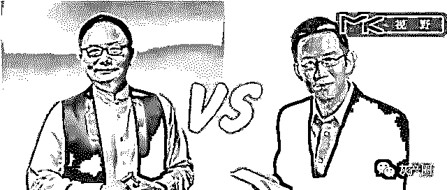

**知识付费——升级化的“成功学”模式？**

一者，他们所要服务的对象和时代，其实都已经全面“更新换代”：

市场经济日渐完善与成熟，受过良好教育的年轻一代成为社会创业主潮，过去的“土豪”们早已不再是土鳖且见多识广，媒介也前所未有的发达，信息的流通力度让村村寨寨通网，民智是在进阶的。

翟鸿燊、陈安之那样的老套路，华而不实口号式的说教方法、朗朗上口标语式忽悠内容，固然还会有受众，但是再畅销是不大可能了。况且他们二人，各种真实身份起底，各类诈骗丑闻缠身，再想仅靠口水轻松捞钱，也不大容易了吧。

还有一个关键成因可能在于，在新媒体时代，翟鸿燊和陈安之这一类“老成功学家”，必然会被他们的同行，一种升级版的、现代版的、高雅版的“成功学”后辈所取代。

像我们熟悉的“逻辑思维”的罗振宇、“樊登读书会”的樊登、“晓说奇谈”的高晓松、“老梁有话说”的梁宏达、“得到”APP 上的薛兆丰等等，从另一外一个角度来说，无疑都可看作是更适宜当下并为之应运而生的“新型成功学家”。

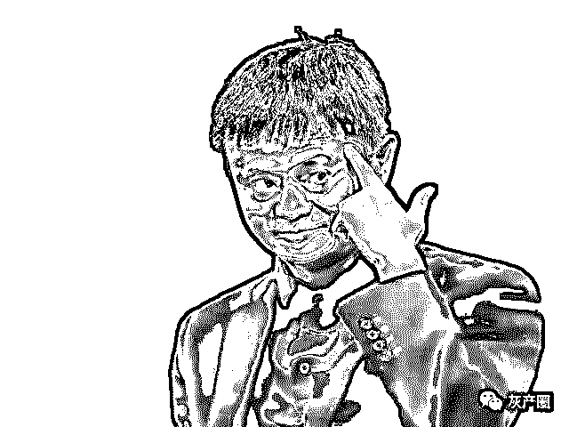

而他们这类群体，显然更加具有现代性特征，更加富有内涵，更能迎合那些有良好教育履历的中国一代：

在新的知识爆炸、信息即金钱的时代，不随时“充电”就会被淘汰成为人们新的共识与新的焦虑，于是那些经过包装、整合的新型“知识布道者”们以变种后的“成功学”面目出现，太多人期待通过他们，最快速地节约时间和成本，得到“成功”的捷径，从而缓解知识吸取与生活艰辛的焦虑。

结尾

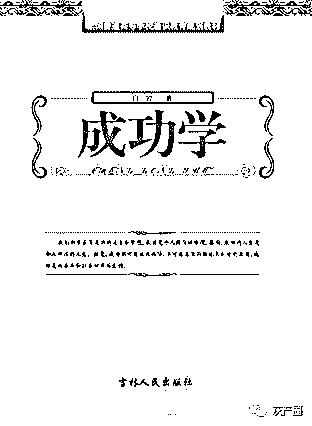  

所以说，有人的地方，就有成功学。而翟鸿燊与陈安之们也不可能真的会销声匿迹的。

他们只是“改良”了品种，以更恰当的面目出现。

过去，罗素说，“据说人是理性的动物，我至今仍在寻找支持这个说话的证据”，这似乎不是调侃。人的思想就是这样的，我们每个人都不大可能真的完全跳脱“成功学”的诱惑。

我们挣扎出来的唯一办法，可能就是尽力站在远比“成功学”更高的思想高墙之上，取法乎上，观水有术，如此才能看清楚那些沟壑，明白哪里是死途，哪里是活路吧！

最后，附上红木行业大佬与陈安之的对话，希望能给你启发！

[骗了中国人 5000 亿的罪犯，竟然出家当和尚了！](https://mp.weixin.qq.com/s?__biz=MzIyMDYwMTk0Mw==&mid=2247496928&idx=1&sn=4f0f1f636ec5a6e81653e7d37a650a1f&chksm=97cb3fd8a0bcb6ce9357348875e9b58fe92544ae6b9ebafbdf80335f71f97868e37b5f746868&scene=21#wechat_redirect)[揭秘：“杀人套路贷”，2000 元如何在两个月内滚到 50 万？](https://mp.weixin.qq.com/s?__biz=MzIyMDYwMTk0Mw==&mid=2247496920&idx=2&sn=29f8f5ddd242a523af7d0498d58f5023&chksm=97cb3fe0a0bcb6f6ad0ba232aa4baa9a1048085a7187776ad3778d90b1470f57c126eb9baea4&scene=21#wechat_redirect)[血洗！又一金融巨骗东窗事发，中产阶层杀手，投资者或血本无归......](https://mp.weixin.qq.com/s?__biz=MzIyMDYwMTk0Mw==&mid=2247496920&idx=1&sn=ea80fe05c8c8bb030deb38dd5f5840c2&chksm=97cb3fe0a0bcb6f6ac38b9efcbf21d1b21f66c6bd8a34696f0753fb7a15bbb460dcc420f1fd8&scene=21#wechat_redirect)[狼狈为奸！俞凌雄、陈安之、梁凯恩、刘阳、赖彩云合谋诈骗中国人！](https://mp.weixin.qq.com/s?__biz=MzIyMDYwMTk0Mw==&mid=2247496891&idx=2&sn=d1c5d17906d9ec7e4870f6e47414cfc3&chksm=97cb3f83a0bcb6951de795cca872fb3f98d45153efca223e085bc35edaa4e932d20e3c594b8d&scene=21#wechat_redirect)

← 向右滑动与灰产圈互动交流 →

**阅读原文加入灰产圈高端社群**