# 骗了中国人 5000 亿的罪犯，竟然出家当和尚了！

> 原文：[`mp.weixin.qq.com/s?__biz=MzIyMDYwMTk0Mw==&mid=2247496928&idx=1&sn=4f0f1f636ec5a6e81653e7d37a650a1f&chksm=97cb3fd8a0bcb6ce9357348875e9b58fe92544ae6b9ebafbdf80335f71f97868e37b5f746868&scene=27#wechat_redirect`](http://mp.weixin.qq.com/s?__biz=MzIyMDYwMTk0Mw==&mid=2247496928&idx=1&sn=4f0f1f636ec5a6e81653e7d37a650a1f&chksm=97cb3fd8a0bcb6ce9357348875e9b58fe92544ae6b9ebafbdf80335f71f97868e37b5f746868&scene=27#wechat_redirect)

**点击上方蓝色字体免费订阅“灰产圈”**

张誉发是谁？你可能不太清楚。今年 10 月 17 日，雪球网上有一热帖：逾百名中国金钱游戏（资金盘）受害人到马来西亚吉隆坡街头，痛哭失声、长跪不起、冒雨歌唱国歌，控诉“MBI”集团。这批受害者抵达 MBI 总部后，发现已人去楼空，他们不但遭到保安员驱赶，有人更接到刑事恐吓。一些受害者无法接受 MBI 崩盘的消息，最终选择自杀了结性命。张誉发就是“MBI”集团背后的男人，在中国骗了 5000 亿后，最近他跑到了泰国的寺院削发出家。你以为他是去忏悔吗？当然不是——引渡、和当地法院、警方沟通……法院的执法难度又上升了好几个台阶，一系列程序下来，少说也要几个月的时间。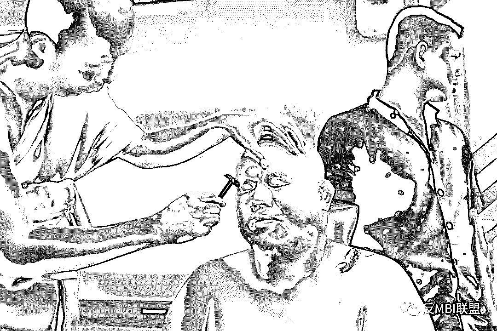图片来源：反 MBI 联盟“MBI”是什么？为何能让参与者像飞蛾扑火般将一生的积蓄尽数投入？张誉发又是什么来历？凭什么能在法院判决书落地前夕，恰好出家当和尚？最为关键是这批被骗的资金怎么办？出家后就不用承担法律责任了吗？这一切并不简单。

01

**5000 亿大骗局**
张誉发，祖籍广东省，为马来西亚籍第三代华人，2009 年创办 BMI 集团，2012 年 5 月创办 MFC 平台。MBI 集团官网显示他是马来西亚国父东姑阿都拉曼的堂弟，而 MBI 的常委顾问是马来西亚警察总署的署长。MBI 旗下有 40 多家产业链公司，涉及房地产、连锁超市、网上商城、影视公司、连锁公寓酒店、绿色家居等等。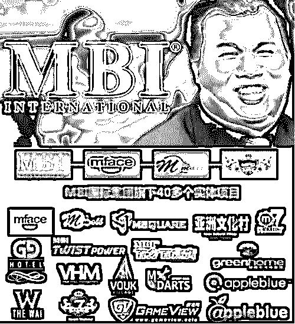也就是说，此人的人脉、背景、资源什么的都很牛逼，妥妥的富二代。**当然，没有说谎是这一切的前提。**2012 年，他的 MBI 在国内传播，通过在线商城购物、线下商家交易等方式，使其虚拟币“易物币”发生流通。根据媒体报道，要成为 MBI 会员，新人必须要申购价值 700 元到 35 万元不等的虚拟货币。打着“只涨不跌”的谎言，以高额回报作为诱饵，通过人传人的方式，MBI 在全国各地疯狂蔓延，不断发展下线。其中参与者多为五六十岁的中老年人，家人不管怎么极力劝阻，这些“M 粉”都不为所动，如飞蛾扑火般将一生的积蓄尽数投入，这一类似传销式的理财平台<h-char unicode="ff0c" class="biaodian cjk bd-end bd-cop bd-hangable bd-jiya"><h-inner>，</h-inner></h-char>至少让 3000 名中国投资者血本无归。早在 2015 年，雪球用户@饕餮海 在雪球 App 内发文《易物币<h-char unicode="ff08" class=""><h-inner>（</h-inner></h-char>MBI<h-char unicode="ff09" class=""><h-inner>）</h-inner></h-char>骗局》就揭露了 MBI 骗局始末。

本文首发 2015 年，作者于 2018 年进行修改

因为 MBI 游戏代币是单边市场的设置，加上是全球一只股，资金集中不分散，同时限定个人投资户口最大 5000 美金，有效规避了游戏代币市场上的大盘炒作、大鱼吃小虾的风险，再加上推广者佣金的发放与无形中整合的产业链资源 促使新股东不断进场，所以 MBI 游戏代币总是处在求大于供而只升不降。

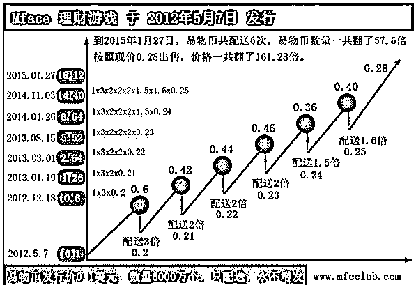

而真实情况是<h-char unicode="ff1a" class=""><h-inner>：</h-inner></h-char>要想盈利<h-char unicode="ff0c" class=""><h-inner>，</h-inner></h-char>只有不断发展下线<h-char unicode="ff0c" class=""><h-inner>，</h-inner></h-char>依靠吃掉下线的资金。

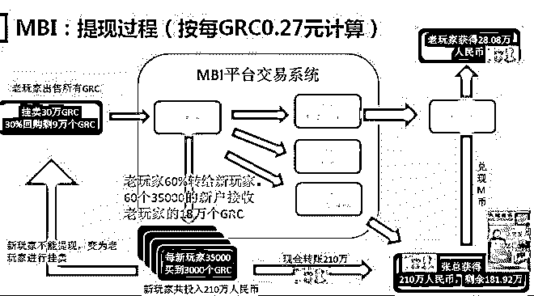

百度文库

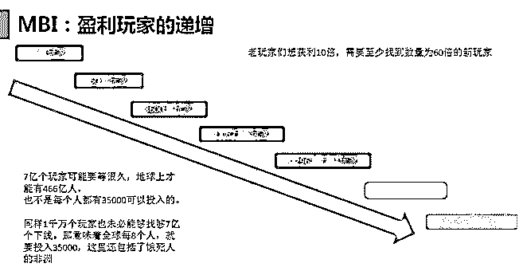

百度文库

易物币<h-char unicode="ff08" class="">（</h-char>MBI<h-char unicode="ff09" class="">）等此类</h-char>骗局的基本特征：一<h-char unicode="ff09" class=""><h-inner>、</h-inner></h-char>熟人之间传销<h-char unicode="ff0c" class=""><h-inner>，</h-inner></h-char>具有<h-char unicode="201c" class="">“</h-char>老鼠会<h-char unicode="201d" class="">”</h-char>的特点<h-char unicode="ff1b" class=""><h-inner>；</h-inner></h-char>二、以高额回报为诱饵<h-char unicode="ff1b" class=""><h-inner>；</h-inner></h-char>三<h-char unicode="ff09" class=""><h-inner>、</h-inner></h-char>以网络为载体<h-char unicode="ff0c" class=""><h-inner>，</h-inner></h-char>覆盖面广<h-char unicode="ff1b" class=""><h-inner>；</h-inner></h-char>四、侦破难度大<h-char unicode="ff0c" class=""><h-inner>，</h-inner></h-char>追赃挽损难度大<h-char unicode="3002" class=""><h-inner>。</h-inner></h-char>

多么痛的领悟，这些隐藏在幕后的<h-char unicode="201c" class="">“</h-char>黑手<h-char unicode="201d" class="">”</h-char>抓住普罗大众的理财需求痛点，通过<h-char unicode="201c" class="">“</h-char>傻瓜式<h-char unicode="201d" class="">”</h-char>的投资诈骗项目不断得手<h-char unicode="ff0c" class="">，</h-char>而目前类似这种疯狂的资金盘项目<h-char unicode="ff0c" class=""><h-inner>，</h-inner></h-char>仍在中国大地上肆无忌惮地运行着。

02

#### **欲讨回血汗钱！维权者丢“炸弹”到张誉发家中**

随着我国对类似诈骗行为的持续打击，自 2017 年开始，中国多地警方和马来西亚警方相继对 MBI 展开打击行动。

2017 年 3 月至 11 月期间，吉某梅等 11 名被告人先后被广西省梧州市公安局刑事拘留，共冻结涉案资金 3 亿余元，查封涉案房产 12 套。

2017 年 11 月 8 日，上海公安机关经过长达一年的前期侦查，会同全国多地公安机关对涉嫌传销的“MBI 国际集团”开展集中打击，破获“MBI”国际集团涉嫌组织、领导传销活动案，共抓获 40 余名犯罪嫌疑人。

2018 年 1 月 30 日，广西省梧州市龙圩区检察院以起诉书指控上述 11 名被告人犯组织、领导传销活动罪，向龙圩区法院提起公诉。法院审理认为，上述 11 名被告人为谋取非法利益，通过虚实整合的理财概念吸引投资者在其公司旗下的 MFC 理财平台购买注册币进行投资，发展下线人员，其行为均构成组织、领导传销活动罪。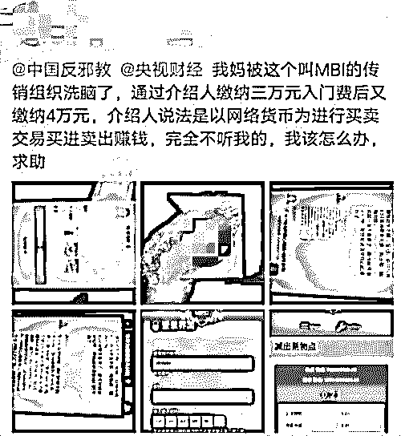（网友发帖求助如何让自己的母亲摆脱 MBI 的洗脑）2018 年 5 月，据马来西亚《星洲日报》报道，52 岁的张誉发被当地法院提起公诉。

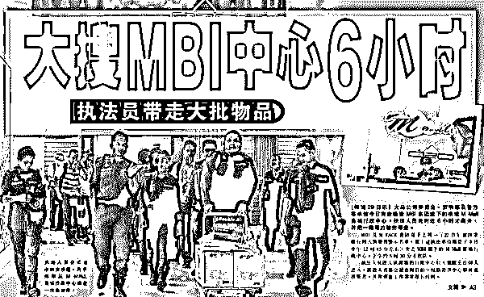

今年 7 月，四川省攀枝花市公安局东区分局通过相关部门的密切配合及侦查手段的多方运用，成功侦破 MBI 特大跨省网络传销犯罪案件，涉及四川、云南、贵州、湖南、上海等多地涉及数万人。抓获犯罪嫌疑人 27 人，扣押、冻结涉案资金资产 1.4 亿元。

今年 10 月 17 日，多达百名中国人聚集在中国驻马来西亚大使馆前长跪不起，控诉 MBI 诈骗几千亿人民币，并唱起中国国歌！

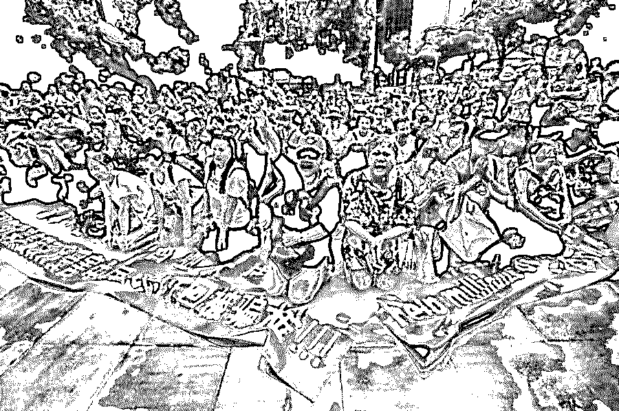部分示威者透露，在中国尚有数以万计的受害者，估计被骗走的资金达 5000 亿人民币。在示威过程中，有人甚至高举海报，高喊“张誉发是大骗子，快还钱”“我们要见中国驻马大使”等等。

此次马来西亚街头维权引起了中国驻马大使馆的高度重视，中国驻马大使馆新闻发言人 17 日发表声明，呼吁涉事公司站出来，承担应有的责任和义务：“中国驻马大使馆一直致力维护身在大马的中国公民合法权益，并在职责范围内，对有合理诉求的中国公民提供领事保护及援助。”

据汇商传媒报道，在中国投资者示威索要投资款后不久<h-char unicode="ff0c" class="biaodian cjk bd-end bd-cop bd-hangable bd-jiya"><h-inner>，</h-inner></h-char>有 3 名疑似中国籍的男子持刀夜闯张誉发儿子<h-char unicode="ff0c" class="biaodian cjk bd-end bd-cop bd-hangable bd-jiya"><h-inner>，</h-inner></h-char>也是 Vouk 酒店董事经理兼 MBI 国际公司董事<h-char unicode="ff0c" class="biaodian cjk bd-end bd-cop bd-hangable bd-jiya"><h-inner>，</h-inner></h-char>位于槟城甘密山的豪宅<h-char unicode="ff0c" class="biaodian cjk bd-end bd-cop bd-hangable bd-jiya"><h-inner>，</h-inner></h-char>要挟后者找父亲<h-char unicode="201c" class="biaodian cjk bd-open punct">“</h-char>还钱<h-char unicode="201d" class="biaodian cjk bd-close bd-end punct">”</h-char><h-char unicode="ff0c" class="biaodian cjk bd-end bd-cop bd-hangable bd-jiya"><h-inner>，</h-inner></h-char>并在与事主司机搏斗后逃走<h-char unicode="ff0c" class="biaodian cjk bd-end bd-cop bd-hangable bd-jiya"><h-inner>，</h-inner></h-char>留下两枚假炸弹。

该事件尚未核实真假。但可以确定的是：在百名中国 MBI 受害者哭诉维权的背后，更多的骗局仍在进行。如果不是被逼无奈，谁又会远走他国铤而走险去维权？

03

**“瞒天过海，****金蝉脱壳”**骗了 5000 亿的张誉发，为何能够呼风唤雨？作为马来西亚鼎鼎有名的富豪，他旗下公司经营业务种类高达百余种，涉及工厂和房地产等等，并在大陆和泰国两地开展了不少业务。但实际上，张誉发的财富都是靠传销诈骗得来的。虽然一路坎坷，但他一直坚持，世界上总有会被他骗的傻子！早年，他卖过手机，做过红岛咖啡，圈了不少钱，然后说是被人坑害，最终张誉发把锅甩给合伙人，自己罚点款，判刑一天，解决了问题。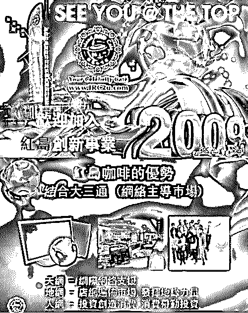（红岛咖啡宣传海报）接着，他去做卖床垫的传销，这个传销项目骗到了 60 亿业绩。尝到甜头的张誉发，原本已经有了衣食无忧的生活，但由于太过贪婪，觉得“时势造英雄”，于是他带领十几个马仔，把一部分赚到的钱送给了马来西亚的拿督，又搞了一个诈骗项目来圈钱。他请到了美国华尔街精算师当操盘手，推广三出三进模式，做大了以后，又到马来西亚发展实体产业。不过，他的实体生意却干得不好。尽管买通了政界，拿到了马来西亚污水处理工程、燕窝等垄断性产业，但最后都亏了本。2012 年，张誉发穷途末路，跑去泰国发展，当时泰国的丹诺荒无人烟，杂草丛生，张誉发以买下丹诺 80％的土地为名义，向泰国银行借贷，并行贿官员，让泰国政界宣布这里为免税自贸区。不过到了 2013 年，他的主要业务——MFC 空气币因制度数据逻辑问题，导致很多粉丝集体套现，平台崩盘，网址关闭好多个月。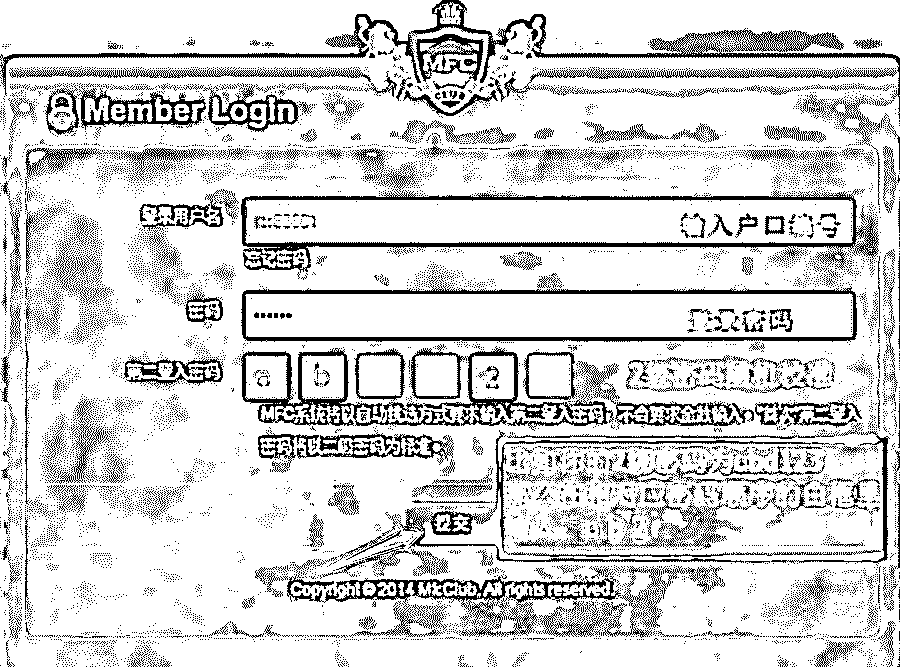（MFC 空气币登录界面）这时，他把目光瞄向了中国，寻找更多的接盘侠。或许张誉发都没想到，中国的接盘侠会有那么多。如今东窗事发，大批中国投资者越洋来到马来西亚追讨血汗钱，还有法院的逮捕令，张誉发躲到了泰国宋卡府的 Na Thawi 寺庙，并宣布短期剃度出家。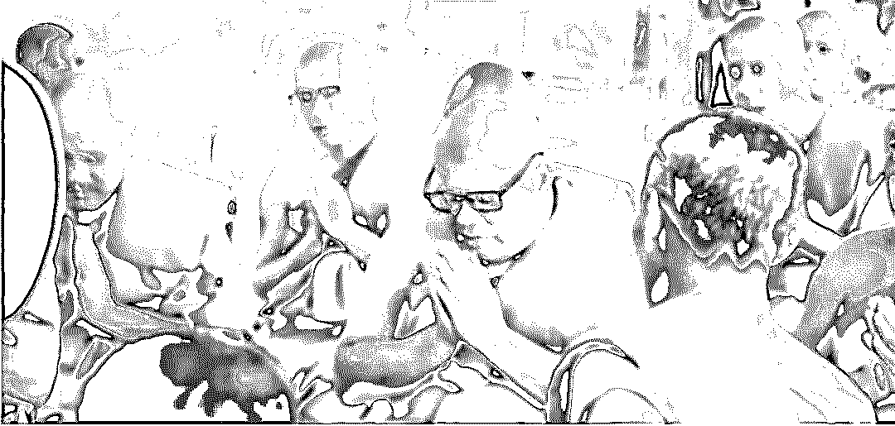（张誉发出家）值得一提的是，5 年前，传销集团“云数贸”的创办人，也就是当时自称“未来世界首富”的张健，在其公司被监管机构列为非法传销公司后，也跑到了泰国的寺院进行了短期的削发出家。而就在张誉发在泰国刚出家不久。12 月 10 日，广西梧州市龙圩区法院又公布了 MBI 特大网络传销案的判决书。判决显示：吉某梅等 11 名被告人因为犯组织、领导传销活动罪分别获刑，并冻结传销资金 3 亿余元。考虑到张誉发已经削发为僧，人民法院的执法难度又上升了好几个台阶。引渡、和当地法院、警方沟通……一系列程序下来，少说也要几个月的时间。这几个月期间，不知又会出现怎样的变局。

* * *

MBI 事件持续 5 年多时间，期间中外警方都在不断打击，原本以为该事件已经广为人知。然而在搜集资料准备本文的过程中，我们发现——现在网络上还有随处可见的 MBI 宣传网页和诱导资金入盘的新闻，比如：

再比如：（我们尝试扫了一下网页末的二维码，出现的是私人微信：昵称为黄教主，个性签名是 2019 赚 500 万，再带 100 个会员赚 100 万）

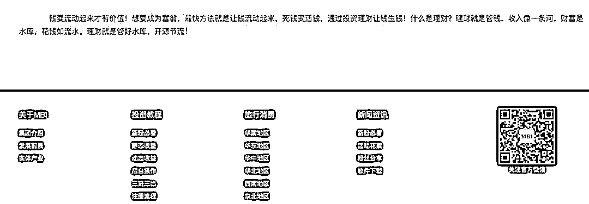

这让人非常费解：为什么法院都下发了判决书，网络上还能轻易地搜到相关宣传信息？

为什么创始人都在泰国削发为僧了，这个组织还在运作？

为什么明明自 2015 年起，就不断有人出来打假，还会有这么多人上当受骗？

这一切的背后，到底是怎样庞大的组织在运作？又包含着怎样的阴谋？是对方太狡诈？还是大众太贪婪抑或是愚昧？

在雪球用户@饕餮海 的文章底下，有一位名叫@杨自阳的球友评论，他同样也是虚拟货币骗局的受害者，总共被骗 100 多万。他用自己惨痛的经验教训告诉大家：广大网友千万小心！庞氏骗局，一旦踏入，负债累累！

本文参考自：《张誉发犯众怒，出家难逃罪孽因果！》反 MBI 联盟

《骗了中国投资者 5000 亿<h-char unicode="ff0c" class="biaodian cjk bd-end bd-cop bd-hangable bd-jiya"><h-inner>，</h-inner></h-char>MBI 张誉发竟然削发出家了<h-char unicode="ff01" class="biaodian cjk bd-end bd-jiya">！》汇商传媒</h-char>

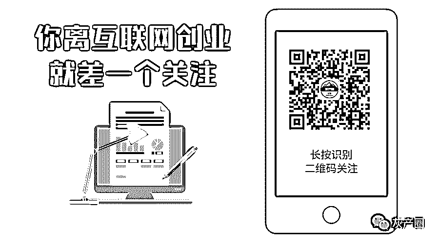

← 向右滑动与灰产圈互动交流 →

**阅读原文加入灰产圈高端社群**