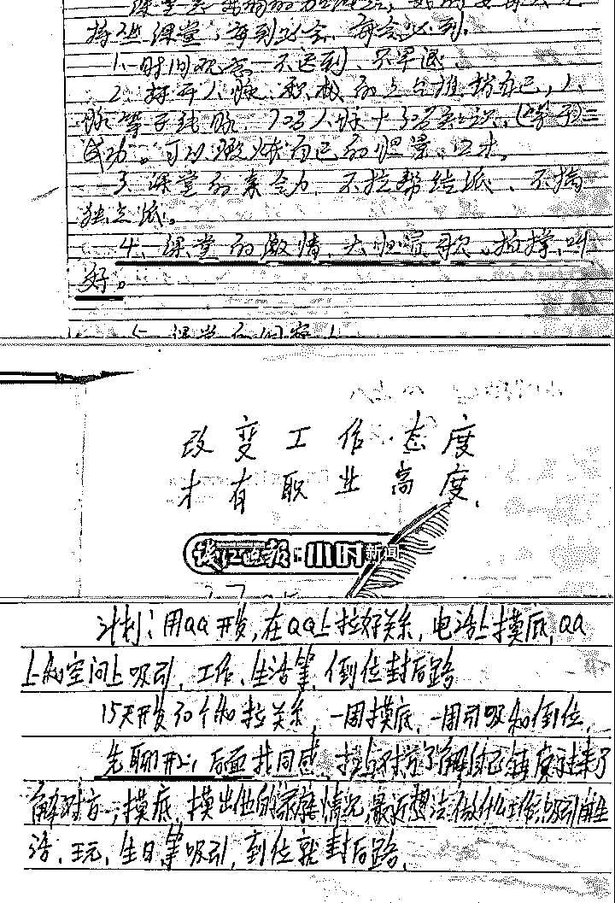
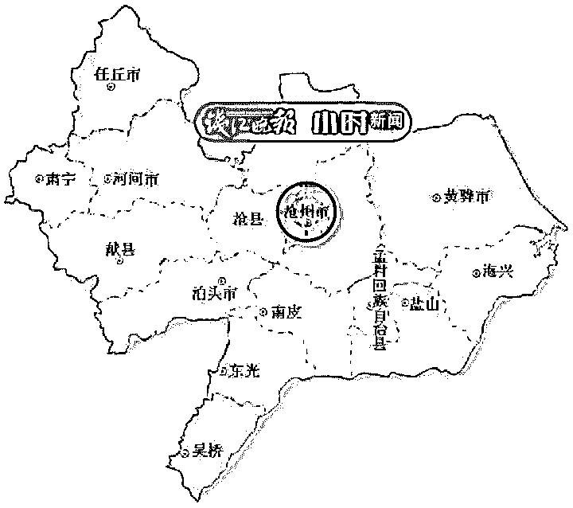
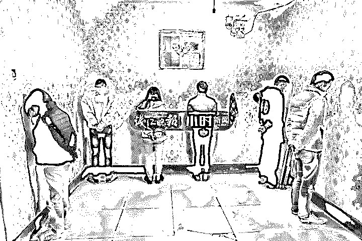
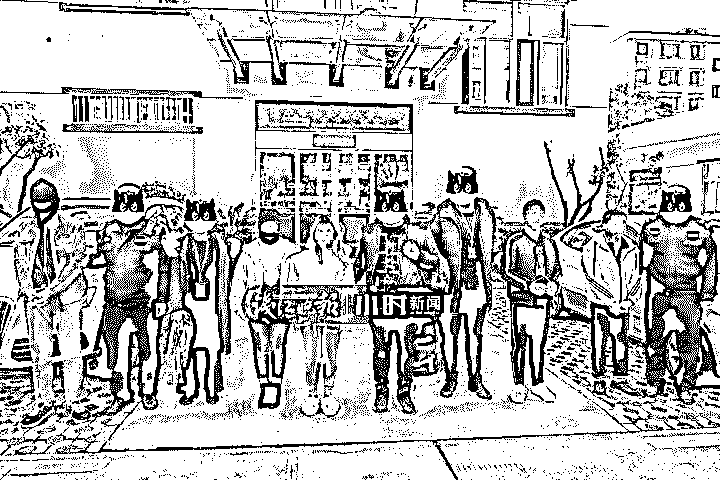
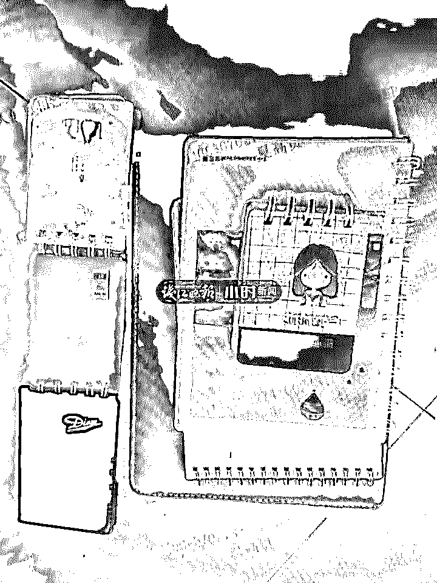
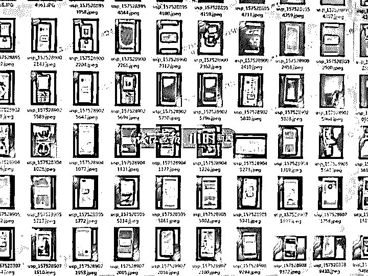

# 我决定，把这本内部“致富手册”传给你！

> 原文：[`mp.weixin.qq.com/s?__biz=MzIyMDYwMTk0Mw==&mid=2247496863&idx=1&sn=93ebd3f693236d07d1d1451fb7984971&chksm=97cb3fa7a0bcb6b1e6ba834c72e1618bfa4e92d31fa4ff23ef80f47867dc369898eb929ebda9&scene=27#wechat_redirect`](http://mp.weixin.qq.com/s?__biz=MzIyMDYwMTk0Mw==&mid=2247496863&idx=1&sn=93ebd3f693236d07d1d1451fb7984971&chksm=97cb3fa7a0bcb6b1e6ba834c72e1618bfa4e92d31fa4ff23ef80f47867dc369898eb929ebda9&scene=27#wechat_redirect)

**点击上方蓝色字体免费订阅“灰产圈”**

0

**导语**

先假装交男女朋友，然后以没钱买车票、买手机、遇到意外等等各种五花八门的理由来骗钱，说真的，这样的诈骗手段一点都不新鲜。为什么还有这么多人被骗？民警也很纳闷。

前几天，浙江省海宁市警方捣毁了一个盘踞在河北沧州的诈骗团伙，他们用的正是这种交友诈骗的手段，18 名犯罪嫌疑人被采取刑事强制措施。

在诈骗窝点，民警搜到了不少学习笔记、培训手册，不得不说，骗子真的好拼啊。

1

**一个案件牵出一个团伙**

今年 9 月 13 日上午，海宁警方接被害人张某报警，他被人以谈男女朋友为名，以购买车票、医药费、打车费等理由骗走 3530 元钱。

9 月 22 日，经过层层抽丝剥茧，线索指向河北沧州。

“一个是此类诈骗有相对明确的高危人群，再结合资金流情况，所以很快就研判出了 4 名犯罪嫌疑人的身份信息，并且查到落脚在沧州。”刑侦大队重案队长介绍。

根据经验，诈骗团伙内部有着明确的分工和层级，如果草率发兵，斩草却难除根，警方决定成立专案组，继续深挖下去。

专案调查一段时间后，嫌疑对象从 4 人扩展到 18 人，并且关系网络初步厘清，犯罪规律基本掌握。11 月 18 日，为了精准研判，一支先遣部队悄悄抵达沧州，在当地警方的配合下，经过 8 天 8 夜的努力，终于一一查清了 18 名嫌疑人的身份信息和具体的藏匿地址。

“嫌疑人极其狡猾，窝点多、关系错综，每天都在变化，特别层级高的嫌疑人，行踪飘忽不定，极少露脸，在沧州秘密侦查期间，每天工作到凌晨 2、3 点，6 点又起床。”专案组成员说。

2

**为了身价翻 1000 倍而努力**

**团伙内部手册曝光**

11 月 27 日凌晨 3 点，在河北省沧州市新华区解放西路上的红砖平房内，嫌疑人还在睡梦中，租房外，专案组兵分四路，正在步步逼近。

“全部不许动！”一声呵斥划破了凌晨冬季的宁静，五分钟后，嫌疑人一个接一个被押上了警车。

根据前期研判，这两个点上各有一名“寝室长”会在 7 点钟左右来巡查，而且根据规律，还有一名鲜少露面的“主任”也很有可能现身。果不其然，7 点左右，“寝室长”樊某、王某以及“主任”李某露面了，前脚刚踏进租房门，后脚就被侦查员牢牢控制住。

“主任”——“寝室长”——“主管”——“业务员”，四个层级的 18 名嫌疑人全部落网。

这个团伙是怎么分工的呢？

“业务员”是这个团伙中的最低层级，很多都是被朋友、老乡以到公司上班为名骗过来的，进入组织之后每人要交 2900 元的“会费”给“主任”，然后会接受系列的“培训”。

从警方查获的“学习笔记”上，看到课堂内容不仅有“课堂的激情，大胆唱歌、拍掌、叫好”等课堂纪律类的培训，也有“先聊开心，后面找同感”等诈骗技术类的教唆，甚至还有“改变工作态度，才有职业高度”这样的“励志”语录。

“主任说，现在交 2900 元，努力几年后，出去的身价就是 290 万！”嫌疑人赵某说，她今年 20 岁，四川人，很多像她这样的“业务员”都是抱着要为自己“涨身价”、“晋升职位”而心甘情愿留在团伙内。

晋升的渠道有两种：一种是拉人进诈骗团伙，拉 2 人就能升主管，拉得越多，升得越高。

还有一种就是上缴自己的诈骗所得，“业务员”们有的将微信绑定在“寝室长”管理的银行卡上，骗得的钱直接提现到卡里，有的则是积累一阵子后，去银行取了现金再上交。同样，上交的钱越多，就晋升的越快。

“除了吃饭睡觉，就是找人聊天，然后编造各种理由骗钱。”不过赵某还有一项任务，由于其相貌姣好，男性“业务员”在扮演女性诈骗过程中，经常需要她配合，与受害人进行语音或者视频聊天，博取对方的信任，每次帮忙后，他们会给她买几包零食以表感谢。

3

**10 个人里能骗到 2 个**

**培训内容细致到“警察来了怎么办”**

高层级的团伙成员都有“提成”和自己实施诈骗所得两项“收入”。

26 岁的李某 2015 年 11 月进入这个团伙，已经做到“主任”，下面的人都喊她“老板”，相对于“业务员”，她要考虑的问题很多。

比如为了躲避警察的侦查，她要不停地变换租房，要对“寝室”进行巡查，把“新人”的证件全部收走，并对他们进行“培训”。“培训”内容细致到诸如“警察来了，要第一时间藏手机”、“如何 PS 火车票”等，而她有时也会亲自实施诈骗。

“骗过多少人已经记不清了，有的能骗到几千甚至上万，有的就几百。一般 10 个人里，能聊起来的有 5 个，能骗到钱的有 2 个。”李某交代，他们一般先是提出叫对方过来，“如果他肯来，就想办法把他拉进伙，如果他不愿来，我们就说要去，然后以买火车票、半路出事情等理由骗点钱。”

由于此案涉及的受害人众多，资金流复杂，案件还在进一步侦办中。

编辑：子睿责任编辑：孟夏来源：钱江晚报

← 向右滑动与灰产圈互动交流 →

**阅读原文加入灰产圈高端社群**