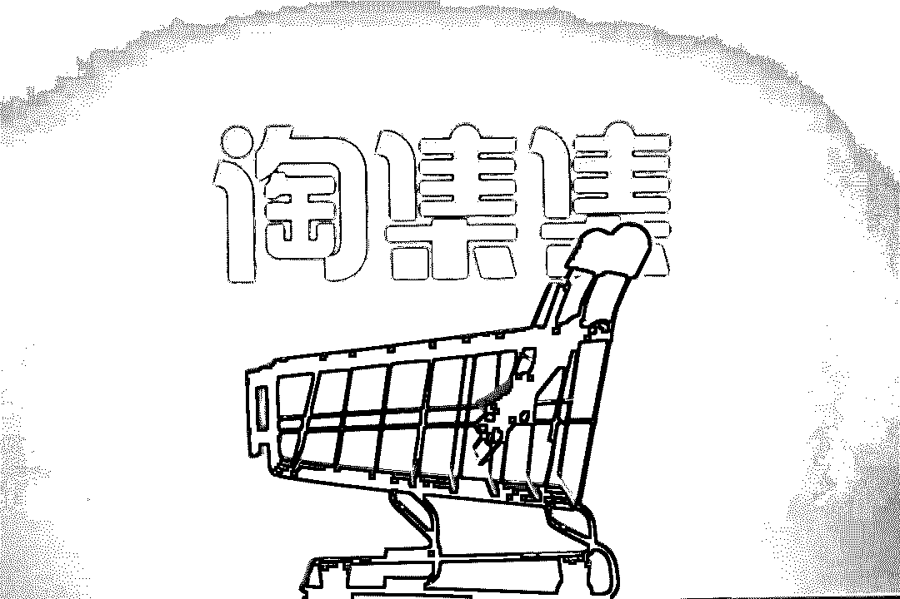
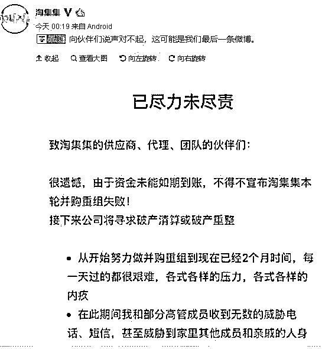
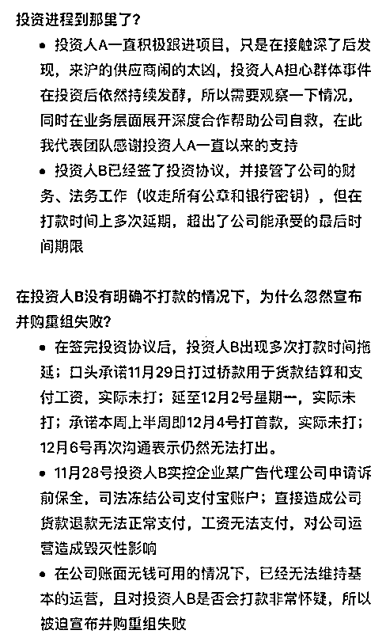
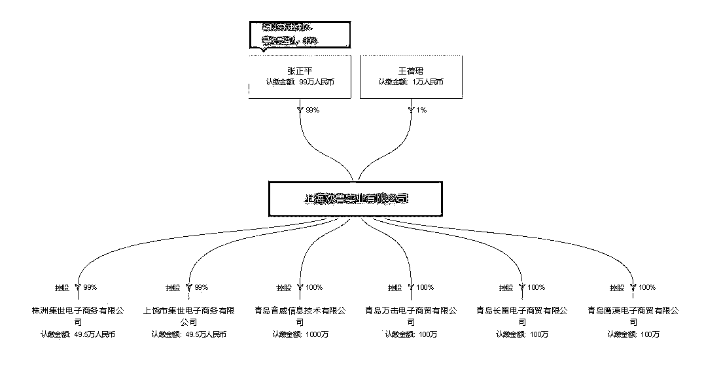
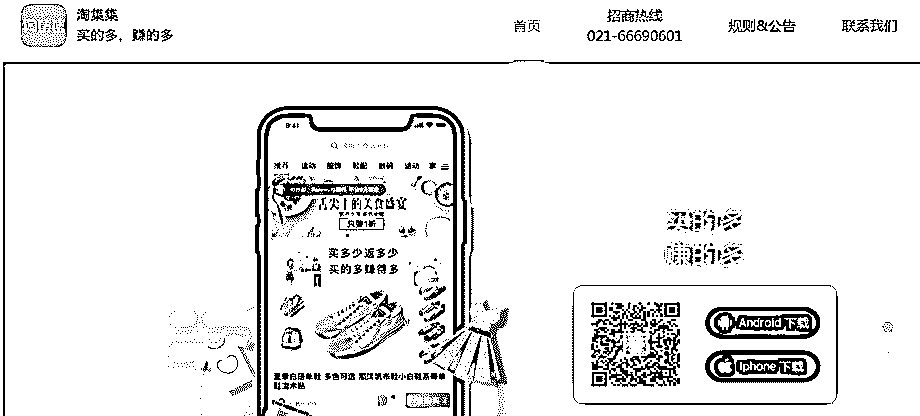
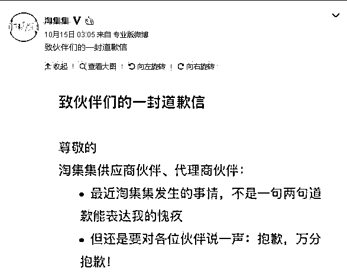
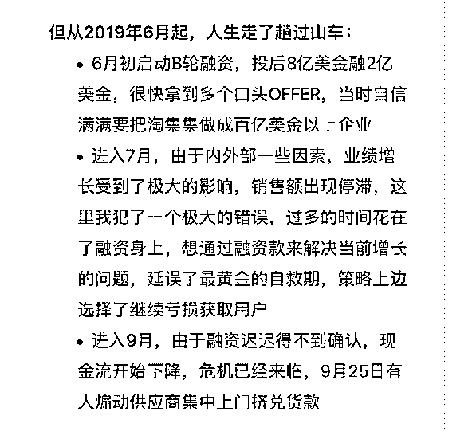
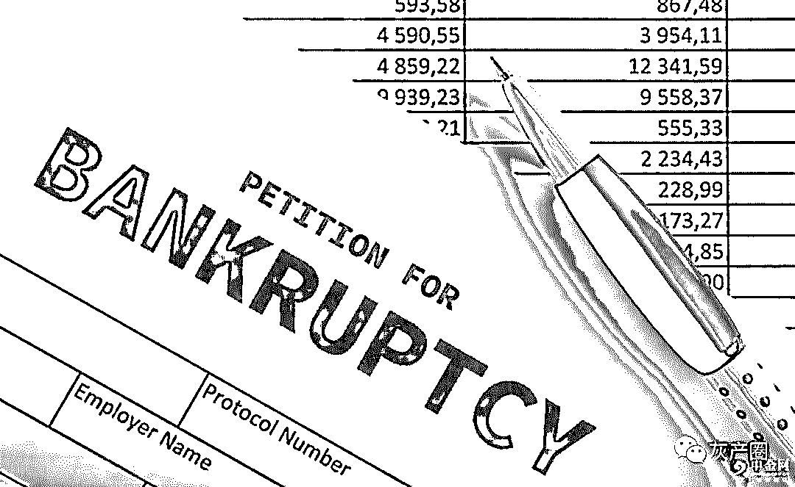
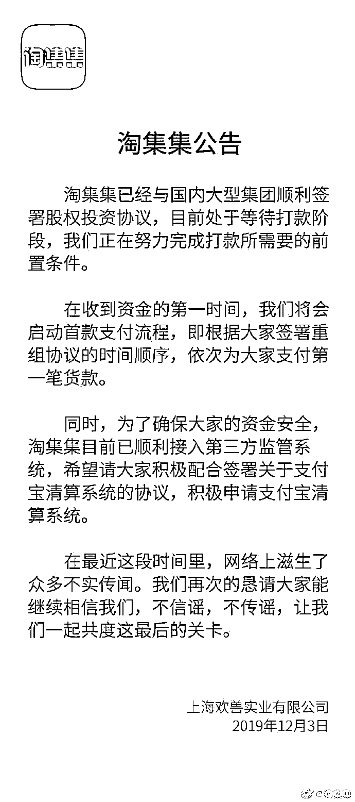
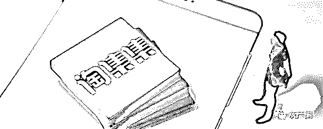

# “淘集集”全剧终：一年烧光 20 亿！收割 1.3 亿用户！如今负债 16 亿！

> 原文：[`mp.weixin.qq.com/s?__biz=MzIyMDYwMTk0Mw==&mid=2247496840&idx=1&sn=7f364214e6667c25b67d19fe933d62b4&chksm=97cb3fb0a0bcb6a61bdc610744cc575541e7973bbbdc3f75e51a0343cd0a9e780a352f3c1974&scene=27#wechat_redirect`](http://mp.weixin.qq.com/s?__biz=MzIyMDYwMTk0Mw==&mid=2247496840&idx=1&sn=7f364214e6667c25b67d19fe933d62b4&chksm=97cb3fb0a0bcb6a61bdc610744cc575541e7973bbbdc3f75e51a0343cd0a9e780a352f3c1974&scene=27#wechat_redirect)

**点击上方蓝色字体免费订阅“灰产圈”**

导语

挣扎数月的淘集集最终还是回天乏术.

淘集集并购重组最终失败，供应商何时能拿到被拖欠的货款仍然遥遥无期。

这家主打比“拼多多”更下沉市场的社交电商平台上线仅半年就积累了 1 亿用户，月活数千万。而同样主打拼购的电商平台拼多多，自 2018 年 7 月上市以来，如今市值已超过 400 亿美金，风光无两。为什么淘集集却走向失败？

创始人张正平宣告淘集集破产

12 月 9 日凌晨，电商拼购平台淘集集发布公告，称由于资金未能如期到账，不得不宣布淘集集本轮并购重组失败，公司接下来将寻求破产清算或破产重组。

淘集集 CEO 张正平在这份《已尽力未尽责》的公告中透露了，接下来淘集集破产清算或破产重整的处理思路：

1\. 破产重整。如果走破产重整路线，公司所有权将交给债权人，他将会积极联系供应商代表和大的广告代理商，以债转股和认购股份的形式将平台所有权转让给债权人，所得资金将全部用于公司运营，努力再次盘活平台。

2\. 破产清算。假如破产重整方案无法推进，淘集集将申请破产，张正平称他和团队会通过个人创业努力归还欠款。

在公告中，张正平透露，此次并购重组有两位潜在投资者，其中一位是某大型集团公司，另一位为某 PreIPO 公司牵头的基金公司。他表示，某大型集团公司存在担心，因此需要先观察情况；而另一位投资者已签署投资协议，并接管公司的财务、法务工作（收走所有公章和银行密匙），但在打款时间上多次延期，超出淘集集能承受的最后时间期限。

张正平表示，该投资人实控企业某广告代理公司申请诉前保全，司法冻结公司的支付宝账户，直接导致公司货款退款和工资无法正常支付，对公司运营造成毁灭性打击。“在公司账面无钱可用的情况下，已经无法维持基本的运营，且对投资人是否会打款非常怀疑，所以被迫宣布并购重组失败。”

对于员工的工资和社保发放，张正平表示 11 月工资已预留，但由于账户被冻结无法打出，又指如果公司正常破产清算，法律上将优先结算工资。

仅用一年时间收割 1.3 亿用户

天眼查数据显示，淘集集的运营主体为上海欢兽实业有限公司，成立时间为 2017 年 5 月，注册资本 100 万人民币，法定代表人为张正平，公司的最大股东也为张正平，持股比例 99%。

打着“买得多，赚得多”口号的淘集集，于 2018 年 8 月上线，其上线 2 周销售额就突破 200 万，当年 10 月就获得 A 轮融资，融资金额为 4200 万美元，估值达到 2.42 亿美元，9 个月月活即超过 4000 万。由于以低价商品走量为初期主战策略，淘集集被称为“下沉新贵”，有数据显示其与拼多多的用户重合度高达 55%，一度被视为社交电商领域的一匹黑马。

去年 8 月底，淘集集曾表示将派 5000 辆地推车进入小镇市场，手把手教用户使用，收割低线流量。

去年双十一前，淘集集还与拼多多发生疑似“二选一”之争，刚刚上线两个月的淘集集一跃成为众人焦点，此后还曾登顶 App Store 购物类免费榜第一。

打开淘集集，首页上涵盖了以拼多多和云集为代表的主流电商增长方式，包括一元拼团、限时秒杀、补贴拼购等，通过低价来完成客户转化，补贴和低价的力度甚至比拼多多还疯狂。

为了完成社交关系链的裂变，淘集集还设计了一整套“现金补贴+分销返利”体系。除了用户购买获得返现外，邀请好友下单，也可累积获得 5 次最高 25.5 元的返现，这与云集的分销式裂变有一定的相似之处。

淘集集曾宣称，只用接近一年时间获得 1.36 亿用户，比拼多多少用了 10 个月左右。张正平一度希望复制拼多多的成功，甚至能超越拼多多。

激进“烧钱”，负债 16 亿

不过，激进的烧钱获客方式让淘集集背负了巨大的资金压力。

今年 10 月，张正平在致伙伴们的道歉信中说：

“从 2019 年 6 月起，人生走了趟过山车。6 月初启动 B 轮融资，投后 8 亿美金融 2 亿美金，很快拿到了多个口头 OFFER，当时自信满满要把淘集集做成百亿美金以上企业。进入 7 月，由于内外部一些因素，业绩增长受到了极大的影响，销售额出现停滞，这里我犯了一个极大的错误，想通过融资款来解决当前增长的问题，延误了最黄金的自救期，策略上边选择了继续亏损获取用户。进入 9 月，由于融资迟迟得不到确认，现金流开始下降，危机已经来临，9 月 25 日有人煽动供应商集中上门挤兑货款。”

正如张正平自己所述，由于融资不顺，数千家平台商家的货款和保证金，被淘集集挪用于市场增长费用，拉新增用户。按照淘集集的计划，如果用户数量增速上去了，投资方的资金到账，正好可以弥补所挪用的商家货款。但这种做法引起平台供应商的极度不满，最终引发 9 月底到 10 月的商家上门讨要欠款的爆雷风波。

今年以来，淘集集已经亏损近 12 亿元，上半年净亏 6 亿元，净资产负 6 亿元，目前每月亏损超 2 亿元。公司负债总额为 16 亿元左右。

超 2000 户商家"踩雷"

复盘淘集集破产之路

面对危机，张正平及淘集集在努力寻求并购重组来“自救”，将并购款用于归还欠款，以避免公司直接清算。

今年 9 月，由于“说好的”新一轮资本方“放了鸽子”，淘集集被曝疑似资金链断裂，引发商家惶恐。

10 月，淘集集发布公告称，将与国内大型机构进行业务重组，其主要经营模式将由商家入驻模式调整为合伙人自营模式，这意味着现有主要供应商转为淘集集股东合伙人。从媒体报道上看，该声明遭到部分商家抵制。

10 月 15 日凌晨 3 点，淘集集创始人张正平在微博发布了“致伙伴们的一封道歉信”。

他表示，进入 7 月，由于内外部一些因素，公司业绩增长受到了极大的影响，销售额出现停滞。这里我犯了一个极大的错误，过多的时间花在了融资身上，想通过融资款来解决当前增长的问题，延误了最黄金的自救期，策略上选择了继续亏损获取用户。”

 “我还有近 70 万压在淘集集里，可以说是这几年来全部的积蓄了。来回上海几趟，呆了四天，去总部要说法也没有结果。除了客服登记外，重组的协议签不签意义已经不大了。”一名来自广州的商家在接受 21Tech 采访时，对于社交电商平台淘集集的做法深感愤恨。

他质问，平台积压着近四个月的货款加商家保证金去哪儿了？

与他有着类似遭遇的商家超过数千家，温州电商私圈创始人马凯跃告诉 21Tech，仅在温州区域内，遭遇损失的商家数量超过了 2000 家，大多数拖欠资金在 10 万-50 万元不等，也有很多超过百万。粗略判断，除了商家欠款，再加上供应商和代理商等层面的欠款，淘集集的资金缺口或超过 20 亿元。

这可能是一个无底洞。

10 月中旬，“淘集集每月亏两亿”的消息曾登上热搜，张正平发道歉信呼吁商家支持淘集集重组，不要对公司起诉，避免“血汗钱颗粒无回”。

10 月 16 日，上百名商家与淘集集达成和解协议：淘集集将资金交由第三方监管，商家同意签订“债转股”的协议。

10 月 31 日，淘集集通报说：并购重组进展顺利。

12 月 3 日，淘集集宣布已与国内大型集团顺利签署股权投资协议，正处于等待打款阶段。当时淘集集表示，在收到资金后，公司将会启动首款支付流程，根据供应商签署重组协议的时间顺序，依次为供应商支付第一笔贷款。

6 天后，淘集集最终宣布破产。

永远不要抄袭，抄袭是失败的开始

学我者生，似我者死，这是齐白石说的一句话。意思是，向我学习的人可能会成功，但是模仿或抄袭我的人一定会失败。

作为中国下沉电商的徒弟和师父，淘集集想方设法地模仿拼多多，不仅界面设计看不出分别，而且从名称到打法都极为类似。

拼多多用 ABB 模式起名，徒弟跟着起了一个淘集集；师父用社交裂变、用烧钱大杀四方，徒弟依葫芦画瓢。

打开淘集集首页，你会发现它简直活成了拼多多的一个高仿号，在他的主页上，几乎囊括了师父的所有版块和玩法。

然而淘集集忘记了自己的身份，在拼多多背后，站着的是中国互联网的一座高山腾讯，是在商海纵横多年、资金人脉都不缺的段永平，是网易的丁磊和淘宝网的创始人孙彤宇。

而淘集集背后，空空如也。

创始人张正平原来是做电商代运营的，做了几年后自己创业，建了一个“闪电特价”网站，就是淘集集的前身。这意味着，淘集集没有任何靠山和背景，在这种情况下，如果仍然一昧模仿抄袭别人，而不主动创新模式，那么它的路只会越走越窄。

战国时期，燕国有个少年听说赵国人走路的姿势特别优美，于是不顾一切跑到邯郸模仿当地人走路。结果，他不仅没有学会邯郸人走路，还把自己原来的姿势也忘了，最后回不去了。

这个邯郸学步的典故正好预言了淘集集的命运：模仿与抄袭是失败的开始。

**淘集集的诞生与失败，见证了下沉市场已从繁荣红火到人人自危**，没有造血能力的产品，看似繁荣的流量数据，实则是空中楼阁。

[`v.qq.com/iframe/preview.html?vid=h30323ms7sn&auto=0`](https://v.qq.com/iframe/preview.html?vid=h30323ms7sn&auto=0)

**《淘集集宣告破产：数百员工突然失业 债主上门围堵》**

[拒绝信息“裸奔”！这期《明星大侦探》揭开了“个人信息泄漏”的背后黑产](https://mp.weixin.qq.com/s?__biz=MzIyMDYwMTk0Mw==&mid=2247496836&idx=1&sn=398758f161a1ce94228b200fead581bb&chksm=97cb3fbca0bcb6aa461bfbd005e67ce5a7e7b88a27d4744fee86cfc542471c004ceeeea2a070&scene=21#wechat_redirect)[最全原始股攻略，看懂了，拙劣的原始股骗局一眼看破！](https://mp.weixin.qq.com/s?__biz=MzIyMDYwMTk0Mw==&mid=2247496836&idx=2&sn=f2bc87bfcbfe2134b8dcef70f909c0be&chksm=97cb3fbca0bcb6aae6f67dc33d3e6529a405d3f41df0a8f601440fb62d57c7332604b878399d&scene=21#wechat_redirect)[你买不到的酒，黄牛都有](https://mp.weixin.qq.com/s?__biz=MzIyMDYwMTk0Mw==&mid=2247496827&idx=2&sn=41f3a1c99795889d2094855a3291b159&chksm=97cb3f43a0bcb6558ccacb5a8cce1ebac9d245571a00cc92bef0a72f415b6a859a809f518c90&scene=21#wechat_redirect)[精神控制、催眠同化、传销敛财…深圳警方打掉的全国首个“教练技术”组织有多可怕](https://mp.weixin.qq.com/s?__biz=MzIyMDYwMTk0Mw==&mid=2247496827&idx=1&sn=83068193b60d2885ee58f6b1022f20c3&chksm=97cb3f43a0bcb65563366689c1f57666622685966a92ab397883bfe13ba116c7610bd08efddf&scene=21#wechat_redirect)[AG 才是网赌界的硬核朋克!](https://mp.weixin.qq.com/s?__biz=MzIyMDYwMTk0Mw==&mid=2247496824&idx=1&sn=3a0c649e1aa072f78889052fc9afd8bc&chksm=97cb3f40a0bcb6569c6739c5166644380a69e4ac6543652a17ac16d21a5f6a4eaf11a8c008ad&scene=21#wechat_redirect)

← 向右滑动与灰产圈互动交流 →

**阅读原文加入灰产圈高端社群**