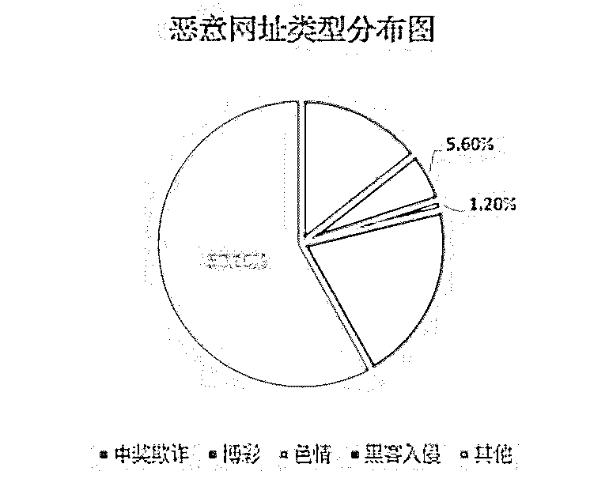
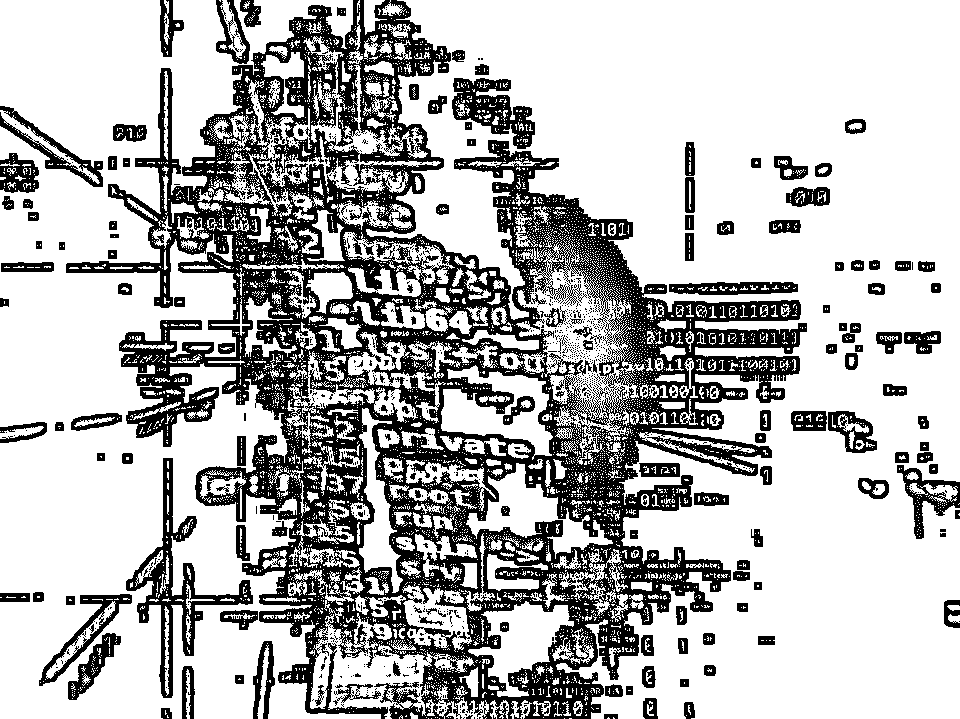
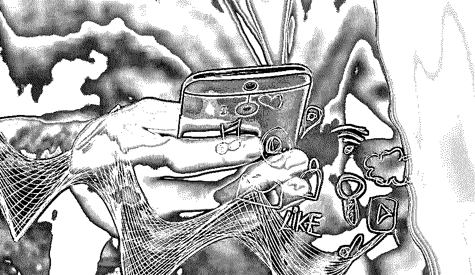
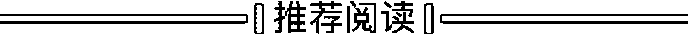

# 拒绝信息“裸奔”！这期《明星大侦探》揭开了“个人信息泄漏”的背后黑产

> 原文：[`mp.weixin.qq.com/s?__biz=MzIyMDYwMTk0Mw==&mid=2247496836&idx=1&sn=398758f161a1ce94228b200fead581bb&chksm=97cb3fbca0bcb6aa461bfbd005e67ce5a7e7b88a27d4744fee86cfc542471c004ceeeea2a070&scene=27#wechat_redirect`](http://mp.weixin.qq.com/s?__biz=MzIyMDYwMTk0Mw==&mid=2247496836&idx=1&sn=398758f161a1ce94228b200fead581bb&chksm=97cb3fbca0bcb6aa461bfbd005e67ce5a7e7b88a27d4744fee86cfc542471c004ceeeea2a070&scene=27#wechat_redirect)

**点击上方蓝色字体免费订阅“灰产圈”**

00

要说起近年来最火热的综艺，**《明星大侦探》**一定榜上有名。这是一档推理型真人秀节目，一直以“烧脑”著称，自 2016 年开播以来，深受观众喜爱。
不过，这款节目能持续走红的原因还因为它每期都会关注一个时事主题，以幽默搞笑的方式来真实反映社会问题。在最新一期的公益特刊中，节目就聚焦到了互联网时代的“**个人信息泄漏**“话题，引起了网友们的热烈讨论。

01

在节目中，“贾名牌”将针孔摄像头暗藏在“甄行”家中的 WIFI 设备上，进行偷拍窃取对方的**生活信息**。同时，她以开保险柜为名义，盗用了何房的身份证等**身份信息**进行网络借贷，导致对方欠下了巨款网贷。蓉 3C 在帮助他人修手机的过程中，盗取**手机中的关键信息**，实施敲诈勒索。而奶茶店老板侯侯喝，更是以加入会员、办理优惠卡的名义，公然收集顾客的个人信息，**再以 50 元一条的价格贩卖给不法团伙**，累计获利超千万。在最新一期《明星大侦探》的节目中列举的这些涉及信息泄露的案例，都可能真实的发生在我们每个人身上。随着科技的发展和移动应用的普及，互联网在日益便捷我们生活的同时，安全问题也越发凸显。

> 2019 年，国家网络安全宣传周发布的《2019 年网民网络安全感满意度调查活动总报告》显示，一半以上网民在网络生活中遇到过侵犯个人信息的行为。2018 年，中国消费者协会发布了 “APP 个人信息泄露情况”问卷调查报告，数据显示，我国个人信息泄漏总体情况比较严重，8 成以上的用户都曾经遭遇过个人信息泄漏。

在网络空间，年龄、姓名、身份证、家庭住址等在内的基本信息，所使用的各种移动或固定的终端设备信息，网银帐号、第三方支付帐号，社交帐号和重要邮箱等账号信息，通讯录、通话短信记录、聊天记录、个人照片等隐私信息，以及社会关系信息和网络行为信息，而这所有的个人信息都可能被不法分子利用各种方式进行窃取和滥用。11 月 29 日，央视的**《焦点访谈》**节目也就“信息泄漏”问题采访了腾讯安全云鼎实验室的专家。

[`mp.weixin.qq.com/mp/readtemplate?t=pages/video_player_tmpl&action=mpvideo&auto=0&vid=wxv_1106544340303839233`](https://mp.weixin.qq.com/mp/readtemplate?t=pages/video_player_tmpl&action=mpvideo&auto=0&vid=wxv_1106544340303839233)

当下的手机 APP 使用极为方便，用户对其依赖性也很高，但是，这些手机 APP 在下载使用时，都会要求用户先进行授权。在这期节目中，**腾讯安全云鼎实验室总监董志强**就介绍称，一些非法 APP 存在的过度要求权限等技术霸凌行为，可能导致隐私泄露，甚至造成用户财产损失。

02

那除了以上所列举的这些泄漏渠道外，我们的个人信息还可能通过什么渠道外泄呢？在**腾讯手机管家联合腾讯安全联合实验室移动安全实验室发布的《2018 年手机安全报告》**报告中显示，非法利用技术手段盗取个人信息的主要有以下三大风险因素。

*   ***1、恶意网站***

恶意网站又被称为“钓鱼网站”，一般会伪装成“色情”或“博彩”类的名义来诱导用户访问。当用户登陆网站后，会被要求填写自己的个人信息或授权使用其他帐号登陆，从而带来帐号密码丢失或隐私信息泄漏等威胁。

*   ***2、木马病毒***

木马病毒多半是通过“后台侵入”的形式植入用户的设备，常见的方式是伪装成正规 APP 引诱用户下载。当你发现手机频繁出现广告弹窗时，就很可能是感染了木马病毒。当病毒入侵后，不法分子就可以在神不知鬼不觉中获取你的信息。

*   ***3、风险 WiFi***

如今的公共场所，一般都会设置 WiFi 热点，但这也给了不法分子可乘之机。他们会在人流量较大的地方搭设风险 WiFi，以免费的形式诱导用户链接。而一旦用户使用后，就可能被植入准备好的木马病毒，给隐私安全和财产安全带来隐患。而在局域网的环境内，若有一台设备感染木马，还可能造成大范围的信息泄漏。

除此之外，生活当中不注重个人隐私信息保护的行为，例如**有个人信息的快递单、身份证复印件等文件未妥善处理、习惯性将自己的个人信息晒到网上**等行为也可能造成信息泄漏。

03

根据中国消费者协会的调查结果，当消费者个人信息泄露后，约**86.5%**的受访者曾收到推销电话或短信的骚扰，约**75.0%**的受访者接到诈骗电话，约**63.4%**的受访者收到垃圾邮件。此外，部分受访者曾收到违法信息如非法链接等，更有甚者出现个人账户密码被盗的问题，而还仅是信息泄漏后可能导致的一小部分危害。因为个人信息泄露，**藏身于骚扰信息中的电信网络诈骗呈现出精准化的特征，导致用户在接到包含个人准确信息的短信或电话时更容易中招。**那我们究竟应该怎样保护自己的个人信息呢？首先，我们在生活中要养成保护个人隐私信息的好习惯。

①、不扫来历不明的二维码，不填写未经核实的问卷；

②、定期检查异样支付记录，养成经常修改密码的习惯；

③、在发送证件电子档时，需加上水印，并注明提供机构及用途；

④、谨慎向陌生人展示五官清晰的个人面部照片；

⑤、谨慎在社交平台公开个人定位、家庭住址、行动计划等隐私信息；

⑥、谨慎将高度隐私的个人信息通过网络云储存或分享。

同时，也要注重保护电脑、手机等设备的安全问题。一来，提升保护个人信息安全的意识，从官方正规渠道下载应用、不观看非法违规的网站、不点击来路不明的陌生链接；

二来，养成养成使用安全软件进行防护的习惯，屏蔽移动端风险，例如，可以使用**腾讯手机管家**查杀拦截木马病毒软件和欺诈网址。

**来源：守护者计划**

[起底弹窗广告黑色产业链：2 万元发 100 万次弹窗 12 月 4 日](https://mp.weixin.qq.com/s?__biz=MzIyMDYwMTk0Mw==&mid=2247496815&idx=2&sn=9dffc0cdebc6a7b51f3fa73c489c3045&chksm=97cb3f57a0bcb641ef34b408ab0a94dbf6a399e230cee5b0f57bfdafad90b5baa84abb2a42c0&scene=21#wechat_redirect)[21 岁日本女星惨遭猥亵，只因自拍瞳孔倒影暴露住址？|一张照片是怎么出卖你的！](https://mp.weixin.qq.com/s?__biz=MzIyMDYwMTk0Mw==&mid=2247496815&idx=1&sn=1057a776b031678930027d7efa706fc2&chksm=97cb3f57a0bcb6419ea1276e3dc752279d6a9f8a0f82b0f26c4ffec31477cb8af470b2fdded3&scene=21#wechat_redirect)[起底“网赌”内幕，利用非法涉赌软件发展下线，数月谋利超亿元！](https://mp.weixin.qq.com/s?__biz=MzIyMDYwMTk0Mw==&mid=2247496813&idx=2&sn=497ff34c736e8fec8a8d17fb120533cc&chksm=97cb3f55a0bcb64350d6a01f365751668784fd356b50afc2b3e4c18a583d5879542a5ac51ab3&scene=21#wechat_redirect)[尝试了 108 种方法，我从 ofo 要回了押金](https://mp.weixin.qq.com/s?__biz=MzIyMDYwMTk0Mw==&mid=2247496813&idx=3&sn=c00a766241370e63c2ed8cd47df540ae&chksm=97cb3f55a0bcb6439600ebd6e0405e552808585dd6fb24fc3ddf3b8c1e7241f6f7fc2fdd20a1&scene=21#wechat_redirect)[你身边也许有人在帮黑产洗钱！](https://mp.weixin.qq.com/s?__biz=MzIyMDYwMTk0Mw==&mid=2247496813&idx=1&sn=aa1f812fce4287b2f018a6ddff42d51c&chksm=97cb3f55a0bcb6439dd5d5c4e0cdbeef86cb9fab56a76a38134cf1187915bbd55dc41016b28b&scene=21#wechat_redirect)

← 向右滑动与灰产圈互动交流 →

**阅读原文加入灰产圈高端社群**