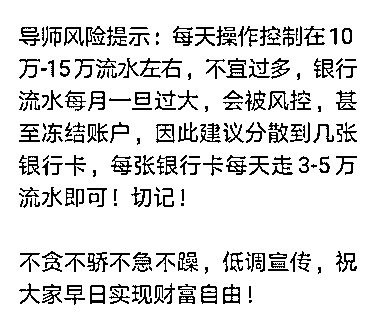

# 你身边也许有人在帮黑产洗钱！

> 原文：[`mp.weixin.qq.com/s?__biz=MzIyMDYwMTk0Mw==&mid=2247496813&idx=1&sn=aa1f812fce4287b2f018a6ddff42d51c&chksm=97cb3f55a0bcb6439dd5d5c4e0cdbeef86cb9fab56a76a38134cf1187915bbd55dc41016b28b&scene=27#wechat_redirect`](http://mp.weixin.qq.com/s?__biz=MzIyMDYwMTk0Mw==&mid=2247496813&idx=1&sn=aa1f812fce4287b2f018a6ddff42d51c&chksm=97cb3f55a0bcb6439dd5d5c4e0cdbeef86cb9fab56a76a38134cf1187915bbd55dc41016b28b&scene=27#wechat_redirect)

**点击上方蓝色字体免费订阅“灰产圈”**

00

我曾经问个不休，坏人何其多？隔三差五就有受害者前来求助。我打开知乎私信，有赌博发了财，却提不出来钱的：

刚送走一个，又来了写下**血泪控诉书**以警示他人的：

还有打算秀操作**残血反杀**骗子的：

我终于生无可恋，放下手机去睡觉，又被一条微信消息震醒：

更多的我就不放了。哎，说好的人与之间的信任呢？为什么满世界都是骗子？为什么！

但经过无数个求助者的洗礼，我最终还是发现了一个真相：

网络犯罪之所以生生不息，其中一个重要原因是**许多不明真相的吃瓜群众被黑产忽悠****，为网络犯罪输送弹药，打辅助。**

**之所以我这么说，是因为前阵子有个大学生找过来求助，这里不方便暴露 ID，就叫他小北吧。**

**小北说，他有个初中同学是专门收银行卡的，前阵子联系他收购银行卡、手机卡和 U 盾，一套 200 元，说正在做淘宝刷单用。**

**小北心想反正自己也没啥损失，就跟几个舍友一起新注册了银行卡、手机卡和 U 盾并邮了过去。**

**可没过几天，初中同学又问他要身份证，说是没身份证，那些银行卡就用不了。**

**小北觉得哪里不太对，上网一搜才知道对方有可能根本不是刷单。**

****

****小北和本幺的对话****

**“要是他拿去干违法犯罪的事，被抓，我会不会被牵扯进去？”**

**“要去警方报案吗？”**

**“可如果证据不足怎么办？需不需要银行流水单之类的？”**

**在小北同学的三连问下，我有点懵。**

**虽然幺哥之前也知道一些关于四件套和网络洗钱的事，但不了解细节。于是，我就带着一些问题，抽空找了个老司机朋友带路。**

**没想到这一问，还问出许多关于互联网洗钱的趣事。**

****Let's Rock!****

**01**

**“绝不可会只是电商刷单，给赌博网站用的可能性最大，其次是色情网站和诈骗团伙。不过……黄赌骗这三样本来也经常不分家。”**

**羊肉串在火焰的烘烤下滋滋往外冒油，雷 Sir 撸完一串，继续和我聊。**

**“你知道水房吗？”**

**“水房就是专门给诈骗洗钱的吗？之前听过。”我说。** 

**“是的，不过最近升级了”**

**“水房升级……成了……开水房?”**

****

**-_-|| 雷 Sir 伸手擦了擦额头的黑线-_-，说：“网络赌博、色情、诈骗，最终目的就是搞钱，**水房**是专门帮他们收钱、洗钱的组织，官方称谓是**非法结算平台****，以前是的水房以银行卡洗钱为主，现在很多都改用网上支付了。****”****

**雷 Sir 之前在公安系统工作，主要任务是抓坏人，三年前加入了腾讯守护者计划团队，虽然职责还是抓坏人，但方式有些改变。**

**以前是搜集证据，抓人，现在则是先定向摸清黑产的手法，翻译成程序员小哥能听懂的话，再编写成代码，“喂”给微信支付的智能风控模型吃。**

**“我现在就是个翻译机。” 雷 Sir 说，他上个一阶段的工作重点就是打击**非法结算平台**。**

**“坏人随便找些卡收收钱就行了，怎么还成‘平台’了呢，都这么专业嘛？” 我问。**

**雷 Sir 反问：**

****“现在假如你就是网络赌场老板，想收赌客的钱，怎么收？****

**用自己的银行账户和微信、支付宝收账？分分钟警察上门送手铐，稍微不蠢的都晓得要拿别人的账号来收账，出了事儿找个替死鬼，对吧？**

**一个产业成熟的标志是分工细化，黑产也一样，慢慢地就有人专门只负责这一环，给非法网络活动提供支持，也就形成了非法结算平台。”**

**具体怎么做的呢？**

**“他们从民间收来一大堆收款账户，也许是银行账号，也许是第三方支付账号比比如支付宝、微信，挂在一个赌博网站里，赌客充值时直接打钱进去，非法支付平台收到钱以后，抽走一部分手续费，再把剩下的钱转给赌博网站。**

**如此一来，赌客和赌博网站之间就有了“跳板”（吃瓜群众的账户），完成洗白。当然，实际情况可能复杂得多，比如涉及到资金的拆分、合并等伪装，避开风控之类的。”**

**雷 Sir 说，**干非法结算的技术含量都比较高，现在不少平台明面上从事****第四方支付****，暗地里却干非法结算的勾当，因为来钱快。****

**“等等，第四方支付又是个啥？能给我翻译翻译吗？”我问。**

**雷 Sir 递过来一串腰子，开始给我上课。**

**“我给你个东西，你给我钞票，这就是**第一方支付，**很好理解。**

**如果你不想直接给我钱，也可以让银行在我账上记一笔收入，在你账上记一笔支出，这就是**第二方支付**，银行是第二方，负责结算。**

****第三方支付**呢，当然就是像微信支付、支付宝这样的大型网络支付平台，它们的钱最终其实也是存在银行账户里的。**

**也就是说，第三、第二、第一方支付像堆积木一样，每一层都建立在上一层之上的。**

**而第四方支付，正是搭建在第三方支付之上。**

**“怎么个搭建法儿呢？”我问。 **

**雷 Sir 刚要说，手机响了，趁着他回电话的空隙，我走到收银台打算买单，发现柜台上摆着一个聚合支付的二维码扫描器，支付宝、微信、银联都能扫的那种。**

****

****有点类似这种**** 

**02**

**等雷 Sir 打完电话我就问他：“这种聚合支付不就是搭建在第三方支付之上的第四方支付吗？”**

****雷 Sir 说：“是滴，这个是第四方支付的一种，把不同的支付码整合在一起了，不过聚合支付的功能、技术比较前沿，一不留神就被坏人用成非法结算了。”****

**比如今年九月份的这个案子：**

****

****图片截取自新浪网财经**** 

**怎么区分一个聚合平台是否违法呢？**

**“这个你到时候写文章一定要给读者讲清楚了！”**

**雷 Sir 告诉我，**一个****聚合支付平台是否违法的关键点在于是否从事了结算业务，****简单点说就是有没有“截留资金”**。**

**“假设你是个商家，觉得弄很多收款码太麻烦，就可以找聚合支付公司帮你跑腿，他们会拿着你的商户资料去各个支付机构申请账户，然后用技术手段把各家的二维码接在一起。**

**如果把钱比作水，聚合支付就是帮你接上水管子，不会碰里面的水（资金流），接好之后，你给他付服务费，因为帮你提升了用户体验，节省了时间。**

** **

****聚合支付平台不碰客户的钱****

**但非法结算平台就不同了，客户不需要提供商户资料，而直接使用平台自己手里的商户来收钱，先从中直接抽走手续费，才转到客户的账户里。”**

** **

****非法结算平台在中间截流**** 

**雷 Sir 告诉我，非法结算平台洗钱的关键点两个：一、搞到账户，二、伪装交易（躲过风控系统的识别）。**

**最初，非法结算平台平台主要是向一些经济不太好的人收购他们的支付账户，后来干脆直接收购个人的“四件套”和企业的“八件套”（企业资质材料），然后代他们申请账户。**

**这样一来是效率更高，二来是因为一套资料可以在多个平台申请账户。**

**各家的风控系统并不相同，微信支付、支付宝、银联支付、平安支付、百度钱包 … … 一个平台封掉账号，还能拿去另一个平台重来一遍。哪个蛋有缝，苍蝇就嗡嗡而至。**

**这些四件套不仅能用来注册支付平台的账户，**还能用来注册一些平常人根本不会料想到跟洗钱有关的平台。****

**“比如发卡平台，就是那种专门卖游戏点卡、电话充值卡等虚拟商品的平台，洗钱平台直接利用它们把赃款买成一张张游戏、电话充值卡，再卖掉，这样黑钱就被洗白了。”  雷 Sir 说。 **

**** 

****2016 年某自动发卡平台的公告****

**雷 Sir 的一番话，倒是让我想起前一阵子媒体曝光**某著名电商平台**被被黑产利用来洗钱的事了。**

**陪大家复习一下，黑产当时洗钱的大致流程是这样的：**

**先拿收购来的四件套资料，在电商平台上开个店，发布一些看起来挺正常的商品，假装购买和发货，再把付款链接转换成二维码，放在赌博网站里。**

****赌徒充值赌资时，直接扫码，在电商平台买了个等价的商品**。如此一来，就把充值的行为变成了一个电商购买行为，绕过了第三方支付的风控系统。**

**一个麻烦的问题来了，这事儿到底是谁的锅呢？**

**站在电商平台的角度，鉴别必须得依靠支付系统的风控数据，所以是支付机构的责任。**

**站在支付机构的角度，这明明是电商平台的合法商户，看起来也是挺正常的买买买，要是风控规则卡得太严，势必带来大量误伤，那以后咱们还做不做生意了？**

**于是，就在双方纠结到底谁来接这颗球的时候，黑产队又得一分。**

**雷 Sir 说，“这并不是某一家支付机构和电商平台的问题，任何一家公司，只要有资金对外进出，都可能被利用。”**

**昨天是发卡平台，今天是电商，明天说不定就是网络游戏、直播平台、虚拟货币交易所… … 哪儿出现口子，黑产就蜂拥而至，所以谁都没法完全置身事外。”**

**03**

**“还有一种最新操作，叫跑分平台，不知道你听过没？” 雷 Sir 问我。**

**我：“跑分？不服跑个分？Are you OK?”**

**雷 Sir：“不是内个跑分……-_-||”**

**雷 Sir 告诉我，跑分平台是一种去年新流行起来的洗钱模式，它不需要参与者提供银行卡、四件套和任何账户，只需要提供一个收款码，或银行卡号。**

**由于方式灵活，又打着日赚 XXXX 元、在家兼职等的赚钱幌子，参与者众多。**

****

****图片来自知乎用户@图南**** 

**大致流程是这样的：**

**你把收款码或银行卡号给跑分平台，跑分平台就拿给赌博网站或是诈骗团伙收钱用。**

**钱到你账上之后，你拿走约定好的佣金，剩下的返还给平台。**

**当然，实际情况下，跑分平台为了防止参与者黑吃黑，收了钱不肯给，所以要求参与者先交一定金额的押金，一般是一千到三万不等，然后直接用代收款的钱来抵。**

**说起来，跑分平台有些“众包洗钱”的意思。** 

**而这恰恰是最让各大风控平台头疼的事 —— 每个参与洗钱的，都是一个个活生生的普通人，每天有很多笔正常的交易往来，一两笔黑钱掺和在里面，很难辨别。**

**正所谓“大隐隐于市，黑产深谙此道。**

**跑分平台另一个让人头疼的地方在于，即使风控系统辨别出来这些异常账号，取证和判罚也不容易 —— “法不责众”的问题总是让人头疼。**

**04**

**“你是说，那些卖掉自己收款码和四件套的人，并不会被抓吗？”我问雷 Sir，他说得看具体情况。**

**“如果参与者明确知道对方是在犯罪，那肯定是协助犯罪来算，**但实际情况是，很多时候跑分平台的参与者都在警方面前装傻**。”**

****

****

**“装傻，那怎么办呢？” 我问。**

**雷 Sir 说，“先抓团伙的关键人员，再抓代理人，一层一层往下来，最后再问责最底下的参与者，反正谁参与过，警方和平台其实都很清楚，只是看怎么处罚而已。”**

****

**“洗钱平台往往有一个庞大的网状结构。”** 

**他说，假设某个非法结算平台帮网络犯罪团伙洗钱，收 8%的手续费，那么它下面可能就有几个一级代理，收 6%手续费去干这事，每个一级代理下面又有几个二级代理，收 4%的费用……如此往复，最后到卖收款码的参与者手里，其实就只剩一点骨头渣子。**

**买卖四件套也是一样，一个大学生 200 块钱卖掉自己的资料，对方转手就以 500 元的价格再出手，然后是 800、1000……一遍遍转手。**

****信息差越大的地方，中间商往往就活的越滋润，而黑产链恰恰是一个信息沟壑大到能开船的地方。**于是，最底下的参与者为了一点蝇头小利，承担着巨大的风险，养着整个非法结算平台和代理商们。**

**“非法结算平台的策划团队和底下的代理都是直接走刑事处罚的，比如收集四件套的，达到一定数量就可以用侵犯公民个人信息罪来量刑。”**

**雷 Sir 掏出手机给我看一条新闻，说：“你看这个案子，一伙人大量收集银行卡，涉及 83 件诈骗案，被端以后就是用‘妨碍信用卡管理罪’判的刑。**

****

****雷 Sir 给我看的新闻****

**咦？为啥罪名是“妨碍信用卡管理罪”，而不是判诈骗共犯罪呢？**

**很无奈，因为完整的诈骗取证要求高，需要把受害者到诈骗犯的整个链条都找到，司法成本高，先找个别的罪名把坏人送进牢房也是个退而求其次的做法。**

**“ 不过这一切正在改变，国家司法机关这几年一直在发布新的司法解释，针对层出不穷的新型犯罪手法，明确定罪量刑标准。”**

****

**“你看，这是今年年初，最高人民法院、最高人民检察院发布的，专门针对非法结算、非法汇兑的司法解释。”**

**雷 Sir 又给我看另一条新闻：**

****

**“对于那些没法用刑事处罚的人怎么处理，解决方案是试着用行政处罚，目前各方都在讨论具体处置方法，肯定不能放过每个作恶的人。”**

**而对于微信支付、支付宝这样的平台来说，最常见也最直接的就是封号，或许封三天，也许一个月，也许是永久封号，一般是根据严重程度来进行**阶梯式判罚**。**

****

****图片来自知乎用户@图南****

**当然，其实雷 Sir 他们也知道，即便是永久封号，作恶者依然可以换个手机卡重新申请，但这已经是平台最大限度的处罚了。**

**“平台肯定还是得遵照法律法规来办，不能代替国家机关的职能”，雷 Sir 说，所以更多时候，他们是一个协助办案的角色，把用户举报的线索整理给警方，由警方出面打击犯罪。**

**05**

**雷 Sir：“讲真的，其实卖掉自己四件套、收款码这种的，如果对方只是拿来开个支付账户，被抓了来点行政处罚都已经算轻微的了，**真正可怕的其实是黑吃黑**。”**

**幺幺：“怎讲？”**

**雷 Sir：“你的资料一旦出去，经过几道手，每一环的人都干了什么，你根本就不知道，甚至买你资料的人也不知道他的下家会干什么。”**

**雷 Sir 吐了口烟，继续说：**

**“有可能拿去贷款，也有可能拿去诈骗，最终账户被冻结、信用受损、被警察找上门、留案底……都是参与者自己承担。**

**对方本来就是搞黑产的，对普通人来说，鱼龙混杂，这里头根本没有信誉可言。”**

**以跑分平台为例，大多数跑分平台因为担心参与者跑路，都要求交押金，于是就冒出很多假的跑分平台，收了几千块钱押金就拉黑，参与者也不敢报警举报，因为他自己也参与了违法行为。**

**还有些非法结算平台两头骗，这边骗来参与者的资料，另一边收到犯罪团伙的钱，可能是赌资，可能是诈骗所得，直接来个金蝉脱壳跑路。**

**雷 Sir 忽然凑近了过来，“**我跟你说个好玩的。**”**

****

**他说，如果你真的做非法结算平台，做到量级很大时，要跟东南亚的网络赌场合作，就得派一个人质去东南亚，看着，防止你黑吃黑。**

**有些赌场一天的流水几百万几千万甚至过亿的，有个人在他们那被控制着，才放心，这是必须的，赌场也怕非法结算平台在中间截胡跑路，大家都是互相堤防的。**

**06**

**我问雷 Sir，“跟黑产做对抗好玩吗？”**

**“累，真累，非常累。非法结算这两年发展很快，他们非常专业，既懂网络赌博、色情、诈骗的钱怎么收，又很勤奋，拼了命找市面上便宜又好用的收款通道在哪里，支付机构就整天上线新的风控模型防着他们，这么道高一尺，魔高一丈的来，身体不累心也累。” 雷 Sir 说。**

**“咦？你们的风控模型动不动就要更新吗？”我问。**

**“是啊，虽然现在我们连 AI 和机器学习都用上，砸了大量资源来核实账号身份和交易路径，但黑产也会千方百计想一些招数，来降低被识别的几率。”**

**最典型的，如果某个支付账号行为异常，比如一注册就大量资金涌入，就会触发支付机构的大数据风控系统，因为不符合一个正常用户的行为逻辑。**

**但骗子也会很快就找到了对抗方法。**

**他们申请账号以后先不跑量，每天模拟正常用户的行为模式，过一段时间再进行大批量收钱，这样就能降低被风控的概率。**

**雷 Sir 告诉我，目前无论是银行还是支付宝、微信支付之类的第三方支付平台，都有一套风控大脑，一般是人和机器结合。**

**“机器学习算法每天都在跑，识别正常和异常的资金流，我们每天也会用各种方法获取黑产情报，了解他们的套路，再针对性添加一条条对抗规则，或是把特征喂给算法，让风控系统自动获得相应的识别能力。”**

**“一个正常的商户的资金流变化是有商业规律的，如果某个账户不符，就会被风控平台怀疑。”**

**比如一个早餐铺全都是几百几百的收入支出，就非常可疑。**

**可是谁能料到，洗钱平台也会慢慢去摸索模型的判断规则，想出各种办法来模拟正常交易。**

****

****某跑分群里导师的风险提示**** 

**“真就是道高一尺魔高一丈，大家都试图站在最高点，好累哦我觉得，他们也累，我们也累。你说有这能力去做点好事不行？”**

**07**

**结束那场对话之后，我开始整理笔记开始写稿，很巧，又有一个大学生找过来求助，姑且就叫他小南吧。小南说是自己被一个红包返利的骗局给骗了几千块钱，几个月的生活费，现在不知道如何向家里交代。**

**他说，对方为了骗取他的信任，曾经发过手持身份证照片。**

** **

**哎，同学你可真无邪，骗子又不是傻子，怎么可能用自己的身份证，这根本不知道是从哪儿收来的四件套，而且还可能 PS 过。**

**小南给我发来骗子收款用的收款码，我扫进去，发现是个人收款码，也不知是骗子从哪个跑分平台上弄的收款码，这位叫某璐的人账上收到几千块钱时，是否想过这是一个学生几个月生活费。**

****

**被骗的小南和文章开头提到的小北的故事对照着看，就发现世界很魔幻，小南和小北两个都是大学生，一头给骗子打助攻，一头被骗子拐进网络赌场、色情 APP、网络骗局，形成一个犯罪闭环，自产自销。**

**这要是他俩正好是一个学校，还是一个宿舍的，那就更有戏剧化了，估计电视剧都不敢这么拍。**

**大家多半都听过这么个故事，讲世界总能形成一个奇妙的循环，男人打了妻子，妻子打了孩子，孩子踢了狗，狗窜到马路上干扰了司机，司机猛打方向盘，正好撞死出门上班的男人。**

**人总说善有善报，恶有恶报，但有人相信科学，觉得做了坏事遭雷劈那是迷信。可是别忘了，地球是圆，善恶也在其中循环，今天你为了两百块钱，给诈骗分子打了助攻，明天你的家人就可能接到骗子的电话。**

**抵制那种为网络犯罪打助攻的行为，不应该只是出于害怕被黑吃黑，而是应该理解一件事：大家其实都在一条船上，帮着坏人凿船，沉了，所有人都遭殃。**

**08**

**最后补充一个小事，我发现很多人被骗之后不知所措，甚至不敢报警，在这里我还是建议大家在第一时间报警。**

**同时，如果犯罪过程涉及到微信聊天和付款，就去小程序：腾讯 110 上举报一下，如果涉及到支付宝付款，去“支付宝举报中心”举报，其他平台类似。**

****骗子们在商业平台上活动，平台其实比谁都更想弄死他们，因为这直接影响了用户生态和信誉。****

**发文之前，我还特地找腾讯 110 的朋友聊了几句，发现之前通过腾讯 110 举报线索打掉的案子不少。**

**** 

**移动互联网大大提高了很多人的生活品质，让很多原本没怎么用过电脑的人也开始享受互联网带来的便利，世界触手可及。**

**但对于犯罪分子，猎物也更加触手可及。** 

**人们拿个手机就能参与网络赌博，轻松发车，随时随地接受骗子的智商洗礼。**

**《我不是药神》里的老太太说，你就能保证你一辈子不生病吗？放在当下语境，你就能保证这辈子遇不着一个比你精明的骗砸？** 

**犯罪分子们不会突然改邪归正，正与邪较量的最终走向，取决于我们每个人。**

**更多推荐****[薅羊毛、杀猪盘上游的“造号党”：微信号 400 元，探探女性账号 170 元！](https://mp.weixin.qq.com/s?__biz=MzIyMDYwMTk0Mw==&mid=2247496804&idx=1&sn=b0b9d47c0176cd0dbf8103799b09b3fd&chksm=97cb3f5ca0bcb64a5e57ce0e8f6f50e256749c599a744be2565df8dbbf9064b18bc278488566&scene=21#wechat_redirect)[刷个“戒赌”短视频，“回血”损失 300 万！](https://mp.weixin.qq.com/s?__biz=MzIyMDYwMTk0Mw==&mid=2247496804&idx=2&sn=bc48a1b045016b1fb6bfc691eb74e82a&chksm=97cb3f5ca0bcb64a16b68d32d06d290c9bc8dbe9891f78a5669ae6f65c98c4c89949f17662be&scene=21#wechat_redirect)[滴滴竟被“薅羊毛”？ 软件刷单，利用特权，非法套利，这波操作有点骚！](https://mp.weixin.qq.com/s?__biz=MzIyMDYwMTk0Mw==&mid=2247496789&idx=2&sn=439c1b471002c3ddefdccf047654fb61&chksm=97cb3f6da0bcb67b3dc298b03b9986239ce19406002461525716c84dc7a350a5f41878c073a3&scene=21#wechat_redirect)[靠“盗版”抖音连续霸榜 17 天，这款 App 都有哪些骚操作？](https://mp.weixin.qq.com/s?__biz=MzIyMDYwMTk0Mw==&mid=2247496789&idx=1&sn=7f19697883e8a7b88dab66408fc5402c&chksm=97cb3f6da0bcb67b9a2ccb5d122c7995591c7d2f170ea1c15342428e43d665171f0d4b3439ba&scene=21#wechat_redirect)[“水滴筹”黑幕！“扫楼”招募求助者，撰写故事，按单提成，月入过万，末位淘汰……](https://mp.weixin.qq.com/s?__biz=MzIyMDYwMTk0Mw==&mid=2247496778&idx=1&sn=c5583c52d5561abfc8f400c96bc79b53&chksm=97cb3f72a0bcb664fa13d9f39c6e587a003a23756590513ee8972ad1bd0a6ae4a857d924d8ee&scene=21#wechat_redirect)

← 向右滑动与灰产圈互动交流 →

**阅读原文加入灰产圈高端社群****