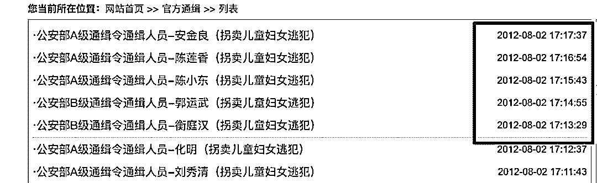

# 深度调查：人贩子“梅姨”身后嗜血的“寻人灰产”

> 原文：[`mp.weixin.qq.com/s?__biz=MzIyMDYwMTk0Mw==&mid=2247496759&idx=1&sn=29ca3c80d54f78ef1c839dc8abf01a38&chksm=97cb3f0fa0bcb619c160b093dba340423c7ae68cbbf0fe73dcbdc68ebc6ef65134768615b695&scene=27#wechat_redirect`](http://mp.weixin.qq.com/s?__biz=MzIyMDYwMTk0Mw==&mid=2247496759&idx=1&sn=29ca3c80d54f78ef1c839dc8abf01a38&chksm=97cb3f0fa0bcb619c160b093dba340423c7ae68cbbf0fe73dcbdc68ebc6ef65134768615b695&scene=27#wechat_redirect)

**点击上方蓝色字体免费订阅“灰产圈”**

前段时间出了一件大事，几乎全网都在传播一张“人贩子梅姨”的照片，热情网友义愤填膺纷纷转发，誓要把人贩子绳之以法。

但很快，广州公安却站出来辟谣，声称梅姨是否存在，是否长这个样子都不清楚，反转的让人猝不及防。

而我出于职业的敏感性，嗅到了一丝异常：这个全网扩散假消息的行为，是意外，还是有意为之？

是真的被正义感烧坏了头脑，还是别有用心？

在这起事件中最重要的推手，那个“CCSER 是中国儿童失踪预警平台”又是一个什么样的组织？

是否有人在利用公众的善意牟利？

疑惑让我产生了深入调查一下的想法，然而让我万万没想到的是：仅仅是一些粗浅的调查，就让我冷汗涔涔，脊背发寒

凭借一些碎片线索，我挖出了一个披着正义外皮行罪恶之事的灰色产业链：**寻人服务。**

这是一群隐藏在“人口贩卖”背后，以公益服务为幌子，实际上搞非法牟利的网站。他们躲在公众舆论的背后，针对“失踪人群家属”布下一个又一个精巧的陷阱，他们贩卖着虚无的希望，大啖人血馒头，把很多原本就已经破碎不堪的家庭进一步推向深渊。我花了很大的力气去调查了整个灰产链条，希望能够把我看到的发布出来，避免更多的失亲家庭上当受骗。

满含希望的人，是最容易被骗的。之前经常看到一些新闻报道，孩子被拐之后，悲痛自责的父母十几年如一日，倾家荡产找孩子，甚至有些家庭可以花到数百万，那时我经常困惑，耗费时间和精力可以理解，但是为什么会花这么多钱呢？钱都花到了哪里？2014 年，陈可辛曾经拍过一部关于人贩子的电影《亲爱的》，电影描写过很多专门针对失亲家庭的骗局，骗子们利用父母寻子心切的弱点，提供虚假的信息骗钱，甚至会精心设局，假装孩子在自己手里，引诱他们带钱上门，再将他们抢劫一空。电影中的失子父亲黄渤，提着自己卖掉全部身家换来的“找孩子钱”，在大桥上被一伙凶神恶煞的骗子围住，拼命地挥舞着刀子，哭喊“我这是救命的钱”，最后纵身一跃。那些抛家舍业，风餐露宿，常年在外寻子的父母，劳碌和生活的困境还是相对容易克服的，更可怕的是那群在身边潜伏着，专门把刀尖对准他们的骗子。好在这只是电影，坏在现实的世界比电影更加魔幻。这些恶人不需要亲力亲为，不需要找个相似的孩子引人入瓮，也不需要编造假信息，他们只需要利用丢了孩子的父母的懊恼和急迫，就能躺在家里坐享其成。这，就是“网络寻人”。一条把自己打扮的正义光鲜的黑色产业链。

### 

此之前，我从来没有想过互联网一个不起眼的角落里，会藏着这么多“寻人网站“。打开搜索引擎，在输入栏打下“寻人“二字，轻敲回车，一个新的世界出现在我们的面前：中国寻人启事网，中国找人网，中国第一寻人网，中国寻亲网，希望寻人网、58 寻人、360 度寻人、中国 110 寻人网……他们大部分都有一个响亮的名号，甚至很多还是中字头的，看上去非常的权威和专业。中国最大失散人口数据库，中国大型寻人服务平台，最专业的寻人团队，高科技寻人服务，这些狂吹海捧，几乎条条命中广告法禁令的宣传口号，对于那些正在经历绝望的家庭来说，看起来像是最后的救命稻草。但真的是这样吗？这些网站是什么背景？都是些什么来历？真的有效吗？

在调查搜索当中，我还发现了一个很诡异的现象：有好几家网站竟然还采买了搜索引擎搜索的关键词：一个常识是：真正的官方机构或者公益机构几乎不会做付费推广。要知道搜索引擎的关键词竞价是很贵的，考虑到流失和误触，至少有点击价格十倍二十倍的利润，商家才敢有上竞价的勇气。这些迫不及待想要吸引失亲家庭的网站，愿意花大价钱做竞价排名的目的到底是什么？为了搞清楚这些网站的真实面目，我挑选了几家带着中字头，看上去还比较专业的网站，准备以一个可怜的失亲父亲的身份，去亲自体验一下他们的内部流程和寻人服务。为了更真实一些，能够深度取得工作人员的信任，同样避免网站方打击报复，我需要先设计两套虚假的身份系统，同时，设计一个合乎逻辑的丢失故事。咱们国家户籍信息可以拿来做交叉验证的点实在是太多了，为了更真实一些，我花了不少工作做了两套材料，细化到孩子生辰八字，出生天气，阴历生日，甚至，幼儿园老师的名字和籍贯。作为一个革命乐观主义者，无论什么时候，我都不希望太悲观，尤其是和骗子斗争的时候，我特别希望能赢的体面一些。为了能够充分的展示我的实力和霸气，我决定给我还未降生的儿子起名叫：牛思聪，为了能配得上我霸气的儿子，我必须改名：牛健林作为专业的风控调查，伪装就要做全套，配套的图片资料，我都搞好了。我在平台上对外的宣称的身份是一个房地产商，孩子是那天我带着去工地视察工作，他在工地上自己玩，跑丢的。

通过搜索关键词“寻人”，我找了几个最典型的网站逐一对页面进行了分析。这些网站很多地方设计的非常“鸡贼”，比如说风格，大部分网站都在刻意的模仿政府网站大红大黄，那种比较正派的风格：除了设计风格，他们很多东西都在试图让自己看起来更“权威，正统”。比如网站首页的主要栏目之一：官方通缉，这个设计很微妙，看着特别的正规，似乎是网站和警方有什么合作关系：但是点进去看一下才发现，网站上最新的通缉信息是 2012 年的 8 月份，也就是说，这个看起来很唬人的名单，已经七年都没有更新过了。还有的网站更加硬核，直接在首页上做一个栏目：公安部携手打击人口犯罪发现了没，不同的网站，虽然板块的英文名字不一样，但是省份的顺序都一样呢，你说是谁抄了谁的？这阵容风格，简直就像是找了一个高中生罗列了各个省份和直辖市，后面跟上“公安厅”、“公安局”之类的名号，蹭权威蹭的毫无美感。这算扯虎皮拉大旗的行业惯例吗?放上一堆公安局外链，就是携手公安部反拐了？而且措词真的很艺术：是公安部携手反拐，不是携手公安部反拐。没有小学五年级以上的文学造诣，想不出这么鸡贼的办法。按照这个思路，在我的个人网站放上世界五百强的官网链接，算不算携手世界知名一流企业，共育富二代？我每天用网银，是不是就是和宇宙行合作业务？这些网站的“经营范围”也很广，除了我们最关心的寻找孩子，还有寻找离家出走的老婆、寻找走失的亲人，寻找战友，甚至……认领尸体除此之外，和找孩子相关的周边服务，很多网站也顺道经营，比如说菠菜网站风格的 DNA 鉴定服务，堪称一条龙配套：

更喜庆的是这些网站到处都在滚动“喜报”！再传喜报！找到了！又找到了！

这样一来，总是让人看上去效果特别好。
这些网站都在拼命的塑造一个专业，靠谱，正统，权威，有效寻人平台的感觉，但是准备发布信息之后，它们的狐狸尾巴就漏出来了以中国寻人启事网为例，点击网站的登记入口：进去的页面，除了必要的信息说明之外，一个非常 real 的费用标准出现了：网站非常贴心的为寻亲的人，提供了几种服务：1、单站发布 2、六站联合发布，1600 元包年，3000 元长期 3、更有土豪专用的黄金广告展示位置，可以提供更高级的差异化服务你要是觉得 3000 块被坑了还不够满意，不要急，他们还有专属电！话！服！务！私人订制，钱花的更彻底一些。这些网站相当的硬核，连个付款界面都没有，直接就是邮局打款，让你一点反悔的余地都没有，维权都没门子：             

### 

这个网站的老板，还真是个商业鬼才，这个时候我才明白这些网站的关系，他们在努力营造一个“寻人界四大门户”的概念，结盟的原因很简单，就是用数量让你感觉钱花的更值一点点，毕竟是 4 个网站，而不是一个，听起来是不是实惠了很多？掏钱的冲动更强烈了？

      但是，这背后真的是四个有实力的网站吗? 我挖了一下网站背后的信息，果然发现了猫腻：              1、四个网站都是个人备案，而且都是来自山西忻州，且没有正规经营性网站的资质，或者从事公益事业的资质，但是销售广告的行为已经是经营行为，涉嫌违法。2、虽然三个网站明面上的收款信息各不相同，但是深挖一下备案的资料就会发现，寻人网的收款人贺卯鱼，同时是寻亲网的域名备案人，而寻人启事网的收款人王进朝同时又是中国找人网的域名备案主体，也就是说所谓的四大门户，其实背后是同一拨受益人。这些均来自忻州的域名，都是 dz 开头，注册逻辑，注册时间，注册地，关联公司，太有规律了，几个网站甚至连页面模板和数据库内容都是差不多的，所以我怀疑是他们为了把广告卖出好价钱，话术更有说服力，做的站群，其实还是一样的内容，如果是这样的话，就是明显的欺诈了。

| **四大寻人门户** | **网址** |
| 中国寻亲网 | http://www.dzxqw.com |
| 中国找人网 | http://www.dzzrw.com/ |
| 中国寻人启事网 | http://www.dzxrqsw.com/ |
| 大众寻人网 | http://www.dzxrw.com/ |

看到这里，其实这群人的牟利方法已经研究的比较清楚了，为了更确定一些，于是我冒充丢了孩子的父亲，加上了他们的工作人员。一接触发现，还是真人更狠一些。那个操着一口浓重方言的工作人员大妈，在电话沟通中套路特别多，而且会根据我的故事来推荐不同档次的广告价格，颇有些见人下菜碟的味道。通过电话里，我向大妈了解到，区别于网站的另一套价格服务。电话里，那个大妈只是象征性的简单问了我的情况，然后说孩子可能已经被拐卖了，建议我做全国范围的线上广告和线下寻找，要的服务越多，效果越好，建议我尽快全部启动。最初告诉我建议发布一条信息，六个网站只需要 3000 元，但是在电话，那个大妈跟我说网站发布效果并不好，还是建议我选择更贵的线下寻人和高科技寻人服务，当我反问这些高端服务的效果时，大妈的回复也相当硬核：“有效没效，得做了才知道”，堪称非常 real 的神回复，这年头骗子的腰杆是真硬气！这里，用屁股想一想我们也知道，这种 9 岁的孩子被拐走的情况根本不可能有人会通过在线的网站主动来给你汇报和寻亲的，他甚至连自己什么名字都记不得，怎么找？但是这个大妈可不管这些，继续带着伪善的面具，向我推荐他们网站的产品和服务。后面了解信息，得知我是从事地产行业的老板之后，大妈开心的像一个 50 多岁的孩子，洋溢着巨大的热情推荐我购买网站的黄金广告位。根据网站大姐的介绍，网站的广告位每月收 5000 元，一年可以给我打个折，只收我 5 万元就可以了呢我表示可以接受的时候，大妈激动地声音都有些颤抖了，她又开始给我推荐线下的寻人服务和高科技寻人服务，并且告诉我，只需要一个月再加 1000 元奥，超划算呢亲，总共 6000 块一个月就可以了呢。

高科技寻人？浓重的山西话讲出来，有一种莫名的喜感，仔细问询大妈之后，我发现所谓的高级科技寻人服务，其实就是通过各种新媒体账号发布寻人消息。最常见的就是两微寻人以及大鱼号，百家号之类的资讯平台，我听着大妈用山西方言报菜名一样背着这些新媒体平台，我都要笑出声来了，这些地方专业媒体做，都没几个阅读量的平台，能有用吗？ 网站准确的访问数，不黑进后台是很难拿到准确数字的，但是公开的内容账号可以拿来做判断，我翻了一下大众寻人网的微博，看上去信息更新的还挺及时的。但是，仔细一看做了这么多年的微博，粉丝只有 1267？？？
搞这么多年，光看这千把个粉丝，就知道他们有多不专业，就这样的传播能力，根本无法触达有效受众人群，靠什么寻人呢？我又翻了他们的公众号，发现在这里，他们的数据更加惨淡，条条发朋友圈的前提下，平均头条只有三四十的阅读量，能过 50 已经算是“卓越”的传播效果了。我查了所谓的四大门户，完全是一个水平的，烂的相当平均。

几个从 12 年就开始做的网站，不知道卖了多少广告，承载过多少希望，结果就是这样的一个数据，除了自己内部的工作人员，朋友圈里误触打开的阅读量，还能有几个有效阅读呢？这样一个结果，唯一值得表扬的是确实没刷数据，网站的工作人员敢于直面惨淡的人生，确实很 real。而他们抖音快手这样的短视频平台更加真实，他们连个正儿八经的官方账号都没有，发的一些视频也只有几十几百的点赞，和普通人随手上传的内容，并无二致。寻人届的四大门户就是这种两位数的传播能力吗？敢收一个月 6000 是梁静茹给你们的勇气吗 ？

没有群众基础……你靠什么找人呢？产品和服务完全不具备成立的逻辑，换句话说，这就是骗！客观一点讲，这类主要依赖搜索的信息交换平台，也并不是完全没有用。如果两边同时主动寻找，关键信息明确，又恰巧都看到了对方的帖子，或许还有点用，这些网站历史上也有几个成功案例，但是这样的逻辑，免费在贴吧发信息一样是成立的，为什么要付费发到这里呢？那些丢失幼儿，几乎完全没效果的寻人需求，为什么也要昧着良心收他们这个钱呢？这些所谓的平台，唯一做的事情就是把失踪者的信息挂在自己几无流量的网站上，给已经受伤的人带来一点渺茫的心理安慰，既没有进行有效的广告投放，也没有充分的信息展示，在他们的主营业务：反拐、寻人上，很难起到有效的作用。更多情况下，这些所谓的寻人网站，不过就是贩卖希望的一些骗子罢了。对那些沉浸在丢失了孩子的焦急和痛苦，一心想要在网上公布亲人信息的人，这些网站甚至会套路你，先让你非常繁琐的提供一大堆信息，在最后提交的时候，再强制弹出“收费推广”的套路，告诉你们：“你现在填的这些东西，付费发才有效果呢，免费发布就是白忙活。”这样就够了吗？当然不，你肯为了找人掏 499，这些王八蛋就会思考怎么在你身上掏出 4999。于是一个又一个精心设计的骗局就围绕着失亲家庭展开了。可以想象，沉浸在“孩子丢了”的焦急中的寻人者，会如何迷惑在那信口开河的“7~30 天”的“平均成功时间”中，为了那微小的几率而一掷千金。更过分的，一些网站还搞了加盟服务，为什么寻人网站要搞商家入驻和加盟呢？所谓的提供专业的线下服务，难道是因为自己骗不过来了？要把更多的信息源卖出去，搞精耕细作割韭菜，多快好省的骗人吗？我滚动鼠标向下，看着这些网站，下一页，再点开下一页，下一页……这哪里是什么寻人工具？根本就是一个又一个精心设计的要把那些失亲家庭吃干抹净，敲骨吸髓的凶器。

### 在各大搜索引擎的显著位置，这样一个个没有任何资质，专业能力堪忧，打扮的可信权威，看上去无比专业的“寻人网站”，就那么堂而皇之的开门营业。

他们精心伪装起来的样子，足以把一个又一个寻子心切的父母们吸引其中，逐渐吞噬。一边是制造伤害的人贩子，另一边是提供专业寻人服务的“公益组织”，二者合谋，无形中将众多失子家庭一步步逼上绝路。
这是一个令人发指的人血馒头产业链，一个假借公益之名，附在不幸者身上敲骨榨髓，誓要将他们推入深渊永不翻身的“公益”行业！看起来他们只是几百、几千的“骗”，没有那些更凶残，动辄把人骗得倾家荡产的诈骗来的触目惊心，更不如那些直接拐走孩子的人贩子让人欲杀之而后快。然而他们的罪恶比起人贩子不遑多让，他们利用人的信任，他们为那些跌入人生中最黑暗的命运中的家庭点燃希望，然后又借着希望的名义，血腥的收割这些已支离破碎的家庭最后的一点积蓄！他们如同附着在将死之人身体上的蛆虫，毫无同情，毫无廉耻的享受着受骗者的血肉，而那些正在承受痛苦的人，在绝望之中，还要再感受一次人渣的恶意。我的职业生涯里无数次的同各种黑灰产做斗争，你知道这个世界上最让我深恶痛绝的恶是什么吗？是那群骗救命钱和猎杀希望的恶人。是那些为了一丁点的利益，利用他人的痛苦，利用他人的希望，不惜将别人推下深渊只为了自己能赚钱享乐的恶人。只要不能把他们连根拔起，彻底扫清，我就不会安心。只要不能让他们罪有应得，以血还血，我就无法安心。希望这篇稿子发出之后，能够引起舆论的重视，对这一切能够有一点改变，哪怕只有少数人能看到不再被欺骗，哪怕只有微小的一点点。

[记者卧底 7 天 6 夜 贵阳传销团伙彻底覆灭：以谈恋爱为名发展下线](https://mp.weixin.qq.com/s?__biz=MzIyMDYwMTk0Mw==&mid=2247496745&idx=3&sn=9dc8afbde380802274d915e16b7c8722&chksm=97cb3f11a0bcb6075be4da6f7321d58d13a1862034bf4b9673a2a016b410e6ed4bccc53aa22f&scene=21#wechat_redirect)[考拉征信涉身份信息贩卖产业链：30 元可买 20 套身份证照](https://mp.weixin.qq.com/s?__biz=MzIyMDYwMTk0Mw==&mid=2247496737&idx=3&sn=5e94cced8b52f6d9b48b5a3ae1f3b30e&chksm=97cb3f19a0bcb60ffa0b8c348017899ff2fc8baae4cc8ecb69fd05e403681bafab95fd87a9bd&scene=21#wechat_redirect)[12 岁智障女孩 8 个月内怀孕 2 次：人性的恶，还有底线吗？！](https://mp.weixin.qq.com/s?__biz=MzIyMDYwMTk0Mw==&mid=2247496737&idx=1&sn=dfab25702b6f270cabd9aebeadc9a43a&chksm=97cb3f19a0bcb60f7e3b6a8fca948274334f4a7f417c7842c2bf4bc1d6c34f5c23acafbc45e3&scene=21#wechat_redirect)[你的模样，正在外国色情网站上被直播！](https://mp.weixin.qq.com/s?__biz=MzIyMDYwMTk0Mw==&mid=2247496730&idx=2&sn=2ff2c8975925c8e6fd650e01863d3600&chksm=97cb3f22a0bcb6340765ae6b5cb86498abe6f39fe54a76fd36afb9c0bc3b6d633574a67790a7&scene=21#wechat_redirect)[一个二维码终结“大满贯”！涉案金额超 10 亿，层层“洗钱”规避监管！](https://mp.weixin.qq.com/s?__biz=MzIyMDYwMTk0Mw==&mid=2247496730&idx=1&sn=76fbfccf61c26976a6b48c4b0e005b30&chksm=97cb3f22a0bcb634f0cd7477df48734840d06043a39007baf8693a1589fd80895861a0e01fa8&scene=21#wechat_redirect)

← 向右滑动与灰产圈互动交流 →

**阅读原文加入灰产圈高端社群**