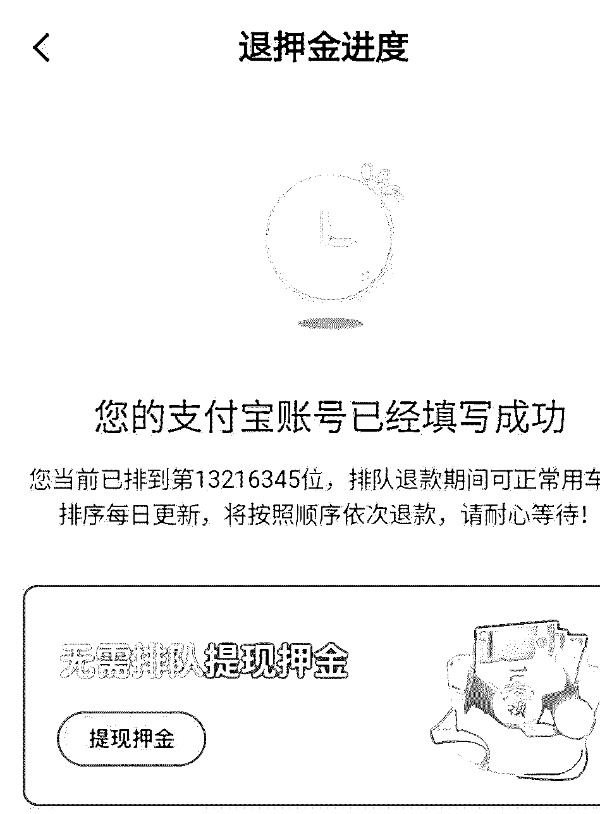

# ofo 退押金，太难了！

> 原文：[`mp.weixin.qq.com/s?__biz=MzIyMDYwMTk0Mw==&mid=2247496752&idx=1&sn=2af05bf8d15c81f9c653ca930eff9046&chksm=97cb3f08a0bcb61eb5d6cc362dadf4b3f6e9d6e75715f0d6d8b7169a8c396bb1967c54c57ca3&scene=27#wechat_redirect`](http://mp.weixin.qq.com/s?__biz=MzIyMDYwMTk0Mw==&mid=2247496752&idx=1&sn=2af05bf8d15c81f9c653ca930eff9046&chksm=97cb3f08a0bcb61eb5d6cc362dadf4b3f6e9d6e75715f0d6d8b7169a8c396bb1967c54c57ca3&scene=27#wechat_redirect)

**点击上方蓝色字体免费订阅“灰产圈”**

近日，ofo 小黄车 APP 首页上线了“天天返钱”的活动，号称“无需排队，直接退还押金”，不过这其中却充满了套路。

**购物返现门槛高**

****

**我们看到，“天天返钱”的界面类似于电商平台，分为拼购、9.9 元特价、头号爆品、限时秒杀，以及大额返现专区。**

**商品由第三方平台或 ofo 旗下的小鹿有货提供，每件商品均标示了可返现金额。根据活动规则，订单完成后，次月 25 日返现到账。**

****

**ofo 返钱页面**

**但拿回押金并没有那么容易。从字面上看，“天天返钱”应该是返现退押金，不过实际上只是将用户押金转至“天天返钱”账户，且无法购买任何商品，用户只能通过购物返现，押金会以双倍返现的形式退还给用户。**

**具体来说，押金用户可享累计返现满 20 元可提现 40 元的“福利”，其中 99 元押金用户最多可双倍提现 5 次，199 元押金用户最多可双倍提现 10 次，换言之，只有用户返现积累到 100 元/200 元，才能获得自己的 99/199 元押金。**

**累计提现次数达到上限后，累计返现 20 元只可提 20 元。**

**买 1199 元返 2.1 元**

** **

**用户买多少钱商品才可拿到全部押金？我们发现，20 元的提现门槛虽看似不高，但要拿回押金花的钱十分可观。**

**值得注意的是，并非标价越高，返现金额越多。以电脑办公板块的产品为例，标价 1199 元的英特尔 i5 六核处理器返现 2.1 元，标价 3799 元的 iPad Air3 返现 13.3 元，如果想靠购买这类产品拿回押金，反而要投入数以万计的现金。**

****

**返现比例和标价不成正比。**

****即使是大额返现，比例也多在 5%-10%之间。**例如标价 899 的破壁机返现 47.19 元，标价 299 元的电饭煲可退押 20.93 元。以此计算，用户至少花费上千元才能拿到 99 或 199 元的押金。**

**新浪黑猫投诉平台显示，多名消费者投诉称 ofo 此举诱导消费。“以为是返现退押金，却要自己付钱买东西，返现的钱再提现。”**

**ofo 求生！数度玩退押套路**

****

**2018 年下半年 ofo 爆发资金危机，无法正常给用户退押。2018 年 12 月 17 日，ofo 上线退押金系统，24 小时申请退押用户突破千万，以最低 99 元押金计算，待退押金规模在 10 亿元以上。**

**2018 年 12 月 19 日，ofo 创始人兼 CEO 戴威在一封内部全员信中承认，公司背负着巨大的现金流压力，“1 块钱要掰成 3 块钱花”。他无数次地感到力不从心，想把运营资金全砍掉，甚至解散公司、申请破产。但他最终还是选择扛起压力，“跪着活下去”。**

**戴威还表示，不会逃避，将为 ofo 欠着的每一分钱负责，为每一个支持 ofo 的用户负责。**

****

**资料图：2018 年 3 月 3 日，天津 ofo 工作人员对单车进行集中维护。中新社我们 佟郁 摄**

**为了节流，ofo 先后进行了裁员、搬家等一系列动作，还尝试了各种变现方式，包括做车身广告、利用流量来做内容，接广告。不过这些方法最终均被证明无法让 ofo 从资金告急的困境中脱离出来。**

**2018 年 12 月，ofo 的运营主体东峡大通(北京)管理咨询有限公司和实际控制人戴威因未履行“给付义务”被海淀区法院采取限制消费措施。**

**资金压力之下，ofo 已经不是第一次在退押金上玩套路。**

**早在 2018 年 11 月，ofo 发通知称，99 元押金用户可一键升级为互联网金融平台 PPmoney 的新用户，同意将押金变为上述理财项目的 100 元特定资产，锁定期为 30 天。升级后，用户实现永久免押金骑行。**

**多数用户质疑 ofo 贱卖用户个人信息，PPmoney 最终下线该合作渠道。**

**2019 年 3 月，ofo 又上线了折扣商城，引导用户将 99 元押金升级为 150 金币、199 元押金兑换 300 金币用于购物，然而“现金+金币”的支付模式决定了用户想要买东西还需另外付费。**

****

**ofo 上线金币商城。**

**对此用户并不买账，有的表示“不算金币，光现金就比直接购买还要贵”，还有的说“我不想买东西，只想要回押金”。**

**结尾**

****

**如今，金币商城改名为“小鹿有货”。**

**商品依然是“金币+现金”的购买方法，但品类有限，选择余地小。**

****

**退押接近一年，某用户排名仍在 1300 万名之外。**

**从 2018 年 12 月 17 日 ofo 上线退款系统，**

**到现在已经接近一年时间。**

**目前排队退押金人数仍在 1500 万以上，**

**我们也想知道的是：**

****究竟什么时候才能没有套路的拿到押金？****

**** 

****

********

**← 向右滑动与灰产圈互动交流 →**

****

********阅读原文加入灰产圈高端社群****