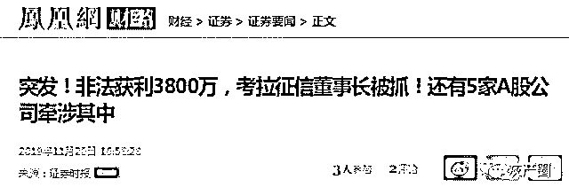
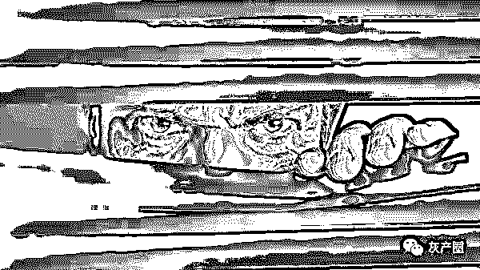
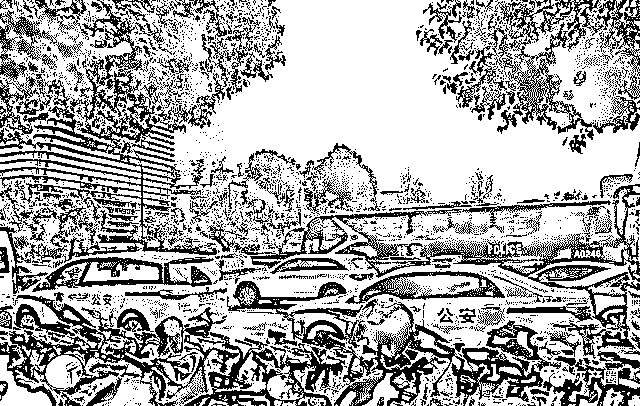
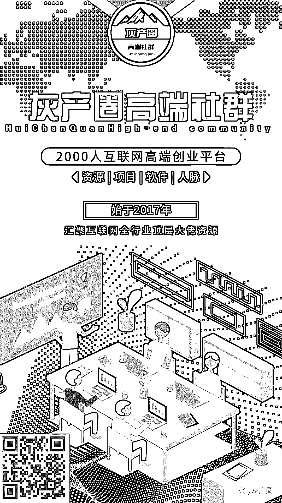

# 上亿条身份证号、照片被贩卖，获利 3800 万，你的隐私正在被“荼毒”？

> 原文：[`mp.weixin.qq.com/s?__biz=MzIyMDYwMTk0Mw==&mid=2247496710&idx=1&sn=63861f931d7291d34a706b9cd3c70f37&chksm=97cb3f3ea0bcb62806e68b657d990be581c4d620e14ce7f829255db1f2a935fecfd961327d17&scene=27#wechat_redirect`](http://mp.weixin.qq.com/s?__biz=MzIyMDYwMTk0Mw==&mid=2247496710&idx=1&sn=63861f931d7291d34a706b9cd3c70f37&chksm=97cb3f3ea0bcb62806e68b657d990be581c4d620e14ce7f829255db1f2a935fecfd961327d17&scene=27#wechat_redirect)

**点击上方蓝色字体免费订阅“灰产圈”**

01

就像一个龙卷风旋涡，整个数据征信行业都将被裹挟。

最近，江苏淮安警方端掉了 7 家涉嫌侵犯公民个人信息犯罪的公司，涉嫌非法缓存公民个人信息 1 亿多条。

其中，拉卡拉支付旗下的考拉征信涉嫌非法提供身份证返照查询 9800 多万次，获利 3800 万元。警方已将考拉征信服务有限公司及北京黑格公司的法定代表人、董事长、销售、技术等 20 余名涉案人员抓获。

更难以置信的是，考拉征信背后的大股东，竟然有 4 家 A 股上市公司.....

P2P 凉凉前，一个横跨全国多地、漫长的网贷黑产链条，震惊所有人！

02

据央视新闻报道，警方发现这起“地下征信”黑色产业链最初源于一起主动投案。

2018 年 4 月，江苏淮安警方在网上巡查时发现，有人非法购买公民个人信息，后嫌疑人高某主动到警方投案。高某交代，他花 500 块钱从网名叫“过去、将来”的人手里购买了 317 条公民个人信息，这些信息包括手机号、姓名、身份证号和家庭地址。他买这些信息的目的是给网络小贷公司拉客户，警方通过对 QQ、微信等资料的综合研判，锁定贩卖个人信息的“过去、将来”位置在河南焦作，随即出动警力，将犯罪嫌疑人申某在家中抓获。

在申某的电脑里，警方查获公民个人信息 7 万多条，这些信息包括公民姓名、身份证号、地址、电话以及芝麻信用分等，很多信息显示推广来源为“花钱无忧”“借点钱”等小贷平台。

申某自己不做贷款，而是通过个人信息买卖赚差价，加个几毛钱或者一块钱一条，再出售给其他人。

随后，申某的一名主要上线谢某在广州家中被警方抓获。另一个通过向申某贩卖公民个人信息的是广东一个网名叫“叮咚叮咚”的人，警方发现，“叮咚叮咚”在微信群中大肆贩卖公民个人信息。

不过，有迹象表明，“叮咚叮咚”是广州诺涵科技公司的员工，他贩卖公民信息并非个体行为。

淮安警方发现，广州诺涵科技公司不只贩卖公民个人信息，更主要的是在进行小额贷款并进行软暴力催收，这是一个组织严密、分工明确、涉案人数众多的犯罪团伙。

2018 年 6 月 6 日，在广东警方配合下，淮安警方将该公司 45 名涉案人员全部抓捕。

除此之外，警方还发现，在广州诺涵科技公司，公民个人信息被称为“流量”，公司自己开发有“乐花管家”等多个小贷平台，在自身购买公民个人信息用于推销贷款、软暴力催收的同时，也和其他公司相互交换公民个人信息，还开发有爬虫云等软件，通过技术手段爬取其他小贷公司的公民个人信息，用于公司放贷和非法出售牟利。

涉案的广州诺涵公司虽然披着科技公司的外衣，其实从事的是网络放贷、软暴力催收、贩卖公民个人信息等违法犯罪行为。在他们贩卖的公民个人信息里，甚至还出现了公民身份证照片信息。

警方测试后发现，返回的是带网纹的二代身份证彩色照片，这样极度隐私的个人信息他们从哪儿获取的呢？

锁定相关犯罪证据后，淮安警方在长沙、深圳分别将湖南九象公司的法定代表人和技术主管抓获。

警方审讯得知，九象公司黑爬虫网站的“身份核验返照”业务端口来自北京黑格科技有限公司，而黑格公司是从北京考拉征信服务有限公司等四家公司购买的查询接口。

随即，警方将北京黑格公司和考拉征信服务有限公司的法定代表人、董事长、销售、技术等 20 余名涉案人员抓获，并于今年 4 月在北京将他们上游公司的 5 名涉案人员抓获。

经查，北京考拉征信服务有限公司从上游公司获取接口后又违规将查询接口出卖，并非法缓存公民个人身份信息，供下游公司查询牟利，从而造成公民身份信息包括身份证照片的大量泄露。

淮安公安分局网络大队中队长顾明表示：“违规缓存相当于把公民个人信息复制了一份，下游公司再向它通过数据接口调取数据的时候，它就不需要再向上游调取，也是节省了开支，这个是违法的。”

2015 年 3 月以来，北京考拉公司非法提供查询返照 9800 余万次，获利 3800 余万元，在公司服务器中查获并收缴被非法获取、存储的公民姓名、身份证号、相片近 1 亿条。个人信息这些及其隐私的数据被一些公司包装成为个人数据产品进行贩卖，严重侵害了个人隐私，部分涉案人员因侵犯公民个人信息罪已经被法院判处了相应的刑罚。

与此同时，买卖公民个人隐私数据为小贷公司的“套路贷”犯罪、暴力催收敞开了罪恶之门。

淮安市公安局称，有人把这些非法获取的公民身份证照片 PS 成灵堂照片或者淫秽色情照片，发给贷款人本人进行威胁，甚至发给亲友同事，毁坏贷款人声誉，另外还用于电信诈骗中的通缉令诈骗，把带有身份证照片的通缉令发给受害人。

例如，湖南九象信息服务有限公司还利用爬虫软件，大量爬取其他小贷公司的公民个人贷款数据，包括姓名、身份证号、住址、电话、芝麻信用分、银行卡号、是否逾期，甚至通话记录等，形成所谓的地下征信，然后以数据形式打包出售，其他小贷公司购买后，成为是否放贷、放贷多少的风险控制依据。

03

事实上，类似的数据隐私泄露事件并不在少数。

去年 3 月曝光的 Facebook 数据泄露事件中，有 5000 万用户的个人资料，被用来作为向其精准投放政治广告的重要参考，而这些人占据着美国选民人数的四分之一；同年，万豪发布公告称旗下酒店喜达屋 5 亿房客信息被泄露；社交平台陌陌的 3000 万用户数据在暗网被销售；问答网站鼻祖 Quora 的 1 亿用户数据被窃等等，而类似的数据隐私泄露事件还在继续。

目前，数据隐私问题的集中爆发，根源究竟在哪里呢？

北京光之树科技 CEO 张佳辰认为，根源在于数据的规范化流通逐渐进入正轨，国家加大力度对数据的获取(来龙)和利用(去脉)的乱象进行整治，一系列被“隐藏”的数据隐私问题才会被公众所知，这反而是一件好事。

对于征信公司和第三方数据公司来说，合法合规获取数据将成为行业大势。以征信公司为例，整个征信行业的监管需要加强规范化运营，以应对越来越强的监管。

第一，注意数据来源，不能全盘接收第三方大数据公司给到的数据，因为这个数据可能是被过度攫取的；

第二，要注意数据的使用，需要用更为先进的技术手段去合法合规使用数据，确保数据不被滥用，可回溯追责。

第三，利用技术确保公民个人信息不被泄露，且数据不会被缓存，结合区块链和数据标识技术，还可以确保数据确权、流转过程的可追溯可审计，充分发挥数字经济时代”谁贡献谁受益“的优势。

作为一名普通的吃瓜群众，我们还能做点什么保护自己呢？

在提供任何电子化或书面授权时，需仔细阅读并理解相关授权范围以及自愿退出的方式，对于超出必要性范围的数据授权应予以明确拒绝，并在发现自身权利受到侵害时，立刻终止使用，并向当地政府和监管部门投诉。

05

试问，贩卖信息牟利的考拉征信等公司，是不是罪恶的间接帮凶？

存在即合理，小额贷款的存在，是因为大部分能力有限的人，无法达到银行贷款的抵押、担保条件。

但这不意味着，它就要沦为不法分子肆虐的灰色地带。

近年来，被“套路贷”逼到倾家荡产，被暴力催收逼上的绝路的大学生、打工仔数不胜数。这背后，是多少支离破碎的普通家庭，罪恶必须得到惩罚！

**30 天前，杭州警方突击 51 信用卡总部，CEO 被抓，股价暴跌**

51 信用卡，注册用户超 8000 万人，合作 100 多家银行、金融、信托公司，号称金融行业“独角兽”。

但它竟涉嫌暴力催收，严重扰乱市场秩序。杭州警方突击证明，即便是独角兽，也不能打着创新旗号，践踏社会底线！

天朗气清前，请大家擦亮眼，不要再误入“深渊”！

参考资料：央视财经《你的个人信息可能在“裸奔”！身份证号、相片全泄露，超 1 亿条→》

← 向右滑动与灰产圈互动交流 →

**阅读原文加入灰产圈高端社群**