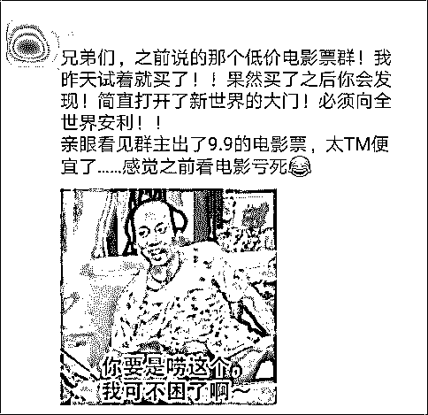
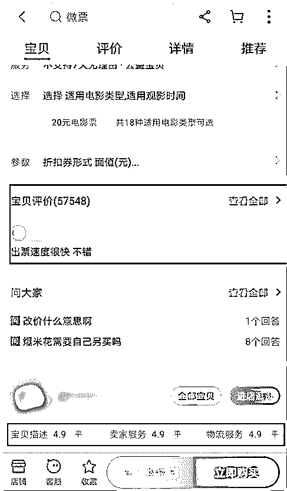
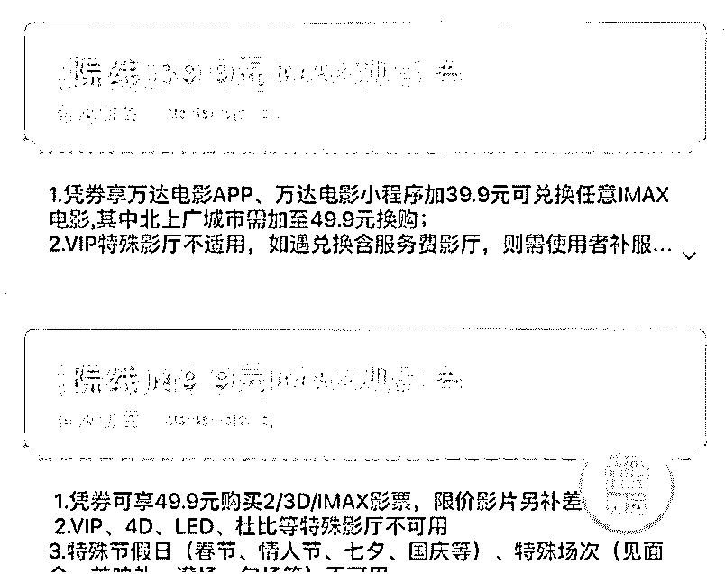
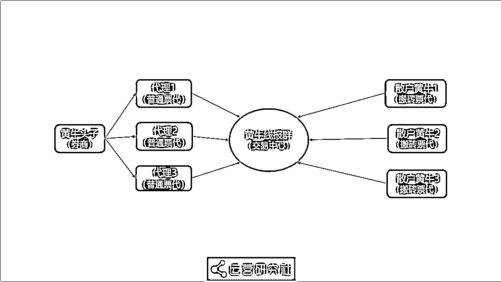
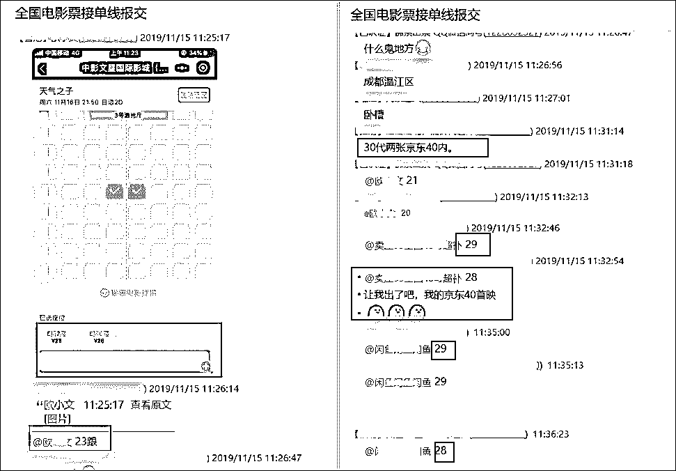

# 卧底 9.9 元电影票黄牛群，暴利灰产背后有何猫腻？

> 原文：[`mp.weixin.qq.com/s?__biz=MzIyMDYwMTk0Mw==&mid=2247496686&idx=1&sn=064065a09281d5c180f67685cfb6833b&chksm=97cb38d6a0bcb1c0ddc8cba66f8a0e2fab8c7f0a1875d2ddcbbeb08597df16e9798009412e3a&scene=27#wechat_redirect`](http://mp.weixin.qq.com/s?__biz=MzIyMDYwMTk0Mw==&mid=2247496686&idx=1&sn=064065a09281d5c180f67685cfb6833b&chksm=97cb38d6a0bcb1c0ddc8cba66f8a0e2fab8c7f0a1875d2ddcbbeb08597df16e9798009412e3a&scene=27#wechat_redirect)

**点击上方蓝色字体免费订阅“灰产圈”**

导语

前两天，一个朋友突然在朋友圈疯狂安利一个卖低价电影票的微信群，极力劝说我们从这个渠道买票，还说以前买的原价票血亏。
朋友的狂热表现，让我几乎以为他误入什么传销组织，被洗脑了……都 9102 年了，买电影票还用找黄牛？出于好奇，我开始扒起了低价电影票背后的猫腻。**这些黄牛的套路简直太深了！**在卧底过程中，我都差点被他们转化成代理了。

但经过一周的卧底挖掘，我发现这些低价电影票的背后，竟藏着的一条**从“出票——中间代理人——买票用户”**的灰色产业链。

# 网络黄牛卖票新玩法

在我们以往的认知中，黄牛都是些囤积稀缺票，然后再高价贩卖的二道贩子。现在淘票票、猫眼等网购平台已经非常普及了，电影票还有黄牛的生存空间吗？答案是有的。并且这些电影票黄牛们为了适应网络售票的大环境，已经探索出了新玩法。

## **1）假借“揭秘”之名，发布软文多自媒体平台引流**

现在，电影票黄牛最常见的引流手段，就是在知乎、贴吧等大流量网站以及简书、头条号等自媒体平台上**发布“揭秘”类的软文，靠着“副业赚钱、月入过万”**等噱头吸引用户。你随意在知乎、简书、贴吧等网站上搜索“低价电影票”，就会出现大量标题类似于“揭秘朋友圈低价电影票”的文章，这些都是黄牛党们的软文。但实际上，这些文章讲的内容和套路都差不多。先告诉你**低价电影票是个非常容易赚钱的兼职，**行情非常好。然后**普及一些常见的薅羊毛获取低价票的手段，**再反复告诉你只要身边有看电影的朋友，就能靠这项兼职“利人利己”。最后，再展示下自己和其他用户的交易记录，**以及卖出过优惠了 XX 元的低价票。**类似的软文让用户产生“我也可以做这个兼职赚钱”，即便赚不了多少钱，也能让自己和朋友买到低价票的想法。所以，**软文下面总会有很多用户被转化。**但实际上，这只是黄牛们的推广手段。文章里介绍的出票手段根本无法稳定地获取一手票源，**黄牛们只是希望你成为他们的下级代理，替他们开拓客源。**即便你最终没有成为代理，也很有可能像我那位朋友一样，安利身边的亲友通过黄牛渠道获取低价电影票。

## **2）依靠电商平台获取用户信任**

因为在互联网上很难真地做到一手交钱一手交票，用户对于贩卖低价票的黄牛也往往缺乏信任，所以黄牛们一般都会把业务挂靠到淘宝、闲鱼等电商渠道，借此来获取用户信任。你只要打开淘宝或者闲鱼，搜索“低价电影票”，就能发现很多月销几千甚至上万的店铺。左图：淘宝 ；右图：咸鱼店铺的月销额、用户评价以及官方平台的投诉机制，能够在很大程度上帮黄牛获取用户的信任，提高转化率。黄牛店的购物流程与一般电商购物的程序类似。
首先店家会让你先在购票 App 上选好影院、时间、座位、张数。然后商家会针对你的订单报价，敲定最终价格。最后，商家会在你付款后将取票码发到你的手机上。一般情况下，在用户成功通过低价电影票看过电影后，就很容易对这家店铺产生信赖感，黄牛们也会顺势将你拉入他的微信群，把你转化成回头客。现在，连黄牛都开始用互联网思维来做灰产了。

# 低价电影票，黄牛已经产业化

看到这里，你一定有很多疑问，比如：

> 网上的那些低价黄牛票都是真的么？
> 
> 黄牛们都是怎么弄到这些低价电影票的？
> 
> 这些低价电影票是合法的么？
> 
> 他们是怎么做到全国电影票随便出的？
> 
> ……

为了弄清楚这些问题，我开始以卧底的身份潜入多个黄牛交流群，并以多种身份接触了很多黄牛。经过近一周的卧底，我发现现在的黄牛们已经互相联合，**组成了一条“从获取票源到多级代理，再到各级黄牛联合，全国供票”的灰色产业链。**下面，我就带你一步一步地揭开低价电影票的行业内幕。在揭秘之前，**首先需要讲清楚一个概念——票代。**什么是票代呢？简单来说，**票代就是各种渠道获得的电影票代金券。**黄牛们通过各种票代获得满减，从而以远低于票原价的价格兑换出电影票，其中的差价就是黄牛们的利润。所以对于电影票灰产而言，**最为关键的环节就是如何获取足够多的票代。**只要有足够的票代，黄牛们就能无限制地提供低价电影票赚取差价。

## **1）票代是从什么途径获取的？**

电影票黄牛界一共有三种票代，分别是：**券商、普通票代、搬砖票代。**其中的券商，就是我们所说的“黄牛头子”，也是产业内最大的票贩子。他们获取票代的渠道主要有两个：**技术性薅羊毛和内部渠道购买。****先说第一个，技术性薅羊毛。**现在购买电影票的渠道主要有三种：

> 平台 App ：如淘票票、猫眼等专业卖票平台。
> 
> 影城 App ：如万达影城 App ，CGV 影城 App 等影院软件。
> 
> 其他 App ：如招商银行 App 等可以买电影票的手机软件。

这些平台为了鼓励用户消费，往往会提供很多优惠服务。例如猫眼电影上的砍价 0 元看电影，可以通过用户间互砍获取购票代金券。淘票票上也有很多类似影城卡的优惠政策，可以每日购买 6 张优惠电影票……左图：猫眼 ；右图：淘票票
在各类购票软件上，这样的优惠活动非常多，而这也给了黄牛党们薅羊毛的机会。市面上很多散户黄牛就是靠薅各个 App 的羊毛来出票，赚取差价的。但散户黄牛想要依靠这种方法大批量出票是很难的，**所以资深的黄牛头子会利用“群控技术”批量操控手机，**再利用“养猫池”（用手机卡蓄养大量虚拟账号）等手段，实现 N 张手机黑卡同时作业，批量盗取软件优惠券。
群控技术·图源：@华企黄页网**第二种，内部渠道购买通兑券。**经常看电影的小伙伴，一定都知道影院有一种代金券叫“通兑券”，持有通兑券的用户可以在买票时抵用部分现金。**很多连锁影院都会经常发放通兑券来促销，**于是有内部渠道的黄牛头子会趁机囤积大量通兑券。图源：@电影情报处@电影情报处 曾将采访过一个资深的黄牛头子，他在采访中举例说：

> 在一年的春节期间，有影院在卖 IMAX 套票，货源很充足，我们就会找到影院经理，甚至是地区总经理大规模进票（通兑券）。

除此之外，他还透露说很多影城都会有员工福利观影券，很大一部分也都会卖给他们。市面上的大部分票源，都是黄牛头子们依靠以上两种手段获取的。

## **2）黄牛线报群，形成了全国分销体系**

黄牛头子在获取了大量票代之后，就产生了另一个问题：不论是薅羊毛还是内部票，票源都是局限在某几家连锁影城的部分电影，那黄牛们又是如何做到全国电影随便买的呢？**这就不得不说起黄牛们分销体系和线报群了。**上段中我们说过，在电影票黄牛界一共有三种票代，分别是：券商、普通票代、搬砖票代。**市面上的大部分票源都来自于****黄牛头子****（券商），**他们占据了灰产的上游。一般情况下，他们都不会直接出票给用户，而是通过“收徒”来发展自己的代理。这些**能接触到一手票源的代理被称为****普通票代****，**处于产业中游。他们可以直接自己寻找用户，贩卖低价电影票，也可以再向下收徒，让更低一级的代理帮自己分销。而那些**接触不到一手票源的黄牛被称作****搬砖票代。**他们一般只能从上家取票，然后直接卖给用户，因为利润已经不足以支撑他们再收代理了。由于头部“券商”无法获得全种票源，所以任何一个黄牛团伙都无法没有全国电影随便出票的能力，于是黄牛线报群就随之产生了。**黄牛线报群里聚集了全国各地的票代。**任何黄牛只要接到订单，就会把购票信息发到黄牛线报群里，有资源的黄牛们就会对订单竞价。最终，报价最低的黄牛，会得到这个订单。就是通过这样的线报群，黄牛们交互各自的资源，最终形成了全国性的电影票分销体系。

# 结语

说到这里，相信你已经见识到电影票黄牛产业的水有多深了。

**首先是处于电影票灰产上游的黄牛头子，**通过恶意薅羊毛和影院内部渠道批量获取低价票源。

**然后掌握票源的黄牛头子们会通过收徒的方式，**招收大量代理。这些代理会在全网发布大量的软文，吸引用户购票，也会再向下招收更低级的代理。

**最后，全国的各级代理都会聚集到”黄牛线报群“对接各自的资源，**形成全国性的分销体系。

事实上，这些低价票本质上还是通过不正当行为获得的。很多卖票的黄牛在交易过程中都毫无节操可言，拿钱不办事的情况也很常见。

所以，还是希望小伙伴们尽量通过正规途径，合法的利用购票平台的优惠券来购买电影票，不要让骗子给骗了。

← 向右滑动与灰产圈互动交流 →

**阅读原文加入灰产圈高端社群**