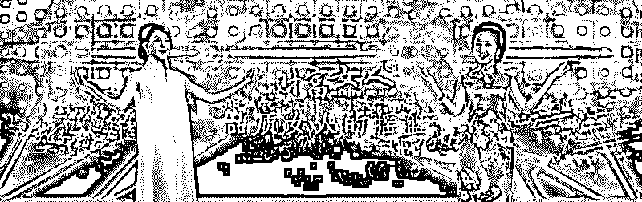

# PUA 越火，“小三”培训班生意越好!

> 原文：[`mp.weixin.qq.com/s?__biz=MzIyMDYwMTk0Mw==&mid=2247496677&idx=1&sn=1c68563c102df8591a324c60c63b7010&chksm=97cb38dda0bcb1cb925313ad9b2085b6e6d767452223242b11618d8c36f3f452dd078182a1f2&scene=27#wechat_redirect`](http://mp.weixin.qq.com/s?__biz=MzIyMDYwMTk0Mw==&mid=2247496677&idx=1&sn=1c68563c102df8591a324c60c63b7010&chksm=97cb38dda0bcb1cb925313ad9b2085b6e6d767452223242b11618d8c36f3f452dd078182a1f2&scene=27#wechat_redirect)

**点击上方蓝色字体免费订阅“灰产圈”**

某个高级酒店的礼堂里，服务员们在几百位坐直身体的女性中间快速穿梭，但眼睛从没离开过最前面的舞台。

台上讲师像救苦救难的智者，正一步步劝诫着台下的信众，希望能给所有同道姐妹都带来福音。

伴随着扩音器喇叭里高频泛音的扩散，即便是急着退房的客人也会被礼堂里传来的演说声音吸引而来。

“现在小三有专业的勾引话术、诱人的身材、水嫩的皮肤和被训练出来的调情手法。”

“没有拆不掉的家庭，只有不改变的自己，小三都这么努力了，你还要一成不变吗？”

根据这场会议的内容，在场所有人都可以得知小三们已经不藏在暗处，她们有培训班了。

互联网对人的关怀是无微不至的，如果你在搜索引擎输入“小三培训”，就能发现互联网确实消融了所有门槛，可以满足任何人的求知欲。

“小三也是一门生意，镜像的男性培训班就是 pua 速成，区别是女性看中的是钱，男性看中的是颜。”

按这些培训班的招生简章介绍，只需要几万块的学费投资，再通过几天封闭式集训，就能得到最老牌狐狸精的真传，手把手教你钓大款，有些培训班还会给毕业之后钓不到大款的学员包分配。

对于被培训者来说，如何插进别人家里撬走男主人，决定了自己人生轨迹的最终走向，这无疑给原配夫人们带来了一种亟待救赎的焦虑。

导致除了出现各种各样的反小三协会，供需关系还导致市面上存在以劝退小三为主要业务的公司。

劝退师毕竟没办法达到百分之百的成功率，终究还是治标不治本，另一些投机者因此以原配救星的市场定位打开了一片新蓝海。

“如果说以毒攻毒是最直截了当的逻辑闭环，那么给太太们也开个培训班才是行之有效的解决方案。”

这类反小三培训班被命名为“名媛培训班”，这里的宗旨简明扼要：只有比小三更有吸引力，才能让丈夫回归家庭，不为外物所动。

也有人打出了“从女人到女神，从平凡到超凡”的标语，参与的女性基本可以被统称为“速成名媛”，也可以叫“野生名媛”

不管是冠以什么样的前缀头衔的培训班，开设的课程基本都涉及房中术、心理学、礼仪，更高端的还有茶艺、插花、高尔夫和马术。

其中一家名为“好太太幸福学院”的工作人员还表示：“收费 10 万元，封闭培训半个月，除了伦理和情感方面的专家外，我们还有一名在事业和家庭方面成功的男士，向女学员们传达男性的感受，一名优秀的菲佣也被聘为老师，教女性如何料理家务。”

经过一系列培训，再拍个毕业照，大家就是名媛了。

不过当你打开好太太们的官网时，连百度都会告诉你有风险 

阔太太们更舍得花钱，所有“名媛培训班”的师资定位都明显更精准，只是没有和小三过招的课程，据说培训机构的老师说人性太难捉摸充满不确定性，只能靠预防。

一些未雨绸缪的家长准备从娃娃抓起 

不过这就好比传统智慧中对于水的理解一样，迫切想成为好太太的人一般都不是太太。

刚在上海小三培训班毕业的丽丽畅想着将来在上位之后能做个好太太，试听了一场“敌人”的讲座之后，发现这些“名媛培训班”教的东西比自己当时上课学的还更具功能性。

“这才是小三培训班吧？”

任何事物都具有辩证的两面性，丽丽觉得从这个角度看小三和原配之间的需求反而有着某种程度的重合。

“试想当一个小三看到大屏幕上公示着能打倒小三的勾人技巧，顺便还能拿个名媛的毕业证书，只会想进一步更新自己的技能库。”

  

在精明的小三们眼里，“小三培训班”和这类“名媛培训班”教的根本就是一个东西，后者还要更胜一筹。 

这些课程给了小三们更多机会，培训班的门口停满了豪车，老板们在接自己太太回家的时候，常常还能在这里物色自己的心灵栖息地。

如今这类课程在国内外遍地开花，有的培训班甚至开在大学里，各大名校都曾开办过“卓越女性高级研修班”，年龄最小的是在校大学生，最大的 30 出头，从外企白领到个体女老板无所不包。

从北京上海的“淑女名媛学校”到成都“如何嫁个千万富翁”开班，从泰国的交际花开班授课如何和富豪约会到美国的“甜心有约”为年轻女孩和干爹牵线搭桥，“这就像是包装待嫁女儿的生产车间，增加魅力取悦异性，是她们的第一动力。”

但正如李银河所说：“女人上学专门研修如何保住老公，如何跟小三斗争，这本身就是一种男女平等的倒退。”

事实上早在差不多 10 年前，一位自称“三姐”人就曾创立了一家名为“三情网”的论坛，主要功能是关爱小三的感情生活。

在那个年代她们就开始在互联网上相互传授经验，研究小三的应用技术指南，直接把“礼仪之邦”炸开了锅。

“论坛成立后，小三们在网上讨论奢侈品、汽车和房子以及每个月 2-3 万人民币生活费的行情，交换如何从男人钱包榨出更多钱的方法。”

她还在 2011 年 2 月 23 日发表一封《致各国人民的公开信》，向全球发出声明，声称“小三付出感情，跟只是为了钱的二奶是不同的，应该是一个新时代的职业。”

据说这个网站在 2014 年的时候有九万贴数，但在之后被关闭了，现在只能在其他社交平台上发现它的部分残骸。

她们把原配称为“大姐” 

她在论坛里表示：“为人妻子的，在丈夫出轨时应先自我检讨不足”，并澄清“三情网”论坛不是教人做“小三”，也不提供任何人找“小三”，只是“小三”的倾诉地方和交友地方。

由她组建的“中国关爱小三协会”甚至把 3 月 3 日定为“小三节”。

如今随着时代发展，小三又把自己和“名媛”划了等号，“名媛”在今天更像是一个约定俗成的概念。

北京大学社会学教授郑也夫曾说，“早就告别那个淑女时代了，现在的‘名媛’只是商品时代的产物。”

不管你喜不喜欢，典型形象往往会因为集体的聚焦而变的普适，大众总是需要为少数人买单，“男人骗感情，女人拜金”依然是存在的刻板印象之一。

叫了很多年的平权也没在越来越魔幻的现实面前挺直腰板，除了他们之外的所有人好像都被无差别泼了一盆脏水。

“有人在学 pua，有人化身名媛，男女之间的信任从来没有像现在那么岌岌可危。”

大部分时候人们只愿意看到自己想看到的，你骗我我骗你，男女双方重回一个起跑线，好像大家就又是平等了。 

← 向右滑动与灰产圈互动交流 →

**阅读原文加入灰产圈高端社群**