# 香港暴徒的酬劳曝光，“杀警”最高给 2000 万“抚恤金”！

> 原文：[`mp.weixin.qq.com/s?__biz=MzIyMDYwMTk0Mw==&mid=2247496669&idx=1&sn=71a75127c19156336884c52abe44dafe&chksm=97cb38e5a0bcb1f3809a43bf09e3f5b62488da713686fd6a230d06a6c553b321cb7607c79617&scene=27#wechat_redirect`](http://mp.weixin.qq.com/s?__biz=MzIyMDYwMTk0Mw==&mid=2247496669&idx=1&sn=71a75127c19156336884c52abe44dafe&chksm=97cb38e5a0bcb1f3809a43bf09e3f5b62488da713686fd6a230d06a6c553b321cb7607c79617&scene=27#wechat_redirect)

**点击上方蓝色字体免费订阅“灰产圈”**

12 日，香港中文大学、香港城市大学、香港理工大学等多所大学，发生暴力事件。从白天到黑夜，暴徒们不断焚烧杂物，撬门打砸。校园内多处燃起了熊熊大火，烟雾弥漫。

13 日，香港教育局发布消息称，全港学校于 14 日停课！有多所大学甚至表示，取消本学期余下课堂。

香港社会连日受到暴力示威者广泛破坏，情况令人齿冷。那么，大量的香港青年“入局”，是为了钱还是所谓的信仰追求？是谁在幕后持续“输血”？“血”输向哪里？我们一点点挖出这个，隐藏在黑暗中的“地下钱庄”——

**500 至 5000 块**——这是普通学生参与暴乱的酬劳。钱多少，取决于参加游行的规模、在队伍中的位置、暴力程度、是否袭击警察等，女性示威者的酬劳高于男性。

**3 万**——这是一个 13 岁小暴徒参加几次暴乱活动后所获酬劳。这些钱，帮助他换了新款 iPhone 手机、游戏机、名牌运动鞋等。他打算叫亲弟弟一起做……

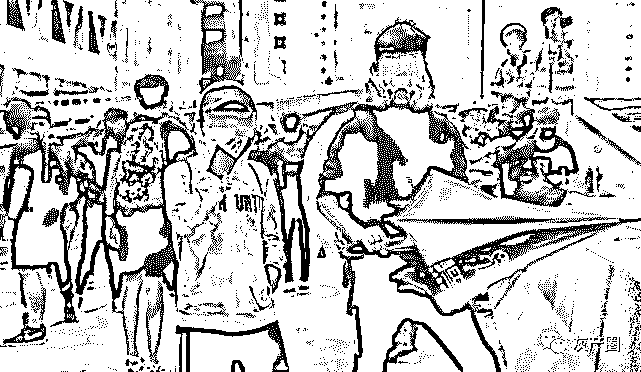

**1.5 万**——这是《反蒙面法》出台以后，为避免“勇武”暴徒可能退缩的情况，参加暴力活动者的酬劳，大幅提高至每天 1.5 万块。

**500 万**——这是“勇武”核心成员收到资金以后，通过网络或街头招募的形式组织激进青年加入，将佣金的小部分给下面的“勇武”暴徒后，自己独占的“大头”。两个月，净赚超 500 万。

**2000 万**——这是在发动 10 月 1 日大游行前，“招募死士”计划所提供的“抚恤金”。“死士”需执行包括杀警、假扮警员杀人后嫁祸、纵火等一系列极端任务。

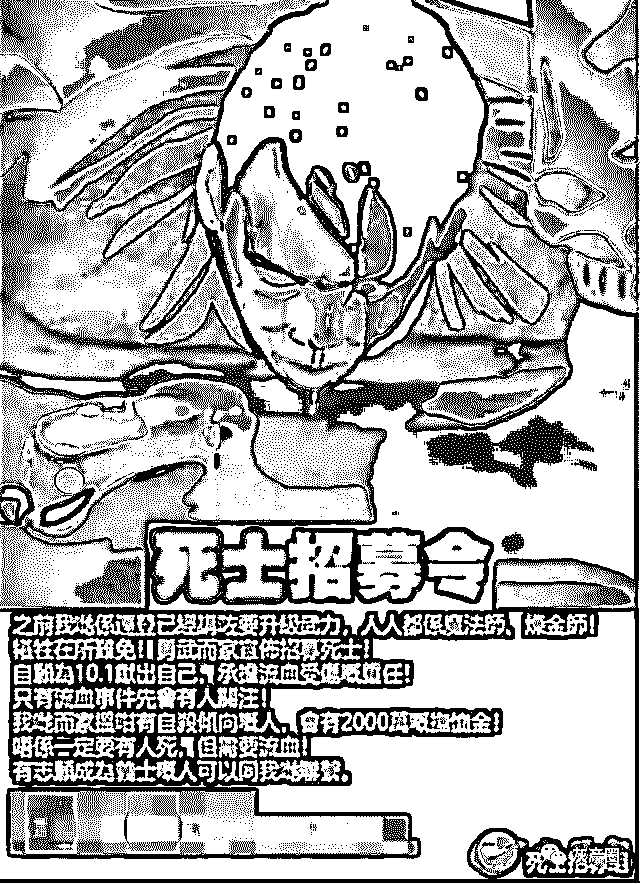

**实际上，持续五个月的修例风波，参与暴力活动领薪酬早已是公开的秘密。****充足的资金保障，是暴乱活动能够持续如此长时间的重要原因！**

**香港青年“入局”，为钱？为信仰？**

在参加“反修例”暴乱活动的人群里，香港青年群体是主力。

没有社会阅历、年轻易冲动、长期被本土通识教育及“黄媒”“黄师”洗脑，加上近年香港民生问题突出、青年生活压力加剧等各种现实因素，都是促成香港青年走上街头，参与暴力活动的重要原因。

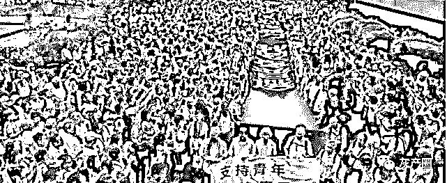

去年，香港游乐场协会开展“香港青少年生活状况”调查显示，香港青少年的精神健康状态非常不理想，有 30%－40%的受访者，抑郁或焦虑指数，属中等至极度严重。

不满、迷惘、焦虑、愤怒……这一团团“火种”经人用力一煽，迅速成燎原之势。**那一只只幕后黑手，正在用大量的资金，加紧“火上浇油”。**

香港，正在被焚烧！

**“地下钱庄”的老板都有谁？**

**这个“地下钱庄”就是美西方反华势力、香港本土反对派势力祸港乱港的金库。**其股权关系复杂，具体讲，主要有“一大四小”五个“股东”。

“一大股东”即为美国的一些非政府组织（简称 NGO）及金融资本集团。

“大股东”在香港又物色具体的组织及合适的人选，充当其“经理人”，构成了其庞大繁杂的“股权体系”。之所以雄踞“大股东”位置，那是**因为修例风波中一半以上的暴力活动资金均来源于此。**

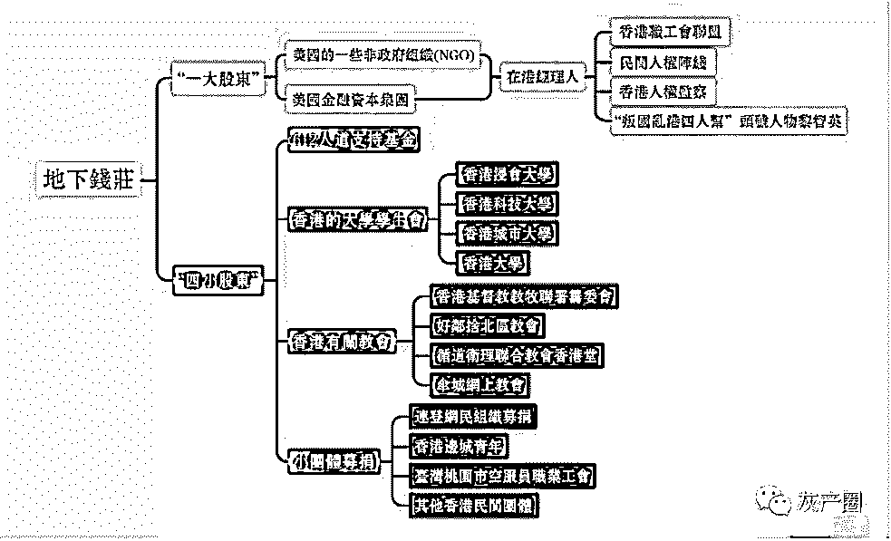

“四小股东”分别为专门成立的 612 人道支持基金会、香港的大学学生会、香港教会、小团体募捐。

下面，容我细细道来——

**1**

先说说美国非政府组织。

**美国的一些 NGO 组织在香港修例风波中，扮演了暴力活动“操盘手”的角色，**还为冲在台前的“泛民”进行策划、培训、资金、物资供应、舆论造势等一条龙服务。

在众多的 NGO 组织中，发挥核心作用的是美国某民主基金会。

**这个美国“颜色革命”的发动机器，**采用直接或间接的方式向香港“经理人”源源不断输送资金。资金主要输往三个组织：香港职工会联盟、民间人权阵线、香港人权监察。

香港职工会联盟，自 1994 年以来就收受该基金会旗下的组织，每年 5 万－10 多万美元。截至 2019 年，已接受近 200 万美元（折合约 1600 万港元）的金援。

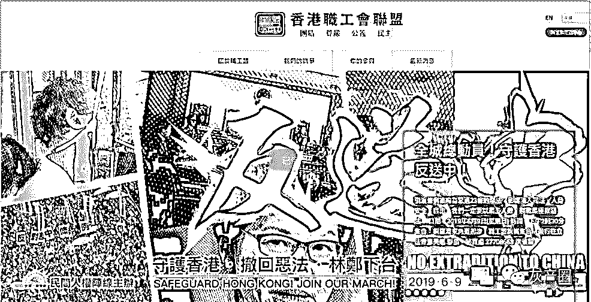

香港民间人权阵线，成立于 2002 年，**几乎所有香港民主派成员都参与其中。**其活动资金大部分是该基金会间接提供的。仅 2018 年，就收到拨款 20 万美元。

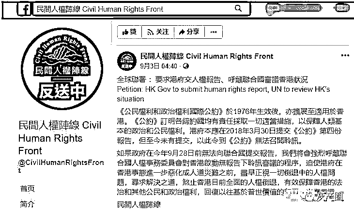

“香港人权监察”，1995 年成立，宣称为了在香港更好地保护人权。**其是此次支持“反修例”运动的主要团体。**至今合计收受该基金会金援超 1500 万港元。

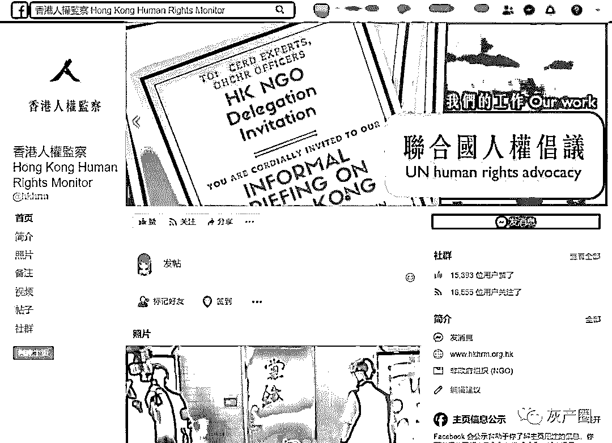

由于“捐赠”模式太过明显，幕后“金主”必须用更隐蔽的方式输送“黑金”。而通过金融及资本运作的方式，正是美国所擅长的伎俩，**具备条件又能充当“马前卒”的“经理人”，就是“叛国乱港四人帮”之首——黎智英。**

美国金融资本集团在修例风波初期，通过买入黎智英壹传媒集团股票，使股票不足两周暴涨了 131.71%。再由壹传媒高位抛售，套现大量“黑金”。9 月中旬，美国金融集团故技重施，再套现后，推动修例风波愈演愈烈。

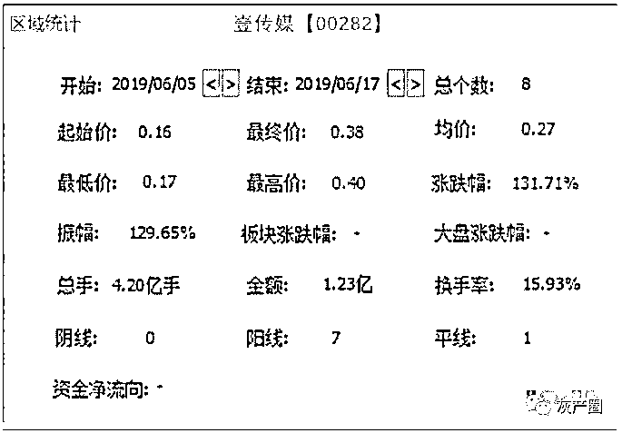 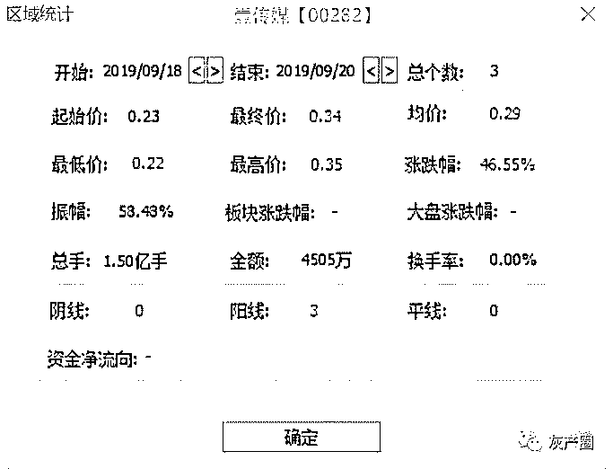

实际上，美国“大股东”与黎智英之间的资金流转，早已驾轻就熟、配合默契。多年来，黎智英按照西方授意，多次以捐款名义，向乱港组织及相关人士输送“黑金”，操控反对派政党和乱港分子，**总金额早已过亿。**

**2**

再说说“612 人道支持基金会”。

**这是专门为修例风波中的暴力活动募集资金设立的。**其成立于 6 月 15 日，主要是支持所有因参与暴力活动而“受伤”、“被捕”的示威者。该基金会由何韵诗、吴蔼仪、许宝强、何秀兰担任临时信托人，四人均是有一定影响力的“港独分子”。

该基金会募集援助资金达 8000 余万港币，承诺将用于为受伤、被捕的“勇武”暴徒提供所谓人道主义救助。

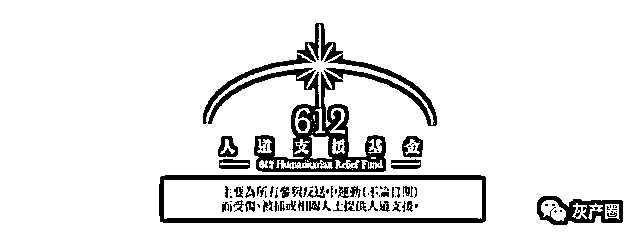

**3**

香港的大学学生会，也是“地下钱庄”的老板之一。

在持续了五个月的修例风波中，非法游行集会示威活动不断渗入大学及大专院校。其中的学生会，又组织了众多学生参与，涉及资金庞大。

这些学校中，以香港浸会大学学生会、香港科技大学学生会、香港城市大学学生会以及香港大学学生会最为突出。**据不完全统计，以上四个大学学生会目前就已经投入 300 多万港币，用以支持暴力活动。**

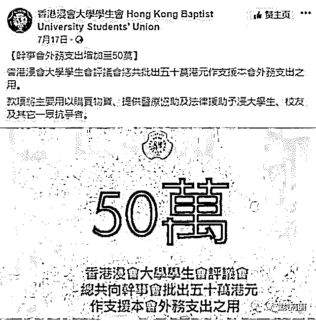

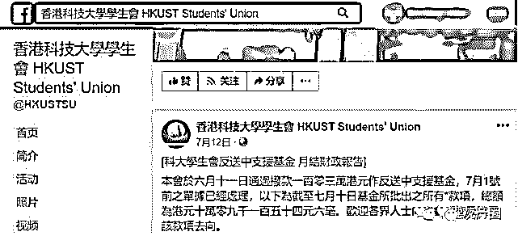

学生会哪来的资金呢？原来，在香港上大学的所有本科生，入校当天起就被强制缴纳一定的年费，自动成为学生会会员。**新生入会费一次即可收几百万。**

同时，在香港的大学里，一些教授在学术上实质性建树有限，却总有“反中乱港”势力赞助其研究基金。**这是一种集团式的利益输送。**一些教授收钱办事，在学校开展全方位的“反中”“贬中”洗脑。

**4**

香港的有关教会，也是不可忽视的“小股东”。

香港有关教会在修例风波的暴力活动中，参与程度较高，且与暴力活动的发展过程密不可分。香港基督教教牧联署筹委会、好邻舍北区教会、循道卫理联合教会香港堂和伞城网上教会等，**一直以慈善捐赠、资助筹款等方式，将所得资金用来支持暴力活动。**

**暴力活动中，教会不仅提供资金支持，其所属教堂更成为了暴徒的临时休息站、庇护所、物资存储中心。**香港的有关教会，早已脱离宗教团体的属性，成为披着宗教外衣、行乱港之实的政治组织。

**5**

除上述组织外，另有其他香港社会团体、台湾组织等，借助互联网社交平台筹集资金、捐赠游行装备等。

**主要包括：****连登网民组织募捐、香港边城青年、台湾桃园市空服员职业工会和其他香港民间团体。**

其中，香港边城青年是一个在台湾的香港人发起的团体，收受台湾民主基金会的资金支持，且在修例风波中，负责向香港地区运输台湾地区募集到的物资。

**“地下钱庄”的“黑金”都花在哪了？**

五个多月来，“地下钱庄”的“黑金”，除了**支付游行人员和暴徒的薪酬**外，还会大量购买防毒面具、安全帽、身体护具、护目镜、镭射笔、照明电筒、摄影器材等**一系列装备物资**。

同时，**策划反动文宣、为暴徒提供法律援助、医疗救助和心理辅导**等等，都需要源源不断地支出大量费用。

以法律援助为例，香港“民间人权阵线”、“人权观察”、“星火同盟”等组织，一直为被捕人士提供会见律师、陪录口供、陪同搜查房屋的法律援助，且为自行聘请律师的“求助人”，提供资金补贴，出借保释金等。

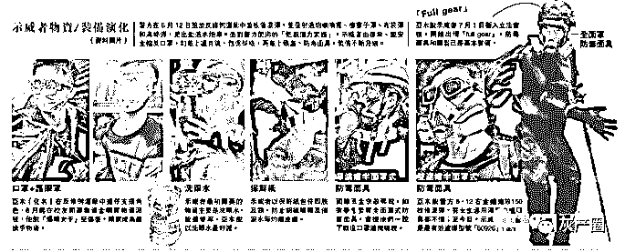

“股东们”为何出手阔绰、一掷千金?

“输血”当然不是为了做慈善。修例风波中，美西方反华势力及香港本土的“祸港乱港”分子，扮演了极不光彩的角色。他们心怀鬼胎，不断借所谓“自由、民主、人权”议题挑起事端，都打着自己的小算盘。

**本质上，向香港“输血”的最终目的，就是想在搞乱“香港”的过程中，从香港身上吸走更多的血，实现自己的利益。**

香港本土的各个团体组织及“港独”分子，他们从接受资金、募集资金到输出资金，归根结底都可以概括为两个字——生意。各个团体组织为了扩大影响力，需要人员和钱财；反对派议员和“港独”分子为了政治资本、选票及个人财富，需要谋求其个人利益最大化。

例如，上面提到的 “612 人道支持基金”，资金使用情况已遭到质疑。有内部人透露，“612 基金”的很多资金，已“洗白”并被主要成员瓜分侵占。

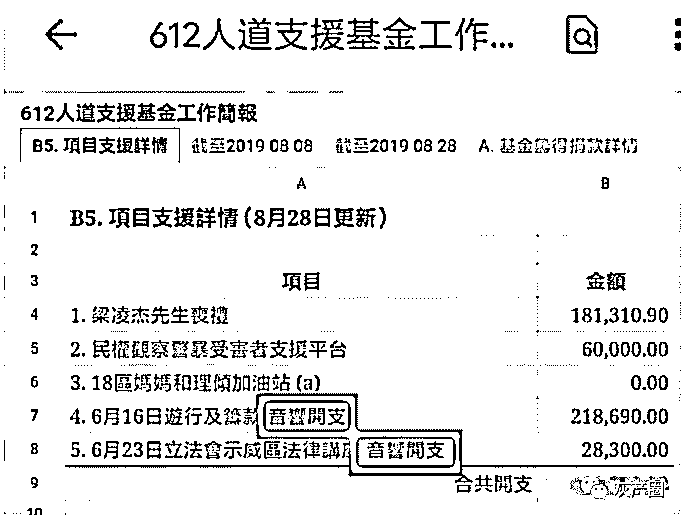

再比如，黄之锋利用“香港众志”，经常在互联网上呼吁网友“众筹”捐款，而账户却都是以黄之锋个人名义开户。

老话说：人为财死，鸟为食亡。“祸港乱港”分子所有的丑陋伎俩和表演，均暴露了一个特点：**为实现个人利益毫无底线和节操。**只是他们嘴里，却天天喊着为香港利益而战，怕是喊得多了，都快相信这些“鬼话”了……

**以利相交，利尽则散；****以势相交，势去则倾。**假以时日，当香港止暴制乱恢复平静，美西方反华势力在香港的利器出穷，“地下钱庄”必将作鸟兽散。

而冲在前线的香港青年暴徒，还在美滋滋地领着酬劳，殊不知他们使用暴力对香港造成的伤害，最终买单的，终归是每一位香港人，更包括他们自己！**现在收入的每一分钱，未来，必定会付出数倍的金额还回来！**

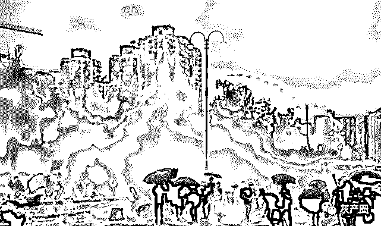

本文来自：中央政法委长安剑

来源：公众号“有理儿有面”

← 向右滑动与灰产圈互动交流 →

**阅读原文加入灰产圈高端社群**