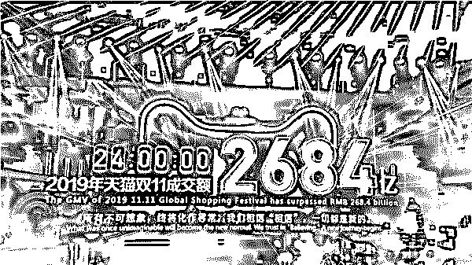
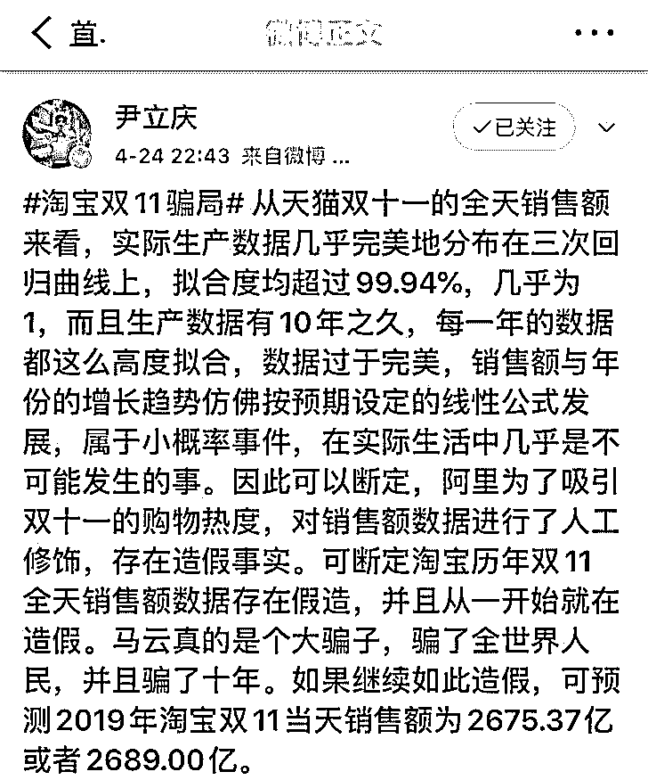
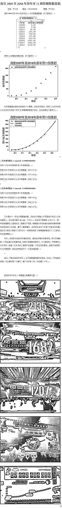
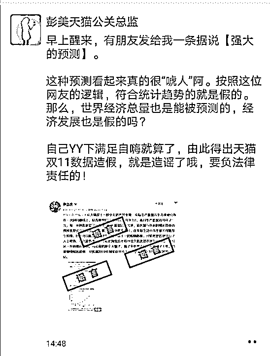
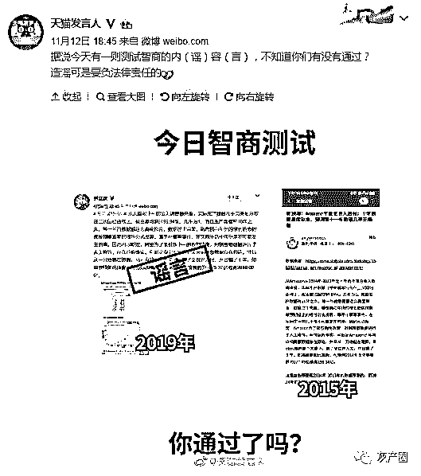
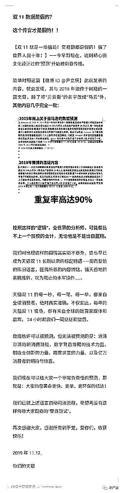
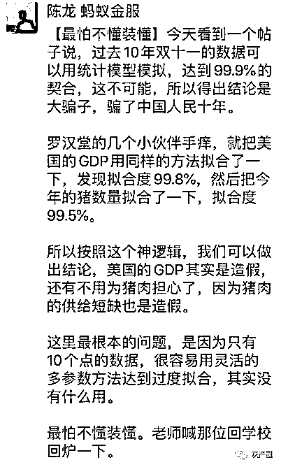
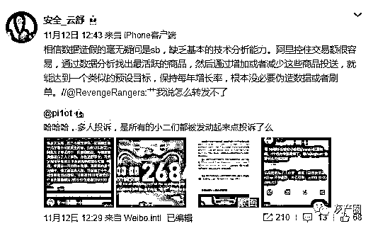

# 天猫“双 11”数据被质疑造假，淘宝回应：已启动司法流程

> 原文：[`mp.weixin.qq.com/s?__biz=MzIyMDYwMTk0Mw==&mid=2247496641&idx=1&sn=ac9e23afb8c6f0268e22ebef9695fcd2&chksm=97cb38f9a0bcb1ef534dd901c41ee8629396534e69eb7b460d8921d9f942ed72daf31aed6dfe&scene=27#wechat_redirect`](http://mp.weixin.qq.com/s?__biz=MzIyMDYwMTk0Mw==&mid=2247496641&idx=1&sn=ac9e23afb8c6f0268e22ebef9695fcd2&chksm=97cb38f9a0bcb1ef534dd901c41ee8629396534e69eb7b460d8921d9f942ed72daf31aed6dfe&scene=27#wechat_redirect)

**点击上方蓝色字体免费订阅“灰产圈”**

本文转载自：新浪科技，作者：大鹏

原标题：《网友质疑双 11 数据造假， 天猫：符合统计趋势就是造假？》

段落排序和图片略有改动

今天凌晨，天猫双 11 公布最终成交额为 2684 亿元，成功刷新了自己创下的商业纪录。

对于该成绩，有网友提出质疑，因为今年 4 月份的时候，有人**按照公式已经得出了 2019 年双 11 的大致成绩为 2689 亿元**，也正是这样的报告，引得不少网友再次围观了这个之前的帖子。

此前帖子的作者指出：

从天猫双 11 的全天销售额来看，实际生产数据几乎完美地分布在三次回归曲线上，**拟合度均超过 99.94%，几乎为 1，而且生产数据有 10 年之久**，每一年的数据都这么高度拟合，数据过于完美。

对此，天猫相关负责人回应称，“按照网友的逻辑，符合统计趋势的就是假的。那么，世界经济总量也是能被预测的，经济发展也是假的吗？自己 YY 下满足自嗨就算了，由此得出天猫双 11 数据造假，就**是造谣了哦，要负法律责任的！**”

1 月 12 日晚，天猫发言人微博也公开辟谣，调侃说该内容是“测试智商”的谣言。同时，该微博指出，上述博主在 2015 年就发出过一条对亚马逊数据的质疑，内文除了将“马云”名字换成了“贝索斯”，其它都一样。

同日深夜，天猫发言人再发长文回应此事，表示“天猫双 11 的每一秒、每一笔、每一单，都来自全球消费者，绝对真实有效”，“已就上述谣言启动司法流程，希望再没有这样侮辱大家智商的‘智商测试’。”

**业内人士发声**

**对于这一事件，不少业内人士均在网络上给出了分析**

前蚂蚁金服首席战略官、罗汉堂秘书长陈龙就在朋友圈发文称，美国的 GDP 用同样的方法拟合了一下，发现拟合度 99.8%，然后把今年的猪数量拟合了一下，拟合度 99.5%。

他强调：“这里（上述博主的文章）最根本的问题，是因为只有 10 个点的数据，很容易用灵活的多参数方法达到过度拟合，其实没有什么用。最怕不懂装懂。”

*图片来源：虎嗅*

微博认证为默安科技创始人兼 CTO、原阿里集团安全研究实验室总监的用户“安全 _ 云舒”也不同意“数据造假”一说，他指出，这是缺乏基本的技术分析能力。

该用户分析道：“阿里控住交易额很容易，通过数据分析找出最活跃的商品，然后通过增加或者减少这些商品投送，就能达到一个类似的预设目标，保持每年增长率，根本没必要伪造数据或者刷单。”

← 向右滑动与灰产圈互动交流 →

**阅读原文加入灰产圈高端社群**